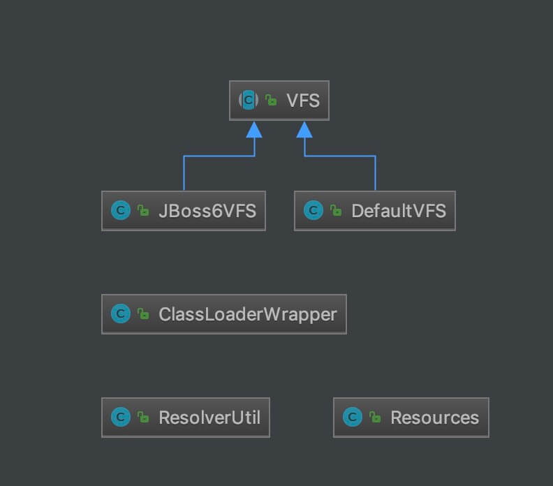

## 1. 概述

本文，我们来分享 MyBatis 的 IO 模块，对应 `io` 包。如下图所示：


在 [《精尽 MyBatis 源码解析 —— 项目结构一览》](http://svip.iocoder.cn/MyBatis/intro) 中，简单介绍了这个模块如下：

> 资源加载模块，主要是对类加载器进行封装，确定类加载器的使用顺序，并提供了加载类文件以及其他资源文件的功能 。

本文涉及的类如下图所示：



## 2. ClassLoaderWrapper

`org.apache.ibatis.io.ClassLoaderWrapper` ，ClassLoader 包装器。可使用多个 ClassLoader 加载对应的资源，直到有一成功后返回资源。

### 2.1 构造方法

```java
// ClassLoaderWrapper.java

/**
 * 默认 ClassLoader 对象
 */
ClassLoader defaultClassLoader;
/**
 * 系统 ClassLoader 对象
 */
ClassLoader systemClassLoader;

ClassLoaderWrapper() {
    try {
        systemClassLoader = ClassLoader.getSystemClassLoader();
    } catch (SecurityException ignored) {
        // AccessControlException on Google App Engine
    }
}
```

* `defaultClassLoader` 属性，默认 ClassLoader 对象。目前不存在初始化该属性的构造方法。可通过 `ClassLoaderWrapper.defaultClassLoader = xxx` 的方式，进行设置。
* `systemClassLoader` 属性，系统 ClassLoader 对象。在构造方法中，已经初始化。

### 2.2 getClassLoaders

`#getClassLoaders(ClassLoader classLoader)` 方法，获得 ClassLoader 数组。代码如下：

```java
// ClassLoaderWrapper.java

ClassLoader[] getClassLoaders(ClassLoader classLoader) {
    return new ClassLoader[]{
            classLoader,
            defaultClassLoader,
            Thread.currentThread().getContextClassLoader(),
            getClass().getClassLoader(),
            systemClassLoader};
}
```

### 2.3 getResourceAsURL

`#getResourceAsURL(String resource, ...)` 方法，获得指定资源的 URL 。代码如下：

```java
// ClassLoaderWrapper.java

/**
 * Get a resource as a URL using the current class path
 *
 * @param resource - the resource to locate
 * @return the resource or null
 */
public URL getResourceAsURL(String resource) {
    return getResourceAsURL(resource, getClassLoaders(null));
}
 
/**
 * Get a resource from the classpath, starting with a specific class loader
 *
 * @param resource    - the resource to find
 * @param classLoader - the first classloader to try
 * @return the stream or null
 */
public URL getResourceAsURL(String resource, ClassLoader classLoader) {
    return getResourceAsURL(resource, getClassLoaders(classLoader));
}
```

先调用 `#getClassLoaders(ClassLoader classLoader)` 方法，获得 ClassLoader 数组。

再调用 `#getResourceAsURL(String resource, ClassLoader[] classLoader)` 方法，获得指定资源的 InputStream 。代码如下：

```java
// ClassLoaderWrapper.java

/**
 * Get a resource as a URL using the current class path
 *
 * @param resource    - the resource to locate
 * @param classLoader - the class loaders to examine
 * @return the resource or null
 */
URL getResourceAsURL(String resource, ClassLoader[] classLoader) {
    URL url;
    // 遍历 ClassLoader 数组
    for (ClassLoader cl : classLoader) {
        if (null != cl) {
            // 获得 URL ，不带 /
            // look for the resource as passed in...
            url = cl.getResource(resource);
            // 获得 URL ，带 /
            // ...but some class loaders want this leading "/", so we'll add it
            // and try again if we didn't find the resource
            if (null == url) {
                url = cl.getResource("/" + resource);
            }

            // "It's always in the last place I look for it!"
            // ... because only an idiot would keep looking for it after finding it, so stop looking already.
            // 成功获得到，返回
            if (null != url) {
                return url;
            }

        }
    }
    // didn't find it anywhere.
    return null;
}
```

### 2.4 getResourceAsStream

`#getResourceAsStream(String resource, ...)` 方法，获得指定资源的 InputStream 对象。代码如下：

```java
// ClassLoaderWrapper.java

/**
 * Get a resource from the classpath
 *
 * @param resource - the resource to find
 * @return the stream or null
 */
public InputStream getResourceAsStream(String resource) {
    return getResourceAsStream(resource, getClassLoaders(null));
}

/**
 * Get a resource from the classpath, starting with a specific class loader
 *
 * @param resource    - the resource to find
 * @param classLoader - the first class loader to try
 * @return the stream or null
 */
public InputStream getResourceAsStream(String resource, ClassLoader classLoader) {
    return getResourceAsStream(resource, getClassLoaders(classLoader));
}
```

先调用 `#getClassLoaders(ClassLoader classLoader)` 方法，获得 ClassLoader 数组。

再调用 `#getResourceAsStream(String resource, ClassLoader[] classLoader)` 方法，获得指定资源的 InputStream 。代码如下：

```java
// ClassLoaderWrapper.java

InputStream getResourceAsStream(String resource, ClassLoader[] classLoader) {
    // 遍历 ClassLoader 数组
    for (ClassLoader cl : classLoader) {
        if (null != cl) {
            // 获得 InputStream ，不带 /
            // try to find the resource as passed
            InputStream returnValue = cl.getResourceAsStream(resource);
            // now, some class loaders want this leading "/", so we'll add it and try again if we didn't find the resource
            // 获得 InputStream ，带 /
            if (null == returnValue) {
                returnValue = cl.getResourceAsStream("/" + resource);
            }

            // 成功获得到，返回
            if (null != returnValue) {
                return returnValue;
            }
        }
    }
    return null;
}
```

可使用多个 ClassLoader 加载对应的资源，直到有一成功后返回资源。

### 2.5 classForName

`#classForName(String name, ...)` 方法，获得指定类名对应的类。代码如下：

```java
// ClassLoaderWrapper.java

/**
 * Find a class on the classpath (or die trying)
 *
 * @param name - the class to look for
 * @return - the class
 * @throws ClassNotFoundException Duh.
 */
public Class<?> classForName(String name) throws ClassNotFoundException {
    return classForName(name, getClassLoaders(null));
}

/**
 * Find a class on the classpath, starting with a specific classloader (or die trying)
 *
 * @param name        - the class to look for
 * @param classLoader - the first classloader to try
 * @return - the class
 * @throws ClassNotFoundException Duh.
 */
public Class<?> classForName(String name, ClassLoader classLoader) throws ClassNotFoundException {
    return classForName(name, getClassLoaders(classLoader));
}
```

先调用 `#getClassLoaders(ClassLoader classLoader)` 方法，获得 ClassLoader 数组。

再调用 `#classForName(String name, ClassLoader[] classLoader)` 方法，获得指定类名对应的类。代码如下：

```java
// ClassLoaderWrapper.java

Class<?> classForName(String name, ClassLoader[] classLoader) throws ClassNotFoundException {
    // 遍历 ClassLoader 数组
    for (ClassLoader cl : classLoader) {
        if (null != cl) {
            try {
                // 获得类
                Class<?> c = Class.forName(name, true, cl);

                // 成功获得到，返回
                if (null != c) {
                    return c;
                }
            } catch (ClassNotFoundException e) {
                // we'll ignore this until all classloaders fail to locate the class
            }
        }
    }
    // 获得不到，抛出 ClassNotFoundException 异常
    throw new ClassNotFoundException("Cannot find class: " + name);
}
```

可使用多个 ClassLoader 加载对应的类，直到有一成功后返回类。

## 3. Resources

`org.apache.ibatis.io.Resources` ，Resource 工具类。

### 3.1 构造方法

```java
// Resources.java

/**
 * ClassLoaderWrapper 对象
 */
private static ClassLoaderWrapper classLoaderWrapper = new ClassLoaderWrapper();

/**
 * 字符集
 */
private static Charset charset;

Resources() {
}

public static void setDefaultClassLoader(ClassLoader defaultClassLoader) {defaultClassLoader
    classLoaderWrapper.defaultClassLoader = defaultClassLoader; // 修改 ClassLoaderWrapper.
}

public static void setCharset(Charset charset) {
    Resources.charset = charset;
}
```

### 3.2 getResource

基于 `classLoaderWrapper` 属性的封装。

#### 3.2.1 getResourceURL

`#getResourceURL(String resource)` **静态**方法，获得指定资源的 URL 。代码如下：

```java
// Resources.java

public static URL getResourceURL(String resource) throws IOException {
    // issue #625
    return getResourceURL(null, resource);
}

public static URL getResourceURL(ClassLoader loader, String resource) throws IOException {
    URL url = classLoaderWrapper.getResourceAsURL(resource, loader);
    if (url == null) {
        throw new IOException("Could not find resource " + resource);
    }
    return url;
}
```

#### 3.2.2 getResourceAsStream

`#getResourceAsStream(String resource)` **静态**方法，获得指定资源的 InputStream 。代码如下：

```java
// Resources.java

public static InputStream getResourceAsStream(String resource) throws IOException {
    return getResourceAsStream(null, resource);
}

public static InputStream getResourceAsStream(ClassLoader loader, String resource) throws IOException {
    InputStream in = classLoaderWrapper.getResourceAsStream(resource, loader);
    if (in == null) {
        throw new IOException("Could not find resource " + resource);
    }
    return in;
}
```

#### 3.2.3 getResourceAsReader

`#getResourceAsReader(String resource)` **静态**方法，获得指定资源的 Reader 。代码如下：

```java
// Resources.java

public static Reader getResourceAsReader(String resource) throws IOException {
    Reader reader;
    if (charset == null) {
        reader = new InputStreamReader(getResourceAsStream(resource));
    } else {
        reader = new InputStreamReader(getResourceAsStream(resource), charset);
    }
    return reader;
}

public static Reader getResourceAsReader(ClassLoader loader, String resource) throws IOException {
    Reader reader;
    if (charset == null) {
        reader = new InputStreamReader(getResourceAsStream(loader, resource));
    } else {
        reader = new InputStreamReader(getResourceAsStream(loader, resource), charset);
    }
    return reader;
}
```

#### 3.2.4 getResourceAsFile

`#getResourceAsFile(String resource)` **静态**方法，获得指定资源的 File 。代码如下：

```java
// Resources.java

public static File getResourceAsFile(String resource) throws IOException {
    return new File(getResourceURL(resource).getFile());
}

public static File getResourceAsFile(ClassLoader loader, String resource) throws IOException {
    return new File(getResourceURL(loader, resource).getFile());
}
```

基于 `classLoaderWrapper` 属性的封装。

#### 3.2.5 getResourceAsProperties

`#getResourceAsProperties(ClassLoader loader)` **静态**方法，获得指定资源的 Properties 。代码如下：

```java
// Resources.java

public static Properties getResourceAsProperties(String resource) throws IOException {
    Properties props = new Properties();
    // 读取
    try (InputStream in = getResourceAsStream(resource)) {
        props.load(in);
    }
    return props;
}

public static Properties getResourceAsProperties(ClassLoader loader, String resource) throws IOException {
    Properties props = new Properties();
    // 读取
    try (InputStream in = getResourceAsStream(loader, resource)) {
        props.load(in);
    }
    return props;
}
```

### 3.3 getUrl

#### 3.3.1 getUrlAsStream

`#getUrlAsStream(String urlString)` **静态**方法，获得指定 URL 。代码如下：

```java
// Resources.java

public static InputStream getUrlAsStream(String urlString) throws IOException {
    URL url = new URL(urlString);
    // 打开 URLConnection
    URLConnection conn = url.openConnection();
    return conn.getInputStream();
}
```

#### 3.3.2 getUrlAsReader

`#getUrlAsReader(String urlString)` **静态**方法，指定 URL 的 Reader 。代码如下：

```java
// Resources.java

public static Reader getUrlAsReader(String urlString) throws IOException {
    Reader reader;
    if (charset == null) {
        reader = new InputStreamReader(getUrlAsStream(urlString));
    } else {
        reader = new InputStreamReader(getUrlAsStream(urlString), charset);
    }
    return reader;
}
```

#### 3.3.3 getUrlAsProperties

`#getUrlAsReader(String urlString)` **静态**方法，指定 URL 的 Properties 。代码如下：

```java
// Resources.java

public static Properties getUrlAsProperties(String urlString) throws IOException {
    Properties props = new Properties();
    try (InputStream in = getUrlAsStream(urlString)) {
        props.load(in);
    }
    return props;
}
```

### 3.4 classForName

`#classForName(String className)` **静态**方法，获得指定类名对应的类。代码如下：

```java
// Resources.java

public static Class<?> classForName(String className) throws ClassNotFoundException {
    return classLoaderWrapper.classForName(className);
}
```

## 4. ResolverUtil

`org.apache.ibatis.io.ResolverUtil` ，解析器工具类，用于获得指定目录**符合条件**的类们。

### 4.1 Test

Test ，匹配判断接口。代码如下：

```java
// ResolverUtil.java 内部类

/**
 * A simple interface that specifies how to test classes to determine if they
 * are to be included in the results produced by the ResolverUtil.
 */
public interface Test {

    /**
     * Will be called repeatedly with candidate classes. Must return True if a class
     * is to be included in the results, false otherwise.
     */
    boolean matches(Class<?> type);

}
```

#### 4.1.1 IsA

IsA ，实现 Test 接口，判断是否为指定类。代码如下：

```java
// ResolverUtil.java 内部类

/**
 * A Test that checks to see if each class is assignable to the provided class. Note
 * that this test will match the parent type itself if it is presented for matching.
 */
public static class IsA implements Test {

    /**
     * 指定类
     */
    private Class<?> parent;

    /** Constructs an IsA test using the supplied Class as the parent class/interface. */
    public IsA(Class<?> parentType) {
        this.parent = parentType;
    }

    /** Returns true if type is assignable to the parent type supplied in the constructor. */
    @Override
    public boolean matches(Class<?> type) {
        return type != null && parent.isAssignableFrom(type);
    }

}
```

#### 4.1.2 AnnotatedWith

AnnotatedWith ，判断是否有指定注解。代码如下：

```java
// ResolverUtil.java 内部类

/**
 * A Test that checks to see if each class is annotated with a specific annotation. If it
 * is, then the test returns true, otherwise false.
 */
public static class AnnotatedWith implements Test {

    /**
     * 注解
     */
    private Class<? extends Annotation> annotation;

    /** Constructs an AnnotatedWith test for the specified annotation type. */
    public AnnotatedWith(Class<? extends Annotation> annotation) {
        this.annotation = annotation;
    }

    /** Returns true if the type is annotated with the class provided to the constructor. */
    @Override
    public boolean matches(Class<?> type) {
        return type != null && type.isAnnotationPresent(annotation);
    }

}
```

### 4.2 构造方法

```java
// ResolverUtil.java

/** The set of matches being accumulated. */
private Set<Class<? extends T>> matches = new HashSet<>(); // 符合条件的类的集合

private ClassLoader classloader;

public Set<Class<? extends T>> getClasses() {
    return matches;
}

public ClassLoader getClassLoader() {
    return classloader == null ? Thread.currentThread().getContextClassLoader() : classloader;
}
public void setClassLoader(ClassLoader classloader) {
    this.classloader = classloader;
}
```

### 4.3 find

`#find(Test test, String packageName)` 方法，获得指定包下，符合条件的类。代码如下：

```java
// ResolverUtil.java

public ResolverUtil<T> find(Test test, String packageName) {
    // <1> 获得包的路径
    String path = getPackagePath(packageName);

    try {
        // <2> 获得路径下的所有文件
        List<String> children = VFS.getInstance().list(path);
        // <3> 遍历
        for (String child : children) {
            // 是 Java Class
            if (child.endsWith(".class")) {
                // 如果匹配，则添加到结果集
                addIfMatching(test, child);
            }
        }
    } catch (IOException ioe) {
        log.error("Could not read package: " + packageName, ioe);
    }

    return this;
}
```

`<1>` 处，调用 `#getPackagePath(String packageName)` 方法，获得包的路径。代码如下：

```java
// ResolverUtil.java

protected String getPackagePath(String packageName) {
    return packageName == null ? null : packageName.replace('.', '/');
}
```

`<2>` 处，获得路径下的所有文件。详细解析，见 [「5. VFS」](http://svip.iocoder.cn/MyBatis/io-package/#) 。

`<3>` 处，遍历 Java Class 文件，调用 `#addIfMatching(Test test, String fqn)` 方法，如果匹配，则添加到结果集。代码如下：

```java
// ResolverUtil.java

protected void addIfMatching(Test test, String fqn) {
    try {
        // 获得全类名
        String externalName = fqn.substring(0, fqn.indexOf('.')).replace('/', '.');
        ClassLoader loader = getClassLoader();
        if (log.isDebugEnabled()) {
            log.debug("Checking to see if class " + externalName + " matches criteria [" + test + "]");
        }

        // 加载类
        Class<?> type = loader.loadClass(externalName);

        // 判断是否匹配
        if (test.matches(type)) {
            matches.add((Class<T>) type);
        }
    } catch (Throwable t) {
        log.warn("Could not examine class '" + fqn + "'" + " due to a " +
                t.getClass().getName() + " with message: " + t.getMessage());
    }
}
```

使用对应的 `test` 的进行匹配。

#### 4.3.1 findImplementations

`#findImplementations(Class<?> parent, String... packageNames)` 方法，判断指定目录下**们**，符合**指定类**的类们。代码如下：

```java
// ResolverUtil.java

public ResolverUtil<T> findImplementations(Class<?> parent, String... packageNames) {
    if (packageNames == null) {
        return this;
    }

    Test test = new IsA(parent);
    for (String pkg : packageNames) {
        find(test, pkg);
    }

    return this;
}
```

#### 4.3.2 findAnnotated

`#findAnnotated(Class<? extends Annotation> annotation, String... packageNames)` 方法，判断指定目录下**们**，符合**指定注解**的类们。代码如下：

```java
// ResolverUtil.java

public ResolverUtil<T> findAnnotated(Class<? extends Annotation> annotation, String... packageNames) {
    if (packageNames == null) {
        return this;
    }

    Test test = new AnnotatedWith(annotation);
    for (String pkg : packageNames) {
        find(test, pkg);
    }

    return this;
}
```

## 5. VFS

`org.apache.ibatis.io.VFS` ，虚拟文件系统( Virtual File System )**抽象类**，用来查找指定路径下的的文件们。

### 5.1 静态属性

```java
// VFS.java

/** The built-in implementations. */
public static final Class<?>[] IMPLEMENTATIONS = {JBoss6VFS.class, DefaultVFS.class}; // 内置的 VFS 实现类的数组

/** The list to which implementations are added by {@link #addImplClass(Class)}. */
public static final List<Class<? extends VFS>> USER_IMPLEMENTATIONS = new ArrayList<>(); // 自定义的 VFS 实现类的数组

public static void addImplClass(Class<? extends VFS> clazz) {
    if (clazz != null) {
        USER_IMPLEMENTATIONS.add(clazz);
    }
}
```

* `IMPLEMENTATIONS` **静态**属性，内置的 VFS 实现类的数组。目前 VFS 有 JBoss6VFS 和 DefaultVFS 两个实现类。
* `USER_IMPLEMENTATIONS` **静态**属性，自定义的 VFS 实现类的数组。可通过 `#addImplClass(Class<? extends VFS> clazz)` 方法，进行添加。

### 5.2 getInstance

`#getInstance()` 方法，获得 VFS 单例。代码如下：

```java
// VFS.java

public static VFS getInstance() {
    return VFSHolder.INSTANCE;
}

private static class VFSHolder {

    static final VFS INSTANCE = createVFS();

    @SuppressWarnings("unchecked")
    static VFS createVFS() {
        // Try the user implementations first, then the built-ins
        List<Class<? extends VFS>> impls = new ArrayList<>();
        impls.addAll(USER_IMPLEMENTATIONS);
        impls.addAll(Arrays.asList((Class<? extends VFS>[]) IMPLEMENTATIONS));

        // Try each implementation class until a valid one is found
        // 创建 VFS 对象，选择最后一个符合的
        VFS vfs = null;
        for (int i = 0; vfs == null || !vfs.isValid(); i++) {
            Class<? extends VFS> impl = impls.get(i);
            try {
                vfs = impl.newInstance();
                if (vfs == null || !vfs.isValid()) {
                    if (log.isDebugEnabled()) {
                        log.debug("VFS implementation " + impl.getName() +
                                " is not valid in this environment.");
                    }
                }
            } catch (InstantiationException | IllegalAccessException e) {
                log.error("Failed to instantiate " + impl, e);
                return null;
            }
        }

        if (log.isDebugEnabled()) {
            log.debug("Using VFS adapter " + vfs.getClass().getName());
        }

        return vfs;
    }
}
```

单例有多种实现方式，该类采用的是“懒汉式，线程安全”，感兴趣的胖友，可以看看 [《单例模式的七种写法》](http://cantellow.iteye.com/blog/838473) 。

`INSTANCE` 属性，最后通过 `#createVFS()` **静态**方法来创建，虽然 `USER_IMPLEMENTATIONS` 和 `IMPLEMENTATIONS` 有多种 VFS 的实现类，但是最终选择的是，**最后一个符合**的创建的 VFS 对象。

### 5.3 反射相关方法

因为 VFS 自己有反射调用方法的需求，所以自己实现了三个方法。代码如下：

```java
// VFS.java

protected static Class<?> getClass(String className) {
    try {
        return Thread.currentThread().getContextClassLoader().loadClass(className);
    } catch (ClassNotFoundException e) {
        if (log.isDebugEnabled()) {
            log.debug("Class not found: " + className);
        }
        return null;
    }
}

protected static Method getMethod(Class<?> clazz, String methodName, Class<?>... parameterTypes) {
    if (clazz == null) {
        return null;
    }
    try {
        return clazz.getMethod(methodName, parameterTypes);
    } catch (SecurityException e) {
        log.error("Security exception looking for method " + clazz.getName() + "." + methodName + ".  Cause: " + e);
        return null;
    } catch (NoSuchMethodException e) {
        log.error("Method not found " + clazz.getName() + "." + methodName + "." + methodName + ".  Cause: " + e);
        return null;
    }
}

protected static <T> T invoke(Method method, Object object, Object... parameters)
        throws IOException, RuntimeException {
    try {
        return (T) method.invoke(object, parameters);
    } catch (IllegalArgumentException | IllegalAccessException e) {
        throw new RuntimeException(e);
    } catch (InvocationTargetException e) {
        if (e.getTargetException() instanceof IOException) {
            throw (IOException) e.getTargetException();
        } else {
            throw new RuntimeException(e);
        }
    }
}
```

### 5.4 isValid

`#isValid()` **抽象**方法，判断是否为合法的 VFS 。代码如下：

```java
// VFS.java

/** Return true if the {@link VFS} implementation is valid for the current environment. */
public abstract boolean isValid();
```

该方法由子类实现。

### 5.5 list

`#list(String path)` 方法，获得指定路径下的所有资源。代码如下：

```java
// VFS.java

public List<String> list(String path) throws IOException {
    List<String> names = new ArrayList<>();
    for (URL url : getResources(path)) {
        names.addAll(list(url, path));
    }
    return names;
}
```

先调用 `#getResources(String path)` **静态**方法，获得指定路径下的 URL 数组。代码如下：

```java
// VFS.java

protected static List<URL> getResources(String path) throws IOException {
    return Collections.list(Thread.currentThread().getContextClassLoader().getResources(path));
}
```

后遍历 URL 数组，调用 `#list(URL url, String forPath)` 方法，**递归**的列出所有的资源们。代码如下：

```java
// VFS.java

/**
 * Recursively list the full resource path of all the resources that are children of the
 * resource identified by a URL.
 *
 * @param url The URL that identifies the resource to list.
 * @param forPath The path to the resource that is identified by the URL. Generally, this is the
 *            value passed to {@link #getResources(String)} to get the resource URL.
 * @return A list containing the names of the child resources.
 * @throws IOException If I/O errors occur
 */
protected abstract List<String> list(URL url, String forPath) throws IOException;
```

该方法由子类进行实现。

### 5.5 DefaultVFS

`org.apache.ibatis.io.DefaultVFS` ，继承 VFS 抽象类，默认的 VFS 实现类。

#### 5.5.1 isValid

```java
// DefaultVFS.java

@Override
public boolean isValid() {
    return true;
}
```

都返回 `true` ，因为默认支持。

#### 5.5.2 list

`#list(URL url, String path)` 方法，**递归**的列出所有的资源们。代码如下：

```java
// DefaultVFS.java

@Override
public List<String> list(URL url, String path) throws IOException {
    InputStream is = null;
    try {
        List<String> resources = new ArrayList<>();

        // First, try to find the URL of a JAR file containing the requested resource. If a JAR
        // file is found, then we'll list child resources by reading the JAR.
        // 如果 url 指向的是 Jar Resource ，则返回该 Jar Resource ，否则返回 null
        URL jarUrl = findJarForResource(url);
        if (jarUrl != null) {
            is = jarUrl.openStream();
            if (log.isDebugEnabled()) {
                log.debug("Listing " + url);
            }
            // 遍历 Jar Resource
            resources = listResources(new JarInputStream(is), path);
        } else {
            List<String> children = new ArrayList<>();
            try {
                // 判断为 JAR URL
                if (isJar(url)) {
                    // Some versions of JBoss VFS might give a JAR stream even if the resource
                    // referenced by the URL isn't actually a JAR
                    is = url.openStream();
                    try (JarInputStream jarInput = new JarInputStream(is)) {
                        if (log.isDebugEnabled()) {
                            log.debug("Listing " + url);
                        }
                        for (JarEntry entry; (entry = jarInput.getNextJarEntry()) != null; ) {
                            if (log.isDebugEnabled()) {
                                log.debug("Jar entry: " + entry.getName());
                            }
                            children.add(entry.getName());
                        }
                    }
                } else {
                    /*
                     * Some servlet containers allow reading from directory resources like a
                     * text file, listing the child resources one per line. However, there is no
                     * way to differentiate between directory and file resources just by reading
                     * them. To work around that, as each line is read, try to look it up via
                     * the class loader as a child of the current resource. If any line fails
                     * then we assume the current resource is not a directory.
                     */
                    // 【重点】<1> 获得路径下的所有资源
                    is = url.openStream();
                    BufferedReader reader = new BufferedReader(new InputStreamReader(is));
                    List<String> lines = new ArrayList<>();
                    for (String line; (line = reader.readLine()) != null; ) {
                        if (log.isDebugEnabled()) {
                            log.debug("Reader entry: " + line);
                        }
                        lines.add(line);
                        if (getResources(path + "/" + line).isEmpty()) {
                            lines.clear();
                            break;
                        }
                    }

                    if (!lines.isEmpty()) {
                        if (log.isDebugEnabled()) {
                            log.debug("Listing " + url);
                        }
                        children.addAll(lines);
                    }
                }
            } catch (FileNotFoundException e) {
                /*
                 * For file URLs the openStream() call might fail, depending on the servlet
                 * container, because directories can't be opened for reading. If that happens,
                 * then list the directory directly instead.
                 */
                if ("file".equals(url.getProtocol())) {
                    File file = new File(url.getFile());
                    if (log.isDebugEnabled()) {
                        log.debug("Listing directory " + file.getAbsolutePath());
                    }
                    if (file.isDirectory()) {
                        if (log.isDebugEnabled()) {
                            log.debug("Listing " + url);
                        }
                        children = Arrays.asList(file.list());
                    }
                } else {
                    // No idea where the exception came from so rethrow it
                    throw e;
                }
            }

            // The URL prefix to use when recursively listing child resources
            // 【重点】<2> 计算 prefix
            String prefix = url.toExternalForm();
            if (!prefix.endsWith("/")) {
                prefix = prefix + "/";
            }

            // Iterate over immediate children, adding files and recursing into directories
            // 【重点】 <2> 遍历子路径
            for (String child : children) {
                // 添加到 resources 中
                String resourcePath = path + "/" + child;
                resources.add(resourcePath);
                // 递归遍历子路径，并将结果添加到 resources 中
                URL childUrl = new URL(prefix + child);
                resources.addAll(list(childUrl, resourcePath));
            }
        }

        return resources;
    } finally {
        // 关闭文件流
        if (is != null) {
            try {
                is.close();
            } catch (Exception e) {
                // Ignore
            }
        }
    }
}
```

代码有点长，重点读懂 `<1>` 和 `<2>` 处的代码，基本就可以了。大体逻辑就是，不断递归文件夹，获得到所有文件。设计到对 Jar 的处理，感兴趣的胖友，可以自己理解下。

`#findJarForResource(URL url)` 方法，如果 `url` 指向的是 Jar Resource ，则返回该 Jar Resource ，否则返回 `null` 。代码如下：

```java
// DefaultVFS.java

protected URL findJarForResource(URL url) throws MalformedURLException {
    if (log.isDebugEnabled()) {
        log.debug("Find JAR URL: " + url);
    }

    // If the file part of the URL is itself a URL, then that URL probably points to the JAR
    // 这段代码看起来比较神奇，虽然看起来没有 break 的条件，但是是通过 MalformedURLException 异常进行
    // 正如上面英文注释，如果 URL 的文件部分本身就是 URL ，那么该 URL 可能指向 JAR
    try {
        for (; ; ) {
            url = new URL(url.getFile());
            if (log.isDebugEnabled()) {
                log.debug("Inner URL: " + url);
            }
        }
    } catch (MalformedURLException e) {
        // This will happen at some point and serves as a break in the loop
    }

    // Look for the .jar extension and chop off everything after that
    // 判断是否意 .jar 结尾
    StringBuilder jarUrl = new StringBuilder(url.toExternalForm());
    int index = jarUrl.lastIndexOf(".jar");
    if (index >= 0) {
        jarUrl.setLength(index + 4);
        if (log.isDebugEnabled()) {
            log.debug("Extracted JAR URL: " + jarUrl);
        }
    } else {
        if (log.isDebugEnabled()) {
            log.debug("Not a JAR: " + jarUrl);
        }
        return null; // 如果不以 .jar 结尾，则直接返回 null
    }

    // Try to open and test it
    try {
        URL testUrl = new URL(jarUrl.toString());
        // 判断是否为 Jar 文件
        if (isJar(testUrl)) {
            return testUrl;
        } else {
            // WebLogic fix: check if the URL's file exists in the filesystem.
            if (log.isDebugEnabled()) {
                log.debug("Not a JAR: " + jarUrl);
            }
            // 获得文件
            jarUrl.replace(0, jarUrl.length(), testUrl.getFile()); // 替换
            File file = new File(jarUrl.toString());
            // File name might be URL-encoded
            if (!file.exists()) { // 处理路径编码问题
                try {
                    file = new File(URLEncoder.encode(jarUrl.toString(), "UTF-8"));
                } catch (UnsupportedEncodingException e) {
                    throw new RuntimeException("Unsupported encoding?  UTF-8?  That's unpossible.");
                }
            }

            // 判断文件存在
            if (file.exists()) {
                if (log.isDebugEnabled()) {
                    log.debug("Trying real file: " + file.getAbsolutePath());
                }
                testUrl = file.toURI().toURL();
                // 判断是否为 Jar 文件
                if (isJar(testUrl)) {
                    return testUrl;
                }
            }
        }
    } catch (MalformedURLException e) {
        log.warn("Invalid JAR URL: " + jarUrl);
    }

    if (log.isDebugEnabled()) {
        log.debug("Not a JAR: " + jarUrl);
    }
    return null;
}
```

会判断要求，`url` 以 `.jar` 结尾。

`#isJar(URL url)` 方法，判断是否为 JAR URL 。代码如下：

```java
// DefaultVFS.java

/** The magic header that indicates a JAR (ZIP) file. */
private static final byte[] JAR_MAGIC = {'P', 'K', 3, 4};

protected boolean isJar(URL url) {
    return isJar(url, new byte[JAR_MAGIC.length]);
}

protected boolean isJar(URL url, byte[] buffer) {
    InputStream is = null;
    try {
        is = url.openStream();
        // 读取文件头
        is.read(buffer, 0, JAR_MAGIC.length);
        // 判断文件头的 magic number 是否符合 JAR
        if (Arrays.equals(buffer, JAR_MAGIC)) {
            if (log.isDebugEnabled()) {
                log.debug("Found JAR: " + url);
            }
            return true;
        }
    } catch (Exception e) {
        // Failure to read the stream means this is not a JAR
    } finally {
        if (is != null) {
            try {
                is.close();
            } catch (Exception e) {
                // Ignore
            }
        }
    }
    return false;
}
```

`#listResources(JarInputStream jar, String path)` 方法，遍历 Jar Resource 。代码如下：

```java
// DefaultVFS.java

protected List<String> listResources(JarInputStream jar, String path) throws IOException {
    // Include the leading and trailing slash when matching names
    // 保证头尾都是 /
    if (!path.startsWith("/")) {
        path = "/" + path;
    }
    if (!path.endsWith("/")) {
        path = path + "/";
    }

    // Iterate over the entries and collect those that begin with the requested path
    // 遍历条目并收集以请求路径开头的条目
    List<String> resources = new ArrayList<>();
    for (JarEntry entry; (entry = jar.getNextJarEntry()) != null; ) {
        if (!entry.isDirectory()) {
            // Add leading slash if it's missing
            String name = entry.getName();
            if (!name.startsWith("/")) {
                name = "/" + name;
            }

            // Check file name
            if (name.startsWith(path)) {
                if (log.isDebugEnabled()) {
                    log.debug("Found resource: " + name);
                }
                // Trim leading slash
                resources.add(name.substring(1));
            }
        }
    }
    return resources;
}
```

### 5.6 JBoss6VFS

`org.apache.ibatis.io.JBoss6VFS` ，继承 VFS 抽象类，基于 JBoss 的 VFS 实现类。使用时，需要引入如下：

```xml
<dependency>
    <groupId>org.jboss</groupId>
    <artifactId>jboss-vfs</artifactId>
    <version>${version></version>
</dependency>
```

因为实际基本没使用到，所以暂时不分析这个类。感兴趣的胖友，可以自己瞅瞅。还是简单的。
