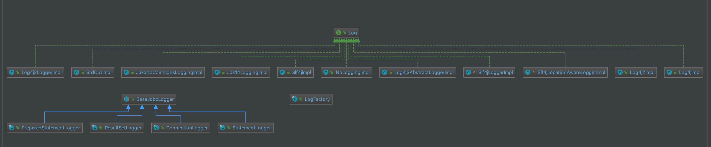

## 1. 概述

本文，我们来分享 MyBatis 的日志模块，对应 `logging` 包。如下图所示：


在 [《精尽 MyBatis 源码解析 —— 项目结构一览》](http://svip.iocoder.cn/MyBatis/intro) 中，简单介绍了这个模块如下：

> 无论在开发测试环境中，还是在线上生产环境中，日志在整个系统中的地位都是非常重要的。良好的日志功能可以帮助开发人员和测试人员快速定位 Bug 代码，也可以帮助运维人员快速定位性能瓶颈等问题。目前的 Java 世界中存在很多优秀的日志框架，例如 Log4j、 Log4j2、Slf4j 等。
>
> MyBatis 作为一个设计优良的框架，除了提供详细的日志输出信息，还要能够集成多种日志框架，其日志模块的一个主要功能就是**集成第三方日志框架**。

本文涉及的类如下图所示：



从图的**上面**部分，我们可以看到非常多的 Logger 类的实现，分别对应我们常用的日志框架 Log4j、Slf4j ，这就是 MyBatis 对这些日志框架的适配。

从图的**下面**部分，我们可以看到 BaseJdbcLogger 以及其四个子类，这个并不是将日志打印到数据库，而是 MyBatis 通过 JDK 动态代理的方式，将 JDBC 的操作，打印到日志中。即 [《设置Mybatis打印调试sql的两种方式》](https://blog.csdn.net/gao36951/article/details/53641432) 。

另外，[《MyBatis 文档 —— 日志》](http://www.mybatis.org/mybatis-3/zh/logging.html) 一文，也对日志模块做了简单的介绍，不熟悉这块的胖友，也可以看看。

## 2. LogFactory

`org.apache.ibatis.logging.LogFactory` ，Log 工厂类。

### 2.1 构造方法

```java
// LogFactory.java

/**
 * Marker to be used by logging implementations that support markers
 */
public static final String MARKER = "MYBATIS";

/**
 * 使用的 Log 的构造方法
 */
private static Constructor<? extends Log> logConstructor;

static {
    // <1> 逐个尝试，判断使用哪个 Log 的实现类，即初始化 logConstructor 属性
    tryImplementation(LogFactory::useSlf4jLogging);
    tryImplementation(LogFactory::useCommonsLogging);
    tryImplementation(LogFactory::useLog4J2Logging);
    tryImplementation(LogFactory::useLog4JLogging);
    tryImplementation(LogFactory::useJdkLogging);
    tryImplementation(LogFactory::useNoLogging);
}

private LogFactory() {
    // disable construction
}
```

`<1>` 处，我们可以看到，按照 Slf4j、CommonsLogging、Log4J2Logging、Log4JLogging、JdkLogging、NoLogging 的顺序，逐个尝试，判断使用哪个 Log 的实现类，即初始化 `logConstructor` 属性。

`#tryImplementation(Runnable runnable)` 方法，判断使用哪个 Log 的实现类。代码如下：

```java
// LogFactory.java

private static void tryImplementation(Runnable runnable) {
    if (logConstructor == null) {
        try {
            runnable.run();
        } catch (Throwable t) {
            // ignore
        }
    }
}
```

当 `logConstructor` 为空时，执行 `runnable` 的方法。那么，`runnable` 怎么来的呢。实际上，`<1>` 处，使用了 Lambda 表达式，所以看起来不是很清晰。即 `tryImplementation(LogFactory::useSlf4jLogging)` 代码块，对应为：

```java
tryImplementation(new Runnable() {
    @Override
    public void run() {
        LogFactory.useSlf4jLogging();
    }
});
```

这样，看起来是不是就清晰多了。

`#useSlf4jLogging()` 方法，尝试使用 Slf4j 。代码如下：

```java
// LogFactory.java

public static synchronized void useSlf4jLogging() {
    setImplementation(org.apache.ibatis.logging.slf4j.Slf4jImpl.class);
}
```

在该方法内部，会调用 `#setImplementation(Class<? extends Log> implClass)` 方法，尝试使用指定的 Log 实现类，例如此处为 `org.apache.ibatis.logging.slf4j.Slf4jImpl` 。代码如下：

```java
// LogFactory.java

private static void setImplementation(Class<? extends Log> implClass) {
    try {
        // 获得参数为 String 的构造方法
        Constructor<? extends Log> candidate = implClass.getConstructor(String.class);
        // 创建 Log 对象
        Log log = candidate.newInstance(LogFactory.class.getName());
        if (log.isDebugEnabled()) {
            log.debug("Logging initialized using '" + implClass + "' adapter.");
        }
        // 创建成功，意味着可以使用，设置为 logConstructor
        logConstructor = candidate;
    } catch (Throwable t) {
        throw new LogException("Error setting Log implementation.  Cause: " + t, t);
    }
}
```

如果对应的类能创建成功，意味着可以使用，设置为 `logConstructor` 。也就是说，其它类，就不会执行到该方法啦。

其它 Log 类的该方法，代码如下：

```java
// LogFactory.java

public static synchronized void useCommonsLogging() {
    setImplementation(org.apache.ibatis.logging.commons.JakartaCommonsLoggingImpl.class);
}

public static synchronized void useLog4JLogging() {
    setImplementation(org.apache.ibatis.logging.log4j.Log4jImpl.class);
}

public static synchronized void useLog4J2Logging() {
    setImplementation(org.apache.ibatis.logging.log4j2.Log4j2Impl.class);
}

public static synchronized void useJdkLogging() {
    setImplementation(org.apache.ibatis.logging.jdk14.Jdk14LoggingImpl.class);
}

public static synchronized void useStdOutLogging() {
    setImplementation(org.apache.ibatis.logging.stdout.StdOutImpl.class);
}

public static synchronized void useNoLogging() {
    setImplementation(org.apache.ibatis.logging.nologging.NoLoggingImpl.class);
}
```

当然，也可以通过 `#useCustomLogging(Class<? extends Log> clazz)` 方法，设置自定义的 Log 实现类。代码如下：

```java
// LogFactory.java

public static synchronized void useCustomLogging(Class<? extends Log> clazz) {
    setImplementation(clazz);
}
```

这里的自定义，可以是你自己实现的 Log 类，也可以是上述的 MyBatis 内置的 Log 实现类。

### 2.2 getLog

`#getLog(...)` 方法，获得 Log 对象。代码如下：

```java
// LogFactory.java

public static Log getLog(Class<?> aClass) {
    return getLog(aClass.getName());
}

public static Log getLog(String logger) {
    try {
        return logConstructor.newInstance(logger);
    } catch (Throwable t) {
        throw new LogException("Error creating logger for logger " + logger + ".  Cause: " + t, t);
    }
}
```

## 3. Log

`org.apache.ibatis.logging.Log` ，MyBatis Log 接口。代码如下：

```java
// Log.java

public interface Log {

    boolean isDebugEnabled();

    boolean isTraceEnabled();

    void error(String s, Throwable e);

    void error(String s);

    void debug(String s);

    void trace(String s);

    void warn(String s);

}
```

Log 的实现类较多，我们就看看 Slf4jImpl 和 StdOutImpl 这两个实现类。

### 3.1 StdOutImpl

`org.apache.ibatis.logging.stdout.StdOutImpl` ，实现 Log 接口，StdOut 实现类。代码如下：

```java
// StdOutImpl.java

public class StdOutImpl implements Log {

    public StdOutImpl(String clazz) {
        // Do Nothing
    }

    @Override
    public boolean isDebugEnabled() {
        return true;
    }

    @Override
    public boolean isTraceEnabled() {
        return true;
    }

    @Override
    public void error(String s, Throwable e) {
        System.err.println(s);
        e.printStackTrace(System.err);
    }

    @Override
    public void error(String s) {
        System.err.println(s);
    }

    @Override
    public void debug(String s) {
        System.out.println(s);
    }

    @Override
    public void trace(String s) {
        System.out.println(s);
    }

    @Override
    public void warn(String s) {
        System.out.println(s);
    }
}
```

比较简单，基于 `System.out` 和 `System.err` 来实现。

### 3.2 Slf4jImpl

`org.apache.ibatis.logging.slf4j.Slf4jImpl` ，实现 Log 接口，Slf4j 实现类。代码如下：

```java
// Slf4jImpl.java

public class Slf4jImpl implements Log {

    private Log log;

    public Slf4jImpl(String clazz) {
        // 使用 SLF LoggerFactory 获得 SLF Logger 对象
        Logger logger = LoggerFactory.getLogger(clazz);

        // 如果是 LocationAwareLogger ，则创建 Slf4jLocationAwareLoggerImpl 对象
        if (logger instanceof LocationAwareLogger) {
            try {
                // check for slf4j >= 1.6 method signature
                logger.getClass().getMethod("log", Marker.class, String.class, int.class, String.class, Object[].class, Throwable.class);
                log = new Slf4jLocationAwareLoggerImpl((LocationAwareLogger) logger);
                return;
            } catch (SecurityException | NoSuchMethodException e) {
                // fail-back to Slf4jLoggerImpl
            }
        }

        // Logger is not LocationAwareLogger or slf4j version < 1.6
        // 否则，创建 Slf4jLoggerImpl 对象
        log = new Slf4jLoggerImpl(logger);
    }

    @Override
    public boolean isDebugEnabled() {
        return log.isDebugEnabled();
    }

    @Override
    public boolean isTraceEnabled() {
        return log.isTraceEnabled();
    }

    @Override
    public void error(String s, Throwable e) {
        log.error(s, e);
    }

    @Override
    public void error(String s) {
        log.error(s);
    }

    @Override
    public void debug(String s) {
        log.debug(s);
    }

    @Override
    public void trace(String s) {
        log.trace(s);
    }

    @Override
    public void warn(String s) {
        log.warn(s);
    }

}
```

在构造方法中，可以看到，适配不同的 SLF4J 的版本，分别使用 `org.apache.ibatis.logging.slf4j.Slf4jLocationAwareLoggerImpl` 和 `org.apache.ibatis.logging.slf4j.Slf4jLoggerImpl` 类。

具体的方法实现，委托调用对应的 SLF4J 的方法。

## 4. BaseJdbcLogger

在 `org.apache.ibatis.logging` 包下的 `jdbc` 包，有如下五个类：

* BaseJdbcLogger
* ConnectionLogger
* PreparedStatementLogger
* StatementLogger
* ResultSetLogger

和 [《精尽 MyBatis 源码分析 —— 数据源模块》](http://svip.iocoder.cn/MyBatis/datasource-package) 类似，又是一个基于 JDBC 接口实现**增强**的案例，而原理上，也是基于 JDK 实现动态代理。
