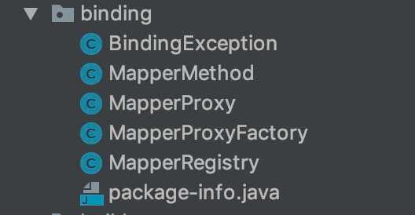
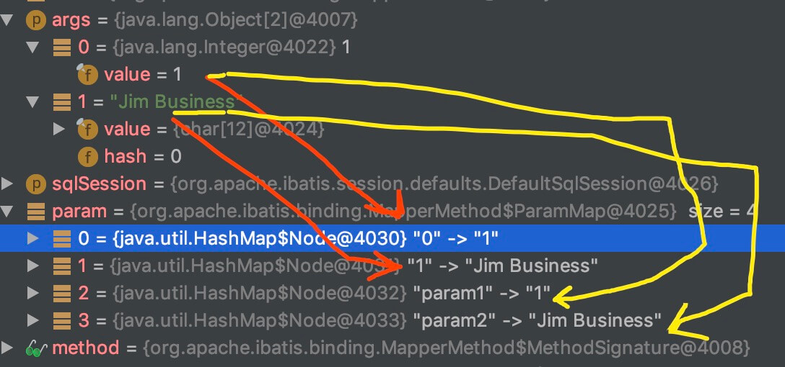

## 1. 概述

本文，我们来分享 MyBatis 的 Binding 模块，对应 `binding` 包。如下图所示：



在 [《精尽 MyBatis 源码解析 —— 项目结构一览》](http://svip.iocoder.cn/MyBatis/intro) 中，简单介绍了这个模块如下：

> 在调用 SqlSession 相应方法执行数据库操作时，需要指定映射文件中定义的 SQL 节点，如果出现拼写错误，我们只能在运行时才能发现相应的异常。为了尽早发现这种错误，MyBatis 通过 Binding 模块，将用户自定义的 Mapper 接口与映射配置文件关联起来，系统可以通过调用自定义 Mapper 接口中的方法执行相应的 SQL 语句完成数据库操作，从而避免上述问题。
>
> 值得读者注意的是，开发人员无须编写自定义 Mapper 接口的实现，MyBatis 会自动为其创建动态代理对象。在有些场景中，自定义 Mapper 接口可以完全代替映射配置文件，但有的映射规则和 SQL 语句的定义还是写在映射配置文件中比较方便，例如动态 SQL 语句的定义。

本文涉及的类如下图所示：


## 2. MapperRegistry

`org.apache.ibatis.binding.MapperRegistry` ，Mapper 注册表。

### 2.1 构造方法

```java
// MapperRegistry.java

/**
 * MyBatis Configuration 对象
 */
private final Configuration config;
/**
 * MapperProxyFactory 的映射
 * 
 * KEY：Mapper 接口
 */
private final Map<Class<?>, MapperProxyFactory<?>> knownMappers = new HashMap<>();

public MapperRegistry(Configuration config) {
    this.config = config;
}
```

### 2.2 addMappers

`#addMappers(String packageName, ...)` 方法，扫描指定包，并将符合的类，添加到 `knownMappers` 中。代码如下：

```java
// MapperRegistry.java

public void addMappers(String packageName) {
    addMappers(packageName, Object.class);
}
    
public void addMappers(String packageName, Class<?> superType) {
    // <1> 扫描指定包下的指定类
    ResolverUtil<Class<?>> resolverUtil = new ResolverUtil<>();
    resolverUtil.find(new ResolverUtil.IsA(superType), packageName);
    Set<Class<? extends Class<?>>> mapperSet = resolverUtil.getClasses();
    // <2> 遍历，添加到 knownMappers 中
    for (Class<?> mapperClass : mapperSet) {
        addMapper(mapperClass);
    }
}
```

`<1>` 处，使用 ResolverUtil 扫描指定包下的指定类。详细解析，在 [《精尽 MyBatis 源码分析 —— IO 模块》](http://svip.iocoder.cn/MyBatis/io-package) 中有。

### 2.3 hasMapper

`#hasMapper(Class<T> type)` 方法，判断是否有 Mapper 。代码如下：

```java
// MapperRegistry.java

public <T> boolean hasMapper(Class<T> type) {
    return knownMappers.containsKey(type);
}
```

### 2.4 addMapper

`#addMapper(Class<T> type)` 方法，添加到 `knownMappers` 中。代码如下：

```java
// MapperRegistry.java

public <T> void addMapper(Class<T> type) {
    // <1> 判断，必须是接口。
    if (type.isInterface()) {
        // <2> 已经添加过，则抛出 BindingException 异常
        if (hasMapper(type)) {
            throw new BindingException("Type " + type + " is already known to the MapperRegistry.");
        }
        boolean loadCompleted = false;
        try {
            // <3> 添加到 knownMappers 中
            knownMappers.put(type, new MapperProxyFactory<>(type));
            // It's important that the type is added before the parser is run
            // otherwise the binding may automatically be attempted by the
            // mapper parser. If the type is already known, it won't try.
            // <4> 解析 Mapper 的注解配置
            MapperAnnotationBuilder parser = new MapperAnnotationBuilder(config, type);
            parser.parse();
            // <5> 标记加载完成
            loadCompleted = true;
        } finally {
            // <6> 若加载未完成，从 knownMappers 中移除
            if (!loadCompleted) {
                knownMappers.remove(type);
            }
        }
    }
}
```

`<1>` 处，判断 `type` 必须是接口，也就是说 Mapper 接口。

`<2>` 处，已经添加过，则抛出 BindingException 异常。

`<3>` 处，添加到 `knownMappers` 中。

`<4>` 处，解析 Mapper 的注解配置。

`<5>` 处，创建 MapperAnnotationBuilder 对象，解析 Mapper 的注解配置。

`<6>` 处，若加载未完成，从 `knownMappers` 中移除。

### 2.5 getMapper

`#getMapper(Class<T> type, SqlSession sqlSession)` 方法，获得 Mapper Proxy 对象。代码如下：

```java
// MapperRegistry.java

public <T> T getMapper(Class<T> type, SqlSession sqlSession) {
    // <1> 获得 MapperProxyFactory 对象
    final MapperProxyFactory<T> mapperProxyFactory = (MapperProxyFactory<T>) knownMappers.get(type);
    // 不存在，则抛出 BindingException 异常
    if (mapperProxyFactory == null) {
        throw new BindingException("Type " + type + " is not known to the MapperRegistry.");
    }
    // 创建 Mapper Proxy 对象
    try {
        return mapperProxyFactory.newInstance(sqlSession);
    } catch (Exception e) {
        throw new BindingException("Error getting mapper instance. Cause: " + e, e);
    }
}
```

`<1>` 处，从 `knownMappers` 中，获得 MapperProxyFactory 对象。

`<2>` 处，调用 `MapperProxyFactory#newInstance(SqlSession sqlSession)` 方法，创建 Mapper Proxy 对象。详细解析，见 [「3. MapperProxyFactory」](http://svip.iocoder.cn/MyBatis/binding-package/#) 。

## 3. MapperProxyFactory

`org.apache.ibatis.binding.MapperProxyFactory` ，Mapper Proxy 工厂类。

### 3.1 构造方法

```java
// MapperProxyFactory.java

/**
 * Mapper 接口
 */
private final Class<T> mapperInterface;
/**
 * 方法与 MapperMethod 的映射
 */
private final Map<Method, MapperMethod> methodCache = new ConcurrentHashMap<>();

public MapperProxyFactory(Class<T> mapperInterface) {
    this.mapperInterface = mapperInterface;
}

public Class<T> getMapperInterface() {
    return mapperInterface;
}

public Map<Method, MapperMethod> getMethodCache() {
    return methodCache;
}
```

### 3.2 newInstance

`#newInstance(...)` 方法，创建 Mapper Proxy 对象。代码如下：

```java
// MapperProxyFactory.java

protected T newInstance(MapperProxy<T> mapperProxy) {
    return (T) Proxy.newProxyInstance(mapperInterface.getClassLoader(), new Class[]{mapperInterface}, mapperProxy);
}

public T newInstance(SqlSession sqlSession) {
    final MapperProxy<T> mapperProxy = new MapperProxy<>(sqlSession, mapperInterface, methodCache);
    return newInstance(mapperProxy);
}
```

依然是稳稳的基于 JDK Proxy 实现，而 InvocationHandler 参数是 MapperProxy 对象。关于 MapperProxy ，详细解析，见 [「4. MapperProxy」](http://svip.iocoder.cn/MyBatis/binding-package/#) 。

## 4. MapperProxy

`org.apache.ibatis.binding.MapperProxy` ，实现 InvocationHandler、Serializable 接口，Mapper Proxy 。关键是 `java.lang.reflect.InvocationHandler` 接口，你懂的。

### 4.1 构造方法

```java
// MapperProxy.java

/**
 * SqlSession 对象
 */
private final SqlSession sqlSession;
/**
 * Mapper 接口
 */
private final Class<T> mapperInterface;
/**
 * 方法与 MapperMethod 的映射
 *
 * 从 {@link MapperProxyFactory#methodCache} 传递过来
 */
private final Map<Method, MapperMethod> methodCache;

public MapperProxy(SqlSession sqlSession, Class<T> mapperInterface, Map<Method, MapperMethod> methodCache) {
    this.sqlSession = sqlSession;
    this.mapperInterface = mapperInterface;
    this.methodCache = methodCache;
}
```

### 4.2 invoke

`#invoke(Object proxy, Method method, Object[] args)` 方法，调用方法。代码如下：

```java
// MapperProxy.java

@Override
public Object invoke(Object proxy, Method method, Object[] args) throws Throwable {
    try {
        // <1> 如果是 Object 定义的方法，直接调用
        if (Object.class.equals(method.getDeclaringClass())) {
            return method.invoke(this, args);
        // 见 https://github.com/mybatis/mybatis-3/issues/709 ，支持 JDK8 default 方法
        } else if (isDefaultMethod(method)) {
            return invokeDefaultMethod(proxy, method, args);
        }
    } catch (Throwable t) {
        throw ExceptionUtil.unwrapThrowable(t);
    }
    // <3.1> 获得 MapperMethod 对象
    final MapperMethod mapperMethod = cachedMapperMethod(method);
    // <3.2> 执行 MapperMethod 方法
    return mapperMethod.execute(sqlSession, args);
}
```

`<1>` 处，如果是 Object 定义的方法，直接调用。

`<2>` 处，调用 `#isDefaultMethod((Method method)` 方法，判断是否为 `default` 修饰的方法，若是，则调用 `#invokeDefaultMethod(Object proxy, Method method, Object[] args)` 方法，进行反射调用。代码如下：

```java
// MapperProxy.java

private Object invokeDefaultMethod(Object proxy, Method method, Object[] args)
        throws Throwable {
    final Constructor<MethodHandles.Lookup> constructor = MethodHandles.Lookup.class
            .getDeclaredConstructor(Class.class, int.class);
    if (!constructor.isAccessible()) {
        constructor.setAccessible(true);
    }
    final Class<?> declaringClass = method.getDeclaringClass();
    return constructor
            .newInstance(declaringClass,
                    MethodHandles.Lookup.PRIVATE | MethodHandles.Lookup.PROTECTED
                            | MethodHandles.Lookup.PACKAGE | MethodHandles.Lookup.PUBLIC)
            .unreflectSpecial(method, declaringClass).bindTo(proxy).invokeWithArguments(args);
}

/**
 * Backport of java.lang.reflect.Method#isDefault()
 */
private boolean isDefaultMethod(Method method) {
    return (method.getModifiers()
            & (Modifier.ABSTRACT | Modifier.PUBLIC | Modifier.STATIC)) == Modifier.PUBLIC
            && method.getDeclaringClass().isInterface();
}
```

JDK8 在接口上，新增了 `default` 修饰符。怎么进行反射调用，见 [《java8 通过反射执行接口的default方法》](https://www.jianshu.com/p/63691220f81f) 一文。

关于这段代码，在 https://github.com/mybatis/mybatis-3/issues/709 上有讨论。

`<3.1>` 处，调用 `#cachedMapperMethod(Method method)` 方法，获得 MapperMethod 对象。代码如下：

```java
// MapperProxy.java

private MapperMethod cachedMapperMethod(Method method) {
    return methodCache.computeIfAbsent(method, k -> new MapperMethod(mapperInterface, method, sqlSession.getConfiguration()));
}
```

默认从 `methodCache` 缓存中获取。如果不存在，则进行创建，并进行缓存。

`<3.2>` 处，调用 `MapperMethod#execute(SqlSession sqlSession, Object[] args)` 方法，执行 MapperMethod 方法。关于 MapperMethod ，在 [「5. MapperMethod」](http://svip.iocoder.cn/MyBatis/binding-package/#) 中，详细解析。

## 5. MapperMethod

`org.apache.ibatis.binding.MapperMethod` ，Mapper 方法。在 Mapper 接口中，每个定义的方法，对应一个 MapperMethod 对象。

### 5.1 构造方法

```java
// MapperMethod.java

/**
 * SqlCommand 对象
 */
private final SqlCommand command;
/**
 * MethodSignature 对象
 */
private final MethodSignature method;

public MapperMethod(Class<?> mapperInterface, Method method, Configuration config) {
    this.command = new SqlCommand(config, mapperInterface, method);
    this.method = new MethodSignature(config, mapperInterface, method);
}
```

`command` 属性，SqlCommand 对象。关于它的详细解析，见 [「6. SqlCommand」](http://svip.iocoder.cn/MyBatis/binding-package/#) 。

`method` 属性，MethodSignature 对象。关于它的详细解析，见 [「7. MethodSignature」](http://svip.iocoder.cn/MyBatis/binding-package/#) 。

### 5.2 execute

因为涉及比较多的后面的内容，所以放在 详细解析。

心急的胖友，可以先看看 [《Mybatis3.3.x技术内幕（十一）：执行一个Sql命令的完整流程》](https://my.oschina.net/zudajun/blog/670373) 。

## 6. SqlCommand

SqlCommand ，是 MapperMethod 的内部静态类，SQL 命令。

### 6.1 构造方法

```java
// SqlCommand.java

/**
 * {@link MappedStatement#getId()}
 */
private final String name;
/**
 * SQL 命令类型
 */
private final SqlCommandType type;

public SqlCommand(Configuration configuration, Class<?> mapperInterface, Method method) {
    final String methodName = method.getName();
    final Class<?> declaringClass = method.getDeclaringClass();
    // <1> 获得 MappedStatement 对象
    MappedStatement ms = resolveMappedStatement(mapperInterface, methodName, declaringClass,
            configuration);
    // <2> 找不到 MappedStatement
    if (ms == null) {
        // 如果有 @Flush 注解，则标记为 FLUSH 类型
        if (method.getAnnotation(Flush.class) != null) {
            name = null;
            type = SqlCommandType.FLUSH;
        } else { // 抛出 BindingException 异常，如果找不到 MappedStatement
            throw new BindingException("Invalid bound statement (not found): "
                    + mapperInterface.getName() + "." + methodName);
        }
    // <3> 找到 MappedStatement
    } else {
        // 获得 name
        name = ms.getId();
        // 获得 type
        type = ms.getSqlCommandType();
        if (type == SqlCommandType.UNKNOWN) { // 抛出 BindingException 异常，如果是 UNKNOWN 类型
            throw new BindingException("Unknown execution method for: " + name);
        }
    }
}
```

`name` 属性，对应 `MappedStatement#getId()` 方法获得的标识。实际上，就是 `${NAMESPACE_NAME}.${语句_ID}`， 例如：`"org.apache.ibatis.autoconstructor.AutoConstructorMapper.getSubject2"` 。

`type` 属性，SQL 命令类型。`org.apache.ibatis.mapping.SqlCommandType` 类，代码如下：

```java
// SqlCommandType.java

public enum SqlCommandType {

    /**
     * 未知
     */
    UNKNOWN,
    /**
     * 插入
     */
    INSERT,
    /**
     * 更新
     */
    UPDATE,
    /**
     * 删除
     */
    DELETE,
    /**
     * 查询
     */
    SELECT,
    /**
     * FLUSH
     */
    FLUSH

}
```

`<1>` 处，调用 `#resolveMappedStatement(Class<?> mapperInterface, String methodName, Class<?> declaringClass, Configuration configuration)` 方法，获得 MappedStatement 对象。详细解析，胖友先跳到 [「6.2 resolveMappedStatement」](http://svip.iocoder.cn/MyBatis/binding-package/#) 。

`<2>` 处，如果找不到 MappedStatement 对象，说明该方法上，没有对应的 SQL 声明。那么在判断是否有 `@Flush` 注解，如果有，说明该方法是用于执行 flush 操作，否则，抛出 BindingException 异常。

`<3>` 处，如果找到 MappedStatement 对象，则初始化 `name` 和 `type` 属性。

### 6.2 resolveMappedStatement

`#resolveMappedStatement(Class<?> mapperInterface, String methodName, Class<?> declaringClass, Configuration configuration)` 方法，获得 MappedStatement 对象。代码如下：

```java
// SqlCommand.java

private MappedStatement resolveMappedStatement(Class<?> mapperInterface, String methodName,
                                               Class<?> declaringClass, Configuration configuration) {
    // <1> 获得编号
    String statementId = mapperInterface.getName() + "." + methodName;
    // <2> 如果有，获得 MappedStatement 对象，并返回
    if (configuration.hasStatement(statementId)) {
        return configuration.getMappedStatement(statementId);
    // 如果没有，并且当前方法就是 declaringClass 声明的，则说明真的找不到
    } else if (mapperInterface.equals(declaringClass)) {
        return null;
    }
    // 遍历父接口，继续获得 MappedStatement 对象
    for (Class<?> superInterface : mapperInterface.getInterfaces()) {
        if (declaringClass.isAssignableFrom(superInterface)) {
            MappedStatement ms = resolveMappedStatement(superInterface, methodName,
                    declaringClass, configuration);
            if (ms != null) {
                return ms;
            }
        }
    }
    // 真的找不到，返回 null
    return null;
}
```

`<1>` 处，获得编号。这个编号，和我们上文提到的 `${NAMESPACE_NAME}.${语句_ID}` 。

`<2>` 处，通过 `Configuration#hasStatement(String statementId)` 方法，判断是否有 MappedStatement 。如果有，则调用 `Configuration#getMappedStatement(String statementId)` 方法，获得 MappedStatement 对象。关于 Configuration ，我们在后续的文章中，详细解析。在这里，胖友只需要知道，Configuration 里缓存了所有的 MappedStatement ，并且每一个 XML 里声明的例如 `<select />` 或者 `<update />` 等等，都对应一个 MappedStatement 对象。

`<3>` 处，如果没有，并且当前方法就是 `declaringClass` 声明的，则说明真的找不到。

`<4>` 处，遍历父接口，**递归**继续获得 MappedStatement 对象。**因为，该该方法定义在父接口中**。

## 7. MethodSignature

MethodSignature ，是 MapperMethod 的内部静态类，方法签名。

### 7.1 构造方法

```java
// MethodSignature.java

/**
 * 返回类型是否为集合
 */
private final boolean returnsMany;
/**
 * 返回类型是否为 Map
 */
private final boolean returnsMap;
/**
 * 返回类型是否为 void
 */
private final boolean returnsVoid;
/**
 * 返回类型是否为 {@link org.apache.ibatis.cursor.Cursor}
 */
private final boolean returnsCursor;
/**
 * 返回类型是否为 {@link java.util.Optional}
 */
private final boolean returnsOptional;
/**
 * 返回类型
 */
private final Class<?> returnType;
/**
 * 返回方法上的 {@link MapKey#value()} ，前提是返回类型为 Map
 */
private final String mapKey;
/**
 * 获得 {@link ResultHandler} 在方法参数中的位置。
 *
 * 如果为 null ，说明不存在这个类型
 */
private final Integer resultHandlerIndex;
/**
 * 获得 {@link RowBounds} 在方法参数中的位置。
 *
 * 如果为 null ，说明不存在这个类型
 */
private final Integer rowBoundsIndex;
/**
 * ParamNameResolver 对象
 */
private final ParamNameResolver paramNameResolver;

public MethodSignature(Configuration configuration, Class<?> mapperInterface, Method method) {
    // 初始化 returnType 属性
    Type resolvedReturnType = TypeParameterResolver.resolveReturnType(method, mapperInterface);
    if (resolvedReturnType instanceof Class<?>) { // 普通类
        this.returnType = (Class<?>) resolvedReturnType;
    } else if (resolvedReturnType instanceof ParameterizedType) { // 泛型
        this.returnType = (Class<?>) ((ParameterizedType) resolvedReturnType).getRawType();
    } else { // 内部类等等
        this.returnType = method.getReturnType();
    }
    // 初始化 returnsVoid 属性
    this.returnsVoid = void.class.equals(this.returnType);
    // 初始化 returnsMany 属性
    this.returnsMany = configuration.getObjectFactory().isCollection(this.returnType) || this.returnType.isArray();
    // 初始化 returnsCursor 属性
    this.returnsCursor = Cursor.class.equals(this.returnType);
    // 初始化 returnsOptional 属性
    this.returnsOptional = Optional.class.equals(this.returnType);
    // <1> 初始化 mapKey
    this.mapKey = getMapKey(method);
    // 初始化 returnsMap
    this.returnsMap = this.mapKey != null;
    // <2> 初始化 rowBoundsIndex、resultHandlerIndex
    this.rowBoundsIndex = getUniqueParamIndex(method, RowBounds.class);
    this.resultHandlerIndex = getUniqueParamIndex(method, ResultHandler.class);
    // 初始化 paramNameResolver
    this.paramNameResolver = new ParamNameResolver(configuration, method);
}
```

`<1>` 处，调用 `#getMapKey(Method method)` 方法，获得注解的 `{@link MapKey#value()}` 。代码如下：

```java
// MethodSignature.java

private String getMapKey(Method method) {
    String mapKey = null;
    // 返回类型为 Map
    if (Map.class.isAssignableFrom(method.getReturnType())) {
        // 使用 @MapKey 注解
        final MapKey mapKeyAnnotation = method.getAnnotation(MapKey.class);
        // 获得 @MapKey 注解的键
        if (mapKeyAnnotation != null) {
            mapKey = mapKeyAnnotation.value();
        }
    }
    return mapKey;
}
```

`<2>` 处，调用 `#getUniqueParamIndex(Method method, Class<?> paramType)` 方法，获得指定参数类型在方法参数中的位置。代码如下：

```java
// MethodSignature.java

private Integer getUniqueParamIndex(Method method, Class<?> paramType) {
    Integer index = null;
    // 遍历方法参数
    final Class<?>[] argTypes = method.getParameterTypes();
    for (int i = 0; i < argTypes.length; i++) {
        if (paramType.isAssignableFrom(argTypes[i])) { // 类型符合
            // 获得第一次的位置
            if (index == null) {
                index = i;
            // 如果重复类型了，则抛出 BindingException 异常
            } else {
                throw new BindingException(method.getName() + " cannot have multiple " + paramType.getSimpleName() + " parameters");
            }
        }
    }
    return index;
}
```

### 7.2 convertArgsToSqlCommandParam

`#convertArgsToSqlCommandParam(Object[] args)` 方法，获得 SQL 通用参数。代码如下：

```java
// MethodSignature.java

public Object convertArgsToSqlCommandParam(Object[] args) {
    return paramNameResolver.getNamedParams(args);
}
```

在内部，会调用 `ParamNameResolver#getNamedParams(Object[] args)` 方法。在 [《精尽 MyBatis 源码分析 —— 反射模块》](http://svip.iocoder.cn/MyBatis/reflection-package) 中，有详细解析。

如下图是一个 `args` 和转换后的结果的示例：



