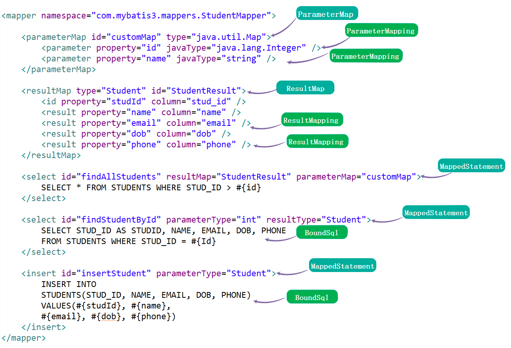
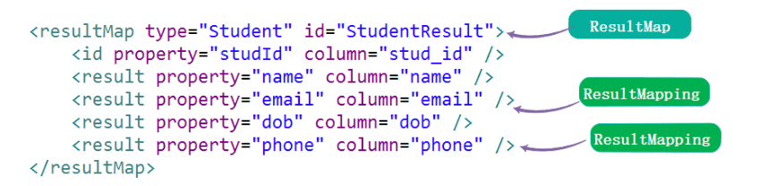

## 1. 概述

本文接 [《精尽 MyBatis 源码分析 —— MyBatis 初始化（一）之加载 mybatis-config》](http://svip.iocoder.cn/MyBatis/builder-package-1) 一文，来分享 MyBatis 初始化的第二步，**加载 Mapper 映射配置文件**。而这个步骤的入口是 XMLMapperBuilder 。下面，我们一起来看看它的代码实现。



上图，就是 Mapper 映射配置文件的解析结果。

## 2. XMLMapperBuilder

`org.apache.ibatis.builder.xml.XMLMapperBuilder` ，继承 BaseBuilder 抽象类，Mapper XML 配置构建器，主要负责解析 Mapper 映射配置文件。

### 2.1 构造方法

```java
// XMLMapperBuilder.java

/**
 * 基于 Java XPath 解析器
 */
private final XPathParser parser;
/**
 * Mapper 构造器助手
 */
private final MapperBuilderAssistant builderAssistant;
/**
 * 可被其他语句引用的可重用语句块的集合
 *
 * 例如：<sql id="userColumns"> ${alias}.id,${alias}.username,${alias}.password </sql>
 */
private final Map<String, XNode> sqlFragments;
/**
 * 资源引用的地址
 */
private final String resource;

public XMLMapperBuilder(InputStream inputStream, Configuration configuration, String resource, Map<String, XNode> sqlFragments, String namespace) {
    this(inputStream, configuration, resource, sqlFragments);
    this.builderAssistant.setCurrentNamespace(namespace);
}

public XMLMapperBuilder(InputStream inputStream, Configuration configuration, String resource, Map<String, XNode> sqlFragments) {
    this(new XPathParser(inputStream, true, configuration.getVariables(), new XMLMapperEntityResolver()),
            configuration, resource, sqlFragments);
}

private XMLMapperBuilder(XPathParser parser, Configuration configuration, String resource, Map<String, XNode> sqlFragments) {
    super(configuration);
    // 创建 MapperBuilderAssistant 对象
    this.builderAssistant = new MapperBuilderAssistant(configuration, resource);
    this.parser = parser;
    this.sqlFragments = sqlFragments;
    this.resource = resource;
}
```

`builderAssistant` 属性，MapperBuilderAssistant 对象，是 XMLMapperBuilder 和 MapperAnnotationBuilder 的小助手，提供了一些公用的方法，例如创建 ParameterMap、MappedStatement 对象等等。关于 MapperBuilderAssistant 类，可见 [「3. MapperBuilderAssistant」](http://svip.iocoder.cn/MyBatis/builder-package-2/#) 。

### 2.2 parse

`#parse()` 方法，解析 Mapper XML 配置文件。代码如下：

```java
// XMLMapperBuilder.java

public void parse() {
    // <1> 判断当前 Mapper 是否已经加载过
    if (!configuration.isResourceLoaded(resource)) {
        // <2> 解析 `<mapper />` 节点
        configurationElement(parser.evalNode("/mapper"));
        // <3> 标记该 Mapper 已经加载过
        configuration.addLoadedResource(resource);
        // <4> 绑定 Mapper
        bindMapperForNamespace();
    }

    // <5> 解析待定的 <resultMap /> 节点
    parsePendingResultMaps();
    // <6> 解析待定的 <cache-ref /> 节点
    parsePendingCacheRefs();
    // <7> 解析待定的 SQL 语句的节点
    parsePendingStatements();
}
```

`<1>` 处，调用 `Configuration#isResourceLoaded(String resource)` 方法，判断当前 Mapper 是否已经加载过。代码如下：

```java
// Configuration.java

/**
 * 已加载资源( Resource )集合
 */
protected final Set<String> loadedResources = new HashSet<>();

public boolean isResourceLoaded(String resource) {
    return loadedResources.contains(resource);
}
```

`<3>` 处，调用 `Configuration#addLoadedResource(String resource)` 方法，标记该 Mapper 已经加载过。代码如下：

```java
// Configuration.java

public void addLoadedResource(String resource) {
    loadedResources.add(resource);
}
```

`<2>` 处，调用 `#configurationElement(XNode context)` 方法，解析 `<mapper />` 节点。详细解析，见 [「2.3 configurationElement」](http://svip.iocoder.cn/MyBatis/builder-package-2/#) 。

`<4>` 处，调用 `#bindMapperForNamespace()` 方法，绑定 Mapper 。

`<5>`、`<6>`、`<7>` 处，解析对应的**待定**的节点。详细解析，见 [「2.5 parsePendingXXX」](http://svip.iocoder.cn/MyBatis/builder-package-2/#) 。

### 2.3 configurationElement

`#configurationElement(XNode context)` 方法，解析 `<mapper />` 节点。代码如下：

```java
// XMLMapperBuilder.java

private void configurationElement(XNode context) {
    try {
        // <1> 获得 namespace 属性
        String namespace = context.getStringAttribute("namespace");
        if (namespace == null || namespace.equals("")) {
            throw new BuilderException("Mapper's namespace cannot be empty");
        }
        // <1> 设置 namespace 属性
        builderAssistant.setCurrentNamespace(namespace);
        // <2> 解析 <cache-ref /> 节点
        cacheRefElement(context.evalNode("cache-ref"));
        // <3> 解析 <cache /> 节点
        cacheElement(context.evalNode("cache"));
        // 已废弃！老式风格的参数映射。内联参数是首选,这个元素可能在将来被移除，这里不会记录。
        parameterMapElement(context.evalNodes("/mapper/parameterMap"));
        // <4> 解析 <resultMap /> 节点们
        resultMapElements(context.evalNodes("/mapper/resultMap"));
        // <5> 解析 <sql /> 节点们
        sqlElement(context.evalNodes("/mapper/sql"));
        // <6> 解析 <select /> <insert /> <update /> <delete /> 节点们
        buildStatementFromContext(context.evalNodes("select|insert|update|delete"));
    } catch (Exception e) {
        throw new BuilderException("Error parsing Mapper XML. The XML location is '" + resource + "'. Cause: " + e, e);
    }
}
```

`<1>` 处，获得 `namespace` 属性，并设置到 MapperAnnotationBuilder 中。

`<2>` 处，调用 `#cacheRefElement(XNode context)` 方法，解析 `<cache-ref />` 节点。详细解析，见 [「2.3.1 cacheElement」](http://svip.iocoder.cn/MyBatis/builder-package-2/#) 。

`<3>` 处，调用 `#cacheElement(XNode context)` 方法，解析 `cache />` 标签。详细解析，见 [「2.3.2 cacheElement」](http://svip.iocoder.cn/MyBatis/builder-package-2/#) 。

`<4>` 处，调用 `#resultMapElements(List<XNode> list)` 方法，解析 `<resultMap />` 节点们。详细解析，见 [「2.3.3 resultMapElements」](http://svip.iocoder.cn/MyBatis/builder-package-2/#) 。

`<5>` 处，调用 `#sqlElement(List<XNode> list)` 方法，解析 `<sql />` 节点们。详细解析，见 [「2.3.4 sqlElement」](http://svip.iocoder.cn/MyBatis/builder-package-2/#) 。

`<6>` 处，调用 `#buildStatementFromContext(List<XNode> list)` 方法，解析 `<select />`、`<insert />`、`<update />`、`<delete />` 节点们。详细解析，见 [「2.3.5 buildStatementFromContext」](http://svip.iocoder.cn/MyBatis/builder-package-2/#) 。

#### 2.3.1 cacheRefElement

`#cacheRefElement(XNode context)` 方法，解析 `<cache-ref />` 节点。代码如下：

```java
// XMLMapperBuilder.java

private void cacheRefElement(XNode context) {
    if (context != null) {
        // <1> 获得指向的 namespace 名字，并添加到 configuration 的 cacheRefMap 中
        configuration.addCacheRef(builderAssistant.getCurrentNamespace(), context.getStringAttribute("namespace"));
        // <2> 创建 CacheRefResolver 对象，并执行解析
        CacheRefResolver cacheRefResolver = new CacheRefResolver(builderAssistant, context.getStringAttribute("namespace"));
        try {
            cacheRefResolver.resolveCacheRef();
        } catch (IncompleteElementException e) {
            // <3> 解析失败，添加到 configuration 的 incompleteCacheRefs 中
            configuration.addIncompleteCacheRef(cacheRefResolver);
        }
    }
}
```

示例如下：

```xml
<cache-ref namespace="com.someone.application.data.SomeMapper"/>
```

`<1>` 处，获得指向的 `namespace` 名字，并调用 `Configuration#addCacheRef(String namespace, String referencedNamespace)` 方法，添加到 `configuration` 的 `cacheRefMap` 中。代码如下：

```java
// Configuration.java

/**
 * A map holds cache-ref relationship. The key is the namespace that
 * references a cache bound to another namespace and the value is the
 * namespace which the actual cache is bound to.
 *
 * Cache 指向的映射
 *
 * @see #addCacheRef(String, String)
 * @see org.apache.ibatis.builder.xml.XMLMapperBuilder#cacheRefElement(XNode)
 */
protected final Map<String, String> cacheRefMap = new HashMap<>();

public void addCacheRef(String namespace, String referencedNamespace) {
    cacheRefMap.put(namespace, referencedNamespace);
}
```

`<2>` 处，创建 CacheRefResolver 对象，并调用 `CacheRefResolver#resolveCacheRef()` 方法，执行解析。关于 CacheRefResolver ，在 [「2.3.1.1 CacheRefResolver」](http://svip.iocoder.cn/MyBatis/builder-package-2/#) 详细解析。

`<3>` 处，解析失败，因为此处指向的 Cache 对象可能未初始化，则先调用 `Configuration#addIncompleteCacheRef(CacheRefResolver incompleteCacheRef)` 方法，添加到 `configuration` 的 `incompleteCacheRefs` 中。代码如下：

```java
// Configuration.java

/**
 * CacheRefResolver 集合
 */
protected final Collection<CacheRefResolver> incompleteCacheRefs = new LinkedList<>();

public void addIncompleteCacheRef(CacheRefResolver incompleteCacheRef) {
    incompleteCacheRefs.add(incompleteCacheRef);
}
```

##### 2.3.1.1 CacheRefResolver

`org.apache.ibatis.builder.CacheRefResolver` ，Cache 指向解析器。代码如下：

```java
// CacheRefResolver.java

public class CacheRefResolver {

    private final MapperBuilderAssistant assistant;
    /**
     * Cache 指向的命名空间
     */
    private final String cacheRefNamespace;

    public CacheRefResolver(MapperBuilderAssistant assistant, String cacheRefNamespace) {
        this.assistant = assistant;
        this.cacheRefNamespace = cacheRefNamespace;
    }

    public Cache resolveCacheRef() {
        return assistant.useCacheRef(cacheRefNamespace);
    }

}
```

在 `#resolveCacheRef()` 方法中，会调用 `MapperBuilderAssistant#useCacheRef(String namespace)` 方法，获得指向的 Cache 对象。详细解析，见 [「3.3 useCacheRef」](http://svip.iocoder.cn/MyBatis/builder-package-2/#) 。

#### 2.3.2 cacheElement

`#cacheElement(XNode context)` 方法，解析 `cache />` 标签。代码如下：

```java
// XMLMapperBuilder.java

private void cacheElement(XNode context) throws Exception {
    if (context != null) {
        // <1> 获得负责存储的 Cache 实现类
        String type = context.getStringAttribute("type", "PERPETUAL");
        Class<? extends Cache> typeClass = typeAliasRegistry.resolveAlias(type);
        // <2> 获得负责过期的 Cache 实现类
        String eviction = context.getStringAttribute("eviction", "LRU");
        Class<? extends Cache> evictionClass = typeAliasRegistry.resolveAlias(eviction);
        // <3> 获得 flushInterval、size、readWrite、blocking 属性
        Long flushInterval = context.getLongAttribute("flushInterval");
        Integer size = context.getIntAttribute("size");
        boolean readWrite = !context.getBooleanAttribute("readOnly", false);
        boolean blocking = context.getBooleanAttribute("blocking", false);
        // <4> 获得 Properties 属性
        Properties props = context.getChildrenAsProperties();
        // <5> 创建 Cache 对象
        builderAssistant.useNewCache(typeClass, evictionClass, flushInterval, size, readWrite, blocking, props);
    }
}
```

示例如下：

```xml
// 使用默认缓存
<cache eviction="FIFO" flushInterval="60000"  size="512" readOnly="true"/>

// 使用自定义缓存
<cache type="com.domain.something.MyCustomCache">
  <property name="cacheFile" value="/tmp/my-custom-cache.tmp"/>
</cache>
```

`<1>`、`<2>`、`<3>`、`<4>` 处，见代码注释即可。

`<5>` 处，调用 `MapperBuilderAssistant#useNewCache(...)` 方法，创建 Cache 对象。详细解析，见 [「3.4 useNewCache」](http://svip.iocoder.cn/MyBatis/builder-package-2/#) 中。

#### 2.3.3 resultMapElements

整体流程如下：


`#resultMapElements(List<XNode> list)` 方法，解析 `<resultMap />` 节点们。代码如下：

```java
// XMLMapperBuilder.java

// 解析 <resultMap /> 节点们
private void resultMapElements(List<XNode> list) throws Exception {
    // 遍历 <resultMap /> 节点们
    for (XNode resultMapNode : list) {
        try {
            // 处理单个 <resultMap /> 节点
            resultMapElement(resultMapNode);
        } catch (IncompleteElementException e) {
            // ignore, it will be retried
        }
    }
}

// 解析 <resultMap /> 节点
private ResultMap resultMapElement(XNode resultMapNode) throws Exception {
    return resultMapElement(resultMapNode, Collections.<ResultMapping>emptyList());
}

// 解析 <resultMap /> 节点
private ResultMap resultMapElement(XNode resultMapNode, List<ResultMapping> additionalResultMappings) throws Exception {
    ErrorContext.instance().activity("processing " + resultMapNode.getValueBasedIdentifier());
    // <1> 获得 id 属性
    String id = resultMapNode.getStringAttribute("id",
            resultMapNode.getValueBasedIdentifier());
    // <1> 获得 type 属性
    String type = resultMapNode.getStringAttribute("type",
            resultMapNode.getStringAttribute("ofType",
                    resultMapNode.getStringAttribute("resultType",
                            resultMapNode.getStringAttribute("javaType"))));
    // <1> 获得 extends 属性
    String extend = resultMapNode.getStringAttribute("extends");
    // <1> 获得 autoMapping 属性
    Boolean autoMapping = resultMapNode.getBooleanAttribute("autoMapping");
    // <1> 解析 type 对应的类
    Class<?> typeClass = resolveClass(type);
    Discriminator discriminator = null;
    // <2> 创建 ResultMapping 集合
    List<ResultMapping> resultMappings = new ArrayList<>();
    resultMappings.addAll(additionalResultMappings);
    // <2> 遍历 <resultMap /> 的子节点
    List<XNode> resultChildren = resultMapNode.getChildren();
    for (XNode resultChild : resultChildren) {
        // <2.1> 处理 <constructor /> 节点
        if ("constructor".equals(resultChild.getName())) {
            processConstructorElement(resultChild, typeClass, resultMappings);
        // <2.2> 处理 <discriminator /> 节点
        } else if ("discriminator".equals(resultChild.getName())) {
            discriminator = processDiscriminatorElement(resultChild, typeClass, resultMappings);
        // <2.3> 处理其它节点
        } else {
            List<ResultFlag> flags = new ArrayList<>();
            if ("id".equals(resultChild.getName())) {
                flags.add(ResultFlag.ID);
            }
            resultMappings.add(buildResultMappingFromContext(resultChild, typeClass, flags));
        }
    }
    // <3> 创建 ResultMapResolver 对象，执行解析
    ResultMapResolver resultMapResolver = new ResultMapResolver(builderAssistant, id, typeClass, extend, discriminator, resultMappings, autoMapping);
    try {
        return resultMapResolver.resolve();
    } catch (IncompleteElementException e) {
        // <4> 解析失败，添加到 configuration 中
        configuration.addIncompleteResultMap(resultMapResolver);
        throw e;
    }
}
```

`<resultMap />` 标签的解析，是相对复杂的过程，情况比较多，所以胖友碰到不懂的，可以看看 [《MyBatis 文档 —— Mapper XML 文件》](http://www.mybatis.org/mybatis-3/zh/sqlmap-xml.html) 文档。

`<1>` 处，获得 `id`、`type`、`extends`、`autoMapping` 属性，并解析 `type` 对应的类型。

`<2>` 处，创建 ResultMapping 集合，后遍历 `<resultMap />` 的**子**节点们，将每一个子节点解析成一个或多个 ResultMapping 对象，添加到集合中。即如下图所示：



`<2.1>` 处，调用 `#processConstructorElement(...)` 方法，处理 `<constructor />` 节点。详细解析，见 [「2.3.3.1 processConstructorElement」](http://svip.iocoder.cn/MyBatis/builder-package-2/#) 。

`<2.2>` 处，调用 `#processDiscriminatorElement(...)` 方法，处理 `<discriminator />` 节点。详细解析，见 [「2.3.3.2 processDiscriminatorElement」](http://svip.iocoder.cn/MyBatis/builder-package-2/#) 。

`<2.3>` 处，调用 `#buildResultMappingFromContext(XNode context, Class<?> resultType, List<ResultFlag> flags)` 方法，将当前子节点构建成 ResultMapping 对象，并添加到 `resultMappings` 中。详细解析，见 [「2.3.3.3 buildResultMappingFromContext」](http://svip.iocoder.cn/MyBatis/builder-package-2/#) 。这一块，和 [「2.3.3.1 processConstructorElement」](http://svip.iocoder.cn/MyBatis/builder-package-2/#) 的 `<3>` 是一致的。

`<3>` 处，创建 ResultMapResolver 对象，执行解析。关于 ResultMapResolver ，在 「2.3.1.1 CacheRefResolver」 详细解析。

`<4>` 处，如果解析失败，说明有依赖的信息不全，所以调用 `Configuration#addIncompleteResultMap(ResultMapResolver resultMapResolver)` 方法，添加到 Configuration 的 `incompleteResultMaps` 中。代码如下：

```java
// Configuration.java

/**
 * ResultMapResolver 集合
 */
protected final Collection<ResultMapResolver> incompleteResultMaps = new LinkedList<>();

public void addIncompleteResultMap(ResultMapResolver resultMapResolver) {
    incompleteResultMaps.add(resultMapResolver);
}
```

##### 2.3.3.1 processConstructorElement

`#processConstructorElement(XNode resultChild, Class<?> resultType, List<ResultMapping> resultMappings)` 方法，处理 `<constructor />` 节点。代码如下：

```java
// XMLMapperBuilder.java

private void processConstructorElement(XNode resultChild, Class<?> resultType, List<ResultMapping> resultMappings) throws Exception {
    // <1> 遍历 <constructor /> 的子节点们
    List<XNode> argChildren = resultChild.getChildren();
    for (XNode argChild : argChildren) {
        // <2> 获得 ResultFlag 集合
        List<ResultFlag> flags = new ArrayList<>();
        flags.add(ResultFlag.CONSTRUCTOR);
        if ("idArg".equals(argChild.getName())) {
            flags.add(ResultFlag.ID);
        }
        // <3> 将当前子节点构建成 ResultMapping 对象，并添加到 resultMappings 中
        resultMappings.add(buildResultMappingFromContext(argChild, resultType, flags));
    }
}
```

`<1>` 和 `<3>` 处，遍历 `<constructor />` 的子节点们，调用 `#buildResultMappingFromContext(XNode context, Class<?> resultType, List<ResultFlag> flags)` 方法，将当前子节点构建成 ResultMapping 对象，并添加到 `resultMappings` 中。详细解析，见 [「2.3.3.3 buildResultMappingFromContext」](http://svip.iocoder.cn/MyBatis/builder-package-2/#) 。

`<2>` 处，我们可以看到一个 `org.apache.ibatis.mapping.ResultFlag` 枚举类，结果标识。代码如下：

```java
// ResultFlag.java

public enum ResultFlag {

    /**
     * ID
     */
    ID,
    /**
     * 构造方法
     */
    CONSTRUCTOR

}
```

具体的用途，见下文。

##### 2.3.3.2 processDiscriminatorElement

`#processDiscriminatorElement(XNode context, Class<?> resultType, List<ResultMapping> resultMappings)` 方法，处理 `<constructor />` 节点。代码如下：

```java
// XMLMapperBuilder.java

private Discriminator processDiscriminatorElement(XNode context, Class<?> resultType, List<ResultMapping> resultMappings) throws Exception {
    // <1> 解析各种属性
    String column = context.getStringAttribute("column");
    String javaType = context.getStringAttribute("javaType");
    String jdbcType = context.getStringAttribute("jdbcType");
    String typeHandler = context.getStringAttribute("typeHandler");
    // <1> 解析各种属性对应的类
    Class<?> javaTypeClass = resolveClass(javaType);
    Class<? extends TypeHandler<?>> typeHandlerClass = resolveClass(typeHandler);
    JdbcType jdbcTypeEnum = resolveJdbcType(jdbcType);
    // <2> 遍历 <discriminator /> 的子节点，解析成 discriminatorMap 集合
    Map<String, String> discriminatorMap = new HashMap<>();
    for (XNode caseChild : context.getChildren()) {
        String value = caseChild.getStringAttribute("value");
        String resultMap = caseChild.getStringAttribute("resultMap", processNestedResultMappings(caseChild, resultMappings)); // <2.1>
        discriminatorMap.put(value, resultMap);
    }
    // <3> 创建 Discriminator 对象
    return builderAssistant.buildDiscriminator(resultType, column, javaTypeClass, jdbcTypeEnum, typeHandlerClass, discriminatorMap);
}
```

可能大家对 `<discriminator />` 标签不是很熟悉，可以打开 [《MyBatis 文档 —— Mapper XML 文件》](http://www.mybatis.org/mybatis-3/zh/sqlmap-xml.html) 文档，然后下【鉴别器】。

`<1>` 处，解析各种属性以及属性对应的类。

`<2>` 处，遍历 `<discriminator />` 的子节点，解析成 `discriminatorMap` 集合。

`<2.1>` 处，如果是内嵌的 ResultMap 的情况，则调用 `#processNestedResultMappings(XNode context, List<ResultMapping> resultMappings)` 方法，处理**内嵌**的 ResultMap 的情况。代码如下：

```java
// XMLMapperBuilder.java

private String processNestedResultMappings(XNode context, List<ResultMapping> resultMappings) throws Exception {
    if ("association".equals(context.getName())
            || "collection".equals(context.getName())
            || "case".equals(context.getName())) {
        if (context.getStringAttribute("select") == null) {
            // 解析，并返回 ResultMap
            ResultMap resultMap = resultMapElement(context, resultMappings);
            return resultMap.getId();
        }
    }
    return null;
}
```

该方法，会“递归”调用 `#resultMapElement(XNode context, List<ResultMapping> resultMappings)` 方法，处理内嵌的 ResultMap 的情况。也就是返回到 [「2.3.3 resultMapElement」](http://svip.iocoder.cn/MyBatis/builder-package-2/#) 流程。

`<3>` 处，调用 `MapperBuilderAssistant#buildDiscriminator(...)` 方法，创建 Discriminator 对象。详细解析，见 [「3.6 buildDiscriminator」](http://svip.iocoder.cn/MyBatis/builder-package-2/#) 。

##### 2.3.3.3 buildResultMappingFromContext

`#buildResultMappingFromContext(XNode context, Class<?> resultType, List<ResultFlag> flags)` 方法，将当前节点构建成 ResultMapping 对象。代码如下：

```java
// XMLMapperBuilder.java

private ResultMapping buildResultMappingFromContext(XNode context, Class<?> resultType, List<ResultFlag> flags) throws Exception {
    // <1> 获得各种属性
    String property;
    if (flags.contains(ResultFlag.CONSTRUCTOR)) {
        property = context.getStringAttribute("name");
    } else {
        property = context.getStringAttribute("property");
    }
    String column = context.getStringAttribute("column");
    String javaType = context.getStringAttribute("javaType");
    String jdbcType = context.getStringAttribute("jdbcType");
    String nestedSelect = context.getStringAttribute("select");
    String nestedResultMap = context.getStringAttribute("resultMap",
            processNestedResultMappings(context, Collections.emptyList()));
    String notNullColumn = context.getStringAttribute("notNullColumn");
    String columnPrefix = context.getStringAttribute("columnPrefix");
    String typeHandler = context.getStringAttribute("typeHandler");
    String resultSet = context.getStringAttribute("resultSet");
    String foreignColumn = context.getStringAttribute("foreignColumn");
    boolean lazy = "lazy".equals(context.getStringAttribute("fetchType", configuration.isLazyLoadingEnabled() ? "lazy" : "eager"));
    // <1> 获得各种属性对应的类
    Class<?> javaTypeClass = resolveClass(javaType);
    Class<? extends TypeHandler<?>> typeHandlerClass = resolveClass(typeHandler);
    JdbcType jdbcTypeEnum = resolveJdbcType(jdbcType);
    // <2> 构建 ResultMapping 对象
    return builderAssistant.buildResultMapping(resultType, property, column, javaTypeClass, jdbcTypeEnum, nestedSelect, nestedResultMap, notNullColumn, columnPrefix, typeHandlerClass, flags, resultSet, foreignColumn, lazy);
}
```

`<1>` 处，解析各种属性以及属性对应的类。

`<2>` 处，调用 `MapperBuilderAssistant#buildResultMapping(...)` 方法，构建 ResultMapping 对象。详细解析，见 [「3.5 buildResultMapping」](http://svip.iocoder.cn/MyBatis/builder-package-2/#) 。

##### 2.3.3.4 ResultMapResolver

`org.apache.ibatis.builder.ResultMapResolver`，ResultMap 解析器。代码如下：

```java
// ResultMapResolver.java

public class ResultMapResolver {

    private final MapperBuilderAssistant assistant;
    /**
     * ResultMap 编号
     */
    private final String id;
    /**
     * 类型
     */
    private final Class<?> type;
    /**
     * 继承自哪个 ResultMap
     */
    private final String extend;
    /**
     * Discriminator 对象
     */
    private final Discriminator discriminator;
    /**
     * ResultMapping 集合
     */
    private final List<ResultMapping> resultMappings;
    /**
     * 是否自动匹配
     */
    private final Boolean autoMapping;

    public ResultMapResolver(MapperBuilderAssistant assistant, String id, Class<?> type, String extend, Discriminator discriminator, List<ResultMapping> resultMappings, Boolean autoMapping) {
        this.assistant = assistant;
        this.id = id;
        this.type = type;
        this.extend = extend;
        this.discriminator = discriminator;
        this.resultMappings = resultMappings;
        this.autoMapping = autoMapping;
    }

    public ResultMap resolve() {
        return assistant.addResultMap(this.id, this.type, this.extend, this.discriminator, this.resultMappings, this.autoMapping);
    }

}
```

在 `#resolve()` 方法中，会调用 `MapperBuilderAssistant#addResultMap(...)` 方法，创建 ResultMap 对象。详细解析，见 [「3.7 addResultMap」](http://svip.iocoder.cn/MyBatis/builder-package-2/#) 。

#### 2.3.4 sqlElement

`#sqlElement(List<XNode> list)` 方法，解析 `<sql />` 节点们。代码如下：

```java
// XMLMapperBuilder.java

private void sqlElement(List<XNode> list) throws Exception {
    if (configuration.getDatabaseId() != null) {
        sqlElement(list, configuration.getDatabaseId());
    }
    sqlElement(list, null);
    // 上面两块代码，可以简写成 sqlElement(list, configuration.getDatabaseId());
}

private void sqlElement(List<XNode> list, String requiredDatabaseId) throws Exception {
    // <1> 遍历所有 <sql /> 节点
    for (XNode context : list) {
        // <2> 获得 databaseId 属性
        String databaseId = context.getStringAttribute("databaseId");
        // <3> 获得完整的 id 属性，格式为 `${namespace}.${id}` 。
        String id = context.getStringAttribute("id");
        id = builderAssistant.applyCurrentNamespace(id, false);
        // <4> 判断 databaseId 是否匹配
        if (databaseIdMatchesCurrent(id, databaseId, requiredDatabaseId)) {
            // <5> 添加到 sqlFragments 中
            sqlFragments.put(id, context);
        }
    }
}
```

`<1>` 处，遍历所有 `<sql />` 节点，逐个处理。

`<2>` 处，获得 `databaseId` 属性。

`<3>` 处，获得完整的 `id` 属性，格式为 `${namespace}.${id}` 。

`<4>` 处，调用 `#databaseIdMatchesCurrent(String id, String databaseId, String requiredDatabaseId)` 方法，判断 `databaseId` 是否匹配。代码如下：

```java
// XMLMapperBuilder.java

private boolean databaseIdMatchesCurrent(String id, String databaseId, String requiredDatabaseId) {
    // 如果不匹配，则返回 false
    if (requiredDatabaseId != null) {
        return requiredDatabaseId.equals(databaseId);
    } else {
        // 如果未设置 requiredDatabaseId ，但是 databaseId 存在，说明还是不匹配，则返回 false
        // mmp ，写的好绕
        if (databaseId != null) {
            return false;
        }
        // skip this fragment if there is a previous one with a not null databaseId
        // 判断是否已经存在
        if (this.sqlFragments.containsKey(id)) {
            XNode context = this.sqlFragments.get(id);
            // 若存在，则判断原有的 sqlFragment 是否 databaseId 为空。因为，当前 databaseId 为空，这样两者才能匹配。
            return context.getStringAttribute("databaseId") == null;
        }
    }
    return true;
}
```

`<5>` 处，添加到 `sqlFragments` 中。因为 `sqlFragments` 是来自 Configuration 的 `sqlFragments` 属性，所以相当于也被添加了。代码如下：

```java
// Configuration.java

 /**
 * 可被其他语句引用的可重用语句块的集合
 *
 * 例如：<sql id="userColumns"> ${alias}.id,${alias}.username,${alias}.password </sql>
 */
protected final Map<String, XNode> sqlFragments = new StrictMap<>("XML fragments parsed from previous mappers");
```

#### 2.3.5 buildStatementFromContext

`#buildStatementFromContext(List<XNode> list)` 方法，解析 `<select />`、`<insert />`、`<update />`、`<delete />` 节点们。代码如下：

```java
// XMLMapperBuilder.java

private void buildStatementFromContext(List<XNode> list) {
    if (configuration.getDatabaseId() != null) {
        buildStatementFromContext(list, configuration.getDatabaseId());
    }
    buildStatementFromContext(list, null);
    // 上面两块代码，可以简写成 buildStatementFromContext(list, configuration.getDatabaseId());
}

private void buildStatementFromContext(List<XNode> list, String requiredDatabaseId) {
    // <1> 遍历 <select /> <insert /> <update /> <delete /> 节点们
    for (XNode context : list) {
        // <1> 创建 XMLStatementBuilder 对象，执行解析
        final XMLStatementBuilder statementParser = new XMLStatementBuilder(configuration, builderAssistant, context, requiredDatabaseId);
        try {
            statementParser.parseStatementNode();
        } catch (IncompleteElementException e) {
            // <2> 解析失败，添加到 configuration 中
            configuration.addIncompleteStatement(statementParser);
        }
    }
}
```

`<1>` 处，遍历 `<select />`、`<insert />`、`<update />`、`<delete />` 节点们，逐个创建 XMLStatementBuilder 对象，执行解析。关于 XMLStatementBuilder 类，我们放在下篇文章，详细解析。

`<2>` 处，解析失败，调用 `Configuration#addIncompleteStatement(XMLStatementBuilder incompleteStatement)` 方法，添加到 `configuration` 中。代码如下：

```java
// Configuration.java

/**
 * XMLStatementBuilder 集合
 */
protected final Collection<XMLStatementBuilder> incompleteStatements = new LinkedList<>();

public void addIncompleteStatement(XMLStatementBuilder incompleteStatement) {
    incompleteStatements.add(incompleteStatement);
}
```

### 2.4 bindMapperForNamespace

`#bindMapperForNamespace()` 方法，绑定 Mapper 。代码如下：

```java
// XMLMapperBuilder.java

private void bindMapperForNamespace() {
    String namespace = builderAssistant.getCurrentNamespace();
    if (namespace != null) {
        // <1> 获得 Mapper 映射配置文件对应的 Mapper 接口，实际上类名就是 namespace 。嘿嘿，这个是常识。
        Class<?> boundType = null;
        try {
            boundType = Resources.classForName(namespace);
        } catch (ClassNotFoundException e) {
            //ignore, bound type is not required
        }
        if (boundType != null) {
            // <2> 不存在该 Mapper 接口，则进行添加
            if (!configuration.hasMapper(boundType)) {
                // Spring may not know the real resource name so we set a flag
                // to prevent loading again this resource from the mapper interface
                // look at MapperAnnotationBuilder#loadXmlResource
                // <3> 标记 namespace 已经添加，避免 MapperAnnotationBuilder#loadXmlResource(...) 重复加载
                configuration.addLoadedResource("namespace:" + namespace);
                // <4> 添加到 configuration 中
                configuration.addMapper(boundType);
            }
        }
    }
}
```

`<1>` 处，获得 Mapper 映射配置文件对应的 Mapper 接口，实际上类名就是 `namespace` 。嘿嘿，这个是常识。

`<2>` 处，调用 `Configuration#hasMapper(Class<?> type)` 方法，判断若谷不存在该 Mapper 接口，则进行绑定。代码如下：

```java
// Configuration.java

/**
 * MapperRegistry 对象
 */
protected final MapperRegistry mapperRegistry = new MapperRegistry(this);

public boolean hasMapper(Class<?> type) {
    return mapperRegistry.hasMapper(type);
}
```

`<3>` 处，调用 `Configuration#addLoadedResource(String resource)` 方法，标记 `namespace` 已经添加，避免 `MapperAnnotationBuilder#loadXmlResource(...)` 重复加载。代码如下：

```java
// MapperAnnotationBuilder.java

private void loadXmlResource() {
    // Spring may not know the real resource name so we check a flag
    // to prevent loading again a resource twice
    // this flag is set at XMLMapperBuilder#bindMapperForNamespace
    if (!configuration.isResourceLoaded("namespace:" + type.getName())) {
        // ... 省略创建 XMLMapperBuilder ，进行解析的代码
    }
}
```

`<4>` 处，调用 `Configuration#addMapper(Class<T> type)` 方法，添加到 `configuration` 的 `mapperRegistry` 中。代码如下：

```java
// Configuration.java

public <T> void addMapper(Class<T> type) {
    mapperRegistry.addMapper(type);
}
```

### 2.5 parsePendingXXX

有三个 parsePendingXXX 方法，代码如下：

```java
// XMLMapperBuilder.java

private void parsePendingResultMaps() {
    // 获得 ResultMapResolver 集合，并遍历进行处理
    Collection<ResultMapResolver> incompleteResultMaps = configuration.getIncompleteResultMaps();
    synchronized (incompleteResultMaps) {
        Iterator<ResultMapResolver> iter = incompleteResultMaps.iterator();
        while (iter.hasNext()) {
            try {
                // 执行解析
                iter.next().resolve();
                // 移除
                iter.remove();
            } catch (IncompleteElementException e) {
                // ResultMap is still missing a resource...
                // 解析失败，不抛出异常
            }
        }
    }
}

private void parsePendingCacheRefs() {
    // 获得 CacheRefResolver 集合，并遍历进行处理
    Collection<CacheRefResolver> incompleteCacheRefs = configuration.getIncompleteCacheRefs();
    synchronized (incompleteCacheRefs) {
        Iterator<CacheRefResolver> iter = incompleteCacheRefs.iterator();
        while (iter.hasNext()) {
            try {
                // 执行解析
                iter.next().resolveCacheRef();
                // 移除
                iter.remove();
            } catch (IncompleteElementException e) {
                // Cache ref is still missing a resource...
            }
        }
    }
}

private void parsePendingStatements() {
    // 获得 XMLStatementBuilder 集合，并遍历进行处理
    Collection<XMLStatementBuilder> incompleteStatements = configuration.getIncompleteStatements();
    synchronized (incompleteStatements) {
        Iterator<XMLStatementBuilder> iter = incompleteStatements.iterator();
        while (iter.hasNext()) {
            try {
                // 执行解析
                iter.next().parseStatementNode();
                // 移除
                iter.remove();
            } catch (IncompleteElementException e) {
                // Statement is still missing a resource...
            }
        }
    }
}
```

三个方法的逻辑思路基本一致：1）获得对应的集合；2）遍历集合，执行解析；3）执行成功，则移除出集合；4）执行失败，忽略异常。

当然，实际上，此处还是可能有执行解析失败的情况，但是随着每一个 Mapper 配置文件对应的 XMLMapperBuilder 执行一次这些方法，逐步逐步就会被全部解析完。

## 3. MapperBuilderAssistant

`org.apache.ibatis.builder.MapperBuilderAssistant` ，继承 BaseBuilder 抽象类，Mapper 构造器的小助手，提供了一些公用的方法，例如创建 ParameterMap、MappedStatement 对象等等。

### 3.1 构造方法

```java
// MapperBuilderAssistant.java

/**
 * 当前 Mapper 命名空间
 */
private String currentNamespace;
/**
 * 资源引用的地址
 */
private final String resource;
/**
 * 当前 Cache 对象
 */
private Cache currentCache;
/**
 * 是否未解析成功 Cache 引用
 */
private boolean unresolvedCacheRef; // issue #676

public MapperBuilderAssistant(Configuration configuration, String resource) {
    super(configuration);
    ErrorContext.instance().resource(resource);
    this.resource = resource;
}
```

实际上，如果要不是为了 XMLMapperBuilder 和 MapperAnnotationBuilder 都能调用到这个公用方法，可能都不需要这个类。

### 3.2 setCurrentNamespace

`#setCurrentNamespace(String currentNamespace)` 方法，设置 `currentNamespace` 属性。代码如下：

```java
// MapperBuilderAssistant.java

public void setCurrentNamespace(String currentNamespace) {
    // 如果传入的 currentNamespace 参数为空，抛出 BuilderException 异常
    if (currentNamespace == null) {
        throw new BuilderException("The mapper element requires a namespace attribute to be specified.");
    }

    // 如果当前已经设置，并且还和传入的不相等，抛出 BuilderException 异常
    if (this.currentNamespace != null && !this.currentNamespace.equals(currentNamespace)) {
        throw new BuilderException("Wrong namespace. Expected '"
                + this.currentNamespace + "' but found '" + currentNamespace + "'.");
    }

    // 设置
    this.currentNamespace = currentNamespace;
}
```

### 3.3 useCacheRef

`#useCacheRef(String namespace)` 方法，获得指向的 Cache 对象。如果获得不到，则抛出 IncompleteElementException 异常。代码如下：

```java
// MapperBuilderAssistant.java

public Cache useCacheRef(String namespace) {
    if (namespace == null) {
        throw new BuilderException("cache-ref element requires a namespace attribute.");
    }
    try {
        unresolvedCacheRef = true; // 标记未解决
        // <1> 获得 Cache 对象
        Cache cache = configuration.getCache(namespace);
        // 获得不到，抛出 IncompleteElementException 异常
        if (cache == null) {
            throw new IncompleteElementException("No cache for namespace '" + namespace + "' could be found.");
        }
        // 记录当前 Cache 对象
        currentCache = cache;
        unresolvedCacheRef = false; // 标记已解决
        return cache;
    } catch (IllegalArgumentException e) {
        throw new IncompleteElementException("No cache for namespace '" + namespace + "' could be found.", e);
    }
}
```

`<1>` 处，调用 `Configuration#getCache(String id)` 方法，获得 Cache 对象。代码如下：

```java
// Configuration.java

/**
 * Cache 对象集合
 *
 * KEY：命名空间 namespace
 */
protected final Map<String, Cache> caches = new StrictMap<>("Caches collection");

public Cache getCache(String id) {
    return caches.get(id);
}
```

### 3.4 useNewCache

`#useNewCache(Class<? extends Cache> typeClass, Class<? extends Cache> evictionClass, Long flushInterval, Integer size, boolean readWrite, boolean blocking, Properties props)` 方法，创建 Cache 对象。代码如下：

```java
// MapperBuilderAssistant.java

public Cache useNewCache(Class<? extends Cache> typeClass,
                         Class<? extends Cache> evictionClass,
                         Long flushInterval,
                         Integer size,
                         boolean readWrite,
                         boolean blocking,
                         Properties props) {
    // <1> 创建 Cache 对象
    Cache cache = new CacheBuilder(currentNamespace)
            .implementation(valueOrDefault(typeClass, PerpetualCache.class))
            .addDecorator(valueOrDefault(evictionClass, LruCache.class))
            .clearInterval(flushInterval)
            .size(size)
            .readWrite(readWrite)
            .blocking(blocking)
            .properties(props)
            .build();
    // <2> 添加到 configuration 的 caches 中
    configuration.addCache(cache);
    // <3> 赋值给 currentCache
    currentCache = cache;
    return cache;
}
```

`<1>` 处，创建 Cache 对象。关于 CacheBuilder 类，详细解析，见 [「3.4.1 CacheBuilder」](http://svip.iocoder.cn/MyBatis/builder-package-2/#) 。

`<2>` 处，调用 `Configuration#addCache(Cache cache)` 方法，添加到 `configuration` 的 `caches` 中。代码如下：

```java
// Configuration.java

public void addCache(Cache cache) {
    caches.put(cache.getId(), cache);
}
```

`<3>` 处，赋值给 `currentCache` 。

#### 3.4.1 CacheBuilder

`org.apache.ibatis.mapping.CacheBuilder` ，Cache 构造器。基于装饰者设计模式，进行 Cache 对象的构造。代码比较简单，但是有点略长，胖友直接点击 [链接](https://github.com/YunaiV/mybatis-3/blob/master/src/main/java/org/apache/ibatis/mapping/CacheBuilder.java) 查看，已经添加了完整的注释。

### 3.5 buildResultMapping

`#buildResultMapping(Class<?> resultType, String property, String column,Class<?> javaType, JdbcType jdbcType, String nestedSelect, String nestedResultMap, String notNullColumn, String columnPrefix, Class<? extends TypeHandler<?>> typeHandler, List<ResultFlag> flags, String resultSet, String foreignColumn, boolean lazy)` 方法，构造 ResultMapping 对象。代码如下：

```java
// MapperBuilderAssistant.java

public ResultMapping buildResultMapping(
        Class<?> resultType,
        String property,
        String column,
        Class<?> javaType,
        JdbcType jdbcType,
        String nestedSelect,
        String nestedResultMap,
        String notNullColumn,
        String columnPrefix,
        Class<? extends TypeHandler<?>> typeHandler,
        List<ResultFlag> flags,
        String resultSet,
        String foreignColumn,
        boolean lazy) {
    // <1> 解析对应的 Java Type 类和 TypeHandler 对象
    Class<?> javaTypeClass = resolveResultJavaType(resultType, property, javaType);
    TypeHandler<?> typeHandlerInstance = resolveTypeHandler(javaTypeClass, typeHandler);
    // <2> 解析组合字段名称成 ResultMapping 集合。涉及「关联的嵌套查询」
    List<ResultMapping> composites = parseCompositeColumnName(column);
    // <3> 创建 ResultMapping 对象
    return new ResultMapping.Builder(configuration, property, column, javaTypeClass)
            .jdbcType(jdbcType)
            .nestedQueryId(applyCurrentNamespace(nestedSelect, true)) // <3.1>
            .nestedResultMapId(applyCurrentNamespace(nestedResultMap, true)) // <3.1>
            .resultSet(resultSet)
            .typeHandler(typeHandlerInstance)
            .flags(flags == null ? new ArrayList<>() : flags)
            .composites(composites)
            .notNullColumns(parseMultipleColumnNames(notNullColumn)) // <3.2>
            .columnPrefix(columnPrefix)
            .foreignColumn(foreignColumn)
            .lazy(lazy)
}
```

`<1>` 处，解析对应的 Java Type 类和 TypeHandler 对象。

`<2>` 处，调用 `#parseCompositeColumnName(String columnName)` 方法，解析组合字段名称成 ResultMapping 集合。详细解析，见 [「3.5.1 parseCompositeColumnName」](http://svip.iocoder.cn/MyBatis/builder-package-2/#) 中。

`<3>` 处，创建 ResultMapping 对象。

`<3.1>` 处，调用 `#applyCurrentNamespace(String base, boolean isReference)` 方法，拼接命名空间。详细解析，见 [「3.5.2 applyCurrentNamespace」](http://svip.iocoder.cn/MyBatis/builder-package-2/#) 。

`<3.2>` 处，调用 `#parseMultipleColumnNames(String notNullColumn)` 方法，将字符串解析成集合。详细解析，见 [「3.5.3 parseMultipleColumnNames」](http://svip.iocoder.cn/MyBatis/builder-package-2/#) 。

关于 ResultMapping 类，在 [「3.5.4 ResultMapping」](http://svip.iocoder.cn/MyBatis/builder-package-2/#) 中详细解析。

#### 3.5.1 parseCompositeColumnName

`#parseCompositeColumnName(String columnName)` 方法，解析组合字段名称成 ResultMapping 集合。代码如下：

```java
// MapperBuilderAssistant.java

private List<ResultMapping> parseCompositeColumnName(String columnName) {
    List<ResultMapping> composites = new ArrayList<>();
    // 分词，解析其中的 property 和 column 的组合对
    if (columnName != null && (columnName.indexOf('=') > -1 || columnName.indexOf(',') > -1)) {
        StringTokenizer parser = new StringTokenizer(columnName, "{}=, ", false);
        while (parser.hasMoreTokens()) {
            String property = parser.nextToken();
            String column = parser.nextToken();
            // 创建 ResultMapping 对象
            ResultMapping complexResultMapping = new ResultMapping.Builder(
                    configuration, property, column, configuration.getTypeHandlerRegistry().getUnknownTypeHandler()).build();
            // 添加到 composites 中
            composites.add(complexResultMapping);
        }
    }
    return composites;
}
```

对于这种情况，官方文档说明如下：

> FROM [《MyBatis 文档 —— Mapper XML 文件》](http://www.mybatis.org/mybatis-3/zh/sqlmap-xml.html) 的 「关联的嵌套查询」 小节
>
> 来自数据库的列名,或重命名的列标签。这和通常传递给 resultSet.getString(columnName)方法的字符串是相同的。 column 注 意 : 要 处 理 复 合 主 键 , 你 可 以 指 定 多 个 列 名 通 过 column= ” {prop1=col1,prop2=col2} ” 这种语法来传递给嵌套查询语 句。这会引起 prop1 和 prop2 以参数对象形式来设置给目标嵌套查询语句。

#### 3.5.2 applyCurrentNamespace

`#applyCurrentNamespace(String base, boolean isReference)` 方法，拼接命名空间。代码如下：

```java
// MapperBuilderAssistant.java

public String applyCurrentNamespace(String base, boolean isReference) {
    if (base == null) {
        return null;
    }
    if (isReference) {
        // is it qualified with any namespace yet?
        if (base.contains(".")) {
            return base;
        }
    } else {
        // is it qualified with this namespace yet?
        if (base.startsWith(currentNamespace + ".")) {
            return base;
        }
        if (base.contains(".")) {
            throw new BuilderException("Dots are not allowed in element names, please remove it from " + base);
        }
    }
    // 拼接 currentNamespace + base
    return currentNamespace + "." + base;
}
```

通过这样的方式，生成**唯一**在的标识。

#### 3.5.3 parseMultipleColumnNames

`#parseMultipleColumnNames(String notNullColumn)` 方法，将字符串解析成集合。代码如下：

```java
// MapperBuilderAssistant.java

private Set<String> parseMultipleColumnNames(String columnName) {
    Set<String> columns = new HashSet<>();
    if (columnName != null) {
        // 多个字段，使用 ，分隔
        if (columnName.indexOf(',') > -1) {
            StringTokenizer parser = new StringTokenizer(columnName, "{}, ", false);
            while (parser.hasMoreTokens()) {
                String column = parser.nextToken();
                columns.add(column);
            }
        } else {
            columns.add(columnName);
        }
    }
    return columns;
}
```

#### 3.5.4 ResultMapping

`org.apache.ibatis.mapping.ResultMapping` ，ResultMap 中的每一条结果字段的映射。代码比较简单，但是有点略长，胖友直接点击 [链接](https://github.com/YunaiV/mybatis-3/blob/master/src/main/java/org/apache/ibatis/mapping/ResultMapping.java) 查看，已经添加了完整的注释。

### 3.6 buildDiscriminator

`#buildDiscriminator(Class<?> resultType, String column, Class<?> javaType, JdbcType jdbcType, Class<? extends TypeHandler<?>> typeHandler, Map<String, String> discriminatorMap)` 方法，构建 Discriminator 对象。代码如下：

```java
// MapperBuilderAssistant.java

public Discriminator buildDiscriminator(
        Class<?> resultType,
        String column,
        Class<?> javaType,
        JdbcType jdbcType,
        Class<? extends TypeHandler<?>> typeHandler,
        Map<String, String> discriminatorMap) {
    // 构建 ResultMapping 对象
    ResultMapping resultMapping = buildResultMapping(
            resultType,
            null,
            column,
            javaType,
            jdbcType,
            null,
            null,
            null,
            null,
            typeHandler,
            new ArrayList<ResultFlag>(),
            null,
            null,
            false);
    // 创建 namespaceDiscriminatorMap 映射
    Map<String, String> namespaceDiscriminatorMap = new HashMap<>();
    for (Map.Entry<String, String> e : discriminatorMap.entrySet()) {
        String resultMap = e.getValue();
        resultMap = applyCurrentNamespace(resultMap, true); // 生成 resultMap 标识
        namespaceDiscriminatorMap.put(e.getKey(), resultMap);
    }
    // 构建 Discriminator 对象
    return new Discriminator.Builder(configuration, resultMapping, namespaceDiscriminatorMap).build();
}
```

简单看看就好，`<discriminator />` 平时用的很少。

#### 3.6.1 Discriminator

`org.apache.ibatis.mapping.Discriminator` ，鉴别器，代码比较简单，胖友直接点击 [链接](https://github.com/YunaiV/mybatis-3/blob/master/src/main/java/org/apache/ibatis/mapping/Discriminator.java) 查看，已经添加了完整的注释。

### 3.7 addResultMap

`#addResultMap(String id, Class<?> type, String extend, Discriminator discriminator, List<ResultMapping> resultMappings, Boolean autoMapping)` 方法，创建 ResultMap 对象，并添加到 Configuration 中。代码如下：

```java
// MapperBuilderAssistant.java

public ResultMap addResultMap(
        String id,
        Class<?> type,
        String extend,
        Discriminator discriminator,
        List<ResultMapping> resultMappings,
        Boolean autoMapping) {
    // <1> 获得 ResultMap 编号，即格式为 `${namespace}.${id}` 。
    id = applyCurrentNamespace(id, false);
    // <2.1> 获取完整的 extend 属性，即格式为 `${namespace}.${extend}` 。从这里的逻辑来看，貌似只能自己 namespace 下的 ResultMap 。
    extend = applyCurrentNamespace(extend, true);

    // <2.2> 如果有父类，则将父类的 ResultMap 集合，添加到 resultMappings 中。
    if (extend != null) {
        // <2.2.1> 获得 extend 对应的 ResultMap 对象。如果不存在，则抛出 IncompleteElementException 异常
        if (!configuration.hasResultMap(extend)) {
            throw new IncompleteElementException("Could not find a parent resultmap with id '" + extend + "'");
        }
        ResultMap resultMap = configuration.getResultMap(extend);
        // 获取 extend 的 ResultMap 对象的 ResultMapping 集合，并移除 resultMappings
        List<ResultMapping> extendedResultMappings = new ArrayList<>(resultMap.getResultMappings());
        extendedResultMappings.removeAll(resultMappings);
        // Remove parent constructor if this resultMap declares a constructor.
        // 判断当前的 resultMappings 是否有构造方法，如果有，则从 extendedResultMappings 移除所有的构造类型的 ResultMapping 们
        boolean declaresConstructor = false;
        for (ResultMapping resultMapping : resultMappings) {
            if (resultMapping.getFlags().contains(ResultFlag.CONSTRUCTOR)) {
                declaresConstructor = true;
                break;
            }
        }
        if (declaresConstructor) {
            extendedResultMappings.removeIf(resultMapping -> resultMapping.getFlags().contains(ResultFlag.CONSTRUCTOR));
        }
        // 将 extendedResultMappings 添加到 resultMappings 中
        resultMappings.addAll(extendedResultMappings);
    }
    // <3> 创建 ResultMap 对象
    ResultMap resultMap = new ResultMap.Builder(configuration, id, type, resultMappings, autoMapping)
            .discriminator(discriminator)
            .build();
    // <4> 添加到 configuration 中
    configuration.addResultMap(resultMap);
    return resultMap;
}
```

`<1>` 处，获得 ResultMap 编号，即格式为 `${namespace}.${id}` 。

`<2.1>` 处，获取完整的 extend 属性，即格式为 `${namespace}.${extend}` 。**从这里的逻辑来看，貌似只能自己 namespace 下的 ResultMap** 。

`<2.2>` 处，如果有父类，则将父类的 ResultMap 集合，添加到 `resultMappings` 中。逻辑有些绕，胖友耐心往下看。

`<2.2.1>` 处，获得 `extend` 对应的 ResultMap 对象。如果不存在，则抛出 IncompleteElementException 异常。代码如下：

```java
// Configuration.java

/**
 * ResultMap 的映射
 *
 * KEY：`${namespace}.${id}`
 */
protected final Map<String, ResultMap> resultMaps = new StrictMap<>("Result Maps collection");

public ResultMap getResultMap(String id) {
    return resultMaps.get(id);
}

public boolean hasResultMap(String id) {
    return resultMaps.containsKey(id);
}
```

`<3>` 处，创建 ResultMap 对象。详细解析，见 [「3.7.1 ResultMap」](http://svip.iocoder.cn/MyBatis/builder-package-2/#) 。

`<4>` 处， 调用 `Configuration#addResultMap(ResultMap rm)` 方法，添加到 Configuration 的 `resultMaps` 中。代码如下：

```java
// Configuration.java

public void addResultMap(ResultMap rm) {
    // <1> 添加到 resultMaps 中
    resultMaps.put(rm.getId(), rm);
    // 遍历全局的 ResultMap 集合，若其拥有 Discriminator 对象，则判断是否强制标记为有内嵌的 ResultMap
    checkLocallyForDiscriminatedNestedResultMaps(rm);
    // 若传入的 ResultMap 不存在内嵌 ResultMap 并且有 Discriminator ，则判断是否需要强制表位有内嵌的 ResultMap
    checkGloballyForDiscriminatedNestedResultMaps(rm);
}
```

`<1>` 处，添加到 `resultMaps` 中。

`<2>` 处，调用 `#checkLocallyForDiscriminatedNestedResultMaps(ResultMap rm)` 方法，遍历全局的 ResultMap 集合，若其拥有 Discriminator 对象，则判断是否强制标记为有内嵌的 ResultMap 。代码如下：

```java
// Configuration.java

// Slow but a one time cost. A better solution is welcome.
protected void checkGloballyForDiscriminatedNestedResultMaps(ResultMap rm) {
    // 如果传入的 ResultMap 有内嵌的 ResultMap
    if (rm.hasNestedResultMaps()) {
        // 遍历全局的 ResultMap 集合
        for (Map.Entry<String, ResultMap> entry : resultMaps.entrySet()) {
            Object value = entry.getValue();
            if (value != null) {
                ResultMap entryResultMap = (ResultMap) value;
                // 判断遍历的全局的 entryResultMap 不存在内嵌 ResultMap 并且有 Discriminator
                if (!entryResultMap.hasNestedResultMaps() && entryResultMap.getDiscriminator() != null) {
                    // 判断是否 Discriminator 的 ResultMap 集合中，使用了传入的 ResultMap 。
                    // 如果是，则标记为有内嵌的 ResultMap
                    Collection<String> discriminatedResultMapNames = entryResultMap.getDiscriminator().getDiscriminatorMap().values();
                    if (discriminatedResultMapNames.contains(rm.getId())) {
                        entryResultMap.forceNestedResultMaps();
                    }
                }
            }
        }
    }
}
```

`<3>` 处，调用 `#checkLocallyForDiscriminatedNestedResultMaps(ResultMap rm)` 方法，若传入的 ResultMap 不存在内嵌 ResultMap 并且有 Discriminator ，则判断是否需要强制表位有内嵌的 ResultMap 。代码如下：

```java
// Configuration.java

// Slow but a one time cost. A better solution is welcome.
protected void checkLocallyForDiscriminatedNestedResultMaps(ResultMap rm) {
    // 如果传入的 ResultMap 不存在内嵌 ResultMap 并且有 Discriminator
    if (!rm.hasNestedResultMaps() && rm.getDiscriminator() != null) {
        // 遍历传入的 ResultMap 的 Discriminator 的 ResultMap 集合
        for (Map.Entry<String, String> entry : rm.getDiscriminator().getDiscriminatorMap().entrySet()) {
            String discriminatedResultMapName = entry.getValue();
            if (hasResultMap(discriminatedResultMapName)) {
                // 如果引用的 ResultMap 存在内嵌 ResultMap ，则标记传入的 ResultMap 存在内嵌 ResultMap
                ResultMap discriminatedResultMap = resultMaps.get(discriminatedResultMapName);
                if (discriminatedResultMap.hasNestedResultMaps()) {
                    rm.forceNestedResultMaps();
                    break;
                }
            }
        }
    }
}
```

整体逻辑，和 `#checkGloballyForDiscriminatedNestedResultMaps(ResultMap rm)` 方法是**类似**的，互为“倒影”。

#### 3.7.1 ResultMap

`org.apache.ibatis.mapping.ResultMap` ，结果集，例如 `<resultMap />` 解析后的对象。代码比较简单，但是有点略长，胖友直接点击 [链接](https://github.com/YunaiV/mybatis-3/blob/master/src/main/java/org/apache/ibatis/mapping/ResultMap.java) 查看，已经添加了完整的注释。
