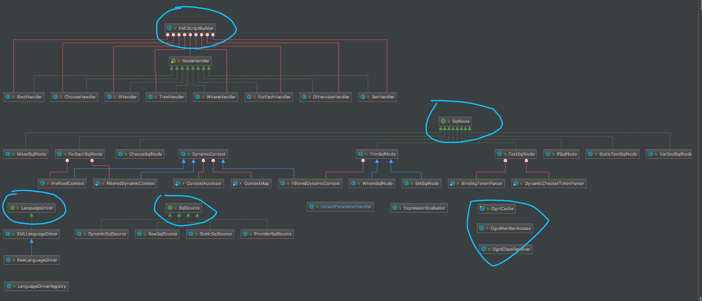
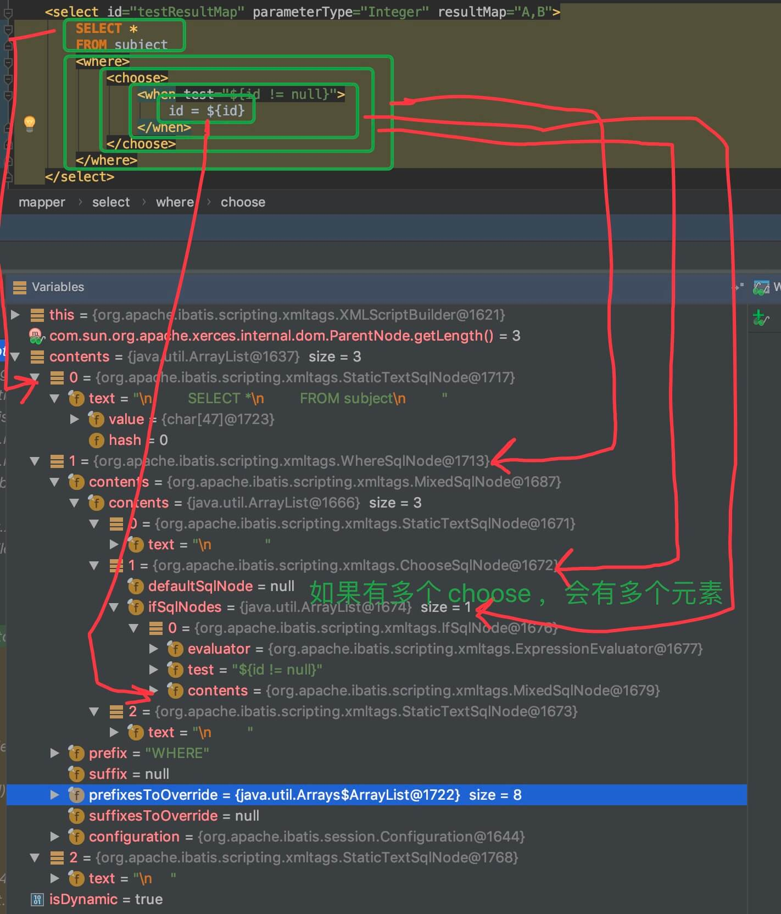
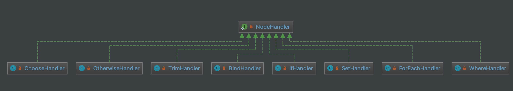
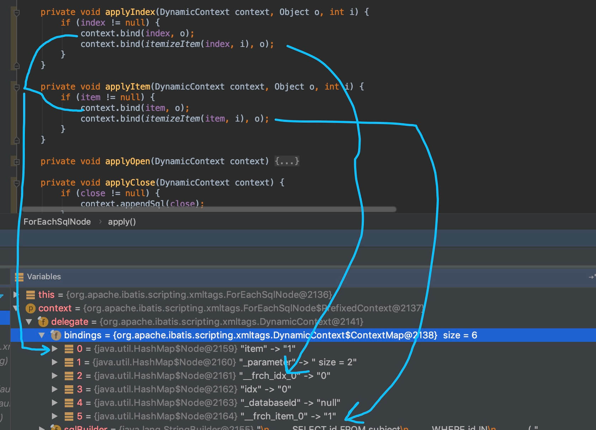
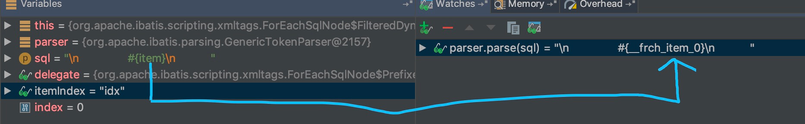

## 1. 概述

本文，我们来分享 MyBatis 的脚本模块，对应 `scripting` 包。如下图所示：


在 [《精尽 MyBatis 源码解析 —— 项目结构一览》](http://svip.iocoder.cn/MyBatis/intro) 中，简单介绍了这个模块如下：

> 拼凑 SQL 语句是一件烦琐且易出错的过程，为了将开发人员从这项枯燥无趣的工作中 解脱出来，MyBatis 实现**动态 SQL 语句**的功能，提供了多种动态 SQL语句对应的节点。例如`<where>` 节点、`<if>` 节点、`<foreach>` 节点等 。通过这些节点的组合使用， 开发人 员可以写出几乎满足所有需求的动态 SQL 语句。
>
> yBatis 中的 `scripting` 模块，会根据用户传入的实参，解析映射文件中定义的动态 SQL 节点，并形成数据库可执行的 SQL 语句。之后会处理 SQL 语句中的占位符，绑定用户传入的实参。

总结来说，`scripting` 模块，最大的作用，就是实现了 MyBatis 的**动态 SQL 语句**的功能。关于这个功能，对应文档为 [《MyBatis 文档 —— 动态 SQL》](http://www.mybatis.org/mybatis-3/zh/dynamic-sql.html) 。

本文涉及的类如下图所示：



## 2. LanguageDriver

`org.apache.ibatis.scripting.LanguageDriver` ，语言驱动接口。代码如下：

```java
// LanguageDriver.java

public interface LanguageDriver {

    /**
     * Creates a {@link ParameterHandler} that passes the actual parameters to the the JDBC statement.
     *
     * 创建 ParameterHandler 对象。
     *
     * @param mappedStatement The mapped statement that is being executed
     * @param parameterObject The input parameter object (can be null)
     * @param boundSql The resulting SQL once the dynamic language has been executed.
     * @return
     * @author Frank D. Martinez [mnesarco]
     * @see DefaultParameterHandler
     */
    ParameterHandler createParameterHandler(MappedStatement mappedStatement, Object parameterObject, BoundSql boundSql);

    /**
     * Creates an {@link SqlSource} that will hold the statement read from a mapper xml file.
     * It is called during startup, when the mapped statement is read from a class or an xml file.
     *
     * 创建 SqlSource 对象，从 Mapper XML 配置的 Statement 标签中，即 <select /> 等。
     *
     * @param configuration The MyBatis configuration
     * @param script XNode parsed from a XML file
     * @param parameterType input parameter type got from a mapper method or specified in the parameterType xml attribute. Can be null.
     * @return
     */
    SqlSource createSqlSource(Configuration configuration, XNode script, Class<?> parameterType);

    /**
     * Creates an {@link SqlSource} that will hold the statement read from an annotation.
     * It is called during startup, when the mapped statement is read from a class or an xml file.
     *
     * 创建 SqlSource 对象，从方法注解配置，即 @Select 等。
     *
     * @param configuration The MyBatis configuration
     * @param script The content of the annotation
     * @param parameterType input parameter type got from a mapper method or specified in the parameterType xml attribute. Can be null.
     * @return
     */
    SqlSource createSqlSource(Configuration configuration, String script, Class<?> parameterType);

}
```

### 2.1 XMLLanguageDriver

`org.apache.ibatis.scripting.xmltags.XMLLanguageDriver` ，实现 LanguageDriver 接口，XML 语言驱动实现类。

#### 2.1.1 createParameterHandler

`#createParameterHandler(MappedStatement mappedStatement, Object parameterObject, BoundSql boundSql)` 方法，代码如下：

```java
// XMLLanguageDriver.java

@Override
public ParameterHandler createParameterHandler(MappedStatement mappedStatement, Object parameterObject, BoundSql boundSql) {
    // 创建 DefaultParameterHandler 对象
    return new DefaultParameterHandler(mappedStatement, parameterObject, boundSql);
}
```

创建的是 DefaultParameterHandler 对象。详细解析，见 [《精尽 MyBatis 源码分析 —— SQL 初始化（下）之 SqlSource》](http://svip.iocoder.cn/MyBatis/scripting-2) 的 [「7.1 DefaultParameterHandler」](http://svip.iocoder.cn/MyBatis/scripting-1/#) 。

#### 2.1.2 createSqlSource

`#createSqlSource(Configuration configuration, XNode script, Class<?> parameterType)` 方法，代码如下：

```java
// XMLLanguageDriver.java

@Override
public SqlSource createSqlSource(Configuration configuration, XNode script, Class<?> parameterType) {
    // 创建 XMLScriptBuilder 对象，执行解析
    XMLScriptBuilder builder = new XMLScriptBuilder(configuration, script, parameterType);
    return builder.parseScriptNode();
}
```

创建 XMLScriptBuilder 对象，执行 `XMLScriptBuilder#parseScriptNode()` 方法，执行解析。详细解析，见 [「3. XMLScriptBuilder」](http://svip.iocoder.cn/MyBatis/scripting-1/#) 。

#### 2.1.3 createSqlSource

`#createSqlSource(Configuration configuration, String script, Class<?> parameterType)` 方法，代码如下：

```java
// XMLLanguageDriver.java

@Override
public SqlSource createSqlSource(Configuration configuration, String script, Class<?> parameterType) {
    // issue #3
    // <1> 如果是 <script> 开头，使用 XML 配置的方式，使用动态 SQL 
    if (script.startsWith("<script>")) {
        // <1.1> 创建 XPathParser 对象，解析出 <script /> 节点
        XPathParser parser = new XPathParser(script, false, configuration.getVariables(), new XMLMapperEntityResolver());
        // <1.2> 调用上面的 #createSqlSource(...) 方法，创建 SqlSource 对象
        return createSqlSource(configuration, parser.evalNode("/script"), parameterType);
    // <2>
    } else {
        // issue #127
        // <2.1> 变量替换
        script = PropertyParser.parse(script, configuration.getVariables());
        // <2.2> 创建 TextSqlNode 对象
        TextSqlNode textSqlNode = new TextSqlNode(script);
        // <2.3.1> 如果是动态 SQL ，则创建 DynamicSqlSource 对象
        if (textSqlNode.isDynamic()) {
            return new DynamicSqlSource(configuration, textSqlNode);
        // <2.3.2> 如果非动态 SQL ，则创建 RawSqlSource 对象
        } else {
            return new RawSqlSource(configuration, script, parameterType);
        }
    }
}
```

`<1>` 处，如果是 `<script>` 开头，使用 XML 配置的方式，使用动态 SQL 。没使用过的胖友，可以看看 [《spring boot(8)-mybatis三种动态sql》](https://blog.csdn.net/wangb_java/article/details/73657958) 。

`<1.1>` 处，创建 XPathParser 对象，解析出 XML `<script />` 节点。

`<1.2>` 处，调用 `#createSqlSource(Configuration configuration, XNode script, Class<?> parameterType)` 方法，创建 SqlSource 对象。

`<2>` 处，

`<2.1>` 处，变量替换。

`<2.2.>` 处，创建 TextSqlNode 对象。详细解析，见 [「6.9 TextSqlNode」](http://svip.iocoder.cn/MyBatis/scripting-1/#) 。

`<2.3.1>` 处，如果是动态 SQL ，则创建 DynamicSqlSource 对象。详细解析，见 [《精尽 MyBatis 源码分析 —— SQL 初始化（下）之 SqlSource》](http://svip.iocoder.cn/MyBatis/scripting-2) 的 [「4.2 DynamicSqlSource」](http://svip.iocoder.cn/MyBatis/scripting-1/#) 。

`<2.3.2>` 处，如果非动态 SQL ，则创建 RawSqlSource 对象。详细解析，见 [《精尽 MyBatis 源码分析 —— SQL 初始化（下）之 SqlSource》](http://svip.iocoder.cn/MyBatis/scripting-2) 的 [「4.3 RawSqlSource」](http://svip.iocoder.cn/MyBatis/scripting-1/#) 。

### 2.2 RawLanguageDriver

`org.apache.ibatis.scripting.defaults.RawLanguageDriver` ，继承 XMLLanguageDriver 类，**RawSqlSource** 语言驱动器实现类，确保创建的 SqlSource 是 **RawSqlSource** 类。代码如下：

```java
// RawLanguageDriver.java

public class RawLanguageDriver extends XMLLanguageDriver {

    @Override
    public SqlSource createSqlSource(Configuration configuration, XNode script, Class<?> parameterType) {
        // 调用父类，创建 SqlSource 对象
        SqlSource source = super.createSqlSource(configuration, script, parameterType);
        // 校验创建的是 RawSqlSource 对象
        checkIsNotDynamic(source);
        return source;
    }

    @Override
    public SqlSource createSqlSource(Configuration configuration, String script, Class<?> parameterType) {
        // 调用父类，创建 SqlSource 对象
        SqlSource source = super.createSqlSource(configuration, script, parameterType);
        // 校验创建的是 RawSqlSource 对象
        checkIsNotDynamic(source);
        return source;
    }

    /**
     * 校验是 RawSqlSource 对象
     *
     * @param source 创建的 SqlSource 对象
     */
    private void checkIsNotDynamic(SqlSource source) {
        if (!RawSqlSource.class.equals(source.getClass())) {
            throw new BuilderException("Dynamic content is not allowed when using RAW language");
        }
    }

}
```

先基于父方法，创建 SqlSource 对象，然后再调用 `#checkIsNotDynamic(SqlSource source)` 方法，进行校验是否为 RawSqlSource 对象。

### 2.3 LanguageDriverRegistry

> 这个类不是 LanguageDriver 的子类。

`org.apache.ibatis.scripting.LanguageDriverRegistry` ，LanguageDriver 注册表。代码如下：

```java
// LanguageDriverRegistry.java

public class LanguageDriverRegistry {

    /**
     * LanguageDriver 映射
     */
    private final Map<Class<? extends LanguageDriver>, LanguageDriver> LANGUAGE_DRIVER_MAP = new HashMap<>();
    /**
     * 默认的 LanguageDriver 类
     */
    private Class<? extends LanguageDriver> defaultDriverClass;

    public void register(Class<? extends LanguageDriver> cls) {
        if (cls == null) {
            throw new IllegalArgumentException("null is not a valid Language Driver");
        }
        // 创建 cls 对应的对象，并添加到 LANGUAGE_DRIVER_MAP 中
        if (!LANGUAGE_DRIVER_MAP.containsKey(cls)) {
            try {
                LANGUAGE_DRIVER_MAP.put(cls, cls.newInstance());
            } catch (Exception ex) {
                throw new ScriptingException("Failed to load language driver for " + cls.getName(), ex);
            }
        }
    }

    public void register(LanguageDriver instance) {
        if (instance == null) {
            throw new IllegalArgumentException("null is not a valid Language Driver");
        }
        // 添加到 LANGUAGE_DRIVER_MAP 中
        Class<? extends LanguageDriver> cls = instance.getClass();
        if (!LANGUAGE_DRIVER_MAP.containsKey(cls)) {
            LANGUAGE_DRIVER_MAP.put(cls, instance);
        }
    }

    public LanguageDriver getDriver(Class<? extends LanguageDriver> cls) {
        return LANGUAGE_DRIVER_MAP.get(cls);
    }

    public LanguageDriver getDefaultDriver() {
        return getDriver(getDefaultDriverClass());
    }

    public Class<? extends LanguageDriver> getDefaultDriverClass() {
        return defaultDriverClass;
    }

    /**
     * 设置 {@link #defaultDriverClass}
     *
     * @param defaultDriverClass 默认的 LanguageDriver 类
     */
    public void setDefaultDriverClass(Class<? extends LanguageDriver> defaultDriverClass) {
        // 注册到 LANGUAGE_DRIVER_MAP 中
        register(defaultDriverClass);
        // 设置 defaultDriverClass 属性
        this.defaultDriverClass = defaultDriverClass;
    }

}
```

#### 2.3.1 初始化

在 Configuration 的构造方法中，会进行初始化。代码如下：

```java
// Configuration.java

/**
 * LanguageDriverRegistry 对象
 */
protected final LanguageDriverRegistry languageRegistry = new LanguageDriverRegistry();

public Configuration() {
    // ... 省略其它代码
    
    // 注册到 languageRegistry 中
    languageRegistry.setDefaultDriverClass(XMLLanguageDriver.class);
    languageRegistry.register(RawLanguageDriver.class);
}
```

默认情况下，使用 XMLLanguageDriver 类。

大多数情况下，我们不会去设置使用的 LanguageDriver 类，而是使用 **XMLLanguageDriver** 类。从 `#getLanguageDriver(Class<? extends LanguageDriver> langClass)` 方法，可知。代码如下：

```java
// Configuration.java

public LanguageDriver getLanguageDriver(Class<? extends LanguageDriver> langClass) {
    // 获得 langClass 类
    if (langClass != null) {
        configuration.getLanguageRegistry().register(langClass);
    } else { // 如果为空，则使用默认类
        langClass = configuration.getLanguageRegistry().getDefaultDriverClass();
    }
    // 获得 LanguageDriver 对象
    return configuration.getLanguageRegistry().getDriver(langClass);
}
```

## 3. XMLScriptBuilder

`org.apache.ibatis.scripting.xmltags.XMLScriptBuilder` ，继承 BaseBuilder 抽象类，XML 动态语句( SQL )构建器，负责将 SQL 解析成 SqlSource 对象。

### 3.1 构造方法

```java
// XMLScriptBuilder.java

/**
 * 当前 SQL 的 XNode 对象
 */
private final XNode context;
/**
 * 是否为动态 SQL
 */
private boolean isDynamic;
/**
 * SQL 方法类型
 */
private final Class<?> parameterType;
/**
 * NodeNodeHandler 的映射
 */
private final Map<String, NodeHandler> nodeHandlerMap = new HashMap<>();

public XMLScriptBuilder(Configuration configuration, XNode context, Class<?> parameterType) {
    super(configuration);
    this.context = context;
    this.parameterType = parameterType;
    // 初始化 nodeHandlerMap 属性
    initNodeHandlerMap();
}
```

调用 `#initNodeHandlerMap()` 方法，初始化 `nodeHandlerMap` 属性。代码如下：

```java
// XMLScriptBuilder.java

private void initNodeHandlerMap() {
    nodeHandlerMap.put("trim", new TrimHandler());
    nodeHandlerMap.put("where", new WhereHandler());
    nodeHandlerMap.put("set", new SetHandler());
    nodeHandlerMap.put("foreach", new ForEachHandler());
    nodeHandlerMap.put("if", new IfHandler());
    nodeHandlerMap.put("choose", new ChooseHandler());
    nodeHandlerMap.put("when", new IfHandler());
    nodeHandlerMap.put("otherwise", new OtherwiseHandler());
    nodeHandlerMap.put("bind", new BindHandler());
}
```

我们可以看到，`nodeHandlerMap` 的 KEY 是熟悉的 MyBatis 的自定义的 XML 标签。并且，每个标签对应**专属**的一个 NodeHandler 实现类。

### 3.2 parseScriptNode

`#parseScriptNode()` 方法，负责将 SQL 解析成 SqlSource 对象。代码如下：

```java
// XMLScriptBuilder.java

public SqlSource parseScriptNode() {
    // <1> 解析 SQL
    MixedSqlNode rootSqlNode = parseDynamicTags(context);
    // <2> 创建 SqlSource 对象
    SqlSource sqlSource;
    if (isDynamic) {
        sqlSource = new DynamicSqlSource(configuration, rootSqlNode);
    } else {
        sqlSource = new RawSqlSource(configuration, rootSqlNode, parameterType);
    }
    return sqlSource;
}
```

`<1>` 方法，调用 `#parseDynamicTags(XNode node)` 方法，解析 SQL 成 MixedSqlNode 对象。详细解析，见 [「3.3 parseDynamicTags」](http://svip.iocoder.cn/MyBatis/scripting-1/#) 。

`<2>` 方法，根据是否是动态 SQL ，创建对应的 DynamicSqlSource 或 RawSqlSource 对象。

### 3.3 parseDynamicTags

`#parseDynamicTags(XNode node)` 方法，解析 SQL 成 MixedSqlNode 对象。代码如下：

```java
// XMLScriptBuilder.java

protected MixedSqlNode parseDynamicTags(XNode node) {
    // <1> 创建 SqlNode 数组
    List<SqlNode> contents = new ArrayList<>();
    // <2> 遍历 SQL 节点的所有子节点
    NodeList children = node.getNode().getChildNodes();
    for (int i = 0; i < children.getLength(); i++) {
        // 当前子节点
        XNode child = node.newXNode(children.item(i));
        // <2.1> 如果类型是 Node.CDATA_SECTION_NODE 或者 Node.TEXT_NODE 时
        if (child.getNode().getNodeType() == Node.CDATA_SECTION_NODE || child.getNode().getNodeType() == Node.TEXT_NODE) {
            // <2.1.1> 获得内容
            String data = child.getStringBody("");
            // <2.1.2> 创建 TextSqlNode 对象
            TextSqlNode textSqlNode = new TextSqlNode(data);
            // <2.1.2.1> 如果是动态的 TextSqlNode 对象
            if (textSqlNode.isDynamic()) {
                // 添加到 contents 中
                contents.add(textSqlNode);
                // 标记为动态 SQL
                isDynamic = true;
            // <2.1.2.2> 如果是非动态的 TextSqlNode 对象
            } else {
                // <2.1.2> 创建 StaticTextSqlNode 添加到 contents 中
                contents.add(new StaticTextSqlNode(data));
            }
        // <2.2> 如果类型是 Node.ELEMENT_NODE
        } else if (child.getNode().getNodeType() == Node.ELEMENT_NODE) { // issue #628
            // <2.2.1> 根据子节点的标签，获得对应的 NodeHandler 对象
            String nodeName = child.getNode().getNodeName();
            NodeHandler handler = nodeHandlerMap.get(nodeName);
            if (handler == null) { // 获得不到，说明是未知的标签，抛出 BuilderException 异常
                throw new BuilderException("Unknown element <" + nodeName + "> in SQL statement.");
            }
            // <2.2.2> 执行 NodeHandler 处理
            handler.handleNode(child, contents);
            // <2.2.3> 标记为动态 SQL
            isDynamic = true;
        }
    }
    // <3> 创建 MixedSqlNode 对象
    return new MixedSqlNode(contents);
}
```

`<1>` 处，创建 SqlNode 数组。

`<2>` 处，遍历 SQL 节点的所有子节点，处理每个子节点成对应的 SqlNode 对象，添加到数组中。如下图，是一个示例：



XML 本身是个**嵌套**的树结构，所以最终的结果，也是**嵌套**的 SqlNode 数组结构。

`<2.1>` 处，如果节点类型是 `Node.CDATA_SECTION_NODE` 或者 `Node.TEXT_NODE` 时。

`<2.1.1>` 处， 获得节点的内容。

`<2.1.2>` 处，创建 TextSqlNode 对象。

`<2.1.2.1>` 处，如果是动态的 TextSqlNode 对象，则添加到 `contents` 中，并标记为动态 SQL 。例如：`SELECT * FROM subject` 。

`<2.1.2.2>` 处，如果非动态的 TextSqlNode 对象，则创建 StaticTextSqlNode 对象，并添加到 `contents` 中。例如：`id = ${id}` 。

`<2.2>` 处，如果节点类型是 `Node.ELEMENT_NODE` 时。例如：`<where> <choose> <when test="${id != null}"> id = ${id} </when> </choose> </where>`。

`<2.2.1>` 处，根据子节点的标签，获得对应的 NodeHandler 对象。

`<2.2.2>` 处，执行 NodeHandler 处理。

`<2.2.3>` 处，标记为动态 SQL 。

`<3>` 处，将 `contents` 数组，封装成 MixedSqlNode 对象。详细解析，见 [「6.10 MixedSqlNode」](http://svip.iocoder.cn/MyBatis/scripting-1/#) 。

## 4. NodeHandler

NodeHandler ，在 XMLScriptBuilder 类中，Node 处理器接口。代码如下：

```java
// XMLScriptBuilder.java

private interface NodeHandler {

    /**
     * 处理 Node
     *
     * @param nodeToHandle 要处理的 XNode 节点
     * @param targetContents 目标的 SqlNode 数组。实际上，被处理的 XNode 节点会创建成对应的 SqlNode 对象，添加到 targetContents 中
     */
    void handleNode(XNode nodeToHandle, List<SqlNode> targetContents);

}
```

NodeHandler 有多个子类实现，如下图所示：



并且，每个 NodeHandler 实现类，也是 **XMLScriptBuilder** 类中。

### 4.1 BindHandler

BindHandler ，实现 NodeHandler 接口，`<bind />` 标签的处理器。代码如下：

```java
// XMLScriptBuilder.java

private class BindHandler implements NodeHandler {

    public BindHandler() {
        // Prevent Synthetic Access
    }

    @Override
    public void handleNode(XNode nodeToHandle, List<SqlNode> targetContents) {
        // 解析 name、value 属性
        final String name = nodeToHandle.getStringAttribute("name");
        final String expression = nodeToHandle.getStringAttribute("value");
        // 创建 VarDeclSqlNode 对象
        final VarDeclSqlNode node = new VarDeclSqlNode(name, expression);
        // 添加到 targetContents 中
        targetContents.add(node);
    }
}
```

解析 `name`、`value` 属性，并创建 VarDeclSqlNode 对象，最后添加到 `targetContents` 中。

关于 VarDeclSqlNode 类，详细解析，见 [「6.1 VarDeclSqlNode」](http://svip.iocoder.cn/MyBatis/scripting-1/#) 。

### 4.2 TrimHandler

TrimHandler ，实现 NodeHandler 接口，`<trim />` 标签的处理器。代码如下：

```java
// XMLScriptBuilder.java

private class TrimHandler implements NodeHandler {

    public TrimHandler() {
        // Prevent Synthetic Access
    }

    @Override
    public void handleNode(XNode nodeToHandle, List<SqlNode> targetContents) {
        // <1> 解析内部的 SQL 节点，成 MixedSqlNode 对象
        MixedSqlNode mixedSqlNode = parseDynamicTags(nodeToHandle);
        // <2> 获得 prefix、prefixOverrides、"suffix"、suffixOverrides 属性
        String prefix = nodeToHandle.getStringAttribute("prefix");
        String prefixOverrides = nodeToHandle.getStringAttribute("prefixOverrides");
        String suffix = nodeToHandle.getStringAttribute("suffix");
        String suffixOverrides = nodeToHandle.getStringAttribute("suffixOverrides");
        // <3> 创建 TrimSqlNode 对象
        TrimSqlNode trim = new TrimSqlNode(configuration, mixedSqlNode, prefix, prefixOverrides, suffix, suffixOverrides);
        // <4> 添加到 targetContents 中
        targetContents.add(trim);
    }

}
```

`<1>` 处，调用 `#parseDynamicTags(XNode node)` 方法，解析内部的 SQL 节点，成 MixedSqlNode 对象。即 [「3.3 parseDynamicTags」](http://svip.iocoder.cn/MyBatis/scripting-1/#) 的流程。

`<2>` 处，获得 `prefix`、`prefixOverrides`、`suffix`、`suffixOverrides` 属性。

`<3>` 处，创建 TrimSqlNode 对象。详细解析，见 [「6.2 TrimSqlNode」](http://svip.iocoder.cn/MyBatis/scripting-1/#) 。

`<4>` 处，添加到 `targetContents` 中。

### 4.3 WhereHandler

WhereHandler ，实现 NodeHandler 接口，`<where />` 标签的处理器。代码如下：

```java
// XMLScriptBuilder.java

private class WhereHandler implements NodeHandler {

    public WhereHandler() {
        // Prevent Synthetic Access
    }

    @Override
    public void handleNode(XNode nodeToHandle, List<SqlNode> targetContents) {
        // 解析内部的 SQL 节点，成 MixedSqlNode 对象
        MixedSqlNode mixedSqlNode = parseDynamicTags(nodeToHandle);
        // 创建 WhereSqlNode 对象
        WhereSqlNode where = new WhereSqlNode(configuration, mixedSqlNode);
        // 添加到 targetContents 中
        targetContents.add(where);
    }

}
```

从实现逻辑的思路上，和 TrimHandler 是一个套路的。

关于 WhereSqlNode ，详细解析，见 [「6.3 WhereSqlNode」](http://svip.iocoder.cn/MyBatis/scripting-1/#) 。

### 4.4 SetHandler

SetHandler ，实现 NodeHandler 接口，`<set />` 标签的处理器。代码如下：

```java
// XMLScriptBuilder.java

private class SetHandler implements NodeHandler {

    public SetHandler() {
        // Prevent Synthetic Access
    }

    @Override
    public void handleNode(XNode nodeToHandle, List<SqlNode> targetContents) {
        // 解析内部的 SQL 节点，成 MixedSqlNode 对象
        MixedSqlNode mixedSqlNode = parseDynamicTags(nodeToHandle);
        // 创建 SetSqlNode 对象
        SetSqlNode set = new SetSqlNode(configuration, mixedSqlNode);
        // 添加到 targetContents 中
        targetContents.add(set);
    }

}
```

从实现逻辑的思路上，和 TrimHandler 也是一个套路的。

关于 SetSqlNode ，详细解析，见 [「6.4 SetSqlNode」](http://svip.iocoder.cn/MyBatis/scripting-1/#) 。

### 4.5 ForEachHandler

ForEachHandler ，实现 NodeHandler 接口，`<foreach />` 标签的处理器。代码如下：

```java
// XMLScriptBuilder.java

private class ForEachHandler implements NodeHandler {

    public ForEachHandler() {
        // Prevent Synthetic Access
    }

    @Override
    public void handleNode(XNode nodeToHandle, List<SqlNode> targetContents) {
        // 解析内部的 SQL 节点，成 MixedSqlNode 对象
        MixedSqlNode mixedSqlNode = parseDynamicTags(nodeToHandle);
        // 获得 collection、item、index、open、close、separator 属性
        String collection = nodeToHandle.getStringAttribute("collection");
        String item = nodeToHandle.getStringAttribute("item");
        String index = nodeToHandle.getStringAttribute("index");
        String open = nodeToHandle.getStringAttribute("open");
        String close = nodeToHandle.getStringAttribute("close");
        String separator = nodeToHandle.getStringAttribute("separator");
        // 创建 ForEachSqlNode 对象
        ForEachSqlNode forEachSqlNode = new ForEachSqlNode(configuration, mixedSqlNode, collection, index, item, open, close, separator);
        // 添加到 targetContents 中
        targetContents.add(forEachSqlNode);
    }

}
```

关于 ForEachSqlNode ，详细解析，见 [「6.5 ForEachSqlNode」](http://svip.iocoder.cn/MyBatis/scripting-1/#) 。

### 4.6 IfHandler

IfHandler ，实现 NodeHandler 接口，`<if />` 标签的处理器。代码如下：

```java
// XMLScriptBuilder.java

private class IfHandler implements NodeHandler {

    public IfHandler() {
        // Prevent Synthetic Access
    }

    @Override
    public void handleNode(XNode nodeToHandle, List<SqlNode> targetContents) {
        // 解析内部的 SQL 节点，成 MixedSqlNode 对象
        MixedSqlNode mixedSqlNode = parseDynamicTags(nodeToHandle);
        // 获得 test 属性
        String test = nodeToHandle.getStringAttribute("test");
        // 创建 IfSqlNode 对象
        IfSqlNode ifSqlNode = new IfSqlNode(mixedSqlNode, test);
        // 添加到 targetContents 中
        targetContents.add(ifSqlNode);
    }
    
}
```

关于 IfSqlNode ，详细解析，见 [「6.6 IfSqlNode」](http://svip.iocoder.cn/MyBatis/scripting-1/#) 。

### 4.7 OtherwiseHandler

OtherwiseHandler ，实现 NodeHandler 接口，`<otherwise />` 标签的处理器。代码如下：

```java
// XMLScriptBuilder.java

private class OtherwiseHandler implements NodeHandler {

    public OtherwiseHandler() {
        // Prevent Synthetic Access
    }

    @Override
    public void handleNode(XNode nodeToHandle, List<SqlNode> targetContents) {
        // 解析内部的 SQL 节点，成 MixedSqlNode 对象
        MixedSqlNode mixedSqlNode = parseDynamicTags(nodeToHandle);
        // 添加到 targetContents 中
        targetContents.add(mixedSqlNode);
    }

}
```

对于 `<otherwise />` 标签，解析的结果是 MixedSqlNode 对象即可。因为，只要执行到，**一定满足条件**。

### 4.8 ChooseHandler

ChooseHandler ，实现 NodeHandler 接口，`<choose />` 标签的处理器。代码如下：

```java
// XMLScriptBuilder.java

private class ChooseHandler implements NodeHandler {

    public ChooseHandler() {
        // Prevent Synthetic Access
    }

    @Override
    public void handleNode(XNode nodeToHandle, List<SqlNode> targetContents) {
        List<SqlNode> whenSqlNodes = new ArrayList<>();
        List<SqlNode> otherwiseSqlNodes = new ArrayList<>();
        // 解析 `<when />` 和 `<otherwise />` 的节点们
        handleWhenOtherwiseNodes(nodeToHandle, whenSqlNodes, otherwiseSqlNodes);
        // 获得 `<otherwise />` 的节点
        SqlNode defaultSqlNode = getDefaultSqlNode(otherwiseSqlNodes);
        // 创建 ChooseSqlNode 对象
        ChooseSqlNode chooseSqlNode = new ChooseSqlNode(whenSqlNodes, defaultSqlNode);
        // 添加到 targetContents 中
        targetContents.add(chooseSqlNode);
    }

    private void handleWhenOtherwiseNodes(XNode chooseSqlNode, List<SqlNode> ifSqlNodes, List<SqlNode> defaultSqlNodes) {
        List<XNode> children = chooseSqlNode.getChildren();
        for (XNode child : children) {
            String nodeName = child.getNode().getNodeName();
            NodeHandler handler = nodeHandlerMap.get(nodeName);
            if (handler instanceof IfHandler) { // 处理 `<when />` 标签的情况
                handler.handleNode(child, ifSqlNodes);
            } else if (handler instanceof OtherwiseHandler) { // 处理 `<otherwise />` 标签的情况
                handler.handleNode(child, defaultSqlNodes);
            }
        }
    }

    // 至多允许有一个 SqlNode 节点
    private SqlNode getDefaultSqlNode(List<SqlNode> defaultSqlNodes) {
        SqlNode defaultSqlNode = null;
        if (defaultSqlNodes.size() == 1) {
            defaultSqlNode = defaultSqlNodes.get(0);
        } else if (defaultSqlNodes.size() > 1) {
            throw new BuilderException("Too many default (otherwise) elements in choose statement.");
        }
        return defaultSqlNode;
    }
}
```

通过组合 IfHandler 和 OtherwiseHandler 两个处理器，实现对子节点们的解析。最终，生成 ChooseSqlNode 对象。

## 5. DynamicContext

`org.apache.ibatis.scripting.xmltags.DynamicContext` ，动态 SQL ，用于每次执行 SQL 操作时，记录动态 SQL 处理后的最终 SQL 字符串。

### 5.1 构造方法

```java
// DynamicContext.java

/**
 * {@link #bindings} _parameter 的键，参数
 */
public static final String PARAMETER_OBJECT_KEY = "_parameter";
/**
 * {@link #bindings} _databaseId 的键，数据库编号
 */
public static final String DATABASE_ID_KEY = "_databaseId";

static {
    // <1.2> 设置 OGNL 的属性访问器
    OgnlRuntime.setPropertyAccessor(ContextMap.class, new ContextAccessor());
}

/**
 * 上下文的参数集合
 */
private final ContextMap bindings;
/**
 * 生成后的 SQL
 */
private final StringBuilder sqlBuilder = new StringBuilder();
/**
 * 唯一编号。在 {@link org.apache.ibatis.scripting.xmltags.XMLScriptBuilder.ForEachHandler} 使用
 */
private int uniqueNumber = 0;

// 当需要使用到 OGNL 表达式时，parameterObject 非空
public DynamicContext(Configuration configuration, Object parameterObject) {
    // <1> 初始化 bindings 参数
    if (parameterObject != null && !(parameterObject instanceof Map)) {
        MetaObject metaObject = configuration.newMetaObject(parameterObject); // <1.1>
        bindings = new ContextMap(metaObject);
    } else {
        bindings = new ContextMap(null);
    }
    // <2> 添加 bindings 的默认值
    bindings.put(PARAMETER_OBJECT_KEY, parameterObject);
    bindings.put(DATABASE_ID_KEY, configuration.getDatabaseId());
}
```

`<1>` 处，初始化 `bindings` 参数，创建 ContextMap 对象。

`parameterObject` 方法参数，当需要使用到 OGNL 表达式时，`parameterObject` 才会非空。下文，我们将会看到为什么。

`<1.1>` 处，我们可以看到，调用 `Configuration#newMetaObject(Object object)` 方法，创建 MetaObject 对象，实现对 `parameterObject` 参数的访问。代码如下：

```java
// Configuration.java

protected ReflectorFactory reflectorFactory = new DefaultReflectorFactory();
protected ObjectFactory objectFactory = new DefaultObjectFactory();
protected ObjectWrapperFactory objectWrapperFactory = new DefaultObjectWrapperFactory();
    
public MetaObject newMetaObject(Object object) {
    return MetaObject.forObject(object, objectFactory, objectWrapperFactory, reflectorFactory);
}
```

关于 MetaObject ，在 [《精尽 MyBatis 源码分析 —— 反射模块》](http://svip.iocoder.cn/MyBatis/reflection-package)

`<1.2>` 处， 设置 OGNL 的属性访问器。其中，OgnlRuntime 是 [`ognl`](https://mvnrepository.com/artifact/ognl/ognl) 库中的类。并且，ContextMap 对应的访问器是 ContextAccessor 类。

`<2>` 处，添加 `bindings` 的默认值。目前有 `PARAMETER_OBJECT_KEY`、`DATABASE_ID_KEY` 属性。

### 5.2 bindings 属性相关的方法

```java
// DynamicContext.java

public Map<String, Object> getBindings() {
    return bindings;
}

public void bind(String name, Object value) {
    bindings.put(name, value);
}
```

可以往 `bindings` 属性中，添加新的 KV 键值对。

### 5.3 sqlBuilder 属性相关的方法

```java
// DynamicContext.java

public void appendSql(String sql) {
    sqlBuilder.append(sql);
    sqlBuilder.append(" ");
}

public String getSql() {
    return sqlBuilder.toString().trim();
}
```

可以不断向 `sqlBuilder` 属性中，添加 SQL **段**。

### 5.4 uniqueNumber 属性相关的方法

```java
// DynamicContext.java

public int getUniqueNumber() {
    return uniqueNumber++;
}
```

每次请求，获得新的序号。

### 5.5 ContextMap

ContextMap ，是 DynamicContext 的内部静态类，继承 HashMap 类，上下文的参数集合。代码如下：

```java
// DynamicContext.java

static class ContextMap extends HashMap<String, Object> {

    private static final long serialVersionUID = 2977601501966151582L;

    /**
     * parameter 对应的 MetaObject 对象
     */
    private MetaObject parameterMetaObject;

    public ContextMap(MetaObject parameterMetaObject) {
        this.parameterMetaObject = parameterMetaObject;
    }

    @Override
    public Object get(Object key) {
        // 如果有 key 对应的值，直接获得
        String strKey = (String) key;
        if (super.containsKey(strKey)) {
            return super.get(strKey);
        }

        // 从 parameterMetaObject 中，获得 key 对应的属性
        if (parameterMetaObject != null) {
            // issue #61 do not modify the context when reading
            return parameterMetaObject.getValue(strKey);
        }

        return null;
    }
}
```

该类在 HashMap 的基础上，增加支持对 `parameterMetaObject` 属性的访问。

### 5.6 ContextAccessor

ContextAccessor ，是 DynamicContext 的内部静态类，实现 `ognl.PropertyAccessor` 接口，上下文访问器。代码如下：

```java
// DynamicContext.java

static class ContextAccessor implements PropertyAccessor {

    @Override
    public Object getProperty(Map context, Object target, Object name)
            throws OgnlException {
        Map map = (Map) target;

        // 优先从 ContextMap 中，获得属性
        Object result = map.get(name);
        if (map.containsKey(name) || result != null) {
            return result;
        }

        // <x> 如果没有，则从 PARAMETER_OBJECT_KEY 对应的 Map 中，获得属性
        Object parameterObject = map.get(PARAMETER_OBJECT_KEY);
        if (parameterObject instanceof Map) {
            return ((Map) parameterObject).get(name);
        }

        return null;
    }

    @Override
    public void setProperty(Map context, Object target, Object name, Object value)
            throws OgnlException {
        Map<Object, Object> map = (Map<Object, Object>) target;
        map.put(name, value);
    }

    @Override
    public String getSourceAccessor(OgnlContext arg0, Object arg1, Object arg2) {
        return null;
    }

    @Override
    public String getSourceSetter(OgnlContext arg0, Object arg1, Object arg2) {
        return null;
    }
}
```

`<x>` 处，为什么可以访问 `PARAMETER_OBJECT_KEY` 属性，并且是 Map 类型呢？回看 DynamicContext 构造方法，就可以明白了。

## 6. SqlNode

`org.apache.ibatis.scripting.xmltags.SqlNode` ，SQL Node 接口，每个 XML Node 会解析成对应的 SQL Node 对象。代码如下：

```java
// SqlNode.java

public interface SqlNode {

    /**
     * 应用当前 SQL Node 节点
     *
     * @param context 上下文
     * @return 当前 SQL Node 节点是否应用成功。
     */
    boolean apply(DynamicContext context);

}
```

比较难以理解的是 `#apply(DynamicContext context)` 方法，返回值类型是 `boolean` 。为什么呢？具体在 ChooseSqlNode 可找到答案。

### 6.1 VarDeclSqlNode

`org.apache.ibatis.scripting.xmltags.VarDeclSqlNode` ，实现 SqlNode 接口，`<bind />` 标签的 SqlNode 实现类。代码如下：

```java
// VarDeclSqlNode.java

public class VarDeclSqlNode implements SqlNode {

    /**
     * 名字
     */
    private final String name;
    /**
     * 表达式
     */
    private final String expression;

    public VarDeclSqlNode(String var, String exp) {
        name = var;
        expression = exp;
    }

    @Override
    public boolean apply(DynamicContext context) {
        // <1> 获得值
        final Object value = OgnlCache.getValue(expression, context.getBindings());
        // <2> 绑定到上下文
        context.bind(name, value);
        return true;
    }

}
```

`<1>` 处，调用 `OgnlCache#getValue(String expression, Object root)` 方法，获得表达式对应的值。详细解析，见 [「7.1 OgnlCache」](http://svip.iocoder.cn/MyBatis/scripting-1/#) 。

`<2>` 处，调用 `DynamicContext#bind(String name, Object value)` 方法，绑定到上下文。

### 6.2 TrimSqlNode

`org.apache.ibatis.scripting.xmltags.TrimSqlNode` ，实现 SqlNode 接口，`<trim />` 标签的 SqlNode 实现类。

关于 TrimSqlNode 的概念，可能从类名上无法很好的反馈出来，可以看下文档 [《MyBatis 文档 —— 动态 SQL》](http://www.mybatis.org/mybatis-3/zh/dynamic-sql.html) ，搜 [「trim」](http://svip.iocoder.cn/MyBatis/scripting-1/#) 关键字。

另外，在下文中，我们会看到，`<trim />` 标签是 `<where />` 和 `<set />` 标签的**基础**。

#### 6.2.1 构造方法

```java
// TrimSqlNode.java

/**
 * 内含的 SqlNode 节点
 */
private final SqlNode contents;
/**
 * 前缀
 */
private final String prefix;
/**
 * 后缀
 */
private final String suffix;
/**
 * 需要被删除的前缀
 */
private final List<String> prefixesToOverride;
/**
 * 需要被删除的后缀
 */
private final List<String> suffixesToOverride;
private final Configuration configuration;

public TrimSqlNode(Configuration configuration, SqlNode contents, String prefix, String prefixesToOverride, String suffix, String suffixesToOverride) {
    this(configuration, contents, prefix, parseOverrides(prefixesToOverride), suffix, parseOverrides(suffixesToOverride));
}

protected TrimSqlNode(Configuration configuration, SqlNode contents, String prefix, List<String> prefixesToOverride, String suffix, List<String> suffixesToOverride) {
    this.contents = contents;
    this.prefix = prefix;
    this.prefixesToOverride = prefixesToOverride;
    this.suffix = suffix;
    this.suffixesToOverride = suffixesToOverride;
    this.configuration = configuration;
}
```

`#parseOverrides(String overrides)` 方法，使用 `|` 分隔字符串成字符串数组，并都转换成**大写**。代码如下：

```java
// TrimSqlNode.java

private static List<String> parseOverrides(String overrides) {
    if (overrides != null) {
        final StringTokenizer parser = new StringTokenizer(overrides, "|", false);
        final List<String> list = new ArrayList<>(parser.countTokens());
        while (parser.hasMoreTokens()) {
            list.add(parser.nextToken().toUpperCase(Locale.ENGLISH));
        }
        return list;
    }
    return Collections.emptyList();
}
```

#### 6.2.2 apply

```java
// TrimSqlNode.java

@Override
public boolean apply(DynamicContext context) {
    // <1> 创建 FilteredDynamicContext 对象
    FilteredDynamicContext filteredDynamicContext = new FilteredDynamicContext(context);
    // <2> 执行 contents 的应用
    boolean result = contents.apply(filteredDynamicContext);
    // <3> 执行 FilteredDynamicContext 的应用
    filteredDynamicContext.applyAll();
    return result;
}
```

`<1>` 处，创建 FilteredDynamicContext 对象。关于 FilteredDynamicContext 类，在 [「6.2.3 FilteredDynamicContext」](http://svip.iocoder.cn/MyBatis/scripting-1/#) 。

`<2>` 处，执行 `contents` 的应用。

`<3>` 处，调用 `FilteredDynamicContext#applyAll()` 方法，执行 FilteredDynamicContext 的应用。

#### 6.2.3 FilteredDynamicContext

FilteredDynamicContext ，是 TrimSqlNode 的内部类，继承 DynamicContext 类，支持 **trim** 逻辑的 DynamicContext 实现类。

##### 6.2.3.1 构造方法

```java
// TrimSqlNode.java

/**
 * 委托的 DynamicContext 对象
 */
private DynamicContext delegate;
/**
 * 是否 prefix 已经被应用
 */
private boolean prefixApplied;
/**
 * 是否 suffix 已经被应用
 */
private boolean suffixApplied;
/**
 * StringBuilder 对象
 *
 * @see #appendSql(String)
 */
private StringBuilder sqlBuffer;

public FilteredDynamicContext(DynamicContext delegate) {
    super(configuration, null);
    this.delegate = delegate;
    this.prefixApplied = false;
    this.suffixApplied = false;
    this.sqlBuffer = new StringBuilder();
}

@Override
public Map<String, Object> getBindings() {
    return delegate.getBindings();
}

@Override
public void bind(String name, Object value) {
    delegate.bind(name, value);
}

@Override
public int getUniqueNumber() {
    return delegate.getUniqueNumber();
}

@Override
public String getSql() {
    return delegate.getSql();
}
```

每个实现的方法，都直接调用 `delegate` 对应的方法。除了 `#append(String sql)` 方法，**以外**。详细解析，见 [「7.2.3.2」](http://svip.iocoder.cn/MyBatis/scripting-1/#) 。

##### 7.2.3.2 append

```java
// TrimSqlNode.java

@Override
public void appendSql(String sql) {
    sqlBuffer.append(sql);
}
```

该方法，将拼接的 `sql` ，暂时存储到 `sqlBuffer` 中。

最终，会通过 `#applyAll()` 方法，将 `sqlBuffer` 处理完后，添加回 `delegate.sqlBuffer` 中。

##### 7.2.3.3 applyAll

```java
// TrimSqlNode.java

public void applyAll() {
    // <1> trim 掉多余的空格，生成新的 sqlBuffer 对象
    sqlBuffer = new StringBuilder(sqlBuffer.toString().trim());
    // <2> 将 sqlBuffer 大写，生成新的 trimmedUppercaseSql 对象
    String trimmedUppercaseSql = sqlBuffer.toString().toUpperCase(Locale.ENGLISH);
    // <3> 应用 TrimSqlNode 的 trim 逻辑
    if (trimmedUppercaseSql.length() > 0) {
        applyPrefix(sqlBuffer, trimmedUppercaseSql);
        applySuffix(sqlBuffer, trimmedUppercaseSql);
    }
    // <4> 将结果，添加到 delegate 中
    delegate.appendSql(sqlBuffer.toString());
}
```

`<1>` 处，trim 掉多余的空格，生成新的 `sqlBuffer` 对象。

`<2>` 处，将 `sqlBuffer` **大写**，生成新的 `trimmedUppercaseSql` 对象。为什么呢？因为，TrimSqlNode 对 `prefixesToOverride` 和 `suffixesToOverride` 属性，都进行了**大写**的处理，需要保持统一。但是，又不能直接修改 `sqlBuffer` ，因为这样就相当于修改了原始的 SQL 。

`<3>` 处，应用 TrimSqlNode 的 trim 逻辑。

`#applyPrefix(StringBuilder sql, String trimmedUppercaseSql)` 方法，代码如下：

```java
// TrimSqlNode.java

private void applyPrefix(StringBuilder sql, String trimmedUppercaseSql) {
    if (!prefixApplied) {
        prefixApplied = true;
        // prefixesToOverride 非空，先删除
        if (prefixesToOverride != null) {
            for (String toRemove : prefixesToOverride) {
                if (trimmedUppercaseSql.startsWith(toRemove)) {
                    sql.delete(0, toRemove.trim().length());
                    break;
                }
            }
        }
        // prefix 非空，再添加
        if (prefix != null) {
            sql.insert(0, " ");
            sql.insert(0, prefix);
        }
    }
}
```

`#applySuffix(StringBuilder sql, String trimmedUppercaseSql)` 方法，代码如下：

```java
// TrimSqlNode.java

private void applySuffix(StringBuilder sql, String trimmedUppercaseSql) {
    if (!suffixApplied) {
        suffixApplied = true;
        // suffixesToOverride 非空，先删除
        if (suffixesToOverride != null) {
            for (String toRemove : suffixesToOverride) {
                if (trimmedUppercaseSql.endsWith(toRemove) || trimmedUppercaseSql.endsWith(toRemove.trim())) {
                    int start = sql.length() - toRemove.trim().length();
                    int end = sql.length();
                    sql.delete(start, end);
                    break;
                }
            }
        }
        // suffix 非空，再添加
        if (suffix != null) {
            sql.append(" ");
            sql.append(suffix);
        }
    }
}
```

`<4>` 处，将结果，添加到 `delegate` 中。

### 6.3 WhereSqlNode

`org.apache.ibatis.scripting.xmltags.WhereSqlNode` ，继承 TrimSqlNode 类，`<where />` 标签的 SqlNode 实现类。代码如下：

```java
// WhereSqlNode.java

public class WhereSqlNode extends TrimSqlNode {

    private static List<String> prefixList = Arrays.asList("AND ", "OR ", "AND\n", "OR\n", "AND\r", "OR\r", "AND\t", "OR\t");

    public WhereSqlNode(Configuration configuration, SqlNode contents) {
        super(configuration, contents, "WHERE", prefixList, null, null);
    }

}
```

这就是为什么，说 WhereHandler 和 TrimHandler 是一个套路的原因。

### 6.4 SetSqlNode

`org.apache.ibatis.scripting.xmltags.SetSqlNode` ，继承 TrimSqlNode 类，`<set />` 标签的 SqlNode 实现类。代码如下：

```java
// WhereSqlNode.java

public class SetSqlNode extends TrimSqlNode {

    private static List<String> suffixList = Collections.singletonList(",");

    public SetSqlNode(Configuration configuration, SqlNode contents) {
        super(configuration, contents, "SET", null, null, suffixList);
    }

}
```

这就是为什么，说 SetHandler 和 TrimHandler 是一个套路的原因。

### 6.5 ForEachSqlNode

`org.apache.ibatis.scripting.xmltags.ForEachSqlNode` ，实现 SqlNode 接口，`<foreach />` 标签的 SqlNode 实现类。

#### 6.5.1 构造方法

```java
// ForEachSqlNode.java

private final ExpressionEvaluator evaluator;
/**
 * 集合的表达式
 */
private final String collectionExpression;
private final SqlNode contents;
private final String open;
private final String close;
private final String separator;
/**
 * 集合项
 */
private final String item;
/**
 * 索引变量
 */
private final String index;
private final Configuration configuration;

public ForEachSqlNode(Configuration configuration, SqlNode contents, String collectionExpression, String index, String item, String open, String close, String separator) {
    this.evaluator = new ExpressionEvaluator();
    this.collectionExpression = collectionExpression;
    this.contents = contents;
    this.open = open;
    this.close = close;
    this.separator = separator;
    this.index = index;
    this.item = item;
    this.configuration = configuration;
}
```

### 6.5.2 apply

```java
// ForEachSqlNode.java

@Override
public boolean apply(DynamicContext context) {
    Map<String, Object> bindings = context.getBindings();
    // <1> 获得遍历的集合的 Iterable 对象，用于遍历。
    final Iterable<?> iterable = evaluator.evaluateIterable(collectionExpression, bindings);
    if (!iterable.iterator().hasNext()) {
        return true;
    }
    boolean first = true;
    // <2> 添加 open 到 SQL 中
    applyOpen(context);
    int i = 0;
    for (Object o : iterable) {
        // <3> 记录原始的 context 对象
        DynamicContext oldContext = context;
        // <4> 生成新的 context
        if (first || separator == null) {
            context = new PrefixedContext(context, "");
        } else {
            context = new PrefixedContext(context, separator);
        }
        // <5> 获得唯一编号
        int uniqueNumber = context.getUniqueNumber();
        // Issue #709
        // <6> 绑定到 context 中
        if (o instanceof Map.Entry) {
            @SuppressWarnings("unchecked")
            Map.Entry<Object, Object> mapEntry = (Map.Entry<Object, Object>) o;
            applyIndex(context, mapEntry.getKey(), uniqueNumber);
            applyItem(context, mapEntry.getValue(), uniqueNumber);
        } else {
            applyIndex(context, i, uniqueNumber);
            applyItem(context, o, uniqueNumber);
        }
        // <7> 执行 contents 的应用
        contents.apply(new FilteredDynamicContext(configuration, context, index, item, uniqueNumber));
        // <8> 判断 prefix 是否已经插入
        if (first) {
            first = !((PrefixedContext) context).isPrefixApplied();
        }
        // <9> 恢复原始的 context 对象
        context = oldContext;
        i++;
    }
    // <10> 添加 close 到 SQL 中
    applyClose(context);
    // <11> 移除 index 和 item 对应的绑定
    context.getBindings().remove(item);
    context.getBindings().remove(index);
    return true;
}
```

我们假设以如下查询为示例：

```xml
<select id="getSubjectList" parameterType="List" resultType="List">
    SELECT id FROM subject
    WHERE id IN
      <foreach collection="ids" index="idx" item="item" open="("  close=")" separator=",">
          #{item}
      </foreach>
</select>
```

`<1>` 处，调用 `ExpressionEvaluator#evaluateBoolean(String expression, Object parameterObject)` 方法，获得遍历的集合的 Iterable 对象，用于遍历。详细解析，见 [「7.4 ExpressionEvaluator」](http://svip.iocoder.cn/MyBatis/scripting-1/#) 。

`<2>` 处，调用 `#applyOpen(DynamicContext context)` 方法，添加 `open` 到 SQL 中。代码如下：

```java
// ForEachSqlNode.java

private void applyOpen(DynamicContext context) {
    if (open != null) {
        context.appendSql(open);
    }
}
```

下面开始，我们要遍历 `iterable` 了。

`<3>` 处，记录原始的 `context` 对象。为什么呢？因为 `<4>` 处，会生成新的 `context` 对象。

`<4>` 处，生成新的 `context` 对象。类型为 PrefixedContext 对象，只有在非首次，才会传入 `separator` 属性。因为，PrefixedContext 处理的是集合元素之间的分隔符。详细解析，见 [「6.5.3 PrefixedContext」](http://svip.iocoder.cn/MyBatis/scripting-1/#) 。

`<5>` 处，获得**唯一**编号。

`<6>` 处，绑定到 `context` 中。调用的两个方法，代码如下：

```java
// ForEachSqlNode.java

public static final String ITEM_PREFIX = "__frch_";

private void applyIndex(DynamicContext context, Object o, int i) {
    if (index != null) {
        context.bind(index, o);
        context.bind(itemizeItem(index, i), o);
    }
}

private void applyItem(DynamicContext context, Object o, int i) {
    if (item != null) {
        context.bind(item, o);
        context.bind(itemizeItem(item, i), o);
    }
}

private static String itemizeItem(String item, int i) {
    return ITEM_PREFIX + item + "_" + i;
}
```

上述实例，效果如下图：



另外，此处也根据是否为 Map.Entry 类型，分成了两种情况。官方文档说明如下：

> 你可以将任何可迭代对象（如 List、Set 等）、Map 对象或者数组对象传递给 foreach 作为集合参数。当使用可迭代对象或者数组时，index 是当前迭代的次数，item 的值是本次迭代获取的元素。当使用 Map 对象（或者 Map.Entry 对象的集合）时，index 是键，item 是值。

`<7>` 处，执行 `contents` 的应用。

例如说，此处 `contents` 就是上述示例的 `" #{item}"` 。

另外，进一步将 `context` 对象，封装成 FilteredDynamicContext 对象。

`<8>` 处，判断 `prefix` 是否已经插入。如果是，则 `first` 会被设置为 `false` 。然后，胖友回过头看看 `<4>` 处的逻辑，是不是清晰多了。

`<9>` 处，恢复原始的 `context` 对象。然后，胖友回过头看看 `<3>` 处的逻辑，是不是清晰多了。

`<10>` 处，调用 `#applyClose(DynamicContext context)` 方法，添加 `close` 到 SQL 中。代码如下：

```java
// ForEachSqlNode.java

private void applyClose(DynamicContext context) {
    if (close != null) {
        context.appendSql(close);
    }
}
```

`<11>` 处，移除 `index` 和 `item` 属性对应的绑定。这两个绑定，是在 `<6>` 处被添加的。

#### 6.5.3 PrefixedContext

PrefixedContext ，是 ForEachSqlNode 的内部类，继承 DynamicContext 类，支持添加 `<foreach />` 标签中，多个元素之间的**分隔符**的 DynamicContext 实现类。代码如下：

```java
// ForEachSqlNode.java

private class PrefixedContext extends DynamicContext {

    private final DynamicContext delegate;
    private final String prefix;
    /**
     * 是否已经应用 prefix
     */
    private boolean prefixApplied;

    public PrefixedContext(DynamicContext delegate, String prefix) {
        super(configuration, null);
        this.delegate = delegate;
        this.prefix = prefix;
        this.prefixApplied = false;
    }

    public boolean isPrefixApplied() {
        return prefixApplied;
    }

    @Override
    public Map<String, Object> getBindings() {
        return delegate.getBindings();
    }

    @Override
    public void bind(String name, Object value) {
        delegate.bind(name, value);
    }

    @Override
    public void appendSql(String sql) {
        // 如果未应用 prefix ，并且，方法参数 sql 非空
        // 则添加 prefix 到 delegate 中，并标记 prefixApplied 为 true ，表示已经应用
        if (!prefixApplied && sql != null && sql.trim().length() > 0) {
            delegate.appendSql(prefix);
            prefixApplied = true;
        }

        // 添加 sql 到 delegate 中
        delegate.appendSql(sql);
    }

    @Override
    public String getSql() {
        return delegate.getSql();
    }

    @Override
    public int getUniqueNumber() {
        return delegate.getUniqueNumber();
    }
}
```

`prefix` 属性，虽然属性命名上是 `prefix` ，但是对应到 ForEachSqlNode 的 `separator` 属性。

重心在于 `#appendSql(String sql)` 方法的实现。逻辑还是比较简单的，就是判断之前是否添加过 `prefix` ，没有就进行添加。而判断的依据，就是 `prefixApplied` 标识。

#### 6.5.4 FilteredDynamicContext

FilteredDynamicContext ，是 ForEachSqlNode 的内部类，继承 DynamicContext 类，实现子节点访问 `<foreach />` 标签中的变量的**替换**的 DynamicContext 实现类。说起来比较绕，我们直接来看代码。代码如下：

```java
// ForEachSqlNode.java

private static class FilteredDynamicContext extends DynamicContext {

    private final DynamicContext delegate;
    /**
     * 唯一标识 {@link DynamicContext#getUniqueNumber()}
     */
    private final int index;
    /**
     * 索引变量 {@link ForEachSqlNode#index}
     */
    private final String itemIndex;
    /**
     * 集合项 {@link ForEachSqlNode#item}
     */
    private final String item;

    public FilteredDynamicContext(Configuration configuration, DynamicContext delegate, String itemIndex, String item, int i) {
        super(configuration, null);
        this.delegate = delegate;
        this.index = i;
        this.itemIndex = itemIndex;
        this.item = item;
    }

    @Override
    public Map<String, Object> getBindings() {
        return delegate.getBindings();
    }

    @Override
    public void bind(String name, Object value) {
        delegate.bind(name, value);
    }

    @Override
    public String getSql() {
        return delegate.getSql();
    }

    @Override
    public void appendSql(String sql) {
        GenericTokenParser parser = new GenericTokenParser("#{", "}", content -> {
            // 将对 item 的访问，替换成 itemizeItem(item, index) 。
            String newContent = content.replaceFirst("^\\s*" + item + "(?![^.,:\\s])", itemizeItem(item, index));
            // 将对 itemIndex 的访问，替换成 itemizeItem(itemIndex, index) 。
            if (itemIndex != null && newContent.equals(content)) {
                newContent = content.replaceFirst("^\\s*" + itemIndex + "(?![^.,:\\s])", itemizeItem(itemIndex, index));
            }
            // 返回
            return "#{" + newContent + "}";
        });

        // 执行 GenericTokenParser 的解析
        // 添加到 delegate 中
        delegate.appendSql(parser.parse(sql));
    }

    @Override
    public int getUniqueNumber() {
        return delegate.getUniqueNumber();
    }

}
```

核心方法是 `#appendSql(String sql)` 方法的重写。胖友可以集合下图示例，理解下具体的代码实现。



那可能胖友会有疑惑，如果变成这样，具体的值，在哪里设置呢？答案在 DefaultParameterHandler 类中。所以，继续往下看。

### 6.6 IfSqlNode

`org.apache.ibatis.scripting.xmltags.IfSqlNode` ，实现 SqlNode 接口，`<if />` 标签的 SqlNode 实现类。代码如下：

```java
// IfSqlNode.java

public class IfSqlNode implements SqlNode {

    private final ExpressionEvaluator evaluator;
    /**
     * 判断表达式
     */
    private final String test;
    /**
     * 内嵌的 SqlNode 节点
     */
    private final SqlNode contents;

    public IfSqlNode(SqlNode contents, String test) {
        this.test = test;
        this.contents = contents;
        this.evaluator = new ExpressionEvaluator();
    }

    @Override
    public boolean apply(DynamicContext context) {
        // <1> 判断是否符合条件
        if (evaluator.evaluateBoolean(test, context.getBindings())) {
            // <2> 符合，执行 contents 的应用
            contents.apply(context);
            // 返回成功
            return true;
        }
        // <3> 不符合，返回失败
        return false;
    }

}
```

`<1>` 处，会调用 `ExpressionEvaluator#evaluateBoolean(String expression, Object parameterObject)` 方法，判断是否符合条件。

`<2>` 处，如果**符合**条件，则执行 `contents` 的应用，并返回成功 `true` 。

`<3>` 处，如果**不符**条件，则返回失败 `false` 。此处，终于出现一个返回 `false` 的情况，最终会在 ChooseSqlNode 中，会看到 `true` 和 `false` 的用处。

### 6.7 ChooseSqlNode

`org.apache.ibatis.scripting.xmltags.ChooseSqlNode` ，实现 SqlNode 接口，`<choose />` 标签的 SqlNode 实现类。代码如下：

```java
// ChooseSqlNode.java

public class ChooseSqlNode implements SqlNode {

    /**
     * <otherwise /> 标签对应的 SqlNode 节点
     */
    private final SqlNode defaultSqlNode;
    /**
     * <when /> 标签对应的 SqlNode 节点数组
     */
    private final List<SqlNode> ifSqlNodes;

    public ChooseSqlNode(List<SqlNode> ifSqlNodes, SqlNode defaultSqlNode) {
        this.ifSqlNodes = ifSqlNodes;
        this.defaultSqlNode = defaultSqlNode;
    }

    @Override
    public boolean apply(DynamicContext context) {
        // <1> 先判断  <when /> 标签中，是否有符合条件的节点。
        // 如果有，则进行应用。并且只因应用一个 SqlNode 对象
        for (SqlNode sqlNode : ifSqlNodes) {
            if (sqlNode.apply(context)) {
                return true;
            }
        }
        // <2> 再判断  <otherwise /> 标签，是否存在
        // 如果存在，则进行应用
        if (defaultSqlNode != null) {
            defaultSqlNode.apply(context);
            return true;
        }
        // <3> 返回都失败
        return false;
    }

}
```

`<1>` 处，先判断 `<when />` 标签中，是否有符合条件的节点。如果有，则进行应用。并且只因应用**一个** SqlNode 对象。这里，我们就看到了，`SqlNode#apply(context)` 方法，返回 `true` 或 `false` 的用途了。

`<2>` 处，再判断 `<otherwise />` 标签，是否存在。如果存在，则进行应用。

`<3>` 处，返回都失败。

### 6.8 StaticTextSqlNode

`org.apache.ibatis.scripting.xmltags.StaticTextSqlNode` ，实现 SqlNode 接口，静态文本的 SqlNode 实现类。代码如下：

```java
// StaticTextSqlNode.java

public class StaticTextSqlNode implements SqlNode {

    /**
     * 静态文本
     */
    private final String text;

    public StaticTextSqlNode(String text) {
        this.text = text;
    }

    @Override
    public boolean apply(DynamicContext context) {
        // 直接拼接到 context 中
        context.appendSql(text);
        return true;
    }

}
```

### 6.9 TextSqlNode

`org.apache.ibatis.scripting.xmltags.TextSqlNode` ，实现 SqlNode 接口，文本的 SqlNode 实现类。相比 StaticTextSqlNode 的实现来说，TextSqlNode 不确定是否为静态文本，所以提供 `#isDynamic()` 方法，进行判断是否为动态文本。

#### 6.9.1 构造方法

```java
// TextSqlNode.java

/**
 * 文本
 */
private final String text;
/**
 * 目前该属性只在单元测试中使用，暂时无视
 */
private final Pattern injectionFilter;

public TextSqlNode(String text) {
    this(text, null);
}

public TextSqlNode(String text, Pattern injectionFilter) {
    this.text = text;
    this.injectionFilter = injectionFilter;
}
```

#### 6.9.2 isDynamic

`#isDynamic()` 方法，判断是否为动态文本。代码如下：

```java
// TextSqlNode.java

public boolean isDynamic() {
    // <1> 创建 DynamicCheckerTokenParser 对象
    DynamicCheckerTokenParser checker = new DynamicCheckerTokenParser();
    // <2> 创建 GenericTokenParser 对象
    GenericTokenParser parser = createParser(checker);
    // <3> 执行解析
    parser.parse(text);
    // <4> 判断是否为动态文本
    return checker.isDynamic();
}
```

`<2>` 处，调用 `#createParser(TokenHandler handler)` 方法，创建 GenericTokenParser 对象。代码如下：

```java
// TextSqlNode.java
 
private GenericTokenParser createParser(TokenHandler handler) {
    return new GenericTokenParser("${", "}", handler);
}
```

通过这个方法，我们可以得知，只要存在 `${xxx}` 对，就认为是动态文本。另外，如果胖友遗忘了 GenericTokenParser 类，回到 [《精尽 MyBatis 源码分析 —— 解析器模块》](http://svip.iocoder.cn/MyBatis/parsing-package) 再复习下。

`<3>` 处，调用 `GenericTokenParser#parse(String text)` 方法，执行解析，寻找 `${xxx}` 对。

`<1>` 处，创建 DynamicCheckerTokenParser 对象。代码如下：

```java
// TextSqlNode.java

private static class DynamicCheckerTokenParser implements TokenHandler {

    /**
     * 是否为动态文本
     */
    private boolean isDynamic;

    public DynamicCheckerTokenParser() {
        // Prevent Synthetic Access
    }

    public boolean isDynamic() {
        return isDynamic;
    }

    @Override
    public String handleToken(String content) {
        // 当检测到 token ，标记为动态文本
        this.isDynamic = true;
        return null;
    }
}
```

DynamicCheckerTokenParser 是 TextSqlNode 的内部静态类。

当 GenericTokenParser 发现 token 时，会调用 `#handleToken(String content)` 方法，标记 `isDynamic` 为 `true` ，即标记为动态文本。

`<4>` 处，调用 `DynamicCheckerTokenParser#isDynamic()` 方法，判断是否为动态文本。

#### 6.9.3 apply

```java
// TextSqlNode.java

@Override
public boolean apply(DynamicContext context) {
    // <1> 创建 BindingTokenParser 对象
    // <2> 创建 GenericTokenParser 对象
    GenericTokenParser parser = createParser(new BindingTokenParser(context, injectionFilter));
    // <3> 执行解析
    // <4> 将解析的结果，添加到 context 中
    context.appendSql(parser.parse(text));
    return true;
}
```

`<2>` 处，创建 GenericTokenParser 对象

`<3>` 处，调用 `GenericTokenParser#parse(String text)` 方法，执行解析。当解析到 `${xxx}` 时，会调用 BindingTokenParser 的 `#handleToken(String content)` 方法，执行相应的逻辑。

`<4>` 处，将解析的结果，添加到 `context` 中。

`<1>` 处，创建 BindingTokenParser 对象。代码如下：

```java
// TextSqlNode.java

private static class BindingTokenParser implements TokenHandler {

    private DynamicContext context;
    private Pattern injectionFilter;

    public BindingTokenParser(DynamicContext context, Pattern injectionFilter) {
        this.context = context;
        this.injectionFilter = injectionFilter;
    }

    @Override
    public String handleToken(String content) {
        // 初始化 value 属性到 context 中
        Object parameter = context.getBindings().get("_parameter");
        if (parameter == null) {
            context.getBindings().put("value", null);
        } else if (SimpleTypeRegistry.isSimpleType(parameter.getClass())) {
            context.getBindings().put("value", parameter);
        }
        // 使用 OGNL 表达式，获得对应的值
        Object value = OgnlCache.getValue(content, context.getBindings());
        String srtValue = (value == null ? "" : String.valueOf(value)); // issue #274 return "" instead of "null"
        checkInjection(srtValue);
        // 返回该值
        return srtValue;
    }

    private void checkInjection(String value) {
        if (injectionFilter != null && !injectionFilter.matcher(value).matches()) {
            throw new ScriptingException("Invalid input. Please conform to regex" + injectionFilter.pattern());
        }
    }
}
```

对于该方法，如下的示例：

```sql
SELECT * FROM subject WHERE id = ${id}
```

`id = ${id}` 的 `${id}` 部分，将被替换成对应的具体编号。例如说，`id` 为 1 ，则会变成 `SELECT * FROM subject WHERE id = 1` 。

而对于如下的示例：

```sql
SELECT * FROM subject WHERE id = #{id}
```

`id = #{id}` 的 `#{id}` 部分，则**不会进行替换**。

### 6.10 MixedSqlNode

`org.apache.ibatis.scripting.xmltags.MixedSqlNode` ，实现 SqlNode 接口，混合的 SqlNode 实现类。代码如下：

```java
// MixedSqlNode.java

public class MixedSqlNode implements SqlNode {

    /**
     * 内嵌的 SqlNode 数组
     */
    private final List<SqlNode> contents;

    public MixedSqlNode(List<SqlNode> contents) {
        this.contents = contents;
    }

    @Override
    public boolean apply(DynamicContext context) {
        // 遍历 SqlNode 数组，逐个应用
        for (SqlNode sqlNode : contents) {
            sqlNode.apply(context);
        }
        return true;
    }

}
```

MixedSqlNode 内含有 SqlNode 数组。

在 `#apply(DynamicContext context)` 方法中，遍历 SqlNode 数组，逐个应用。

## 7. OGNL 相关

对 OGNL 不熟悉的胖友，可以简单看看如下三篇文章：

* 金剑 [《OGNL 语言介绍与实践》](https://www.ibm.com/developerworks/cn/opensource/os-cn-ognl/index.html)
* 阿春阿晓 [《OGNL表达式介绍》](https://www.cnblogs.com/renchunxiao/p/3423299.html)
* 岑宇 [《Ognl表达式基本原理和使用方法》](https://www.cnblogs.com/cenyu/p/6233942.html)

### 7.1 OgnlCache

`org.apache.ibatis.scripting.xmltags.OgnlCache` ，OGNL 缓存类。代码如下：

```java
// OgnlCache.java

public final class OgnlCache {

    /**
     * OgnlMemberAccess 单例
     */
    private static final OgnlMemberAccess MEMBER_ACCESS = new OgnlMemberAccess();
    /**
     * OgnlClassResolver 单例
     */
    private static final OgnlClassResolver CLASS_RESOLVER = new OgnlClassResolver();

    /**
     * 表达式的缓存的映射
     *
     * KEY：表达式
     * VALUE：表达式的缓存 @see #parseExpression(String)
     */
    private static final Map<String, Object> expressionCache = new ConcurrentHashMap<>();

    private OgnlCache() {
        // Prevent Instantiation of Static Class
    }

    public static Object getValue(String expression, Object root) {
        try {
            // <1> 创建 OGNL Context 对象
            Map context = Ognl.createDefaultContext(root, MEMBER_ACCESS, CLASS_RESOLVER, null);
            // <2> 解析表达式
            // <3> 获得表达式对应的值
            return Ognl.getValue(parseExpression(expression), context, root);
        } catch (OgnlException e) {
            throw new BuilderException("Error evaluating expression '" + expression + "'. Cause: " + e, e);
        }
    }

    private static Object parseExpression(String expression) throws OgnlException {
        Object node = expressionCache.get(expression);
        if (node == null) {
            node = Ognl.parseExpression(expression);
            expressionCache.put(expression, node);
        }
        return node;
    }

}
```

`<1>` 处，调用 `Ognl#createDefaultContext(Object root, MemberAccess memberAccess, ClassResolver classResolver, TypeConverter converter)` 方法，创建 OGNL Context 对象。其中：

* `memberAccess` 属性，使用 `MEMBER_ACCESS` 单例。详细解析，见 [「7.2 OgnlMemberAccess」](http://svip.iocoder.cn/MyBatis/scripting-1/#) 。
* `classResolver` 属性，使用 `CLASS_RESOLVER` 单例。详细解析，见 [「7.3 OgnlClassResolver」](http://svip.iocoder.cn/MyBatis/scripting-1/#) 。

`<2>` 处，调用 `#parseExpression(String expression)` 方法，解析表达式。在该方法中，我们会看到，会缓存解析的表达式到 `expressionCache` 中。

`<3>` 处，调用 `Ognl#getValue((Object tree, Map context, Object root)` 方法，获得表达式对应的值。

### 7.2 OgnlMemberAccess

`org.apache.ibatis.scripting.xmltags.OgnlMemberAccess`，实现 `ognl.MemberAccess` 接口，OGNL 成员访问器实现类。代码如下：

```java
// OgnlMemberAccess.java

class OgnlMemberAccess implements MemberAccess {

    /**
     * 是否可以修改成员的可访问
     */
    private final boolean canControlMemberAccessible;

    OgnlMemberAccess() {
        this.canControlMemberAccessible = Reflector.canControlMemberAccessible();
    }

    @Override
    public Object setup(Map context, Object target, Member member, String propertyName) {
        Object result = null;
        // 判断是否可以修改
        if (isAccessible(context, target, member, propertyName)) {
            AccessibleObject accessible = (AccessibleObject) member;
            // 不可访问，则设置为可访问
            if (!accessible.isAccessible()) {
                // 标记原来是不可访问的
                result = Boolean.FALSE;
                // 修改可访问
                accessible.setAccessible(true);
            }
        }
        return result;
    }

    @Override
    public void restore(Map context, Object target, Member member, String propertyName,
                        Object state) {
        if (state != null) {
            // 修改为原来的可访问
            ((AccessibleObject) member).setAccessible(((Boolean) state));
        }
    }

    @Override
    public boolean isAccessible(Map context, Object target, Member member, String propertyName) {
        return canControlMemberAccessible;
    }

}
```

`#setup(...)` 方法，和 `#restore(...)` 方法是**相辅相成**的。

`#setup(...)` 方法，当发现需要访问的成员 `member` 不可访问，并且可以修改时，会修改为可访问，并返回之前是不可访问( `result = false` )。

`#restore(...)` 方法，如果 `#setup(...)` 方法，修改了可访问级别，那么 `state != null` 成立，就会进行恢复。

### 7.3 OgnlClassResolver

`org.apache.ibatis.scripting.xmltags.OgnlClassResolver`，继承 `ognl.DefaultClassResolver` 类，OGNL 类解析器实现类。代码如下：

```java
// OgnlClassResolver.java

public class OgnlClassResolver extends DefaultClassResolver {

    @Override
    protected Class toClassForName(String className) throws ClassNotFoundException {
        return Resources.classForName(className);
    }

}
```

在方法内部，使用的是 `org.apache.ibatis.io.Resources` 类。

### 7.4 ExpressionEvaluator

`org.apache.ibatis.scripting.xmltags.ExpressionEvaluator` ，OGNL 表达式计算器。代码如下：

```java
// ExpressionEvaluator.java

public class ExpressionEvaluator {

    /**
     * 判断表达式对应的值，是否为 true
     *
     * @param expression 表达式
     * @param parameterObject 参数对象
     * @return 是否为 true
     */
    public boolean evaluateBoolean(String expression, Object parameterObject) {
        // 获得表达式对应的值
        Object value = OgnlCache.getValue(expression, parameterObject);
        // 如果是 Boolean 类型，直接判断
        if (value instanceof Boolean) {
            return (Boolean) value;
        }
        // 如果是 Number 类型，则判断不等于 0
        if (value instanceof Number) {
            return new BigDecimal(String.valueOf(value)).compareTo(BigDecimal.ZERO) != 0;
        }
        // 如果是其它类型，判断非空
        return value != null;
    }

    /**
     * 获得表达式对应的集合
     *
     * @param expression 表达式
     * @param parameterObject 参数对象
     * @return 迭代器对象
     */
    public Iterable<?> evaluateIterable(String expression, Object parameterObject) {
        // 获得表达式对应的值
        Object value = OgnlCache.getValue(expression, parameterObject);
        if (value == null) {
            throw new BuilderException("The expression '" + expression + "' evaluated to a null value.");
        }
        // 如果是 Iterable 类型，直接返回
        if (value instanceof Iterable) {
            return (Iterable<?>) value;
        }
        // 如果是数组类型，则返回数组
        if (value.getClass().isArray()) {
            // the array may be primitive, so Arrays.asList() may throw
            // a ClassCastException (issue 209).  Do the work manually
            // Curse primitives! :) (JGB)
            int size = Array.getLength(value);
            List<Object> answer = new ArrayList<>();
            for (int i = 0; i < size; i++) {
                Object o = Array.get(value, i);
                answer.add(o);
            }
            return answer;
        }
        // 如果是 Map 类型，则返回 Map.entrySet 集合
        if (value instanceof Map) {
            return ((Map) value).entrySet();
        }
        throw new BuilderException("Error evaluating expression '" + expression + "'.  Return value (" + value + ") was not iterable.");
    }

}
```

