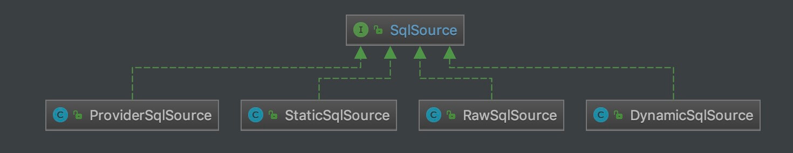
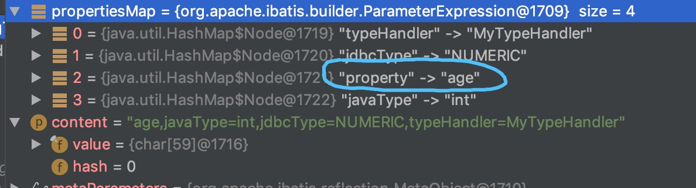
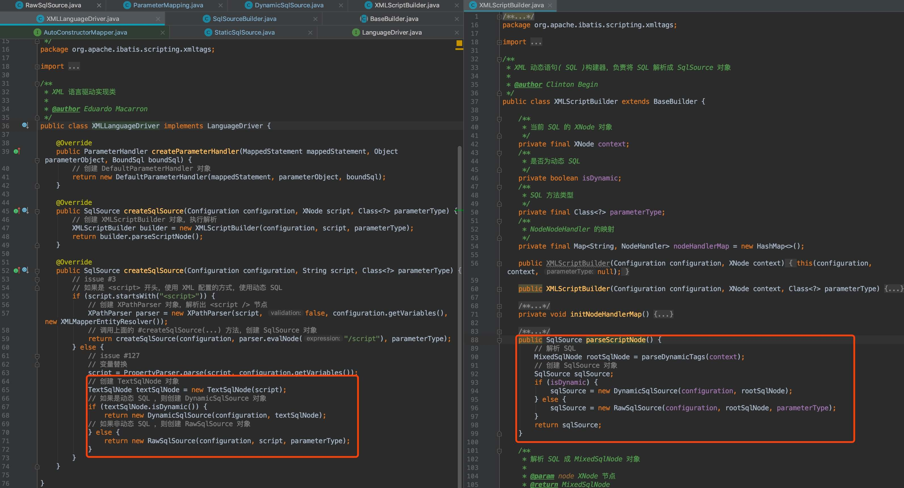

## 1. 概述

本文接 [《精尽 MyBatis 源码分析 —— SQL 初始化（上）之 SqlNode》](http://svip.iocoder.cn/MyBatis/scripting-1) 一文，来分享 SQL 初始化的下半部分，SqlSource 相关的内容。

## 2. SqlSource

`org.apache.ibatis.mapping.SqlSource` ，SQL 来源接口。它代表从 Mapper XML 或方法注解上，读取的一条 SQL 内容。代码如下：

```java
// SqlSource.java

/**
 * Represents the content of a mapped statement read from an XML file or an annotation. 
 * It creates the SQL that will be passed to the database out of the input parameter received from the user.
 */
public interface SqlSource {

    /**
     * 根据传入的参数对象，返回 BoundSql 对象
     *
     * @param parameterObject 参数对象
     * @return BoundSql 对象
     */
    BoundSql getBoundSql(Object parameterObject);

}
```

SqlSource 有多个实现类，如下图所示：



## 3. SqlSourceBuilder

`org.apache.ibatis.builder.SqlSourceBuilder` ，继承 BaseBuilder 抽象类，SqlSource 构建器，负责将 SQL 语句中的 `#{}` 替换成相应的 `?` 占位符，并获取该 `?` 占位符对应的 `org.apache.ibatis.mapping.ParameterMapping` 对象。

## 3.1 构造方法

```java
// SqlSourceBuilder.java

private static final String parameterProperties = "javaType,jdbcType,mode,numericScale,resultMap,typeHandler,jdbcTypeName";

public SqlSourceBuilder(Configuration configuration) {
    super(configuration);
}
```

为什么 `parameterProperties` 属性是这个值，答案在 [《MyBatis 文档 —— Mapper XML 文件 —— 参数（Parameters）》](http://www.mybatis.org/mybatis-3/zh/sqlmap-xml.html#Parameters)

### 3.2 parse

```java
// SqlSourceBuilder.java

/**
 * 执行解析原始 SQL ，成为 SqlSource 对象
 *
 * @param originalSql 原始 SQL
 * @param parameterType 参数类型
 * @param additionalParameters 附加参数集合。可能是空集合，也可能是 {@link org.apache.ibatis.scripting.xmltags.DynamicContext#bindings} 集合
 * @return SqlSource 对象
 */
public SqlSource parse(String originalSql, Class<?> parameterType, Map<String, Object> additionalParameters) {
    // <1> 创建 ParameterMappingTokenHandler 对象
    ParameterMappingTokenHandler handler = new ParameterMappingTokenHandler(configuration, parameterType, additionalParameters);
    // <2> 创建 GenericTokenParser 对象
    GenericTokenParser parser = new GenericTokenParser("#{", "}", handler);
    // <3> 执行解析
    String sql = parser.parse(originalSql);
    // <4> 创建 StaticSqlSource 对象
    return new StaticSqlSource(configuration, sql, handler.getParameterMappings());
}
```

`<2>` 处，创建 GenericTokenParser 对象。注意，传入的参数是 `#{` 和 `}` 对。

`<1>` 处，创建 ParameterMappingTokenHandler 对象。

`<3>` 处，调用 `GenericTokenParser#parse(String originalSql)` 方法，执行解析。如果匹配到 `#{` + `}` 对后，会调用 ParameterMappingTokenHandler 对应的 `#handleToken(String content)` 方法。详细解析，见 [「3.3 ParameterMappingTokenHandler」](http://svip.iocoder.cn/MyBatis/scripting-2/#) 。

`<4>` 处，创建 StaticSqlSource 对象。关于 StaticSqlSource 类，详细解析，见 [「4.1 StaticSqlSource」](http://svip.iocoder.cn/MyBatis/scripting-2/#) 。

### 3.3 ParameterMappingTokenHandler

ParameterMappingTokenHandler ，实现 TokenHandler 接口，继承 BaseBuilder 抽象类，负责将匹配到的 `#{` 和 `}` 对，替换成相应的 `?` 占位符，并获取该 `?` 占位符对应的 `org.apache.ibatis.mapping.ParameterMapping` 对象。

#### 3.3.1 构造方法

> ParameterMappingTokenHandler 是 SqlSourceBuilder 的内部私有静态类。

```java
// SqlSourceBuilder.java

/**
 * ParameterMapping 数组
 */
private List<ParameterMapping> parameterMappings = new ArrayList<>();
/**
 * 参数类型
 */
private Class<?> parameterType;
/**
 * additionalParameters 参数的对应的 MetaObject 对象
 */
private MetaObject metaParameters;

public ParameterMappingTokenHandler(Configuration configuration, Class<?> parameterType, Map<String, Object> additionalParameters) {
    super(configuration);
    this.parameterType = parameterType;
    // 创建 additionalParameters 参数的对应的 MetaObject 对象
    this.metaParameters = configuration.newMetaObject(additionalParameters);
}
```

#### 3.3.2 handleToken

```java
// SqlSourceBuilder.java

@Override
public String handleToken(String content) {
    // <1> 构建 ParameterMapping 对象，并添加到 parameterMappings 中
    parameterMappings.add(buildParameterMapping(content));
    // <2> 返回 ? 占位符
    return "?";
}
```

`<1>` 处，调用 `#buildParameterMapping(String content)` 方法，构建 ParameterMapping 对象，并添加到 `parameterMappings` 中。详细解析，见 [「3.3.3 buildParameterMapping」](http://svip.iocoder.cn/MyBatis/scripting-2/#) 。

`<2>` 处，返回 `?` 占位符。

如上两个步骤，就是 ParameterMappingTokenHandler 的核心。

#### 3.3.3 buildParameterMapping

`#buildParameterMapping(String content)` 方法，构建 ParameterMapping 对象。代码如下：

```java
// SqlSourceBuilder.java

private ParameterMapping buildParameterMapping(String content) {
    // <1> 解析成 Map 集合
    Map<String, String> propertiesMap = parseParameterMapping(content);
    // <2> 获得属性的名字和类型
    String property = propertiesMap.get("property"); // 名字
    Class<?> propertyType; // 类型
    if (metaParameters.hasGetter(property)) { // issue #448 get type from additional params
        propertyType = metaParameters.getGetterType(property);
    } else if (typeHandlerRegistry.hasTypeHandler(parameterType)) {
        propertyType = parameterType;
    } else if (JdbcType.CURSOR.name().equals(propertiesMap.get("jdbcType"))) {
        propertyType = java.sql.ResultSet.class;
    } else if (property == null || Map.class.isAssignableFrom(parameterType)) {
        propertyType = Object.class;
    } else {
        MetaClass metaClass = MetaClass.forClass(parameterType, configuration.getReflectorFactory());
        if (metaClass.hasGetter(property)) {
            propertyType = metaClass.getGetterType(property);
        } else {
            propertyType = Object.class;
        }
    }
    // <3> 创建 ParameterMapping.Builder 对象
    ParameterMapping.Builder builder = new ParameterMapping.Builder(configuration, property, propertyType);
    // <3.1> 初始化 ParameterMapping.Builder 对象的属性
    Class<?> javaType = propertyType;
    String typeHandlerAlias = null;
    for (Map.Entry<String, String> entry : propertiesMap.entrySet()) {
        String name = entry.getKey();
        String value = entry.getValue();
        if ("javaType".equals(name)) {
            javaType = resolveClass(value);
            builder.javaType(javaType);
        } else if ("jdbcType".equals(name)) {
            builder.jdbcType(resolveJdbcType(value));
        } else if ("mode".equals(name)) {
            builder.mode(resolveParameterMode(value));
        } else if ("numericScale".equals(name)) {
            builder.numericScale(Integer.valueOf(value));
        } else if ("resultMap".equals(name)) {
            builder.resultMapId(value);
        } else if ("typeHandler".equals(name)) {
            typeHandlerAlias = value;
        } else if ("jdbcTypeName".equals(name)) {
            builder.jdbcTypeName(value);
        } else if ("property".equals(name)) {
            // Do Nothing
        } else if ("expression".equals(name)) {
            throw new BuilderException("Expression based parameters are not supported yet");
        } else {
            throw new BuilderException("An invalid property '" + name + "' was found in mapping #{" + content + "}.  Valid properties are " + parameterProperties);
        }
    }
    // <3.2> 如果 typeHandlerAlias 非空，则获得对应的 TypeHandler 对象，并设置到 ParameterMapping.Builder 对象中
    if (typeHandlerAlias != null) {
        builder.typeHandler(resolveTypeHandler(javaType, typeHandlerAlias));
    }
    // <3.3> 创建 ParameterMapping 对象
    return builder.build();
}
```

`<1>` 处，调用 `#parseParameterMapping(String content)` 方法，解析成 Map 集合。代码如下：

```java
// SqlSourceBuilder.java

private Map<String, String> parseParameterMapping(String content) {
    try {
        return new ParameterExpression(content);
    } catch (BuilderException ex) {
        throw ex;
    } catch (Exception ex) {
        throw new BuilderException("Parsing error was found in mapping #{" + content + "}.  Check syntax #{property|(expression), var1=value1, var2=value2, ...} ", ex);
    }
}
```

[`org.apache.ibatis.builder.ParameterExpression`](https://github.com/YunaiV/mybatis-3/blob/master/src/main/java/org/apache/ibatis/builder/ParameterExpression.java) 类，继承 HashMap 类，负责参数表达式。

假设 `content = "#{age,javaType=int,jdbcType=NUMERIC,typeHandler=MyTypeHandler}"` 的结果如下图：



`<2>` 处，获得**属性**的名字和类型。

`<3>` 处，创建 ParameterMapping.Builder 对象。

`<3.1>` 处，初始化 ParameterMapping.Builder 对象的属性。

`<3.2>` 处，如果 `typeHandlerAlias` 非空，则获得对应的 TypeHandler 对象，并设置到 ParameterMapping.Builder 对象中。

`<3.3>` 处，创建 ParameterMapping 对象。

关于 ParameterMapping 类，胖友可以跳到 [「5.1 ParameterMapping」](http://svip.iocoder.cn/MyBatis/scripting-2/#) 中看看。

## 4. SqlSource 的实现类

### 4.1 StaticSqlSource

`org.apache.ibatis.builder.StaticSqlSource` ，实现 SqlSource 接口，静态的 SqlSource 实现类。代码如下：

```java
// StaticSqlSource.java

public class StaticSqlSource implements SqlSource {

    /**
     * 静态的 SQL
     */
    private final String sql;
    /**
     * ParameterMapping 集合
     */
    private final List<ParameterMapping> parameterMappings;
    private final Configuration configuration;

    public StaticSqlSource(Configuration configuration, String sql) {
        this(configuration, sql, null);
    }

    public StaticSqlSource(Configuration configuration, String sql, List<ParameterMapping> parameterMappings) {
        this.sql = sql;
        this.parameterMappings = parameterMappings;
        this.configuration = configuration;
    }

    @Override
    public BoundSql getBoundSql(Object parameterObject) {
        // 创建 BoundSql 对象
        return new BoundSql(configuration, sql, parameterMappings, parameterObject);
    }

}
```

StaticSqlSource 的静态，是相对于 DynamicSqlSource 和 RawSqlSource 来说呢。实际上，`StaticSqlSource.sql` 属性，上面还是可能包括 `?` 占位符。

`#getBoundSql((Object parameterObject)` 方法，创建 BoundSql 对象。通过 `parameterMappings` 和 `parameterObject` 属性，可以设置 `sql` 上的每个占位符的值。例如：


另外，我们在回过头看看 SqlSourceBuilder 类，它创建的也是 StaticSqlSource 对象。

下面，我们来看看下图的两段代码，胖友看看是否发现了什么规律：



如果**是**动态 SQL 的情况下，则创建 DynamicSqlSource 对象。

如果**非**动态 SQL 的情况下，则创建 RawSqlSource 对象。

下面，我们在「4.2」和「4.3」中，看看两者的区别。

### 4.2 DynamicSqlSource

`org.apache.ibatis.scripting.xmltags.DynamicSqlSource` ，实现 SqlSource 接口，动态的 SqlSource 实现类。代码如下：

```java
// DynamicSqlSource.java

public class DynamicSqlSource implements SqlSource {

    private final Configuration configuration;
    /**
     * 根 SqlNode 对象
     */
    private final SqlNode rootSqlNode;

    public DynamicSqlSource(Configuration configuration, SqlNode rootSqlNode) {
        this.configuration = configuration;
        this.rootSqlNode = rootSqlNode;
    }

    @Override
    public BoundSql getBoundSql(Object parameterObject) {
        // <1> 应用 rootSqlNode
        DynamicContext context = new DynamicContext(configuration, parameterObject);
        rootSqlNode.apply(context);
        // <2> 创建 SqlSourceBuilder 对象
        SqlSourceBuilder sqlSourceParser = new SqlSourceBuilder(configuration);
        // <2> 解析出 SqlSource 对象
        Class<?> parameterType = parameterObject == null ? Object.class : parameterObject.getClass();
        SqlSource sqlSource = sqlSourceParser.parse(context.getSql(), parameterType, context.getBindings());
        // <3> 获得 BoundSql 对象
        BoundSql boundSql = sqlSource.getBoundSql(parameterObject);
        // <4> 添加附加参数到 BoundSql 对象中
        for (Map.Entry<String, Object> entry : context.getBindings().entrySet()) {
            boundSql.setAdditionalParameter(entry.getKey(), entry.getValue());
        }
        // <5> 返回 BoundSql 对象
        return boundSql;
    }

}
```

适用于使用了 OGNL 表达式，或者使用了 `${}` 表达式的 SQL ，所以它是**动态**的，需要在每次执行 `#getBoundSql(Object parameterObject)` 方法，根据参数，生成对应的 SQL 。

`<1>` 处，创建 DynamicContext 对象，并执行 `DynamicContext#apply(DynamicContext context)` 方法，应用 `rootSqlNode` ，相当于生成**动态** SQL 。

`<2>` 处，创建 SqlSourceBuilder 对象，并执行 `SqlSourceBuilder#parse(String originalSql, Class<?> parameterType, Map<String, Object> additionalParameters)` 方法，解析出 SqlSource 对象。**注意**：

返回的 SqlSource 对象，类型是 **StaticSqlSource** 类。

这个过程，会将 `#{}` 对，转换成对应的 `?` 占位符，并获取该占位符对应的 ParameterMapping 对象。

`<3>` 处，调用 `StaticSqlSource#getBoundSql(Object parameterObject)` 方法，获得 BoundSql 对象。

`<4>` 处，从 `context.bindings` 中，添加附加参数到 BoundSql 对象中。为什么要这么做？胖友回看下 [《精尽 MyBatis 源码分析 —— SQL 初始化（上）之 SqlNode》](http://svip.iocoder.cn/MyBatis/scripting-1) 的 [「6.7 ChooseSqlNode」](http://svip.iocoder.cn/MyBatis/scripting-2/#) 就明白了。

`<5>` 处，返回 BoundSql 对象。

### 4.3 RawSqlSource

`org.apache.ibatis.scripting.xmltags.RawSqlSource` ，实现 SqlSource 接口，**原始**的 SqlSource 实现类。代码如下：

```java
// RawSqlSource.java

public class RawSqlSource implements SqlSource {

    /**
     * SqlSource 对象
     */
    private final SqlSource sqlSource;

    public RawSqlSource(Configuration configuration, SqlNode rootSqlNode, Class<?> parameterType) {
        // <1> 获得 Sql
        this(configuration, getSql(configuration, rootSqlNode), parameterType);
    }

    public RawSqlSource(Configuration configuration, String sql, Class<?> parameterType) {
        // <2> 创建 SqlSourceBuilder 对象
        SqlSourceBuilder sqlSourceParser = new SqlSourceBuilder(configuration);
        Class<?> clazz = parameterType == null ? Object.class : parameterType;
        // <2> 获得 SqlSource 对象
        sqlSource = sqlSourceParser.parse(sql, clazz, new HashMap<>());
    }

    private static String getSql(Configuration configuration, SqlNode rootSqlNode) {
        // 创建 DynamicContext 对象
        DynamicContext context = new DynamicContext(configuration, null);
        // 解析出 SqlSource 对象
        rootSqlNode.apply(context);
        // 获得 sql
        return context.getSql();
    }

    @Override
    public BoundSql getBoundSql(Object parameterObject) {
        // 获得 BoundSql 对象
        return sqlSource.getBoundSql(parameterObject);
    }

}
```

适用于仅使用 `#{}` 表达式，或者不使用任何表达式的情况，所以它是**静态**的，仅需要在构造方法中，直接生成对应的 SQL 。

在构造方法中：

`<1>` 处，调用 `#getSql(Configuration configuration, SqlNode rootSqlNode)` 方法，获得 SQL 。

`<2>` 处，创建 SqlSourceBuilder 对象，并执行 `SqlSourceBuilder#parse(String originalSql, Class<?> parameterType, Map<String, Object> additionalParameters)` 方法，解析出 SqlSource 对象。

对应到 DynamicSqlSource ，就是 `<1>` + `<2>` 了。

在 `#getBoundSql(Object parameterObject)` 方法中：

`<3>` 处，调用 `StaticSqlSource#getBoundSql(Object parameterObject)` 方法，获得 BoundSql 对象。

对应到 DynamicSqlSource ，就是 `<1>` + `<2>` 了。

这样，RawSqlSource 和 DynamicSqlSource 的区别，是不是就清晰了。

### 4.4 ProviderSqlSource

`org.apache.ibatis.builder.annotation.ProviderSqlSource` ，实现 SqlSource 接口，基于方法上的 `@ProviderXXX` 注解的 SqlSource 实现类。

#### 4.4.1 构造方法

```java
// ProviderSqlSource.java

private final Configuration configuration;
private final SqlSourceBuilder sqlSourceParser;
/**
 * `@ProviderXXX` 注解的对应的类
 */
private final Class<?> providerType;
/**
 * `@ProviderXXX` 注解的对应的方法
 */
private Method providerMethod;
/**
 * `@ProviderXXX` 注解的对应的方法的参数名数组
 */
private String[] providerMethodArgumentNames;
/**
 * `@ProviderXXX` 注解的对应的方法的参数类型数组
 */
private Class<?>[] providerMethodParameterTypes;
/**
 * 若 {@link #providerMethodParameterTypes} 参数有 ProviderContext 类型的，创建 ProviderContext 对象
 */
private ProviderContext providerContext;
/**
 * {@link #providerMethodParameterTypes} 参数中，ProviderContext 类型的参数，在数组中的位置
 */
private Integer providerContextIndex;

/**
 * @deprecated Please use the {@link #ProviderSqlSource(Configuration, Object, Class, Method)} instead of this.
 */
@Deprecated
public ProviderSqlSource(Configuration configuration, Object provider) {
    this(configuration, provider, null, null);
}

/**
 * @since 3.4.5
 */
public ProviderSqlSource(Configuration configuration, Object provider, Class<?> mapperType, Method mapperMethod) {
    String providerMethodName;
    try {
        this.configuration = configuration;
        // 创建 SqlSourceBuilder 对象
        this.sqlSourceParser = new SqlSourceBuilder(configuration);
        // 获得 @ProviderXXX 注解的对应的类
        this.providerType = (Class<?>) provider.getClass().getMethod("type").invoke(provider);
        // 获得 @ProviderXXX 注解的对应的方法相关的信息
        providerMethodName = (String) provider.getClass().getMethod("method").invoke(provider);
        for (Method m : this.providerType.getMethods()) {
            if (providerMethodName.equals(m.getName()) && CharSequence.class.isAssignableFrom(m.getReturnType())) {
                if (providerMethod != null) {
                    throw new BuilderException("Error creating SqlSource for SqlProvider. Method '"
                            + providerMethodName + "' is found multiple in SqlProvider '" + this.providerType.getName()
                            + "'. Sql provider method can not overload.");
                }
                this.providerMethod = m;
                this.providerMethodArgumentNames = new ParamNameResolver(configuration, m).getNames();
                this.providerMethodParameterTypes = m.getParameterTypes();
            }
        }
    } catch (BuilderException e) {
        throw e;
    } catch (Exception e) {
        throw new BuilderException("Error creating SqlSource for SqlProvider.  Cause: " + e, e);
    }
    if (this.providerMethod == null) {
        throw new BuilderException("Error creating SqlSource for SqlProvider. Method '"
                + providerMethodName + "' not found in SqlProvider '" + this.providerType.getName() + "'.");
    }
    // 初始化 providerContext 和 providerContextIndex 属性
    for (int i = 0; i < this.providerMethodParameterTypes.length; i++) {
        Class<?> parameterType = this.providerMethodParameterTypes[i];
        if (parameterType == ProviderContext.class) {
            if (this.providerContext != null) {
                throw new BuilderException("Error creating SqlSource for SqlProvider. ProviderContext found multiple in SqlProvider method ("
                        + this.providerType.getName() + "." + providerMethod.getName()
                        + "). ProviderContext can not define multiple in SqlProvider method argument.");
            }
            this.providerContext = new ProviderContext(mapperType, mapperMethod);
            this.providerContextIndex = i;
        }
    }
}
```

#### 4.4.2 getBoundSql

```java
// ProviderSqlSource.java

@Override
public BoundSql getBoundSql(Object parameterObject) {
    // <1> 创建 SqlSource 对象
    SqlSource sqlSource = createSqlSource(parameterObject);
    // <2> 获得 BoundSql 对象
    return sqlSource.getBoundSql(parameterObject);
}
```

`<1>` 处，调用 `#createSqlSource(Object parameterObject)` 方法，创建 SqlSource 对象。因为它是通过 `@ProviderXXX` 注解的指定类的指定方法，动态生成 SQL 。所以，从思路上，和 DynamicSqlSource 是有点接近的。详细解析，见 [「4.4.3 createSqlSource」](http://svip.iocoder.cn/MyBatis/scripting-2/#) 。

`<2>` 处，调用 `SqlSource#getBoundSql(Object parameterObject)` 方法，获得 BoundSql 对象。

#### 4.4.3 createSqlSource

`#createSqlSource(Object parameterObject)` 方法，创建 SqlSource 对象。代码如下：

```java
// ProviderSqlSource.java

private SqlSource createSqlSource(Object parameterObject) {
    try {
        // <1> 获得 SQL
        int bindParameterCount = providerMethodParameterTypes.length - (providerContext == null ? 0 : 1);
        String sql;
        if (providerMethodParameterTypes.length == 0) {
            sql = invokeProviderMethod();
        } else if (bindParameterCount == 0) {
            sql = invokeProviderMethod(providerContext);
        } else if (bindParameterCount == 1 &&
                (parameterObject == null || providerMethodParameterTypes[(providerContextIndex == null || providerContextIndex == 1) ? 0 : 1].isAssignableFrom(parameterObject.getClass()))) {
            sql = invokeProviderMethod(extractProviderMethodArguments(parameterObject)); // <1.1>
        } else if (parameterObject instanceof Map) {
            @SuppressWarnings("unchecked")
            Map<String, Object> params = (Map<String, Object>) parameterObject;
            sql = invokeProviderMethod(extractProviderMethodArguments(params, providerMethodArgumentNames)); <1.2>
        } else {
            throw new BuilderException("Error invoking SqlProvider method ("
                    + providerType.getName() + "." + providerMethod.getName()
                    + "). Cannot invoke a method that holds "
                    + (bindParameterCount == 1 ? "named argument(@Param)" : "multiple arguments")
                    + " using a specifying parameterObject. In this case, please specify a 'java.util.Map' object.");
        }
        // <2> 获得参数
        Class<?> parameterType = parameterObject == null ? Object.class : parameterObject.getClass();
        // <3> 替换掉 SQL 上的属性
        // <4> 解析出 SqlSource 对象
        return sqlSourceParser.parse(replacePlaceholder(sql), parameterType, new HashMap<>());
    } catch (BuilderException e) {
        throw e;
    } catch (Exception e) {
        throw new BuilderException("Error invoking SqlProvider method ("
                + providerType.getName() + "." + providerMethod.getName()
                + ").  Cause: " + e, e);
    }
}
```

`<1>` 处，获得 SQL 。

`<1.1>` 处，调用 `#extractProviderMethodArguments(Object parameterObject)` 方法，获得方法参数。代码如下：

```java
// ProviderSqlSource.java

private Object[] extractProviderMethodArguments(Object parameterObject) {
    if (providerContext != null) {
        Object[] args = new Object[2];
        args[providerContextIndex == 0 ? 1 : 0] = parameterObject;
        args[providerContextIndex] = providerContext;
        return args;
    } else {
        return new Object[]{parameterObject};
    }
}
```

`<1.2>` 处，调用 `#extractProviderMethodArguments(Map<String, Object> params, String[] argumentNames)` 方法，获得方法参数。代码如下：

```java
// ProviderSqlSource.java

private Object[] extractProviderMethodArguments(Map<String, Object> params, String[] argumentNames) {
    Object[] args = new Object[argumentNames.length];
    for (int i = 0; i < args.length; i++) {
        if (providerContextIndex != null && providerContextIndex == i) {
            args[i] = providerContext;
        } else {
            args[i] = params.get(argumentNames[i]);
        }
    }
    return args;
}
```

上面两个方法，无法理解的胖友，可以看看 `org.apache.ibatis.submitted.sqlprovider.Mapper` 和 `org.apache.ibatis.submitted.sqlprovider.OurSqlBuilder` 类。

调用 `#invokeProviderMethod(Object... args)` 方法，执行方法，生成 SQL 。代码如下：

```java
// ProviderSqlSource.java

private String invokeProviderMethod(Object... args) throws Exception {
    Object targetObject = null;
    // 获得对象
    if (!Modifier.isStatic(providerMethod.getModifiers())) {
        targetObject = providerType.newInstance();
    }
    // 反射调用方法
    CharSequence sql = (CharSequence) providerMethod.invoke(targetObject, args);
    return sql != null ? sql.toString() : null;
}
```

反射调用方法。

`<2>` 处，获得参数类型。

`<3>` 处，调用 `#replacePlaceholder(String sql)` 方法，替换掉 SQL 上的属性。代码如下：

```java
// ProviderSqlSource.java

private String replacePlaceholder(String sql) {
    return PropertyParser.parse(sql, configuration.getVariables());
}
```

`<4>` 处，调用 `SqlSourceBuilder#parse(String originalSql, Class<?> parameterType, Map<String, Object> additionalParameters)` 方法，解析出 SqlSource 对象。

#### 4.4.4 ProviderContext

`org.apache.ibatis.builder.annotation.ProviderContext` ，ProviderSqlSource 的上下文。代码如下：

```java
// ProviderContext.java

public final class ProviderContext {

    /**
     * Mapper 接口
     */
    private final Class<?> mapperType;
    /**
     * Mapper 的方法
     */
    private final Method mapperMethod;

    /**
     * Constructor.
     *
     * @param mapperType A mapper interface type that specified provider
     * @param mapperMethod A mapper method that specified provider
     */
    ProviderContext(Class<?> mapperType, Method mapperMethod) {
        this.mapperType = mapperType;
        this.mapperMethod = mapperMethod;
    }

    public Class<?> getMapperType() {
        return mapperType;
    }
    
    public Method getMapperMethod() {
        return mapperMethod;
    }

}
```

## 5. BoundSql

`org.apache.ibatis.mapping.BoundSql` ，一次可执行的 SQL 封装。代码如下：

```java
// BoundSql.java

public class BoundSql {

    /**
     * SQL 语句
     */
    private final String sql;
    /**
     * ParameterMapping 数组
     */
    private final List<ParameterMapping> parameterMappings;
    /**
     * 参数对象
     */
    private final Object parameterObject;
    /**
     * 附加的参数集合
     */
    private final Map<String, Object> additionalParameters;
    /**
     * {@link #additionalParameters} 的 MetaObject 对象
     */
    private final MetaObject metaParameters;

    public BoundSql(Configuration configuration, String sql, List<ParameterMapping> parameterMappings, Object parameterObject) {
        this.sql = sql;
        this.parameterMappings = parameterMappings;
        this.parameterObject = parameterObject;
        this.additionalParameters = new HashMap<>();
        this.metaParameters = configuration.newMetaObject(additionalParameters);
    }

    public String getSql() {
        return sql;
    }

    public List<ParameterMapping> getParameterMappings() {
        return parameterMappings;
    }

    public Object getParameterObject() {
        return parameterObject;
    }

    public boolean hasAdditionalParameter(String name) {
        String paramName = new PropertyTokenizer(name).getName();
        return additionalParameters.containsKey(paramName);
    }

    public void setAdditionalParameter(String name, Object value) {
        metaParameters.setValue(name, value);
    }

    public Object getAdditionalParameter(String name) {
        return metaParameters.getValue(name);
    }

}
```

### 5.1 ParameterMapping

`org.apache.ibatis.mapping.ParameterMapping` ，参数映射。代码如下：

```java
// ParameterMapping.java

private Configuration configuration;

/**
 * 属性的名字
 */
private String property;
/**
 * 参数类型。
 *
 * 目前只需要关注 ParameterMode.IN 的情况，另外的 OUT、INOUT 是在存储过程中使用，暂时无视
 */
private ParameterMode mode;
/**
 * Java 类型
 */
private Class<?> javaType = Object.class;
/**
 * JDBC 类型
 */
private JdbcType jdbcType;
/**
 * 对于数值类型，还有一个小数保留位数的设置，来确定小数点后保留的位数
 */
private Integer numericScale;
/**
 * TypeHandler 对象
 *
 * {@link Builder#resolveTypeHandler()}
 */
private TypeHandler<?> typeHandler;
/**
 * 貌似只在 ParameterMode 在 OUT、INOUT 是在存储过程中使用
 */
private String resultMapId;
/**
 * 貌似只在 ParameterMode 在 OUT、INOUT 是在存储过程中使用
 */
private String jdbcTypeName;
/**
 * 表达式。
 *
 * ps：目前暂时不支持
 */
private String expression;

public static class Builder {
    
    // ... 省略代码
    
}
```

参数比较简单，胖友自己看看注释。可以忽略 ParameterMode 属性为 `OUT` 和 `INOUT` 是在存储过程中使用的情况。

完整的该类，可点击 [ParameterMapping](https://github.com/YunaiV/mybatis-3/blob/master/src/main/java/org/apache/ibatis/mapping/ParameterMapping.java) 查看。

关于 ParameterMode 属性为 `OUT` 和 `INOUT` 是在存储过程中使用的情况，可以看看 [《Mybatis调用MySQL存储过程》](https://blog.csdn.net/u010046908/article/details/69944959) 。当然，也可以不看，因为很少使用存储过程了。

### 5.2 ParameterMode

`org.apache.ibatis.mapping.ParameterMode` ，参数类型。代码如下：

```java
// ParameterMode.java

public enum ParameterMode {

    /**
     * 输入
     */
    IN,
    /**
     * 输出
     */
    OUT,
    /**
     * IN + OUT
     */
    INOUT

}
```

只需要关注 `IN` 的情况。

另外，MyBatis 存储过程相关的源码，本系列会直接忽略。嘿嘿。

## 7. ParameterHandler

`org.apache.ibatis.executor.parameter.ParameterHandler` ，参数处理器接口。代码如下：

```java
// ParameterHandler.java

/**
 * A parameter handler sets the parameters of the {@code PreparedStatement}
 */
public interface ParameterHandler {

    /**
     * @return 参数对象
     */
    Object getParameterObject();

    /**
     * 设置 PreparedStatement 的占位符参数
     *
     * @param ps PreparedStatement 对象
     * @throws SQLException 发生 SQL 异常时
     */
    void setParameters(PreparedStatement ps) throws SQLException;

}
```

### 7.1 DefaultParameterHandler

`org.apache.ibatis.scripting.default.DefaultParameterHandler` ，实现 ParameterHandler 接口，默认 ParameterHandler 实现类。

#### 7.1.1 构造方法

```java
// DefaultParameterHandler.java

private final TypeHandlerRegistry typeHandlerRegistry;
/**
 * MappedStatement 对象
 */
private final MappedStatement mappedStatement;
/**
 * 参数对象
 */
private final Object parameterObject;
/**
 * BoundSql 对象
 */
private final BoundSql boundSql;
private final Configuration configuration;

public DefaultParameterHandler(MappedStatement mappedStatement, Object parameterObject, BoundSql boundSql) {
    this.mappedStatement = mappedStatement;
    this.configuration = mappedStatement.getConfiguration();
    this.typeHandlerRegistry = mappedStatement.getConfiguration().getTypeHandlerRegistry();
    this.parameterObject = parameterObject;
    this.boundSql = boundSql;
}
```

#### 7.1.2 setParameters

`#setParameters(PreparedStatement ps)` 方法，代码如下：

```java
// DefaultParameterHandler.java

@Override
public void setParameters(PreparedStatement ps) {
    ErrorContext.instance().activity("setting parameters").object(mappedStatement.getParameterMap().getId());
    // <1> 遍历 ParameterMapping 数组
    List<ParameterMapping> parameterMappings = boundSql.getParameterMappings();
    if (parameterMappings != null) {
        for (int i = 0; i < parameterMappings.size(); i++) {
            // <2> 获得 ParameterMapping 对象
            ParameterMapping parameterMapping = parameterMappings.get(i);
            if (parameterMapping.getMode() != ParameterMode.OUT) {
                // <3> 获得值
                Object value;
                String propertyName = parameterMapping.getProperty();
                if (boundSql.hasAdditionalParameter(propertyName)) { // issue #448 ask first for additional params
                    value = boundSql.getAdditionalParameter(propertyName);
                } else if (parameterObject == null) {
                    value = null;
                } else if (typeHandlerRegistry.hasTypeHandler(parameterObject.getClass())) {
                    value = parameterObject;
                } else {
                    MetaObject metaObject = configuration.newMetaObject(parameterObject);
                    value = metaObject.getValue(propertyName);
                }
                // <4> 获得 typeHandler、jdbcType 属性
                TypeHandler typeHandler = parameterMapping.getTypeHandler();
                JdbcType jdbcType = parameterMapping.getJdbcType();
                if (value == null && jdbcType == null) {
                    jdbcType = configuration.getJdbcTypeForNull();
                }
                // <5> 设置 ? 占位符的参数
                try {
                    typeHandler.setParameter(ps, i + 1, value, jdbcType);
                } catch (TypeException | SQLException e) {
                    throw new TypeException("Could not set parameters for mapping: " + parameterMapping + ". Cause: " + e, e);
                }
            }
        }
    }
}
```

`<1>` 处，遍历 ParameterMapping 数组。

`<2>` 处，获得 ParameterMapping 对象。

`<3>` 处，获得值。有多种情况，胖友可以细看下。

`<4>` 处，获得 `typeHandler`、`jdbcType` 属性。

重要】`<5>` 处，调用 `TypeHandler#setParameter(PreparedStatement ps, int i, T parameter, JdbcType jdbcType)` 方法，设置指定位置的 `?` 占位符的参数。
