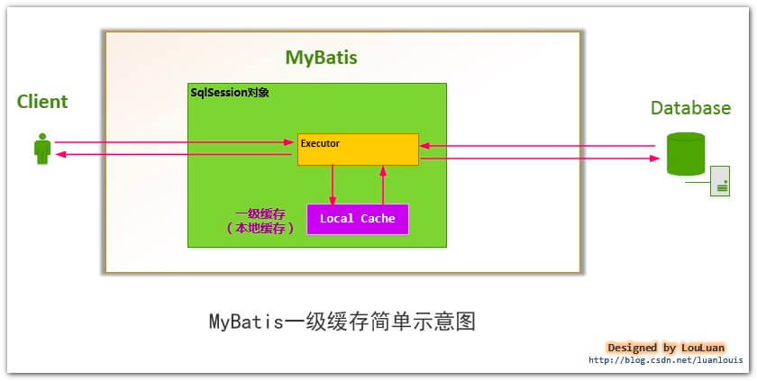
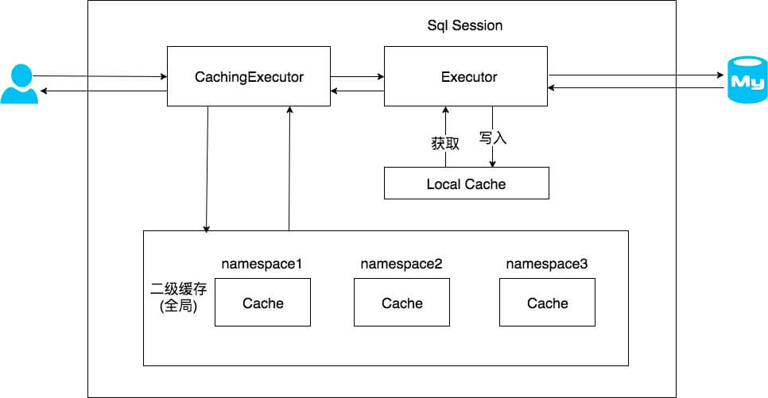

## 1. 概述

从本文开始，我们来分享 SQL **执行**的流程。在 [《精尽 MyBatis 源码分析 —— 项目结构一览》](http://svip.iocoder.cn/MyBatis/intro) 中，我们简单介绍这个流程如下：

> 对应 `executor` 和 `cursor` 模块。前者对应**执行器**，后者对应执行**结果的游标**。
>
> SQL 语句的执行涉及多个组件 ，其中比较重要的是 Executor、StatementHandler、ParameterHandler 和 ResultSetHandler 。
>
> **Executor** 主要负责维护一级缓存和二级缓存，并提供事务管理的相关操作，它会将数据库相关操作委托给 StatementHandler完成。
>
> **StatementHandler** 首先通过 **ParameterHandler** 完成 SQL 语句的实参绑定，然后通过 `java.sql.Statement` 对象执行 SQL 语句并得到结果集，最后通过 **ResultSetHandler** 完成结果集的映射，得到结果对象并返回。
>
> 整体过程如下图：
>
> 

下面，我们在看看 `executor` 包下的列情况，如下图所示：


正如该包下的分包情况，每个包对应一个功能。

`statement` 包，实现向数据库发起 SQL 命令。

`parameter` 包，实现设置 PreparedStatement 的占位符参数。

目前只有一个 ParameterHandler 接口，在 [《精尽 MyBatis 源码分析 —— SQL 初始化（下）之 SqlSource》](http://svip.iocoder.cn/MyBatis/scripting-2) 已经详细解析。

`keygen` 包，实现数据库主键生成( 获得 )的功能。

`resultset` 包，实现 ResultSet 结果集的处理，将其映射成对应的结果对象。

`result` 包，结果的处理，被 `resultset` 包所调用。可能胖友会好奇为啥会有 `resultset` 和 `result` 两个“重叠”的包。答案见 [《精尽 MyBatis 源码分析 —— SQL 执行（四）之 ResultSetHandler》](http://svip.iocoder.cn/MyBatis/executor-4) 。

`loader` 包，实现延迟加载的功能。

根目录，Executor 接口及其实现类，作为 SQL 执行的核心入口。

考虑到整个 `executor` 包的代码量近 5000 行，所以我们将每一个子包，作为一篇文章，逐包解析。所以，本文我们先来分享 根目录，也就是 Executor 接口及其实现类。

## 2. Executor

`org.apache.ibatis.executor.Executor` ，执行器接口。代码如下：

```java
// Executor.java

public interface Executor {

    // 空 ResultHandler 对象的枚举
    ResultHandler NO_RESULT_HANDLER = null;

    // 更新 or 插入 or 删除，由传入的 MappedStatement 的 SQL 所决定
    int update(MappedStatement ms, Object parameter) throws SQLException;

    // 查询，带 ResultHandler + CacheKey + BoundSql
    <E> List<E> query(MappedStatement ms, Object parameter, RowBounds rowBounds, ResultHandler resultHandler, CacheKey cacheKey, BoundSql boundSql) throws SQLException;
    // 查询，带 ResultHandler
    <E> List<E> query(MappedStatement ms, Object parameter, RowBounds rowBounds, ResultHandler resultHandler) throws SQLException;
    // 查询，返回值为 Cursor
    <E> Cursor<E> queryCursor(MappedStatement ms, Object parameter, RowBounds rowBounds) throws SQLException;

    // 刷入批处理语句
    List<BatchResult> flushStatements() throws SQLException;

    // 提交事务
    void commit(boolean required) throws SQLException;
    // 回滚事务
    void rollback(boolean required) throws SQLException;

    // 创建 CacheKey 对象
    CacheKey createCacheKey(MappedStatement ms, Object parameterObject, RowBounds rowBounds, BoundSql boundSql);
    // 判断是否缓存
    boolean isCached(MappedStatement ms, CacheKey key);
    // 清除本地缓存
    void clearLocalCache();

    // 延迟加载
    void deferLoad(MappedStatement ms, MetaObject resultObject, String property, CacheKey key, Class<?> targetType);

    // 获得事务
    Transaction getTransaction();
    // 关闭事务
    void close(boolean forceRollback);
    // 判断事务是否关闭
    boolean isClosed();

    // 设置包装的 Executor 对象
    void setExecutorWrapper(Executor executor);

}
```

* 读和写操作相关的方法
* 事务相关的方法
* 缓存相关的方法
* 设置延迟加载的方法
* 设置包装的 Executor 对象的方法

Executor 的实现类如下图所示：


我们可以看到，Executor 的直接子类有 BaseExecutor 和 CachingExecutor 两个。

实际上，CachingExecutor 在 BaseExecutor 的基础上，实现**二级缓存**功能。

在下文中，BaseExecutor 的**本地**缓存，就是**一级**缓存。

下面，我们按照先看 BaseExecutor 侧的实现类的源码解析，再看 CachingExecutor 的。

## 3. BaseExecutor

`org.apache.ibatis.executor.BaseExecutor` ，实现 Executor 接口，提供骨架方法，从而使子类只要实现指定的几个抽象方法即可。

### 3.1 构造方法

```java
// BaseExecutor.java

/**
 * 事务对象
 */
protected Transaction transaction;
/**
 * 包装的 Executor 对象
 */
protected Executor wrapper;

/**
 * DeferredLoad( 延迟加载 ) 队列
 */
protected ConcurrentLinkedQueue<DeferredLoad> deferredLoads;
/**
 * 本地缓存，即一级缓存
 */
protected PerpetualCache localCache;
/**
 * 本地输出类型的参数的缓存
 */
protected PerpetualCache localOutputParameterCache;
protected Configuration configuration;

/**
 * 记录嵌套查询的层级
 */
protected int queryStack;
/**
 * 是否关闭
 */
private boolean closed;

protected BaseExecutor(Configuration configuration, Transaction transaction) {
    this.transaction = transaction;
    this.deferredLoads = new ConcurrentLinkedQueue<>();
    this.localCache = new PerpetualCache("LocalCache");
    this.localOutputParameterCache = new PerpetualCache("LocalOutputParameterCache");
    this.closed = false;
    this.configuration = configuration;
    this.wrapper = this; // 自己
}
```

和延迟加载相关，后续文章，详细解析。详细解析，见 [《精尽 MyBatis 源码分析 —— SQL 执行（五）之延迟加载》](http://svip.iocoder.cn/MyBatis/executor-5) 。

`queryStack` 属性，记录**递归**嵌套查询的层级。

`deferredLoads` 属性，DeferredLoad( 延迟加载 ) 队列。

`wrapper` 属性，在构造方法中，初始化为 `this` ，即自己。

`localCache` 属性，本地缓存，即**一级缓存**。那什么是一级缓存呢？

> 基于 [《MyBatis 的一级缓存实现详解及使用注意事项》](https://blog.csdn.net/luanlouis/article/details/41280959) 进行修改
>
> 每当我们使用 MyBatis 开启一次和数据库的会话，MyBatis 会创建出一个 SqlSession 对象表示一次数据库会话，**而每个 SqlSession 都会创建一个 Executor 对象**。
>
> 在对数据库的一次会话中，我们有可能会反复地执行完全相同的查询语句，如果不采取一些措施的话，每一次查询都会查询一次数据库，而我们在极短的时间内做了完全相同的查询，那么它们的结果极有可能完全相同，由于查询一次数据库的代价很大，这有可能造成很大的资源浪费。
>
> 为了解决这一问题，减少资源的浪费，MyBatis 会在表示会话的SqlSession 对象中建立一个简单的缓存，将每次查询到的结果结果缓存起来，当下次查询的时候，如果判断先前有个完全一样的查询，会直接从缓存中直接将结果取出，返回给用户，不需要再进行一次数据库查询了。 **注意，这个“简单的缓存”就是一级缓存，且默认开启，无法关闭**。
>
> 如下图所示，MyBatis 会在一次会话的表示 —— 一个 SqlSession 对象中创建一个本地缓存( `localCache` )，对于每一次查询，都会尝试根据查询的条件去本地缓存中查找是否在缓存中，如果在缓存中，就直接从缓存中取出，然后返回给用户；否则，从数据库读取数据，将查询结果存入缓存并返回给用户。
>
> 
>
> 关于这段话，胖友要理解 SqlSession 和 Executor 和一级缓存的关系。
>
> 另外，下文，我们还会介绍**二级缓存**是什么。

`transaction` 属性，事务对象。该属性，是通过构造方法传入。为什么呢？待我们看 `org.apache.ibatis.session.session` 包。

### 3.2 clearLocalCache

`#clearLocalCache()` 方法，清理一级（本地）缓存。代码如下：

```java
// BaseExecutor.java

@Override
public void clearLocalCache() {
    if (!closed) {
        // 清理 localCache
        localCache.clear();
        // 清理 localOutputParameterCache
        localOutputParameterCache.clear();
    }
}
```

### 3.3 createCacheKey

`#createCacheKey(MappedStatement ms, Object parameterObject, RowBounds rowBounds, BoundSql boundSql)` 方法，创建 CacheKey 对象。代码如下：

```java
// BaseExecutor.java

@Override
public CacheKey createCacheKey(MappedStatement ms, Object parameterObject, RowBounds rowBounds, BoundSql boundSql) {
    if (closed) {
        throw new ExecutorException("Executor was closed.");
    }
    // <1> 创建 CacheKey 对象
    CacheKey cacheKey = new CacheKey();
    // <2> 设置 id、offset、limit、sql 到 CacheKey 对象中
    cacheKey.update(ms.getId());
    cacheKey.update(rowBounds.getOffset());
    cacheKey.update(rowBounds.getLimit());
    cacheKey.update(boundSql.getSql());
    // <3> 设置 ParameterMapping 数组的元素对应的每个 value 到 CacheKey 对象中
    List<ParameterMapping> parameterMappings = boundSql.getParameterMappings();
    TypeHandlerRegistry typeHandlerRegistry = ms.getConfiguration().getTypeHandlerRegistry();
    // mimic DefaultParameterHandler logic 这块逻辑，和 DefaultParameterHandler 获取 value 是一致的。
    for (ParameterMapping parameterMapping : parameterMappings) {
        if (parameterMapping.getMode() != ParameterMode.OUT) {
            Object value;
            String propertyName = parameterMapping.getProperty();
            if (boundSql.hasAdditionalParameter(propertyName)) {
                value = boundSql.getAdditionalParameter(propertyName);
            } else if (parameterObject == null) {
                value = null;
            } else if (typeHandlerRegistry.hasTypeHandler(parameterObject.getClass())) {
                value = parameterObject;
            } else {
                MetaObject metaObject = configuration.newMetaObject(parameterObject);
                value = metaObject.getValue(propertyName);
            }
            cacheKey.update(value);
        }
    }
    // <4> 设置 Environment.id 到 CacheKey 对象中
    if (configuration.getEnvironment() != null) {
        // issue #176
        cacheKey.update(configuration.getEnvironment().getId());
    }
    return cacheKey;
}
```

`<1>` 处，创建 CacheKey 对象。关于 CacheKey 类，在 [《精尽 MyBatis 源码分析 —— 缓存模块》](http://svip.iocoder.cn/MyBatis/cache-package) 已经详细解析。

`<2>` 处，设置 `id`、`offset`、`limit`、`sql` 到 CacheKey 对象中。

`<3>` 处，设置 ParameterMapping 数组的元素对应的每个 `value` 到 CacheKey 对象中。注意，这块逻辑，和 DefaultParameterHandler 获取 `value` 是一致的。

`<4>` 处，设置 `Environment.id` 到 CacheKey 对象中。

### 3.4 isCached

`#isCached(MappedStatement ms, CacheKey key)` 方法，判断一级缓存是否存在。代码如下：

```java
// BaseExecutor.java

@Override
public boolean isCached(MappedStatement ms, CacheKey key) {
    return localCache.getObject(key) != null;
}
```

### 3.5 query

① `#query(MappedStatement ms, Object parameter, RowBounds rowBounds, ResultHandler resultHandler)` 方法，读操作。代码如下：

```java
// BaseExecutor.java

@Override
public <E> List<E> query(MappedStatement ms, Object parameter, RowBounds rowBounds, ResultHandler resultHandler) throws SQLException {
    // <1> 获得 BoundSql 对象
    BoundSql boundSql = ms.getBoundSql(parameter);
    // <2> 创建 CacheKey 对象
    CacheKey key = createCacheKey(ms, parameter, rowBounds, boundSql);
    // <3> 查询
    return query(ms, parameter, rowBounds, resultHandler, key, boundSql);
}
```

`<1>` 处，调用 `MappedStatement#getBoundSql(Object parameterObject)` 方法，获得 BoundSql 对象。

`<2>` 处，调用 `#createCacheKey(MappedStatement ms, Object parameterObject, RowBounds rowBounds, BoundSql boundSql)` 方法，创建 CacheKey 对象。

`<3>` 处，调用 `#query(MappedStatement ms, Object parameter, RowBounds rowBounds, ResultHandler resultHandler, CacheKey key, BoundSql boundSql)` 方法，读操作。通过这样的方式，两个 `#query(...)` 方法，实际是统一的。

② `#query(MappedStatement ms, Object parameter, RowBounds rowBounds, ResultHandler resultHandler, CacheKey key, BoundSql boundSql)` 方法，读操作。代码如下：

```java
// BaseExecutor.java

@Override
public <E> List<E> query(MappedStatement ms, Object parameter, RowBounds rowBounds, ResultHandler resultHandler, CacheKey key, BoundSql boundSql) throws SQLException {
    ErrorContext.instance().resource(ms.getResource()).activity("executing a query").object(ms.getId());
    // <1> 已经关闭，则抛出 ExecutorException 异常
    if (closed) {
        throw new ExecutorException("Executor was closed.");
    }
    // <2> 清空本地缓存，如果 queryStack 为零，并且要求清空本地缓存。
    if (queryStack == 0 && ms.isFlushCacheRequired()) {
        clearLocalCache();
    }
    List<E> list;
    try {
        // <3> queryStack + 1
        queryStack++;
        // <4.1> 从一级缓存中，获取查询结果
        list = resultHandler == null ? (List<E>) localCache.getObject(key) : null;
        // <4.2> 获取到，则进行处理
        if (list != null) {
            handleLocallyCachedOutputParameters(ms, key, parameter, boundSql);
        // <4.3> 获得不到，则从数据库中查询
        } else {
            list = queryFromDatabase(ms, parameter, rowBounds, resultHandler, key, boundSql);
        }
    } finally {
        // <5> queryStack - 1
        queryStack--;
    }
    if (queryStack == 0) {
        // <6.1> 执行延迟加载
        for (DeferredLoad deferredLoad : deferredLoads) {
            deferredLoad.load();
        }
        // issue #601
        // <6.2> 清空 deferredLoads
        deferredLoads.clear();
        // <7> 如果缓存级别是 LocalCacheScope.STATEMENT ，则进行清理
        if (configuration.getLocalCacheScope() == LocalCacheScope.STATEMENT) {
            // issue #482
            clearLocalCache();
        }
    }
    return list;
}
```

`<1>` 处，已经关闭，则抛出 ExecutorException 异常。

`<2>` 处，调用 `#clearLocalCache()` 方法，清空本地缓存，如果 `queryStack` 为零，并且要求清空本地缓存。例如：`<select flushCache="true"> ... </a>` 。

`<3>` 处，`queryStack` + 1 。

`<4.1>` 处，从一级缓存 `localCache` 中，获取查询结果。

`<4.2>` 处，获取到，则进行处理。对于 `#handleLocallyCachedOutputParameters(MappedStatement ms, CacheKey key, Object parameter, BoundSql boundSql)` 方法，是处理存储过程的情况，所以我们就忽略。

`<4.3>` 处，获得不到，则调用 `#queryFromDatabase()` 方法，从数据库中查询。详细解析，见 [「3.5.1 queryFromDatabase」](http://svip.iocoder.cn/MyBatis/executor-1/#) 。

`<5>` 处，`queryStack` - 1 。

`<6.1>` 处，遍历 DeferredLoad 队列，逐个调用 `DeferredLoad#load()` 方法，执行延迟加载。详细解析，见 [《精尽 MyBatis 源码分析 —— SQL 执行（五）之延迟加载》](http://svip.iocoder.cn/MyBatis/executor-5) 。

`<6.2>` 处，清空 DeferredLoad 队列。

`<7>` 处，如果缓存级别是 `LocalCacheScope.STATEMENT` ，则调用 `#clearLocalCache()` 方法，清空本地缓存。默认情况下，缓存级别是 `LocalCacheScope.SESSION` 。代码如下：

```java
// Configuration.java

/**
 * {@link BaseExecutor} 本地缓存范围
 */
protected LocalCacheScope localCacheScope = LocalCacheScope.SESSION;

// LocalCacheScope.java

public enum LocalCacheScope {

    /**
     * 会话级
     */
    SESSION,
    /**
     * SQL 语句级
     */
    STATEMENT

}
```

#### 3.5.1 queryFromDatabase

`#queryFromDatabase(MappedStatement ms, Object parameter, RowBounds rowBounds, ResultHandler resultHandler, CacheKey key, BoundSql boundSql)` 方法，从数据库中读取操作。代码如下：

```java
// BaseExecutor.java

private <E> List<E> queryFromDatabase(MappedStatement ms, Object parameter, RowBounds rowBounds, ResultHandler resultHandler, CacheKey key, BoundSql boundSql) throws SQLException {
    List<E> list;
    // <1> 在缓存中，添加占位对象。此处的占位符，和延迟加载有关，可见 `DeferredLoad#canLoad()` 方法
    localCache.putObject(key, EXECUTION_PLACEHOLDER);
    try {
        // <2> 执行读操作
        list = doQuery(ms, parameter, rowBounds, resultHandler, boundSql);
    } finally {
        // <3> 从缓存中，移除占位对象
        localCache.removeObject(key);
    }
    // <4> 添加到缓存中
    localCache.putObject(key, list);
    // <5> 暂时忽略，存储过程相关
    if (ms.getStatementType() == StatementType.CALLABLE) {
        localOutputParameterCache.putObject(key, parameter);
    }
    return list;
}
```

`<1>` 处，在缓存中，添加**占位对象**。此处的占位符，和延迟加载有关，后续可见 `DeferredLoad#canLoad()` 方法。

```java
// BaseExecutor.java

public enum ExecutionPlaceholder {

    /**
     * 正在执行中的占位符
     */
    EXECUTION_PLACEHOLDER

}
```

`<2>` 处，调用 `#doQuery(MappedStatement ms, Object parameter, RowBounds rowBounds, ResultHandler resultHandler, BoundSql boundSql)` 执行读操作。这是个抽象方法，由子类实现。

`<3>` 处，从缓存中，移除占位对象。

`<4>` 处，添加**结果**到缓存中。

`<5>` 处，暂时忽略，存储过程相关。

#### 3.5.2 doQuery

```java
// BaseExecutor.java

protected abstract <E> List<E> doQuery(MappedStatement ms, Object parameter, RowBounds rowBounds, ResultHandler resultHandler, BoundSql boundSql)
        throws SQLException;
```

### 3.6 queryCursor

`#queryCursor(MappedStatement ms, Object parameter, RowBounds rowBounds)` 方法，执行查询，返回的结果为 Cursor 游标对象。代码如下：

```java
// BaseExecutor.java

@Override
public <E> Cursor<E> queryCursor(MappedStatement ms, Object parameter, RowBounds rowBounds) throws SQLException {
    // <1> 获得 BoundSql 对象
    BoundSql boundSql = ms.getBoundSql(parameter);
    // 执行查询
    return doQueryCursor(ms, parameter, rowBounds, boundSql);
}
```

`<1>` 处，调用 `MappedStatement#getBoundSql(Object parameterObject)` 方法，获得 BoundSql 对象。

`<2>` 处，调用 `#doQueryCursor(MappedStatement ms, Object parameter, RowBounds rowBounds, BoundSql boundSql)` 方法，执行读操作。这是个抽象方法，由子类实现。

#### 3.6.1 doQueryCursor

```java
// BaseExecutor.java

protected abstract <E> Cursor<E> doQueryCursor(MappedStatement ms, Object parameter, RowBounds rowBounds, BoundSql boundSql)
        throws SQLException;
```

### 3.7 update

`#update(MappedStatement ms, Object parameter)` 方法，执行写操作。代码如下：

```java
// BaseExecutor.java

@Override
public int update(MappedStatement ms, Object parameter) throws SQLException {
    ErrorContext.instance().resource(ms.getResource()).activity("executing an update").object(ms.getId());
    // <1> 已经关闭，则抛出 ExecutorException 异常
    if (closed) {
        throw new ExecutorException("Executor was closed.");
    }
    // <2> 清空本地缓存
    clearLocalCache();
    // <3> 执行写操作
    return doUpdate(ms, parameter);
}
```

`<1>` 处，已经关闭，则抛出 ExecutorException 异常。

`<2>` 处，调用 `#clearLocalCache()` 方法，清空本地缓存。因为，更新后，可能缓存会失效。但是，又没很好的办法，判断哪一些失效。所以，最稳妥的做法，就是全部清空。

`<3>` 处，调用 `#doUpdate(MappedStatement ms, Object parameter)` 方法，执行写操作。这是个抽象方法，由子类实现。

#### 3.7.1 doUpdate

```java
// BaseExecutor.java

protected abstract int doUpdate(MappedStatement ms, Object parameter)
        throws SQLException;
```

### 3.8 flushStatements

`#flushStatements()` 方法，刷入批处理语句。代码如下：

```java
// BaseExecutor.java

@Override
public List<BatchResult> flushStatements() throws SQLException {
    return flushStatements(false);
}

public List<BatchResult> flushStatements(boolean isRollBack) throws SQLException {
    // <1> 已经关闭，则抛出 ExecutorException 异常
    if (closed) {
        throw new ExecutorException("Executor was closed.");
    }
    // <2> 执行刷入批处理语句
    return doFlushStatements(isRollBack);
}
```

`isRollBack` 属性，目前看下来没什么逻辑。唯一看到在 BatchExecutor 中，如果 `isRollBack = true` ，则**不执行**刷入批处理语句。有点奇怪。

`<1>` 处，已经关闭，则抛出 ExecutorException 异常。

`<2>` 处，调用 `#doFlushStatements(boolean isRollback)` 方法，执行刷入批处理语句。这是个抽象方法，由子类实现。

#### 3.8.1 doFlushStatements

```java
// BaseExecutor.java

protected abstract List<BatchResult> doFlushStatements(boolean isRollback)
        throws SQLException;
```

至此，我们已经看到了 BaseExecutor 所定义的**四个抽象方法**：

* 「3.5.2 doQuery」
* 「3.6.1 doQueryCursor」
* 「3.7.1 doUpdate」
* 「3.8.1 doFlushStatements」

### 3.9 getTransaction

`#getTransaction()` 方法，获得事务对象。代码如下：

```java
// BaseExecutor.java

@Override
public Transaction getTransaction() {
    if (closed) {
        throw new ExecutorException("Executor was closed.");
    }
    return transaction;
}
```

#### 3.9.1 commit

```java
// BaseExecutor.java

@Override
public void commit(boolean required) throws SQLException {
    // 已经关闭，则抛出 ExecutorException 异常
    if (closed) {
        throw new ExecutorException("Cannot commit, transaction is already closed");
    }
    // 清空本地缓存
    clearLocalCache();
    // 刷入批处理语句
    flushStatements();
    // 是否要求提交事务。如果是，则提交事务。
    if (required) {
        transaction.commit();
    }
}
```

#### 3.9.2 rollback

```java
// BaseExecutor.java

public void rollback(boolean required) throws SQLException {
    if (!closed) {
        try {
            // 清空本地缓存
            clearLocalCache();
            // 刷入批处理语句
            flushStatements(true);
        } finally {
            if (required) {
                // 是否要求回滚事务。如果是，则回滚事务。
                transaction.rollback();
            }
        }
    }
}
```

### 3.10 close

`#close()` 方法，关闭执行器。代码如下：

```java
// BaseExecutor.java

@Override
public void close(boolean forceRollback) {
    try {
        // 回滚事务
        try {
            rollback(forceRollback);
        } finally {
            // 关闭事务
            if (transaction != null) {
                transaction.close();
            }
        }
    } catch (SQLException e) {
        // Ignore.  There's nothing that can be done at this point.
        log.warn("Unexpected exception on closing transaction.  Cause: " + e);
    } finally {
        // 置空变量
        transaction = null;
        deferredLoads = null;
        localCache = null;
        localOutputParameterCache = null;
        closed = true;
    }
}
```

#### 3.10.1 isClosed

```java
// BaseExecutor.java

@Override
public boolean isClosed() {
    return closed;
}
```

### 3.11 deferLoad

详细解析，见 [《精尽 MyBatis 源码分析 —— SQL 执行（五）之延迟加载》](http://svip.iocoder.cn/MyBatis/executor-5) 。

### 3.12 setExecutorWrapper

`#setExecutorWrapper(Executor wrapper)` 方法，设置包装器。代码如下：

```java
// BaseExecutor.java

@Override
public void setExecutorWrapper(Executor wrapper) {
    this.wrapper = wrapper;
}
```

### 3.13 其它方法

```java
// BaseExecutor.java

// 获得 Connection 对象
protected Connection getConnection(Log statementLog) throws SQLException {
    // 获得 Connection 对象
    Connection connection = transaction.getConnection();
    // 如果 debug 日志级别，则创建 ConnectionLogger 对象，进行动态代理
    if (statementLog.isDebugEnabled()) {
        return ConnectionLogger.newInstance(connection, statementLog, queryStack);
    } else {
        return connection;
    }
}

// 设置事务超时时间
protected void applyTransactionTimeout(Statement statement) throws SQLException {
    StatementUtil.applyTransactionTimeout(statement, statement.getQueryTimeout(), transaction.getTimeout());
}

// 关闭 Statement 对象
protected void closeStatement(Statement statement) {
    if (statement != null) {
        try {
            if (!statement.isClosed()) {
                statement.close();
            }
        } catch (SQLException e) {
            // ignore
        }
    }
}
```

关于 StatementUtil 类，可以点击 [`org.apache.ibatis.executor.statement.StatementUtil`](https://github.com/YunaiV/mybatis-3/blob/master/src/main/java/org/apache/ibatis/executor/statement/StatementUtil.java) 查看。

## 4. SimpleExecutor

`org.apache.ibatis.executor.SimpleExecutor` ，继承 BaseExecutor 抽象类，简单的 Executor 实现类。

每次开始读或写操作，都创建对应的 Statement 对象。

执行完成后，关闭该 Statement 对象。

### 4.1 构造方法

```java
// SimpleExecutor.java

public SimpleExecutor(Configuration configuration, Transaction transaction) {
    super(configuration, transaction);
}
```

### 4.2 doQuery

> 从此处开始，我们会看到 StatementHandler 相关的调用，胖友可以结合 [《精尽 MyBatis 源码分析 —— SQL 执行（二）之 StatementHandler》](http://svip.iocoder.cn/MyBatis/executor-2) 一起看。

```java
// SimpleExecutor.java

@Override
public <E> List<E> doQuery(MappedStatement ms, Object parameter, RowBounds rowBounds, ResultHandler resultHandler, BoundSql boundSql) throws SQLException {
    Statement stmt = null;
    try {
        Configuration configuration = ms.getConfiguration();
        // <1> 创建 StatementHandler 对象
        StatementHandler handler = configuration.newStatementHandler(wrapper, ms, parameter, rowBounds, resultHandler, boundSql);
        // <2> 初始化 StatementHandler 对象
        stmt = prepareStatement(handler, ms.getStatementLog());
        // <3> 执行 StatementHandler  ，进行读操作
        return handler.query(stmt, resultHandler);
    } finally {
        // <4> 关闭 StatementHandler 对象
        closeStatement(stmt);
    }
}
```

`<1>` 处，调用 `Configuration#newStatementHandler(Executor executor, MappedStatement mappedStatement, Object parameterObject, RowBounds rowBounds, ResultHandler resultHandler, BoundSql boundSql)` 方法，创建 StatementHandler 对象。

`<2>` 处，调用 `#prepareStatement(StatementHandler handler, Log statementLog)` 方法，初始化 StatementHandler 对象。代码如下：

```java
// SimpleExecutor.java

private Statement prepareStatement(StatementHandler handler, Log statementLog) throws SQLException {
    Statement stmt;
    // <2.1> 获得 Connection 对象
    Connection connection = getConnection(statementLog);
    // <2.2> 创建 Statement 或 PrepareStatement 对象
    stmt = handler.prepare(connection, transaction.getTimeout());
    // <2.3> 设置 SQL 上的参数，例如 PrepareStatement 对象上的占位符
    handler.parameterize(stmt);
    return stmt;
}
```

`<2.1>` 处，调用 `#getConnection(Log statementLog)` 方法，获得 Connection 对象。

`<2.2>` 处，调用 `StatementHandler#prepare(Connection connection, Integer transactionTimeout)` 方法，创建 Statement 或 PrepareStatement 对象。

`<2.3>` 处，调用 `StatementHandler#prepare(Statement statement)` 方法，设置 SQL 上的参数，例如 PrepareStatement 对象上的占位符。

`<3>` 处，调用 `StatementHandler#query(Statement statement, ResultHandler resultHandler)` 方法，进行**读操作**。

`<4>` 处，调用 `#closeStatement(Statement stmt)` 方法，关闭 StatementHandler 对象。

### 4.3 doQueryCursor

```java
// SimpleExecutor.java

@Override
protected <E> Cursor<E> doQueryCursor(MappedStatement ms, Object parameter, RowBounds rowBounds, BoundSql boundSql) throws SQLException {
    Configuration configuration = ms.getConfiguration();
    // 创建 StatementHandler 对象
    StatementHandler handler = configuration.newStatementHandler(wrapper, ms, parameter, rowBounds, null, boundSql);
    // 初始化 StatementHandler 对象
    Statement stmt = prepareStatement(handler, ms.getStatementLog());
    // 设置 Statement ，如果执行完成，则进行自动关闭
    stmt.closeOnCompletion();
    // 执行 StatementHandler  ，进行读操作
    return handler.queryCursor(stmt);
}
```

和 `#doQuery(...)` 方法的思路是一致的，胖友自己看下。

### 4.4 doUpdate

```java
// SimpleExecutor.java

@Override
public int doUpdate(MappedStatement ms, Object parameter) throws SQLException {
    Statement stmt = null;
    try {
        Configuration configuration = ms.getConfiguration();
        // 创建 StatementHandler 对象
        StatementHandler handler = configuration.newStatementHandler(this, ms, parameter, RowBounds.DEFAULT, null, null);
        // 初始化 StatementHandler 对象
        stmt = prepareStatement(handler, ms.getStatementLog());
        // <3> 执行 StatementHandler ，进行写操作
        return handler.update(stmt);
    } finally {
        // 关闭 StatementHandler 对象
        closeStatement(stmt);
    }
}
```

相比 `#doQuery(...)` 方法，差异点在 `<3>` 处，换成了调用 `StatementHandler#update(Statement statement)` 方法，进行**写操作**。

### 4.5 doFlushStatements

```java
// SimpleExecutor.java

@Override
public List<BatchResult> doFlushStatements(boolean isRollback) throws SQLException {
    return Collections.emptyList();
}
```

不存在批量操作的情况，所以直接返回空数组。

## 5. ReuseExecutor

`org.apache.ibatis.executor.ReuseExecutor` ，继承 BaseExecutor 抽象类，可重用的 Executor 实现类。

每次开始读或写操作，优先从缓存中获取对应的 Statement 对象。如果不存在，才进行创建。

执行完成后，不关闭该 Statement 对象。

其它的，和 SimpleExecutor 是一致的。

### 5.1 构造方法

```java
// ReuseExecutor.java

/**
 * Statement 的缓存
 *
 * KEY ：SQL
 */
private final Map<String, Statement> statementMap = new HashMap<>();

public ReuseExecutor(Configuration configuration, Transaction transaction) {
    super(configuration, transaction);
}
```

### 5.2 doQuery

```java
// ReuseExecutor.java

@Override
public <E> List<E> doQuery(MappedStatement ms, Object parameter, RowBounds rowBounds, ResultHandler resultHandler, BoundSql boundSql) throws SQLException {
    Configuration configuration = ms.getConfiguration();
    // 创建 StatementHandler 对象
    StatementHandler handler = configuration.newStatementHandler(wrapper, ms, parameter, rowBounds, resultHandler, boundSql);
    // <1> 初始化 StatementHandler 对象
    Statement stmt = prepareStatement(handler, ms.getStatementLog());
    // 执行 StatementHandler  ，进行读操作
    return handler.query(stmt, resultHandler);
}
```

差异一，在于 `<1>` 处，调用 `#prepareStatement(StatementHandler handler, Log statementLog)` 方法，初始化 StatementHandler 对象。代码如下：

```java
// ReuseExecutor.java

private Statement prepareStatement(StatementHandler handler, Log statementLog) throws SQLException {
    Statement stmt;
    BoundSql boundSql = handler.getBoundSql();
    String sql = boundSql.getSql();
    // 存在
    if (hasStatementFor(sql)) {
        // <1.1> 从缓存中获得 Statement 或 PrepareStatement 对象
        stmt = getStatement(sql);
        // <1.2> 设置事务超时时间
        applyTransactionTimeout(stmt);
    // 不存在
    } else {
        // <2.1> 获得 Connection 对象
        Connection connection = getConnection(statementLog);
        // <2.2> 创建 Statement 或 PrepareStatement 对象
        stmt = handler.prepare(connection, transaction.getTimeout());
        // <2.3> 添加到缓存中
        putStatement(sql, stmt);
    }
    // <2> 设置 SQL 上的参数，例如 PrepareStatement 对象上的占位符
    handler.parameterize(stmt);
    return stmt;
}
```

调用 `#hasStatementFor(String sql)` 方法，判断是否存在对应的 Statement 对象。代码如下：

```java
// ReuseExecutor.java

private boolean hasStatementFor(String sql) {
    try {
        return statementMap.keySet().contains(sql) && !statementMap.get(sql).getConnection().isClosed();
    } catch (SQLException e) {
        return false;
    }
}
```

并且，要求连接**未关闭**。

存在:

`<1.1>` 处，调用 `#getStatement(String s)` 方法，获得 Statement 对象。代码如下：

```java
// ReuseExecutor.java

private Statement getStatement(String s) {
    return statementMap.get(s);
}
```

【差异】`<1.2>` 处，调用 `#applyTransactionTimeout(Statement stmt)` 方法，设置事务超时时间。

不存在:

`<2.1>` 处，获得 Connection 对象。

`<2.2>` 处，调用 `StatementHandler#prepare(Connection connection, Integer transactionTimeout)` 方法，创建 Statement 或 PrepareStatement 对象。

【差异】`<2.3>` 处，调用 `#putStatement(String sql, Statement stmt)` 方法，添加 Statement 对象到缓存中。代码如下：

```java
// ReuseExecutor.java

private void putStatement(String sql, Statement stmt) {
    statementMap.put(sql, stmt);
}
```

`<2>` 处，调用 `StatementHandler#prepare(Statement statement)` 方法，设置 SQL 上的参数，例如 PrepareStatement 对象上的占位符。

差异二，在执行完数据库操作后，不会关闭 Statement 。

### 5.3 doQueryCursor

```java
// ReuseExecutor.java

@Override
protected <E> Cursor<E> doQueryCursor(MappedStatement ms, Object parameter, RowBounds rowBounds, BoundSql boundSql) throws SQLException {
    Configuration configuration = ms.getConfiguration();
    // 创建 StatementHandler 对象
    StatementHandler handler = configuration.newStatementHandler(wrapper, ms, parameter, rowBounds, null, boundSql);
    // 初始化 StatementHandler 对象
    Statement stmt = prepareStatement(handler, ms.getStatementLog());
    // 执行 StatementHandler  ，进行读操作
    return handler.queryCursor(stmt);
}
```

### 5.4 doUpdate

```java
// ReuseExecutor.java

@Override
public int doUpdate(MappedStatement ms, Object parameter) throws SQLException {
    Configuration configuration = ms.getConfiguration();
    // 创建 StatementHandler 对象
    StatementHandler handler = configuration.newStatementHandler(this, ms, parameter, RowBounds.DEFAULT, null, null);
    // 初始化 StatementHandler 对象
    Statement stmt = prepareStatement(handler, ms.getStatementLog());
    // 执行 StatementHandler  ，进行写操作
    return handler.update(stmt);
}
```

### 5.5 doFlushStatements

```java
// ReuseExecutor.java

@Override
public List<BatchResult> doFlushStatements(boolean isRollback) throws SQLException {
    // 关闭缓存的 Statement 对象们
    for (Statement stmt : statementMap.values()) {
        closeStatement(stmt);
    }
    statementMap.clear();
    // 返回空集合
    return Collections.emptyList();
}
```

ReuseExecutor 考虑到重用性，但是 Statement 最终还是需要有地方关闭。答案就在 `#doFlushStatements(boolean isRollback)` 方法中。而 BaseExecutor 在关闭 `#close()` 方法中，最终也会调用该方法，从而完成关闭缓存的 Statement 对象们。

另外，BaseExecutor 在提交或者回滚事务方法中，最终也会调用该方法，也能完成关闭缓存的 Statement 对象们。

## 6. BatchExecutor

`org.apache.ibatis.executor.BatchExecutor` ，继承 BaseExecutor 抽象类，批量执行的 Executor 实现类。

> FROM 祖大俊 [《Mybatis3.3.x技术内幕（四）：五鼠闹东京之执行器Executor设计原本》](https://my.oschina.net/zudajun/blog/667214)
>
> 执行update（没有select，JDBC批处理不支持select），将所有sql都添加到批处理中（addBatch()），等待统一执行（executeBatch()），它缓存了多个Statement对象，每个Statement对象都是addBatch()完毕后，等待逐一执行executeBatch()批处理的；BatchExecutor相当于维护了多个桶，每个桶里都装了很多属于自己的SQL，就像苹果蓝里装了很多苹果，番茄蓝里装了很多番茄，最后，再统一倒进仓库。（可以是Statement或PrepareStatement对象）

## 6.1 构造方法

```java
// BatchExecutor.java

/**
 * Statement 数组
 */
private final List<Statement> statementList = new ArrayList<>();
/**
 * BatchResult 数组
 *
 * 每一个 BatchResult 元素，对应一个 {@link #statementList} 的 Statement 元素
 */
private final List<BatchResult> batchResultList = new ArrayList<>();
/**
 * 当前 SQL
 */
private String currentSql;
/**
 * 当前 MappedStatement 对象
 */
private MappedStatement currentStatement;

public BatchExecutor(Configuration configuration, Transaction transaction) {
    super(configuration, transaction);
}
```

`currentSql` 和 `currentStatement` 属性，当前 SQL 和 MappedStatement 对象。

`batchResultList` 和 `statementList` 属性，分别是 BatchResult 和 Statement 数组。并且，每一个 `batchResultList` 的 BatchResult 元素，对应一个 `statementList` 的 Statement 元素。

具体怎么应用上述属性，我们见 `#doUpdate(...)` 和 `#doFlushStatements(...)` 方法。

### 6.2 BatchResult

`org.apache.ibatis.executor.BatchResult` ，相同 SQL 聚合的结果。代码如下：

```java
// BatchResult.java

/**
 * MappedStatement 对象
 */
private final MappedStatement mappedStatement;
/**
 * SQL
 */
private final String sql;
/**
 * 参数对象集合
 *
 * 每一个元素，对应一次操作的参数
 */
private final List<Object> parameterObjects;
/**
 * 更新数量集合
 *
 * 每一个元素，对应一次操作的更新数量
 */
private int[] updateCounts;

// ... 省略 setting / getting 相关方法
```

### 6.3 doUpdate

```java
// BatchExecutor.java

@Override
public int doUpdate(MappedStatement ms, Object parameterObject) throws SQLException {
    final Configuration configuration = ms.getConfiguration();
    // <1> 创建 StatementHandler 对象
    final StatementHandler handler = configuration.newStatementHandler(this, ms, parameterObject, RowBounds.DEFAULT, null, null);
    final BoundSql boundSql = handler.getBoundSql();
    final String sql = boundSql.getSql();
    final Statement stmt;
    // <2> 如果匹配最后一次 currentSql 和 currentStatement ，则聚合到 BatchResult 中
    if (sql.equals(currentSql) && ms.equals(currentStatement)) {
        // <2.1> 获得最后一次的 Statement 对象
        int last = statementList.size() - 1;
        stmt = statementList.get(last);
        // <2.2> 设置事务超时时间
        applyTransactionTimeout(stmt);
        // <2.3> 设置 SQL 上的参数，例如 PrepareStatement 对象上的占位符
        handler.parameterize(stmt);//fix Issues 322
        // <2.4> 获得最后一次的 BatchResult 对象，并添加参数到其中
        BatchResult batchResult = batchResultList.get(last);
        batchResult.addParameterObject(parameterObject);
    // <3> 如果不匹配最后一次 currentSql 和 currentStatement ，则新建 BatchResult 对象
    } else {
        // <3.1> 获得 Connection
        Connection connection = getConnection(ms.getStatementLog());
        // <3.2> 创建 Statement 或 PrepareStatement 对象
        stmt = handler.prepare(connection, transaction.getTimeout());
        // <3.3> 设置 SQL 上的参数，例如 PrepareStatement 对象上的占位符
        handler.parameterize(stmt);    //fix Issues 322
        // <3.4> 重新设置 currentSql 和 currentStatement
        currentSql = sql;
        currentStatement = ms;
        // <3.5> 添加 Statement 到 statementList 中
        statementList.add(stmt);
        // <3.6> 创建 BatchResult 对象，并添加到 batchResultList 中
        batchResultList.add(new BatchResult(ms, sql, parameterObject));
    }
    // handler.parameterize(stmt);
    // <4> 批处理
    handler.batch(stmt);
    return BATCH_UPDATE_RETURN_VALUE;
}
```

`<1>` 处，调用 `Configuration#newStatementHandler(...)` 方法，创建 StatementHandler 对象。

`<2>` 和 `<3>` 处，就是两种不同的情况，差异点在于传入的 `sql` 和 `ms` 是否匹配当前的 `currentSql` 和 `currentStatement` 。如果是，则继续聚合到最后的 BatchResult 中，否则，创建新的 BatchResult 对象，进行“聚合”。

`<2>` 块：

`<2.1>`、`<2.2>`、`<2.3>` 处，逻辑和 ReuseExecutor 相似，使用可重用的 Statement 对象，并进行初始化。

`<2.4>` 处，获得最后一次的 BatchResult 对象，并添加参数到其中。

`<3>` 块：

`<3.1>`、`<3.2>`、`<3.3>` 处，逻辑和 SimpleExecutor 相似，创建新的 Statement 对象，并进行初始化。

`<3.4>` 处，重新设置 `currentSql` 和 `currentStatement` ，为当前传入的 `sql` 和 `ms` 。

`<3.5>` 处，添加 Statement 到 `statementList` 中。

`<3.6>` 处，创建 BatchResult 对象，并添加到 `batchResultList` 中。

那么，如果下一次执行这个方法，如果传递相同的 `sql` 和 `ms` 进来，就会聚合到目前新创建的 BatchResult 对象中。

`<4>` 处，调用 `StatementHandler#batch(Statement statement)` 方法，批处理。代码如下：

```java
// 有多个实现类，先看两个

// PreparedStatementHandler.java

@Override
public void batch(Statement statement) throws SQLException {
    PreparedStatement ps = (PreparedStatement) statement;
    ps.addBatch();
}

// SimpleStatementHandler.java

@Override
public void batch(Statement statement) throws SQLException {
    String sql = boundSql.getSql();
    statement.addBatch(sql);
}
```

### 6.4 doFlushStatements

```java
// BatchExecutor.java

@Override
public List<BatchResult> doFlushStatements(boolean isRollback) throws SQLException {
    try {
        // <1> 如果 isRollback 为 true ，返回空数组
        if (isRollback) {
            return Collections.emptyList();
        }
        // <2> 遍历 statementList 和 batchResultList 数组，逐个提交批处理
        List<BatchResult> results = new ArrayList<>();
        for (int i = 0, n = statementList.size(); i < n; i++) {
            // <2.1> 获得 Statement 和 BatchResult 对象
            Statement stmt = statementList.get(i);
            applyTransactionTimeout(stmt);
            BatchResult batchResult = batchResultList.get(i);
            try {
                // <2.2> 批量执行
                batchResult.setUpdateCounts(stmt.executeBatch());
                // <2.3> 处理主键生成
                MappedStatement ms = batchResult.getMappedStatement();
                List<Object> parameterObjects = batchResult.getParameterObjects();
                KeyGenerator keyGenerator = ms.getKeyGenerator();
                if (Jdbc3KeyGenerator.class.equals(keyGenerator.getClass())) {
                    Jdbc3KeyGenerator jdbc3KeyGenerator = (Jdbc3KeyGenerator) keyGenerator;
                    jdbc3KeyGenerator.processBatch(ms, stmt, parameterObjects);
                } else if (!NoKeyGenerator.class.equals(keyGenerator.getClass())) { //issue #141
                    for (Object parameter : parameterObjects) {
                        keyGenerator.processAfter(this, ms, stmt, parameter);
                    }
                }
                // Close statement to close cursor #1109
                // <2.4> 关闭 Statement 对象
                closeStatement(stmt);
            } catch (BatchUpdateException e) {
                // 如果发生异常，则抛出 BatchExecutorException 异常
                StringBuilder message = new StringBuilder();
                message.append(batchResult.getMappedStatement().getId())
                        .append(" (batch index #")
                        .append(i + 1)
                        .append(")")
                        .append(" failed.");
                if (i > 0) {
                    message.append(" ")
                            .append(i)
                            .append(" prior sub executor(s) completed successfully, but will be rolled back.");
                }
                throw new BatchExecutorException(message.toString(), e, results, batchResult);
            }
            // <2.5> 添加到结果集
            results.add(batchResult);
        }
        return results;
    } finally {
        // <3.1> 关闭 Statement 们
        for (Statement stmt : statementList) {
            closeStatement(stmt);
        }
        // <3.2> 置空 currentSql、statementList、batchResultList 属性
        currentSql = null;
        statementList.clear();
        batchResultList.clear();
    }
}
```

`<1>` 处，如果 `isRollback` 为 `true` ，返回空数组。

`<2>` 处，遍历 `statementList` 和 `batchResultList` 数组，逐个 Statement 提交批处理。

`<2.1>` 处，获得 Statement 和 BatchResult 对象。

【重要】`<2.2>` 处，调用 `Statement#executeBatch()` 方法，批量执行。执行完成后，将结果赋值到 `BatchResult.updateCounts` 中。

`<2.3>` 处，处理主键生成。详细解析，见 [《精尽 MyBatis 源码分析 —— SQL 执行（三）之 KeyGenerator》](http://svip.iocoder.cn/MyBatis/executor-3) 。

`<2.4>` 处，调用 `#closeStatement(stmt)` 方法，关闭 Statement 对象。

`<2.5>` 处，添加到结果集。

`<3.1>` 处，关闭 `Statement` 们。

`<3.2>` 处，置空 `currentSql`、`statementList`、`batchResultList` 属性。

### 6.5 doQuery

```java
// BatchExecutor.java

@Override
public <E> List<E> doQuery(MappedStatement ms, Object parameterObject, RowBounds rowBounds, ResultHandler resultHandler, BoundSql boundSql)
        throws SQLException {
    Statement stmt = null;
    try {
        // <1> 刷入批处理语句
        flushStatements();
        Configuration configuration = ms.getConfiguration();
        // 创建 StatementHandler 对象
        StatementHandler handler = configuration.newStatementHandler(wrapper, ms, parameterObject, rowBounds, resultHandler, boundSql);
        // 获得 Connection 对象
        Connection connection = getConnection(ms.getStatementLog());
        // 创建 Statement 或 PrepareStatement 对象
        stmt = handler.prepare(connection, transaction.getTimeout());
        // 设置 SQL 上的参数，例如 PrepareStatement 对象上的占位符
        handler.parameterize(stmt);
        // 执行 StatementHandler  ，进行读操作
        return handler.query(stmt, resultHandler);
    } finally {
        // 关闭 StatementHandler 对象
        closeStatement(stmt);
    }
}
```

和 SimpleExecutor 的该方法，逻辑差不多。差别在于 `<1>` 处，发生查询之前，先调用 `#flushStatements()` 方法，刷入批处理语句。

### 6.6 doQueryCursor

```java
// BatchExecutor.java

@Override
protected <E> Cursor<E> doQueryCursor(MappedStatement ms, Object parameter, RowBounds rowBounds, BoundSql boundSql) throws SQLException {
    // <1> 刷入批处理语句
    flushStatements();
    Configuration configuration = ms.getConfiguration();
    // 创建 StatementHandler 对象
    StatementHandler handler = configuration.newStatementHandler(wrapper, ms, parameter, rowBounds, null, boundSql);
    // 获得 Connection 对象
    Connection connection = getConnection(ms.getStatementLog());
    // 创建 Statement 或 PrepareStatement 对象
    Statement stmt = handler.prepare(connection, transaction.getTimeout());
    // 设置 Statement ，如果执行完成，则进行自动关闭
    stmt.closeOnCompletion();
    // 设置 SQL 上的参数，例如 PrepareStatement 对象上的占位符
    handler.parameterize(stmt);
    // 执行 StatementHandler  ，进行读操作
    return handler.queryCursor(stmt);
}
```

和 SimpleExecutor 的该方法，逻辑差不多。差别在于 `<1>` 处，发生查询之前，先调用 `#flushStatements()` 方法，刷入批处理语句。

## 7. 二级缓存

在开始看具体源码之间，我们先来理解**二级缓存**的定义：

> FROM 凯伦 [《聊聊MyBatis缓存机制》](https://tech.meituan.com/mybatis_cache.html)
>
> 在上文中提到的一级缓存中，**其最大的共享范围就是一个 SqlSession 内部**，如果多个 SqlSession 之间需要共享缓存，则需要使用到**二级缓存**。开启二级缓存后，会使用 CachingExecutor 装饰 Executor ，进入一级缓存的查询流程前，先在 CachingExecutor 进行二级缓存的查询，具体的工作流程如下所示。
>
> 

那么，二级缓存，反应到具体代码里，是长什么样的呢？我们来打开 MappedStatement 类，代码如下：

```java
// MappedStatement.java

/**
 * Cache 对象
 */
private Cache cache;
```

就是 `cache` 属性。在前面的文章中，我们已经看到，每个 XML Mapper 或 Mapper 接口的每个 SQL 操作声明，对应一个 MappedStatement 对象。通过 `@CacheNamespace` 或 `<cache />` 来声明，创建其所使用的 Cache 对象；也可以通过 `@CacheNamespaceRef` 或 `<cache-ref />` 来声明，使用指定 Namespace 的 Cache 对象。

最终在 Configuration 类中的体现，代码如下：

```java
// Configuration.java

/**
 * Cache 对象集合
 *
 * KEY：命名空间 namespace
 */
protected final Map<String, Cache> caches = new StrictMap<>("Caches collection");
```

一个 KEY 为 Namespace 的 Map 对象。

可能上述描述比较绕口，胖友好好理解下。

通过在 `mybatis-config.xml` 中，配置如下开启二级缓存功能：

```xml
<setting name="cacheEnabled" value="true"/>
```

### 7.1 CachingExecutor

`org.apache.ibatis.executor.CachingExecutor` ，实现 Executor 接口，支持**二级缓存**的 Executor 的实现类。

#### 7.1.1 构造方法

```java
// CachingExecutor.java

/**
 * 被委托的 Executor 对象
 */
private final Executor delegate;
/**
 * TransactionalCacheManager 对象
 */
private final TransactionalCacheManager tcm = new TransactionalCacheManager();

public CachingExecutor(Executor delegate) {
    // <1>
    this.delegate = delegate;
    // <2> 设置 delegate 被当前执行器所包装
    delegate.setExecutorWrapper(this);
}
```

`tcm` 属性，TransactionalCacheManager 对象，支持事务的缓存管理器。因为**二级缓存**是支持跨 Session 进行共享，此处需要考虑事务，**那么，必然需要做到事务提交时，才将当前事务中查询时产生的缓存，同步到二级缓存中**。这个功能，就通过 TransactionalCacheManager 来实现。

`<1>` 处，设置 `delegate` 属性，为被委托的 Executor 对象。

`<2>` 处，调用 `delegate` 属性的 `#setExecutorWrapper(Executor executor)` 方法，设置 `delegate` 被**当前执行器**所包装。

#### 7.1.2 直接调用委托方法

CachingExecutor 的如下方法，具体的实现代码，是直接调用委托执行器 `delegate` 的对应的方法。代码如下：

```java
// CachingExecutor.java

public Transaction getTransaction() { return delegate.getTransaction(); }

@Override
public boolean isClosed() { return delegate.isClosed(); }

@Override
public List<BatchResult> flushStatements() throws SQLException { return delegate.flushStatements(); }

@Override
public CacheKey createCacheKey(MappedStatement ms, Object parameterObject, RowBounds rowBounds, BoundSql boundSql) { return delegate.createCacheKey(ms, parameterObject, rowBounds, boundSql); }

@Override
public boolean isCached(MappedStatement ms, CacheKey key) { return delegate.isCached(ms, key); }

@Override
public void deferLoad(MappedStatement ms, MetaObject resultObject, String property, CacheKey key, Class<?> targetType) { delegate.deferLoad(ms, resultObject, property, key, targetType); }

@Override
public void clearLocalCache() { delegate.clearLocalCache(); }
```

#### 7.1.3 query

```java
// CachingExecutor.java

@Override
public <E> List<E> query(MappedStatement ms, Object parameterObject, RowBounds rowBounds, ResultHandler resultHandler) throws SQLException {
    // 获得 BoundSql 对象
    BoundSql boundSql = ms.getBoundSql(parameterObject);
    // 创建 CacheKey 对象
    CacheKey key = createCacheKey(ms, parameterObject, rowBounds, boundSql);
    // 查询
    return query(ms, parameterObject, rowBounds, resultHandler, key, boundSql);
}

@Override
public <E> List<E> query(MappedStatement ms, Object parameterObject, RowBounds rowBounds, ResultHandler resultHandler, CacheKey key, BoundSql boundSql)
        throws SQLException {
    // <1> 
    Cache cache = ms.getCache();
    if (cache != null) { // <2> 
        // <2.1> 如果需要清空缓存，则进行清空
        flushCacheIfRequired(ms);
        if (ms.isUseCache() && resultHandler == null) { // <2.2>
            // 暂时忽略，存储过程相关
            ensureNoOutParams(ms, boundSql);
            @SuppressWarnings("unchecked")
            // <2.3> 从二级缓存中，获取结果
            List<E> list = (List<E>) tcm.getObject(cache, key);
            if (list == null) {
                // <2.4.1> 如果不存在，则从数据库中查询
                list = delegate.query(ms, parameterObject, rowBounds, resultHandler, key, boundSql);
                // <2.4.2> 缓存结果到二级缓存中
                tcm.putObject(cache, key, list); // issue #578 and #116
            }
            // <2.5> 如果存在，则直接返回结果
            return list;
        }
    }
    // <3> 不使用缓存，则从数据库中查询
    return delegate.query(ms, parameterObject, rowBounds, resultHandler, key, boundSql);
}
```

`<1>` 处，调用 `MappedStatement#getCache()` 方法，获得 Cache 对象，即当前 MappedStatement 对象的**二级缓存**。

`<3>` 处，如果**没有** Cache 对象，说明该 MappedStatement 对象，未设置**二级缓存**，则调用 `delegate` 属性的 `#query(...)` 方法，直接从数据库中查询。

`<2>` 处，如果**有** Cache 对象，说明该 MappedStatement 对象，有设置**二级缓存**：

`<2.1>` 处，调用 `#flushCacheIfRequired(MappedStatement ms)` 方法，如果需要清空缓存，则进行清空。代码如下：

```java
// CachingExecutor.java

private void flushCacheIfRequired(MappedStatement ms) {
    Cache cache = ms.getCache();
    if (cache != null && ms.isFlushCacheRequired()) { // 是否需要清空缓存
        tcm.clear(cache);
    }
}
```

通过 `@Options(flushCache = Options.FlushCachePolicy.TRUE)` 或 `<select flushCache="true">` 方式，开启需要清空缓存。

调用 `TransactionalCache#clear()` 方法，清空缓存。**注意**，此**时**清空的仅仅，当前事务中查询数据产生的缓存。而**真正**的清空，在事务的提交时。这是为什么呢？还是因为**二级缓存**是跨 Session 共享缓存，在事务尚未结束时，不能对二级缓存做任何修改。

`<2.2>` 处，当 `MappedStatement#isUseCache()` 方法，返回 `true` 时，才使用二级缓存。默认开启。可通过 `@Options(useCache = false)` 或 `<select useCache="false">` 方法，关闭。

`<2.3>` 处，调用 `TransactionalCacheManager#getObject(Cache cache, CacheKey key)` 方法，从二级缓存中，获取结果。

如果不存在缓存:

`<2.4.1>` 处，调用 `delegate` 属性的 `#query(...)` 方法，再从数据库中查询。

`<2.4.2>` 处，调用 `TransactionalCacheManager#put(Cache cache, CacheKey key, Object value)` 方法，缓存结果到二级缓存中。当然，正如上文所言，实际上，此处结果还没添加到二级缓存中。那具体是怎么样的呢？答案见 TransactionalCache 。

如果存在缓存:

`<2.5>` 处，如果存在，则直接返回结果。

#### 7.1.4 queryCursor

```java
// CachingExecutor.java

@Override
public <E> Cursor<E> queryCursor(MappedStatement ms, Object parameter, RowBounds rowBounds) throws SQLException {
    // 如果需要清空缓存，则进行清空
    flushCacheIfRequired(ms);
    // 执行 delegate 对应的方法
    return delegate.queryCursor(ms, parameter, rowBounds);
}
```

无法开启二级缓存，所以只好调用 `delegate` 对应的方法。

#### 7.1.5 update

```java
// CachingExecutor.java

@Override
public int update(MappedStatement ms, Object parameterObject) throws SQLException {
    // 如果需要清空缓存，则进行清空
    flushCacheIfRequired(ms);
    // 执行 delegate 对应的方法
    return delegate.update(ms, parameterObject);
}
```

#### 7.1.6 commit

```java
// CachingExecutor.java

@Override
public void commit(boolean required) throws SQLException {
    // 执行 delegate 对应的方法
    delegate.commit(required);
    // 提交 TransactionalCacheManager
    tcm.commit();
}
```

`delegate` 和 `tcm` 先后提交。

#### 7.1.7 rollback

```java
// CachingExecutor.java

@Override
public void rollback(boolean required) throws SQLException {
    try {
        // 执行 delegate 对应的方法
        delegate.rollback(required);
    } finally {
        if (required) {
            // 回滚 TransactionalCacheManager
            tcm.rollback();
        }
    }
}
```

`delegate` 和 `tcm` 先后回滚。

#### 7.1.8 close

```java
// CachingExecutor.java

@Override
public void close(boolean forceRollback) {
    try {
        //issues #499, #524 and #573
        // 如果强制回滚，则回滚 TransactionalCacheManager
        if (forceRollback) {
            tcm.rollback();
        // 如果强制提交，则提交 TransactionalCacheManager
        } else {
            tcm.commit();
        }
    } finally {
        // 执行 delegate 对应的方法
        delegate.close(forceRollback);
    }
}
```

根据 `forceRollback` 属性，进行 `tcm` 和 `delegate` 对应的操作。

### 7.2 TransactionalCacheManager

`org.apache.ibatis.cache.TransactionalCacheManager` ，TransactionalCache 管理器。

#### 7.2.1 构造方法

```java
// TransactionalCacheManager.java

/**
 * Cache 和 TransactionalCache 的映射
 */
private final Map<Cache, TransactionalCache> transactionalCaches = new HashMap<>();
```

我们可以看到，`transactionalCaches` 是一个使用 Cache 作为 KEY ，TransactionalCache 作为 VALUE 的 Map 对象。

为什么是一个 Map 对象呢？因为在一次的事务过程中，可能有多个不同的 MappedStatement 操作，而它们可能对应多个 Cache 对象。

TransactionalCache 是怎么创建的呢？答案在 `#getTransactionalCache(Cache cache)` 方法，代码如下：

```java
// TransactionalCacheManager.java

private TransactionalCache getTransactionalCache(Cache cache) {
    return transactionalCaches.computeIfAbsent(cache, TransactionalCache::new);
}
```

优先，从 `transactionalCaches` 获得 Cache 对象，对应的 TransactionalCache 对象。

如果不存在，则创建一个 TransactionalCache 对象，并添加到 `transactionalCaches` 中。

#### 7.2.2 putObject

`#putObject(Cache cache, CacheKey key, Object value)` 方法，添加 Cache + KV ，到缓存中。代码如下：

```java
// TransactionalCacheManager.java

public void putObject(Cache cache, CacheKey key, Object value) {
    // 首先，获得 Cache 对应的 TransactionalCache 对象
    // 然后，添加 KV 到 TransactionalCache 对象中
    getTransactionalCache(cache).putObject(key, value);
}
```

#### 7.2.3 getObject

`#getObject(Cache cache, CacheKey key)` 方法，获得缓存中，指定 Cache + K 的值。代码如下：

```java
// TransactionalCacheManager.java

public Object getObject(Cache cache, CacheKey key) {
    // 首先，获得 Cache 对应的 TransactionalCache 对象
    // 然后从 TransactionalCache 对象中，获得 key 对应的值
    return getTransactionalCache(cache).getObject(key);
}
```

#### 7.2.4 clear

`#clear()` 方法，清空缓存。代码如下：

```java
// TransactionalCacheManager.java

public void clear(Cache cache) {
    getTransactionalCache(cache).clear();
}
```

#### 7.2.5 commit

`#commit()` 方法，提交所有 TransactionalCache 。代码如下：

```java
// TransactionalCacheManager.java

public void commit() {
    for (TransactionalCache txCache : transactionalCaches.values()) {
        txCache.commit();
    }
}
```

通过调用该方法，TransactionalCache 存储的当前事务的缓存，会同步到其对应的 Cache 对象。

#### 7.2.6 rollback

`#rollback()` 方法，回滚所有 TransactionalCache 。代码如下：

```java
// TransactionalCacheManager.java

public void rollback() {
    for (TransactionalCache txCache : transactionalCaches.values()) {
        txCache.rollback();
    }
}
```

### 7.3 TransactionalCache

`org.apache.ibatis.cache.decorators.TransactionalCache` ，实现 Cache 接口，支持事务的 Cache 实现类，主要用于二级缓存中。英语比较好的胖友，可以看看如下注释：

> This class holds all cache entries that are to be added to the 2nd level cache during a Session.
>
> Entries are sent to the cache when commit is called or discarded if the Session is rolled back.
>
> Blocking cache support has been added. Therefore any get() that returns a cache miss will be followed by a put() so any lock associated with the key can be released.

#### 7.3.1 构造方法

```java
// TransactionalCache.java

/**
 * 委托的 Cache 对象。
 *
 * 实际上，就是二级缓存 Cache 对象。
 */
private final Cache delegate;
/**
 * 提交时，清空 {@link #delegate}
 *
 * 初始时，该值为 false
 * 清理后{@link #clear()} 时，该值为 true ，表示持续处于清空状态
 */
private boolean clearOnCommit;
/**
 * 待提交的 KV 映射
 */
private final Map<Object, Object> entriesToAddOnCommit;
/**
 * 查找不到的 KEY 集合
 */
private final Set<Object> entriesMissedInCache;

public TransactionalCache(Cache delegate) {
    this.delegate = delegate;
    this.clearOnCommit = false;
    this.entriesToAddOnCommit = new HashMap<>();
    this.entriesMissedInCache = new HashSet<>();
}
```

在事务未提交时，`entriesToAddOnCommit` 属性，会暂存当前事务新产生的缓存 KV 对。

在事务提交时，`entriesToAddOnCommit` 属性，会同步到二级缓存 `delegate` 中。

#### 7.3.2 getObject

```java
// TransactionalCache.java

@Override
public Object getObject(Object key) {
    // issue #116
    // <1> 从 delegate 中获取 key 对应的 value
    Object object = delegate.getObject(key);
    // <2> 如果不存在，则添加到 entriesMissedInCache 中
    if (object == null) {
        entriesMissedInCache.add(key);
    }
    // issue #146
    // <3> 如果 clearOnCommit 为 true ，表示处于持续清空状态，则返回 null
    if (clearOnCommit) {
        return null;
    // <4> 返回 value
    } else {
        return object;
    }
}
```

`<1>` 处，调用 `delegate` 的 `#getObject(Object key)` 方法，从 `delegate` 中获取 `key` 对应的 value 。

`<2>` 处，如果不存在，则添加到 `entriesMissedInCache` 中。这是个神奇的逻辑？？？答案见 `commit()` 和 `#rollback()` 方法。

`<3>` 处，如果 `clearOnCommit` 为 `true` ，表示处于持续清空状态，则返回 `null` 。因为在事务未结束前，我们执行的**清空缓存**操作不好同步到 `delegate` 中，所以只好通过 `clearOnCommit` 来标记处于清空状态。那么，如果处于该状态，自然就不能返回 `delegate` 中查找的结果。

`<4>` 处，返回 value 。

#### 7.3.3 putObject

`#putObject(Object key, Object object)` 方法，暂存 KV 到 `entriesToAddOnCommit` 中。代码如下：

```java
// TransactionalCache.java

@Override
public void putObject(Object key, Object object) {
    // 暂存 KV 到 entriesToAddOnCommit 中
    entriesToAddOnCommit.put(key, object);
}
```

#### 7.3.4 removeObject

```java
// TransactionalCache.java

public Object removeObject(Object key) {
    return null;
}
```

#### 7.3.5 clear

`#clear()` 方法，清空缓存。代码如下：

```java
// TransactionalCache.java

@Override
public void clear() {
    // <1> 标记 clearOnCommit 为 true
    clearOnCommit = true;
    // <2> 清空 entriesToAddOnCommit
    entriesToAddOnCommit.clear();
}
```

`<1>` 处，标记 `clearOnCommit` 为 `true` 。

`<2>` 处，清空 `entriesToAddOnCommit` 。

该方法，不会清空 `delegate` 的缓存。真正的清空，在事务提交时。

#### 7.3.6 commit

`#commit()` 方法，提交事务。**重头戏**，代码如下：

```java
// TransactionalCache.java

public void commit() {
    // <1> 如果 clearOnCommit 为 true ，则清空 delegate 缓存
    if (clearOnCommit) {
        delegate.clear();
    }
    // 将 entriesToAddOnCommit、entriesMissedInCache 刷入 delegate 中
    flushPendingEntries();
    // 重置
    reset();
}
```

`<1>` 处，如果 `clearOnCommit` 为 `true` ，则清空 `delegate` 缓存。

`<2>` 处，调用 `#flushPendingEntries()` 方法，将 `entriesToAddOnCommit`、`entriesMissedInCache` 同步到 `delegate` 中。代码如下：

```java
// TransactionalCache.java

private void flushPendingEntries() {
    // 将 entriesToAddOnCommit 刷入 delegate 中
    for (Map.Entry<Object, Object> entry : entriesToAddOnCommit.entrySet()) {
        delegate.putObject(entry.getKey(), entry.getValue());
    }
    // 将 entriesMissedInCache 刷入 delegate 中
    for (Object entry : entriesMissedInCache) {
        if (!entriesToAddOnCommit.containsKey(entry)) {
            delegate.putObject(entry, null);
        }
    }
}
```

在看这段代码时，笔者一直疑惑 `entriesMissedInCache` 同步到 `delegate` 中，会不会存在问题。因为当前事务未查找到，不代表其他事务恰好实际能查到。这样，岂不是会将缓存错误的置空。后来一想，缓存即使真的被错误的置空，最多也就多从数据库中查询一次罢了。

`<3>` 处，调用 `#reset()` 方法，重置对象。代码如下：

```java
// TransactionalCache.java

private void reset() {
    // 重置 clearOnCommit 为 false
    clearOnCommit = false;
    // 清空 entriesToAddOnCommit、entriesMissedInCache
    entriesToAddOnCommit.clear();
    entriesMissedInCache.clear();
}
```

因为，一个 Executor 可以提交多次事务，而 TransactionalCache 需要被重用，那么就需要重置回初始状态。

#### 7.3.7 rollback

`#rollback()` 方法，回滚事务。代码如下：

```java
// TransactionalCache.java

public void rollback() {
    // <1> 从 delegate 移除出 entriesMissedInCache
    unlockMissedEntries();
    // <2> 重置
    reset();
}
```

`<1>` 处，调用 `#unlockMissedEntries()` 方法，将 `entriesMissedInCache` 同步到 `delegate` 中。代码如下：

```java
// TransactionalCache.java

private void unlockMissedEntries() {
    for (Object entry : entriesMissedInCache) {
        try {
            delegate.removeObject(entry);
        } catch (Exception e) {
            log.warn("Unexpected exception while notifiying a rollback to the cache adapter."
                    + "Consider upgrading your cache adapter to the latest version.  Cause: " + e);
        }
    }
}
```

即使事务回滚，也不妨碍在事务的执行过程中，发现 `entriesMissedInCache` 不存在对应的缓存。

`<2>` 处，调用 `#reset()` 方法，重置对象。

## 8. 创建 Executor 对象

在上面的文章中，我们已经看了各种 Executor 的实现代码。那么，Executor 对象究竟在 MyBatis 中，是如何被创建的呢？Configuration 类中，提供 `#newExecutor(Transaction transaction, ExecutorType executorType)` 方法，代码如下：

```java
// Configuration.java

/**
 * 创建 Executor 对象
 *
 * @param transaction 事务对象
 * @param executorType 执行器类型
 * @return Executor 对象
 */
public Executor newExecutor(Transaction transaction, ExecutorType executorType) {
    // <1> 获得执行器类型
    executorType = executorType == null ? defaultExecutorType : executorType; // 使用默认
    executorType = executorType == null ? ExecutorType.SIMPLE : executorType; // 使用 ExecutorType.SIMPLE
    // <2> 创建对应实现的 Executor 对象
    Executor executor;
    if (ExecutorType.BATCH == executorType) {
        executor = new BatchExecutor(this, transaction);
    } else if (ExecutorType.REUSE == executorType) {
        executor = new ReuseExecutor(this, transaction);
    } else {
        executor = new SimpleExecutor(this, transaction);
    }
    // <3> 如果开启缓存，创建 CachingExecutor 对象，进行包装
    if (cacheEnabled) {
        executor = new CachingExecutor(executor);
    }
    // <4> 应用插件
    executor = (Executor) interceptorChain.pluginAll(executor);
    return executor;
}
```

`<1>` 处，获得执行器类型。可以通过在 `mybatis-config.xml` 配置文件，如下：

```xml
// value 有三种类型：SIMPLE REUSE BATCH
<setting name="defaultExecutorType" value="" />
```

`org.apache.ibatis.session.ExecutorType` ，执行器类型。代码如下：

```java
// ExecutorType.java

public enum ExecutorType {

    /**
     * {@link org.apache.ibatis.executor.SimpleExecutor}
     */
    SIMPLE,
    /**
     * {@link org.apache.ibatis.executor.ReuseExecutor}
     */
    REUSE,
    /**
     * {@link org.apache.ibatis.executor.BatchExecutor}
     */
    BATCH

}
```

`<2>` 处，创建对应实现的 Executor 对象。默认为 SimpleExecutor 对象。

`<3>` 处，如果开启缓存，创建 CachingExecutor 对象，进行包装。

`<4>` 处，应用插件。关于**插件**，我们在后续的文章中，详细解析。

## 9. ClosedExecutor

在 ResultLoaderMap 类中，有一个 ClosedExecutor 内部静态类，继承 BaseExecutor 抽象类，已经关闭的 Executor 实现类。代码如下：

```java
// ResultLoaderMap.java

private static final class ClosedExecutor extends BaseExecutor {

    public ClosedExecutor() {
        super(null, null);
    }

    @Override
    public boolean isClosed() {
        return true;
    }

    @Override
    protected int doUpdate(MappedStatement ms, Object parameter) throws SQLException {
        throw new UnsupportedOperationException("Not supported.");
    }

    @Override
    protected List<BatchResult> doFlushStatements(boolean isRollback) throws SQLException {
        throw new UnsupportedOperationException("Not supported.");
    }

    @Override
    protected <E> List<E> doQuery(MappedStatement ms, Object parameter, RowBounds rowBounds, ResultHandler resultHandler, BoundSql boundSql) throws SQLException {
        throw new UnsupportedOperationException("Not supported.");
    }

    @Override
    protected <E> Cursor<E> doQueryCursor(MappedStatement ms, Object parameter, RowBounds rowBounds, BoundSql boundSql) throws SQLException {
        throw new UnsupportedOperationException("Not supported.");
    }
}
```

仅仅在 ResultLoaderMap 中，作为一个“空”的 Executor 对象。没有什么特殊的意义和用途。

## 10. ErrorContext

`org.apache.ibatis.executor.ErrorContext` ，错误上下文，负责记录错误日志。代码比较简单，也蛮有意思，胖友可以自己研究研究。

另外，也可以参考下 [《Mybatis 源码中获取到的错误日志灵感》](https://www.jianshu.com/p/2af47a3e473c) 。
