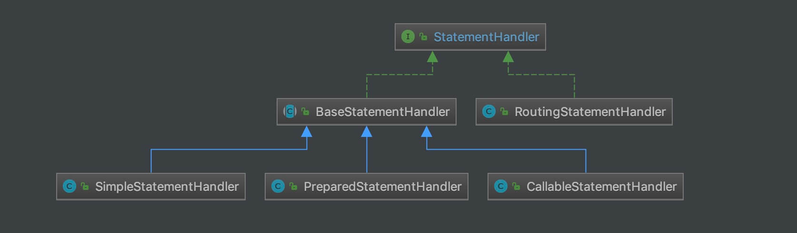

## 1. 概述

本文，我们来分享 SQL 执行的第二部分，`statement` 包。整体类图如下：


我们可以看到，整体是以 StatementHandler 为核心。所以，本文主要会看到的就是 StatementHandler 对 JDBC Statement 的各种操作。

而 StatementHandler 在整个 SQL 执行过程中，所处的位置如下：


## 2. StatementHandler

`org.apache.ibatis.executor.statement.StatementHandler` ，Statement 处理器，其中 Statement 包含 `java.sql.Statement`、`java.sql.PreparedStatement`、`java.sql.CallableStatement` 三种。代码如下：

```java
// StatementHandler.java

public interface StatementHandler {

    /**
     * 准备操作，可以理解成创建 Statement 对象
     *
     * @param connection         Connection 对象
     * @param transactionTimeout 事务超时时间
     * @return Statement 对象
     */
    Statement prepare(Connection connection, Integer transactionTimeout) throws SQLException;

    /**
     * 设置 Statement 对象的参数
     *
     * @param statement Statement 对象
     */
    void parameterize(Statement statement) throws SQLException;
    
    /**
     * 添加 Statement 对象的批量操作
     *
     * @param statement Statement 对象
     */
    void batch(Statement statement) throws SQLException;
    /**
     * 执行写操作
     *
     * @param statement Statement 对象
     * @return 影响的条数
     */
    int update(Statement statement) throws SQLException;
    /**
     * 执行读操作
     *
     * @param statement Statement 对象
     * @param resultHandler ResultHandler 对象，处理结果
     * @param <E> 泛型
     * @return 读取的结果
     */
    <E> List<E> query(Statement statement, ResultHandler resultHandler) throws SQLException;
    /**
     * 执行读操作，返回 Cursor 对象
     *
     * @param statement Statement 对象
     * @param <E> 泛型
     * @return Cursor 对象
     */
    <E> Cursor<E> queryCursor(Statement statement) throws SQLException;

    /**
     * @return BoundSql 对象
     */
    BoundSql getBoundSql();
    /**
     * @return ParameterHandler 对象
     */
    ParameterHandler getParameterHandler();

}
```

StatementHandler 有多个子类，如下图所示：



左边的三个实现类，分别对应 `java.sql.Statement`、`java.sql.PreparedStatement`、`java.sql.CallableStatement` 三种不同的实现类。

右边的 RoutingStatementHandler 实现类，负责将不同的 Statement 类型，路由到上述三个实现类上。

下面，我们先看右边的实现类，再看左边的实现类。

## 3. RoutingStatementHandler

`org.apache.ibatis.executor.statement.RoutingStatementHandler` ，实现 StatementHandler 接口，路由的 StatementHandler 对象，根据 Statement 类型，转发到对应的 StatementHandler 实现类中。

### 3.1 构造方法

```java
// RoutingStatementHandler.java

/**
 * 被委托的 StatementHandler 对象
 */
private final StatementHandler delegate;

public RoutingStatementHandler(Executor executor, MappedStatement ms, Object parameter, RowBounds rowBounds, ResultHandler resultHandler, BoundSql boundSql) {
    // 根据不同的类型，创建对应的 StatementHandler 实现类
    switch (ms.getStatementType()) {
        case STATEMENT:
            delegate = new SimpleStatementHandler(executor, ms, parameter, rowBounds, resultHandler, boundSql);
            break;
        case PREPARED:
            delegate = new PreparedStatementHandler(executor, ms, parameter, rowBounds, resultHandler, boundSql);
            break;
        case CALLABLE:
            delegate = new CallableStatementHandler(executor, ms, parameter, rowBounds, resultHandler, boundSql);
            break;
        default:
            throw new ExecutorException("Unknown statement type: " + ms.getStatementType());
    }
}
```

根据不同的类型，创建对应的 StatementHandler 实现类。

经典的装饰器模式。

### 3.2 实现方法

所有的实现方法，调用 `delegate` 对应的方法即可。代码如下：

```java
// RoutingStatementHandler.java

@Override
public Statement prepare(Connection connection, Integer transactionTimeout) throws SQLException {
    return delegate.prepare(connection, transactionTimeout);
}

@Override
public void parameterize(Statement statement) throws SQLException {
    delegate.parameterize(statement);
}

@Override
public void batch(Statement statement) throws SQLException {
    delegate.batch(statement);
}

@Override
public int update(Statement statement) throws SQLException {
    return delegate.update(statement);
}

@Override
public <E> List<E> query(Statement statement, ResultHandler resultHandler) throws SQLException {
    return delegate.query(statement, resultHandler);
}

@Override
public <E> Cursor<E> queryCursor(Statement statement) throws SQLException {
    return delegate.queryCursor(statement);
}

@Override
public BoundSql getBoundSql() {
    return delegate.getBoundSql();
}

@Override
public ParameterHandler getParameterHandler() {
    return delegate.getParameterHandler();
}
```

## 4. BaseStatementHandler

`org.apache.ibatis.executor.statement.BaseStatementHandler` ，实现 StatementHandler 接口，StatementHandler 基类，提供骨架方法，从而使子类只要实现指定的几个抽象方法即可。

### 4.1 构造方法

```java
// BaseStatementHandler.java

protected final Configuration configuration;
protected final ObjectFactory objectFactory;
protected final TypeHandlerRegistry typeHandlerRegistry;
protected final ResultSetHandler resultSetHandler;
protected final ParameterHandler parameterHandler;

protected final Executor executor;
protected final MappedStatement mappedStatement;
protected final RowBounds rowBounds;

protected BoundSql boundSql;

protected BaseStatementHandler(Executor executor, MappedStatement mappedStatement, Object parameterObject, RowBounds rowBounds, ResultHandler resultHandler, BoundSql boundSql) {
    // 获得 Configuration 对象
    this.configuration = mappedStatement.getConfiguration();

    this.executor = executor;
    this.mappedStatement = mappedStatement;
    this.rowBounds = rowBounds;

    // 获得 TypeHandlerRegistry 和 ObjectFactory 对象
    this.typeHandlerRegistry = configuration.getTypeHandlerRegistry();
    this.objectFactory = configuration.getObjectFactory();

    // <1> 如果 boundSql 为空，一般是写类操作，例如：insert、update、delete ，则先获得自增主键，然后再创建 BoundSql 对象
    if (boundSql == null) { // issue #435, get the key before calculating the statement
        // <1.1> 获得自增主键
        generateKeys(parameterObject);
        // <1.2> 创建 BoundSql 对象
        boundSql = mappedStatement.getBoundSql(parameterObject);
    }
    this.boundSql = boundSql;

    // <2> 创建 ParameterHandler 对象
    this.parameterHandler = configuration.newParameterHandler(mappedStatement, parameterObject, boundSql);
    // <3> 创建 ResultSetHandler 对象
    this.resultSetHandler = configuration.newResultSetHandler(executor, mappedStatement, rowBounds, parameterHandler, resultHandler, boundSql);
}
```

`<1>` 处，如果 `boundSql` 为空：

一般是**写**类操作，例如：`insert`、`update`、`delete` 。代码如下：

```java
// SimpleExecutor.java

@Override
public int doUpdate(MappedStatement ms, Object parameter) throws SQLException {
    Statement stmt = null;
    try {
        Configuration configuration = ms.getConfiguration();
        // <x> 创建 StatementHandler 对象
        StatementHandler handler = configuration.newStatementHandler(this, ms, parameter, RowBounds.DEFAULT, null, null);
        // 初始化 StatementHandler 对象
        stmt = prepareStatement(handler, ms.getStatementLog());
        // 执行 StatementHandler ，进行写操作
        return handler.update(stmt);
    } finally {
        // 关闭 StatementHandler 对象
        closeStatement(stmt);
    }
}
```

`<x>` 处，调用 `Configuration#newStatementHandler(Executor executor, MappedStatement mappedStatement, Object parameterObject, RowBounds rowBounds, ResultHandler resultHandler, BoundSql boundSql)` 方法，创建 StatementHandler 对象。其中，方法参数 `boundSql` 为 `null` 。

`<1.1>` 处，调用 `#generateKeys(Object parameter)` 方法，获得自增主键。代码如下：

```java
// BaseStatementHandler.java

protected void generateKeys(Object parameter) {
    // 获得 KeyGenerator 对象
    KeyGenerator keyGenerator = mappedStatement.getKeyGenerator();
    ErrorContext.instance().store();
    // 前置处理，创建自增编号到 parameter 中
    keyGenerator.processBefore(executor, mappedStatement, null, parameter);
    ErrorContext.instance().recall();
}
```

通过 KeyGenerator 对象，创建自增编号到 `parameter` 中。详细的解析，见后续的 KeyGenerator 的内容。

`<1.2>` 处，调用 `MappedStatement#getBoundSql(Object parameterObject)` 方法，创建 BoundSql 对象。

这个流程，可以调试下 `BindingTest#shouldInsertAuthorWithSelectKeyAndDynamicParams()` 单元测试方法。

`<2>` 处，调用 `Configuration#newParameterHandler(MappedStatement mappedStatement, Object parameterObject, BoundSql boundSql)` 方法，创建 ParameterHandler 对象。代码如下：

```java
// Configuration.java

public ParameterHandler newParameterHandler(MappedStatement mappedStatement, Object parameterObject, BoundSql boundSql) {
    // 创建 ParameterHandler 对象
    ParameterHandler parameterHandler = mappedStatement.getLang().createParameterHandler(mappedStatement, parameterObject, boundSql);
    // 应用插件
    parameterHandler = (ParameterHandler) interceptorChain.pluginAll(parameterHandler);
    return parameterHandler;
}

// XMLLanguageDriver.java

@Override
public ParameterHandler createParameterHandler(MappedStatement mappedStatement, Object parameterObject, BoundSql boundSql) {
    // 创建 DefaultParameterHandler 对象
    return new DefaultParameterHandler(mappedStatement, parameterObject, boundSql);
}
```

从代码中，可以看到，创建的是 DefaultParameterHandler 对象。而这个类，在 [《精尽 MyBatis 源码分析 —— SQL 初始化（下）之 SqlSource》](http://svip.iocoder.cn/MyBatis/scripting-2) 的 [「7.1 DefaultParameterHandler」](http://svip.iocoder.cn/MyBatis/executor-2/#) 已经有详细解析啦。

`<3>` 处，创建 ResultSetHandler 对象。详细解析，见 [《精尽 MyBatis 源码分析 —— SQL 执行（四）之 ResultSetHandler》](http://svip.iocoder.cn/MyBatis/executor-4) 。

### 4.2 prepare

```java
// BaseStatementHandler.java

@Override
public Statement prepare(Connection connection, Integer transactionTimeout) throws SQLException {
    ErrorContext.instance().sql(boundSql.getSql());
    Statement statement = null;
    try {
        // <1> 创建 Statement 对象
        statement = instantiateStatement(connection);
        // 设置超时时间
        setStatementTimeout(statement, transactionTimeout);
        // 设置 fetchSize
        setFetchSize(statement);
        return statement;
    } catch (SQLException e) {
        // 发生异常，进行关闭
        closeStatement(statement);
        throw e;
    } catch (Exception e) {
        // 发生异常，进行关闭
        closeStatement(statement);
        throw new ExecutorException("Error preparing statement.  Cause: " + e, e);
    }
}
```

`<1>` 处，创建 `#instantiateStatement(Connection connection)` 方法，创建 Statement 对象。这是一个抽象方法，需要子类去实现。代码如下：

```java
// BaseStatementHandler.java

protected abstract Statement instantiateStatement(Connection connection) throws SQLException;
```

`<2>` 处，调用 `#setStatementTimeout(Statement stmt, Integer transactionTimeout)` 方法，设置超时时间。代码如下：

```java
// BaseStatementHandler.java

protected void setStatementTimeout(Statement stmt, Integer transactionTimeout) throws SQLException {
    // 获得 queryTimeout
    Integer queryTimeout = null;
    if (mappedStatement.getTimeout() != null) {
        queryTimeout = mappedStatement.getTimeout();
    } else if (configuration.getDefaultStatementTimeout() != null) {
        queryTimeout = configuration.getDefaultStatementTimeout();
    }
    // 设置查询超时时间
    if (queryTimeout != null) {
        stmt.setQueryTimeout(queryTimeout);
    }
    // 设置事务超时时间
    StatementUtil.applyTransactionTimeout(stmt, queryTimeout, transactionTimeout);
}
```

`<3>` 处，设置 `fetchSize` 。代码如下：

```java
// BaseStatementHandler.java

protected void setFetchSize(Statement stmt) throws SQLException {
    // 获得 fetchSize 。非空，则进行设置
    Integer fetchSize = mappedStatement.getFetchSize();
    if (fetchSize != null) {
        stmt.setFetchSize(fetchSize);
        return;
    }
    // 获得 defaultFetchSize 。非空，则进行设置
    Integer defaultFetchSize = configuration.getDefaultFetchSize();
    if (defaultFetchSize != null) {
        stmt.setFetchSize(defaultFetchSize);
    }
}
```

感兴趣的胖友，可以看看 [《聊聊jdbc statement的fetchSize》](https://juejin.im/post/5a6757e351882573541c86bb) 和 [《正确使用MySQL JDBC setFetchSize()方法解决JDBC处理大结果集 java.lang.OutOfMemoryError: Java heap space》](https://blog.csdn.net/seven_3306/article/details/9303879) 。

## 5. SimpleStatementHandler

`org.apache.ibatis.executor.statement.SimpleStatementHandler` ，继承 BaseStatementHandler 抽象类，`java.sql.Statement` 的 StatementHandler 实现类。

### 5.1 构造方法

```java
// SimpleStatementHandler.java

public SimpleStatementHandler(Executor executor, MappedStatement mappedStatement, Object parameter, RowBounds rowBounds, ResultHandler resultHandler, BoundSql boundSql) {
    super(executor, mappedStatement, parameter, rowBounds, resultHandler, boundSql);
}
```

### 5.2 instantiateStatement

`#instantiateStatement()` 方法，创建 `java.sql.Statement` 对象。代码如下：

```java
// SimpleStatementHandler.java

@Override
protected Statement instantiateStatement(Connection connection) throws SQLException {
    if (mappedStatement.getResultSetType() == ResultSetType.DEFAULT) {
        return connection.createStatement();
    } else {
        return connection.createStatement(mappedStatement.getResultSetType().getValue(), ResultSet.CONCUR_READ_ONLY);
    }
}
```

### 5.3 parameterize

```java
// SimpleStatementHandler.java

@Override
public void parameterize(Statement statement) throws SQLException {
    // N/A
}
```

空，因为无需做占位符参数的处理。

### 5.4 query

```java
// SimpleStatementHandler.java

@Override
public <E> List<E> query(Statement statement, ResultHandler resultHandler) throws SQLException {
    String sql = boundSql.getSql();
    // <1> 执行查询
    statement.execute(sql);
    // <2> 处理返回结果
    return resultSetHandler.handleResultSets(statement);
}
```

`<1>` 处，调用 `Statement#execute(String sql)` 方法，执行查询。

`<2>` 处，调用 `ResultHandler#handleResultSets(Statement stmt)` 方法，处理返回结果。

### 5.5 queryCursor

```java
// SimpleStatementHandler.java

@Override
public <E> Cursor<E> queryCursor(Statement statement) throws SQLException {
    String sql = boundSql.getSql();
    // <1> 执行查询
    statement.execute(sql);
    // <2> 处理返回的 Cursor 结果
    return resultSetHandler.handleCursorResultSets(statement);
}
```

`<1>` 处，调用 `Statement#execute(String sql)` 方法，执行查询。

`<2>` 处，调用 `ResultHandler#handleCursorResultSets(Statement stmt)` 方法，处理返回的 Cursor 结果。

### 5.6 batch

```java
// SimpleStatementHandler.java

@Override
public void batch(Statement statement) throws SQLException {
    String sql = boundSql.getSql();
    // 添加到批处理
    statement.addBatch(sql);
}
```

调用 `Statement#addBatch(String sql)` 方法，添加到批处理。

### 5.7 update

```java
// SimpleStatementHandler.java

@Override
public int update(Statement statement) throws SQLException {
    String sql = boundSql.getSql();
    Object parameterObject = boundSql.getParameterObject();
    KeyGenerator keyGenerator = mappedStatement.getKeyGenerator();
    int rows;
    // 如果是 Jdbc3KeyGenerator 类型
    if (keyGenerator instanceof Jdbc3KeyGenerator) {
        // <1.1> 执行写操作
        statement.execute(sql, Statement.RETURN_GENERATED_KEYS);
        // <2.2> 获得更新数量
        rows = statement.getUpdateCount();
        // <1.3> 执行 keyGenerator 的后置处理逻辑
        keyGenerator.processAfter(executor, mappedStatement, statement, parameterObject);
    // 如果是 SelectKeyGenerator 类型
    } else if (keyGenerator instanceof SelectKeyGenerator) {
        // <2.1> 执行写操作
        statement.execute(sql);
        // <2.2> 获得更新数量
        rows = statement.getUpdateCount();
        // <2.3> 执行 keyGenerator 的后置处理逻辑
        keyGenerator.processAfter(executor, mappedStatement, statement, parameterObject);
    } else {
        // <3.1> 执行写操作
        statement.execute(sql);
        // <3.2> 获得更新数量
        rows = statement.getUpdateCount();
    }
    return rows;
}
```

根据 `keyGenerator` 的类型，执行的逻辑，略有差异。

`<1.1>`、`<1.2>`、`<1.3>` 处，调用 `Statement#execute(String sql, ...)` 方法，执行写操作。其中，`<1.1>` 比较特殊，使用数据自带的自增功能。

`<1.2>`、`<2.2>`、`<3.2>` 处，调用 `Statement#getUpdateCount()` 方法，获得更新数量。

`<1.3>`、`<2.3>` 处，调用 `KeyGenerator#processAfter(Executor executor, MappedStatement ms, Statement stmt, Object parameter)` 方法，执行 `keyGenerator` 的后置处理逻辑。

## 6. PreparedStatementHandler

`org.apache.ibatis.executor.statement.PreparedStatementHandler` ，继承 BaseStatementHandler 抽象类，`java.sql.PreparedStatement` 的 StatementHandler 实现类。

### 6.1 构造方法

```java
// PreparedStatementHandler.java

public PreparedStatementHandler(Executor executor, MappedStatement mappedStatement, Object parameter, RowBounds rowBounds, ResultHandler resultHandler, BoundSql boundSql) {
    super(executor, mappedStatement, parameter, rowBounds, resultHandler, boundSql);
}
```

### 6.2 instantiateStatement

`#instantiateStatement()` 方法，创建 `java.sql.Statement` 对象。代码如下：

```java
// PreparedStatementHandler.java

@Override
protected Statement instantiateStatement(Connection connection) throws SQLException {
    String sql = boundSql.getSql();
    // <1> 处理 Jdbc3KeyGenerator 的情况
    if (mappedStatement.getKeyGenerator() instanceof Jdbc3KeyGenerator) {
        String[] keyColumnNames = mappedStatement.getKeyColumns();
        if (keyColumnNames == null) {
            return connection.prepareStatement(sql, PreparedStatement.RETURN_GENERATED_KEYS);
        } else {
            return connection.prepareStatement(sql, keyColumnNames);
        }
    // <2>
    } else if (mappedStatement.getResultSetType() == ResultSetType.DEFAULT) {
        return connection.prepareStatement(sql);
    // <3>
    } else {
        return connection.prepareStatement(sql, mappedStatement.getResultSetType().getValue(), ResultSet.CONCUR_READ_ONLY);
    }
}
```

`<1>` 处，处理 Jdbc3KeyGenerator 的情况。

`<2>` + `<3>` 处，和 SimpleStatementHandler 的方式是一致的。

### 6.3 parameterize

```java
// PreparedStatementHandler.java

@Override
public void parameterize(Statement statement) throws SQLException {
    parameterHandler.setParameters((PreparedStatement) statement);
}
```

调用 `ParameterHandler#setParameters(PreparedStatement ps)` 方法，设置 PreparedStatement 的占位符参数。

### 6.4 query

```java
// PreparedStatementHandler.java

@Override
public <E> List<E> query(Statement statement, ResultHandler resultHandler) throws SQLException {
    PreparedStatement ps = (PreparedStatement) statement;
    // 执行查询
    ps.execute();
    // 处理返回结果
    return resultSetHandler.handleResultSets(ps);
}
```

### 6.5 queryCursor

```java
// PreparedStatementHandler.java

@Override
public <E> Cursor<E> queryCursor(Statement statement) throws SQLException {
    PreparedStatement ps = (PreparedStatement) statement;
    // 执行查询
    ps.execute();
    // 处理返回的 Cursor 结果
    return resultSetHandler.handleCursorResultSets(ps);
}
```

### 6.6 batch

```java
// PreparedStatementHandler.java

@Override
public void batch(Statement statement) throws SQLException {
    PreparedStatement ps = (PreparedStatement) statement;
    // 添加到批处理
    ps.addBatch();
}
```

### 6.7 update

```java
// PreparedStatementHandler.java

@Override
public int update(Statement statement) throws SQLException {
    PreparedStatement ps = (PreparedStatement) statement;
    // 执行写操作
    ps.execute();
    int rows = ps.getUpdateCount();
    // 获得更新数量
    Object parameterObject = boundSql.getParameterObject();
    // 执行 keyGenerator 的后置处理逻辑
    KeyGenerator keyGenerator = mappedStatement.getKeyGenerator();
    keyGenerator.processAfter(executor, mappedStatement, ps, parameterObject);
    return rows;
}
```

## 7. CallableStatementHandler

`org.apache.ibatis.executor.statement.CallableStatementHandler` ，继承 BaseStatementHandler 抽象类，`java.sql.CallableStatement` 的 StatementHandler 实现类。

因为本系列不分享**存储过程**相关的内容，所以省略。感兴趣的胖友，自己研究哈。

## 8. 创建 StatementHandler 对象

在上面的文章中，我们已经看了各种 StatementHandler 的实现代码。那么，StatementHandler 对象究竟在 MyBatis 中，是如何被创建的呢？Configuration 类中，提供 `#newStatementHandler(Executor executor, MappedStatement mappedStatement, Object parameterObject, RowBounds rowBounds, ResultHandler resultHandler, BoundSql boundSql)` 方法，代码如下：

```java
// Configuration.java

public StatementHandler newStatementHandler(Executor executor, MappedStatement mappedStatement, Object parameterObject, RowBounds rowBounds, ResultHandler resultHandler, BoundSql boundSql) {
    // <1> 创建 RoutingStatementHandler 对象
    StatementHandler statementHandler = new RoutingStatementHandler(executor, mappedStatement, parameterObject, rowBounds, resultHandler, boundSql);
    // 应用插件
    statementHandler = (StatementHandler) interceptorChain.pluginAll(statementHandler);
    return statementHandler;
}
```

`<1>` 处，创建 RoutingStatementHandler 对象。通过它，自动**路由**到适合的 StatementHandler 实现类。此处一看，更加适合，使用工厂模式。

`<2>` 处，应用插件。关于**插件**，我们在后续的文章中，详细解析。

