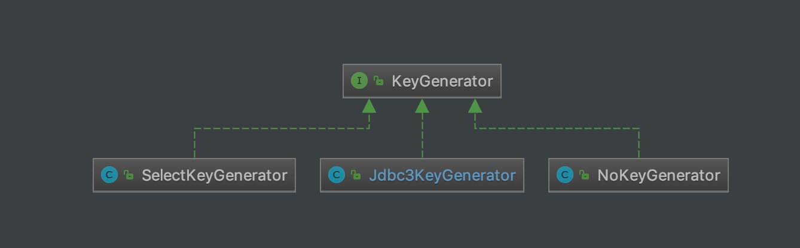

## 1. 概述

本文，我们来分享 SQL 执行的第三部分，`keygen` 包。整体类图如下：



我们可以看到，整体是以 KeyGenerator 为核心。所以，本文主要会看到的就是 KeyGenerator 对**自增主键**的获取。

## 2. KeyGenerator

`org.apache.ibatis.executor.keygen.KeyGenerator` ，主键生成器接口。代码如下：

```java
// KeyGenerator.java

public interface KeyGenerator {

    // SQL 执行前
    void processBefore(Executor executor, MappedStatement ms, Statement stmt, Object parameter);

    // SQL 执行后
    void processAfter(Executor executor, MappedStatement ms, Statement stmt, Object parameter);

}
```

可在 SQL 执行**之前**或**之后**，进行处理主键的生成。

实际上，KeyGenerator 类的命名虽然包含 Generator ，但是目前 MyBatis 默认的 KeyGenerator 实现类，都是基于数据库来实现**主键自增**的功能。

`parameter` 参数，指的是什么呢？以下面的方法为示例：

```java
@Options(useGeneratedKeys = true, keyProperty = "id")
@Insert({"insert into country (countryname,countrycode) values (#{countryname},#{countrycode})"})
int insertBean(Country country);
```

上面的，`country` 方法参数，就是一个 `parameter` 参数。

**KeyGenerator 在获取到主键后，会设置回 `parameter` 参数的对应属性**。

## 3. Jdbc3KeyGenerator

`org.apache.ibatis.executor.keygen.Jdbc3KeyGenerator` ，实现 KeyGenerator 接口，基于 `Statement#getGeneratedKeys()` 方法的 KeyGenerator 实现类，适用于 MySQL、H2 主键生成。

### 3.1 构造方法

```java
// Jdbc3KeyGenerator.java

/**
 * A shared instance.
 *
 * 共享的单例
 *
 * @since 3.4.3
 */
public static final Jdbc3KeyGenerator INSTANCE = new Jdbc3KeyGenerator();
```

单例。

### 3.2 processBefore

```java
@Override
public void processBefore(Executor executor, MappedStatement ms, Statement stmt, Object parameter) {
    // do nothing
}
```

空实现。因为对于 Jdbc3KeyGenerator 类的主键，是在 SQL 执行后，才生成。

### 3.3 processAfter

```java
// Jdbc3KeyGenerator.java

@Override
public void processAfter(Executor executor, MappedStatement ms, Statement stmt, Object parameter) {
    processBatch(ms, stmt, parameter);
}
```

调用 `#processBatch(Executor executor, MappedStatement ms, Statement stmt, Object parameter)` 方法，处理返回的自增主键。单个 `parameter` 参数，可以认为是批量的一个**特例**。

### 3.4 processBatch

```java
// Jdbc3KeyGenerator.java

public void processBatch(MappedStatement ms, Statement stmt, Object parameter) {
    // <1> 获得主键属性的配置。如果为空，则直接返回，说明不需要主键
    final String[] keyProperties = ms.getKeyProperties();
    if (keyProperties == null || keyProperties.length == 0) {
        return;
    }
    ResultSet rs = null;
    try {
        // <2> 获得返回的自增主键
        rs = stmt.getGeneratedKeys();
        final Configuration configuration = ms.getConfiguration();
        if (rs.getMetaData().getColumnCount() >= keyProperties.length) {
            // <3> 获得唯一的参数对象
            Object soleParam = getSoleParameter(parameter);
            if (soleParam != null) {
                // <3.1> 设置主键们，到参数 soleParam 中
                assignKeysToParam(configuration, rs, keyProperties, soleParam);
            } else {
                // <3.2> 设置主键们，到参数 parameter 中
                assignKeysToOneOfParams(configuration, rs, keyProperties, (Map<?, ?>) parameter);
            }
        }
    } catch (Exception e) {
        throw new ExecutorException("Error getting generated key or setting result to parameter object. Cause: " + e, e);
    } finally {
        // <4> 关闭 ResultSet 对象
        if (rs != null) {
            try {
                rs.close();
            } catch (Exception e) {
                // ignore
            }
        }
    }
}
```

`<1>` 处，获得主键属性的配置。如果为空，则直接返回，说明不需要主键。

【重要】`<2>` 处，调用 `Statement#getGeneratedKeys()` 方法，获得返回的自增主键。

`<3>` 处，调用 `#getSoleParameter(Object parameter)` 方法，获得唯一的参数对象。详细解析，先跳到 [「3.4.1 getSoleParameter」](http://svip.iocoder.cn/MyBatis/executor-3/#) 。

`<3.1>` 处，调用 `#assignKeysToParam(...)` 方法，设置主键们，到参数 `soleParam` 中。详细解析，见 [「3.4.2 assignKeysToParam」](http://svip.iocoder.cn/MyBatis/executor-3/#) 。

`<3.2>` 处，调用 `#assignKeysToOneOfParams(...)` 方法，设置主键们，到参数 `parameter` 中。详细解析，见 [「3.4.3 assignKeysToOneOfParams」](http://svip.iocoder.cn/MyBatis/executor-3/#) 。

`<4>` 处，关闭 ResultSet 对象。

#### 3.4.1 getSoleParameter

```java
// Jdbc3KeyGenerator.java

/**
 * 获得唯一的参数对象
 *
 * 如果获得不到唯一的参数对象，则返回 null
 *
 * @param parameter 参数对象
 * @return 唯一的参数对象
 */
private Object getSoleParameter(Object parameter) {
    // <1> 如果非 Map 对象，则直接返回 parameter
    if (!(parameter instanceof ParamMap || parameter instanceof StrictMap)) {
        return parameter;
    }
    // <3> 如果是 Map 对象，则获取第一个元素的值
    // <2> 如果有多个元素，则说明获取不到唯一的参数对象，则返回 null
    Object soleParam = null;
    for (Object paramValue : ((Map<?, ?>) parameter).values()) {
        if (soleParam == null) {
            soleParam = paramValue;
        } else if (soleParam != paramValue) {
            soleParam = null;
            break;
        }
    }
    return soleParam;
}
```

`<1>` 处，如下可以符合这个条件。代码如下：

```java
@Options(useGeneratedKeys = true, keyProperty = "id")
@Insert({"insert into country (countryname,countrycode) values (#{country.countryname},#{country.countrycode})"})
int insertNamedBean(@Param("country") Country country);
```

`<2>` 处，如下可以符合这个条件。代码如下：

```java
@Options(useGeneratedKeys = true, keyProperty = "country.id")
@Insert({"insert into country (countryname, countrycode) values (#{country.countryname}, #{country.countrycode})"})
int insertMultiParams_keyPropertyWithWrongParamName2(@Param("country") Country country,
                                                     @Param("someId") Integer someId);
```

虽然有 `country` 和 `someId` 参数，但是最终会被封装成一个 `parameter` 参数，类型为 ParamMap 类型。为什么呢？答案在 `ParamNameResolver#getNamedParams(Object[] args)` 方法中。

如果是这个情况，获得的主键，会设置回 `country` 的 `id` 属性，因为注解上的 `keyProperty = "country.id"` 配置。

`<3>` 处，如下可以符合这个条件。代码如下：

```java
@Options(useGeneratedKeys = true, keyProperty = "id")
@Insert({"insert into country (countryname, countrycode) values (#{country.countryname}, #{country.countrycode})"})
int insertMultiParams_keyPropertyWithWrongParamName3(@Param("country") Country country);
```

相比 `<2>` 的示例，主要是 `keyProperty = "id"` 的修改，和去掉了 `@Param("someId") Integer someId` 参数。

实际上，这种情况，和 `<1>` 是类似的。

三种情况，`<2>` 和 `<3>` 有点复杂，胖友实际上，理解 `<1>` 即可。

#### 3.4.2 assignKeysToParam

```java
// Jdbc3KeyGenerator.java

private void assignKeysToParam(final Configuration configuration, ResultSet rs, final String[] keyProperties, Object param)
        throws SQLException {
    final TypeHandlerRegistry typeHandlerRegistry = configuration.getTypeHandlerRegistry();
    final ResultSetMetaData rsmd = rs.getMetaData();
    // Wrap the parameter in Collection to normalize the logic.
    // <1> 包装成 Collection 对象
    Collection<?> paramAsCollection;
    if (param instanceof Object[]) {
        paramAsCollection = Arrays.asList((Object[]) param);
    } else if (!(param instanceof Collection)) {
        paramAsCollection = Collections.singletonList(param);
    } else {
        paramAsCollection = (Collection<?>) param;
    }
    TypeHandler<?>[] typeHandlers = null;
    // <2> 遍历 paramAsCollection 数组
    for (Object obj : paramAsCollection) {
        // <2.1> 顺序遍历 rs
        if (!rs.next()) {
            break;
        }
        // <2.2> 创建 MetaObject 对象
        MetaObject metaParam = configuration.newMetaObject(obj);
        // <2.3> 获得 TypeHandler 数组
        if (typeHandlers == null) {
            typeHandlers = getTypeHandlers(typeHandlerRegistry, metaParam, keyProperties, rsmd);
        }
        // <2.4> 填充主键们
        populateKeys(rs, metaParam, keyProperties, typeHandlers);
    }
}
```

`<1>` 处，包装成 Collection 对象。通过这样的方式，使单个 `param` 参数的情况下，可以统一。

`<2>` 处，遍历 `paramAsCollection` 数组：

`<2.1>` 处， 顺序遍历 `rs` ，相当于把当前的 ResultSet 对象的主键们，赋值给 `obj` 对象的对应属性。

`<2.2>` 处，创建 MetaObject 对象，实现对 `obj` 对象的属性访问。

`<2.3>` 处，调用 `#getTypeHandlers(...)` 方法，获得 TypeHandler 数组。代码如下：

```java
// Jdbc3KeyGenerator.java

private TypeHandler<?>[] getTypeHandlers(TypeHandlerRegistry typeHandlerRegistry, MetaObject metaParam, String[] keyProperties, ResultSetMetaData rsmd) throws SQLException {
    // 获得主键们，对应的每个属性的，对应的 TypeHandler 对象
    TypeHandler<?>[] typeHandlers = new TypeHandler<?>[keyProperties.length];
    for (int i = 0; i < keyProperties.length; i++) {
        if (metaParam.hasSetter(keyProperties[i])) {
            Class<?> keyPropertyType = metaParam.getSetterType(keyProperties[i]);
            typeHandlers[i] = typeHandlerRegistry.getTypeHandler(keyPropertyType, JdbcType.forCode(rsmd.getColumnType(i + 1)));
        } else {
            throw new ExecutorException("No setter found for the keyProperty '" + keyProperties[i] + "' in '"
                    + metaParam.getOriginalObject().getClass().getName() + "'.");
        }
    }
    return typeHandlers;
}
```

`<2.4>` 处，调用 `#populateKeys(...)` 方法，填充主键们。详细解析，见 [「3.5 populateKeys」](http://svip.iocoder.cn/MyBatis/executor-3/#) 。

#### 3.4.3 assignKeysToOneOfParams

```java
// Jdbc3KeyGenerator.java

protected void assignKeysToOneOfParams(final Configuration configuration, ResultSet rs, final String[] keyProperties,
                                       Map<?, ?> paramMap) throws SQLException {
    // Assuming 'keyProperty' includes the parameter name. e.g. 'param.id'.
    // <1> 需要有 `.` 。
    int firstDot = keyProperties[0].indexOf('.');
    if (firstDot == -1) {
        throw new ExecutorException(
                "Could not determine which parameter to assign generated keys to. "
                        + "Note that when there are multiple parameters, 'keyProperty' must include the parameter name (e.g. 'param.id'). "
                        + "Specified key properties are " + ArrayUtil.toString(keyProperties) + " and available parameters are "
                        + paramMap.keySet());
    }
    // 获得真正的参数值
    String paramName = keyProperties[0].substring(0, firstDot);
    Object param;
    if (paramMap.containsKey(paramName)) {
        param = paramMap.get(paramName);
    } else {
        throw new ExecutorException("Could not find parameter '" + paramName + "'. "
                + "Note that when there are multiple parameters, 'keyProperty' must include the parameter name (e.g. 'param.id'). "
                + "Specified key properties are " + ArrayUtil.toString(keyProperties) + " and available parameters are "
                + paramMap.keySet());
    }
    // Remove param name from 'keyProperty' string. e.g. 'param.id' -> 'id'
    // 获得主键的属性的配置
    String[] modifiedKeyProperties = new String[keyProperties.length];
    for (int i = 0; i < keyProperties.length; i++) {
        if (keyProperties[i].charAt(firstDot) == '.' && keyProperties[i].startsWith(paramName)) {
            modifiedKeyProperties[i] = keyProperties[i].substring(firstDot + 1);
        } else {
            throw new ExecutorException("Assigning generated keys to multiple parameters is not supported. "
                    + "Note that when there are multiple parameters, 'keyProperty' must include the parameter name (e.g. 'param.id'). "
                    + "Specified key properties are " + ArrayUtil.toString(keyProperties) + " and available parameters are "
                    + paramMap.keySet());
        }
    }
    // 设置主键们，到参数 param 中
    assignKeysToParam(configuration, rs, modifiedKeyProperties, param);
}
```

`<1>` 处，需要有 `.` 。例如：`@Options(useGeneratedKeys = true, keyProperty = "country.id")` 。

`<2>` 处，获得真正的参数值。

`<3>` 处，获得主键的属性的配置。

`<4>` 处，调用 `#assignKeysToParam(...)` 方法，设置主键们，到参数 `param` 中。所以，后续流程，又回到了 [「3.4.2」](http://svip.iocoder.cn/MyBatis/executor-3/#) 咧。

### 3.5 populateKeys

```java
// Jdbc3KeyGenerator.java

private void populateKeys(ResultSet rs, MetaObject metaParam, String[] keyProperties, TypeHandler<?>[] typeHandlers) throws SQLException {
    // 遍历 keyProperties
    for (int i = 0; i < keyProperties.length; i++) {
        // 获得属性名
        String property = keyProperties[i];
        // 获得 TypeHandler 对象
        TypeHandler<?> th = typeHandlers[i];
        if (th != null) {
            // 从 rs 中，获得对应的 值
            Object value = th.getResult(rs, i + 1);
            // 设置到 metaParam 的对应 property 属性种
            metaParam.setValue(property, value);
        }
    }
}
```

## 4. SelectKeyGenerator

`org.apache.ibatis.executor.keygen.SelectKeyGenerator` ，实现 KeyGenerator 接口，基于从数据库查询主键的 KeyGenerator 实现类，适用于 Oracle、PostgreSQL 。

### 4.1 构造方法

```java
// SelectKeyGenerator.java

    public static final String SELECT_KEY_SUFFIX = "!selectKey";

/**
 * 是否在 before 阶段执行
 *
 * true ：before
 * after ：after
 */
private final boolean executeBefore;
/**
 * MappedStatement 对象
 */
private final MappedStatement keyStatement;

public SelectKeyGenerator(MappedStatement keyStatement, boolean executeBefore) {
    this.executeBefore = executeBefore;
    this.keyStatement = keyStatement;
}
```

### 4.2 processBefore

```java
// SelectKeyGenerator.java

@Override
public void processBefore(Executor executor, MappedStatement ms, Statement stmt, Object parameter) {
    if (executeBefore) {
        processGeneratedKeys(executor, ms, parameter);
    }
}
```

调用 `#processGeneratedKeys(...)` 方法。

### 4.3 processAfter

```java
// SelectKeyGenerator.java

@Override
public void processAfter(Executor executor, MappedStatement ms, Statement stmt, Object parameter) {
    if (!executeBefore) {
        processGeneratedKeys(executor, ms, parameter);
    }
}
```

也是调用 `#processGeneratedKeys(...)` 方法。

### 4.4 processGeneratedKeys

```java
// SelectKeyGenerator.java

private void processGeneratedKeys(Executor executor, MappedStatement ms, Object parameter) {
    try {
        // <1> 有查询主键的 SQL 语句，即 keyStatement 对象非空
        if (parameter != null && keyStatement != null && keyStatement.getKeyProperties() != null) {
            String[] keyProperties = keyStatement.getKeyProperties();
            final Configuration configuration = ms.getConfiguration();
            final MetaObject metaParam = configuration.newMetaObject(parameter);
            // Do not close keyExecutor.
            // The transaction will be closed by parent executor.
            // <2> 创建执行器，类型为 SimpleExecutor
            Executor keyExecutor = configuration.newExecutor(executor.getTransaction(), ExecutorType.SIMPLE);
            // <3> 执行查询主键的操作
            List<Object> values = keyExecutor.query(keyStatement, parameter, RowBounds.DEFAULT, Executor.NO_RESULT_HANDLER);
            // <4.1> 查不到结果，抛出 ExecutorException 异常
            if (values.size() == 0) {
                throw new ExecutorException("SelectKey returned no data.");
            // <4.2> 查询的结果过多，抛出 ExecutorException 异常
            } else if (values.size() > 1) {
                throw new ExecutorException("SelectKey returned more than one value.");
            } else {
                // <4.3> 创建 MetaObject 对象，访问查询主键的结果
                MetaObject metaResult = configuration.newMetaObject(values.get(0));
                // <4.3.1> 单个主键
                if (keyProperties.length == 1) {
                    // 设置属性到 metaParam 中，相当于设置到 parameter 中
                    if (metaResult.hasGetter(keyProperties[0])) {
                        setValue(metaParam, keyProperties[0], metaResult.getValue(keyProperties[0]));
                    } else {
                        // no getter for the property - maybe just a single value object
                        // so try that
                        setValue(metaParam, keyProperties[0], values.get(0));
                    }
                // <4.3.2> 多个主键
                } else {
                    // 遍历，进行赋值
                    handleMultipleProperties(keyProperties, metaParam, metaResult);
                }
            }
        }
    } catch (ExecutorException e) {
        throw e;
    } catch (Exception e) {
        throw new ExecutorException("Error selecting key or setting result to parameter object. Cause: " + e, e);
    }
}
```

`<1>` 处，有查询主键的 SQL 语句，即 `keyStatement` 对象非空。

`<2>` 处，创建执行器，类型为 SimpleExecutor 。

【重要】 `<3>` 处，调用 `Executor#query(...)` 方法，执行查询主键的操作。简单脑暴下，按照 SelectKeyGenerator 的思路，岂不是可以可以接入 SnowFlake 算法，从而实现分布式主键。

`<4.1>` 处，查不到结果，抛出 ExecutorException 异常。

`<4.2>` 处，查询的结果过多，抛出 ExecutorException 异常。

`<4.3>` 处，创建 MetaObject 对象，访问查询主键的结果。

`<4.3.1>` 处，**单个主键**，调用 `#setValue(MetaObject metaParam, String property, Object value)` 方法，设置属性到 `metaParam` 中，相当于设置到 `parameter` 中。代码如下：

```java
// SelectKeyGenerator.java

private void setValue(MetaObject metaParam, String property, Object value) {
    if (metaParam.hasSetter(property)) {
        metaParam.setValue(property, value);
    } else {
        throw new ExecutorException("No setter found for the keyProperty '" + property + "' in " + metaParam.getOriginalObject().getClass().getName() + ".");
    }
}
```

`<4.3.2>` 处，**多个主键**，调用 `#handleMultipleProperties(String[] keyProperties, MetaObject metaParam, MetaObject metaResult)` 方法，遍历，进行赋值。代码如下：

```java
// SelectKeyGenerator.java

private void handleMultipleProperties(String[] keyProperties,
                                      MetaObject metaParam, MetaObject metaResult) {
    String[] keyColumns = keyStatement.getKeyColumns();
    // 遍历，进行赋值
    if (keyColumns == null || keyColumns.length == 0) {
        // no key columns specified, just use the property names
        for (String keyProperty : keyProperties) {
            setValue(metaParam, keyProperty, metaResult.getValue(keyProperty));
        }
    } else {
        if (keyColumns.length != keyProperties.length) {
            throw new ExecutorException("If SelectKey has key columns, the number must match the number of key properties.");
        }
        for (int i = 0; i < keyProperties.length; i++) {
            setValue(metaParam, keyProperties[i], metaResult.getValue(keyColumns[i]));
        }
    }
}
```

最终，还是会调用 `#setValue(...)` 方法，进行赋值。

### 4.5 示例

* [《MyBatis + Oracle 实现主键自增长的几种常用方式》](https://blog.csdn.net/wal1314520/article/details/77132305)
* [《mybatis + postgresql 返回递增主键的正确姿势及勘误》](https://blog.csdn.net/cdnight/article/details/72735108)

## 5. NoKeyGenerator

`org.apache.ibatis.executor.keygen.NoKeyGenerator` ，实现 KeyGenerator 接口，空的 KeyGenerator 实现类，即无需主键生成。代码如下：

```java
// NoKeyGenerator.java

public class NoKeyGenerator implements KeyGenerator {

    /**
     * A shared instance.
     * @since 3.4.3
     */
    public static final NoKeyGenerator INSTANCE = new NoKeyGenerator();

    @Override
    public void processBefore(Executor executor, MappedStatement ms, Statement stmt, Object parameter) {
        // Do Nothing
    }

    @Override
    public void processAfter(Executor executor, MappedStatement ms, Statement stmt, Object parameter) {
        // Do Nothing
    }

}
```

