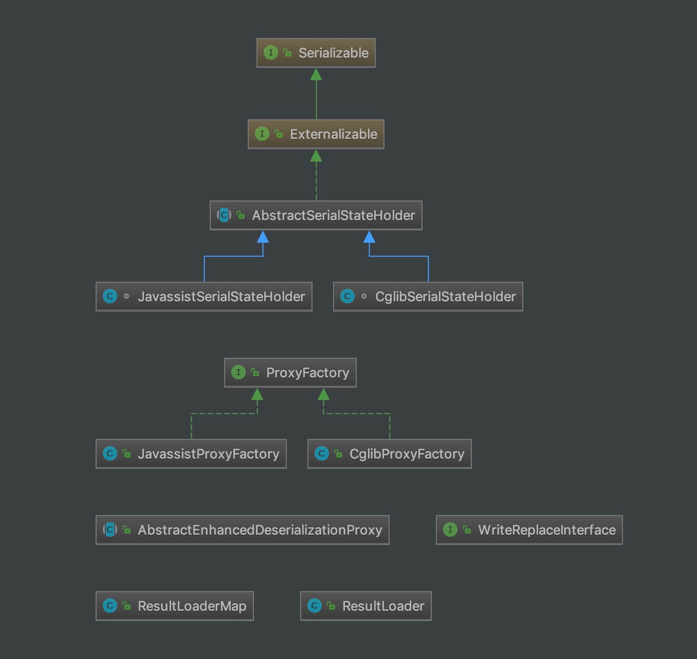

## 1. 概述

本文，我们来分享 SQL 执行的第五部分，延迟加载的功能的实现，涉及 `executor/loader` 包。整体类图如下：



从类图，我们发现，延迟加载的功能，是通过**动态代理**实现的。也就是说，通过拦截指定方法，执行数据加载，从而实现延迟加载。

并且，MyBatis 提供了 Cglib 和 Javassist 两种动态代理的创建方式。

在 [《精尽 MyBatis 源码分析 —— SQL 执行（四）之 ResultSetHandler》](http://svip.iocoder.cn/MyBatis/executor-4) 方法中，我们已经看到延迟加载相关的代码，下面让我们一处一处来看看。

另外，如果胖友并未使用过 MyBatis 的延迟加载的功能，可以先看看 [《【MyBatis框架】高级映射-延迟加载》](https://blog.csdn.net/acmman/article/details/46696167) 文章。

## 2. ResultLoader

在 DefaultResultSetHandler 的 `#getNestedQueryConstructorValue(ResultSet rs, ResultMapping constructorMapping, String columnPrefix)` 方法中，我们可以看到 ResultLoader 的身影。代码如下：

```java
// DefaultResultSetHandler.java

// 获得嵌套查询的值
private Object getNestedQueryConstructorValue(ResultSet rs, ResultMapping constructorMapping, String columnPrefix) throws SQLException {
    // 获得内嵌查询的编号
    final String nestedQueryId = constructorMapping.getNestedQueryId();
    // 获得内嵌查询的 MappedStatement 对象
    final MappedStatement nestedQuery = configuration.getMappedStatement(nestedQueryId);
    // 获得内嵌查询的参数类型
    final Class<?> nestedQueryParameterType = nestedQuery.getParameterMap().getType();
    // 获得内嵌查询的参数对象
    final Object nestedQueryParameterObject = prepareParameterForNestedQuery(rs, constructorMapping, nestedQueryParameterType, columnPrefix);
    Object value = null;
    if (nestedQueryParameterObject != null) {
        // 获得 BoundSql 对象
        final BoundSql nestedBoundSql = nestedQuery.getBoundSql(nestedQueryParameterObject);
        // 获得 CacheKey 对象
        final CacheKey key = executor.createCacheKey(nestedQuery, nestedQueryParameterObject, RowBounds.DEFAULT, nestedBoundSql);
        final Class<?> targetType = constructorMapping.getJavaType();
        // <x> 创建 ResultLoader 对象
        final ResultLoader resultLoader = new ResultLoader(configuration, executor, nestedQuery, nestedQueryParameterObject, targetType, key, nestedBoundSql);
        // 加载结果
        value = resultLoader.loadResult();
    }
    return value;
}
```

`<x>` 处，因为是结果对象的构造方法中使用的值，无法使用延迟加载的功能，所以使用 ResultLoader 直接加载。

`org.apache.ibatis.executor.loader.ResultLoader` ，结果加载器。

### 2.1 构造方法

```java
// ResultLoader.java

protected final Configuration configuration;
protected final Executor executor;
protected final MappedStatement mappedStatement;
/**
 * 查询的参数对象
 */
protected final Object parameterObject;
/**
 * 结果的类型
 */
protected final Class<?> targetType;
protected final ObjectFactory objectFactory;
protected final CacheKey cacheKey;
protected final BoundSql boundSql;
/**
 * ResultExtractor 对象
 */
protected final ResultExtractor resultExtractor;
/**
 * 创建 ResultLoader 对象时，所在的线程
 */
protected final long creatorThreadId;

/**
 * 是否已经加载
 */
protected boolean loaded;
/**
 * 查询的结果对象
 */
protected Object resultObject;

public ResultLoader(Configuration config, Executor executor, MappedStatement mappedStatement, Object parameterObject, Class<?> targetType, CacheKey cacheKey, BoundSql boundSql) {
    this.configuration = config;
    this.executor = executor;
    this.mappedStatement = mappedStatement;
    this.parameterObject = parameterObject;
    this.targetType = targetType;
    this.objectFactory = configuration.getObjectFactory();
    this.cacheKey = cacheKey;
    this.boundSql = boundSql;
    // 初始化 resultExtractor
    this.resultExtractor = new ResultExtractor(configuration, objectFactory);
    // 初始化 creatorThreadId
    this.creatorThreadId = Thread.currentThread().getId();
}
```

### 2.2 loadResult

`#loadResult()` 方法，加载结果。代码如下：

```java
// ResultLoader.java

public Object loadResult() throws SQLException {
    // <1> 查询结果
    List<Object> list = selectList();
    // <2> 提取结果
    resultObject = resultExtractor.extractObjectFromList(list, targetType);
    // <3> 返回结果
    return resultObject;
}
```

`<1>` 处，调用 `#selectList()` 方法，查询结果。详细解析，见 [「2.3 selectList」](http://svip.iocoder.cn/MyBatis/executor-5/#) 。

`<2>` 处，调用 `ResultExtractor#extractObjectFromList(List<Object> list, Class<?> targetType)` 方法，提取结果。详细解析，见 [「3. ResultExtractor」](http://svip.iocoder.cn/MyBatis/executor-5/#) 。

`<3>` 处，返回结果。

### 2.3 selectList

`#selectList()` 方法，查询结果。代码如下：

```java
// ResultLoader.java

private <E> List<E> selectList() throws SQLException {
    // <1> 获得 Executor 对象
    Executor localExecutor = executor;
    if (Thread.currentThread().getId() != this.creatorThreadId || localExecutor.isClosed()) {
        localExecutor = newExecutor();
    }
    // <2> 执行查询
    try {
        return localExecutor.query(mappedStatement, parameterObject, RowBounds.DEFAULT, Executor.NO_RESULT_HANDLER, cacheKey, boundSql);
    } finally {
        // <3> 关闭 Executor 对象
        if (localExecutor != executor) {
            localExecutor.close(false);
        }
    }
}
```

`<1>` 处，如果当前线程不是创建线程，则调用 `#newExecutor()` 方法，创建 Executor 对象，因为 Executor 是非线程安全的。代码如下：

```java
// ResultLoader.java

private Executor newExecutor() {
    // 校验 environment
    final Environment environment = configuration.getEnvironment();
    if (environment == null) {
        throw new ExecutorException("ResultLoader could not load lazily.  Environment was not configured.");
    }
    // 校验 ds
    final DataSource ds = environment.getDataSource();
    if (ds == null) {
        throw new ExecutorException("ResultLoader could not load lazily.  DataSource was not configured.");
    }
    // 创建 Transaction 对象
    final TransactionFactory transactionFactory = environment.getTransactionFactory();
    final Transaction tx = transactionFactory.newTransaction(ds, null, false);
    // 创建 Executor 对象
    return configuration.newExecutor(tx, ExecutorType.SIMPLE);
}
```

`<2>` 处，调用 `Executor#query(...)` 方法，执行查询。

`<3>` 处，如果是新创建的 Executor 对象，则调用 `Executor#close()` 方法，关闭 Executor 对象。

### 2.4 wasNull

`#wasNull()` 方法，是否结果为空。代码如下：

```java
// ResultLoader.java

public boolean wasNull() {
    return resultObject == null;
}
```

## 3. ResultExtractor

`org.apache.ibatis.executor.ResultExtractor` ，结果提取器。代码如下：

```java
// ResultExtractor.java

public class ResultExtractor {

    private final Configuration configuration;
    private final ObjectFactory objectFactory;

    public ResultExtractor(Configuration configuration, ObjectFactory objectFactory) {
        this.configuration = configuration;
        this.objectFactory = objectFactory;
    }

    /**
     * 从 list 中，提取结果
     *
     * @param list list
     * @param targetType 结果类型
     * @return 结果
     */
    public Object extractObjectFromList(List<Object> list, Class<?> targetType) {
        Object value = null;
        // 情况一，targetType 就是 list ，直接返回
        if (targetType != null && targetType.isAssignableFrom(list.getClass())) {
            value = list;
        // 情况二，targetType 是集合，添加到其中
        } else if (targetType != null && objectFactory.isCollection(targetType)) {
            // 创建 Collection 对象
            value = objectFactory.create(targetType);
            // 将结果添加到其中
            MetaObject metaObject = configuration.newMetaObject(value);
            metaObject.addAll(list);
        // 情况三，targetType 是数组
        } else if (targetType != null && targetType.isArray()) {
            // 创建 array 数组
            Class<?> arrayComponentType = targetType.getComponentType();
            Object array = Array.newInstance(arrayComponentType, list.size());
            // 赋值到 array 中
            if (arrayComponentType.isPrimitive()) {
                for (int i = 0; i < list.size(); i++) {
                    Array.set(array, i, list.get(i));
                }
                value = array;
            } else {
                value = list.toArray((Object[]) array);
            }
        // 情况四，普通对象，取首个对象
        } else {
            if (list != null && list.size() > 1) {
                throw new ExecutorException("Statement returned more than one row, where no more than one was expected.");
            } else if (list != null && list.size() == 1) {
                value = list.get(0);
            }
        }
        return value;
    }
    
}
```

## 4. ResultLoaderMap

在 DefaultResultSetHandler 的 `#getNestedQueryMappingValue(ResultSet rs, MetaObject metaResultObject, ResultMapping propertyMapping, ResultLoaderMap lazyLoader, String columnPrefix)` 方法中，我们可以看到 ResultLoaderMap 的身影。代码如下：

```java
// DefaultResultSetHandler.java

// 获得嵌套查询的值
private Object getNestedQueryMappingValue(ResultSet rs, MetaObject metaResultObject, ResultMapping propertyMapping, ResultLoaderMap lazyLoader, String columnPrefix)
        throws SQLException {
    // 获得内嵌查询的编号
    final String nestedQueryId = propertyMapping.getNestedQueryId();
    // 获得属性名
    final String property = propertyMapping.getProperty();
    // 获得内嵌查询的 MappedStatement 对象
    final MappedStatement nestedQuery = configuration.getMappedStatement(nestedQueryId);
    // 获得内嵌查询的参数类型
    final Class<?> nestedQueryParameterType = nestedQuery.getParameterMap().getType();
    // 获得内嵌查询的参数对象
    final Object nestedQueryParameterObject = prepareParameterForNestedQuery(rs, propertyMapping, nestedQueryParameterType, columnPrefix);
    Object value = null;
    if (nestedQueryParameterObject != null) {
        // 获得 BoundSql 对象
        final BoundSql nestedBoundSql = nestedQuery.getBoundSql(nestedQueryParameterObject);
        // 获得 CacheKey 对象
        final CacheKey key = executor.createCacheKey(nestedQuery, nestedQueryParameterObject, RowBounds.DEFAULT, nestedBoundSql);
        final Class<?> targetType = propertyMapping.getJavaType();
        // <y> 检查缓存中已存在
        if (executor.isCached(nestedQuery, key)) {
            // 创建 DeferredLoad 对象，并通过该 DeferredLoad 对象从缓存中加载结采对象
            executor.deferLoad(nestedQuery, metaResultObject, property, key, targetType);
            // 返回已定义
            value = DEFERED;
        // 检查缓存中不存在
        } else {
            // 创建 ResultLoader 对象
            final ResultLoader resultLoader = new ResultLoader(configuration, executor, nestedQuery, nestedQueryParameterObject, targetType, key, nestedBoundSql);
            // <x> 如果要求延迟加载，则延迟加载
            if (propertyMapping.isLazy()) {
                // 如果该属性配置了延迟加载，则将其添加到 `ResultLoader.loaderMap` 中，等待真正使用时再执行嵌套查询并得到结果对象。
                lazyLoader.addLoader(property, metaResultObject, resultLoader);
                // 返回已定义
                value = DEFERED;
            // 如果不要求延迟加载，则直接执行加载对应的值
            } else {
                value = resultLoader.loadResult();
            }
        }
    }
    return value;
}
```

`<x>` 处，因为是结果对象的 setting 方法中使用的值，可以使用延迟加载的功能，所以使用 ResultLoaderMap 记录。最终会创建结果对象的**代理对象**，而 ResultLoaderMap 对象会传入其中，作为一个参数。从而能够，在加载该属性时，能够调用 `ResultLoader#loadResult()` 方法，加载结果。

另外，在 `<y>` 处，检查缓存中已存在，则会调用 `Executor#deferLoad(...)` 方法，**尝试**加载结果。代码如下：

```java
// 该方法在 BaseExecutor 抽象类中实现
// BaseExecutor.java 
    
/**
 * DeferredLoad( 延迟加载 ) 队列
 */
protected ConcurrentLinkedQueue<DeferredLoad> deferredLoads;

@Override
public void deferLoad(MappedStatement ms, MetaObject resultObject, String property, CacheKey key, Class<?> targetType) {
    // 如果执行器已关闭，抛出 ExecutorException 异常
    if (closed) {
        throw new ExecutorException("Executor was closed.");
    }
    // 创建 DeferredLoad 对象
    DeferredLoad deferredLoad = new DeferredLoad(resultObject, property, key, localCache, configuration, targetType);
    // 如果可加载，则执行加载
    if (deferredLoad.canLoad()) {
        deferredLoad.load();
    // 如果不可加载，则添加到 deferredLoads 中
    } else {
        deferredLoads.add(new DeferredLoad(resultObject, property, key, localCache, configuration, targetType));
    }
}

private static class DeferredLoad {

    private final MetaObject resultObject;
    private final String property;
    private final Class<?> targetType;
    private final CacheKey key;
    private final PerpetualCache localCache;
    private final ObjectFactory objectFactory;
    private final ResultExtractor resultExtractor;

    // issue #781
    public DeferredLoad(MetaObject resultObject,
                        String property,
                        CacheKey key,
                        PerpetualCache localCache,
                        Configuration configuration,
                        Class<?> targetType) {
        this.resultObject = resultObject;
        this.property = property;
        this.key = key;
        this.localCache = localCache;
        this.objectFactory = configuration.getObjectFactory();
        this.resultExtractor = new ResultExtractor(configuration, objectFactory);
        this.targetType = targetType;
    }

    public boolean canLoad() {
        return localCache.getObject(key) != null && localCache.getObject(key) != EXECUTION_PLACEHOLDER;
    }

    public void load() {
        @SuppressWarnings("unchecked")
        // we suppose we get back a List
        // 从缓存 localCache 中获取
        List<Object> list = (List<Object>) localCache.getObject(key);
        // 解析结果
        Object value = resultExtractor.extractObjectFromList(list, targetType);
        // 设置到 resultObject 中
        resultObject.setValue(property, value);
    }

}
```

`org.apache.ibatis.executor.loader.ResultLoaderMap` ， ResultLoader 的映射。该映射，最终创建代理对象时，会作为参数传入代理。

### 4.1 构造方法

```java
// ResultLoaderMap.java

/**
 * LoadPair 的映射
 */
private final Map<String, LoadPair> loaderMap = new HashMap<>();
```

### 4.2 addLoader

`#addLoader(String property, MetaObject metaResultObject, ResultLoader resultLoader)` 方法，添加到 `loaderMap` 中。代码如下：

```java
// ResultLoaderMap.java

public void addLoader(String property, MetaObject metaResultObject, ResultLoader resultLoader) {
    String upperFirst = getUppercaseFirstProperty(property);
    // 已存在，则抛出 ExecutorException 异常
    if (!upperFirst.equalsIgnoreCase(property) && loaderMap.containsKey(upperFirst)) {
        throw new ExecutorException("Nested lazy loaded result property '" + property +
                "' for query id '" + resultLoader.mappedStatement.getId() +
                " already exists in the result map. The leftmost property of all lazy loaded properties must be unique within a result map.");
    }
    // 创建 LoadPair 对象，添加到 loaderMap 中
    loaderMap.put(upperFirst, new LoadPair(property, metaResultObject, resultLoader));
}

/**
 * 使用 . 分隔属性，并获得首个字符串，并大写
 *
 * @param property 属性
 * @return 字符串 + 大写
 */
private static String getUppercaseFirstProperty(String property) {
    String[] parts = property.split("\\.");
    return parts[0].toUpperCase(Locale.ENGLISH);
}
```

其中，LoadPair 是 ResultLoaderMap 的内部静态类。代码如下：

```java
// ResultLoaderMap.java

public static class LoadPair implements Serializable {

    private static final long serialVersionUID = 20130412;

    /**
     * Name of factory method which returns database connection.
     */
    private static final String FACTORY_METHOD = "getConfiguration";
    /**
     * Object to check whether we went through serialization..
     */
    private final transient Object serializationCheck = new Object();
    /**
     * Meta object which sets loaded properties.
     */
    private transient MetaObject metaResultObject;
    /**
     * Result loader which loads unread properties.
     */
    private transient ResultLoader resultLoader;
    /**
     * Wow, logger.
     */
    private transient Log log;
    /**
     * Factory class through which we get database connection.
     */
    private Class<?> configurationFactory;
    /**
     * Name of the unread property.
     */
    private String property;
    /**
     * ID of SQL statement which loads the property.
     */
    private String mappedStatement;
    /**
     * Parameter of the sql statement.
     */
    private Serializable mappedParameter;

    private LoadPair(final String property, MetaObject metaResultObject, ResultLoader resultLoader) {
        this.property = property;
        this.metaResultObject = metaResultObject;
        this.resultLoader = resultLoader;

        /* Save required information only if original object can be serialized. */
        // 当 `metaResultObject.originalObject` 可序列化时，则记录 mappedStatement、mappedParameter、configurationFactory 属性
        if (metaResultObject != null && metaResultObject.getOriginalObject() instanceof Serializable) {
            final Object mappedStatementParameter = resultLoader.parameterObject;

            /* @todo May the parameter be null? */
            if (mappedStatementParameter instanceof Serializable) {
                this.mappedStatement = resultLoader.mappedStatement.getId();
                this.mappedParameter = (Serializable) mappedStatementParameter;

                this.configurationFactory = resultLoader.configuration.getConfigurationFactory();
            } else {
                Log log = this.getLogger();
                if (log.isDebugEnabled()) {
                    log.debug("Property [" + this.property + "] of ["
                            + metaResultObject.getOriginalObject().getClass() + "] cannot be loaded "
                            + "after deserialization. Make sure it's loaded before serializing "
                            + "forenamed object.");
                }
            }
        }
    }
    
    // ... 暂时省略其它方法
}
```

### 4.3 load

`#load(String property)` 方法，执行指定属性的加载。代码如下：

```java
// ResultLoaderMap.java

public boolean load(String property) throws SQLException {
    // 获得 LoadPair 对象，并移除
    LoadPair pair = loaderMap.remove(property.toUpperCase(Locale.ENGLISH));
    // 执行加载
    if (pair != null) {
        pair.load();
        return true; // 加载成功
    }
    return false; // 加载失败
}
```

调用 `LoadPair#load()` 方法，执行加载。代码如下：

```java
// ResultLoaderMap.java

public void load() throws SQLException {
    /* These field should not be null unless the loadpair was serialized.
     * Yet in that case this method should not be called. */
    // 若 metaResultObject 或 resultLoader 为空，抛出 IllegalArgumentException 异常
    if (this.metaResultObject == null) {
        throw new IllegalArgumentException("metaResultObject is null");
    }
    if (this.resultLoader == null) {
        throw new IllegalArgumentException("resultLoader is null");
    }

    // 执行加载
    this.load(null);
}

public void load(final Object userObject) throws SQLException {
    if (this.metaResultObject == null || this.resultLoader == null) { // <1>
        if (this.mappedParameter == null) {
            throw new ExecutorException("Property [" + this.property + "] cannot be loaded because "
                    + "required parameter of mapped statement ["
                    + this.mappedStatement + "] is not serializable.");
        }

        // 获得 Configuration 对象
        final Configuration config = this.getConfiguration();
        // 获得 MappedStatement 对象
        final MappedStatement ms = config.getMappedStatement(this.mappedStatement);
        if (ms == null) {
            throw new ExecutorException("Cannot lazy load property [" + this.property
                    + "] of deserialized object [" + userObject.getClass()
                    + "] because configuration does not contain statement ["
                    + this.mappedStatement + "]");
        }

        // 获得对应的 MetaObject 对象
        this.metaResultObject = config.newMetaObject(userObject);
        // 创建 ResultLoader 对象
        this.resultLoader = new ResultLoader(config, new ClosedExecutor(), ms, this.mappedParameter,
                metaResultObject.getSetterType(this.property), null, null);
    }

    /* We are using a new executor because we may be (and likely are) on a new thread
     * and executors aren't thread safe. (Is this sufficient?)
     *
     * A better approach would be making executors thread safe. */
    if (this.serializationCheck == null) { // <2>
        final ResultLoader old = this.resultLoader;
        this.resultLoader = new ResultLoader(old.configuration, new ClosedExecutor(), old.mappedStatement,
                old.parameterObject, old.targetType, old.cacheKey, old.boundSql);
    }

    // <3>
    this.metaResultObject.setValue(property, this.resultLoader.loadResult());
}
```

`<1>` 和 `<2>` 处，胖友可以暂时无视，主要用于延迟加载在**序列化和反序列化**的时候，一般很少碰到。当然，感兴趣的胖友，可以调试下 `org.apache.ibatis.submitted.lazy_deserialize.LazyDeserializeTest` 单元测试类。

【重点】`<3>` 处，调用 `ResultLoader#loadResult()` 方法，执行查询结果。

`<3>` 处，调用 `MetaObject#setValue(String name, Object value)` 方法，设置属性。

### 4.4 loadAll

`#loadAll()` 方法，执行所有属性的加载。代码如下：

```java
// ResultLoaderMap.java

public void loadAll() throws SQLException {
    // 遍历 loaderMap 属性
    final Set<String> methodNameSet = loaderMap.keySet();
    String[] methodNames = methodNameSet.toArray(new String[methodNameSet.size()]);
    for (String methodName : methodNames) {
        // 执行加载
        load(methodName);
    }
}
```

### 4.5 其它方法

ResultLoaderMap 还有其它方法，比较简单，胖友可以自己看看。

## 5. ProxyFactory

在 DefaultResultSetHandler 的 `#createResultObject(ResultSetWrapper rsw, ResultMap resultMap, ResultLoaderMap lazyLoader, String columnPrefix)` 方法中，我们可以看到 ProxyFactory 的身影。代码如下：

```java
// DefaultResultSetHandler.java

private Object createResultObject(ResultSetWrapper rsw, ResultMap resultMap, ResultLoaderMap lazyLoader, String columnPrefix) throws SQLException {
    // useConstructorMappings ，表示是否使用构造方法创建该结果对象。此处将其重置
    this.useConstructorMappings = false; // reset previous mapping result
    final List<Class<?>> constructorArgTypes = new ArrayList<>(); // 记录使用的构造方法的参数类型的数组
    final List<Object> constructorArgs = new ArrayList<>(); // 记录使用的构造方法的参数值的数组
    // 创建映射后的结果对象
    Object resultObject = createResultObject(rsw, resultMap, constructorArgTypes, constructorArgs, columnPrefix);
    if (resultObject != null && !hasTypeHandlerForResultObject(rsw, resultMap.getType())) {
        // 如果有内嵌的查询，并且开启延迟加载，则创建结果对象的代理对象
        final List<ResultMapping> propertyMappings = resultMap.getPropertyResultMappings();
        for (ResultMapping propertyMapping : propertyMappings) {
            // issue gcode #109 && issue #149
            if (propertyMapping.getNestedQueryId() != null && propertyMapping.isLazy()) {
                resultObject = configuration.getProxyFactory().createProxy(resultObject, lazyLoader, configuration, objectFactory, constructorArgTypes, constructorArgs); // <X>
                break;
            }
        }
    }
    // 判断是否使用构造方法创建该结果对象
    this.useConstructorMappings = resultObject != null && !constructorArgTypes.isEmpty(); // set current mapping result
    return resultObject;
}
```

`<x>` 处，调用 `ProxyFactory#createProxy(...)` 方法，创建结果对象的代理对象。

`org.apache.ibatis.executor.loader.ProxyFactory` ，代理工厂接口，用于创建需要延迟加载属性的结果对象。代码如下：

```java
// ProxyFactory.java

public interface ProxyFactory {

    // 设置属性，目前是空实现。可以暂时无视该方法
    void setProperties(Properties properties);

    // 创建代理对象
    Object createProxy(Object target, ResultLoaderMap lazyLoader, Configuration configuration, ObjectFactory objectFactory, List<Class<?>> constructorArgTypes, List<Object> constructorArgs);

}
```

ProxyFactory 有 JavassistProxyFactory 和 CglibProxyFactory 两个实现类，默认使用**前者**。原因见如下代码：

```java
// Configuration.java

protected ProxyFactory proxyFactory = new JavassistProxyFactory(); // #224 Using internal Javassist instead of OGNL
```

### 5.1 JavassistProxyFactory

`org.apache.ibatis.executor.loader.javassist.JavassistProxyFactory` ，实现 ProxyFactory 接口，基于 Javassist 的 ProxyFactory 实现类。

#### 5.1.1 构造方法

```java
// JavassistProxyFactory.java

private static final Log log = LogFactory.getLog(JavassistProxyFactory.class);

private static final String FINALIZE_METHOD = "finalize";
private static final String WRITE_REPLACE_METHOD = "writeReplace";

public JavassistProxyFactory() {
    try {
        // 加载 javassist.util.proxy.ProxyFactory 类
        Resources.classForName("javassist.util.proxy.ProxyFactory");
    } catch (Throwable e) {
        throw new IllegalStateException("Cannot enable lazy loading because Javassist is not available. Add Javassist to your classpath.", e);
    }
}
```

#### 5.1.2 createDeserializationProxy

`#createDeserializationProxy(Object target, Map<String, ResultLoaderMap.LoadPair> unloadedProperties, ObjectFactory objectFactory, List<Class<?>> constructorArgTypes, List<Object> constructorArgs)` 方法，创建支持**反序列化**的代理对象。代码如下：

```java
// JavassistProxyFactory.java

public Object createDeserializationProxy(Object target, Map<String, ResultLoaderMap.LoadPair> unloadedProperties, ObjectFactory objectFactory, List<Class<?>> constructorArgTypes, List<Object> constructorArgs) {
    return EnhancedDeserializationProxyImpl.createProxy(target, unloadedProperties, objectFactory, constructorArgTypes, constructorArgs);
}
```

因为实际场景下，不太使用该功能，所以本文暂时无视。

#### 5.1.3 createProxy 普通方法

`#createProxy(Object target, ResultLoaderMap lazyLoader, Configuration configuration, ObjectFactory objectFactory, List<Class<?>> constructorArgTypes, List<Object> constructorArgs)` 方法，创建代理对象。代码如下：

```java
// JavassistProxyFactory.java

@Override
public Object createProxy(Object target, ResultLoaderMap lazyLoader, Configuration configuration, ObjectFactory objectFactory, List<Class<?>> constructorArgTypes, List<Object> constructorArgs) {
    return EnhancedResultObjectProxyImpl.createProxy(target, lazyLoader, configuration, objectFactory, constructorArgTypes, constructorArgs);
}
```

#### 5.1.4 crateProxy 静态方法

`#crateProxy(Class<?> type, MethodHandler callback, List<Class<?>> constructorArgTypes, List<Object> constructorArgs)` **静态**方法，创建代理对象。代码如下：

```java
// JavassistProxyFactory.java

static Object crateProxy(Class<?> type, MethodHandler callback, List<Class<?>> constructorArgTypes, List<Object> constructorArgs) {
    // 创建 javassist ProxyFactory 对象
    ProxyFactory enhancer = new ProxyFactory();
    // 设置父类
    enhancer.setSuperclass(type);

    // 根据情况，设置接口为 WriteReplaceInterface 。和序列化相关，可以无视
    try {
        type.getDeclaredMethod(WRITE_REPLACE_METHOD); // 如果已经存在 writeReplace 方法，则不用设置接口为 WriteReplaceInterface
        // ObjectOutputStream will call writeReplace of objects returned by writeReplace
        if (log.isDebugEnabled()) {
            log.debug(WRITE_REPLACE_METHOD + " method was found on bean " + type + ", make sure it returns this");
        }
    } catch (NoSuchMethodException e) {
        enhancer.setInterfaces(new Class[]{WriteReplaceInterface.class}); // 如果不存在 writeReplace 方法，则设置接口为 WriteReplaceInterface
    } catch (SecurityException e) {
        // nothing to do here
    }

    // 创建代理对象
    Object enhanced;
    Class<?>[] typesArray = constructorArgTypes.toArray(new Class[constructorArgTypes.size()]);
    Object[] valuesArray = constructorArgs.toArray(new Object[constructorArgs.size()]);
    try {
        enhanced = enhancer.create(typesArray, valuesArray);
    } catch (Exception e) {
        throw new ExecutorException("Error creating lazy proxy.  Cause: " + e, e);
    }

    // <x> 设置代理对象的执行器
    ((Proxy) enhanced).setHandler(callback);
    return enhanced;
}
```

常见的基于 Javassist 的 API ，创建代理对象。

`<x>` 处，设置代理对象的执行器。该执行器，就是 EnhancedResultObjectProxyImpl 对象。详细解析，见 [「5.1.5 EnhancedResultObjectProxyImpl」](http://svip.iocoder.cn/MyBatis/executor-5/#) 。

#### 5.1.5 EnhancedResultObjectProxyImpl

EnhancedResultObjectProxyImpl ，是 JavassistProxyFactory 的内部静态类，实现 `javassist.util.proxy.MethodHandler` 接口，方法处理器实现类。

##### 5.1.5.1 构造方法

```java
// JavassistProxyFactory.java

private static class EnhancedResultObjectProxyImpl implements MethodHandler {

    private final Class<?> type;
    private final ResultLoaderMap lazyLoader;
    private final boolean aggressive;
    private final Set<String> lazyLoadTriggerMethods;
    private final ObjectFactory objectFactory;
    private final List<Class<?>> constructorArgTypes;
    private final List<Object> constructorArgs;

    private EnhancedResultObjectProxyImpl(Class<?> type, ResultLoaderMap lazyLoader, Configuration configuration, ObjectFactory objectFactory, List<Class<?>> constructorArgTypes, List<Object> constructorArgs) {
        this.type = type;
        this.lazyLoader = lazyLoader;
        this.aggressive = configuration.isAggressiveLazyLoading();
        this.lazyLoadTriggerMethods = configuration.getLazyLoadTriggerMethods();
        this.objectFactory = objectFactory;
        this.constructorArgTypes = constructorArgTypes;
        this.constructorArgs = constructorArgs;
    }
    
    // ... 暂时省略无关方法
}
```

涉及的 `aggressive` 和 `lazyLoadTriggerMethods` 属性，在 Configuration 定义如下：

```java
// Configuration.java

/**
 * 当开启时，任何方法的调用都会加载该对象的所有属性。否则，每个属性会按需加载（参考lazyLoadTriggerMethods)
 */
protected boolean aggressiveLazyLoading;

/**
 * 指定哪个对象的方法触发一次延迟加载。
 */
protected Set<String> lazyLoadTriggerMethods = new HashSet<>(Arrays.asList("equals", "clone", "hashCode", "toString"));
```

##### 5.1.5.2 createProxy

`#createProxy(Object target, ResultLoaderMap lazyLoader, Configuration configuration, ObjectFactory objectFactory, List<Class<?>> constructorArgTypes, List<Object> constructorArgs)` 方法，创建代理对象，并设置方法处理器为 EnhancedResultObjectProxyImpl 对象。代码如下：

> 因为方法名 createProxy 一直在重复，所以这里艿艿说下调用链：
>
> 「5.1.3 createProxy 普通方法」 => 「5.1.4.2 createProxy」 => 「5.1.4 createProxy 静态方法」

```java
// JavassistProxyFactory.java

public static Object createProxy(Object target, ResultLoaderMap lazyLoader, Configuration configuration, ObjectFactory objectFactory, List<Class<?>> constructorArgTypes, List<Object> constructorArgs) {
    final Class<?> type = target.getClass();
    // 创建 EnhancedResultObjectProxyImpl 对象
    EnhancedResultObjectProxyImpl callback = new EnhancedResultObjectProxyImpl(type, lazyLoader, configuration, objectFactory, constructorArgTypes, constructorArgs);
    // 创建代理对象
    Object enhanced = crateProxy(type, callback, constructorArgTypes, constructorArgs);
    // 将 target 的属性，复制到 enhanced 中
    PropertyCopier.copyBeanProperties(type, target, enhanced);
    return enhanced;
}
```

##### 5.1.5.3 invoke

`#invoke(Object enhanced, Method method, Method methodProxy, Object[] args)` 方法，执行方法。代码如下：

```java
// JavassistProxyFactory.java

    @Override
    public Object invoke(Object enhanced, Method method, Method methodProxy, Object[] args) throws Throwable {
        final String methodName = method.getName();
        try {
            synchronized (lazyLoader) {
                // 忽略 WRITE_REPLACE_METHOD ，和序列化相关
                if (WRITE_REPLACE_METHOD.equals(methodName)) {
                    Object original;
                    if (constructorArgTypes.isEmpty()) {
                        original = objectFactory.create(type);
                    } else {
                        original = objectFactory.create(type, constructorArgTypes, constructorArgs);
                    }
                    PropertyCopier.copyBeanProperties(type, enhanced, original);
                    if (lazyLoader.size() > 0) {
                        return new JavassistSerialStateHolder(original, lazyLoader.getProperties(), objectFactory, constructorArgTypes, constructorArgs);
                    } else {
                        return original;
                    }
                } else {
                    if (lazyLoader.size() > 0 && !FINALIZE_METHOD.equals(methodName)) {
                        // <1.1> 加载所有延迟加载的属性
                        if (aggressive || lazyLoadTriggerMethods.contains(methodName)) {
                            lazyLoader.loadAll();
                        // <1.2> 如果调用了 setting 方法，则不在使用延迟加载
                        } else if (PropertyNamer.isSetter(methodName)) {
                            final String property = PropertyNamer.methodToProperty(methodName);
                            lazyLoader.remove(property); // 移除
                        // <1.3> 如果调用了 getting 方法，则执行延迟加载
                        } else if (PropertyNamer.isGetter(methodName)) {
                            final String property = PropertyNamer.methodToProperty(methodName);
                            if (lazyLoader.hasLoader(property)) {
                                lazyLoader.load(property);
                            }
                        }
                    }
                }
            }
            // <2> 继续执行原方法
            return methodProxy.invoke(enhanced, args);
        } catch (Throwable t) {
            throw ExceptionUtil.unwrapThrowable(t);
        }
    }
}
```

`<1.1>` 处，如果满足条件，则调用 `ResultLoaderMap#loadAll()` 方法，加载所有延迟加载的属性。

`<1.2>` 处，如果调用了 setting 方法，则调用 `ResultLoaderMap#remove(String property)` 方法，不在使用延迟加载。因为，具体的值都设置了，无需在延迟加载了。

`<1.3>` 处，如果调用了 getting 方法，则调用 `ResultLoaderMap#load(String property)` 方法，执行指定属性的延迟加载。**此处，就会去数据库中查询，并设置到对应的属性**。

`<2>` 处，继续执行原方法。

### 5.2 CglibProxyFactory

`org.apache.ibatis.executor.loader.cglib.CglibProxyFactory` ，实现 ProxyFactory 接口，基于 Cglib 的 ProxyFactory 实现类。

CglibProxyFactory 和 JavassistProxyFactory 的代码实现非常类似，此处就不重复解析了。感兴趣的胖友，自己研究下。

