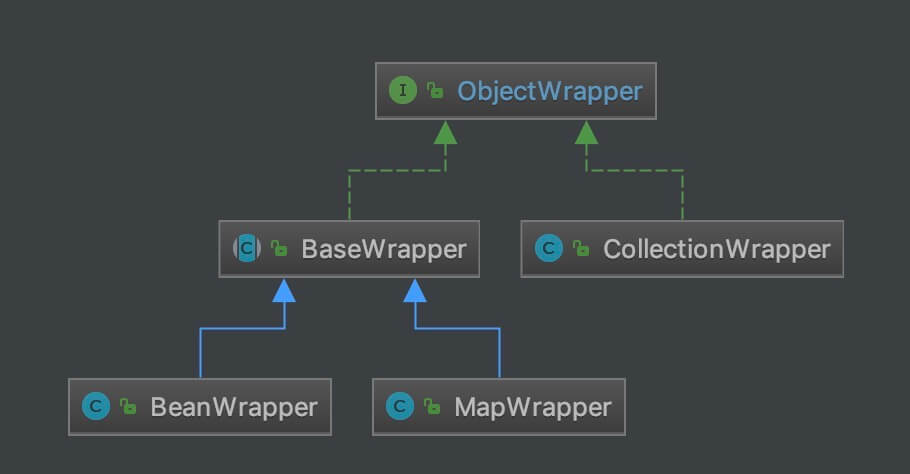

## 1. 概述

本文，我们来分享 MyBatis 的反射模块，对应 `reflection` 包。如下图所示：


* 相比 `parsing` 包来说，`reflection` 包的代码量大概是 2-3 倍。当然，不要慌，都是比较简单的代码。

在 [《精尽 MyBatis 源码解析 —— 项目结构一览》](http://svip.iocoder.cn/MyBatis/intro) 中，简单介绍了这个模块如下：

> Java 中的反射虽然功能强大，但对大多数开发人员来说，写出高质量的反射代码还是 有一定难度的。MyBatis 中专门提供了反射模块，该模块对 Java 原生的反射进行了良好的封装，提了更加**简洁易用的 API**，方便上层使调用，并且对**反射操作进行了一系列优化**，例如缓存了类的元数据，提高了反射操作的性能。

## 2. Reflector

`org.apache.ibatis.reflection.Reflector` ，反射器，每个 Reflector 对应一个类。Reflector 会缓存反射操作需要的类的信息，例如：构造方法、属性名、setting / getting 方法等等。代码如下：

```java
// Reflector.java

public class Reflector {

    /**
     * 对应的类
     */
    private final Class<?> type;
    /**
     * 可读属性数组
     */
    private final String[] readablePropertyNames;
    /**
     * 可写属性集合
     */
    private final String[] writeablePropertyNames;
    /**
     * 属性对应的 setting 方法的映射。
     *
     * key 为属性名称
     * value 为 Invoker 对象
     */
    private final Map<String, Invoker> setMethods = new HashMap<>();
    /**
     * 属性对应的 getting 方法的映射。
     *
     * key 为属性名称
     * value 为 Invoker 对象
     */
    private final Map<String, Invoker> getMethods = new HashMap<>();
    /**
     * 属性对应的 setting 方法的方法参数类型的映射。{@link #setMethods}
     *
     * key 为属性名称
     * value 为方法参数类型
     */
    private final Map<String, Class<?>> setTypes = new HashMap<>();
    /**
     * 属性对应的 getting 方法的返回值类型的映射。{@link #getMethods}
     *
     * key 为属性名称
     * value 为返回值的类型
     */
    private final Map<String, Class<?>> getTypes = new HashMap<>();
    /**
     * 默认构造方法
     */
    private Constructor<?> defaultConstructor;
    /**
     * 不区分大小写的属性集合
     */
    private Map<String, String> caseInsensitivePropertyMap = new HashMap<>();

    public Reflector(Class<?> clazz) {
        // 设置对应的类
        type = clazz;
        // <1> 初始化 defaultConstructor
        addDefaultConstructor(clazz);
        // <2> // 初始化 getMethods 和 getTypes ，通过遍历 getting 方法
        addGetMethods(clazz);
        // <3> // 初始化 setMethods 和 setTypes ，通过遍历 setting 方法。
        addSetMethods(clazz);
        // <4> // 初始化 getMethods + getTypes 和 setMethods + setTypes ，通过遍历 fields 属性。
        addFields(clazz);
        // <5> 初始化 readablePropertyNames、writeablePropertyNames、caseInsensitivePropertyMap 属性
        readablePropertyNames = getMethods.keySet().toArray(new String[getMethods.keySet().size()]);
        writeablePropertyNames = setMethods.keySet().toArray(new String[setMethods.keySet().size()]);
        for (String propName : readablePropertyNames) {
            caseInsensitivePropertyMap.put(propName.toUpperCase(Locale.ENGLISH), propName);
        }
        for (String propName : writeablePropertyNames) {
            caseInsensitivePropertyMap.put(propName.toUpperCase(Locale.ENGLISH), propName);
        }
    }

    // ... 省略一些方法
}
```

* `type` 属性，每个 Reflector 对应的类。
* `defaultConstructor` 属性，默认**无参**构造方法。在 `<1>` 处初始化，详细解析，见 [「2.1 addDefaultConstructor」](http://svip.iocoder.cn/MyBatis/reflection-package/#) 。
* `getMethods`、`getTypes` 属性，分别为属性对应的 **getting 方法**、**getting 方法的返回类型**的映射。在 `<2>` 处初始化，详细解析，见 [「2.2 addGetMethods」](http://svip.iocoder.cn/MyBatis/reflection-package/#) 。
* `setMethods`、`setTypes` 属性，分别为属性对应的 **setting 方法**、**setting 方法的参数类型**的映射。在 `<3>` 处初始化，详细解析，见 [「2.3 addSetMethods」](http://svip.iocoder.cn/MyBatis/reflection-package/#) 。
* `<4>` 处，初始化 `getMethods` + `getTypes` 和 `setMethods` + `setTypes` ，通过遍历 fields 属性。详细解析，见 [「2.4 addFields」](http://svip.iocoder.cn/MyBatis/reflection-package/#) 。
* `<5>` 处，初始化 `readablePropertyNames`、`writeablePropertyNames`、`caseInsensitivePropertyMap` 属性。

### 2.1 addDefaultConstructor

`#addDefaultConstructor(Class<?> clazz)` 方法，查找默认无参构造方法。代码如下：

```java
// Reflector.java

private void addDefaultConstructor(Class<?> clazz) {
    // 获得所有构造方法
    Constructor<?>[] consts = clazz.getDeclaredConstructors();
    // 遍历所有构造方法，查找无参的构造方法
    for (Constructor<?> constructor : consts) {
        // 判断无参的构造方法
        if (constructor.getParameterTypes().length == 0) {
            // 设置构造方法可以访问，避免是 private 等修饰符
            if (canControlMemberAccessible()) {
                try {
                    constructor.setAccessible(true);
                } catch (Exception e) {
                    // Ignored. This is only a final precaution, nothing we can do.
                }
            }
            // 如果构造方法可以访问，赋值给 defaultConstructor
            if (constructor.isAccessible()) {
                this.defaultConstructor = constructor;
            }
        }
    }
}

/**
 * Checks whether can control member accessible.
 *
 * 判断，是否可以修改可访问性
 *
 * @return If can control member accessible, it return {@literal true}
 * @since 3.5.0
 */
public static boolean canControlMemberAccessible() {
    try {
        SecurityManager securityManager = System.getSecurityManager();
        if (null != securityManager) {
            securityManager.checkPermission(new ReflectPermission("suppressAccessChecks"));
        }
    } catch (SecurityException e) {
        return false;
    }
    return true;
}
```

### 2.2 addGetMethods

`#addGetMethods(Class<?> cls)` 方法，初始化 `getMethods` 和 `getTypes` ，通过遍历 getting 方法。代码如下：

```java
// Reflector.java

private void addGetMethods(Class<?> cls) {
    // <1> 属性与其 getting 方法的映射。
    Map<String, List<Method>> conflictingGetters = new HashMap<>();
    // <2> 获得所有方法
    Method[] methods = getClassMethods(cls);
    // <3> 遍历所有方法
    for (Method method : methods) {
        // <3.1> 参数大于 0 ，说明不是 getting 方法，忽略
        if (method.getParameterTypes().length > 0) {
            continue;
        }
        // <3.2> 以 get 和 is 方法名开头，说明是 getting 方法
        String name = method.getName();
        if ((name.startsWith("get") && name.length() > 3)
                || (name.startsWith("is") && name.length() > 2)) {
            // <3.3> 获得属性
            name = PropertyNamer.methodToProperty(name);
            // <3.4> 添加到 conflictingGetters 中
            addMethodConflict(conflictingGetters, name, method);
        }
    }
    // <4> 解决 getting 冲突方法
    resolveGetterConflicts(conflictingGetters);
}
```

* `<1>` 处，`conflictingGetters` 变量，属性与其 getting 方法的映射。因为父类和子类都可能定义了相同属性的 getting 方法，所以 `VALUE` 会是个数组。

* `<2>` 处，调用 `#getClassMethods(Class<?> cls)` 方法，获得所有方法。详细解析，见 [「2.2.1 getClassMethods」](http://svip.iocoder.cn/MyBatis/reflection-package/#) 。

* `<3>` 处，遍历所有方法，挑选符合的 getting 方法，添加到 `conflictingGetters` 中。

  * `<3.1>` 处，方法参数大于 0 ，说明不是 getting 方法，忽略。
  * `<3.2>` 处，方法名以 get 和 is 方法名开头，说明是 getting 方法。
  * `<3.3>` 处，调用 `PropertyNamer#methodToProperty(String name)` 方法，获得属性名。详细解析，见 [「6.3 PropertyNamer」](http://svip.iocoder.cn/MyBatis/reflection-package/#) 。
  * `<3.4>` 处，调用 `#addMethodConflict(Map<String, List<Method>> conflictingMethods, String name, Method method)` 方法，添加到 `conflictingGetters` 中。代码如下：

  ```java
  // Reflector.java
  
  private void addMethodConflict(Map<String, List<Method>> conflictingMethods, String name, Method method) {
      List<Method> list = conflictingMethods.computeIfAbsent(name, k -> new ArrayList<>());
      list.add(method);
  }
  ```

* `<4>` 处，调用 `#resolveGetterConflicts(Map<String, List<Method>>)` 方法，解决 getting 冲突方法。详细解析，见 [「2.2.2 resolveGetterConflicts」](http://svip.iocoder.cn/MyBatis/reflection-package/#) 。

#### 2.2.1 getClassMethods

`#getClassMethods(Class<?> cls)` 方法，获得所有方法。代码如下：

```java
// Reflector.java

private Method[] getClassMethods(Class<?> cls) {
    // 每个方法签名与该方法的映射
    Map<String, Method> uniqueMethods = new HashMap<>();
    // 循环类，类的父类，类的父类的父类，直到父类为 Object
    Class<?> currentClass = cls;
    while (currentClass != null && currentClass != Object.class) {
        // <1> 记录当前类定义的方法
        addUniqueMethods(uniqueMethods, currentClass.getDeclaredMethods());

        // we also need to look for interface methods -
        // because the class may be abstract
        // <2> 记录接口中定义的方法
        Class<?>[] interfaces = currentClass.getInterfaces();
        for (Class<?> anInterface : interfaces) {
            addUniqueMethods(uniqueMethods, anInterface.getMethods());
        }

        // 获得父类
        currentClass = currentClass.getSuperclass();
    }

    // 转换成 Method 数组返回
    Collection<Method> methods = uniqueMethods.values();
    return methods.toArray(new Method[methods.size()]);
}
```


* `<1>` 和 `<2>` 处，会调用 `#addUniqueMethods(Map<String, Method> uniqueMethods, Method[] methods)` 方法，添加方法数组到 `uniqueMethods` 中。代码如下：

```java
// Reflector.java

private void addUniqueMethods(Map<String, Method> uniqueMethods, Method[] methods) {
    for (Method currentMethod : methods) {
        if (!currentMethod.isBridge()) { // 忽略 bridge 方法，参见 https://www.zhihu.com/question/54895701/answer/141623158 文章
            // <3> 获得方法签名
            String signature = getSignature(currentMethod);
            // check to see if the method is already known
            // if it is known, then an extended class must have
            // overridden a method
            // 当 uniqueMethods 不存在时，进行添加
            if (!uniqueMethods.containsKey(signature)) {
                // 设置方法可访问
                if (canControlMemberAccessible()) {
                    try {
                        currentMethod.setAccessible(true);
                    } catch (Exception e) {
                        // Ignored. This is only a final precaution, nothing we can do.
                    }
                }
                // 添加到 uniqueMethods 中
                uniqueMethods.put(signature, currentMethod);
            }
        }
    }
}
```

* `<3>` 处，会调用 `#getSignature(Method method)` 方法，获得方法签名。代码如下：

```java
// Reflector.java

private String getSignature(Method method) {
    StringBuilder sb = new StringBuilder();
    // 返回类型
    Class<?> returnType = method.getReturnType();
    if (returnType != null) {
        sb.append(returnType.getName()).append('#');
    }
    // 方法名
    sb.append(method.getName());
    // 方法参数
    Class<?>[] parameters = method.getParameterTypes();
    for (int i = 0; i < parameters.length; i++) {
        if (i == 0) {
            sb.append(':');
        } else {
            sb.append(',');
        }
        sb.append(parameters[i].getName());
    }
    return sb.toString();
}
```

* 格式：`returnType#方法名:参数名1,参数名2,参数名3` 。
* 例如：`void#checkPackageAccess:java.lang.ClassLoader,boolean` 。

#### 2.2.2 resolveGetterConflicts

`#resolveGetterConflicts(Map<String, List<Method>>)` 方法，解决 getting 冲突方法。最终，一个属性，只保留一个对应的方法。代码如下：

```java
// Reflector.java

private void resolveGetterConflicts(Map<String, List<Method>> conflictingGetters) {
    // 遍历每个属性，查找其最匹配的方法。因为子类可以覆写父类的方法，所以一个属性，可能对应多个 getting 方法
    for (Entry<String, List<Method>> entry : conflictingGetters.entrySet()) {
        Method winner = null; // 最匹配的方法
        String propName = entry.getKey();
        for (Method candidate : entry.getValue()) {
            // winner 为空，说明 candidate 为最匹配的方法
            if (winner == null) {
                winner = candidate;
                continue;
            }
            // <1> 基于返回类型比较
            Class<?> winnerType = winner.getReturnType();
            Class<?> candidateType = candidate.getReturnType();
            // 类型相同
            if (candidateType.equals(winnerType)) {
                // 返回值了诶选哪个相同，应该在 getClassMethods 方法中，已经合并。所以抛出 ReflectionException 异常
                if (!boolean.class.equals(candidateType)) {
                    throw new ReflectionException(
                            "Illegal overloaded getter method with ambiguous type for property "
                                    + propName + " in class " + winner.getDeclaringClass()
                                    + ". This breaks the JavaBeans specification and can cause unpredictable results.");
                // 选择 boolean 类型的 is 方法
                } else if (candidate.getName().startsWith("is")) {
                    winner = candidate;
                }
            // 不符合选择子类
            } else if (candidateType.isAssignableFrom(winnerType)) {
                // OK getter type is descendant
            // <1.1> 符合选择子类。因为子类可以修改放大返回值。例如，父类的一个方法的返回值为 List ，子类对该方法的返回值可以覆写为 ArrayList 。
            } else if (winnerType.isAssignableFrom(candidateType)) {
                winner = candidate;
            // <1.2> 返回类型冲突，抛出 ReflectionException 异常
            } else {
                throw new ReflectionException(
                        "Illegal overloaded getter method with ambiguous type for property "
                                + propName + " in class " + winner.getDeclaringClass()
                                + ". This breaks the JavaBeans specification and can cause unpredictable results.");
            }
        }
        // <2> 添加到 getMethods 和 getTypes 中
        addGetMethod(propName, winner);
    }
}
```

* `<1>` 处，基于返回类型比较。重点在 `<1.1>` 和 `<1.2>` 的情况，因为子类可以修改放大返回值，**所以在出现这个情况时，选择子类的该方法**。例如，父类的一个方法的返回值为 List ，子类对该方法的返回值可以覆写为 ArrayList 。代码如下：

```java
public class A {

    List<String> getXXXX();

}

public class B extends A {

    ArrayList<String> getXXXX(); // 选择它

}
```

* `<2>` 处，调用 `#addGetMethod(String name, Method method)` 方法，添加方法到 `getMethods` 和 `getTypes` 中。代码如下：

```java
// Reflector.java

private void addGetMethod(String name, Method method) {
    // <2.1> 判断是合理的属性名
    if (isValidPropertyName(name)) {
        // <2.2> 添加到 getMethods 中
        getMethods.put(name, new MethodInvoker(method));
        // <2.3> 添加到 getTypes 中
        Type returnType = TypeParameterResolver.resolveReturnType(method, type);
        getTypes.put(name, typeToClass(returnType));
    }
}
```

* `<2.1>` 处，调用 `#isValidPropertyName(String name)` 方法，判断是合理的属性名。代码如下：

```java
// Reflector.java

private boolean isValidPropertyName(String name) {
    return !(name.startsWith("$") || "serialVersionUID".equals(name) || "class".equals(name));
}
```

* `<2.2>` 处，添加到 `getMethods` 中。此处，我们可以看到一个 MethodInvoker 类，详细解析，见 [「4.3 MethodInvoker」](http://svip.iocoder.cn/MyBatis/reflection-package/#) 。

* `<2.3>` 处，添加到 `getTypes` 中。

  * 此处，我们可以看到一个 TypeParameterResolver 类，详细解析，见 [「14. TypeParameterResolver」](http://svip.iocoder.cn/MyBatis/reflection-package/#) 。
  * `#typeToClass(Type src)` 方法，获得 `java.lang.reflect.Type` 对应的类。代码如下：

  ```java
  // Reflector.java
  
  private Class<?> typeToClass(Type src) {
      Class<?> result = null;
      // 普通类型，直接使用类
      if (src instanceof Class) {
          result = (Class<?>) src;
      // 泛型类型，使用泛型
      } else if (src instanceof ParameterizedType) {
          result = (Class<?>) ((ParameterizedType) src).getRawType();
      // 泛型数组，获得具体类
      } else if (src instanceof GenericArrayType) {
          Type componentType = ((GenericArrayType) src).getGenericComponentType();
          if (componentType instanceof Class) { // 普通类型
              result = Array.newInstance((Class<?>) componentType, 0).getClass();
          } else {
              Class<?> componentClass = typeToClass(componentType); // 递归该方法，返回类
              result = Array.newInstance(componentClass, 0).getClass();
          }
      }
      // 都不符合，使用 Object 类
      if (result == null) {
          result = Object.class;
      }
      return result;
  }
  ```

  * 代码比较简单，就是寻找 Type 真正对应的类。

### 2.3 addSetMethods

`#addSetMethods(Class<?> cls)` 方法，初始化 `setMethods` 和 `setTypes` ，通过遍历 setting 方法。代码如下：

```java
// Reflector.java

private void addSetMethods(Class<?> cls) {
    // 属性与其 setting 方法的映射。
    Map<String, List<Method>> conflictingSetters = new HashMap<>();
    // 获得所有方法
    Method[] methods = getClassMethods(cls);
    // 遍历所有方法
    for (Method method : methods) {
        String name = method.getName();
        // <1> 方法名为 set 开头
        // 参数数量为 1
        if (name.startsWith("set") && name.length() > 3) {
            if (method.getParameterTypes().length == 1) {
                // 获得属性
                name = PropertyNamer.methodToProperty(name);
                // 添加到 conflictingSetters 中
                addMethodConflict(conflictingSetters, name, method);
            }
        }
    }
    // <2> 解决 setting 冲突方法
    resolveSetterConflicts(conflictingSetters);
}
```

* 总体逻辑和 `#addGetMethods(Class<?> cls)` 方法差不多。主要差异点在 `<1>` 和 `<2>` 处。因为 `<1>` 一眼就能明白，所以我们只看 `<2>` ，调用 `#resolveSetterConflicts(Map<String, List<Method>> conflictingSetters)` 方法，解决 setting 冲突方法。详细解析，见 [「2.3.1 resolveSetterConflicts」](http://svip.iocoder.cn/MyBatis/reflection-package/#) 中。

#### 2.3.1 resolveSetterConflicts

`#resolveSetterConflicts(Map<String, List<Method>> conflictingSetters)` 方法，解决 setting 冲突方法。代码如下：

```java
// Reflector.java

private void resolveSetterConflicts(Map<String, List<Method>> conflictingSetters) {
    // 遍历每个属性，查找其最匹配的方法。因为子类可以覆写父类的方法，所以一个属性，可能对应多个 setting 方法
    for (String propName : conflictingSetters.keySet()) {
        List<Method> setters = conflictingSetters.get(propName);
        Class<?> getterType = getTypes.get(propName);
        Method match = null;
        ReflectionException exception = null;
        // <1> 遍历属性对应的 setting 方法
        for (Method setter : setters) {
            Class<?> paramType = setter.getParameterTypes()[0];
            // 和 getterType 相同，直接使用
            if (paramType.equals(getterType)) {
                // should be the best match
                match = setter;
                break;
            }
            if (exception == null) {
                try {
                    // 选择一个更加匹配的
                    match = pickBetterSetter(match, setter, propName);
                } catch (ReflectionException e) {
                    // there could still be the 'best match'
                    match = null;
                    exception = e;
                }
            }
        }
        // <2> 添加到 setMethods 和 setTypes 中
        if (match == null) {
            throw exception;
        } else {
            addSetMethod(propName, match);
        }
    }
}
```

* `<1>` 处，解决冲突 setting 方法的方式，实际和 getting 方法的方式是**不太一样**的。首先，多的就是考虑了对应的 `getterType` 为优先级**最高**。其次，`#pickBetterSetter(Method setter1, Method setter2, String property)` 方法，选择一个更加匹配的，和 getting 方法是**相同**的，因为要选择精准的方法。代码如下：

```java
// Reflector.java

private Method pickBetterSetter(Method setter1, Method setter2, String property) {
    if (setter1 == null) {
        return setter2;
    }
    Class<?> paramType1 = setter1.getParameterTypes()[0];
    Class<?> paramType2 = setter2.getParameterTypes()[0];
    if (paramType1.isAssignableFrom(paramType2)) {
        return setter2;
    } else if (paramType2.isAssignableFrom(paramType1)) {
        return setter1;
    }
    throw new ReflectionException("Ambiguous setters defined for property '" + property + "' in class '"
            + setter2.getDeclaringClass() + "' with types '" + paramType1.getName() + "' and '"
            + paramType2.getName() + "'.");
}
```

* `<2>` 处，调用 `#addSetMethod(String name, Method method)` 方法，添加到 `setMethods` 和 `setTypes` 中。代码如下：

```java
// Reflector.java

private void addSetMethod(String name, Method method) {
    if (isValidPropertyName(name)) {
        // 添加到 setMethods 中
        setMethods.put(name, new MethodInvoker(method));
        // 添加到 setTypes 中
        Type[] paramTypes = TypeParameterResolver.resolveParamTypes(method, type);
        setTypes.put(name, typeToClass(paramTypes[0]));
    }
}
```

* 比较简单，和 `#addGetMethod(String name, Method method)` 方法是类似的。

### 2.4 addFields

`#addFields(Class<?> clazz)` 方法，初始化 `getMethods` + `getTypes` 和 `setMethods` + `setTypes` ，通过遍历 fields 属性。实际上，它是 `#addGetMethods(...)` 和 `#addSetMethods(...)` 方法的补充，因为有些 field ，不存在对应的 setting 或 getting 方法，**所以直接使用对应的 field** ，而不是方法。代码如下：

```java
// Reflector.java

private void addFields(Class<?> clazz) {
    // 获得所有 field 们
    Field[] fields = clazz.getDeclaredFields();
    for (Field field : fields) {
        // 设置 field 可访问
        if (canControlMemberAccessible()) {
            try {
                field.setAccessible(true);
            } catch (Exception e) {
                // Ignored. This is only a final precaution, nothing we can do.
            }
        }
        if (field.isAccessible()) {
            // <1> 添加到 setMethods 和 setTypes 中
            if (!setMethods.containsKey(field.getName())) {
                // issue #379 - removed the check for final because JDK 1.5 allows
                // modification of final fields through reflection (JSR-133). (JGB)
                // pr #16 - final static can only be set by the classloader
                int modifiers = field.getModifiers();
                if (!(Modifier.isFinal(modifiers) && Modifier.isStatic(modifiers))) {
                    addSetField(field);
                }
            }
            // 添加到 getMethods 和 getTypes 中
            if (!getMethods.containsKey(field.getName())) {
                addGetField(field);
            }
        }
    }
    // 递归，处理父类
    if (clazz.getSuperclass() != null) {
        addFields(clazz.getSuperclass());
    }
}
```

* `<1>` 处，若 `setMethods` 不存在，则调用 `#addSetField(Field field)` 方法，添加到 `setMethods` 和 `setTypes` 中。代码如下：

```java
// Reflector.java

private void addSetField(Field field) {
    // 判断是合理的属性
    if (isValidPropertyName(field.getName())) {
        // 添加到 setMethods 中
        setMethods.put(field.getName(), new SetFieldInvoker(field));
        // 添加到 setTypes 中
        Type fieldType = TypeParameterResolver.resolveFieldType(field, type);
        setTypes.put(field.getName(), typeToClass(fieldType));
    }
}
```

* 注意，此处创建的是 SetFieldInvoker 对象。详细解析，见 [「4.2 SetFieldInvoker」](http://svip.iocoder.cn/MyBatis/reflection-package/#) 。

* `<2>` 处，若 `getMethods` 不存在，则调用 `#addGetField(Field field)` 方法，添加到 `getMethods` 和 `getTypes` 中。代码如下：

```java
// Reflector.java

private void addGetField(Field field) {
    // 判断是合理的属性
    if (isValidPropertyName(field.getName())) {
        // 添加到 getMethods 中
        getMethods.put(field.getName(), new GetFieldInvoker(field));
        // 添加到 getMethods 中
        Type fieldType = TypeParameterResolver.resolveFieldType(field, type);
        getTypes.put(field.getName(), typeToClass(fieldType));
    }
}
```

* 注意，此处创建的是 GetFieldInvoker 对象。详细解析，，见 [「4.1 GetFieldInvoker」](http://svip.iocoder.cn/MyBatis/reflection-package/#) 。

### 2.5 其它方法

Reflector 中，还有其它方法，用于对它的属性进行访问。比较简单，感兴趣的胖友，自己来瞅瞅。例如：

```java
// Reflector.java

public Invoker getSetInvoker(String propertyName) {
    Invoker method = setMethods.get(propertyName);
    if (method == null) {
        throw new ReflectionException("There is no setter for property named '" + propertyName + "' in '" + type + "'");
    }
    return method;
}
```

## 3. ReflectorFactory

`org.apache.ibatis.reflection.ReflectorFactory` ，Reflector 工厂接口，用于创建和缓存 Reflector 对象。代码如下：

```java
// ReflectorFactory.java

public interface ReflectorFactory {

    /**
     * @return 是否缓存 Reflector 对象
     */
    boolean isClassCacheEnabled();

    /**
     * 设置是否缓存 Reflector 对象
     *
     * @param classCacheEnabled 是否缓存
     */
    void setClassCacheEnabled(boolean classCacheEnabled);

    /**
     * 获取 Reflector 对象
     *
     * @param type 指定类
     * @return Reflector 对象
     */
    Reflector findForClass(Class<?> type);

}
```

### 3.1 DefaultReflectorFactory

`org.apache.ibatis.reflection.DefaultReflectorFactory` ，实现 ReflectorFactory 接口，默认的 ReflectorFactory 实现类。代码如下：

```java
// DefaultReflectorFactory.java

public class DefaultReflectorFactory implements ReflectorFactory {

    /**
     * 是否缓存
     */
    private boolean classCacheEnabled = true;
    /**
     * Reflector 的缓存映射
     *
     * KEY：类
     * VALUE：Reflector 对象
     */
    private final ConcurrentMap<Class<?>, Reflector> reflectorMap = new ConcurrentHashMap<>();

    public DefaultReflectorFactory() {
    }

    @Override
    public boolean isClassCacheEnabled() {
        return classCacheEnabled;
    }

    @Override
    public void setClassCacheEnabled(boolean classCacheEnabled) {
        this.classCacheEnabled = classCacheEnabled;
    }

    @Override
    public Reflector findForClass(Class<?> type) {
        // 开启缓存，则从 reflectorMap 中获取
        if (classCacheEnabled) {
            // synchronized (type) removed see issue #461
            return reflectorMap.computeIfAbsent(type, Reflector::new); // 不存在，则进行创建
        // 关闭缓存，则创建 Reflector 对象
        } else {
            return new Reflector(type);
        }
    }

}
```

## 4. Invoker

`org.apache.ibatis.reflection.invoker.Invoker` ，调用者接口。代码如下：

```java
// Invoker.java

public interface Invoker {

    /**
     * 执行调用
     *
     * @param target 目标
     * @param args 参数
     * @return 结果
     * @throws IllegalAccessException
     * @throws InvocationTargetException
     */
    Object invoke(Object target, Object[] args) throws IllegalAccessException, InvocationTargetException;

    /**
     * @return 类
     */
    Class<?> getType();

}
```

* 核心是 `#invoke(Object target, Object[] args)` 方法，执行一次调用。而具体调用什么方法，由子类来实现。

### 4.1 GetFieldInvoker

`org.apache.ibatis.reflection.invoker.GetFieldInvoker` ，实现 Invoker 接口，获得 Field 调用者。代码如下：

```java
// GetFieldInvoker.java

public class GetFieldInvoker implements Invoker {

    /**
     * Field 对象
     */
    private final Field field;

    public GetFieldInvoker(Field field) {
        this.field = field;
    }

    // 获得属性
    @Override
    public Object invoke(Object target, Object[] args) throws IllegalAccessException, InvocationTargetException {
        return field.get(target);
    }

    // 返回属性类型
    @Override
    public Class<?> getType() {
        return field.getType();
    }

}
```

### 4.2 SetFieldInvoker

`org.apache.ibatis.reflection.invoker.SetFieldInvoker` ，实现 Invoker 接口，设置 Field 调用者。代码如下：

```java
// SetFieldInvoker.java

public class SetFieldInvoker implements Invoker {

    /**
     * Field 对象
     */
    private final Field field;

    public SetFieldInvoker(Field field) {
        this.field = field;
    }

    // 设置 Field 属性
    @Override
    public Object invoke(Object target, Object[] args) throws IllegalAccessException, InvocationTargetException {
        field.set(target, args[0]);
        return null;
    }

    // 返回属性类型
    @Override
    public Class<?> getType() {
        return field.getType();
    }

}
```

### 4.3 MethodInvoker

`org.apache.ibatis.reflection.invoker.MethodInvoker` ，实现 Invoker 接口，指定方法的调用器。代码如下：

```java
// MethodInvoker.java

public class MethodInvoker implements Invoker {

    /**
     * 类型
     */
    private final Class<?> type;
    /**
     * 指定方法
     */
    private final Method method;

    public MethodInvoker(Method method) {
        this.method = method;

        // 参数大小为 1 时，一般是 setting 方法，设置 type 为方法参数[0]
        if (method.getParameterTypes().length == 1) {
            type = method.getParameterTypes()[0];
        // 否则，一般是 getting 方法，设置 type 为返回类型
        } else {
            type = method.getReturnType();
        }
    }

    // 执行指定方法
    @Override
    public Object invoke(Object target, Object[] args) throws IllegalAccessException, InvocationTargetException {
        return method.invoke(target, args);
    }

    @Override
    public Class<?> getType() {
        return type;
    }

}
```

## 5. ObjectFactory

`org.apache.ibatis.reflection.factory.ObjectFactory` ，Object 工厂接口，用于创建指定类的对象。代码如下：

```java
// ObjectFactory.java

public interface ObjectFactory {

  /**
   * 设置 Properties
   *
   * Sets configuration properties.
   * @param properties configuration properties
   */
  void setProperties(Properties properties);

  /**
   * 创建指定类的对象，使用默认构造方法
   *
   * Creates a new object with default constructor.
   * @param type Object type
   * @return 对象
   */
  <T> T create(Class<T> type);

  /**
   * Creates a new object with the specified constructor and params.
   *
   * 创建指定类的对象，使用特定的构造方法
   *
   * @param type Object type
   * @param constructorArgTypes Constructor argument types 指定构造方法的参数列表
   * @param constructorArgs Constructor argument values 参数数组
   * @return 对象
   */
  <T> T create(Class<T> type, List<Class<?>> constructorArgTypes, List<Object> constructorArgs);

  /**
   * Returns true if this object can have a set of other objects.
   * It's main purpose is to support non-java.util.Collection objects like Scala collections.
   *
   * 判断指定类是否为集合类
   *
   * @param type Object type
   * @return whether it is a collection or not
   * @since 3.1.0
   */
  <T> boolean isCollection(Class<T> type);

}
```

比较简单，一共有三类方法。

### 5.1 DefaultObjectFactory

`org.apache.ibatis.reflection.factory.DefaultObjectFactory` ，实现 ObjectFactory、Serializable 接口，默认 ObjectFactory 实现类。

#### 5.1.1 create

`#create(Class<T> type, ...)` 方法，创建指定类的对象。代码如下：

```java
// DefaultObjectFactory.java

@Override
public <T> T create(Class<T> type) {
    return create(type, null, null);
}

@SuppressWarnings("unchecked")
@Override
public <T> T create(Class<T> type, List<Class<?>> constructorArgTypes, List<Object> constructorArgs) {
    // <1> 获得需要创建的类
    Class<?> classToCreate = resolveInterface(type);
    // we know types are assignable
    // <2> 创建指定类的对象
    return (T) instantiateClass(classToCreate, constructorArgTypes, constructorArgs);
}
```

`<1>` 处，调用 `#resolveInterface(Class<?> type)` 方法，获得需要创建的类。代码如下：

```java
// DefaultObjectFactory.java

protected Class<?> resolveInterface(Class<?> type) {
    Class<?> classToCreate;
    if (type == List.class || type == Collection.class || type == Iterable.class) {
        classToCreate = ArrayList.class;
    } else if (type == Map.class) {
        classToCreate = HashMap.class;
    } else if (type == SortedSet.class) { // issue #510 Collections Support
        classToCreate = TreeSet.class;
    } else if (type == Set.class) {
        classToCreate = HashSet.class;
    } else {
        classToCreate = type;
    }
    return classToCreate;
}
```

对于我们常用的**集合接口**，返回对应的实现类。

`<1>` 处，调用 `#instantiateClass(Class<T> type, List<Class<?>> constructorArgTypes, List<Object> constructorArgs)` 方法，创建指定类的对象。代码如下：

```java
// DefaultObjectFactory.java

private <T> T instantiateClass(Class<T> type, List<Class<?>> constructorArgTypes, List<Object> constructorArgs) {
    try {
        Constructor<T> constructor;
        // <x1> 通过无参构造方法，创建指定类的对象
        if (constructorArgTypes == null || constructorArgs == null) {
            constructor = type.getDeclaredConstructor();
            if (!constructor.isAccessible()) {
                constructor.setAccessible(true);
            }
            return constructor.newInstance();
        }
        // <x2> 使用特定构造方法，创建指定类的对象
        constructor = type.getDeclaredConstructor(constructorArgTypes.toArray(new Class[constructorArgTypes.size()]));
        if (!constructor.isAccessible()) {
            constructor.setAccessible(true);
        }
        return constructor.newInstance(constructorArgs.toArray(new Object[constructorArgs.size()]));
    } catch (Exception e) {
        // 拼接 argTypes
        StringBuilder argTypes = new StringBuilder();
        if (constructorArgTypes != null && !constructorArgTypes.isEmpty()) {
            for (Class<?> argType : constructorArgTypes) {
                argTypes.append(argType.getSimpleName());
                argTypes.append(",");
            }
            argTypes.deleteCharAt(argTypes.length() - 1); // remove trailing ,
        }
        // 拼接 argValues
        StringBuilder argValues = new StringBuilder();
        if (constructorArgs != null && !constructorArgs.isEmpty()) {
            for (Object argValue : constructorArgs) {
                argValues.append(String.valueOf(argValue));
                argValues.append(",");
            }
            argValues.deleteCharAt(argValues.length() - 1); // remove trailing ,
        }
        // 抛出 ReflectionException 异常
        throw new ReflectionException("Error instantiating " + type + " with invalid types (" + argTypes + ") or values (" + argValues + "). Cause: " + e, e);
    }
}
```

代码比较简单，分成 `<x1>`、`<x2>` 两种情况。

#### 5.1.2 isCollection

`#isCollection(Class<T> type)` 方法，判断指定类是否为集合类。代码如下：

```java
// DefaultObjectFactory.java

@Override
public <T> boolean isCollection(Class<T> type) {
    return Collection.class.isAssignableFrom(type);
}
```

判断是否为 `java.util.Collection` 的子类。

#### 5.1.3 setProperties

`#setProperties(Properties properties)` 方法，设置 Properties 。代码如下：

```java
// DefaultObjectFactory.java

@Override
public void setProperties(Properties properties) {
    // no props for default
}
```

目前是个空实现。所以，暂时可以忽略这个方法。

## 6. Property 工具类

`org.apache.ibatis.reflection.property` 包下，提供了 PropertyCopier、PropertyNamer、PropertyTokenizer 三个属性相关的工具类。接下来，我们逐小节来解析。

### 6.1 PropertyCopier

`org.apache.ibatis.reflection.property.PropertyCopier` ，属性复制器。代码如下：

```java
// PropertyNamer.java

public final class PropertyCopier {

    private PropertyCopier() {
        // Prevent Instantiation of Static Class
    }

    /**
     * 将 sourceBean 的属性，复制到 destinationBean 中
     *
     * @param type 指定类
     * @param sourceBean 来源 Bean 对象
     * @param destinationBean 目标 Bean 对象
     */
    public static void copyBeanProperties(Class<?> type, Object sourceBean, Object destinationBean) {
        // 循环，从当前类开始，不断复制到父类，直到父类不存在
        Class<?> parent = type;
        while (parent != null) {
            // 获得当前 parent 类定义的属性
            final Field[] fields = parent.getDeclaredFields();
            for (Field field : fields) {
                try {
                    // 设置属性可访问
                    field.setAccessible(true);
                    // 从 sourceBean 中，复制到 destinationBean 去
                    field.set(destinationBean, field.get(sourceBean));
                } catch (Exception e) {
                    // Nothing useful to do, will only fail on final fields, which will be ignored.
                }
            }
            // 获得父类
            parent = parent.getSuperclass();
        }
    }

}
```

### 6.2 PropertyNamer

`org.apache.ibatis.reflection.property.PropertyNamer` ，属性名相关的工具类方法。代码如下：

```java
public final class PropertyNamer {

    private PropertyNamer() {
        // Prevent Instantiation of Static Class
    }

    /**
     * 根据方法名，获得对应的属性名
     *
     * @param name 方法名
     * @return 属性名
     */
    public static String methodToProperty(String name) {
        // is 方法
        if (name.startsWith("is")) {
            name = name.substring(2);
        // get 或者 set 方法
        } else if (name.startsWith("get") || name.startsWith("set")) {
            name = name.substring(3);
        // 抛出 ReflectionException 异常，因为只能处理 is、set、get 方法
        } else {
            throw new ReflectionException("Error parsing property name '" + name + "'.  Didn't start with 'is', 'get' or 'set'.");
        }

        // 首字母小写
        if (name.length() == 1 || (name.length() > 1 && !Character.isUpperCase(name.charAt(1)))) {
            name = name.substring(0, 1).toLowerCase(Locale.ENGLISH) + name.substring(1);
        }

        return name;
    }

    /**
     * 判断是否为 is、get、set 方法
     *
     * @param name 方法名
     * @return 是否
     */
    public static boolean isProperty(String name) {
        return name.startsWith("get") || name.startsWith("set") || name.startsWith("is");
    }

    /**
     * 判断是否为 get、is 方法
     *
     * @param name 方法名
     * @return 是否
     */
    public static boolean isGetter(String name) {
        return name.startsWith("get") || name.startsWith("is");
    }

    /**
     * 判断是否为 set 方法
     *
     * @param name 方法名
     * @return 是否
     */
    public static boolean isSetter(String name) {
        return name.startsWith("set");
    }

}
```

### 6.3 PropertyTokenizer

`org.apache.ibatis.reflection.property.PropertyTokenizer` ，实现 Iterator 接口，属性分词器，支持迭代器的访问方式。

举个例子，在访问 `"order[0].item[0].name"` 时，我们希望拆分成 `"order[0]"`、`"item[0]"`、`"name"` 三段，那么就可以通过 PropertyTokenizer 来实现。

#### 6.3.1 构造方法

```java
// PropertyTokenizer.java

/**
 * 当前字符串
 */
private String name;
/**
 * 索引的 {@link #name} ，因为 {@link #name} 如果存在 {@link #index} 会被更改
 */
private final String indexedName;
/**
 * 编号。
 *
 * 对于数组 name[0] ，则 index = 0
 * 对于 Map map[key] ，则 index = key
 */
private String index;
/**
 * 剩余字符串
 */
private final String children;

public PropertyTokenizer(String fullname) {
    // <1> 初始化 name、children 字符串，使用 . 作为分隔
    int delim = fullname.indexOf('.');
    if (delim > -1) {
        name = fullname.substring(0, delim);
        children = fullname.substring(delim + 1);
    } else {
        name = fullname;
        children = null;
    }
    // <2> 记录当前 name
    indexedName = name;
    // 若存在 [ ，则获得 index ，并修改 name 。
    delim = name.indexOf('[');
    if (delim > -1) {
        index = name.substring(delim + 1, name.length() - 1);
        name = name.substring(0, delim);
    }
}
```

* `name` 属性，当前字符串。
* `children` 属性，剩余字符串。
* `<1>` 处，初始化 `name`、`children` 字符串，使用 `'.'` 作为分隔。
* `indexedName` 属性，索引的 `name` 属性，因为 `name` 如果存在 `index` 会被更改。
* `<2>` 处，记录当前 `name` 。
* `index` 属性，编号。分成两种情况：
  * `name` 为数组 `item[0]` 时，则 `index` 为 `"0"` 。
  * `name` 为 Map `map[key]` 时，则 `index` 为 `"key"` 。
* `<3>` 处，初始化 `index` ，并修改 `name` 字符串，使用 `'['` 作为分隔符。

#### 6.3.2 next

`#next()` 方法，迭代获得下一个 PropertyTokenizer 对象。代码如下：

```java
// PropertyTokenizer.java

@Override
public PropertyTokenizer next() {
    return new PropertyTokenizer(children);
}
```

酱紫，它又会执行[「6.3.1 构造方法」](http://svip.iocoder.cn/MyBatis/reflection-package/#) 的流程。

#### 6.3.3 hasNext

`#hasNext()` 方法，判断是否有下一个元素。代码如下：

```java
// PropertyTokenizer.java

public String getChildren() {
    return children;
}
```

#### 6.3.4 其它方法

PropertyTokenizer 中，还有其它方法，比较简单，感兴趣的胖友，自己来瞅瞅。

## 7. MetaClass

`org.apache.ibatis.reflection.MetaClass` ，类的元数据，基于 Reflector 和 PropertyTokenizer ，提供对指定类的各种骚操作。

### 7.1 构造方法

```java
// MetaClass.java

private final ReflectorFactory reflectorFactory;
private final Reflector reflector;

private MetaClass(Class<?> type, ReflectorFactory reflectorFactory) {
    this.reflectorFactory = reflectorFactory;
    this.reflector = reflectorFactory.findForClass(type);
}
```

通过构造方法，我们可以看出，一个 MetaClass 对象，对应一个 Class 对象。

目前有两个方法会涉及到调用该构造方法:

① `#forClass(Class<?> type, ReflectorFactory reflectorFactory)` **静态**方法，创建指定类的 MetaClass 对象。代码如下：

```java
// MetaClass.java

public static MetaClass forClass(Class<?> type, ReflectorFactory reflectorFactory) {
    return new MetaClass(type, reflectorFactory);
}
```

② `#metaClassForProperty(String name)` 方法，创建类的指定属性的类的 MetaClass 对象。代码如下：

```java
// MetaClass.java

public MetaClass metaClassForProperty(String name) {
    // 获得属性的类
    Class<?> propType = reflector.getGetterType(name);
    // 创建 MetaClass 对象
    return MetaClass.forClass(propType, reflectorFactory);
}
```

### 7.2 findProperty

`#findProperty(String name, boolean useCamelCaseMapping)` 方法，根据表达式，获得属性。代码如下：

```java
// MetaClass.java

public String findProperty(String name, boolean useCamelCaseMapping) {
    // <1> 下划线转驼峰
    if (useCamelCaseMapping) {
        name = name.replace("_", "");
    }
    // <2> 获得属性
    return findProperty(name);
}
```

* `useCamelCaseMapping` 属性，是否要[下划线转驼峰](https://www.cnblogs.com/flying607/p/8473075.html) 。但是，在 `<1>` 处，我们仅仅看到 `_` 被替换成了空串。这是为什么呢？继续往下看。
* `<2>` 处，调用 `#findProperty(String name)` 方法，根据表达式，获得属性。代码如下：

```java
// MetaClass.java

public String findProperty(String name) {
    // <3> 构建属性
    StringBuilder prop = buildProperty(name, new StringBuilder());
    return prop.length() > 0 ? prop.toString() : null;
}
```

* `<3>` 处，调用 `#buildProperty(String name, StringBuilder builder)` 方法，构建属性。代码如下：

```java
// MetaClass.java

private StringBuilder buildProperty(String name, StringBuilder builder) {
    // 创建 PropertyTokenizer 对象，对 name 进行分词
    PropertyTokenizer prop = new PropertyTokenizer(name);
    // 有子表达式
    if (prop.hasNext()) {
        // <4> 获得属性名，并添加到 builder 中
        String propertyName = reflector.findPropertyName(prop.getName());
        if (propertyName != null) {
            // 拼接属性到 builder 中
            builder.append(propertyName);
            builder.append(".");
            // 创建 MetaClass 对象
            MetaClass metaProp = metaClassForProperty(propertyName);
            // 递归解析子表达式 children ，并将结果添加到 builder 中
            metaProp.buildProperty(prop.getChildren(), builder);
        }
    // 无子表达式
    } else {
        // <4> 获得属性名，并添加到 builder 中
        String propertyName = reflector.findPropertyName(name);
        if (propertyName != null) {
            builder.append(propertyName);
        }
    }
    return builder;
}
```

创建 PropertyTokenizer 对象，对 `name` 进行**分词**。当有子表达式，继续递归调用 `#buildProperty(String name, StringBuilder builder)` 方法，并将结果添加到 `builder` 中；否则，结束，直接添加到 `builder` 中。

在两个 `<4>` 处，解决“下划线转驼峰”的关键是，通过 `Reflector.caseInsensitivePropertyMap` 属性，忽略大小写。代码如下：

```java
// Reflector.java

/**
 * 不区分大小写的属性集合
 */
private Map<String, String> caseInsensitivePropertyMap = new HashMap<>();

public String findPropertyName(String name) {
    return caseInsensitivePropertyMap.get(name.toUpperCase(Locale.ENGLISH));
}
```

如果胖友，你有点懵逼，可以运行下 `MetaClassTest#shouldFindPropertyName()` 这个单元测试方法。

### 7.3 hasGetter

`#hasGetter(String name)` 方法，判断指定属性是否有 getting 方法。代码如下：

```java
// MetaClass.java

public boolean hasGetter(String name) {
    // 创建 PropertyTokenizer 对象，对 name 进行分词
    PropertyTokenizer prop = new PropertyTokenizer(name);
    // 有子表达式
    if (prop.hasNext()) {
        // 判断是否有该属性的 getting 方法
        if (reflector.hasGetter(prop.getName())) {
            // <1> 创建 MetaClass 对象
            MetaClass metaProp = metaClassForProperty(prop);
            // 递归判断子表达式 children ，是否有 getting 方法
            return metaProp.hasGetter(prop.getChildren());
        } else {
            return false;
        }
    // 无子表达式
    } else {
        // 判断是否有该属性的 getting 方法
        return reflector.hasGetter(prop.getName());
    }
}
```

思路和 `#findProperty((String name, ...)` 方法是一样的，所以胖友自己看下。

`<1>` 处，调用 `#metaClassForProperty(PropertyTokenizer prop)` 方法，创建 创建 MetaClass 对象。代码如下：

```java
// MetaClass.java

private MetaClass metaClassForProperty(PropertyTokenizer prop) {
    // 【调用】获得 getting 方法返回的类型
    Class<?> propType = getGetterType(prop);
    // 创建 MetaClass 对象
    return MetaClass.forClass(propType, reflectorFactory);
}

private Class<?> getGetterType(PropertyTokenizer prop) {
    // 获得返回类型
    Class<?> type = reflector.getGetterType(prop.getName());
    // 如果获取数组的某个位置的元素，则获取其泛型。例如说：list[0].field ，那么就会解析 list 是什么类型，这样才好通过该类型，继续获得 field
    if (prop.getIndex() != null && Collection.class.isAssignableFrom(type)) {
        // 【调用】获得返回的类型
        Type returnType = getGenericGetterType(prop.getName());
        // 如果是泛型，进行解析真正的类型
        if (returnType instanceof ParameterizedType) {
            Type[] actualTypeArguments = ((ParameterizedType) returnType).getActualTypeArguments();
            if (actualTypeArguments != null && actualTypeArguments.length == 1) { // 为什么这里判断大小为 1 呢，因为 Collection 是 Collection<T> ，至多一个。
                returnType = actualTypeArguments[0];
                if (returnType instanceof Class) {
                    type = (Class<?>) returnType;
                } else if (returnType instanceof ParameterizedType) {
                    type = (Class<?>) ((ParameterizedType) returnType).getRawType();
                }
            }
        }
    }
    return type;
}

private Type getGenericGetterType(String propertyName) {
    try {
        // 获得 Invoker 对象
        Invoker invoker = reflector.getGetInvoker(propertyName);
        // 如果 MethodInvoker 对象，则说明是 getting 方法，解析方法返回类型
        if (invoker instanceof MethodInvoker) {
            Field _method = MethodInvoker.class.getDeclaredField("method");
            _method.setAccessible(true);
            Method method = (Method) _method.get(invoker);
            return TypeParameterResolver.resolveReturnType(method, reflector.getType());
        // 如果 GetFieldInvoker 对象，则说明是 field ，直接访问
        } else if (invoker instanceof GetFieldInvoker) {
            Field _field = GetFieldInvoker.class.getDeclaredField("field");
            _field.setAccessible(true);
            Field field = (Field) _field.get(invoker);
            return TypeParameterResolver.resolveFieldType(field, reflector.getType());
        }
    } catch (NoSuchFieldException | IllegalAccessException ignored) {
    }
    return null;
}
```

代码比较长，胖友跟着代码注释，运行下。另外，每个上面的方法， 会调用下面的方法，也就说 `metaClassForProperty => getGetterType => getGenericGetterType` 。

另外，`#hasSetter(String name)` 方法，判断指定属性是否有 setting 方法。逻辑上，和 `#hasGetter(String name)` 方法类似，胖友可以自己瞅瞅。

### 7.4 getGetterType

`#getGetterType(String name)` 方法，获得指定属性的 getting 方法的返回值的类型。代码如下：

```java
// MetaClass.java

public Class<?> getGetterType(String name) {
    // 创建 PropertyTokenizer 对象，对 name 进行分词
    PropertyTokenizer prop = new PropertyTokenizer(name);
    // 有子表达式
    if (prop.hasNext()) {
        // 创建 MetaClass 对象
        MetaClass metaProp = metaClassForProperty(prop);
        // 递归判断子表达式 children ，获得返回值的类型
        return metaProp.getGetterType(prop.getChildren());
    }
    // issue #506. Resolve the type inside a Collection Object
    // 直接获得返回值的类型
    return getGetterType(prop);
}
```

和 `#hasGetter(String name)` 方法类似，胖友可以自己瞅瞅。

另外，`#getSetterType(String name)` 方法，判断指定属性是否有 setting 方法。逻辑上，和 `#getGetterType(String name)` 方法类似，胖友可以自己瞅瞅。

### 7.5 其它方法

MetaClass 还有其它方法，比较简单，是基于 Reflector 方法的封装，感兴趣的胖友，可以自己看看。

## 8. ObjectWrapper

`org.apache.ibatis.reflection.wrapper.ObjectWrapper` ，对象包装器接口，基于 MetaClass 工具类，定义对指定对象的各种操作。或者可以说，ObjectWrapper 是 MetaClass 的指定类的具象化。代码如下：

```java
// ObjectWrapper.java

public interface ObjectWrapper {

    /**
     * 获得值
     *
     * @param prop PropertyTokenizer 对象，相当于键
     * @return 值
     */
    Object get(PropertyTokenizer prop);
    /**
     * 设置值
     *
     * @param prop PropertyTokenizer 对象，相当于键
     * @param value 值
     */
    void set(PropertyTokenizer prop, Object value);

    /**
     * {@link MetaClass#findProperty(String, boolean)}
     */
    String findProperty(String name, boolean useCamelCaseMapping);
    /**
     * {@link MetaClass#getGetterNames()}
     */
    String[] getGetterNames();
    /**
     * {@link MetaClass#getSetterNames()}
     */
    String[] getSetterNames();
    /**
     * {@link MetaClass#getSetterType(String)}
     */
    Class<?> getSetterType(String name);
    /**
     * {@link MetaClass#getGetterType(String)}
     */
    Class<?> getGetterType(String name);
    /**
     * {@link MetaClass#hasSetter(String)}
     */
    boolean hasSetter(String name);
    /**
     * {@link MetaClass#hasGetter(String)}
     */
    boolean hasGetter(String name);

    /**
     * {@link MetaObject#forObject(Object, ObjectFactory, ObjectWrapperFactory, ReflectorFactory)}
     */
    MetaObject instantiatePropertyValue(String name, PropertyTokenizer prop, ObjectFactory objectFactory);

    /**
     * 是否为集合
     */
    boolean isCollection();
    /**
     * 添加元素到集合
     */
    void add(Object element);

    /**
     * 添加多个元素到集合
     */
    <E> void addAll(List<E> element);

}
```

从接口中，我们可以看到，主要是对 MetaObject 方法的调用。

ObjectWrapper 的子类实现如下图：



### 8.1 BaseWrapper

`org.apache.ibatis.reflection.wrapper.BaseWrapper` ，实现 ObjectWrapper 接口，ObjectWrapper 抽象类，为子类 BeanWrapper 和 MapWrapper 提供属性值的获取和设置的公用方法。代码如下：

```java
// BaseWrapper.java

public abstract class BaseWrapper implements ObjectWrapper {

    protected static final Object[] NO_ARGUMENTS = new Object[0];

    /**
     * MetaObject 对象
     */
    protected final MetaObject metaObject;

    protected BaseWrapper(MetaObject metaObject) {
        this.metaObject = metaObject;
    }

    /**
     * 获得指定属性的值
     *
     * @param prop PropertyTokenizer 对象
     * @param object 指定 Object 对象
     * @return 值
     */
    protected Object resolveCollection(PropertyTokenizer prop, Object object) {
        if ("".equals(prop.getName())) {
            return object;
        } else {
            return metaObject.getValue(prop.getName());
        }
    }

    /**
     * 获得集合中指定位置的值
     *
     * @param prop PropertyTokenizer 对象
     * @param collection 集合
     * @return 值
     */
    protected Object getCollectionValue(PropertyTokenizer prop, Object collection) {
        if (collection instanceof Map) {
            return ((Map) collection).get(prop.getIndex());
        } else {
            int i = Integer.parseInt(prop.getIndex());
            if (collection instanceof List) {
                return ((List) collection).get(i);
            } else if (collection instanceof Object[]) {
                return ((Object[]) collection)[i];
            } else if (collection instanceof char[]) {
                return ((char[]) collection)[i];
            } else if (collection instanceof boolean[]) {
                return ((boolean[]) collection)[i];
            } else if (collection instanceof byte[]) {
                return ((byte[]) collection)[i];
            } else if (collection instanceof double[]) {
                return ((double[]) collection)[i];
            } else if (collection instanceof float[]) {
                return ((float[]) collection)[i];
            } else if (collection instanceof int[]) {
                return ((int[]) collection)[i];
            } else if (collection instanceof long[]) {
                return ((long[]) collection)[i];
            } else if (collection instanceof short[]) {
                return ((short[]) collection)[i];
            } else {
                throw new ReflectionException("The '" + prop.getName() + "' property of " + collection + " is not a List or Array.");
            }
        }
    }

    /**
     * 设置集合中指定位置的值
     *
     * @param prop PropertyTokenizer 对象
     * @param collection 集合
     * @param value 值
     */
    protected void setCollectionValue(PropertyTokenizer prop, Object collection, Object value) {
        if (collection instanceof Map) {
            ((Map) collection).put(prop.getIndex(), value);
        } else {
            int i = Integer.parseInt(prop.getIndex());
            if (collection instanceof List) {
                ((List) collection).set(i, value);
            } else if (collection instanceof Object[]) {
                ((Object[]) collection)[i] = value;
            } else if (collection instanceof char[]) {
                ((char[]) collection)[i] = (Character) value;
            } else if (collection instanceof boolean[]) {
                ((boolean[]) collection)[i] = (Boolean) value;
            } else if (collection instanceof byte[]) {
                ((byte[]) collection)[i] = (Byte) value;
            } else if (collection instanceof double[]) {
                ((double[]) collection)[i] = (Double) value;
            } else if (collection instanceof float[]) {
                ((float[]) collection)[i] = (Float) value;
            } else if (collection instanceof int[]) {
                ((int[]) collection)[i] = (Integer) value;
            } else if (collection instanceof long[]) {
                ((long[]) collection)[i] = (Long) value;
            } else if (collection instanceof short[]) {
                ((short[]) collection)[i] = (Short) value;
            } else {
                throw new ReflectionException("The '" + prop.getName() + "' property of " + collection + " is not a List or Array.");
            }
        }
    }

}
```

代码比较简单，胖友看下注释。关于 MetaObject 类，会在 [「10. MetaObject」](http://svip.iocoder.cn/MyBatis/reflection-package/#) 中，详细解析。

### 8.1.1 BeanWrapper

`org.apache.ibatis.reflection.wrapper.BeanWrapper` ，继承 BaseWrapper 抽象类，**普通对象**的 ObjectWrapper 实现类，例如 User、Order 这样的 POJO 类。属性如下：

```java
// BeanWrapper.java

/**
 * 普通对象
 */
private final Object object;
private final MetaClass metaClass;

public BeanWrapper(MetaObject metaObject, Object object) {
    super(metaObject);
    this.object = object;
    // 创建 MetaClass 对象
    this.metaClass = MetaClass.forClass(object.getClass(), metaObject.getReflectorFactory());
}
```

##### 8.1.1.1 get

`#get(PropertyTokenizer prop)` 方法，获得指定属性的值。代码如下：

```java
// BeanWrapper.java

@Override
public Object get(PropertyTokenizer prop) {
    // <1> 获得集合类型的属性的指定位置的值
    if (prop.getIndex() != null) {
        // 获得集合类型的属性
        Object collection = resolveCollection(prop, object);
        // 获得指定位置的值
        return getCollectionValue(prop, collection);
    // <2> 获得属性的值
    } else {
        return getBeanProperty(prop, object);
    }
}
```

* `<1>` 处，获得集合类型的属性的指定位置的值。例如说：User 对象的 `list[0]` 。所调用的方法，都是 BaseWrapper 所提供的公用方法。
* `<2>` 处，调用 `#getBeanProperty(PropertyTokenizer prop, Object object)` 方法，获得属性的值。代码如下：

```java
// BeanWrapper.java

private Object getBeanProperty(PropertyTokenizer prop, Object object) {
    try {
        Invoker method = metaClass.getGetInvoker(prop.getName());
        try {
            return method.invoke(object, NO_ARGUMENTS);
        } catch (Throwable t) {
            throw ExceptionUtil.unwrapThrowable(t);
        }
    } catch (RuntimeException e) {
        throw e;
    } catch (Throwable t) {
        throw new ReflectionException("Could not get property '" + prop.getName() + "' from " + object.getClass() + ".  Cause: " + t.toString(), t);
    }
}
```

通过调用 Invoker 方法，获得属性的值。

##### 8.1.1.2 set

`#set(PropertyTokenizer prop, Object value)` 方法，设置指定属性的值。代码如下：

```java
// BeanWrapper.java

@Override
public void set(PropertyTokenizer prop, Object value) {
    // 设置集合类型的属性的指定位置的值
    if (prop.getIndex() != null) {
        // 获得集合类型的属性
        Object collection = resolveCollection(prop, object);
        // 设置指定位置的值
        setCollectionValue(prop, collection, value);
    // 设置属性的值
    } else {
        setBeanProperty(prop, object, value);
    }
}

private void setBeanProperty(PropertyTokenizer prop, Object object, Object value) {
    try {
        Invoker method = metaClass.getSetInvoker(prop.getName());
        Object[] params = {value};
        try {
            method.invoke(object, params);
        } catch (Throwable t) {
            throw ExceptionUtil.unwrapThrowable(t);
        }
    } catch (Throwable t) {
        throw new ReflectionException("Could not set property '" + prop.getName() + "' of '" + object.getClass() + "' with value '" + value + "' Cause: " + t.toString(), t);
    }
}
```

##### 8.1.1.3 getGetterType

`#getGetterType(String name)` 方法，获得指定属性的 getting 方法的返回值。代码如下：

```java
// BeanWrapper.java

@Override
public Class<?> getGetterType(String name) {
    // 创建 PropertyTokenizer 对象，对 name 进行分词
    PropertyTokenizer prop = new PropertyTokenizer(name);
    // 有子表达式
    if (prop.hasNext()) {
        // <1> 创建 MetaObject 对象
        MetaObject metaValue = metaObject.metaObjectForProperty(prop.getIndexedName());
        // 如果 metaValue 为空，则基于 metaClass 获得返回类型
        if (metaValue == SystemMetaObject.NULL_META_OBJECT) {
            return metaClass.getGetterType(name);
        // 如果 metaValue 非空，则基于 metaValue 获得返回类型。
        // 例如：richType.richMap.nihao ，其中 richMap 是 Map 类型，而 nihao 的类型，需要获得到 nihao 的具体值，才能做真正的判断。
        } else {
            // 递归判断子表达式 children ，获得返回值的类型
            return metaValue.getGetterType(prop.getChildren());
        }
    // 有子表达式
    } else {
        // 直接获得返回值的类型
        return metaClass.getGetterType(name);
    }
}
```

大体逻辑和 MetaClass 的 `#getGetterType(String name)` 方法是一致的。差异点主要在 `<1>` 处。

`<1>` 处，基于当前属性，创建 MetaObject 对象。如果该属性对应的值为空，那么 `metaValue` 会等于 `SystemMetaObject.NULL_META_OBJECT` 。也因为为空，那么就不能基于 `metaValue` 去做递归，获取返回值的类型。

关于 MetaObject 类，在 [「10. MetaObject」](http://svip.iocoder.cn/MyBatis/reflection-package/#) 中详细解析。

当然，以上说起来比较绕，可以添加如下测试用例，跑一次就大体明白了。代码如下：

```java
@Test
public void test01() {
    RichType object = new RichType();

    if (true) {
        object.setRichType(new RichType());
        object.getRichType().setRichMap(new HashMap());
        object.getRichType().getRichMap().put("nihao", "123");
    }

    MetaObject meta = MetaObject.forObject(object, SystemMetaObject.DEFAULT_OBJECT_FACTORY, new CustomBeanWrapperFactory(), new DefaultReflectorFactory());
    Class<?> clazz = meta.getObjectWrapper().getGetterType("richType.richMap.nihao");
    System.out.println(clazz);
}
```

这个测试用例，就是笔者在代码注释上添加的“例如：`richType.richMap.nihao` ，其中 `richMap` 是 Map 类型，而 `nihao` 的类型，需要获得到 `nihao` 的具体值，才能做真正的判断。”

`#getSetterType(String name)` 方法，获得指定属性的 setting 方法的方法参数。逻辑上和 `#getGetterType(String name)` 方法类似的，所以感兴趣的胖友，自己研究。

##### 8.1.1.6 hasGetter

`#hasGetter(String name)` 方法，是否有指定属性的 getting 方法。代码如下：

```java
// BeanWrapper.java

@Override
public boolean hasGetter(String name) {
    // 创建 PropertyTokenizer 对象，对 name 进行分词
    PropertyTokenizer prop = new PropertyTokenizer(name);
    // 有子表达式
    if (prop.hasNext()) {
        // 判断是否有该属性的 getting 方法
        if (metaClass.hasGetter(prop.getIndexedName())) {
            // 创建 MetaObject 对象
            MetaObject metaValue = metaObject.metaObjectForProperty(prop.getIndexedName());
            // 如果 metaValue 为空，则基于 metaClass 判断是否有该属性的 getting 方法
            if (metaValue == SystemMetaObject.NULL_META_OBJECT) {
                return metaClass.hasGetter(name);
            // 如果 metaValue 非空，则基于 metaValue 判断是否有 getting 方法。
            } else {
                // 递归判断子表达式 children ，判断是否有 getting 方法
                return metaValue.hasGetter(prop.getChildren());
            }
        } else {
            return false;
        }
    // 有子表达式
    } else {
        // 判断是否有该属性的 getting 方法
        return metaClass.hasGetter(name);
    }
}
```

和 `#getGetterType(String name)` 方法类似，胖友可以自己瞅瞅。

`#hasSetter(String name)` 方法，判断指定属性是否有 setting 方法的方法。逻辑上和 `#hasGetter(String name)` 方法类似的，所以感兴趣的胖友，自己研究。

##### 8.1.1.5 instantiatePropertyValue

`#instantiatePropertyValue(String name, PropertyTokenizer prop, ObjectFactory objectFactory)` 方法，创建指定属性的值。代码如下：

```java
// BeanWrapper.java

@Override
public MetaObject instantiatePropertyValue(String name, PropertyTokenizer prop, ObjectFactory objectFactory) {
    MetaObject metaValue;
    // 获得 setting 方法的方法参数类型
    Class<?> type = getSetterType(prop.getName());
    try {
        // 创建对象
        Object newObject = objectFactory.create(type);
        // 创建 MetaObject 对象
        metaValue = MetaObject.forObject(newObject, metaObject.getObjectFactory(), metaObject.getObjectWrapperFactory(), metaObject.getReflectorFactory());
        // <1> 设置当前对象的值
        set(prop, newObject);
    } catch (Exception e) {
        throw new ReflectionException("Cannot set value of property '" + name + "' because '" + name + "' is null and cannot be instantiated on instance of " + type.getName() + ". Cause:" + e.toString(), e);
    }
    return metaValue;
}
```

`<1>` 处，调用 `#set(PropertyTokenizer prop, Object value)` 方法，设置 `newObject` 到当前对象的 `prop` 属性种。

关于这个方法，可能比较难理解，可以调试下 `MetaObjectTest#shouldGetAndSetNestedMapPairUsingArraySyntax()` 这个单元测试方法。

##### 8.1.1.6 isCollection

`#isCollection()` 方法，返回 `false` ，表示不是集合。代码如下：

```java
// BeanWrapper.java

@Override
public boolean isCollection() {
    return false;
}
```

因此，`#add(Object element)` 和 `#addAll(List<E> list)` 方法都是不支持的，直接抛出 UnsupportedOperationException 异常。代码如下：

```java
// BeanWrapper.java

@Override
public void add(Object element) {
    throw new UnsupportedOperationException();
}

@Override
public <E> void addAll(List<E> list) {
    throw new UnsupportedOperationException();
}
```

#### 8.1.2 MapWrapper

`org.apache.ibatis.reflection.wrapper.MapWrapper` ，继承 BaseWrapper 抽象类，**Map** 对象的 ObjectWrapper 实现类。

MapWrapper 和 BeanWrapper 的大体逻辑是一样的，差异点主要如下：

```java
// MapWrapper.java

// object 变成了 map
private final Map<String, Object> map;

// 属性的操作变成了
map.put(prop.getName(), value);
map.get(prop.getName());
```

### 8.2 CollectionWrapper

`org.apache.ibatis.reflection.wrapper.CollectionWrapper` ，实现 ObjectWrapper 接口，集合 ObjectWrapper 实现类。比较简单，直接看代码：

```java
// CollectionWrapper.java

public class CollectionWrapper implements ObjectWrapper {

    private final Collection<Object> object;

    public CollectionWrapper(MetaObject metaObject, Collection<Object> object) {
        this.object = object;
    }

    @Override
    public Object get(PropertyTokenizer prop) {
        throw new UnsupportedOperationException();
    }

    @Override
    public void set(PropertyTokenizer prop, Object value) {
        throw new UnsupportedOperationException();
    }

    @Override
    public String findProperty(String name, boolean useCamelCaseMapping) {
        throw new UnsupportedOperationException();
    }

    @Override
    public String[] getGetterNames() {
        throw new UnsupportedOperationException();
    }

    @Override
    public String[] getSetterNames() {
        throw new UnsupportedOperationException();
    }

    @Override
    public Class<?> getSetterType(String name) {
        throw new UnsupportedOperationException();
    }

    @Override
    public Class<?> getGetterType(String name) {
        throw new UnsupportedOperationException();
    }

    @Override
    public boolean hasSetter(String name) {
        throw new UnsupportedOperationException();
    }

    @Override
    public boolean hasGetter(String name) {
        throw new UnsupportedOperationException();
    }

    @Override
    public MetaObject instantiatePropertyValue(String name, PropertyTokenizer prop, ObjectFactory objectFactory) {
        throw new UnsupportedOperationException();
    }

    @Override
    public boolean isCollection() {
        return true;
    }

    @Override
    public void add(Object element) {
        object.add(element);
    }

    @Override
    public <E> void addAll(List<E> element) {
        object.addAll(element);
    }

}
```

仅仅支持 `#add(Object element)` 和 `#addAll(List<E> element)` 两个操作方法。

## 9. ObjectWrapperFactory

`org.apache.ibatis.reflection.wrapper.ObjectWrapperFactory` ，ObjectWrapper 工厂接口。代码如下：

```java
// ObjectWrapperFactory.java

public interface ObjectWrapperFactory {

    /**
     * 是否包装了指定对象
     *
     * @param object 指定对象
     * @return 是否
     */
    boolean hasWrapperFor(Object object);

    /**
     * 获得指定对象的 ObjectWrapper 对象
     *
     * @param metaObject MetaObject 对象
     * @param object 指定对象
     * @return ObjectWrapper 对象
     */
    ObjectWrapper getWrapperFor(MetaObject metaObject, Object object);

}
```

### 9.1 DefaultObjectWrapperFactory

`org.apache.ibatis.reflection.wrapper.DefaultObjectWrapperFactory` ，实现 ObjectWrapperFactory 接口，**默认** ObjectWrapperFactory 实现类。代码如下：

```java
public class DefaultObjectWrapperFactory implements ObjectWrapperFactory {

    @Override
    public boolean hasWrapperFor(Object object) {
        return false;
    }

    @Override
    public ObjectWrapper getWrapperFor(MetaObject metaObject, Object object) {
        throw new ReflectionException("The DefaultObjectWrapperFactory should never be called to provide an ObjectWrapper.");
    }

}
```

诶？貌似是个空的实现类？？？实际上，默认情况下，我们是不使用 ObjectWrapperFactory 对象的。

## 10. MetaObject

`org.apache.ibatis.reflection.MetaObject` ，对象元数据，提供了对象的属性值的获得和设置等等方法。😈 可以理解成，对 BaseWrapper 操作的进一步**增强**。

### 10.1 构造方法

```java
// MetaObject.java

/**
 * 原始 Object 对象
 */
private final Object originalObject;
/**
 * 封装过的 Object 对象
 */
private final ObjectWrapper objectWrapper;
private final ObjectFactory objectFactory;
private final ObjectWrapperFactory objectWrapperFactory;
private final ReflectorFactory reflectorFactory;

private MetaObject(Object object, ObjectFactory objectFactory, ObjectWrapperFactory objectWrapperFactory, ReflectorFactory reflectorFactory) {
    this.originalObject = object;
    this.objectFactory = objectFactory;
    this.objectWrapperFactory = objectWrapperFactory;
    this.reflectorFactory = reflectorFactory;

    // <1>
    if (object instanceof ObjectWrapper) {
        this.objectWrapper = (ObjectWrapper) object;
    } else if (objectWrapperFactory.hasWrapperFor(object)) { // <2>
        // 创建 ObjectWrapper 对象
        this.objectWrapper = objectWrapperFactory.getWrapperFor(this, object);
    } else if (object instanceof Map) {
        // 创建 MapWrapper 对象
        this.objectWrapper = new MapWrapper(this, (Map) object);
    } else if (object instanceof Collection) {
        // 创建 CollectionWrapper 对象
        this.objectWrapper = new CollectionWrapper(this, (Collection) object);
    } else {
        // 创建 BeanWrapper 对象
        this.objectWrapper = new BeanWrapper(this, object);
    }
}
```

`<1>` 处，会根据 `object` 类型的不同，创建对应的 ObjectWrapper 对象。

其中，`<2>` 处，我们可以看到 ObjectWrapperFactory 的使用，因为默认情况下的 DefaultObjectWrapperFactory 未实现任何逻辑，所以这块逻辑相当于暂时不起作用。如果想要起作用，需要自定义 ObjectWrapperFactory 的实现类。

### 10.2 forObject

`#forObject(Object object, ObjectFactory objectFactory, ObjectWrapperFactory objectWrapperFactory, ReflectorFactory reflectorFactory)` **静态**方法，创建 MetaObject 对象。代码如下：

```java
// MetaObject.java

/**
 * 创建 MetaObject 对象
 *
 * @param object 原始 Object 对象
 * @param objectFactory
 * @param objectWrapperFactory
 * @param reflectorFactory
 * @return MetaObject 对象
 */
public static MetaObject forObject(Object object, ObjectFactory objectFactory, ObjectWrapperFactory objectWrapperFactory, ReflectorFactory reflectorFactory) {
    if (object == null) {
        return SystemMetaObject.NULL_META_OBJECT;
    } else {
        return new MetaObject(object, objectFactory, objectWrapperFactory, reflectorFactory);
    }
}
```

如果 `object` 为**空**的情况下，返回 `SystemMetaObject.NULL_META_OBJECT` 。

### 10.3 metaObjectForProperty

`#metaObjectForProperty(String name)` 方法，创建指定属性的 MetaObject 对象。代码如下：

```java
// MetaObject.java

public MetaObject metaObjectForProperty(String name) {
    // 获得属性值
    Object value = getValue(name);
    // 创建 MetaObject 对象
    return MetaObject.forObject(value, objectFactory, objectWrapperFactory, reflectorFactory);
}
```

### 10.4 getValue

`#getValue(String name)` 方法，获得指定属性的值。代码如下：

```java
// MetaObject.java

public Object getValue(String name) {
    // 创建 PropertyTokenizer 对象，对 name 分词
    PropertyTokenizer prop = new PropertyTokenizer(name);
    // 有子表达式
    if (prop.hasNext()) {
        // 创建 MetaObject 对象
        MetaObject metaValue = metaObjectForProperty(prop.getIndexedName());
        // <2> 递归判断子表达式 children ，获取值
        if (metaValue == SystemMetaObject.NULL_META_OBJECT) {
            return null;
        } else {
            return metaValue.getValue(prop.getChildren());
        }
    // 无子表达式
    } else {
        // <1> 获取值
        return objectWrapper.get(prop);
    }
}
```

大体逻辑上，就是不断对 `name` 分词，递归查找属性，直到 `<1>` 处，返回最终的结果。

比较特殊的是，在 `<2>` 处，如果属性的值为 `null` 时，则直接返回 `null` ，因为值就是空的哈。

### 10.5 setValue

`#setValue(String name, Object value)` 方法，设置指定属性的指定值。代码如下：

```java
// MetaObject.java

public void setValue(String name, Object value) {
    // 创建 PropertyTokenizer 对象，对 name 分词
    PropertyTokenizer prop = new PropertyTokenizer(name);
    // 有子表达式
    if (prop.hasNext()) {
        // 创建 MetaObject 对象
        MetaObject metaValue = metaObjectForProperty(prop.getIndexedName());
        // 递归判断子表达式 children ，设置值
        if (metaValue == SystemMetaObject.NULL_META_OBJECT) {
            if (value == null) {
                // don't instantiate child path if value is null
                return;
            } else {
                // <1> 创建值
                metaValue = objectWrapper.instantiatePropertyValue(name, prop, objectFactory);
            }
        }
        // 设置值
        metaValue.setValue(prop.getChildren(), value);
    // 无子表达式
    } else {
        // <1> 设置值
        objectWrapper.set(prop, value);
    }
}
```

大体逻辑上，就是不断对 `name` 分词，递归查找属性，最终在 `<1>` 处，设置对应的值。

比较特殊的是，在 `<2>` 处，如果属性的值为 `null` 时，调用 `ObjectWrapper#instantiatePropertyValue(name, prop, objectFactory)` 方法，创建**当前** `name` 的 `prop` 属性的空对象，然后继续递归。可能有点难理解，胖友可以调试下 `MetaObjectTest#shouldGetAndSetNestedMapPairUsingArraySyntax()` 这个单元测试方法。

### 10.6 isCollection

`#isCollection()` 方法，判断是否为集合。代码如下：

```java
// MetaObject.java

public boolean isCollection() {
    return objectWrapper.isCollection();
}

public void add(Object element) {
    objectWrapper.add(element);
}

public <E> void addAll(List<E> list) {
    objectWrapper.addAll(list);
}
```

直接调用 `objectWrapper` 的对应的方法。

## 11. SystemMetaObject

`org.apache.ibatis.reflection.SystemMetaObject` ，系统级的 MetaObject 对象，主要提供了 ObjectFactory、ObjectWrapperFactory、空 MetaObject 的单例。代码如下：

```java
// SystemMetaObject.java

public final class SystemMetaObject {

    /**
     * ObjectFactory 的单例
     */
    public static final ObjectFactory DEFAULT_OBJECT_FACTORY = new DefaultObjectFactory();
    /**
     * ObjectWrapperFactory 的单例
     */
    public static final ObjectWrapperFactory DEFAULT_OBJECT_WRAPPER_FACTORY = new DefaultObjectWrapperFactory();

    /**
     * 空对象的 MetaObject 对象单例
     */
    public static final MetaObject NULL_META_OBJECT = MetaObject.forObject(NullObject.class, DEFAULT_OBJECT_FACTORY, DEFAULT_OBJECT_WRAPPER_FACTORY, new DefaultReflectorFactory());

    private SystemMetaObject() {
        // Prevent Instantiation of Static Class
    }

    private static class NullObject {
    }

    /**
     * 创建 MetaObject 对象
     *
     * @param object 指定对象
     * @return MetaObject 对象
     */
    public static MetaObject forObject(Object object) {
        return MetaObject.forObject(object, DEFAULT_OBJECT_FACTORY, DEFAULT_OBJECT_WRAPPER_FACTORY, new DefaultReflectorFactory());
    }

}
```

核心就是 `#forObject(Object object)` 方法，创建指定对象的 MetaObject 对象。

## 12. ParamNameUtil

`org.apache.ibatis.reflection.ParamNameUtil` ，参数名工具类，获得构造方法、普通方法的参数列表。代码如下：

```java
// ParamNameUtil.java

public class ParamNameUtil {

    /**
     * 获得普通方法的参数列表
     *
     * @param method 普通方法
     * @return 参数集合
     */
    public static List<String> getParamNames(Method method) {
        return getParameterNames(method);
    }

    /**
     * 获得构造方法的参数列表
     *
     * @param constructor 构造方法
     * @return 参数集合
     */
    public static List<String> getParamNames(Constructor<?> constructor) {
        return getParameterNames(constructor);
    }

    private static List<String> getParameterNames(Executable executable) {
        final List<String> names = new ArrayList<>();
        // 获得 Parameter 数组
        final Parameter[] params = executable.getParameters();
        // 获得参数名，并添加到 names 中
        for (Parameter param : params) {
            names.add(param.getName());
        }
        return names;
    }

    private ParamNameUtil() {
        super();
    }

}
```

## 13. ParamNameResolver

`org.apache.ibatis.reflection.ParamNameResolver` ，参数名解析器。

### 13.1 构造方法

```java
// ParamNameResolver.java

/**
 * <p>
 * The key is the index and the value is the name of the parameter.<br />
 * The name is obtained from {@link Param} if specified. When {@link Param} is not specified,
 * the parameter index is used. Note that this index could be different from the actual index
 * when the method has special parameters (i.e. {@link RowBounds} or {@link ResultHandler}).
 * </p>
 * <ul>
 * <li>aMethod(@Param("M") int a, @Param("N") int b) -&gt; {{0, "M"}, {1, "N"}}</li>
 * <li>aMethod(int a, int b) -&gt; {{0, "0"}, {1, "1"}}</li>
 * <li>aMethod(int a, RowBounds rb, int b) -&gt; {{0, "0"}, {2, "1"}}</li>
 * </ul>
 *
 * 参数名映射
 *
 * KEY：参数顺序
 * VALUE：参数名
 */
private final SortedMap<Integer, String> names;
/**
 * 是否有 {@link Param} 注解的参数
 */
private boolean hasParamAnnotation;

public ParamNameResolver(Configuration config, Method method) {
    final Class<?>[] paramTypes = method.getParameterTypes();
    final Annotation[][] paramAnnotations = method.getParameterAnnotations();
    final SortedMap<Integer, String> map = new TreeMap<>();
    int paramCount = paramAnnotations.length;
    // get names from @Param annotations
    for (int paramIndex = 0; paramIndex < paramCount; paramIndex++) {
        // 忽略，如果是特殊参数
        if (isSpecialParameter(paramTypes[paramIndex])) {
            // skip special parameters
            continue;
        }
        String name = null;
        // 首先，从 @Param 注解中获取参数
        for (Annotation annotation : paramAnnotations[paramIndex]) {
            if (annotation instanceof Param) {
                hasParamAnnotation = true;
                name = ((Param) annotation).value();
                break;
            }
        }
        if (name == null) {
            // @Param was not specified.
            // 其次，获取真实的参数名
            if (config.isUseActualParamName()) { // 默认开启
                name = getActualParamName(method, paramIndex);
            }
            // 最差，使用 map 的顺序，作为编号
            if (name == null) {
                // use the parameter index as the name ("0", "1", ...)
                // gcode issue #71
                name = String.valueOf(map.size());
            }
        }
        // 添加到 map 中
        map.put(paramIndex, name);
    }
    // 构建不可变集合
    names = Collections.unmodifiableSortedMap(map);
}

private String getActualParamName(Method method, int paramIndex) {
    return ParamNameUtil.getParamNames(method).get(paramIndex);
}

private static boolean isSpecialParameter(Class<?> clazz) {
    return RowBounds.class.isAssignableFrom(clazz) || ResultHandler.class.isAssignableFrom(clazz);
}
```

### 13.2 getNamedParams

`#getNamedParams(Object[] args)` 方法，获得参数名与值的映射。代码如下：

```java
// ParamNameResolver.java

private static final String GENERIC_NAME_PREFIX = "param";

/**
 * <p>
 * A single non-special parameter is returned without a name.
 * Multiple parameters are named using the naming rule.
 * In addition to the default names, this method also adds the generic names (param1, param2,
 * ...).
 * </p>
 *
 * 获得参数名与值的映射
 */
public Object getNamedParams(Object[] args) {
    final int paramCount = names.size();
    // 无参数，则返回 null
    if (args == null || paramCount == 0) {
        return null;
    // 只有一个非注解的参数，直接返回首元素
    } else if (!hasParamAnnotation && paramCount == 1) {
        return args[names.firstKey()];
    } else {
        // 集合。
        // 组合 1 ：KEY：参数名，VALUE：参数值
        // 组合 2 ：KEY：GENERIC_NAME_PREFIX + 参数顺序，VALUE ：参数值
        final Map<String, Object> param = new ParamMap<>();
        int i = 0;
        // 遍历 names 集合
        for (Map.Entry<Integer, String> entry : names.entrySet()) {
            // 组合 1 ：添加到 param 中
            param.put(entry.getValue(), args[entry.getKey()]);
            // add generic param names (param1, param2, ...)
            // 组合 2 ：添加到 param 中
            final String genericParamName = GENERIC_NAME_PREFIX + String.valueOf(i + 1);
            // ensure not to overwrite parameter named with @Param
            if (!names.containsValue(genericParamName)) {
                param.put(genericParamName, args[entry.getKey()]);
            }
            i++;
        }
        return param;
    }
}
```

## 14. TypeParameterResolver

`org.apache.ibatis.reflection.TypeParameterResolver` ，工具类，`java.lang.reflect.Type` 参数解析器。

> 当存在复杂的继承关系以及泛型定义时， TypeParameterResolver 可以帮助我们解析字段、方法参数或方法返回值的类型。

### 14.1 暴露方法

TypeParameterResolver 暴露了**三个** 公用静态方法，分别用于解析 Field 类型、Method 返回类型、方法参数类型。代码如下：

```java
// TypeParameterResolver.java

/**
 * 解析属性类型
 *
 * @return The field type as {@link Type}. If it has type parameters in the declaration,<br>
 *         they will be resolved to the actual runtime {@link Type}s.
 */
public static Type resolveFieldType(Field field, Type srcType) {
    // 属性类型
    Type fieldType = field.getGenericType();
    // 定义的类
    Class<?> declaringClass = field.getDeclaringClass();
    // 解析类型
    return resolveType(fieldType, srcType, declaringClass);
}

/**
 * 解析方法返回类型
 *
 * @return The return type of the method as {@link Type}. If it has type parameters in the declaration,<br>
 *         they will be resolved to the actual runtime {@link Type}s.
 */
public static Type resolveReturnType(Method method, Type srcType) {
    // 属性类型
    Type returnType = method.getGenericReturnType();
    // 定义的类
    Class<?> declaringClass = method.getDeclaringClass();
    // 解析类型
    return resolveType(returnType, srcType, declaringClass);
}

/**
 * 解析方法参数的类型数组
 *
 * @return The parameter types of the method as an array of {@link Type}s. If they have type parameters in the declaration,<br>
 *         they will be resolved to the actual runtime {@link Type}s.
 */
public static Type[] resolveParamTypes(Method method, Type srcType) {
    // 获得方法参数类型数组
    Type[] paramTypes = method.getGenericParameterTypes();
    // 定义的类
    Class<?> declaringClass = method.getDeclaringClass();
    // 解析类型们
    Type[] result = new Type[paramTypes.length];
    for (int i = 0; i < paramTypes.length; i++) {
        result[i] = resolveType(paramTypes[i], srcType, declaringClass);
    }
    return result;
}
```

大体逻辑都类似，最终都会调用 `#resolveType(Type type, Type srcType, Class<?> declaringClass)` 方法，解析类型。详细解析，见 [「4.2 resolveType」](http://svip.iocoder.cn/MyBatis/reflection-package/#) 。

### 14.2 resolveType

`#resolveType(Type type, Type srcType, Class<?> declaringClass)` 方法，解析 `type` 类型。代码如下：

```java
// TypeParameterResolver.java

/**
 * 解析类型
 *
 * @param type 类型
 * @param srcType 来源类型
 * @param declaringClass 定义的类
 * @return 解析后的类型
 */
private static Type resolveType(Type type, Type srcType, Class<?> declaringClass) {
    if (type instanceof TypeVariable) {
        return resolveTypeVar((TypeVariable<?>) type, srcType, declaringClass);
    } else if (type instanceof ParameterizedType) {
        return resolveParameterizedType((ParameterizedType) type, srcType, declaringClass);
    } else if (type instanceof GenericArrayType) {
        return resolveGenericArrayType((GenericArrayType) type, srcType, declaringClass);
    } else {
        return type;
    }
}
```

根据 `type` 对应不同的 Type 类型，调用不同的方法，进行解析。

#### 14.2.1 resolveParameterizedType

`#resolveParameterizedType(ParameterizedType parameterizedType, Type srcType, Class<?> declaringClass)` 方法，解析 ParameterizedType 类型。代码如下：

```java
// TypeParameterResolver.java

/**
 * 解析 ParameterizedType 类型
 *
 * @param parameterizedType ParameterizedType 类型
 * @param srcType 来源类型
 * @param declaringClass 定义的类
 * @return 解析后的类型
 */
private static ParameterizedType resolveParameterizedType(ParameterizedType parameterizedType, Type srcType, Class<?> declaringClass) {
    Class<?> rawType = (Class<?>) parameterizedType.getRawType();
    // 【1】解析 <> 中实际类型
    Type[] typeArgs = parameterizedType.getActualTypeArguments();
    Type[] args = new Type[typeArgs.length];
    for (int i = 0; i < typeArgs.length; i++) {
        if (typeArgs[i] instanceof TypeVariable) {
            args[i] = resolveTypeVar((TypeVariable<?>) typeArgs[i], srcType, declaringClass);
        } else if (typeArgs[i] instanceof ParameterizedType) {
            args[i] = resolveParameterizedType((ParameterizedType) typeArgs[i], srcType, declaringClass);
        } else if (typeArgs[i] instanceof WildcardType) {
            args[i] = resolveWildcardType((WildcardType) typeArgs[i], srcType, declaringClass);
        } else {
            args[i] = typeArgs[i];
        }
    }
    // 【2】
    return new ParameterizedTypeImpl(rawType, null, args);
}
```

`【1】` 处，解析 `<>` 中实际类型。

`【2】` 处，创建 ParameterizedTypeImpl 对象。代码如下：

```java
// TypeParameterResolver.java 内部静态类

/**
 * ParameterizedType 实现类
 *
 * 参数化类型，即泛型。例如：List<T>、Map<K, V>等带有参数化的配置
 */
static class ParameterizedTypeImpl implements ParameterizedType {

    // 以 List<T> 举例子

    /**
     * <> 前面实际类型
     *
     * 例如：List
     */
    private Class<?> rawType;
    /**
     * 如果这个类型是某个属性所有，则获取这个所有者类型；否则，返回 null
     */
    private Type ownerType;
    /**
     * <> 中实际类型
     *
     * 例如：T
     */
    private Type[] actualTypeArguments;

    public ParameterizedTypeImpl(Class<?> rawType, Type ownerType, Type[] actualTypeArguments) {
        super();
        this.rawType = rawType;
        this.ownerType = ownerType;
        this.actualTypeArguments = actualTypeArguments;
    }

    @Override
    public Type[] getActualTypeArguments() {
        return actualTypeArguments;
    }

    @Override
    public Type getOwnerType() {
        return ownerType;
    }

    @Override
    public Type getRawType() {
        return rawType;
    }

    @Override
    public String toString() {
        return "ParameterizedTypeImpl [rawType=" + rawType + ", ownerType=" + ownerType + ", actualTypeArguments=" + Arrays.toString(actualTypeArguments) + "]";
    }

}
```

#### 14.2.2 resolveWildcardType

`#resolveWildcardType(WildcardType wildcardType, Type srcType, Class<?> declaringClass)` 方法，解析 WildcardType 类型。代码如下：

```java
// TypeParameterResolver.java

private static Type resolveWildcardType(WildcardType wildcardType, Type srcType, Class<?> declaringClass) {
    // <1.1> 解析泛型表达式下界（下限 super）
    Type[] lowerBounds = resolveWildcardTypeBounds(wildcardType.getLowerBounds(), srcType, declaringClass);
    // <1.2> 解析泛型表达式上界（上限 extends）
    Type[] upperBounds = resolveWildcardTypeBounds(wildcardType.getUpperBounds(), srcType, declaringClass);
    // <2> 创建 WildcardTypeImpl 对象
    return new WildcardTypeImpl(lowerBounds, upperBounds);
}

private static Type[] resolveWildcardTypeBounds(Type[] bounds, Type srcType, Class<?> declaringClass) {
    Type[] result = new Type[bounds.length];
    for (int i = 0; i < bounds.length; i++) {
        if (bounds[i] instanceof TypeVariable) {
            result[i] = resolveTypeVar((TypeVariable<?>) bounds[i], srcType, declaringClass);
        } else if (bounds[i] instanceof ParameterizedType) {
            result[i] = resolveParameterizedType((ParameterizedType) bounds[i], srcType, declaringClass);
        } else if (bounds[i] instanceof WildcardType) {
            result[i] = resolveWildcardType((WildcardType) bounds[i], srcType, declaringClass);
        } else {
            result[i] = bounds[i];
        }
    }
    return result;
}
```

`<1.1>`、`<1.2>` 处，解析泛型表达式下界（下限 `super`）和上界( 上限 `extends` )。

`<2>` 创建 WildcardTypeImpl 对象。代码如下：

```java
// TypeParameterResolver.java 内部静态类

/**
 * WildcardType 实现类
 *
 * 泛型表达式（或者通配符表达式），即 ? extend Number、? super Integer 这样的表达式。
 * WildcardType 虽然是 Type 的子接口，但却不是 Java 类型中的一种。
 */
static class WildcardTypeImpl implements WildcardType {

    /**
     * 泛型表达式下界（下限 super）
     */
    private Type[] lowerBounds;
    /**
     * 泛型表达式上界（上界 extends）
     */
    private Type[] upperBounds;

    WildcardTypeImpl(Type[] lowerBounds, Type[] upperBounds) {
        super();
        this.lowerBounds = lowerBounds;
        this.upperBounds = upperBounds;
    }

    @Override
    public Type[] getLowerBounds() {
        return lowerBounds;
    }

    @Override
    public Type[] getUpperBounds() {
        return upperBounds;
    }
}

static class GenericArrayTypeImpl implements GenericArrayType {
    private Type genericComponentType;

    GenericArrayTypeImpl(Type genericComponentType) {
        super();
        this.genericComponentType = genericComponentType;
    }

    @Override
    public Type getGenericComponentType() {
        return genericComponentType;
    }
}
```

#### 14.2.3 resolveGenericArrayType

```java
// TypeParameterResolver.java

private static Type resolveGenericArrayType(GenericArrayType genericArrayType, Type srcType, Class<?> declaringClass) {
    // 【1】解析 componentType
    Type componentType = genericArrayType.getGenericComponentType();
    Type resolvedComponentType = null;
    if (componentType instanceof TypeVariable) {
        resolvedComponentType = resolveTypeVar((TypeVariable<?>) componentType, srcType, declaringClass);
    } else if (componentType instanceof GenericArrayType) {
        resolvedComponentType = resolveGenericArrayType((GenericArrayType) componentType, srcType, declaringClass);
    } else if (componentType instanceof ParameterizedType) {
        resolvedComponentType = resolveParameterizedType((ParameterizedType) componentType, srcType, declaringClass);
    }
    // 【2】创建 GenericArrayTypeImpl 对象
    if (resolvedComponentType instanceof Class) {
        return Array.newInstance((Class<?>) resolvedComponentType, 0).getClass();
    } else {
        return new GenericArrayTypeImpl(resolvedComponentType);
    }
}
```

`【1】` 处，解析 `componentType` 类型。

`【2】` 处，创建 GenericArrayTypeImpl 对象。代码如下：

```java
// TypeParameterResolver.java 内部静态类

/**
 * GenericArrayType 实现类
 *
 * 泛型数组类型，用来描述 ParameterizedType、TypeVariable 类型的数组；即 List<T>[]、T[] 等；
 */
static class GenericArrayTypeImpl implements GenericArrayType {

    /**
     * 数组元素类型
     */
    private Type genericComponentType;

    GenericArrayTypeImpl(Type genericComponentType) {
        super();
        this.genericComponentType = genericComponentType;
    }

    @Override
    public Type getGenericComponentType() {
        return genericComponentType;
    }

}
```

#### 14.2.4 resolveTypeVar

想要死磕的胖友，可以看看 [《mybatis-TypeParameterResolver 工具类分析》](https://cdn2.jianshu.io/p/423c9a8e4424?utm_campaign=maleskine&utm_content=note&utm_medium=seo_notes&utm_source=recommendation) 。

可以通过调试 `org.apache.ibatis.reflection.TypeParameterResolverTest` 这个单元测试类，触发各种情况。

## 15. ArrayUtil

`org.apache.ibatis.reflection.ArrayUtil` ，数组工具类。代码如下：

```java
// ArrayUtil.java

public class ArrayUtil {

    /**
     * Returns a hash code for {@code obj}.
     *
     * @param obj
     *          The object to get a hash code for. May be an array or <code>null</code>.
     * @return A hash code of {@code obj} or 0 if {@code obj} is <code>null</code>
     */
    public static int hashCode(Object obj) {
        if (obj == null) {
            // for consistency with Arrays#hashCode() and Objects#hashCode()
            return 0;
        }
        // 普通类
        final Class<?> clazz = obj.getClass();
        if (!clazz.isArray()) {
            return obj.hashCode();
        }
        // 数组类型
        final Class<?> componentType = clazz.getComponentType();
        if (long.class.equals(componentType)) {
            return Arrays.hashCode((long[]) obj);
        } else if (int.class.equals(componentType)) {
            return Arrays.hashCode((int[]) obj);
        } else if (short.class.equals(componentType)) {
            return Arrays.hashCode((short[]) obj);
        } else if (char.class.equals(componentType)) {
            return Arrays.hashCode((char[]) obj);
        } else if (byte.class.equals(componentType)) {
            return Arrays.hashCode((byte[]) obj);
        } else if (boolean.class.equals(componentType)) {
            return Arrays.hashCode((boolean[]) obj);
        } else if (float.class.equals(componentType)) {
            return Arrays.hashCode((float[]) obj);
        } else if (double.class.equals(componentType)) {
            return Arrays.hashCode((double[]) obj);
        } else {
            return Arrays.hashCode((Object[]) obj);
        }
    }

    /**
     * Compares two objects. Returns <code>true</code> if
     * <ul>
     * <li>{@code thisObj} and {@code thatObj} are both <code>null</code></li>
     * <li>{@code thisObj} and {@code thatObj} are instances of the same type and
     * {@link Object#equals(Object)} returns <code>true</code></li>
     * <li>{@code thisObj} and {@code thatObj} are arrays with the same component type and
     * equals() method of {@link Arrays} returns <code>true</code> (not deepEquals())</li>
     * </ul>
     *
     * @param thisObj
     *          The left hand object to compare. May be an array or <code>null</code>
     * @param thatObj
     *          The right hand object to compare. May be an array or <code>null</code>
     * @return <code>true</code> if two objects are equal; <code>false</code> otherwise.
     */
    public static boolean equals(Object thisObj, Object thatObj) {
        if (thisObj == null) {
            return thatObj == null;
        } else if (thatObj == null) {
            return false;
        }
        final Class<?> clazz = thisObj.getClass();
        if (!clazz.equals(thatObj.getClass())) {
            return false;
        }
        // 普通类
        if (!clazz.isArray()) {
            return thisObj.equals(thatObj);
        }
        // 数组类型
        final Class<?> componentType = clazz.getComponentType();
        if (long.class.equals(componentType)) {
            return Arrays.equals((long[]) thisObj, (long[]) thatObj);
        } else if (int.class.equals(componentType)) {
            return Arrays.equals((int[]) thisObj, (int[]) thatObj);
        } else if (short.class.equals(componentType)) {
            return Arrays.equals((short[]) thisObj, (short[]) thatObj);
        } else if (char.class.equals(componentType)) {
            return Arrays.equals((char[]) thisObj, (char[]) thatObj);
        } else if (byte.class.equals(componentType)) {
            return Arrays.equals((byte[]) thisObj, (byte[]) thatObj);
        } else if (boolean.class.equals(componentType)) {
            return Arrays.equals((boolean[]) thisObj, (boolean[]) thatObj);
        } else if (float.class.equals(componentType)) {
            return Arrays.equals((float[]) thisObj, (float[]) thatObj);
        } else if (double.class.equals(componentType)) {
            return Arrays.equals((double[]) thisObj, (double[]) thatObj);
        } else {
            return Arrays.equals((Object[]) thisObj, (Object[]) thatObj);
        }
    }

    /**
     * If the {@code obj} is an array, toString() method of {@link Arrays} is called. Otherwise
     * {@link Object#toString()} is called. Returns "null" if {@code obj} is <code>null</code>.
     *
     * @param obj
     *          An object. May be an array or <code>null</code>.
     * @return String representation of the {@code obj}.
     */
    public static String toString(Object obj) {
        if (obj == null) {
            return "null";
        }
        // 普通类
        final Class<?> clazz = obj.getClass();
        if (!clazz.isArray()) {
            return obj.toString();
        }
        // 数组类型
        final Class<?> componentType = obj.getClass().getComponentType();
        if (long.class.equals(componentType)) {
            return Arrays.toString((long[]) obj);
        } else if (int.class.equals(componentType)) {
            return Arrays.toString((int[]) obj);
        } else if (short.class.equals(componentType)) {
            return Arrays.toString((short[]) obj);
        } else if (char.class.equals(componentType)) {
            return Arrays.toString((char[]) obj);
        } else if (byte.class.equals(componentType)) {
            return Arrays.toString((byte[]) obj);
        } else if (boolean.class.equals(componentType)) {
            return Arrays.toString((boolean[]) obj);
        } else if (float.class.equals(componentType)) {
            return Arrays.toString((float[]) obj);
        } else if (double.class.equals(componentType)) {
            return Arrays.toString((double[]) obj);
        } else {
            return Arrays.toString((Object[]) obj);
        }
    }

}
```

## 16. ExceptionUtil

`org.apache.ibatis.reflection.ExceptionUtil` ，异常工具类。代码如下：

```java
// ExceptionUtil.java

public class ExceptionUtil {

    private ExceptionUtil() {
        // Prevent Instantiation
    }

    /**
     * 去掉异常的包装
     *
     * @param wrapped 被包装的异常
     * @return 去除包装后的异常
     */
    public static Throwable unwrapThrowable(Throwable wrapped) {
        Throwable unwrapped = wrapped;
        while (true) {
            if (unwrapped instanceof InvocationTargetException) {
                unwrapped = ((InvocationTargetException) unwrapped).getTargetException();
            } else if (unwrapped instanceof UndeclaredThrowableException) {
                unwrapped = ((UndeclaredThrowableException) unwrapped).getUndeclaredThrowable();
            } else {
                return unwrapped;
            }
        }
    }

}
```

