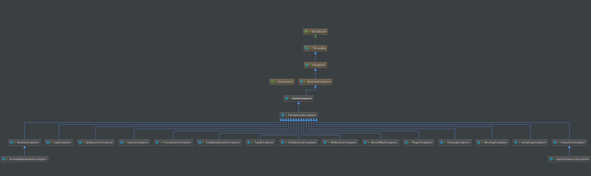

## 1. 概述

本文，我们来分享 MyBatis 的异常模块，对应 `exceptions` 包。如下图所示：


在 [《精尽 MyBatis 源码解析 —— 项目结构一览》](http://svip.iocoder.cn/MyBatis/intro) 中，简单介绍了这个模块如下：

> 定义了 MyBatis 专有的 PersistenceException 和 TooManyResultsException 异常。

实际上，MyBatis 不仅仅在 `exceptions` 包下有异常，在其他包下也有异常，整体如下类图：



下面，我们逐个包的异常看过看过去。

## 2. `exceptions` 包

### 2.1 IbatisException

`org.apache.ibatis.exceptions.IbatisException` ，实现 RuntimeException 类，IBatis 的**异常基类**。代码如下：

```java
@Deprecated
public class IbatisException extends RuntimeException {

  private static final long serialVersionUID = 3880206998166270511L;

  public IbatisException() {
    super();
  }

  public IbatisException(String message) {
    super(message);
  }

  public IbatisException(String message, Throwable cause) {
    super(message, cause);
  }

  public IbatisException(Throwable cause) {
    super(cause);
  }

}
```

实际上，IbatisException 已经在 2015 年被废弃，取代它的是 PersistenceException 类。

### 2.2 PersistenceException

`org.apache.ibatis.exceptions.PersistenceException` ，继承 IbatisException 类，目前 MyBatis **真正的异常基类**。代码如下：

```java
public class PersistenceException extends IbatisException {

    private static final long serialVersionUID = -7537395265357977271L;

    public PersistenceException() {
        super();
    }

    public PersistenceException(String message) {
        super(message);
    }

    public PersistenceException(String message, Throwable cause) {
        super(message, cause);
    }

    public PersistenceException(Throwable cause) {
        super(cause);
    }
    
}
```

#### 2.2.1 ExceptionFactory

`org.apache.ibatis.exceptions.ExceptionFactory` ，异常工厂。代码如下：

```java
public class ExceptionFactory {

    private ExceptionFactory() {
        // Prevent Instantiation
    }

    /**
     * 包装异常成 PersistenceException
     *
     * @param message 消息
     * @param e 发生的异常
     * @return PersistenceException
     */
    public static RuntimeException wrapException(String message, Exception e) {
        return new PersistenceException(ErrorContext.instance().message(message).cause(e).toString(), e);
    }

}
```

### 2.3 TooManyResultsException

`org.apache.ibatis.exceptions.TooManyResultsException` ，继承 PersistenceException 类，查询返回过多结果的异常。期望返回一条，实际返回了多条。代码如下：

```java
public class TooManyResultsException extends PersistenceException {

    private static final long serialVersionUID = 8935197089745865786L;

    public TooManyResultsException() {
        super();
    }

    public TooManyResultsException(String message) {
        super(message);
    }

    public TooManyResultsException(String message, Throwable cause) {
        super(message, cause);
    }

    public TooManyResultsException(Throwable cause) {
        super(cause);
    }

}
```

## 3. `parsing` 包

### 3.1 ParsingException

`org.apache.ibatis.parsing.ParsingException` ，继承 PersistenceException 类，解析异常。代码如下：

```java
public class ParsingException extends PersistenceException {

    private static final long serialVersionUID = -176685891441325943L;

    public ParsingException() {
        super();
    }

    public ParsingException(String message) {
        super(message);
    }

    public ParsingException(String message, Throwable cause) {
        super(message, cause);
    }

    public ParsingException(Throwable cause) {
        super(cause);
    }

}
```

## 3. 其它包

实际上，我们会看到其他包，会和 `parsing` 包一样，都会定义其**独有**的异常类。但是，代码都是相同的。所以，这里就简单整理如下：

* `reflection` 包：ReflectionException
* `logging` 包：LogException
* `builder` 包：BuilderException、IncompleteElementException
* `scripting` 包：ScriptingException
* `binding` 包：BindingException
* `type` 包：TypeException
* `session` 包：SqlSessionException
* `cache` 包：CacheException
* `transaction` 包：TransactionException
* `datasource` 包：DataSourceException
* `executor` 包：ResultMapException、ExecutorException、BatchExecutorException
* `plugin` 包：PluginException
