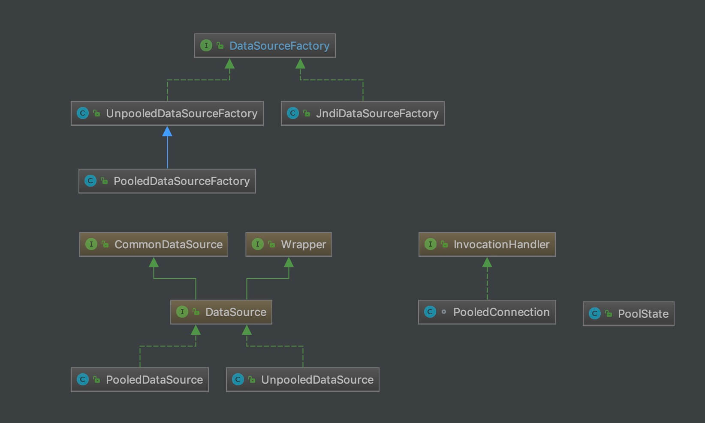
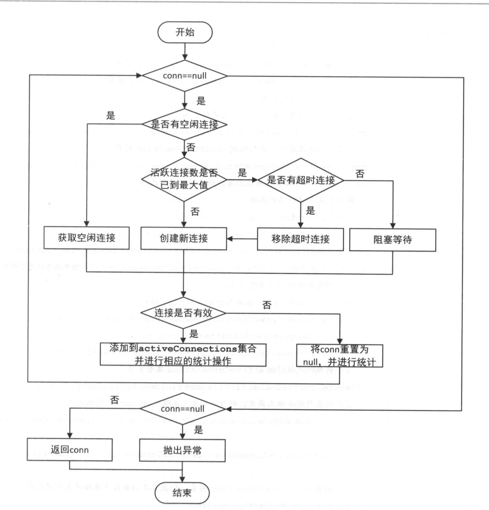
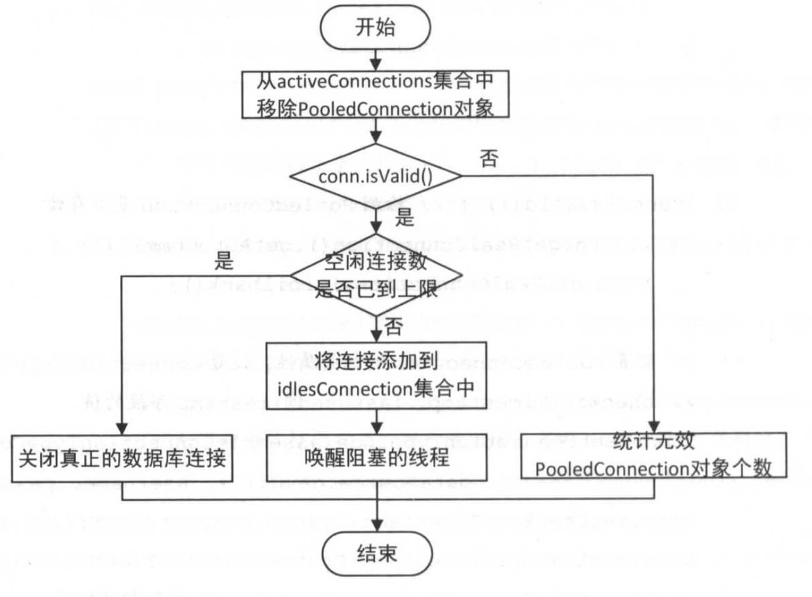

## 1. 概述

本文，我们来分享 MyBatis 的数据源模块，对应 `datasource` 包。如下图所示：


在 [《精尽 MyBatis 源码解析 —— 项目结构一览》](http://svip.iocoder.cn/MyBatis/intro) 中，简单介绍了这个模块如下：

> 数据源是实际开发中常用的组件之一。现在开源的数据源都提供了比较丰富的功能，例如，连接池功能、检测连接状态等，选择性能优秀的数据源组件对于提升 ORM 框架乃至整个应用的性能都是非常重要的。
>
> MyBatis **自身提供了相应的数据源实现，当然 MyBatis 也提供了与第三方数据源集成的接口，这些功能都位于数据源模块之中**。

本文涉及的类如下图所示：



下面，我们就一起来看看具体的源码实现。

## 2. DataSourceFactory

`org.apache.ibatis.datasource.DataSourceFactory` ，`javax.sql.DataSource` 工厂接口。代码如下：

```java
public interface DataSourceFactory {

    /**
     * 设置 DataSource 对象的属性
     *
     * @param props 属性
     */
    void setProperties(Properties props);

    /**
     * 获得 DataSource 对象
     *
     * @return DataSource 对象
     */
    DataSource getDataSource();

}
```

### 2.1 UnpooledDataSourceFactory

`org.apache.ibatis.datasource.unpooled.UnpooledDataSourceFactory` ，实现 DataSourceFactory 接口，非池化的 DataSourceFactory 实现类。

> FROM [《MyBatis 文档 —— XML 映射配置文件》](http://www.mybatis.org/mybatis-3/zh/configuration.html)
>
> **UNPOOLED**– 这个数据源的实现只是每次被请求时打开和关闭连接。虽然有点慢，但对于在数据库连接可用性方面没有太高要求的简单应用程序来说，是一个很好的选择。 不同的数据库在性能方面的表现也是不一样的，对于某些数据库来说，使用连接池并不重要，这个配置就很适合这种情形。UNPOOLED 类型的数据源仅仅需要配置以下 5 种属性：
>
> * `driver` – 这是 JDBC 驱动的 Java 类的完全限定名（并不是 JDBC 驱动中可能包含的数据源类）。
> * `url` – 这是数据库的 JDBC URL 地址。
> * `username` – 登录数据库的用户名。
> * `password` – 登录数据库的密码。
> * `defaultTransactionIsolationLevel` – 默认的连接事务隔离级别。
>
> 作为可选项，你也可以传递属性给数据库驱动。要这样做，属性的前缀为“driver.”，例如：
>
> driver.encoding=UTF8
>
> 这将通过 `DriverManager.getConnection(url,driverProperties)` 方法传递值为 `UTF8` 的 `encoding` 属性给数据库驱动。

#### 2.1.1 构造方法

```java
// UnpooledDataSourceFactory.java

/**
 * DataSource 对象
 */
protected DataSource dataSource;

public UnpooledDataSourceFactory() {
    // 创建 UnpooledDataSource 对象
    this.dataSource = new UnpooledDataSource();
}
```

默认创建了 UnpooledDataSource 对象。

#### 2.1.2 getDataSource

`#getDataSource()` 方法，返回 DataSource 对象。代码如下：

```java
// UnpooledDataSourceFactory.java

@Override
public DataSource getDataSource() {
    return dataSource;
}
```

#### 2.1.3 setProperties

`#setProperties(Properties properties)` 方法，将 `properties` 的属性，初始化到 `dataSource` 中。代码如下：

```java
// UnpooledDataSourceFactory.java

@Override
public void setProperties(Properties properties) {
    Properties driverProperties = new Properties();
    // 创建 dataSource 对应的 MetaObject 对象
    MetaObject metaDataSource = SystemMetaObject.forObject(dataSource);
    // 遍历 properties 属性，初始化到 driverProperties 和 MetaObject 中
    for (Object key : properties.keySet()) {
        String propertyName = (String) key;
        // 初始化到 driverProperties 中
        if (propertyName.startsWith(DRIVER_PROPERTY_PREFIX)) { // 以 "driver." 开头的配置
            String value = properties.getProperty(propertyName);
            driverProperties.setProperty(propertyName.substring(DRIVER_PROPERTY_PREFIX_LENGTH), value);
        // 初始化到 MetaObject 中
        } else if (metaDataSource.hasSetter(propertyName)) {
            String value = (String) properties.get(propertyName);
            Object convertedValue = convertValue(metaDataSource, propertyName, value); // <1> 转化属性
            metaDataSource.setValue(propertyName, convertedValue);
        } else {
            throw new DataSourceException("Unknown DataSource property: " + propertyName);
        }
    }
    // 设置 driverProperties 到 MetaObject 中
    if (driverProperties.size() > 0) {
        metaDataSource.setValue("driverProperties", driverProperties);
    }
}
```

`<1>` 处，调用 `#convertValue(MetaObject metaDataSource, String propertyName, String value)` 方法，将字符串转化成对应属性的类型。代码如下：

```java
// UnpooledDataSourceFactory.java

private Object convertValue(MetaObject metaDataSource, String propertyName, String value) {
    Object convertedValue = value;
    // 获得该属性的 setting 方法的参数类型
    Class<?> targetType = metaDataSource.getSetterType(propertyName);
    // 转化
    if (targetType == Integer.class || targetType == int.class) {
        convertedValue = Integer.valueOf(value);
    } else if (targetType == Long.class || targetType == long.class) {
        convertedValue = Long.valueOf(value);
    } else if (targetType == Boolean.class || targetType == boolean.class) {
        convertedValue = Boolean.valueOf(value);
    }
    // 返回
    return convertedValue;
}
```

### 2.2 PooledDataSourceFactory

`org.apache.ibatis.datasource.pooled.PooledDataSourceFactory` ，继承 UnpooledDataSourceFactory 类，池化的 DataSourceFactory 实现类。

> FROM [《MyBatis 文档 —— XML 映射配置文件》](http://www.mybatis.org/mybatis-3/zh/configuration.html)
>
> **POOLED**– 这种数据源的实现利用“池”的概念将 JDBC 连接对象组织起来，避免了创建新的连接实例时所必需的初始化和认证时间。 这是一种使得并发 Web 应用快速响应请求的流行处理方式。
>
> 除了上述提到 UNPOOLED 下的属性外，还有更多属性用来配置 POOLED 的数据源：
>
> * `poolMaximumActiveConnections` – 在任意时间可以存在的活动（也就是正在使用）连接数量，默认值：10
> * `poolMaximumIdleConnections` – 任意时间可能存在的空闲连接数。
> * `poolMaximumCheckoutTime` – 在被强制返回之前，池中连接被检出（checked out）时间，默认值：20000 毫秒（即 20 秒）
> * `poolTimeToWait` – 这是一个底层设置，如果获取连接花费了相当长的时间，连接池会打印状态日志并重新尝试获取一个连接（避免在误配置的情况下一直安静的失败），默认值：20000 毫秒（即 20 秒）。
> * `poolMaximumLocalBadConnectionTolerance` – 这是一个关于坏连接容忍度的底层设置， 作用于每一个尝试从缓存池获取连接的线程. 如果这个线程获取到的是一个坏的连接，那么这个数据源允许这个线程尝试重新获取一个新的连接，但是这个重新尝试的次数不应该超过 `poolMaximumIdleConnections` 与 `poolMaximumLocalBadConnectionTolerance` 之和。 默认值：3 (新增于 3.4.5)
> * `poolPingQuery` – 发送到数据库的侦测查询，用来检验连接是否正常工作并准备接受请求。默认是“NO PING QUERY SET”，这会导致多数数据库驱动失败时带有一个恰当的错误消息。
> * `poolPingEnabled` – 是否启用侦测查询。若开启，需要设置 `poolPingQuery` 属性为一个可执行的 SQL 语句（最好是一个速度非常快的 SQL 语句），默认值：false。
> * `poolPingConnectionsNotUsedFor` – 配置 poolPingQuery 的频率。可以被设置为和数据库连接超时时间一样，来避免不必要的侦测，默认值：0（即所有连接每一时刻都被侦测 — 当然仅当 poolPingEnabled 为 true 时适用）。

PooledDataSource 比 UnpooledDataSource 的配置项**多很多**。

代码如下：

```java
// PooledDataSourceFactory.java

public class PooledDataSourceFactory extends UnpooledDataSourceFactory {

    public PooledDataSourceFactory() {
        this.dataSource = new PooledDataSource();
    }

}
```

默认创建了 PooledDataSource 对象。

其它方法，在父类中 UnpooledDataSourceFactory 中已经实现。所以，真正的**池化**逻辑，在 PooledDataSource 对象中。

### 2.3 JndiDataSourceFactory

`org.apache.ibatis.datasource.jndi.JndiDataSourceFactory` ，实现 DataSourceFactory 接口，基于 JNDI 的 DataSourceFactory 实现类。

> FROM [《MyBatis 文档 —— XML 映射配置文件》](http://www.mybatis.org/mybatis-3/zh/configuration.html)
>
> **JNDI** – 这个数据源的实现是为了能在如 EJB 或应用服务器这类容器中使用，容器可以集中或在外部配置数据源，然后放置一个 JNDI 上下文的引用。这种数据源配置只需要两个属性：
>
> * `initial_context` – 这个属性用来在 InitialContext 中寻找上下文（即，initialContext.lookup(initial_context)）。这是个可选属性，如果忽略，那么 data_source 属性将会直接从 InitialContext 中寻找。
> * `data_source` – 这是引用数据源实例位置的上下文的路径。提供了 initial_context 配置时会在其返回的上下文中进行查找，没有提供时则直接在 InitialContext 中查找。
>
> 和其他数据源配置类似，可以通过添加前缀“env.”直接把属性传递给初始上下文。比如：
>
> env.encoding=UTF8
>
> 这就会在初始上下文（InitialContext）实例化时往它的构造方法传递值为 `UTF8` 的 `encoding` 属性。

#### 2.3.1 构造方法

```java
// JndiDataSourceFactory.java

private DataSource dataSource;
```

不同于 UnpooledDataSourceFactory 和 PooledDataSourceFactory ，`dataSource` 不在构造方法中创建，而是在 `#setProperties(Properties properties)` 中。

#### 2.3.2 getDataSource

`#getDataSource()` 方法，返回 DataSource 对象。代码如下：

```java
// JndiDataSourceFactory.java

@Override
public DataSource getDataSource() {
    return dataSource;
}
```

#### 2.3.3 setProperties

`#setProperties(Properties properties)` 方法，从上下文中，获得 DataSource 对象。代码如下：

```java
// JndiDataSourceFactory.java

public static final String INITIAL_CONTEXT = "initial_context";
public static final String DATA_SOURCE = "data_source";
public static final String ENV_PREFIX = "env.";

@Override
public void setProperties(Properties properties) {
    try {
        InitialContext initCtx;
        // <1> 获得系统 Properties 对象
        Properties env = getEnvProperties(properties);
        // 创建 InitialContext 对象
        if (env == null) {
            initCtx = new InitialContext();
        } else {
            initCtx = new InitialContext(env);
        }

        // 从 InitialContext 上下文中，获取 DataSource 对象
        if (properties.containsKey(INITIAL_CONTEXT)
                && properties.containsKey(DATA_SOURCE)) {
            Context ctx = (Context) initCtx.lookup(properties.getProperty(INITIAL_CONTEXT));
            dataSource = (DataSource) ctx.lookup(properties.getProperty(DATA_SOURCE));
        } else if (properties.containsKey(DATA_SOURCE)) {
            dataSource = (DataSource) initCtx.lookup(properties.getProperty(DATA_SOURCE));
        }
    } catch (NamingException e) {
        throw new DataSourceException("There was an error configuring JndiDataSourceTransactionPool. Cause: " + e, e);
    }
}
```

目前已经很少使用 JNDI 功能了，所以胖友简单了解下就好。

`<1>` 处，调用 `#getEnvProperties(Properties allProps)` 方法，获得系统 Properties 对象。代码如下：

```java
// JndiDataSourceFactory.java

private static Properties getEnvProperties(Properties allProps) {
    final String PREFIX = ENV_PREFIX;
    Properties contextProperties = null;
    for (Entry<Object, Object> entry : allProps.entrySet()) {
        String key = (String) entry.getKey();
        String value = (String) entry.getValue();
        if (key.startsWith(PREFIX)) {
            if (contextProperties == null) {
                contextProperties = new Properties();
            }
            contextProperties.put(key.substring(PREFIX.length()), value);
        }
    }
    return contextProperties;
}
```

## 3. DataSource

`javax.sql.DataSource` 是个**神奇**的接口，在其上可以衍生出数据连接池、分库分表、读写分离等等功能。

### 3.1 UnpooledDataSource

`org.apache.ibatis.datasource.unpooled.UnpooledDataSource` ，实现 DataSource 接口，非池化的 DataSource 对象。

#### 3.1.1 构造方法

```java
// UnpooledDataSource.java

/**
 * 已注册的 Driver 映射
 *
 * KEY：Driver 类名
 * VALUE：Driver 对象
 */
private static Map<String, Driver> registeredDrivers = new ConcurrentHashMap<>();

/**
 * Driver 类加载器
 */
private ClassLoader driverClassLoader;
/**
 * Driver 属性
 */
private Properties driverProperties;

/**
 * Driver 类名
 */
private String driver;
/**
 * 数据库 URL
 */
private String url;
/**
 * 数据库用户名
 */
private String username;
/**
 * 数据库密码
 */
private String password;

/**
 * 是否自动提交事务
 */
private Boolean autoCommit;
/**
 * 默认事务隔离级别
 */
private Integer defaultTransactionIsolationLevel;

static {
    // 初始化 registeredDrivers
    Enumeration<Driver> drivers = DriverManager.getDrivers();
    while (drivers.hasMoreElements()) {
        Driver driver = drivers.nextElement();
        registeredDrivers.put(driver.getClass().getName(), driver);
    }
}

public UnpooledDataSource() {
}

public UnpooledDataSource(String driver, String url, String username, String password) {
    this.driver = driver;
    this.url = url;
    this.username = username;
    this.password = password;
}

public UnpooledDataSource(String driver, String url, Properties driverProperties) {
    this.driver = driver;
    this.url = url;
    this.driverProperties = driverProperties;
}

public UnpooledDataSource(ClassLoader driverClassLoader, String driver, String url, String username, String password) {
    this.driverClassLoader = driverClassLoader;
    this.driver = driver;
    this.url = url;
    this.username = username;
    this.password = password;
}

public UnpooledDataSource(ClassLoader driverClassLoader, String driver, String url, Properties driverProperties) {
    this.driverClassLoader = driverClassLoader;
    this.driver = driver;
    this.url = url;
    this.driverProperties = driverProperties;
}
```

比较简单，就是属性的赋值。

#### 3.1.2 getConnection

`#getConnection(...)` 方法，获得 Connection 连接。代码如下：

```java
// UnpooledDataSource.java

@Override
public Connection getConnection() throws SQLException {
    return doGetConnection(username, password);
}

@Override
public Connection getConnection(String username, String password) throws SQLException {
    return doGetConnection(username, password);
}
```

都是调用 `#doGetConnection(String username, String password)` 方法，获取 Connection 连接。代码如下：

```java
// UnpooledDataSource.java

private Connection doGetConnection(String username, String password) throws SQLException {
    // 创建 Properties 对象
    Properties props = new Properties();
    // 设置 driverProperties 到 props 中
    if (driverProperties != null) {
        props.putAll(driverProperties);
    }
    // 设置 user 和 password 到 props 中
    if (username != null) {
        props.setProperty("user", username);
    }
    if (password != null) {
        props.setProperty("password", password);
    }
    // 执行获得 Connection 连接
    return doGetConnection(props);
}

private Connection doGetConnection(Properties properties) throws SQLException {
    // <1> 初始化 Driver
    initializeDriver();
    // <2> 获得 Connection 对象
    Connection connection = DriverManager.getConnection(url, properties);
    // <3> 配置 Connection 对象
    configureConnection(connection);
    return connection;
}
```

`<1>` 处，调用 `#initializeDriver()` 方法，初始化 Driver 。详细解析，见 [「3.1.2.1 initializeDriver」](http://svip.iocoder.cn/MyBatis/datasource-package/#) 。

`<2>` 处，调用 `java.sql.DriverManager#getConnection(String url, Properties info)` 方法，获得 Connection 对象。

`<3>` 处，调用 `#configureConnection(Connection conn)` 方法，配置 Connection 对象。详细解析，见 [「3.1.2.2 configureConnection」](http://svip.iocoder.cn/MyBatis/datasource-package/#) 。

##### 3.1.2.1 initializeDriver

`#initializeDriver()` 方法，初始化 Driver 。代码如下：

```java
// UnpooledDataSource.java

private synchronized void initializeDriver() throws SQLException { // <1>
    // 判断 registeredDrivers 是否已经存在该 driver ，若不存在，进行初始化
    if (!registeredDrivers.containsKey(driver)) {
        Class<?> driverType;
        try {
            // <2> 获得 driver 类
            if (driverClassLoader != null) {
                driverType = Class.forName(driver, true, driverClassLoader);
            } else {
                driverType = Resources.classForName(driver);
            }
            // <3> 创建 Driver 对象
            // DriverManager requires the driver to be loaded via the system ClassLoader.
            // http://www.kfu.com/~nsayer/Java/dyn-jdbc.html
            Driver driverInstance = (Driver) driverType.newInstance();
            // 创建 DriverProxy 对象，并注册到 DriverManager 中
            DriverManager.registerDriver(new DriverProxy(driverInstance));
            // 添加到 registeredDrivers 中
            registeredDrivers.put(driver, driverInstance);
        } catch (Exception e) {
            throw new SQLException("Error setting driver on UnpooledDataSource. Cause: " + e);
        }
    }
}
```

总体逻辑比较简单，判断 `registeredDrivers` 是否已经存在该 `driver` ？若不存在，进行初始化。

`<1>` 处，`synchronized` 锁的粒度太大，可以减小到基于 `registeredDrivers` 来同步，并且很多时候，不需要加锁。

`<2>` 处，获得 `driver` 类，实际上，就是我们常见的 `"Class.forName("com.mysql.jdbc.Driver")"` 。

`<3>` 处，创建 Driver 对象，并注册到 DriverManager 中，以及添加到 `registeredDrivers` 中。为什么此处会有使用 DriverProxy 呢？DriverProxy 的代码如下：

```java
// UnpooledDataSource.java 的内部私有静态类

private static class DriverProxy implements Driver {
    private Driver driver;

    DriverProxy(Driver d) {
        this.driver = d;
    }

    @Override
    public boolean acceptsURL(String u) throws SQLException {
        return this.driver.acceptsURL(u);
    }

    @Override
    public Connection connect(String u, Properties p) throws SQLException {
        return this.driver.connect(u, p);
    }

    @Override
    public int getMajorVersion() {
        return this.driver.getMajorVersion();
    }

    @Override
    public int getMinorVersion() {
        return this.driver.getMinorVersion();
    }

    @Override
    public DriverPropertyInfo[] getPropertyInfo(String u, Properties p) throws SQLException {
        return this.driver.getPropertyInfo(u, p);
    }

    @Override
    public boolean jdbcCompliant() {
        return this.driver.jdbcCompliant();
    }

    // @Override only valid jdk7+
    public Logger getParentLogger() {
        return Logger.getLogger(Logger.GLOBAL_LOGGER_NAME); // <4>
    }

}
```

因为 `<4>` 处，使用 MyBatis 自定义的 Logger 对象。

其他方法，实际就是直接调用 `driver` 对应的方法。

##### 3.1.2.2 configureConnection

`#configureConnection(Connection conn)` 方法，配置 Connection 对象。代码如下：

```java
// UnpooledDataSource.java

private void configureConnection(Connection conn) throws SQLException {
    // 设置自动提交
    if (autoCommit != null && autoCommit != conn.getAutoCommit()) {
        conn.setAutoCommit(autoCommit);
    }
    // 设置事务隔离级别
    if (defaultTransactionIsolationLevel != null) {
        conn.setTransactionIsolation(defaultTransactionIsolationLevel);
    }
}
```

#### 3.1.3 其它方法

UnpooledDataSource 还实现了 DataSource 的其它方法。

### 3.2 PooledDataSource

`org.apache.ibatis.datasource.pooled.PooledDataSource` ，实现 DataSource 接口，池化的 DataSource 实现类。

> FROM PooledDataSource 类上的注释
>
> This is a simple, synchronous, thread-safe database connection pool.

实际场景下，我们基本不用 MyBatis 自带的数据库连接池的实现。

#### 3.2.1 构造方法

```java
// PooledDataSource.java

/**
 * PoolState 对象，记录池化的状态
 */
private final PoolState state = new PoolState(this);

/**
 * UnpooledDataSource 对象
 */
private final UnpooledDataSource dataSource;

// OPTIONAL CONFIGURATION FIELDS
/**
 * 在任意时间可以存在的活动（也就是正在使用）连接数量
 */
protected int poolMaximumActiveConnections = 10;
/**
 * 任意时间可能存在的空闲连接数
 */
protected int poolMaximumIdleConnections = 5;
/**
 * 在被强制返回之前，池中连接被检出（checked out）时间。单位：毫秒
 */
protected int poolMaximumCheckoutTime = 20000;
/**
 * 这是一个底层设置，如果获取连接花费了相当长的时间，连接池会打印状态日志并重新尝试获取一个连接（避免在误配置的情况下一直安静的失败）。单位：毫秒
 */
protected int poolTimeToWait = 20000;
/**
 * 这是一个关于坏连接容忍度的底层设置，作用于每一个尝试从缓存池获取连接的线程. 如果这个线程获取到的是一个坏的连接，那么这个数据源允许这个线程尝试重新获取一个新的连接，但是这个重新尝试的次数不应该超过 poolMaximumIdleConnections 与 poolMaximumLocalBadConnectionTolerance 之和。
 */
protected int poolMaximumLocalBadConnectionTolerance = 3;
/**
 * 发送到数据库的侦测查询，用来检验连接是否正常工作并准备接受请求。
 */
protected String poolPingQuery = "NO PING QUERY SET";
/**
 * 是否启用侦测查询。若开启，需要设置 poolPingQuery 属性为一个可执行的 SQL 语句（最好是一个速度非常快的 SQL 语句）
 */
protected boolean poolPingEnabled;
/**
 * 配置 poolPingQuery 的频率。可以被设置为和数据库连接超时时间一样，来避免不必要的侦测，默认值：0（即所有连接每一时刻都被侦测 — 当然仅当 poolPingEnabled 为 true 时适用）
 */
protected int poolPingConnectionsNotUsedFor;

/**
 * 期望 Connection 的类型编码，通过 {@link #assembleConnectionTypeCode(String, String, String)} 计算。
 */
private int expectedConnectionTypeCode;

public PooledDataSource() {
    dataSource = new UnpooledDataSource();
}

public PooledDataSource(UnpooledDataSource dataSource) {
    this.dataSource = dataSource;
}

public PooledDataSource(String driver, String url, String username, String password) {
    dataSource = new UnpooledDataSource(driver, url, username, password);
    expectedConnectionTypeCode = assembleConnectionTypeCode(dataSource.getUrl(), dataSource.getUsername(), dataSource.getPassword());
}

public PooledDataSource(String driver, String url, Properties driverProperties) {
    dataSource = new UnpooledDataSource(driver, url, driverProperties);
    expectedConnectionTypeCode = assembleConnectionTypeCode(dataSource.getUrl(), dataSource.getUsername(), dataSource.getPassword());
}

public PooledDataSource(ClassLoader driverClassLoader, String driver, String url, String username, String password) {
    dataSource = new UnpooledDataSource(driverClassLoader, driver, url, username, password);
    expectedConnectionTypeCode = assembleConnectionTypeCode(dataSource.getUrl(), dataSource.getUsername(), dataSource.getPassword());
}

public PooledDataSource(ClassLoader driverClassLoader, String driver, String url, Properties driverProperties) {
    // 创建 UnpooledDataSource 对象
    dataSource = new UnpooledDataSource(driverClassLoader, driver, url, driverProperties);
    // 计算  expectedConnectionTypeCode 的值
    expectedConnectionTypeCode = assembleConnectionTypeCode(dataSource.getUrl(), dataSource.getUsername(), dataSource.getPassword());
}
```

属性都比较简单，看起来虽然多，主要是可选的**配置**属性。我们就看几个重点的。

`dataSource` 属性，UnpooledDataSource 对象。这样，就能重用 UnpooledDataSource 的代码了。说白了，获取真正连接的逻辑，还是在 UnpooledDataSource 中实现。

`expectedConnectionTypeCode` 属性，调用 `#assembleConnectionTypeCode(ClassLoader driverClassLoader, String driver, String url, Properties driverProperties)` 方法，计算 `expectedConnectionTypeCode` 的值。代码如下：

```java
// PooledDataSource.java

private int assembleConnectionTypeCode(String url, String username, String password) {
    return ("" + url + username + password).hashCode();
}
```

`state` 属性，PoolState 对象，记录池化的状态。这是一个非常重要的类，下文也会花一定的篇幅，详细解析。

#### 3.2.2 getConnection

`#getConnection(...)` 方法，获得 Connection 连接。代码如下：

```java
// PooledDataSource.java

@Override
public Connection getConnection() throws SQLException {
    return popConnection(dataSource.getUsername(), dataSource.getPassword()).getProxyConnection();
}

@Override
public Connection getConnection(String username, String password) throws SQLException {
    return popConnection(username, password).getProxyConnection();
}
```

调用 `#popConnection(String username, String password)` 方法，获取 `org.apache.ibatis.datasource.pooled.PooledConnection` 对象，这是一个**池化**的连接。非常关键的一个方法，详细解析，见 [「3.2.2.1 popConnection」](http://svip.iocoder.cn/MyBatis/datasource-package/#) 。

调用 `PooledConnection#getProxyConnection()` 方法，返回代理的 Connection 对象。这样，每次对数据库的操作，才能被 PooledConnection 的 [「5.2 invoke」](http://svip.iocoder.cn/MyBatis/datasource-package/#) **代理拦截**。

##### 3.2.2.1 popConnection

`#popConnection(String username, String password)` 方法，获取 PooledConnection 对象。

整体流程如下图：



代码如下：

```java
// PooledDataSource.java

  1: private PooledConnection popConnection(String username, String password) throws SQLException {
  2:     boolean countedWait = false; // 标记，获取连接时，是否进行了等待
  3:     PooledConnection conn = null; // 最终获取到的链接对象
  4:     long t = System.currentTimeMillis(); // 记录当前时间
  5:     int localBadConnectionCount = 0; // 记录当前方法，获取到坏连接的次数
  6: 
  7:     // 循环，获取可用的 Connection 连接
  8:     while (conn == null) {
  9:         synchronized (state) {
 10:             // 空闲连接非空
 11:             if (!state.idleConnections.isEmpty()) {
 12:                 // Pool has available connection
 13:                 // 通过移除的方式，获得首个空闲的连接
 14:                 conn = state.idleConnections.remove(0);
 15:                 if (log.isDebugEnabled()) {
 16:                     log.debug("Checked out connection " + conn.getRealHashCode() + " from pool.");
 17:                 }
 18:             // 无空闲空闲连接
 19:             } else {
 20:                 // Pool does not have available connection
 21:                 // 激活的连接数小于 poolMaximumActiveConnections
 22:                 if (state.activeConnections.size() < poolMaximumActiveConnections) {
 23:                     // Can create new connection
 24:                     // 创建新的 PooledConnection 连接对象
 25:                     conn = new PooledConnection(dataSource.getConnection(), this);
 26:                     if (log.isDebugEnabled()) {
 27:                         log.debug("Created connection " + conn.getRealHashCode() + ".");
 28:                     }
 29:                 } else {
 30:                     // Cannot create new connection
 31:                     // 获得首个激活的 PooledConnection 对象
 32:                     PooledConnection oldestActiveConnection = state.activeConnections.get(0);
 33:                     // 检查该连接是否超时
 34:                     long longestCheckoutTime = oldestActiveConnection.getCheckoutTime();
 35:                     if (longestCheckoutTime > poolMaximumCheckoutTime) { // 检查到超时
 36:                         // Can claim overdue connection
 37:                         // 对连接超时的时间的统计
 38:                         state.claimedOverdueConnectionCount++;
 39:                         state.accumulatedCheckoutTimeOfOverdueConnections += longestCheckoutTime;
 40:                         state.accumulatedCheckoutTime += longestCheckoutTime;
 41:                         // 从活跃的连接集合中移除
 42:                         state.activeConnections.remove(oldestActiveConnection);
 43:                         // 如果非自动提交的，需要进行回滚。即将原有执行中的事务，全部回滚。
 44:                         if (!oldestActiveConnection.getRealConnection().getAutoCommit()) {
 45:                             try {
 46:                                 oldestActiveConnection.getRealConnection().rollback();
 47:                             } catch (SQLException e) {
 48:                                 /*
 49:                                    Just log a message for debug and continue to execute the following
 50:                                    statement like nothing happened.
 51:                                    Wrap the bad connection with a new PooledConnection, this will help
 52:                                    to not interrupt current executing thread and give current thread a
 53:                                    chance to join the next competition for another valid/good database
 54:                                    connection. At the end of this loop, bad {@link @conn} will be set as null.
 55:                                 */
 56:                                 log.debug("Bad connection. Could not roll back");
 57:                             }
 58:                         }
 59:                         // 创建新的 PooledConnection 连接对象
 60:                         conn = new PooledConnection(oldestActiveConnection.getRealConnection(), this);
 61:                         conn.setCreatedTimestamp(oldestActiveConnection.getCreatedTimestamp());
 62:                         conn.setLastUsedTimestamp(oldestActiveConnection.getLastUsedTimestamp());
 63:                         // 设置 oldestActiveConnection 为无效
 64:                         oldestActiveConnection.invalidate();
 65:                         if (log.isDebugEnabled()) {
 66:                             log.debug("Claimed overdue connection " + conn.getRealHashCode() + ".");
 67:                         }
 68:                     } else { // 检查到未超时
 69:                         // Must wait
 70:                         try {
 71:                             // 对等待连接进行统计。通过 countedWait 标识，在这个循环中，只记录一次。
 72:                             if (!countedWait) {
 73:                                 state.hadToWaitCount++;
 74:                                 countedWait = true;
 75:                             }
 76:                             if (log.isDebugEnabled()) {
 77:                                 log.debug("Waiting as long as " + poolTimeToWait + " milliseconds for connection.");
 78:                             }
 79:                             // 记录当前时间
 80:                             long wt = System.currentTimeMillis();
 81:                             // 等待，直到超时，或 pingConnection 方法中归还连接时的唤醒
 82:                             state.wait(poolTimeToWait);
 83:                             // 统计等待连接的时间
 84:                             state.accumulatedWaitTime += System.currentTimeMillis() - wt;
 85:                         } catch (InterruptedException e) {
 86:                             break;
 87:                         }
 88:                     }
 89:                 }
 90:             }
 91:             // 获取到连接
 92:             if (conn != null) {
 93:                 // ping to server and check the connection is valid or not
 94:                 // 通过 ping 来测试连接是否有效
 95:                 if (conn.isValid()) {
 96:                     // 如果非自动提交的，需要进行回滚。即将原有执行中的事务，全部回滚。
 97:                     // 这里又执行了一次，有点奇怪。目前猜测，是不是担心上一次适用方忘记提交或回滚事务 TODO 1001 芋艿
 98:                     if (!conn.getRealConnection().getAutoCommit()) {
 99:                         conn.getRealConnection().rollback();
100:                     }
101:                     // 设置获取连接的属性
102:                     conn.setConnectionTypeCode(assembleConnectionTypeCode(dataSource.getUrl(), username, password));
103:                     conn.setCheckoutTimestamp(System.currentTimeMillis());
104:                     conn.setLastUsedTimestamp(System.currentTimeMillis());
105:                     // 添加到活跃的连接集合
106:                     state.activeConnections.add(conn);
107:                     // 对获取成功连接的统计
108:                     state.requestCount++;
109:                     state.accumulatedRequestTime += System.currentTimeMillis() - t;
110:                 } else {
111:                     if (log.isDebugEnabled()) {
112:                         log.debug("A bad connection (" + conn.getRealHashCode() + ") was returned from the pool, getting another connection.");
113:                     }
114:                     // 统计获取到坏的连接的次数
115:                     state.badConnectionCount++;
116:                     // 记录获取到坏的连接的次数【本方法】
117:                     localBadConnectionCount++;
118:                     // 将 conn 置空，那么可以继续获取
119:                     conn = null;
120:                     // 如果超过最大次数，抛出 SQLException 异常
121:                     // 为什么次数要包含 poolMaximumIdleConnections 呢？相当于把激活的连接，全部遍历一次。
122:                     if (localBadConnectionCount > (poolMaximumIdleConnections + poolMaximumLocalBadConnectionTolerance)) {
123:                         if (log.isDebugEnabled()) {
124:                             log.debug("PooledDataSource: Could not get a good connection to the database.");
125:                         }
126:                         throw new SQLException("PooledDataSource: Could not get a good connection to the database.");
127:                     }
128:                 }
129:             }
130:         }
131:     }
132: 
133:     // 获取不到连接，抛出 SQLException 异常
134:     if (conn == null) {
135:         if (log.isDebugEnabled()) {
136:             log.debug("PooledDataSource: Unknown severe error condition.  The connection pool returned a null connection.");
137:         }
138:         throw new SQLException("PooledDataSource: Unknown severe error condition.  The connection pool returned a null connection.");
139:     }
140: 
141:     return conn;
142: }
```

* 第 2 至 5 行：声明四个变量，具体用途，看看注释。
* 第 8 行：`while` 循环，获取可用的 Connection 连接，或超过获取次数上限( `poolMaximumIdleConnections + poolMaximumLocalBadConnectionTolerance` )。
* 第 9 行：基于 `state` 变量做同步，避免并发问题。从这个锁的粒度来说，颗粒度还是比较大的，所以 MyBatis 自带的数据池连接池性能应该一般。从 [《Druid 锁的公平模式问题》](https://github.com/alibaba/druid/wiki/Druid锁的公平模式问题) 文章来看，Druid 在锁的处理上，肯定是**相对**精细的。
* ============== 获取连接，分成四种 ==============
* 第 10 至 17 行：**第一种**，空闲连接**非空**，此处就使用到了 `PoolState.idleConnections` 属性。
  * 第 14 行：通过移除 `PoolState.idleConnections` 的方式，获得首个空闲的连接。
* 第 20 至 28 行：**第二种**，空闲连接**为空**，激活的连接数小于 `poolMaximumActiveConnections` 。
  * 第 25 行：创建新的 PooledConnection 连接对象。此处，**真正**的数据库连接，是通过 `UnpooledConnection#getConnection()` 方法获取到的。
* 第 32 行：获取首个激活的 PooledConnection 对象，从 `PoolState.activeConnections` 中。
* 第 36 至 67 行：**第三种**，获取的连接**已超时**，那么就可以**重新**使用该连接的**真实数据库连接**了。所以，我们可以发现，连接的超时发现，并不是由一个定时任务后台执行，而是有点类似**懒加载**的方式，在连接不够的时候，再去进行处理。实际上，很多“东西”的过期，都是基于这样的思路，例如 Redis 的键过期。
  * 第 36 至 40 行：对连接超时的时间的统计。
  * 第 42 行：从活跃的连接集合 `PoolState.activeConnections` 中移除。
  * 第 43 至 58 行：如果非自动提交的，需要进行回滚。即将原有执行中的事务，全部回滚。
  * 第 59 至 62 行：创建新的 PooledConnection 连接对象。此处，使用的是 `oldestActiveConnection.realConnection` 。
  * 第 64 行：调用 `PooledConnection#invalidate()` 方法，设置 `oldestActiveConnection` 为无效。这样，如果目前正在使用该连接的调用方，如果在发起数据库操作，将可以抛出异常。具体原因，可见 [「5.2 invoke」](http://svip.iocoder.cn/MyBatis/datasource-package/#) 。
* 第 68 至 87 行：**第四种**，获取的连接**未超时**，那么就只能**等待**。
  * 第 71 至 75 行：对等待连接进行统计。通过 `countedWait` 标识，在这个循环中，只记录一次。
  * 【重要】第 82 行：**等待**，直到**超时**，或 `pingConnection` 方法中归还连接时的**唤醒**。
  * 第 80 && 84 行：统计等待连接的时间。
* ============== 校验连接 ==============
* 第 95 行：调用 `PooledConnection#isValid()` 方法，校验获得的连接是否可用。详细解析，见 [「5.3 isValid」](http://svip.iocoder.cn/MyBatis/datasource-package/#) 。
* 第 95 至 109 行：连接**可用**。
  * 第 96 至 100 行：如果非自动提交的，需要进行回滚。即将原有执行中的事务，全部回滚。这里又执行了一次，有点奇怪。目前猜测，是不是担心上一次适用方忘记提交或回滚事务。
  * 第 101 至 104 行：设置获取连接的属性。
  * 第 106 行：添加到活跃的连接集合 `PoolState.activeConnections` 中。
  * 第 107 至 109 行：对获取成功连接的统计。
* 第 110 至 128 行：连接**不可用**。
  * 第 115 行：统计获取到坏的连接的次数。
  * 第 117 行：记录获取到坏的连接的次数【本方法】`localBadConnectionCount` 。
  * 第 119 行：将 `conn` 置空，那么可以继续获取，即回到【第 8 行】代码。
  * 第 120 至 127 行：如果超过最大次数，抛出 SQLException 异常。为什么次数要包含 `poolMaximumIdleConnections` 呢？相当于把激活的连接，全部遍历一次。
* ============== 循环结束 ==============
* 第 133 至 139 行：获取不到连接，抛出 SQLException 异常。实际上，这块逻辑是不会执行到的，无论是从上面的逻辑推导，还是从官方在抛出的 SQLException 异常的描述。

#### 3.2.3 pushConnection

`#pushConnection(PooledConnection conn)` 方法，将使用完的连接，添加回连接池中。

整体流程如下图：



代码如下：

```java
// PooledDataSource.java

protected void pushConnection(PooledConnection conn) throws SQLException {
    synchronized (state) {
        // 从激活的连接集合中移除该连接
        state.activeConnections.remove(conn);
        // 通过 ping 来测试连接是否有效
        if (conn.isValid()) { // 有效
            // 判断是否超过空闲连接上限，并且和当前连接池的标识匹配
            if (state.idleConnections.size() < poolMaximumIdleConnections && conn.getConnectionTypeCode() == expectedConnectionTypeCode) {
                // 统计连接使用时长
                state.accumulatedCheckoutTime += conn.getCheckoutTime();
                // 回滚事务，避免适用房未提交或者回滚事务
                if (!conn.getRealConnection().getAutoCommit()) {
                    conn.getRealConnection().rollback();
                }
                // 创建 PooledConnection 对象，并添加到空闲的链接集合中
                PooledConnection newConn = new PooledConnection(conn.getRealConnection(), this);
                state.idleConnections.add(newConn);
                newConn.setCreatedTimestamp(conn.getCreatedTimestamp());
                newConn.setLastUsedTimestamp(conn.getLastUsedTimestamp());
                // 设置原连接失效
                // 为什么这里要创建新的 PooledConnection 对象呢？避免使用方还在使用 conn ，通过将它设置为失效，万一再次调用，会抛出异常
                conn.invalidate();
                if (log.isDebugEnabled()) {
                    log.debug("Returned connection " + newConn.getRealHashCode() + " to pool.");
                }
                // 唤醒正在等待连接的线程
                state.notifyAll();
            } else {
                // 统计连接使用时长
                state.accumulatedCheckoutTime += conn.getCheckoutTime();
                // 回滚事务，避免适用房未提交或者回滚事务
                if (!conn.getRealConnection().getAutoCommit()) {
                    conn.getRealConnection().rollback();
                }
                // 关闭真正的数据库连接
                conn.getRealConnection().close();
                if (log.isDebugEnabled()) {
                    log.debug("Closed connection " + conn.getRealHashCode() + ".");
                }
                // 设置原连接失效
                conn.invalidate();
            }
        } else { // 失效
            if (log.isDebugEnabled()) {
                log.debug("A bad connection (" + conn.getRealHashCode() + ") attempted to return to the pool, discarding connection.");
            }
            // 统计获取到坏的连接的次数
            state.badConnectionCount++;
        }
    }
}
```

该方法会被 PooledConnection 的 [「5.2 invoke」](http://svip.iocoder.cn/MyBatis/datasource-package/#) 在 `methodName = close` 方法的情况下时被调用。

#### 3.2.4 pingConnection

`#pingConnection(PooledConnection conn)` 方法，通过向数据库发起 `poolPingQuery` 语句来发起“ping”操作，以判断数据库连接是否有效。代码如下：

```java
// PooledDataSource.java

/**
 * Method to check to see if a connection is still usable
 *
 * @param conn - the connection to check
 * @return True if the connection is still usable
 */
protected boolean pingConnection(PooledConnection conn) {
    // 记录是否 ping 成功
    boolean result;

    // 判断真实的连接是否已经关闭。若已关闭，就意味着 ping 肯定是失败的。
    try {
        result = !conn.getRealConnection().isClosed();
    } catch (SQLException e) {
        if (log.isDebugEnabled()) {
            log.debug("Connection " + conn.getRealHashCode() + " is BAD: " + e.getMessage());
        }
        result = false;
    }

    if (result) {
        // 是否启用侦测查询
        if (poolPingEnabled) {
            // 判断是否长时间未使用。若是，才需要发起 ping
            if (poolPingConnectionsNotUsedFor >= 0 && conn.getTimeElapsedSinceLastUse() > poolPingConnectionsNotUsedFor) {
                try {
                    if (log.isDebugEnabled()) {
                        log.debug("Testing connection " + conn.getRealHashCode() + " ...");
                    }
                    // 通过执行 poolPingQuery 语句来发起 ping
                    Connection realConn = conn.getRealConnection();
                    try (Statement statement = realConn.createStatement()) {
                        statement.executeQuery(poolPingQuery).close();
                    }
                    if (!realConn.getAutoCommit()) {
                        realConn.rollback();
                    }
                    // 标记执行成功
                    result = true;
                    if (log.isDebugEnabled()) {
                        log.debug("Connection " + conn.getRealHashCode() + " is GOOD!");
                    }
                } catch (Exception e) {
                    // 关闭数据库真实的连接
                    log.warn("Execution of ping query '" + poolPingQuery + "' failed: " + e.getMessage());
                    try {
                        conn.getRealConnection().close();
                    } catch (Exception e2) {
                        //ignore
                    }
                    // 标记执行失败
                    result = false;
                    if (log.isDebugEnabled()) {
                        log.debug("Connection " + conn.getRealHashCode() + " is BAD: " + e.getMessage());
                    }
                }
            }
        }
    }
    return result;
}
```

该方法会被 PooledConnection 的 [「5.2 invoke」](http://svip.iocoder.cn/MyBatis/datasource-package/#) 在 `methodName != close` 方法的情况下时被调用，校验连接是否可用。

#### 3.2.5 forceCloseAll

`#forceCloseAll()` 方法，关闭所有的 `activeConnections` 和 `idleConnections` 的连接。代码如下：

```java
// PooledDataSource.java

/*
 * Closes all active and idle connections in the pool
 */
public void forceCloseAll() {
    synchronized (state) {
        // 计算 expectedConnectionTypeCode
        expectedConnectionTypeCode = assembleConnectionTypeCode(dataSource.getUrl(), dataSource.getUsername(), dataSource.getPassword());
        // 遍历 activeConnections ，进行关闭
        for (int i = state.activeConnections.size(); i > 0; i--) {
            try {
                // 设置为失效
                PooledConnection conn = state.activeConnections.remove(i - 1);
                conn.invalidate();

                // 回滚事务，如果有事务未提交或回滚
                Connection realConn = conn.getRealConnection();
                if (!realConn.getAutoCommit()) {
                    realConn.rollback();
                }
                // 关闭真实的连接
                realConn.close();
            } catch (Exception e) {
                // ignore
            }
        }
        // 遍历 idleConnections ，进行关闭
        //【实现代码上，和上面是一样的】
        for (int i = state.idleConnections.size(); i > 0; i--) {
            try {
                // 设置为失效
                PooledConnection conn = state.idleConnections.remove(i - 1);
                conn.invalidate();

                // 回滚事务，如果有事务未提交或回滚
                Connection realConn = conn.getRealConnection();
                if (!realConn.getAutoCommit()) {
                    realConn.rollback();
                }
                // 关闭真实的连接
                realConn.close();
            } catch (Exception e) {
                // ignore
            }
        }
    }
    if (log.isDebugEnabled()) {
        log.debug("PooledDataSource forcefully closed/removed all connections.");
    }
}
```

该方法会被 `#finalize()` 方法所调用，即当前 PooledDataSource 对象被释放时。代码如下：

```java
// PoolState.java

protected void finalize() throws Throwable {
    // 关闭所有连接
    forceCloseAll();
    // 执行对象销毁
    super.finalize();
}
```

#### 3.2.6 unwrapConnection

`#unwrapConnection(Connection conn)` 方法，获取真实的数据库连接。代码如下：

```java
// PoolState.java

/**
 * Unwraps a pooled connection to get to the 'real' connection
 *
 * @param conn - the pooled connection to unwrap
 * @return The 'real' connection
 */
public static Connection unwrapConnection(Connection conn) {
    // 如果传入的是被代理的连接
    if (Proxy.isProxyClass(conn.getClass())) {
        // 获取 InvocationHandler 对象
        InvocationHandler handler = Proxy.getInvocationHandler(conn);
        // 如果是 PooledConnection 对象，则获取真实的连接
        if (handler instanceof PooledConnection) {
            return ((PooledConnection) handler).getRealConnection();
        }
    }
    return conn;
}
```

#### 3.2.7 其它方法

PooledDataSource 还有其它简单方法，胖友自己瞅瞅，都简单。

## 4. PoolState

`org.apache.ibatis.datasource.pooled.PoolState` ，连接池状态，记录空闲和激活的 PooledConnection 集合，以及相关的数据统计。代码如下：

```java
 // PoolState.java
 
 /**
 * 所属的 PooledDataSource 对象
 */
protected PooledDataSource dataSource;

/**
 * 空闲的 PooledConnection 集合
 */
protected final List<PooledConnection> idleConnections = new ArrayList<>();
/**
 * 激活的的 PooledConnection 集合
 */
protected final List<PooledConnection> activeConnections = new ArrayList<>();

/**
 * 全局统计 - 获取连接的次数
 */
protected long requestCount = 0;
/**
 * 全局统计 - 获取连接的时间
 */
protected long accumulatedRequestTime = 0;
/**
 * 全局统计 - 获取到连接非超时 + 超时的占用时长
 *
 * 所以，包括 {@link #accumulatedCheckoutTimeOfOverdueConnections} 部分
 */
protected long accumulatedCheckoutTime = 0;
/**
 * 全局统计 - 获取到连接超时的次数
 */
protected long claimedOverdueConnectionCount = 0;
/**
 * 全局统计 - 获取到连接超时的占用时长
 */
protected long accumulatedCheckoutTimeOfOverdueConnections = 0;
/**
 * 全局统计 - 等待连接的时间
 */
protected long accumulatedWaitTime = 0;
/**
 * 全局统计 - 等待连接的次数
 */
protected long hadToWaitCount = 0;
/**
 * 全局统计 - 获取到坏的连接的次数
 */
protected long badConnectionCount = 0;
```

* `dataSource` 属性，所属的 PooledDataSource 对象。
* `idleConnections` 属性，空闲的 PooledConnection 集合，即该连接**未**被使用，还在连接池中。
* `activeConnections` 属性，激活的 PooledConnection 集合，即该连接**正在**被使用，不在连接池中。
* 它全局**统计**属性，指的是和当前 `dataSource` 获得连接相关的统计。

## 5. PooledConnection

`org.apache.ibatis.datasource.pooled.PooledConnection` ，实现 InvocationHandler 接口，池化的 Connection 对象。

### 5.1 构造方法

```java
// PooledConnection.java

/**
 * 关闭 Connection 方法名
 */
private static final String CLOSE = "close";

/**
 * JDK Proxy 的接口
 */
private static final Class<?>[] IFACES = new Class<?>[]{Connection.class};

/**
 * 对象的标识，基于 {@link #realConnection} 求 hashCode
 */
private final int hashCode;
/**
 * 所属的 PooledDataSource 对象
 */
private final PooledDataSource dataSource;
/**
 * 真实的 Connection 连接
 */
private final Connection realConnection;
/**
 * 代理的 Connection 连接，即 {@link PooledConnection} 这个动态代理的 Connection 对象
 */
private final Connection proxyConnection;
/**
 * 从连接池中，获取走的时间戳
 */
private long checkoutTimestamp;
/**
 * 对象创建时间
 */
private long createdTimestamp;
/**
 * 最后更新时间
 */
private long lastUsedTimestamp;
/**
 * 连接的标识，即 {@link PooledDataSource#expectedConnectionTypeCode}
 */
private int connectionTypeCode;
/**
 * 是否有效
 */
private boolean valid;

/**
 * Constructor for SimplePooledConnection that uses the Connection and PooledDataSource passed in
 *
 * @param connection - the connection that is to be presented as a pooled connection
 * @param dataSource - the dataSource that the connection is from
 */
public PooledConnection(Connection connection, PooledDataSource dataSource) {
    this.hashCode = connection.hashCode();
    this.realConnection = connection;
    this.dataSource = dataSource;
    this.createdTimestamp = System.currentTimeMillis();
    this.lastUsedTimestamp = System.currentTimeMillis();
    this.valid = true;
    // <1> 创建代理的 Connection 对象
    this.proxyConnection = (Connection) Proxy.newProxyInstance(Connection.class.getClassLoader(), IFACES, this);
}
```

* `dataSource` 属性，所属的 PooledDataSource 对象。
* `realConnection` 属性，**真实**的 Connection 连接。
* `proxyConnection` 属性，**代理**的 Connection 连接，在 `<1>` 处，基于 JDK Proxy 创建 Connection 对象，并且 `handler` 对象就是 `this` ，也就是自己。那意味着什么？后续对 `proxyConnection` 的所有方法调用，都会委托给 `PooledConnection#invoke(Object proxy, Method method, Object[] args)` 方法。更多“秘密”，见 [「5.2 invoke」](http://svip.iocoder.cn/MyBatis/datasource-package/#) 。

### 5.2 invoke

`#invoke(Object proxy, Method method, Object[] args)` 方法，代理调用方法。代码如下：

```java
// PooledConnection.java

@Override
public Object invoke(Object proxy, Method method, Object[] args) throws Throwable {
    String methodName = method.getName();
    // <1> 判断是否为 CLOSE 方法，则将连接放回到连接池中，避免连接被关闭
    if (CLOSE.hashCode() == methodName.hashCode() && CLOSE.equals(methodName)) {
        dataSource.pushConnection(this);
        return null;
    } else {
        try {
            // <2.1> 判断非 Object 的方法，则先检查连接是否可用
            if (!Object.class.equals(method.getDeclaringClass())) {
                // issue #579 toString() should never fail
                // throw an SQLException instead of a Runtime
                checkConnection();
            }
            // <2.2> 反射调用对应的方法
            return method.invoke(realConnection, args);
        } catch (Throwable t) {
            throw ExceptionUtil.unwrapThrowable(t);
        }
    }
}
```

`<1>` 处，判断调用的方法是不是 `Connection#close()` 方法，如果是，则调用 `PooledDataSource#pushConnection(PooledConnection conn)` 方法，将该连接放回到连接池中，从而避免连接被关闭。

`<2.1>` 处，判断非 Object 的方法，则**额外**调用 `#checkConnection()` 方法，则先检查连接是否可用。代码如下：

```java
// PooledConnection.java

private void checkConnection() throws SQLException {
    if (!valid) {
        throw new SQLException("Error accessing PooledConnection. Connection is invalid.");
    }
}
```

当 `valid` 为 `false` 时，意味着连接无效，所以抛出 SQLException 异常。

`<2.2>` 处，反射调用对应的方法。

### 5.3 isValid

`#isValid()` 方法，校验连接是否可用。代码如下：

```java
// PooledConnection.java

public boolean isValid() {
    return valid && realConnection != null && dataSource.pingConnection(this);
}
```

当连接有效时，调用 `PooledDataSource#pingConnection(PooledConnection conn)` 方法，向数据库发起 “ping” 请求，判断连接是否真正有效。

### 5.4 invalidate

`#invalidate()` 方法，设置连接无效。代码如下：

```java
// PooledConnection.java

public boolean isValid() {
    return valid && realConnection != null && dataSource.pingConnection(this);
}
```

