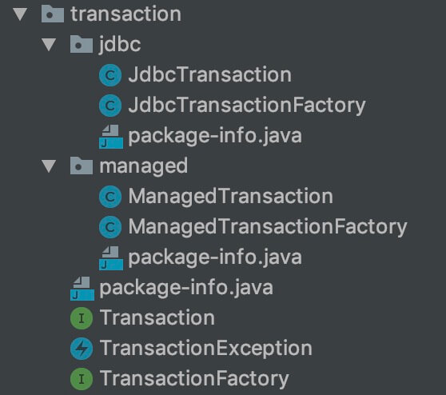
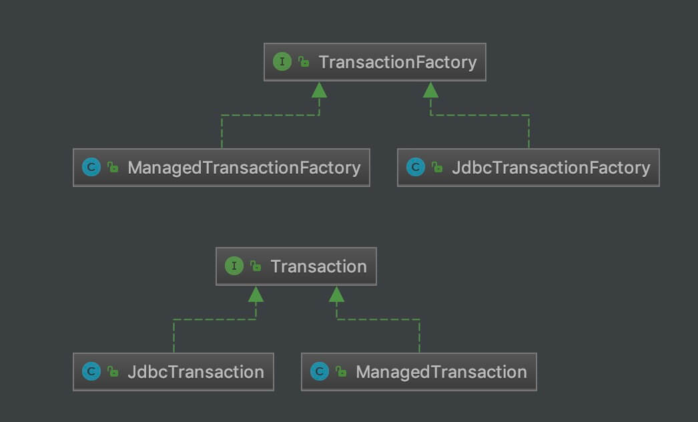

## 1. 概述

本文，我们来分享 MyBatis 的事务模块，对应 transaction 包。如下图所示：



在 [《精尽 MyBatis 源码解析 —— 项目结构一览》](http://svip.iocoder.cn/MyBatis/intro) 中，简单介绍了这个模块如下：

> MyBatis 对数据库中的事务进行了抽象，其自身提供了**相应的事务接口和简单实现**。
>
> 在很多场景中，MyBatis 会与 Spring 框架集成，并由 **Spring 框架管理事务**。

本文涉及的类如下图所示：



下面，我们就一起来看看具体的源码实现。

## 2. Transaction

`org.apache.ibatis.transaction.Transaction` ，事务接口。代码如下：

```java
// Transaction.java

public interface Transaction {

    /**
     * 获得连接
     * 
     * Retrieve inner database connection
     *
     * @return DataBase connection
     * @throws SQLException
     */
    Connection getConnection() throws SQLException;

    /**
     * 事务提交
     * 
     * Commit inner database connection.
     *
     * @throws SQLException
     */
    void commit() throws SQLException;

    /**
     * 事务回滚
     * 
     * Rollback inner database connection.
     *
     * @throws SQLException
     */
    void rollback() throws SQLException;

    /**
     * 关闭连接
     * 
     * Close inner database connection.
     *
     * @throws SQLException
     */
    void close() throws SQLException;

    /**
     * 获得事务超时时间
     * 
     * Get transaction timeout if set
     *
     * @throws SQLException
     */
    Integer getTimeout() throws SQLException;

}
```

连接相关

* `#getConnection()` 方法，获得连接。
* `#close()` 方法，关闭连接。

事务相关

* `#commit()` 方法，事务提交。
* `#rollback()` 方法，事务回滚。
* `#getTimeout()` 方法，事务超时时间。实际上，目前这个方法都是空实现。

### 2.1 JdbcTransaction

`org.apache.ibatis.transaction.jdbc.JdbcTransaction` ，实现 Transaction 接口，基于 JDBC 的事务实现类。代码如下：

```java
// JdbcTransaction.java

public class JdbcTransaction implements Transaction {

    private static final Log log = LogFactory.getLog(JdbcTransaction.class);

    /**
     * Connection 对象
     */
    protected Connection connection;
    /**
     * DataSource 对象
     */
    protected DataSource dataSource;
    /**
     * 事务隔离级别
     */
    protected TransactionIsolationLevel level;
    /**
     * 是否自动提交
     */
    protected boolean autoCommit;

    public JdbcTransaction(DataSource ds, TransactionIsolationLevel desiredLevel, boolean desiredAutoCommit) {
        dataSource = ds;
        level = desiredLevel;
        autoCommit = desiredAutoCommit;
    }

    public JdbcTransaction(Connection connection) {
        this.connection = connection;
    }

    @Override
    public Connection getConnection() throws SQLException {
        // 连接为空，进行创建
        if (connection == null) {
            openConnection();
        }
        return connection;
    }

    @Override
    public void commit() throws SQLException {
        // 非自动提交，则执行提交事务
        if (connection != null && !connection.getAutoCommit()) {
            if (log.isDebugEnabled()) {
                log.debug("Committing JDBC Connection [" + connection + "]");
            }
            connection.commit();
        }
    }

    @Override
    public void rollback() throws SQLException {
        // 非自动提交。则回滚事务
        if (connection != null && !connection.getAutoCommit()) {
            if (log.isDebugEnabled()) {
                log.debug("Rolling back JDBC Connection [" + connection + "]");
            }
            connection.rollback();
        }
    }

    @Override
    public void close() throws SQLException {
        if (connection != null) {
            // 重置连接为自动提交
            resetAutoCommit();
            if (log.isDebugEnabled()) {
                log.debug("Closing JDBC Connection [" + connection + "]");
            }
            // 关闭连接
            connection.close();
        }
    }

    /**
     * 设置指定的 autoCommit 属性
     *
     * @param desiredAutoCommit 指定的 autoCommit 属性
     */
    protected void setDesiredAutoCommit(boolean desiredAutoCommit) {
        try {
            if (connection.getAutoCommit() != desiredAutoCommit) {
                if (log.isDebugEnabled()) {
                    log.debug("Setting autocommit to " + desiredAutoCommit + " on JDBC Connection [" + connection + "]");
                }
                connection.setAutoCommit(desiredAutoCommit);
            }
        } catch (SQLException e) {
            // Only a very poorly implemented driver would fail here,
            // and there's not much we can do about that.
            throw new TransactionException("Error configuring AutoCommit.  "
                    + "Your driver may not support getAutoCommit() or setAutoCommit(). "
                    + "Requested setting: " + desiredAutoCommit + ".  Cause: " + e, e);
        }
    }

    /**
     * 重置 autoCommit 属性
     */
    protected void resetAutoCommit() {
        try {
            if (!connection.getAutoCommit()) {
                // MyBatis does not call commit/rollback on a connection if just selects were performed.
                // Some databases start transactions with select statements
                // and they mandate a commit/rollback before closing the connection.
                // A workaround is setting the autocommit to true before closing the connection.
                // Sybase throws an exception here.
                if (log.isDebugEnabled()) {
                    log.debug("Resetting autocommit to true on JDBC Connection [" + connection + "]");
                }
                connection.setAutoCommit(true);
            }
        } catch (SQLException e) {
            if (log.isDebugEnabled()) {
                log.debug("Error resetting autocommit to true "
                        + "before closing the connection.  Cause: " + e);
            }
        }
    }

    /**
     * 获得 Connection 对象
     *
     * @throws SQLException 获得失败
     */
    protected void openConnection() throws SQLException {
        if (log.isDebugEnabled()) {
            log.debug("Opening JDBC Connection");
        }
        // 获得连接
        connection = dataSource.getConnection();
        // 设置隔离级别
        if (level != null) {
            connection.setTransactionIsolation(level.getLevel());
        }
        // 设置 autoCommit 属性
        setDesiredAutoCommit(autoCommit);
    }

    @Override
    public Integer getTimeout() throws SQLException {
        return null;
    }

}
```

### 2.2 ManagedTransaction

`org.apache.ibatis.transaction.managed.ManagedTransaction` ，实现 Transaction 接口，基于容器管理的事务实现类。代码如下：

```java
// ManagedTransaction.java

public class ManagedTransaction implements Transaction {

    private static final Log log = LogFactory.getLog(ManagedTransaction.class);

    /**
     * Connection 对象
     */
    private Connection connection;
    /**
     * DataSource 对象
     */
    private DataSource dataSource;
    /**
     * 事务隔离级别
     */
    private TransactionIsolationLevel level;
    /**
     * 是否关闭连接
     *
     * 这个属性是和 {@link org.apache.ibatis.transaction.jdbc.JdbcTransaction} 不同的
     */
    private final boolean closeConnection;

    public ManagedTransaction(Connection connection, boolean closeConnection) {
        this.connection = connection;
        this.closeConnection = closeConnection;
    }

    public ManagedTransaction(DataSource ds, TransactionIsolationLevel level, boolean closeConnection) {
        this.dataSource = ds;
        this.level = level;
        this.closeConnection = closeConnection;
    }

    @Override
    public Connection getConnection() throws SQLException {
        // 连接为空，进行创建
        if (this.connection == null) {
            openConnection();
        }
        return this.connection;
    }

    @Override
    public void commit() throws SQLException {
        // Does nothing
    }

    @Override
    public void rollback() throws SQLException {
        // Does nothing
    }

    @Override
    public void close() throws SQLException {
        // 如果开启关闭连接功能，则关闭连接
        if (this.closeConnection && this.connection != null) {
            if (log.isDebugEnabled()) {
                log.debug("Closing JDBC Connection [" + this.connection + "]");
            }
            this.connection.close();
        }
    }

    protected void openConnection() throws SQLException {
        if (log.isDebugEnabled()) {
            log.debug("Opening JDBC Connection");
        }
        // 获得连接
        this.connection = this.dataSource.getConnection();
        // 设置隔离级别
        if (this.level != null) {
            this.connection.setTransactionIsolation(this.level.getLevel());
        }
    }

    @Override
    public Integer getTimeout() throws SQLException {
        return null;
    }

}
```

和 JdbcTransaction 相比，少了 `autoCommit` 属性，空实现 `#commit()` 和 `#rollback()` 方法。因此，事务的管理，交给了容器。

### 2.3 SpringManagedTransaction

`org.mybatis.spring.transaction.SpringManagedTransaction` ，实现 Transaction 接口，基于 Spring 管理的事务实现类。

## 3. TransactionFactory

`org.apache.ibatis.transaction.TransactionFactory` ，Transaction 工厂接口。代码如下：

```java
// TransactionFactory.java

public interface TransactionFactory {

    /**
     * Sets transaction factory custom properties.
     *
     * 设置工厂的属性
     *
     * @param props 属性
     */
    void setProperties(Properties props);

    /**
     * Creates a {@link Transaction} out of an existing connection.
     *
     * 创建 Transaction 事务
     *
     * @param conn Existing database connection
     * @return Transaction
     * @since 3.1.0
     */
    Transaction newTransaction(Connection conn);

    /**
     * Creates a {@link Transaction} out of a datasource.
     *
     * 创建 Transaction 事务
     *
     * @param dataSource DataSource to take the connection from
     * @param level      Desired isolation level
     * @param autoCommit Desired autocommit
     * @return Transaction
     * @since 3.1.0
     */
    Transaction newTransaction(DataSource dataSource, TransactionIsolationLevel level, boolean autoCommit);

}
```

### 3.1 JdbcTransactionFactory

`org.apache.ibatis.transaction.jdbc.JdbcTransactionFactory` ，实现 TransactionFactory 接口，JdbcTransaction 工厂实现类。代码如下：

```java
// JdbcTransactionFactory.java

public class JdbcTransactionFactory implements TransactionFactory {

    @Override
    public void setProperties(Properties props) {
    }

    @Override
    public Transaction newTransaction(Connection conn) {
        // 创建 JdbcTransaction 对象
        return new JdbcTransaction(conn);
    }

    @Override
    public Transaction newTransaction(DataSource ds, TransactionIsolationLevel level, boolean autoCommit) {
        // 创建 JdbcTransaction 对象
        return new JdbcTransaction(ds, level, autoCommit);
    }

}
```

### 3.2 ManagedTransactionFactory

`org.apache.ibatis.transaction.managed.ManagedTransactionFactory` ，实现 TransactionFactory 接口，ManagedTransaction 工厂实现类。代码如下：

```java
// ManagedTransactionFactory.java

public class ManagedTransactionFactory implements TransactionFactory {

    /**
     * 是否关闭连接
     */
    private boolean closeConnection = true;

    @Override
    public void setProperties(Properties props) {
        // 获得是否关闭连接属性
        if (props != null) {
            String closeConnectionProperty = props.getProperty("closeConnection");
            if (closeConnectionProperty != null) {
                closeConnection = Boolean.valueOf(closeConnectionProperty);
            }
        }
    }

    @Override
    public Transaction newTransaction(Connection conn) {
        // 创建 ManagedTransaction 对象
        return new ManagedTransaction(conn, closeConnection);
    }

    @Override
    public Transaction newTransaction(DataSource ds, TransactionIsolationLevel level, boolean autoCommit) {
        // Silently ignores autocommit and isolation level, as managed transactions are entirely
        // controlled by an external manager.  It's silently ignored so that
        // code remains portable between managed and unmanaged configurations.
        // 创建 ManagedTransaction 对象
        return new ManagedTransaction(ds, level, closeConnection);
    }

}
```

### 3.3 SpringManagedTransactionFactory

`org.mybatis.spring.transaction.SpringManagedTransactionFactory` ，实现 TransactionFactory 接口，SpringManagedTransaction 工厂实现类。
