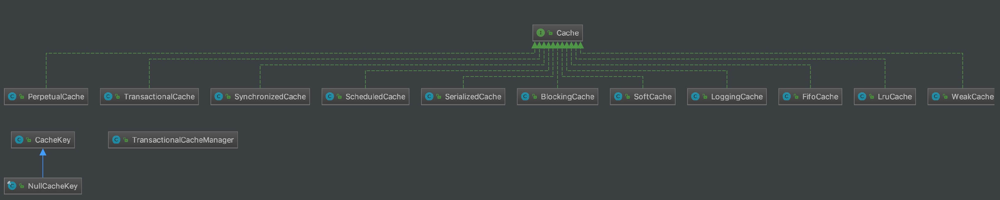

## 1. 概述

本文，我们来分享 MyBatis 的缓存模块，对应 `cache` 包。如下图所示：


在 [《精尽 MyBatis 源码解析 —— 项目结构一览》](http://svip.iocoder.cn/MyBatis/intro) 中，简单介绍了这个模块如下：

> 在优化系统性能时，优化数据库性能是非常重要的一个环节，而添加缓存则是优化数据库时最有效的手段之一。正确、合理地使用缓存可以将一部分数据库请求拦截在缓存这一层。
>
> MyBatis 中提供了**一级缓存和二级缓存**，而这两级缓存都是依赖于基础支持层中的缓 存模块实现的。这里需要读者注意的是，MyBatis 中自带的这两级缓存与 MyBatis 以及整个应用是运行在同一个 JVM 中的，共享同一块堆内存。如果这两级缓存中的数据量较大， 则可能影响系统中其他功能的运行，所以当需要缓存大量数据时，优先考虑使用 Redis、Memcache 等缓存产品。

本文涉及的类如下图所示：



下面，我们就一起来看看具体的源码实现。另外，如果你对 MyBatis 的 Cache 机制不是很了解，可以简单阅读下 [《MyBatis 文档 —— 缓存》](http://www.mybatis.org/mybatis-3/zh/sqlmap-xml.html#cache) 。

## 2. Cache

`org.apache.ibatis.cache.Cache` ，缓存**容器**接口。**注意，它是一个容器，有点类似 HashMap ，可以往其中添加各种缓存**。代码如下：

```java
// Cache.java

public interface Cache {

    /**
     * @return The identifier of this cache 标识
     */
    String getId();

    /**
     * 添加指定键的值
     *
     * @param key Can be any object but usually it is a {@link CacheKey}
     * @param value The result of a select.
     */
    void putObject(Object key, Object value);

    /**
     * 获得指定键的值
     *
     * @param key The key
     * @return The object stored in the cache.
     */
    Object getObject(Object key);

    /**
     * 移除指定键的值
     *
     * As of 3.3.0 this method is only called during a rollback
     * for any previous value that was missing in the cache.
     * This lets any blocking cache to release the lock that
     * may have previously put on the key.
     * A blocking cache puts a lock when a value is null
     * and releases it when the value is back again.
     * This way other threads will wait for the value to be
     * available instead of hitting the database.
     *
     *
     * @param key The key
     * @return Not used
     */
    Object removeObject(Object key);

    /**
     * 清空缓存
     *
     * Clears this cache instance
     */
    void clear();

    /**
     * 获得容器中缓存的数量
     *
     * Optional. This method is not called by the core.
     *
     * @return The number of elements stored in the cache (not its capacity).
     */
    int getSize();

    /**
     * 获得读取写锁。该方法可以忽略了已经。
     *
     * Optional. As of 3.2.6 this method is no longer called by the core.
     *
     * Any locking needed by the cache must be provided internally by the cache provider.
     *
     * @return A ReadWriteLock
     */
    @Deprecated // add by 芋艿
    ReadWriteLock getReadWriteLock();

}
```

Cache 基于不同的**缓存过期策略**、**特性**，有不同的实现类。下面，我们来逐个来看。可以组合**多种** Cache ，实现特性的组合。这种方式，就是常见的设计模式，[《【设计模式读书笔记】装饰者模式》](http://www.iocoder.cn/DesignPattern/xiaomingge/Decorator-Pattern/?vip) 。

### 2.1 PerpetualCache

`org.apache.ibatis.cache.impl.PerpetualCache` ，实现 Cache 接口，**永不过期**的 Cache 实现类，基于 HashMap 实现类。代码如下：

```java
// PerpetualCache.java

public class PerpetualCache implements Cache {

    /**
     * 标识
     */
    private final String id;
    /**
     * 缓存容器
     */
    private Map<Object, Object> cache = new HashMap<>();

    public PerpetualCache(String id) {
        this.id = id;
    }

    @Override
    public String getId() {
        return id;
    }

    @Override
    public int getSize() {
        return cache.size();
    }

    @Override
    public void putObject(Object key, Object value) {
        cache.put(key, value);
    }

    @Override
    public Object getObject(Object key) {
        return cache.get(key);
    }

    @Override
    public Object removeObject(Object key) {
        return cache.remove(key);
    }

    @Override
    public void clear() {
        cache.clear();
    }
    
    // ... 省略 equals 和 hashCode 方法
    
}
```

### 2.2 LoggingCache

`org.apache.ibatis.cache.decorators.LoggingCache` ，实现 Cache 接口，**支持打印日志**的 Cache 实现类。代码如下：

```java
// LoggingCache.java

public class LoggingCache implements Cache {

    /**
     * MyBatis Log 对象
     */
    private final Log log;
    /**
     * 装饰的 Cache 对象
     */
    private final Cache delegate;
    /**
     * 统计请求缓存的次数
     */
    protected int requests = 0;
    /**
     * 统计命中缓存的次数
     */
    protected int hits = 0;

    public LoggingCache(Cache delegate) {
        this.delegate = delegate;
        this.log = LogFactory.getLog(getId());
    }

    @Override
    public String getId() {
        return delegate.getId();
    }

    @Override
    public int getSize() {
        return delegate.getSize();
    }

    @Override
    public void putObject(Object key, Object object) {
        delegate.putObject(key, object);
    }

    @Override
    public Object getObject(Object key) {
        // 请求次数 ++
        requests++;
        // 获得缓存
        final Object value = delegate.getObject(key);
        // 如果命中缓存，则命中次数 ++
        if (value != null) {
            hits++;
        }
        if (log.isDebugEnabled()) {
            log.debug("Cache Hit Ratio [" + getId() + "]: " + getHitRatio());
        }
        return value;
    }

    @Override
    public Object removeObject(Object key) {
        return delegate.removeObject(key);
    }

    @Override
    public void clear() {
        delegate.clear();
    }

    /**
     * @return 命中比率
     */
    private double getHitRatio() {
        return (double) hits / (double) requests;
    }

    // ... 省略 equals 和 hashCode 方法
    
}
```

`delegate` 属性，被装饰的 Cache 对象。

在 `#getObject(Object key)` 方法，增加了 `requests` 和 `hits` 的计数，从而实现命中比率的统计，即 `#getHitRatio()` 方法。

### 2.3 BlockingCache

`org.apache.ibatis.cache.decoratorsBlockingCache` ，实现 Cache 接口，**阻塞的** Cache 实现类。

这里的阻塞比较特殊，当线程去获取缓存值时，如果不存在，则会阻塞后续的其他线程去获取该缓存。

为什么这么有这样的设计呢？因为当线程 A 在获取不到缓存值时，一般会去设置对应的缓存值，这样就避免其他也需要该缓存的线程 B、C 等，重复添加缓存。

代码如下：

```java
// BlockingCache.java

public class BlockingCache implements Cache {

    /**
     * 阻塞等待超时时间
     */
    private long timeout;
    /**
     * 装饰的 Cache 对象
     */
    private final Cache delegate;
    /**
     * 缓存键与 ReentrantLock 对象的映射
     */
    private final ConcurrentHashMap<Object, ReentrantLock> locks;

    public BlockingCache(Cache delegate) {
        this.delegate = delegate;
        this.locks = new ConcurrentHashMap<>();
    }

    @Override
    public String getId() {
        return delegate.getId();
    }

    @Override
    public int getSize() {
        return delegate.getSize();
    }

    @Override
    public void putObject(Object key, Object value) {
        try {
            // <2.1> 添加缓存
            delegate.putObject(key, value);
        } finally {
            // <2.2> 释放锁
            releaseLock(key);
        }
    }

    @Override
    public Object getObject(Object key) {
        // <1.1> 获得锁
        acquireLock(key);
        // <1.2> 获得缓存值
        Object value = delegate.getObject(key);
        // <1.3> 释放锁
        if (value != null) {
            releaseLock(key);
        }
        return value;
    }

    @Override
    public Object removeObject(Object key) {
        // despite of its name, this method is called only to release locks
        // 释放锁
        releaseLock(key);
        return null;
    }

    @Override
    public void clear() {
        delegate.clear();
    }

    @Override
    public ReadWriteLock getReadWriteLock() {
        return null;
    }

    /**
     * 获得 ReentrantLock 对象。如果不存在，进行添加
     *
     * @param key 缓存键
     * @return ReentrantLock 对象
     */
    private ReentrantLock getLockForKey(Object key) {
        ReentrantLock lock = new ReentrantLock();
        ReentrantLock previous = locks.putIfAbsent(key, lock);
        return previous == null ? lock : previous;
    }

    private void acquireLock(Object key) {
        // 获得 ReentrantLock 对象。
        Lock lock = getLockForKey(key);
        // 获得锁，直到超时
        if (timeout > 0) {
            try {
                boolean acquired = lock.tryLock(timeout, TimeUnit.MILLISECONDS);
                if (!acquired) {
                    throw new CacheException("Couldn't get a lock in " + timeout + " for the key " + key + " at the cache " + delegate.getId());
                }
            } catch (InterruptedException e) {
                throw new CacheException("Got interrupted while trying to acquire lock for key " + key, e);
            }
        } else {
            // 释放锁
            lock.lock();
        }
    }

    private void releaseLock(Object key) {
        // 获得 ReentrantLock 对象
        ReentrantLock lock = locks.get(key);
        // 如果当前线程持有，进行释放
        if (lock.isHeldByCurrentThread()) {
            lock.unlock();
        }
    }

    public long getTimeout() {
        return timeout;
    }

    public void setTimeout(long timeout) {
        this.timeout = timeout;
    }

}
```

* `locks` 属性，缓存键与 ReentrantLock 对象的映射。
  * `#getLockForKey(Object key)` 方法，获得 ReentrantLock 对象。如果不存在，进行添加。
  * `#acquireLock(Object key)` 方法，锁定 ReentrantLock 对象。
  * `#releaseLock(Object key)` 方法，释放 ReentrantLock 对象。
* `#getObject(Object key)` 方法：
  * `<1.1>` 处，首先会获得锁。这样其它线程来获取该值时，将被阻塞等待。那岂不是有问题？答案在 `<1.3>` 处。
  * `<1.2>` 处，然后，获得缓存值。
  * `<1.3>` 处，获得缓存值**成功**时，会释放锁，这样被阻塞等待的其他线程就可以去获取缓存了。但是，如果获得缓存值**失败**时，就需要在 `#putObject(Object key, Object value)` 方法中，添加缓存时，才会释放锁，这样被阻塞等待的其它线程就不会重复添加缓存了。
* `#putObject(Object key, Object value)` 方法：
  * `<2.1>` 处，添加缓存。
  * `<2.2>` 处，释放锁。
* `#removeObject(Object key)` 方法，它很**特殊**，和方法名字有所“冲突”，不会移除对应的缓存，只会移除锁。

### 2.4 SynchronizedCache

`org.apache.ibatis.cache.decorators.SynchronizedCache` ，实现 Cache 接口，**同步**的 Cache 实现类。代码如下：

```java
// SynchronizedCache.java

public class SynchronizedCache implements Cache {

    /**
     * 装饰的 Cache 对象
     */
    private final Cache delegate;

    public SynchronizedCache(Cache delegate) {
        this.delegate = delegate;
    }

    @Override
    public String getId() {
        return delegate.getId();
    }

    @Override // 同步
    public synchronized int getSize() {
        return delegate.getSize();
    }

    @Override // 同步
    public synchronized void putObject(Object key, Object object) {
        delegate.putObject(key, object);
    }

    @Override // 同步
    public synchronized Object getObject(Object key) {
        return delegate.getObject(key);
    }

    @Override // 同步
    public synchronized Object removeObject(Object key) {
        return delegate.removeObject(key);
    }

    @Override // 同步
    public synchronized void clear() {
        delegate.clear();
    }

    // ... 省略 equals 和 hashCode 方法

}
```

比较简单，相应的方法，添加了 `synchronized` 修饰符。

### 2.5 SerializedCache

`org.apache.ibatis.cache.decorators.SerializedCache` ，实现 Cache 接口，**支持序列化值**的 Cache 实现类。代码如下：

```java
// SerializedCache.java

public class SerializedCache implements Cache {

    /**
     * 装饰的 Cache 对象
     */
    private final Cache delegate;

    public SerializedCache(Cache delegate) {
        this.delegate = delegate;
    }

    @Override
    public String getId() {
        return delegate.getId();
    }

    @Override
    public int getSize() {
        return delegate.getSize();
    }

    @Override
    public void putObject(Object key, Object object) {
        if (object == null || object instanceof Serializable) {
            delegate.putObject(key, serialize((Serializable) object)); // 序列化
        } else {
            throw new CacheException("SharedCache failed to make a copy of a non-serializable object: " + object);
        }
    }

    @Override
    public Object getObject(Object key) {
        Object object = delegate.getObject(key);
        return object == null ? null : deserialize((byte[]) object); // 反序列化
    }

    @Override
    public Object removeObject(Object key) {
        return delegate.removeObject(key);
    }

    @Override
    public void clear() {
        delegate.clear();
    }

    // ... 省略 equals 和 hashCode 方法

    private byte[] serialize(Serializable value) {
        try (ByteArrayOutputStream bos = new ByteArrayOutputStream();
             ObjectOutputStream oos = new ObjectOutputStream(bos)) {
            oos.writeObject(value);
            oos.flush();
            return bos.toByteArray();
        } catch (Exception e) {
            throw new CacheException("Error serializing object.  Cause: " + e, e);
        }
    }

    private Serializable deserialize(byte[] value) {
        Serializable result;
        try (ByteArrayInputStream bis = new ByteArrayInputStream(value);
             ObjectInputStream ois = new CustomObjectInputStream(bis)) {
            result = (Serializable) ois.readObject();
        } catch (Exception e) {
            throw new CacheException("Error deserializing object.  Cause: " + e, e);
        }
        return result;
    }

    public static class CustomObjectInputStream extends ObjectInputStream {

        public CustomObjectInputStream(InputStream in) throws IOException {
            super(in);
        }

        @Override
        protected Class<?> resolveClass(ObjectStreamClass desc) throws IOException, ClassNotFoundException {
            return Resources.classForName(desc.getName()); // 解析类
        }

    }

}
```

### 2.6 ScheduledCache

`org.apache.ibatis.cache.decorators.ScheduledCache` ，实现 Cache 接口，**定时清空整个容器**的 Cache 实现类。代码如下：

```java
// ScheduledCache.java

public class ScheduledCache implements Cache {

    /**
     * 被装饰的 Cache 对象
     */
    private final Cache delegate;
    /**
     * 清空间隔，单位：毫秒
     */
    protected long clearInterval;
    /**
     * 最后清空时间，单位：毫秒
     */
    protected long lastClear;

    public ScheduledCache(Cache delegate) {
        this.delegate = delegate;
        this.clearInterval = 60 * 60 * 1000; // 1 hour
        this.lastClear = System.currentTimeMillis();
    }

    public void setClearInterval(long clearInterval) {
        this.clearInterval = clearInterval;
    }

    @Override
    public String getId() {
        return delegate.getId();
    }

    @Override
    public int getSize() {
        // 判断是否要全部清空
        clearWhenStale();
        return delegate.getSize();
    }

    @Override
    public void putObject(Object key, Object object) {
        // 判断是否要全部清空
        clearWhenStale();
        delegate.putObject(key, object);
    }

    @Override
    public Object getObject(Object key) {
        // 判断是否要全部清空
        return clearWhenStale() ? null : delegate.getObject(key); // 获得值
    }

    @Override
    public Object removeObject(Object key) {
        // 判断是否要全部清空
        clearWhenStale();
        return delegate.removeObject(key);
    }

    @Override
    public void clear() {
        // 记录清空时间
        lastClear = System.currentTimeMillis();
        // 全部清空
        delegate.clear();
    }

    @Override
    public ReadWriteLock getReadWriteLock() {
        return null;
    }

    @Override
    public int hashCode() {
        return delegate.hashCode();
    }

    @Override
    public boolean equals(Object obj) {
        return delegate.equals(obj);
    }

    /**
     * 判断是否要全部清空
     *
     * @return 是否全部清空
     */
    private boolean clearWhenStale() {
        // 判断是否要全部清空
        if (System.currentTimeMillis() - lastClear > clearInterval) {
            // 清空
            clear();
            return true;
        }
        return false;
    }

}
```

每次缓存操作时，都调用 `#clearWhenStale()` 方法，根据情况，是否清空全部缓存。

### 2.7 FifoCache

`org.apache.ibatis.cache.decorators.FifoCache` ，实现 Cache 接口，**基于先进先出的淘汰机制**的 Cache 实现类。代码如下：

```java
// FifoCache.java

public class FifoCache implements Cache {

    /**
     * 装饰的 Cache 对象
     */
    private final Cache delegate;
    /**
     * 双端队列，记录缓存键的添加
     */
    private final Deque<Object> keyList;
    /**
     * 队列上限
     */
    private int size;

    public FifoCache(Cache delegate) {
        this.delegate = delegate;
        this.keyList = new LinkedList<>(); // 使用了 LinkedList
        this.size = 1024; // 默认为 1024
    }

    @Override
    public String getId() {
        return delegate.getId();
    }

    @Override
    public int getSize() {
        return delegate.getSize();
    }

    public void setSize(int size) {
        this.size = size;
    }

    @Override
    public void putObject(Object key, Object value) {
        // 循环 keyList
        cycleKeyList(key);
        delegate.putObject(key, value);
    }

    @Override
    public Object getObject(Object key) {
        return delegate.getObject(key);
    }

    @Override
    public Object removeObject(Object key) {
        // <2> 此处，理论应该也要移除 keyList 呀
        return delegate.removeObject(key);
    }

    @Override
    public void clear() {
        delegate.clear();
        keyList.clear();
    }

    @Override
    public ReadWriteLock getReadWriteLock() {
        return null;
    }

    private void cycleKeyList(Object key) {
        // <1> 添加到 keyList 对位
        keyList.addLast(key);
        // 超过上限，将队首位移除
        if (keyList.size() > size) {
            Object oldestKey = keyList.removeFirst();
            delegate.removeObject(oldestKey);
        }
    }

}
```

目前 FifoCache 的逻辑实现上，有一定的问题，主要有两点。

`<1>` 处，如果重复添加一个缓存，那么在 `keyList` 里会存储两个，占用了缓存上限的两个名额。

`<2>` 处，在移除指定缓存时，不会移除 `keyList` 里占用的一个名额。

### 2.8 LruCache

`org.apache.ibatis.cache.decorators.LruCache` ，实现 Cache 接口，**基于最少使用的淘汰机制**的 Cache 实现类。代码如下：

```java
// LruCache.java

public class LruCache implements Cache {

    /**
     * 装饰的 Cache 对象
     */
    private final Cache delegate;
    /**
     * 基于 LinkedHashMap 实现淘汰机制
     */
    private Map<Object, Object> keyMap;
    /**
     * 最老的键，即要被淘汰的
     */
    private Object eldestKey;

    public LruCache(Cache delegate) {
        this.delegate = delegate;
        // 初始化 keyMap 对象
        setSize(1024);
    }

    @Override
    public String getId() {
        return delegate.getId();
    }

    @Override
    public int getSize() {
        return delegate.getSize();
    }

    public void setSize(final int size) {
        // LinkedHashMap的一个构造函数，当参数accessOrder为true时，即会按照访问顺序排序，最近访问的放在最前，最早访问的放在后面
        keyMap = new LinkedHashMap<Object, Object>(size, .75F, true) { //

            private static final long serialVersionUID = 4267176411845948333L;

            // LinkedHashMap自带的判断是否删除最老的元素方法，默认返回false，即不删除老数据
            // 我们要做的就是重写这个方法，当满足一定条件时删除老数据
            @Override
            protected boolean removeEldestEntry(Map.Entry<Object, Object> eldest) {
                boolean tooBig = size() > size;
                if (tooBig) {
                    eldestKey = eldest.getKey();
                }
                return tooBig;
            }

        };
    }

    @Override
    public void putObject(Object key, Object value) {
        // 添加到缓存
        delegate.putObject(key, value);
        // 循环 keyMap
        cycleKeyList(key);
    }

    @Override
    public Object getObject(Object key) {
        // 刷新 keyMap 的访问顺序
        keyMap.get(key); // touch
        // 获得缓存值
        return delegate.getObject(key);
    }

    @Override
    public Object removeObject(Object key) {
        return delegate.removeObject(key);
    }

    @Override
    public void clear() {
        delegate.clear();
        keyMap.clear();
    }

    @Override
    public ReadWriteLock getReadWriteLock() {
        return null;
    }

    private void cycleKeyList(Object key) {
        // 添加到 keyMap 中
        keyMap.put(key, key);
        // 如果超过上限，则从 delegate 中，移除最少使用的那个
        if (eldestKey != null) {
            delegate.removeObject(eldestKey);
            eldestKey = null; // 置空
        }
    }

}
```

实现的原理，胖友可以看看 [《LRU缓存实现(Java)》](https://www.cnblogs.com/lzrabbit/p/3734850.html) 这篇文章，主要是对于 LinkedHashMap 的黑科技用法。

### 2.9 WeakCache

`org.apache.ibatis.cache.decorators.WeakCache` ，实现 Cache 接口，基于 `java.lang.ref.WeakReference` 的 Cache 实现类。代码如下：

```java
// WeakCache.java

public class WeakCache implements Cache {

    /**
     * 强引用的键的队列
     */
    private final Deque<Object> hardLinksToAvoidGarbageCollection;
    /**
     * {@link #hardLinksToAvoidGarbageCollection} 的大小
     */
    private int numberOfHardLinks;
    /**
     * 被 GC 回收的 WeakEntry 集合，避免被 GC。
     */
    private final ReferenceQueue<Object> queueOfGarbageCollectedEntries;
    /**
     * 装饰的 Cache 对象
     */
    private final Cache delegate;

    public WeakCache(Cache delegate) {
        this.delegate = delegate;
        this.numberOfHardLinks = 256;
        this.hardLinksToAvoidGarbageCollection = new LinkedList<>();
        this.queueOfGarbageCollectedEntries = new ReferenceQueue<>();
    }

    @Override
    public String getId() {
        return delegate.getId();
    }

    @Override
    public int getSize() {
        // 移除已经被 GC 回收的 WeakEntry
        removeGarbageCollectedItems();
        return delegate.getSize();
    }

    public void setSize(int size) {
        this.numberOfHardLinks = size;
    }

    @Override
    public void putObject(Object key, Object value) {
        // 移除已经被 GC 回收的 WeakEntry
        removeGarbageCollectedItems();
        // 添加到 delegate 中
        delegate.putObject(key, new WeakEntry(key, value, queueOfGarbageCollectedEntries));
    }

    @Override
    public Object getObject(Object key) {
        Object result = null;
        @SuppressWarnings("unchecked") // assumed delegate cache is totally managed by this cache
        // 获得值的 WeakReference 对象
        WeakReference<Object> weakReference = (WeakReference<Object>) delegate.getObject(key);
        if (weakReference != null) {
            // 获得值
            result = weakReference.get();
            // 为空，从 delegate 中移除 。为空的原因是，意味着已经被 GC 回收
            if (result == null) {
                delegate.removeObject(key);
            // 非空，添加到 hardLinksToAvoidGarbageCollection 中，避免被 GC
            } else {
                // 添加到 hardLinksToAvoidGarbageCollection 的队头
                hardLinksToAvoidGarbageCollection.addFirst(result);
                // 超过上限，移除 hardLinksToAvoidGarbageCollection 的队尾
                if (hardLinksToAvoidGarbageCollection.size() > numberOfHardLinks) {
                    hardLinksToAvoidGarbageCollection.removeLast();
                }
            }
        }
        return result;
    }

    @Override
    public Object removeObject(Object key) {
        // 移除已经被 GC 回收的 WeakEntry
        removeGarbageCollectedItems();
        // 移除出 delegate
        return delegate.removeObject(key);
    }

    @Override
    public void clear() {
        // 清空 hardLinksToAvoidGarbageCollection
        hardLinksToAvoidGarbageCollection.clear();
        // 移除已经被 GC 回收的 WeakEntry
        removeGarbageCollectedItems();
        // 清空 delegate
        delegate.clear();
    }

    @Override
    public ReadWriteLock getReadWriteLock() {
        return null;
    }

    /**
     * 移除已经被 GC 回收的键
     */
    private void removeGarbageCollectedItems() {
        WeakEntry sv;
        while ((sv = (WeakEntry) queueOfGarbageCollectedEntries.poll()) != null) {
            delegate.removeObject(sv.key);
        }
    }

    private static class WeakEntry extends WeakReference<Object> {

        /**
         * 键
         */
        private final Object key;

        private WeakEntry(Object key, Object value, ReferenceQueue<Object> garbageCollectionQueue) {
            super(value, garbageCollectionQueue);
            this.key = key;
        }

    }

}
```

* 因为有些胖友，对 Java 的四种引用类型不是很熟悉，推荐先阅读下 [《Java 中的四种引用类型》](https://juejin.im/post/5a5129f5f265da3e317dfc08) ，很有趣！！！
* WeakEntry ，继承 WeakReference 类，因为要多定一个 `key` 属性，代表**缓存键**。
* `#removeGarbageCollectedItems()` 方法，从 `delegate` 中移除已经被 GC 回收的 WeakEntry 。为什么能这样做呢？答案见 `#putObject(Object key, Object value)` 方法。
* `#putObject(Object key, Object value)` 方法，我们可以看到，添加到 `delegate` 中的值是创建的 WeakEntry 对象，并且 WeakEntry 对象的 `garbageCollectionQueue` 属性为 `queueOfGarbageCollectedEntries` 。也就说，如果 WeakEntry 对象被 GC 时，就会添加到 `queueOfGarbageCollectedEntries` 队列中，那么 `#removeGarbageCollectedItems()` 方法就可以从 `delegate` 中移除已经被 GC 回收的 WeakEntry 。可能胖友会有点懵逼，但是这个真的非常有趣。
* `#getObject(Object key)` 方法：
  * 首先，从 `delegate` 获取键对应的 WeakReference 对象。
  * 如果，值**为空**，说明已经被 GC 掉，只能从 `delegate` 中移除。
  * 如果，值**非空**，为了避免被 GC 掉，所以添加到 `hardLinksToAvoidGarbageCollection` 队**头**。但是，该队列设置了一个上限( `numberOfHardLinks` )，避免队列无限大。
  * 另外，这里添加到 `hardLinksToAvoidGarbageCollection` 队**头**应该是有问题的。因为，可能存在**重复**添加，如果获取相同的键。

### 2.10 SoftCache

`org.apache.ibatis.cache.decorators.SoftCache` ，实现 Cache 接口，基于 `java.lang.ref.SoftReference` 的 Cache 实现类。代码如下：

```java
// SoftCache.java

public class SoftCache implements Cache {

    /**
     * 强引用的键的队列
     */
    private final Deque<Object> hardLinksToAvoidGarbageCollection;
    /**
     * {@link #hardLinksToAvoidGarbageCollection} 的大小
     */
    private int numberOfHardLinks;
    /**
     * 被 GC 回收的 WeakEntry 集合，避免被 GC。
     */
    private final ReferenceQueue<Object> queueOfGarbageCollectedEntries;
    /**
     * 装饰的 Cache 对象
     */
    private final Cache delegate;


    public SoftCache(Cache delegate) {
        this.delegate = delegate;
        this.numberOfHardLinks = 256;
        this.hardLinksToAvoidGarbageCollection = new LinkedList<>();
        this.queueOfGarbageCollectedEntries = new ReferenceQueue<>();
    }

    @Override
    public String getId() {
        return delegate.getId();
    }

    @Override
    public int getSize() {
        removeGarbageCollectedItems();
        return delegate.getSize();
    }


    public void setSize(int size) {
        this.numberOfHardLinks = size;
    }

    @Override
    public void putObject(Object key, Object value) {
        // 移除已经被 GC 回收的 SoftEntry
        removeGarbageCollectedItems();
        delegate.putObject(key, new SoftEntry(key, value, queueOfGarbageCollectedEntries));
    }

    @Override
    public Object getObject(Object key) {
        Object result = null;
        @SuppressWarnings("unchecked") // assumed delegate cache is totally managed by this cache
        // 获得值的 WeakReference 对象
        SoftReference<Object> softReference = (SoftReference<Object>) delegate.getObject(key);
        if (softReference != null) {
            // 获得值
            result = softReference.get();
            // 为空，从 delegate 中移除 。为空的原因是，意味着已经被 GC 回收
            if (result == null) {
                delegate.removeObject(key);
            // 非空，添加到 hardLinksToAvoidGarbageCollection 中，避免被 GC
            } else {
                // See #586 (and #335) modifications need more than a read lock
                // 添加到 hardLinksToAvoidGarbageCollection 的队头
                synchronized (hardLinksToAvoidGarbageCollection) {
                    hardLinksToAvoidGarbageCollection.addFirst(result);
                    // 超过上限，移除 hardLinksToAvoidGarbageCollection 的队尾
                    if (hardLinksToAvoidGarbageCollection.size() > numberOfHardLinks) {
                        hardLinksToAvoidGarbageCollection.removeLast();
                    }
                }
            }
        }
        return result;
    }

    @Override
    public Object removeObject(Object key) {
        // 移除已经被 GC 回收的 SoftEntry
        removeGarbageCollectedItems();
        // 移除出 delegate
        return delegate.removeObject(key);
    }

    @Override
    public void clear() {
        // 清空 hardLinksToAvoidGarbageCollection
        synchronized (hardLinksToAvoidGarbageCollection) {
            hardLinksToAvoidGarbageCollection.clear();
        }
        // 移除已经被 GC 回收的 WeakEntry
        removeGarbageCollectedItems();
        // 清空 delegate
        delegate.clear();
    }

    @Override
    public ReadWriteLock getReadWriteLock() {
        return null;
    }

    private void removeGarbageCollectedItems() {
        SoftEntry sv;
        while ((sv = (SoftEntry) queueOfGarbageCollectedEntries.poll()) != null) {
            delegate.removeObject(sv.key);
        }
    }

    private static class SoftEntry extends SoftReference<Object> {

        /**
         * 键
         */
        private final Object key;

        SoftEntry(Object key, Object value, ReferenceQueue<Object> garbageCollectionQueue) {
            super(value, garbageCollectionQueue);
            this.key = key;
        }
    }

}
```

实现逻辑上，和 WeakCache 是一致的，差异在使用 SoftEntry 替代了 WeakEntry 类。

## 3. CacheKey

`org.apache.ibatis.cache.CacheKey` ，实现 Cloneable、Serializable 接口，缓存键。

因为 MyBatis 中的缓存键不是一个简单的 String ，**而是通过多个对象组成**。所以 CacheKey 可以理解成将多个对象放在一起，计算其缓存键。

### 3.1 构造方法

```java
// CacheKey.java

private static final long serialVersionUID = 1146682552656046210L;

/**
 * 单例 - 空缓存键
 */
public static final CacheKey NULL_CACHE_KEY = new NullCacheKey();

/**
 * 默认 {@link #multiplier} 的值
 */
private static final int DEFAULT_MULTIPLYER = 37;
/**
 * 默认 {@link #hashcode} 的值
 */
private static final int DEFAULT_HASHCODE = 17;

/**
 * hashcode 求值的系数
 */
private final int multiplier;
/**
 * 缓存键的 hashcode
 */
private int hashcode;
/**
 * 校验和
 */
private long checksum;
/**
 * {@link #update(Object)} 的数量
 */
private int count;
// 8/21/2017 - Sonarlint flags this as needing to be marked transient.  While true if content is not serializable, this is not always true and thus should not be marked transient.
/**
 * 计算 {@link #hashcode} 的对象的集合
 */
private List<Object> updateList;

public CacheKey() {
    this.hashcode = DEFAULT_HASHCODE;
    this.multiplier = DEFAULT_MULTIPLYER;
    this.count = 0;
    this.updateList = new ArrayList<>();
}

public CacheKey(Object[] objects) {
    this();
    // 基于 objects ，更新相关属性
    updateAll(objects);
}
```

当构造方法的方法参数为 `Object[] objects` 时，会调用 `#updateAll(Object[] objects)` 方法，更新相关属性。

### 3.2 updateAll

`#updateAll(Object[] objects)` 方法，更新相关属性。代码如下：

```java
// CacheKey.java

public void updateAll(Object[] objects) {
    for (Object o : objects) {
        update(o);
    }
}
```

遍历 `objects` 数组，调用 `#update(Object)` 方法，更新相关属性。代码如下：

```java
// CacheKey.java

public void update(Object object) {
    // 方法参数 object 的 hashcode
    int baseHashCode = object == null ? 1 : ArrayUtil.hashCode(object);

    count++;

    // checksum 为 baseHashCode 的求和
    checksum += baseHashCode;

    // 计算新的 hashcode 值
    baseHashCode *= count;
    hashcode = multiplier * hashcode + baseHashCode;

    // 添加 object 到 updateList 中
    updateList.add(object);
}
```

### 3.3 hashCode

`#hashCode()` 方法，获得 `hashcode` 值。代码如下：

```java
// CacheKey.java

@Override
public int hashCode() {
    return hashcode;
}
```

### 3.4 equals

`#equals(Object object)` 方法，比较是否相等。代码如下：

```java
// CacheKey.java

@Override
public boolean equals(Object object) {
    if (this == object) {
        return true;
    }
    if (!(object instanceof CacheKey)) {
        return false;
    }

    final CacheKey cacheKey = (CacheKey) object;

    if (hashcode != cacheKey.hashcode) {
        return false;
    }
    if (checksum != cacheKey.checksum) {
        return false;
    }
    if (count != cacheKey.count) {
        return false;
    }

    // 比较 updateList 数组
    for (int i = 0; i < updateList.size(); i++) {
        Object thisObject = updateList.get(i);
        Object thatObject = cacheKey.updateList.get(i);
        if (!ArrayUtil.equals(thisObject, thatObject)) {
            return false;
        }
    }
    return true;
}
```

### 3.5 clone

`#clone()` 方法，克隆对象。代码如下：

```java
// CacheKey.java

@Override
public CacheKey clone() throws CloneNotSupportedException {
    // 克隆 CacheKey 对象
    CacheKey clonedCacheKey = (CacheKey) super.clone();
    // 创建 updateList 数组，避免原数组修改
    clonedCacheKey.updateList = new ArrayList<>(updateList);
    return clonedCacheKey;
}
```

### 3.6 NullCacheKey

`org.apache.ibatis.cache.NullCacheKey` ，继承 CacheKey 类，空缓存键。代码如下：

```java
// NullCacheKey.java

public final class NullCacheKey extends CacheKey {

    private static final long serialVersionUID = 3704229911977019465L;

    public NullCacheKey() {
        super();
    }

    @Override
    public void update(Object object) {
        throw new CacheException("Not allowed to update a NullCacheKey instance.");
    }

    @Override
    public void updateAll(Object[] objects) {
        throw new CacheException("Not allowed to update a NullCacheKey instance.");
    }

}
```

## 4. 二级缓存

MyBatis 的二级缓存，和执行器有很大的关联，所以放在 [《精尽 MyBatis 源码分析 —— SQL 执行（一）之 Executor》](http://svip.iocoder.cn/MyBatis/executor-1) 中，统一解析。

* TransactionalCache
* TransactionalCacheManager
