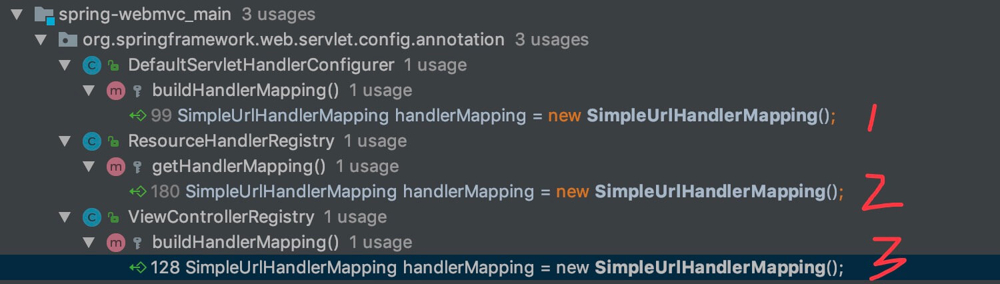

> 这是一篇相对选读的文章，因为 AbstractUrlHandlerMapping ，我们实际开发基本不会涉及。

## 1. 概述

本文接 [《精尽 Spring MVC 源码分析 —— HandlerMapping 组件（一）之 AbstractHandlerMapping》](http://svip.iocoder.cn/Spring-MVC/HandlerMapping-1-AbstractHandlerMapping) 一文，分享 AbstractHandlerMapping 的左半边 **AbstractUrlHandlerMapping** 系，即下图右半边**红色**部分：


一共有五个子类，分成两条线。

- AbstractUrlHandlerMapping <= SimpleUrlHandlerMapping <= WebSocketHandlerMapping 。
- AbstractUrlHandlerMapping <= AbstractDetectingUrlHandlerMapping <= BeanNameUrlHandlerMapping 。

其中，左下角的 WebSocketHandlerMapping 是 `spring-websocket` 项目中的类，本文会无视它。

所以，本文我们实际会是按照 AbstractUrlHandlerMapping、SimpleUrlHandlerMapping、AbstractDetectingUrlHandlerMapping、BeanNameUrlHandlerMapping 进行顺序分享。

## 2. AbstractUrlHandlerMapping

`org.springframework.web.servlet.handler.AbstractUrlHandlerMapping` ，实现 MatchableHandlerMapping 接口，继承 AbstractHandlerMapping 抽象类，以 **URL** 作为 **Handler** 的 HandlerMapping 抽象类，提供 Handler 的获取、注册等等通用的骨架方法。

### 2.1 构造方法

```java
// AbstractUrlHandlerMapping.java

/**
 * 根路径的处理器
 */
@Nullable
private Object rootHandler;

/**
 * 使用后置的 / 匹配
 */
private boolean useTrailingSlashMatch = false;

/**
 * 是否延迟加载处理器
 *
 * 默认，关闭。
 */
private boolean lazyInitHandlers = false;

/**
 * 路径和处理器的映射
 *
 * KEY：路径 {@link #lookupHandler(String, HttpServletRequest)}
 */
private final Map<String, Object> handlerMap = new LinkedHashMap<>();
```

### 2.2 registerHandler

`#registerHandler(String[] urlPaths, String beanName)` 方法，注册多个 URL 的处理器。代码如下：

```java
// AbstractUrlHandlerMapping.java

/**
 * 注册指定 URL 数组的处理器
 *
 * Register the specified handler for the given URL paths.
 * @param urlPaths the URLs that the bean should be mapped to
 * @param beanName the name of the handler bean
 * @throws BeansException if the handler couldn't be registered
 * @throws IllegalStateException if there is a conflicting handler registered
 */
protected void registerHandler(String[] urlPaths, String beanName) throws BeansException, IllegalStateException {
    Assert.notNull(urlPaths, "URL path array must not be null");
    // 遍历 urlPath 数组
    for (String urlPath : urlPaths) {
        // 注册处理器
        registerHandler(urlPath, beanName);
    }
}
```

`#registerHandler(String urlPath, Object handler)` 方法，注册单个 URL 的处理器。代码如下：

```java
// AbstractUrlHandlerMapping.java

/**
 * 注册单个 URL 的处理器
 *
 * Register the specified handler for the given URL path.
 * @param urlPath the URL the bean should be mapped to
 * @param handler the handler instance or handler bean name String
 * (a bean name will automatically be resolved into the corresponding handler bean)
 * @throws BeansException if the handler couldn't be registered
 * @throws IllegalStateException if there is a conflicting handler registered
 */
protected void registerHandler(String urlPath, Object handler) throws BeansException, IllegalStateException {
    Assert.notNull(urlPath, "URL path must not be null");
    Assert.notNull(handler, "Handler object must not be null");
    Object resolvedHandler = handler;

    // Eagerly resolve handler if referencing singleton via name.
    // <1> 如果非延迟加载，并且 handler 为 String 类型，并且还是单例，则去获取 String 对应的 Bean 对象
    if (!this.lazyInitHandlers && handler instanceof String) {
        String handlerName = (String) handler;
        ApplicationContext applicationContext = obtainApplicationContext();
        if (applicationContext.isSingleton(handlerName)) { // 必须是单例
            resolvedHandler = applicationContext.getBean(handlerName);
        }
    }

    // <2> 获得 urlPath 对应的处理器
    Object mappedHandler = this.handlerMap.get(urlPath);
    // <3> 如果已经存在，并且和 resolvedHandler 不同，则抛出 IllegalStateException 异常
    if (mappedHandler != null) {
        if (mappedHandler != resolvedHandler) {
            throw new IllegalStateException(
                    "Cannot map " + getHandlerDescription(handler) + " to URL path [" + urlPath +
                    "]: There is already " + getHandlerDescription(mappedHandler) + " mapped.");
        }
    } else {
        // <4.1> 如果是 / 根路径，则设置为 rootHandler
        if (urlPath.equals("/")) {
            if (logger.isTraceEnabled()) {
                logger.trace("Root mapping to " + getHandlerDescription(handler));
            }
            setRootHandler(resolvedHandler);
        // <4.2> 如果是 /* 路径，则设置为默认处理器
        } else if (urlPath.equals("/*")) {
            if (logger.isTraceEnabled()) {
                logger.trace("Default mapping to " + getHandlerDescription(handler));
            }
            setDefaultHandler(resolvedHandler);
        // <4.3> 添加到 handlerMap 中
        } else {
            this.handlerMap.put(urlPath, resolvedHandler);
            if (logger.isTraceEnabled()) {
                logger.trace("Mapped [" + urlPath + "] onto " + getHandlerDescription(handler));
            }
        }
    }
}
```

`<1>` 处，如果非延迟加载，并且 `handler` 为 String 类型，并且还是单例，则去获取 String 对应的 Bean 对象。

`<2>` 处，获得 `urlPath` 对应的处理器。

`<3>` 处，如果已经存在，并且和 `resolvedHandler` 不同，则抛出 IllegalStateException 异常。

`<4.1>` 处，如果是 `/` 根路径，则设置处理器为 `rootHandler` 。

`<4.2>` 处，如果是 `/*` 路径，则设置处理器为默认处理器。

`<4.3>` 处，添加到 `handlerMap` 中。

### 2.3 getHandlerInternal

实现 `#getHandlerInternal(HttpServletRequest request)` 方法，获得处理器。代码如下：

```java
// AbstractUrlHandlerMapping.java

/**
 * Look up a handler for the URL path of the given request.
 * @param request current HTTP request
 * @return the handler instance, or {@code null} if none found
 */
@Override
@Nullable
protected Object getHandlerInternal(HttpServletRequest request) throws Exception {
    // <1> 获得请求的路径
    String lookupPath = getUrlPathHelper().getLookupPathForRequest(request);
    // <2> 获得处理器
    Object handler = lookupHandler(lookupPath, request);
    // <3> 如果找不到处理器，则使用 rootHandler 或 defaultHandler 处理器
    if (handler == null) {
        // We need to care for the default handler directly, since we need to
        // expose the PATH_WITHIN_HANDLER_MAPPING_ATTRIBUTE for it as well.
        Object rawHandler = null;
        // <3.1> 如果是根路径，则使用 rootHandler 处理器
        if ("/".equals(lookupPath)) {
            rawHandler = getRootHandler();
        }
        // <3.2> 使用默认处理器
        if (rawHandler == null) {
            rawHandler = getDefaultHandler();
        }
        if (rawHandler != null) {
            // Bean name or resolved handler?
            // <3.3> 如果找到的处理器是 String 类型，则从容器中找到 String 对应的 Bean 类型作为处理器。
            if (rawHandler instanceof String) {
                String handlerName = (String) rawHandler;
                rawHandler = obtainApplicationContext().getBean(handlerName);
            }
            // <3.4> 空方法，校验处理器。目前暂无子类实现该方法
            validateHandler(rawHandler, request);
            // <3.5> 创建处理器
            handler = buildPathExposingHandler(rawHandler, lookupPath, lookupPath, null);
        }
    }
    return handler;
}
```

`<1>` 处，获得请求的路径。

`<2>` 处，调用 `#lookupHandler(String urlPath, HttpServletRequest request)` 方法，获得处理器。详细解析，见 [「2.4 lookupHandler」](http://svip.iocoder.cn/Spring-MVC/HandlerMapping-4-AbstractUrlHandlerMapping/#) 。

`<3>` 处，如果找不到处理器，则使用 `rootHandler` 或 `defaultHandler` 处理器。

`<3.1>` 处， 如果是**根**路径，则使用 `rootHandler` 处理器。

`<3.2>` 处，使用**默认**处理器。

`<3.3>` 处，如果找到的处理器是 String 类型，则从容器中找到 String 对应的 Bean 类型作为处理器。

`<3.4>` 处，调用 `#validateHandler(Object handler, HttpServletRequest request)` 方法，空方法，校验处理器。目前暂无子类实现该方法。代码如下：

```java
// AbstractUrlHandlerMapping.java

/**
 * Validate the given handler against the current request.
 * <p>The default implementation is empty. Can be overridden in subclasses,
 * for example to enforce specific preconditions expressed in URL mappings.
 * @param handler the handler object to validate
 * @param request current HTTP request
 * @throws Exception if validation failed
 */
protected void validateHandler(Object handler, HttpServletRequest request) throws Exception {
}
```

`<3.5>` 处，调用 `#buildPathExposingHandler(handler, bestMatch, pathWithinMapping, uriTemplateVariables)` 方法，构建暴露路径的 Handler 。详细解析，见 [「2.5 buildPathExposingHandler」](http://svip.iocoder.cn/Spring-MVC/HandlerMapping-4-AbstractUrlHandlerMapping/#) 。

### 2.4 lookupHandler

`#lookupHandler(String urlPath, HttpServletRequest request)` 方法，获得处理器。代码如下：

```java
// AbstractUrlHandlerMapping.java

@Nullable
protected Object lookupHandler(String urlPath, HttpServletRequest request) throws Exception {
    // Direct match?
    // <1.1> 情况一，从 handlerMap 中，直接匹配处理器
    Object handler = this.handlerMap.get(urlPath);
    if (handler != null) {
        // Bean name or resolved handler?
        // <1.2> 如果找到的处理器是 String 类型，则从容器中找到 String 对应的 Bean 类型作为处理器。
        if (handler instanceof String) {
            String handlerName = (String) handler;
            handler = obtainApplicationContext().getBean(handlerName);
        }
        // <1.3> 空方法，校验处理器。目前暂无子类实现该方法
        validateHandler(handler, request);
        // <1.4> 创建处理器
        return buildPathExposingHandler(handler, urlPath, urlPath, null);
    }

    // Pattern match?
    // <2.1> 情况二，Pattern 匹配合适的，并添加到 matchingPatterns 中
    List<String> matchingPatterns = new ArrayList<>();
    for (String registeredPattern : this.handlerMap.keySet()) {
        if (getPathMatcher().match(registeredPattern, urlPath)) {
            matchingPatterns.add(registeredPattern);
        } else if (useTrailingSlashMatch()) {
            if (!registeredPattern.endsWith("/") && getPathMatcher().match(registeredPattern + "/", urlPath)) {
                matchingPatterns.add(registeredPattern +"/");
            }
        }
    }

    // <2.2> 获得首个匹配的结果
    String bestMatch = null;
    Comparator<String> patternComparator = getPathMatcher().getPatternComparator(urlPath);
    if (!matchingPatterns.isEmpty()) {
        matchingPatterns.sort(patternComparator); // 排序
        if (logger.isTraceEnabled() && matchingPatterns.size() > 1) {
            logger.trace("Matching patterns " + matchingPatterns);
        }
        bestMatch = matchingPatterns.get(0);
    }
    if (bestMatch != null) {
        // <2.3> 获得 bestMatch 对应的处理器
        handler = this.handlerMap.get(bestMatch);
        if (handler == null) {
            if (bestMatch.endsWith("/")) {
                handler = this.handlerMap.get(bestMatch.substring(0, bestMatch.length() - 1));
            }
            if (handler == null) { // 如果获得不到，抛出 IllegalStateException 异常
                throw new IllegalStateException(
                        "Could not find handler for best pattern match [" + bestMatch + "]");
            }
        }
        // Bean name or resolved handler?
        // <2.4> 如果找到的处理器是 String 类型，则从容器中找到 String 对应的 Bean 类型作为处理器。
        if (handler instanceof String) {
            String handlerName = (String) handler;
            handler = obtainApplicationContext().getBean(handlerName);
        }
        // <2.5> 空方法，校验处理器。目前暂无子类实现该方法
        validateHandler(handler, request);
        // <2.6> 获得匹配的路径
        String pathWithinMapping = getPathMatcher().extractPathWithinPattern(bestMatch, urlPath);

        // There might be multiple 'best patterns', let's make sure we have the correct URI template variables
        // for all of them
        // <2.7> 获得路径参数集合
        Map<String, String> uriTemplateVariables = new LinkedHashMap<>();
        for (String matchingPattern : matchingPatterns) {
            if (patternComparator.compare(bestMatch, matchingPattern) == 0) {
                Map<String, String> vars = getPathMatcher().extractUriTemplateVariables(matchingPattern, urlPath);
                Map<String, String> decodedVars = getUrlPathHelper().decodePathVariables(request, vars);
                uriTemplateVariables.putAll(decodedVars);
            }
        }
        if (logger.isTraceEnabled() && uriTemplateVariables.size() > 0) {
            logger.trace("URI variables " + uriTemplateVariables);
        }
        // <2.8> 创建处理器
        return buildPathExposingHandler(handler, bestMatch, pathWithinMapping, uriTemplateVariables);
    }

    // <3> No handler found...
    return null;
}
```

逻辑有点长，整体分成两种情况，分别是直接匹配和 Pattern 模式匹配。

============ 情况一：直接匹配 ==========

`<1.1>` 处，从 `handlerMap` 中，**直接匹配**处理器。

`<1.2>` 处，如果找到的处理器是 String 类型，则从容器中找到 String 对应的 Bean 类型作为处理器。

`<1.3>` 处，调用 `#validateHandler(Object handler, HttpServletRequest request)` 方法，空方法，校验处理器。

`<1.4>` 处，调用 `#buildPathExposingHandler(handler, bestMatch, pathWithinMapping, uriTemplateVariables)` 方法，构建暴露路径的 Handler 。详细解析，见 [「2.5 buildPathExposingHandler」](http://svip.iocoder.cn/Spring-MVC/HandlerMapping-4-AbstractUrlHandlerMapping/#) 。

============ 情况二：模式匹配 ==========

`<2.1>` 处，遍历 `handlerMap` 集合，逐个 Pattern 匹配合适的，并添加到 `matchingPatterns` 中。

`<2.2>` 处，获得首个匹配的结果 `patternComparator` 。

`<2.3>` 处，获得 `bestMatch` 对应的处理器。

`<2.4>` 处，如果找到的处理器是 String 类型，则从容器中找到 String 对应的 Bean 类型作为处理器。

`<2.5>` 处，调用 `#validateHandler(Object handler, HttpServletRequest request)` 方法，空方法，校验处理器。

`<2.6>` 处，获得匹配的路径。

`<2.7>` 处，获得路径参数集合 `uriTemplateVariables` 。这块没细看。因为，可能存在多个最佳匹配，所以每个都会比较一次，全部添加到 `uriTemplateVariables` 中。

`<2.8>` 处，调用 `#buildPathExposingHandler(handler, bestMatch, pathWithinMapping, uriTemplateVariables)` 方法，构建暴露路径的 Handler 。详细解析，见 [「2.5 buildPathExposingHandler」](http://svip.iocoder.cn/Spring-MVC/HandlerMapping-4-AbstractUrlHandlerMapping/#) 。

============ 情况三：都不匹配 ==========

`<3>` 处，都不匹配，返回 `null` 。

### 2.5 buildPathExposingHandler

`#buildPathExposingHandler(Object rawHandler, String bestMatchingPattern, String pathWithinMapping, Map<String, String> uriTemplateVariables)` 方法，构建暴露路径的 Handler 。代码如下：

```java
// AbstractUrlHandlerMapping.java

/**
 * Build a handler object for the given raw handler, exposing the actual
 * handler, the {@link #PATH_WITHIN_HANDLER_MAPPING_ATTRIBUTE}, as well as
 * the {@link #URI_TEMPLATE_VARIABLES_ATTRIBUTE} before executing the handler.
 * <p>The default implementation builds a {@link HandlerExecutionChain}
 * with a special interceptor that exposes the path attribute and uri template variables
 * @param rawHandler the raw handler to expose
 * @param pathWithinMapping the path to expose before executing the handler
 * @param uriTemplateVariables the URI template variables, can be {@code null} if no variables found
 * @return the final handler object
 */
protected Object buildPathExposingHandler(Object rawHandler, String bestMatchingPattern,
		String pathWithinMapping, @Nullable Map<String, String> uriTemplateVariables) {
	// <1> 创建 HandlerExecutionChain 对象
	HandlerExecutionChain chain = new HandlerExecutionChain(rawHandler);
	// <2.1> 添加 PathExposingHandlerInterceptor 拦截器，到 chain 中
	chain.addInterceptor(new PathExposingHandlerInterceptor(bestMatchingPattern, pathWithinMapping));
	// <2.2> 添加 UriTemplateVariablesHandlerInterceptor 拦截器，到 chain 中
	if (!CollectionUtils.isEmpty(uriTemplateVariables)) {
		chain.addInterceptor(new UriTemplateVariablesHandlerInterceptor(uriTemplateVariables));
	}
	return chain;
}
```

比较大的特点是，在 `<1>` 处，创建了 HandlerExecutionChain 对象，并且后续在 `<2.1>` 和 `<2.2>` 处，分别添加 PathExposingHandlerInterceptor 和 UriTemplateVariablesHandlerInterceptor 拦截器。用途在于通过这两个拦截器，暴露 `bestMatchingPattern` 和 `uriTemplateVariables` 到请求的属性中。

PathExposingHandlerInterceptor ，继承 HandlerInterceptorAdapter 类，是 AbstractUrlHandlerMapping 的内部类，代码如下：

```java
    // AbstractUrlHandlerMapping.java#PathExposingHandlerInterceptor.java

/**
 * Special interceptor for exposing the
 * {@link AbstractUrlHandlerMapping#PATH_WITHIN_HANDLER_MAPPING_ATTRIBUTE} attribute.
 * @see AbstractUrlHandlerMapping#exposePathWithinMapping
 */
private class PathExposingHandlerInterceptor extends HandlerInterceptorAdapter {

    /**
     * 最佳匹配的路径
     */
    private final String bestMatchingPattern;

    /**
     * 被匹配的路径
     */
    private final String pathWithinMapping;

    public PathExposingHandlerInterceptor(String bestMatchingPattern, String pathWithinMapping) {
        this.bestMatchingPattern = bestMatchingPattern;
        this.pathWithinMapping = pathWithinMapping;
    }

    @Override
    public boolean preHandle(HttpServletRequest request, HttpServletResponse response, Object handler) {
        // 暴露 BEST_MATCHING_PATTERN_ATTRIBUTE、PATH_WITHIN_HANDLER_MAPPING_ATTRIBUTE 属性
        exposePathWithinMapping(this.bestMatchingPattern, this.pathWithinMapping, request);
        // 暴露 INTROSPECT_TYPE_LEVEL_MAPPING 属性
        request.setAttribute(INTROSPECT_TYPE_LEVEL_MAPPING, supportsTypeLevelMappings());
        return true;
    }

}

// AbstractUrlHandlerMapping.java

/**
 * Expose the path within the current mapping as request attribute.
 * @param pathWithinMapping the path within the current mapping
 * @param request the request to expose the path to
 * @see #PATH_WITHIN_HANDLER_MAPPING_ATTRIBUTE
 */
protected void exposePathWithinMapping(String bestMatchingPattern, String pathWithinMapping,
        HttpServletRequest request) {
    request.setAttribute(BEST_MATCHING_PATTERN_ATTRIBUTE, bestMatchingPattern);
    request.setAttribute(PATH_WITHIN_HANDLER_MAPPING_ATTRIBUTE, pathWithinMapping);
}
```

UriTemplateVariablesHandlerInterceptor ，继承 HandlerInterceptorAdapter 类，是 AbstractUrlHandlerMapping 的内部类，代码如下：

```java
// AbstractUrlHandlerMapping.java#PathExposingHandlerInterceptor.java

/**
 * Special interceptor for exposing the
 * {@link AbstractUrlHandlerMapping#URI_TEMPLATE_VARIABLES_ATTRIBUTE} attribute.
 * @see AbstractUrlHandlerMapping#exposePathWithinMapping
 */
private class UriTemplateVariablesHandlerInterceptor extends HandlerInterceptorAdapter {

	private final Map<String, String> uriTemplateVariables;

	public UriTemplateVariablesHandlerInterceptor(Map<String, String> uriTemplateVariables) {
		this.uriTemplateVariables = uriTemplateVariables;
	}

	@Override
	public boolean preHandle(HttpServletRequest request, HttpServletResponse response, Object handler) {
		exposeUriTemplateVariables(this.uriTemplateVariables, request);
		return true;
	}
}

// AbstractUrlHandlerMapping.java

/**
 * Expose the URI templates variables as request attribute.
 * @param uriTemplateVariables the URI template variables
 * @param request the request to expose the path to
 * @see #PATH_WITHIN_HANDLER_MAPPING_ATTRIBUTE
 */
protected void exposeUriTemplateVariables(Map<String, String> uriTemplateVariables, HttpServletRequest request) {
	request.setAttribute(URI_TEMPLATE_VARIABLES_ATTRIBUTE, uriTemplateVariables);
}
```

### 2.6 match

`#match(HttpServletRequest request, String pattern)` 方法，执行匹配。代码如下：

```java
// AbstractUrlHandlerMapping.java

@Override
@Nullable
public RequestMatchResult match(HttpServletRequest request, String pattern) {
	// 获得请求路径
	String lookupPath = getUrlPathHelper().getLookupPathForRequest(request);
	// 模式匹配，若匹配，则返回 RequestMatchResult 对象
	if (getPathMatcher().match(pattern, lookupPath)) {
		return new RequestMatchResult(pattern, lookupPath, getPathMatcher());
	} else if (useTrailingSlashMatch()) {
		if (!pattern.endsWith("/") && getPathMatcher().match(pattern + "/", lookupPath)) {
			return new RequestMatchResult(pattern + "/", lookupPath, getPathMatcher());
		}
	}
	// 不匹配，则返回 null
	return null;
}
```

## 3. SimpleUrlHandlerMapping

`org.springframework.web.servlet.handler.SimpleUrlHandlerMapping` ，继承 AbstractUrlHandlerMapping 抽象类，简单的 简单的 UrlHandlerMapping 实现类。

如果胖友使用 Spring MVC 早，可能看过 [《基于 XML 配置的Spring MVC 简单的 HelloWorld 实例应用》](https://www.cnblogs.com/liuhongfeng/p/4769076.html) 这样的配置。当然，现在基本已经不存在了。因为，被 `@RequestMapping` 注解这样的方式所取代。更多的是 Spring MVC 自己内部的组件可能在使用，例如下图：



### 3.1 构造方法

```java
// SimpleUrlHandlerMapping.java

/**
 * 配置的 URL 与处理器的映射
 *
 * 最终，会调用 {@link #registerHandlers(Map)} 进行注册到 {@link AbstractUrlHandlerMapping#handlerMap} 中
 */
private final Map<String, Object> urlMap = new LinkedHashMap<>();
```

可以通过如下两个方法，设置到 `urlMap` 属性。代码如下：

```java
// SimpleUrlHandlerMapping.java

/**
 * Map URL paths to handler bean names.
 * This is the typical way of configuring this HandlerMapping.
 * <p>Supports direct URL matches and Ant-style pattern matches. For syntax
 * details, see the {@link org.springframework.util.AntPathMatcher} javadoc.
 * @param mappings properties with URLs as keys and bean names as values
 * @see #setUrlMap
 */
public void setMappings(Properties mappings) {
	CollectionUtils.mergePropertiesIntoMap(mappings, this.urlMap);
}

/**
 * Set a Map with URL paths as keys and handler beans (or handler bean names)
 * as values. Convenient for population with bean references.
 * <p>Supports direct URL matches and Ant-style pattern matches. For syntax
 * details, see the {@link org.springframework.util.AntPathMatcher} javadoc.
 * @param urlMap map with URLs as keys and beans as values
 * @see #setMappings
 */
public void setUrlMap(Map<String, ?> urlMap) {
	this.urlMap.putAll(urlMap);
}
```

### 3.2 initApplicationContext

`#initApplicationContext()` 方法，进行初始化。代码如下：

```java
// SimpleUrlHandlerMapping.java

@Override
public void initApplicationContext() throws BeansException {
	// 调用父类方法，进行初始化
	super.initApplicationContext();
	// 将 urlMap 配置，注册处理器
	registerHandlers(this.urlMap);
}
```

调用 `#registerHandlers(Map<String, Object> urlMap)` 方法，将 `urlMap` 配置，注册到处理器。代码如下：

```java
// SimpleUrlHandlerMapping.java

/**
 * Register all handlers specified in the URL map for the corresponding paths.
 * @param urlMap a Map with URL paths as keys and handler beans or bean names as values
 * @throws BeansException if a handler couldn't be registered
 * @throws IllegalStateException if there is a conflicting handler registered
 */
protected void registerHandlers(Map<String, Object> urlMap) throws BeansException {
   // 为空，则仅打印日志
    if (urlMap.isEmpty()) {
		logger.trace("No patterns in " + formatMappingName());
   // 非空，则进行注册
    } else {
		// 遍历 urlMap 数组，逐个注册处理器
		urlMap.forEach((url, handler) -> {
			// Prepend with slash if not already present.
			if (!url.startsWith("/")) { // 附加 / 前缀
				url = "/" + url;
			}
			// Remove whitespace from handler bean name.
			if (handler instanceof String) { // trim 方法，去掉头尾空格
				handler = ((String) handler).trim();
			}
			// 【核心代码】注册处理器
			registerHandler(url, handler);
		});
		// 打印日志
		if (logger.isDebugEnabled()) {
			List<String> patterns = new ArrayList<>();
			if (getRootHandler() != null) {
				patterns.add("/");
			}
			if (getDefaultHandler() != null) {
				patterns.add("/**");
			}
			patterns.addAll(getHandlerMap().keySet());
			logger.debug("Patterns " + patterns + " in " + formatMappingName());
		}
	}
}
```

## 4. AbstractDetectingUrlHandlerMapping

`org.springframework.web.servlet.handler.AbstractDetectingUrlHandlerMapping` ，继承 AbstractUrlHandlerMapping 抽象类，自动探测的 UrlHandlerMapping 抽象实现类。

### 4.1 构造方法

```java
// AbstractDetectingUrlHandlerMapping.java

/**
 * 是否只扫描可访问的 Handler 们
 */
private boolean detectHandlersInAncestorContexts = false;

/**
 * Set whether to detect handler beans in ancestor ApplicationContexts.
 * <p>Default is "false": Only handler beans in the current ApplicationContext
 * will be detected, i.e. only in the context that this HandlerMapping itself
 * is defined in (typically the current DispatcherServlet's context).
 * <p>Switch this flag on to detect handler beans in ancestor contexts
 * (typically the Spring root WebApplicationContext) as well.
 */
public void setDetectHandlersInAncestorContexts(boolean detectHandlersInAncestorContexts) {
	this.detectHandlersInAncestorContexts = detectHandlersInAncestorContexts;
}
```

### 4.2 initApplicationContext

`#initApplicationContext()` 方法，进行初始化。代码如下：

```java
// AbstractDetectingUrlHandlerMapping.java

@Override
public void initApplicationContext() throws ApplicationContextException {
    // 调用父类方法，进行初始化
    super.initApplicationContext();
    // 自动探测处理器
    detectHandlers();
}
```

调用 `#detectHandlers()` 方法，自动探测处理器。代码如下：

```java
// AbstractDetectingUrlHandlerMapping.java

/**
 * Register all handlers found in the current ApplicationContext.
 * <p>The actual URL determination for a handler is up to the concrete
 * {@link #determineUrlsForHandler(String)} implementation. A bean for
 * which no such URLs could be determined is simply not considered a handler.
 * @throws org.springframework.beans.BeansException if the handler couldn't be registered
 * @see #determineUrlsForHandler(String)
 */
protected void detectHandlers() throws BeansException {
	// <1> 获得 Bean 的名字的数组
	ApplicationContext applicationContext = obtainApplicationContext();
	String[] beanNames = (this.detectHandlersInAncestorContexts ?
			BeanFactoryUtils.beanNamesForTypeIncludingAncestors(applicationContext, Object.class) :
			applicationContext.getBeanNamesForType(Object.class));

	// Take any bean name that we can determine URLs for.
	// <2> 遍历 Bean ，逐个注册
	for (String beanName : beanNames) {
		// <2.1> 获得 Bean 对应的 URL 们
		String[] urls = determineUrlsForHandler(beanName);
		// <2.2> 如果 URL 们非空，则执行注册处理器
		if (!ObjectUtils.isEmpty(urls)) {
			// URL paths found: Let's consider it a handler.
			registerHandler(urls, beanName);
		}
	}

	if ((logger.isDebugEnabled() && !getHandlerMap().isEmpty()) || logger.isTraceEnabled()) {
		logger.debug("Detected " + getHandlerMap().size() + " mappings in " + formatMappingName());
	}
}
```

`<1>` 处，获得 Bean 的名字的数组。

`<2>` 处，遍历 Bean ，逐个注册。

`<2.1>` 处，调用 `#determineUrlsForHandler(String beanName)` **抽象**方法，获得 Bean 对应的 URL 们。代码如下：

```java
// AbstractDetectingUrlHandlerMapping.java

/**
 * Determine the URLs for the given handler bean.
 * @param beanName the name of the candidate bean
 * @return the URLs determined for the bean, or an empty array if none
 */
protected abstract String[] determineUrlsForHandler(String beanName);
```

这是 AbstractDetectingUrlHandlerMapping 的关键方法。但是，AbstractDetectingUrlHandlerMapping 只是搭建了自动探测的骨架。具体的探索逻辑，还是交给子类处理。

`<2.2>` 处，如果 URL 们非空，则调用父类 AbstractUrlHandlerMapping 的 `#registerHandler(String[] urlPaths, String beanName)` 方法，执行注册处理器。

可能胖友看完这个类，一脸懵逼。不要方，继续来看 BeanNameUrlHandlerMapping 类。

## 5. BeanNameUrlHandlerMapping

`org.springframework.web.servlet.handler.BeanNameUrlHandlerMapping` ，继承 AbstractDetectingUrlHandlerMapping 抽象类，基于 Bean 的名字来自动探测的 HandlerMapping 实现类。

再看具体代码之前，我们先看看 [《HandlerMapping 和 BeanNameUrlHandlerMapping 的使用》](https://blog.csdn.net/qq_36074096/article/details/77423617) 。

然后，再来看一眼代码，如下：

```java
// BeanNameUrlHandlerMapping.java

public class BeanNameUrlHandlerMapping extends AbstractDetectingUrlHandlerMapping {

	/**
	 * Checks name and aliases of the given bean for URLs, starting with "/".
	 */
	@Override
	protected String[] determineUrlsForHandler(String beanName) {
		List<String> urls = new ArrayList<>();
		// 如果是以 / 开头，添加到 urls
		if (beanName.startsWith("/")) {
			urls.add(beanName);
		}
		// 获得 beanName 的别名们，如果以 / 开头，则添加到 urls
		String[] aliases = obtainApplicationContext().getAliases(beanName);
		for (String alias : aliases) {
			if (alias.startsWith("/")) {
				urls.add(alias);
			}
		}
		// 返回
		return StringUtils.toStringArray(urls);
	}

}
```

