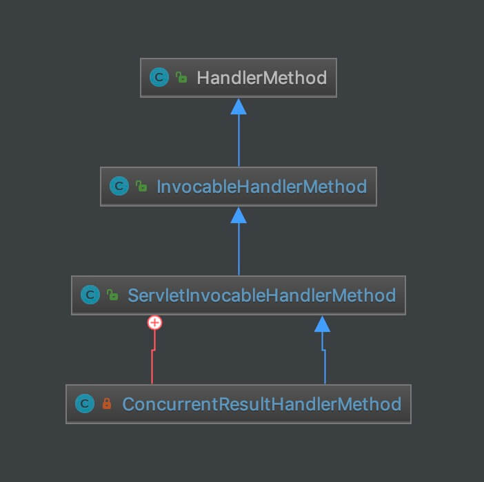

## 1. 概述

本文接 [《精尽 Spring MVC 源码解析 —— HandlerAdapter 组件（一）之 HandlerAdapter》](http://svip.iocoder.cn/Spring-MVC/HandlerAdapter-1-HandlerAdapter) 一文，我们“**再次**”来分享 ServletInvocableHandlerMethod 组件。虽然 WebDataBinderFactory、ModelFactory 等等类，还处于 TODO 状态，但是，我们还是非常有必要，对 ServletInvocableHandlerMethod 再来一波分析。

> HandlerAdapter 真的是 Spring MVC 九大组件里，最最最复杂的，没有之一。

## 2. 类图

ServletInvocableHandlerMethod 的整体类图如下：



我们来逐个解析。

## 3. HandlerMethod

`org.springframework.web.method.HandlerMethod` ，处理器的方法的封装对象。

在 [《精尽 Spring MVC 源码解析 —— HandlerMapping 组件（三）之 AbstractHandlerMethodMapping》](http://svip.iocoder.cn/Spring-MVC/HandlerMapping-3-AbstractHandlerMethodMapping) 的 [「3.3.1 HandlerMethod」](http://svip.iocoder.cn/Spring-MVC/HandlerAdapter-2-ServletInvocableHandlerMethod/#) 中，我们已经做过详细解析。

## 4. InvocableHandlerMethod

`org.springframework.web.method.support.InvocableHandlerMethod` ，继承 HandlerMethod 类，可 invoke 调用的 HandlerMethod 实现类。

也就是说，HandlerMethod 只提供了处理器的方法的基本信息，不提供调用逻辑。

### 4.1 构造方法

```java
// InvocableHandlerMethod.java

@Nullable
private WebDataBinderFactory dataBinderFactory;

private HandlerMethodArgumentResolverComposite argumentResolvers = new HandlerMethodArgumentResolverComposite();

private ParameterNameDiscoverer parameterNameDiscoverer = new DefaultParameterNameDiscoverer();

public InvocableHandlerMethod(HandlerMethod handlerMethod) {
	super(handlerMethod);
}

public InvocableHandlerMethod(Object bean, Method method) {
	super(bean, method);
}

public InvocableHandlerMethod(Object bean, String methodName, Class<?>... parameterTypes)
		throws NoSuchMethodException {
	super(bean, methodName, parameterTypes);
}
```

`dataBinderFactory`、`argumentResolvers`、`parameterNameDiscoverer` 参数，是通过 setting 方法，进行设置。

### 4.2 invokeForRequest

`#invokeForRequest(NativeWebRequest request, ModelAndViewContainer mavContainer, Object... providedArgs)` 方法，执行请求。代码如下：

```java
// InvocableHandlerMethod.java

/**
 * Invoke the method after resolving its argument values in the context of the given request.
 * <p>Argument values are commonly resolved through {@link HandlerMethodArgumentResolver HandlerMethodArgumentResolvers}.
 * The {@code providedArgs} parameter however may supply argument values to be used directly,
 * i.e. without argument resolution. Examples of provided argument values include a
 * {@link WebDataBinder}, a {@link SessionStatus}, or a thrown exception instance.
 * Provided argument values are checked before argument resolvers.
 * @param request the current request
 * @param mavContainer the ModelAndViewContainer for this request
 * @param providedArgs "given" arguments matched by type, not resolved
 * @return the raw value returned by the invoked method
 * @throws Exception raised if no suitable argument resolver can be found,
 * or if the method raised an exception
 */
@Nullable
public Object invokeForRequest(NativeWebRequest request, @Nullable ModelAndViewContainer mavContainer,
		Object... providedArgs) throws Exception {
	// <1> 解析参数
	Object[] args = getMethodArgumentValues(request, mavContainer, providedArgs);
	if (logger.isTraceEnabled()) {
		logger.trace("Arguments: " + Arrays.toString(args));
	}
	// <2> 执行调用
	return doInvoke(args);
}
```

`<1>` 处，调用 `#getMethodArgumentValues(NativeWebRequest request, ModelAndViewContainer mavContainer, Object... providedArgs)` 方法，解析方法的参数们。代码如下：

```java
// InvocableHandlerMethod.java

private Object[] getMethodArgumentValues(NativeWebRequest request, @Nullable ModelAndViewContainer mavContainer,
        Object... providedArgs) throws Exception {
    // 方法的参数信息的数组
    MethodParameter[] parameters = getMethodParameters();
    // 解析后的参数结果数组
    Object[] args = new Object[parameters.length];

    // 遍历，开始解析
    for (int i = 0; i < parameters.length; i++) {
        // 获得当前遍历的 MethodParameter 对象，并设置 parameterNameDiscoverer 到其中
        MethodParameter parameter = parameters[i];
        parameter.initParameterNameDiscovery(this.parameterNameDiscoverer);
        // <1> 先从 providedArgs 中获得参数。如果获得到，则进入下一个参数的解析
        args[i] = resolveProvidedArgument(parameter, providedArgs);
        if (args[i] != null) {
            continue;
        }
        // <2> 判断 argumentResolvers 是否支持当前的参数解析
        if (this.argumentResolvers.supportsParameter(parameter)) {
            try {
                // 执行解析。解析成功后，则进入下一个参数的解析
                args[i] = this.argumentResolvers.resolveArgument(
                        parameter, mavContainer, request, this.dataBinderFactory);
                continue;
            } catch (Exception ex) {
                // 解析失败，打印日志，并抛出异常
                // Leave stack trace for later, e.g. AbstractHandlerExceptionResolver
                if (logger.isDebugEnabled()) {
                    String message = ex.getMessage();
                    if (message != null && !message.contains(parameter.getExecutable().toGenericString())) {
                        logger.debug(formatArgumentError(parameter, message));
                    }
                }
                throw ex;
            }
        }
        // 解析失败，抛出 IllegalStateException 异常
        if (args[i] == null) {
            throw new IllegalStateException(formatArgumentError(parameter, "No suitable resolver"));
        }
    }

    // 返回结果
    return args;
}
```

`<1>` 处，先从 `providedArgs` 中获得参数。如果获得到，则进入下一个参数的解析。默认情况下，`providedArgs` 参数不会传递，所以可以暂时先忽略。保证核心逻辑的理解。

`<2>` 处，判断 `argumentResolvers` 是否支持当前的参数解析。如果支持，则进行解析。关于 HandlerMethodArgumentResolverComposite 的详细解析，见 [《精尽 Spring MVC 源码解析 —— HandlerAdapter 组件（三）之 HandlerMethodArgumentResolver》](http://svip.iocoder.cn/Spring-MVC/HandlerAdapter-3-HandlerMethodArgumentResolver) 。

`<2>` 方法，调用 `#doInvoke(Object... args)` 方法，执行调用。代码如下：

```java
// InvocableHandlerMethod.java

protected Object doInvoke(Object... args) throws Exception {
	// 设置方法为可访问
	ReflectionUtils.makeAccessible(getBridgedMethod());
	try {
		// 执行调用
		return getBridgedMethod().invoke(getBean(), args);
	} catch (IllegalArgumentException ex) {
		assertTargetBean(getBridgedMethod(), getBean(), args);
		String text = (ex.getMessage() != null ? ex.getMessage() : "Illegal argument");
		throw new IllegalStateException(formatInvokeError(text, args), ex);
	} catch (InvocationTargetException ex) {
		// Unwrap for HandlerExceptionResolvers ...
		Throwable targetException = ex.getTargetException();
		if (targetException instanceof RuntimeException) {
			throw (RuntimeException) targetException;
		} else if (targetException instanceof Error) {
			throw (Error) targetException;
		} else if (targetException instanceof Exception) {
			throw (Exception) targetException;
		} else {
			throw new IllegalStateException(formatInvokeError("Invocation failure", args), targetException);
		}
	}
}
```

通过反射方法，调用对应的方法。那么，为什么是 Bridged Method 呢？感兴趣的胖友，可以看看 [《Bridge Method (桥接方法)》](http://berdy.iteye.com/blog/810488) 文章。有趣~

## 5. ServletInvocableHandlerMethod

`org.springframework.web.servlet.mvc.method.annotation。ServletInvocableHandlerMethod` ，继承 InvocableHandlerMethod 类，考虑 Servlet 的 InvocableHandlerMethod 实现类。貌似这样翻译也很奇怪，直接开始看代码吧。

```java
// ServletInvocableHandlerMethod.java

/**
 * Extends {@link InvocableHandlerMethod} with the ability to handle return
 * values through a registered {@link HandlerMethodReturnValueHandler} and
 * also supports setting the response status based on a method-level
 * {@code @ResponseStatus} annotation.
 *
 * <p>A {@code null} return value (including void) may be interpreted as the
 * end of request processing in combination with a {@code @ResponseStatus}
 * annotation, a not-modified check condition
 * (see {@link ServletWebRequest#checkNotModified(long)}), or
 * a method argument that provides access to the response stream.
 *
 * @author Rossen Stoyanchev
 * @author Juergen Hoeller
 * @since 3.1
 */
```

### 5.1 构造方法

```java
// ServletInvocableHandlerMethod.java

/**
 * 返回结果处理器
 */
@Nullable
private HandlerMethodReturnValueHandlerComposite returnValueHandlers;

public ServletInvocableHandlerMethod(Object handler, Method method) {
	super(handler, method);
}

public ServletInvocableHandlerMethod(HandlerMethod handlerMethod) {
	super(handlerMethod);
}
```

`returnValueHandlers` 属性的设置，通过 setting 方法。

### 5.2 invokeAndHandle

`#invokeAndHandle(ServletWebRequest webRequest, ModelAndViewContainer mavContainer, Object... providedArgs)` 方法，请求调用，**并处理返回结果**。代码如下：

```java
// ServletInvocableHandlerMethod.java

/**
 * Invoke the method and handle the return value through one of the
 * configured {@link HandlerMethodReturnValueHandler HandlerMethodReturnValueHandlers}.
 * @param webRequest the current request
 * @param mavContainer the ModelAndViewContainer for this request
 * @param providedArgs "given" arguments matched by type (not resolved)
 */
public void invokeAndHandle(ServletWebRequest webRequest, ModelAndViewContainer mavContainer,
		Object... providedArgs) throws Exception {
	// <1> 执行调用
	Object returnValue = invokeForRequest(webRequest, mavContainer, providedArgs);
	// <2> 设置响应状态码
	setResponseStatus(webRequest);

	// <3> 设置 ModelAndViewContainer 为请求已处理，返回
	if (returnValue == null) { // 返回 null
		if (isRequestNotModified(webRequest) || getResponseStatus() != null || mavContainer.isRequestHandled()) {
			mavContainer.setRequestHandled(true);
			return;
		}
	} else if (StringUtils.hasText(getResponseStatusReason())) { // 有 responseStatusReason
		mavContainer.setRequestHandled(true);
		return;
	}

	// <4> 设置 ModelAndViewContainer 为请求未处理
	mavContainer.setRequestHandled(false);
	Assert.state(this.returnValueHandlers != null, "No return value handlers");
	// <5> 处理器返回值
	try {
		this.returnValueHandlers.handleReturnValue(
				returnValue, getReturnValueType(returnValue), mavContainer, webRequest);
	} catch (Exception ex) {
		if (logger.isTraceEnabled()) {
			logger.trace(formatErrorForReturnValue(returnValue), ex);
		}
		throw ex;
	}
}
```

`<1>` 处，调用父 InvocableHandlerMethod 类的 `#invokeForRequest(NativeWebRequest request, ModelAndViewContainer mavContainer, Object... providedArgs)` 方法，执行调用。在 [「4.2 invokeForRequest」](http://svip.iocoder.cn/Spring-MVC/HandlerAdapter-2-ServletInvocableHandlerMethod/#) 中，已经详细解析。

`<2>` 处，调用 `#setResponseStatus(ServletWebRequest webRequest)` 设置响应的状态码。代码如下：

```java
// ServletInvocableHandlerMethod.java

/**
 * Set the response status according to the {@link ResponseStatus} annotation.
 */
private void setResponseStatus(ServletWebRequest webRequest) throws IOException {
    // 获得状态码。
    // 此处，想要非空，需要通过 @ResponseStatus 注解方法
    HttpStatus status = getResponseStatus();
	if (status == null) { // 若为空，则返回
		return;
	}

	// 设置响应的状态码
	HttpServletResponse response = webRequest.getResponse();
	if (response != null) {
		String reason = getResponseStatusReason();
		if (StringUtils.hasText(reason)) { // 有 reason ，则设置 status + reason
			response.sendError(status.value(), reason);
		} else { // 无 reason ，则仅设置 status
			response.setStatus(status.value());
		}
	}

	// To be picked up by RedirectView
	// 为了 RedirectView ，所以进行设置
	webRequest.getRequest().setAttribute(View.RESPONSE_STATUS_ATTRIBUTE, status);
}
```

`<3>` 处，设置 ModelAndViewContainer 为请求已处理，返回。具体的逻辑，胖友可以简单看看即可。因为，实际情况下，我们很少使用 `@ResponseStatus` 注解。

`<4>` 处，设置 ModelAndViewContainer 为请求未处理。

`<5>` 处，调用 `HandlerMethodReturnValueHandlerComposite#handleReturnValue(Object returnValue, MethodParameter returnType, ModelAndViewContainer mavContainer, NativeWebRequest webRequest)` 方法，处理返回值。详细解析，见 [《精尽 Spring MVC 源码解析 —— HandlerAdapter 组件（四）之 HandlerMethodArgumentResolver》](http://svip.iocoder.cn/Spring-MVC/HandlerAdapter-4-HandlerMethodReturnValueHandler) 。

