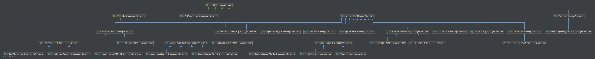

## 1. 概述

在 Spring MVC 中，可以使用 `@RequestBody` 和 `@ResponseBody` 两个注解，分别完成请求报文到对象和对象到响应报文的转换，底层这种灵活的消息转换机制，就是Spring 3.x 中新引入的 HttpMessageConverter ，即消息转换器机制。

Http 请求的抽象，还是回到请求-响应，也就是解析请求体，然后返回响应报文这个最基本的 Http 请求过程中来。我们知道，在 Servlet 标准中，可以用`javax.servlet.ServletRequest` 接口中的以下方法：

```java
public ServletInputStream getInputStream() throws IOException;
```

来得到一个ServletInputStream。这个 ServletInputStream 中，可以读取到一个原始请求报文的所有内容。同样的，在 `javax.servlet.ServletResponse` 接口中，可以用以下方法：

```java
public ServletOutputStream getOutputStream() throws IOException;
```

来得到一个 ServletOutputStream 。这个 ServletOutputSteam ，继承自 java 中的OutputStream，可以让你输出 Http 的响应报文内容。

让我们尝试着像 SpringMVC 的设计者一样来思考一下。我们知道，Http 请求和响应报文本质上都是一串字符串，当请求报文来到 java 世界，它会被封装成为一个 ServletInputStream 的输入流，供我们读取报文。响应报文则是通过一个 ServletOutputStream 的输出流，来输出响应报文。

我们从流中，只能读取到原始的字符串报文，同样，我们往输出流中，也只能写原始的字符。而在 Java 世界中，处理业务逻辑，都是以一个个有业务意义的**对象**为处理维度的，那么在报文到达 Spring MVC 和从 Spring MVC 出去，都存在一个字符串到 Java 对象的阻抗问题。这一过程，不可能由开发者手工转换。我们知道，在 Struts2 中，采用了 OGNL 来应对这个问题，而在 SpringMVC 中，它是 HttpMessageConverter机 制。我们先来看 HttpInputMessage 和 HttpOutputMessage两个接口。

## 2. HttpInputMessage

这个类是 Spring MVC 内部对一次 Http 请求报文的抽象，在 HttpMessageConverter 的 `read(...)` 方法中，有一个 HttpInputMessage 的形参，它正是 Spring MVC 的消息转换器所作用的受体“请求消息”的内部抽象，消息转换器从“请求消息”中按照规则提取消息，转换为方法形参中声明的对象。

```java
package org.springframework.http;

import java.io.IOException;
import java.io.InputStream;

public interface HttpInputMessage extends HttpMessage {

	InputStream getBody() throws IOException;

}
```

## 3. HttpOutputMessage

这个类是 Spring MVC 内部对一次 Http 响应报文的抽象，在 HttpMessageConverter 的 `#write(...)` 方法中，有一个 HttpOutputMessage 的形参，它正是 Spring MVC 的消息转换器所作用的受体“响应消息”的内部抽象，消息转换器将“响应消息”按照一定的规则写到响应报文中。

```java
package org.springframework.http;

import java.io.IOException;
import java.io.OutputStream;

public interface HttpOutputMessage extends HttpMessage {

	OutputStream getBody() throws IOException;

}
```

## 4. HttpMessageConverter

对消息转换器最高层次的接口抽象，描述了一个消息转换器的一般特征，我们可以从这个接口中定义的方法，来领悟Spring3.x的设计者对这一机制的思考过程。

```java
package org.springframework.http.converter;

import java.io.IOException;
import java.util.List;

import org.springframework.http.HttpInputMessage;
import org.springframework.http.HttpOutputMessage;
import org.springframework.http.MediaType;

public interface HttpMessageConverter<T> {

	boolean canRead(Class<?> clazz, MediaType mediaType);

	boolean canWrite(Class<?> clazz, MediaType mediaType);

	List<MediaType> getSupportedMediaTypes();

	T read(Class<? extends T> clazz, HttpInputMessage inputMessage)
			throws IOException, HttpMessageNotReadableException;

	void write(T t, MediaType contentType, HttpOutputMessage outputMessage)
			throws IOException, HttpMessageNotWritableException;

}
```

HttpMessageConverter接口的定义出现了成对的 `canRead(...)` + `#read(...)` 和 `#canWrite(...)` + `#write(...)` 方法。而 MediaType 是对请求的 Media Type 属性的封装。举个例子，当我们声明了下面这个处理方法。

```java
@RequestMapping(value = "/string", method = RequestMethod.POST)
public @ResponseBody String readString(@RequestBody String string) {
    return "Read string '" + string + "'";
}
```

在 SpringMVC 进入 `#readString(...)` 方法前，会根据 `@RequestBody` 注解选择适当的 HttpMessageConverter 实现类来将请求参数解析到 `string` 变量中，具体来说是使用了 StringHttpMessageConverter 类，它的 `#canRead(...)` 方法返回 `true`，然后它的 `#read(...)` 方法会从请求中读出请求参数，绑定到 `#readString(@RequestBody String string)` 方法的 `string` 变量中。

当 Spring MVC 执行 `#readString(@RequestBody String string)` 方法后，由于返回值标识了 `@ResponseBody` 注解，Spring MVC 将使用 StringHttpMessageConverter 的 `#write(...)` 方法，将结果作为 String 值写入响应报文，当然，此时 `#canWrite(....)` 方法返回 `true` 。

我们可以用下面的图，简单描述一下这个过程。


## 5. RequestResponseBodyMethodProcessor

将上述过程集中描述的一个类是 `org.springframework.web.servlet.mvc.method.annotation.RequestResponseBodyMethodProcessor` ，这个类同时实现了 HandlerMethodArgumentResolver 和 HandlerMethodReturnValueHandler 两个接口。前者是将请求报文绑定到处理方法形参的策略接口，后者则是对处理方法返回值进行处理的策略接口。两个接口的源码如下：

```java
// HandlerMethodArgumentResolver.java

public interface HandlerMethodArgumentResolver {

	boolean supportsParameter(MethodParameter parameter);

	Object resolveArgument(MethodParameter parameter,
						   ModelAndViewContainer mavContainer,
						   NativeWebRequest webRequest,
						   WebDataBinderFactory binderFactory) throws Exception;
}

// HandlerMethodReturnValueHandler.java

public interface HandlerMethodReturnValueHandler {

	boolean supportsReturnType(MethodParameter returnType);

	void handleReturnValue(Object returnValue,
						   MethodParameter returnType,
						   ModelAndViewContainer mavContainer,
						   NativeWebRequest webRequest) throws Exception;
}
```

RequestResponseBodyMethodProcessor 这个类，同时充当了方法参数解析和返回值处理两种角色。我们从它的源码中，可以找到上面两个接口的方法实现。

对 HandlerMethodArgumentResolver 接口的实现：

```java
// RequestResponseBodyMethodProcessor.java

public boolean supportsParameter(MethodParameter parameter) {
	return parameter.hasParameterAnnotation(RequestBody.class);
}

public Object resolveArgument(MethodParameter parameter, ModelAndViewContainer mavContainer,
		NativeWebRequest webRequest, WebDataBinderFactory binderFactory) throws Exception {

	Object argument = readWithMessageConverters(webRequest, parameter, parameter.getGenericParameterType());

	String name = Conventions.getVariableNameForParameter(parameter);
	WebDataBinder binder = binderFactory.createBinder(webRequest, argument, name);

	if (argument != null) {
		validate(binder, parameter);
	}

	mavContainer.addAttribute(BindingResult.MODEL_KEY_PREFIX + name, binder.getBindingResult());

	return argument;
}
```

对 HandlerMethodReturnValueHandler 接口的实现

```java
// RequestResponseBodyMethodProcessor.java

public boolean supportsReturnType(MethodParameter returnType) {
	return returnType.getMethodAnnotation(ResponseBody.class) != null;
}

public void handleReturnValue(Object returnValue, MethodParameter returnType,
		ModelAndViewContainer mavContainer, NativeWebRequest webRequest)
		throws IOException, HttpMediaTypeNotAcceptableException {

	mavContainer.setRequestHandled(true);
	if (returnValue != null) {
		writeWithMessageConverters(returnValue, returnType, webRequest);
	}
}
```

看完上面的代码，整个 HttpMessageConverter 消息转换的脉络已经非常清晰。因为两个接口的实现，分别是以是否有 `@RequestBody` 和 `@ResponseBody` 为条件，然后分别调用 HttpMessageConverter 来进行消息的读写。

## 6. 思考

张小龙在谈微信的本质时候说：“微信只是个平台，消息在其中流转”。在我们对 Spring MVC 源码分析的过程中，我们可以从 HttpMessageConverter 机制中领悟到类似的道理。在Spring MVC 的设计者眼中，一次请求报文和一次响应报文，分别被抽象为一个请求消息HttpInputMessage 和一个响应消息 HttpOutputMessage 。

处理请求时，由合适的消息转换器将请求报文绑定为方法中的形参对象，在这里，同一个对象就有可能出现多种不同的消息形式，比如 json 和 xml 。同样，当响应请求时，方法的返回值也同样可能被返回为不同的消息形式，比如 json 和 xml 。

在 Spring MVC 中，针对不同的消息形式，我们有不同的 HttpMessageConverter 实现类来处理各种消息形式。但是，只要这些消息所蕴含的“有效信息”是一致的，那么各种不同的消息转换器，都会生成同样的转换结果。至于各种消息间解析细节的不同，就被屏蔽在不同的 HttpMessageConverter 实现类中了。

## 7. 补充

HttpMessageConverter 的整体类图如下：



胖友可以看看 MappingJackson2HttpMessageConverter 类，Spring MVC 提供的默认的 JSON 消息格式的转换器。

如果胖友想要使用 Fastjson 作为 JSON 的工具类，可以看看 `com.alibaba.fastjson.support.spring.FastJsonHttpMessageConverter` 类，和 [《在 Spring 中集成 Fastjson》](https://github.com/alibaba/fastjson/wiki/在-Spring-中集成-Fastjson) 一文。
