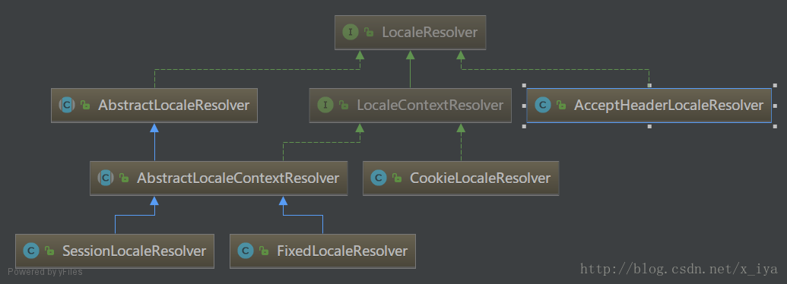

> LocaleResolver 实际使用很少，所以艿艿也没特别细看，就看了下 AcceptHeaderLocaleResolver 类。

## 1. LocaleResolver

LocaleResolver 是一个解决国际化的策略接口。它包含两个方法：`#resolveLocale(...)` 和 `#setLocale(...)` ，代码如下：

```java
public interface LocaleResolver {

    Locale resolveLocale(HttpServletRequest request);
    
    void setLocale(HttpServletRequest request, @Nullable HttpServletResponse response, @Nullable Locale locale);

}
```

实现此接口的类：



## 2. AcceptHeaderLocaleResolver

SpringMVC 默认使用的是：AcceptHeaderLocaleResolver 。


```java
/**
 * LocaleResolver 接口的实现类
 * 简单地使用 HTTP 请求头里的 Accept-Language 来指定 Locale对象(即客户端浏览器发送的语言环境，通常是客户端的操作系统)
 *
 * 注意:不支持 setLocale 方法，因为只能通过更改客户端的区域设置来更改 Accept-Language 请求头
 */
public class AcceptHeaderLocaleResolver implements LocaleResolver {

    private final List<Locale> supportedLocales = new ArrayList<>(4);

    @Nullable
    private Locale defaultLocale;

    /**
     * 配置支持的区域设置列表
     */
    public void setSupportedLocales(@Nullable List<Locale> locales) {
        this.supportedLocales.clear();
        if (locales != null) {
            this.supportedLocales.addAll(locales);
        }
    }

    /**
     * 返回配置的支持的区域设置列表
     */
    public List<Locale> getSupportedLocales() {
        return this.supportedLocales;
    }

    /**
     * 如果 HTTP 请求头没有 Accept-Language，则使用该默认的语言环境设置
     */
    public void setDefaultLocale(@Nullable Locale defaultLocale) {
        this.defaultLocale = defaultLocale;
    }

    /**
     * 返回默认配置的语言环境(如果有)
     */
    @Nullable
    public Locale getDefaultLocale() {
        return this.defaultLocale;
    }

    @Override
    public Locale resolveLocale(HttpServletRequest request) {
        Locale defaultLocale = getDefaultLocale();
        if (defaultLocale != null && request.getHeader("Accept-Language") == null) {
            return defaultLocale;
        }
        Locale requestLocale = request.getLocale();
        if (isSupportedLocale(requestLocale)) {
            return requestLocale;
        }
        Locale supportedLocale = findSupportedLocale(request);
        if (supportedLocale != null) {
            return supportedLocale;
        }
        return (defaultLocale != null ? defaultLocale : requestLocale);
    }

    private boolean isSupportedLocale(Locale locale) {
        List<Locale> supportedLocales = getSupportedLocales();
        return (supportedLocales.isEmpty() || supportedLocales.contains(locale));
    }

    @Nullable
    private Locale findSupportedLocale(HttpServletRequest request) {
        Enumeration<Locale> requestLocales = request.getLocales();
        while (requestLocales.hasMoreElements()) {
            Locale locale = requestLocales.nextElement();
            if (getSupportedLocales().contains(locale)) {
                return locale;
            }
        }
        return null;
    }

    @Override
    public void setLocale(HttpServletRequest request, @Nullable HttpServletResponse response, @Nullable Locale locale) {
        throw new UnsupportedOperationException(
                "Cannot change HTTP accept header - use a different locale resolution strategy");
    }

}
```

`#resolveLocale(...)` 方法的处理流程：

如果 HTTP 请求头里不含有 `Accept-Language` ，并且默认的语言环境 `defaultLocale` 不为空，则使用默认的语言环境。否则，从请求里获得 Locale 。

而一般的我们没有配置 `supportedLocales` 与`defaultLocale` 属性(需要配置注入)，所以 AcceptHeaderLocaleResolver 使用`Accept-Language` 来构造 Locale 对象。

## 3. AbstractLocaleResolver

```java
/**
 * 实现 LocaleResolver 接口的抽象基类
 * 提供对默认语言环境的支持
 */
public abstract class AbstractLocaleResolver implements LocaleResolver {

    @Nullable
    private Locale defaultLocale;
    public void setDefaultLocale(@Nullable Locale defaultLocale) {
        this.defaultLocale = defaultLocale;
    }
    
    @Nullable
    protected Locale getDefaultLocale() {
        return this.defaultLocale;
    }
    
}
```

## 4. LocaleContextResolver

```java
public interface LocaleContextResolver extends LocaleResolver {

    LocaleContext resolveLocaleContext(HttpServletRequest request);
    
    void setLocaleContext(HttpServletRequest request, @Nullable HttpServletResponse response,
            @Nullable LocaleContext localeContext);
            
}
```

## 5. AbstractLocaleContextResolver

```java
/**
 * LocaleContextResolver 实现的抽象基类:提供对默认语言环境和默认时区的支持
 * 还提供了 resolveLocale 和 setLocale 的预实现版本，委托给 resolveLocaleContext 和 setLocaleContext
 */
public abstract class AbstractLocaleContextResolver extends AbstractLocaleResolver implements LocaleContextResolver {

    @Nullable
    private TimeZone defaultTimeZone;
    public void setDefaultTimeZone(@Nullable TimeZone defaultTimeZone) {
        this.defaultTimeZone = defaultTimeZone;
    }
    
    @Nullable
    public TimeZone getDefaultTimeZone() {
        return this.defaultTimeZone;
    }
    
    @Override
    public Locale resolveLocale(HttpServletRequest request) {
        Locale locale = resolveLocaleContext(request).getLocale();
        return (locale != null ? locale : request.getLocale());
    }
    
    @Override
    public void setLocale(HttpServletRequest request, @Nullable HttpServletResponse response, @Nullable Locale locale) {
        setLocaleContext(request, response, (locale != null ? new SimpleLocaleContext(locale) : null));
    }
    
}
```

## 6. SessionLocaleResolver

```java
public class SessionLocaleResolver extends AbstractLocaleContextResolver {

    public static final String LOCALE_SESSION_ATTRIBUTE_NAME = SessionLocaleResolver.class.getName() + ".LOCALE";
    public static final String TIME_ZONE_SESSION_ATTRIBUTE_NAME = SessionLocaleResolver.class.getName() + ".TIME_ZONE";
    private String localeAttributeName = LOCALE_SESSION_ATTRIBUTE_NAME;
    private String timeZoneAttributeName = TIME_ZONE_SESSION_ATTRIBUTE_NAME;

    /**
     * 在 HttpSession 中指定相应属性的名称，保存当前的 Locale 值
     * 默认值为 LOCALE_SESSION_ATTRIBUTE_NAME
     */
    public void setLocaleAttributeName(String localeAttributeName) {
        this.localeAttributeName = localeAttributeName;
    }

    /**
     * 在 HttpSession 中指定相应属性的名称，保存当前的 TimeZone 值
     * 默认值为 TIME_ZONE_SESSION_ATTRIBUTE_NAME
     */
    public void setTimeZoneAttributeName(String timeZoneAttributeName) {
        this.timeZoneAttributeName = timeZoneAttributeName;
    }

    @Override
    public Locale resolveLocale(HttpServletRequest request) {
        Locale locale = (Locale) WebUtils.getSessionAttribute(request, this.localeAttributeName);
        if (locale == null) {
            locale = determineDefaultLocale(request);
        }
        return locale;
    }

    @Override
    public LocaleContext resolveLocaleContext(final HttpServletRequest request) {
        return new TimeZoneAwareLocaleContext() {
        
            @Override
            public Locale getLocale() {
                Locale locale = (Locale) WebUtils.getSessionAttribute(request, localeAttributeName);
                if (locale == null) {
                    locale = determineDefaultLocale(request);
                }
                return locale;
            }
            
            @Override
            @Nullable
            public TimeZone getTimeZone() {
                TimeZone timeZone = (TimeZone) WebUtils.getSessionAttribute(request, timeZoneAttributeName);
                if (timeZone == null) {
                    timeZone = determineDefaultTimeZone(request);
                }
                return timeZone;
            }
            
        };
    }

    @Override
    public void setLocaleContext(HttpServletRequest request, @Nullable HttpServletResponse response,
            @Nullable LocaleContext localeContext) {

        Locale locale = null;
        TimeZone timeZone = null;
        if (localeContext != null) {
            locale = localeContext.getLocale();
            if (localeContext instanceof TimeZoneAwareLocaleContext) {
                timeZone = ((TimeZoneAwareLocaleContext) localeContext).getTimeZone();
            }
        }
        // 将 Locale 与 TimeZone 保存到 HttpSession
        WebUtils.setSessionAttribute(request, this.localeAttributeName, locale);
        WebUtils.setSessionAttribute(request, this.timeZoneAttributeName, timeZone);
    }


    /**
     * 确定给定请求的默认语言环境，如果没有找到 Locale 会话属性，则调用
     * 默认实现返回指定的默认语言环境（如果有的话）返回到请求的Accept-Header 语言环境
     */
    protected Locale determineDefaultLocale(HttpServletRequest request) {
        Locale defaultLocale = getDefaultLocale();
        if (defaultLocale == null) {
            defaultLocale = request.getLocale();
        }
        return defaultLocale;
    }

    /**
     * 确定给定请求的默认时区，如果未找到TimeZone会话属性，则调用
     * 默认实现返回指定的默认时区（如果有），否则返回null
     */
    @Nullable
    protected TimeZone determineDefaultTimeZone(HttpServletRequest request) {
        return getDefaultTimeZone();
    }

}
```

