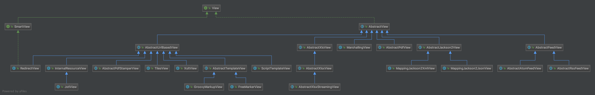

## 1. 概述

本文，我们来分享 ViewResolver 组件。在 [《精尽 Spring MVC 源码分析 —— 组件一览》](http://svip.iocoder.cn/Spring-MVC/Components-intro) 中，我们对它已经做了介绍：

`org.springframework.web.servlet.ViewResolver` ，实体解析器接口，根据视图名和国际化，获得最终的视图 View 对象。代码如下：

```java
// ViewResolver.java

public interface ViewResolver {

	/**
     * 根据视图名和国际化，获得最终的 View 对象
	 */
	@Nullable
	View resolveViewName(String viewName, Locale locale) throws Exception;

}
```

## 2. 类图

ViewResolver 的类图如下：


虽然实现类比较多，ViewResolver 分成五类实现类，就是 ViewResolver 的五个直接实现类。

## 3. 初始化

我们以**默认配置的 Spring Boot 场景**下为例，来一起看看 DispatcherServlet 的 `#initViewResolvers(ApplicationContext context)` 方法，初始化 `viewResolvers` 变量。代码如下：

```java
// DispatcherServlet.java

/** List of ViewResolvers used by this servlet. */
@Nullable
private List<ViewResolver> viewResolvers;

/** Detect all ViewResolvers or just expect "viewResolver" bean?. */
private boolean detectAllViewResolvers = true;

private void initViewResolvers(ApplicationContext context) {
    // 置空 viewResolvers 处理
    this.viewResolvers = null;

    // 情况一，自动扫描 ViewResolver 类型的 Bean 们
    if (this.detectAllViewResolvers) {
        // Find all ViewResolvers in the ApplicationContext, including ancestor contexts.
        Map<String, ViewResolver> matchingBeans =
                BeanFactoryUtils.beansOfTypeIncludingAncestors(context, ViewResolver.class, true, false);
        if (!matchingBeans.isEmpty()) {
            this.viewResolvers = new ArrayList<>(matchingBeans.values());
            // We keep ViewResolvers in sorted order.
            AnnotationAwareOrderComparator.sort(this.viewResolvers);
        }
    // 情况二，获得名字为 VIEW_RESOLVER_BEAN_NAME 的 Bean 们
    } else {
        try {
            ViewResolver vr = context.getBean(VIEW_RESOLVER_BEAN_NAME, ViewResolver.class);
            this.viewResolvers = Collections.singletonList(vr);
        } catch (NoSuchBeanDefinitionException ex) {
            // Ignore, we'll add a default ViewResolver later.
        }
    }

    // Ensure we have at least one ViewResolver, by registering
    // a default ViewResolver if no other resolvers are found.
    // 情况三，如果未获得到，则获得默认配置的 ViewResolver 类
    if (this.viewResolvers == null) {
        this.viewResolvers = getDefaultStrategies(context, ViewResolver.class);
        if (logger.isTraceEnabled()) {
            logger.trace("No ViewResolvers declared for servlet '" + getServletName() +
                    "': using default strategies from DispatcherServlet.properties");
        }
    }
}
```

一共有三种情况，初始化 `viewResolvers` 属性。

默认情况下，`detectAllViewResolvers` 为 `true` ，所以走**情况一**的逻辑，自动扫描 ViewResolver 类型的 Bean 们。在**默认配置的 Spring Boot 场景**下，`viewResolvers` 的结果是：

- ContentNegotiatingViewResolver
- BeanNameViewResolver
- ThymeleafViewResolver
- ViewResolverComposite
- InternalResourceViewResolver

从实现上来说，ContentNegotiatingViewResolver 是最最最重要的 ViewResolver 实现类，所以我们先开始瞅瞅它。

## 4. ContentNegotiatingViewResolver

`org.springframework.web.servlet.view.ContentNegotiatingViewResolver` ，实现 ViewResolver、Ordered、InitializingBean 接口，继承 WebApplicationObjectSupport 抽象类，基于**内容类型**来获取对应 View 的 ViewResolver 实现类。

其中，**内容类型**指的是 `"Content-Type"` 和拓展后缀。

### 4.1 构造方法

```java
// ContentNegotiatingViewResolver.java

@Nullable
private ContentNegotiationManager contentNegotiationManager;
/**
 * ContentNegotiationManager 的工厂，用于创建 {@link #contentNegotiationManager} 对象
 */
private final ContentNegotiationManagerFactoryBean cnmFactoryBean = new ContentNegotiationManagerFactoryBean();

/**
 * 在找不到 View 对象时，返回 {@link #NOT_ACCEPTABLE_VIEW}
 */
private boolean useNotAcceptableStatusCode = false;

/**
 * 默认 View 数组
 */
@Nullable
private List<View> defaultViews;

/**
 * ViewResolver 数组
 */
@Nullable
private List<ViewResolver> viewResolvers;

/**
 * 顺序，优先级最高
 */
private int order = Ordered.HIGHEST_PRECEDENCE;
```

`viewResolvers` 属性，ViewResolver 数组。对于来说，ContentNegotiatingViewResolver 会使用这些 `viewResolvers` 们，解析出所有的 View 们，然后基于**内容类型**来获取对应的 View 们。此时的 View 结果，可能是一个，可能是多个，所以需要比较获取到**最优**的 View 对象。

`defaultViews` 属性，默认 View 数组。那么此处的默认是什么意思呢？在 `viewResolvers` 们解析出所有的 View 们的基础上，也会添加 `defaultViews` 到 View 结果中。如果听起来有点绕，下面看具体的代码，会更加易懂。

`order` 属性，顺序，优先级**最高**。所以，这也是为什么在 [「3. 初始化」](http://svip.iocoder.cn/Spring-MVC/ViewResolver/#) 中排行第一。

### 4.2 initServletContext

实现 `#initServletContext(ServletContext servletContext)` 方法，初始化 `viewResolvers` 属性。代码如下：

```java
// ContentNegotiatingViewResolver.java

@Override
protected void initServletContext(ServletContext servletContext) {
    // <1> 扫描所有 ViewResolver 的 Bean 们
    Collection<ViewResolver> matchingBeans =
            BeanFactoryUtils.beansOfTypeIncludingAncestors(obtainApplicationContext(), ViewResolver.class).values();
    // <1.1> 情况一，如果 viewResolvers 为空，则将 matchingBeans 作为 viewResolvers 。
    if (this.viewResolvers == null) {
        this.viewResolvers = new ArrayList<>(matchingBeans.size());
        for (ViewResolver viewResolver : matchingBeans) {
            if (this != viewResolver) { // 排除自己
                this.viewResolvers.add(viewResolver);
            }
        }
    // <1.2> 情况二，如果 viewResolvers 非空，则和 matchingBeans 进行比对，判断哪些未进行初始化，那么需要进行初始化
    } else {
        for (int i = 0; i < this.viewResolvers.size(); i++) {
            ViewResolver vr = this.viewResolvers.get(i);
            // 已存在在 matchingBeans 中，说明已经初始化，则直接 continue
            if (matchingBeans.contains(vr)) {
                continue;
            }
            // 不存在在 matchingBeans 中，说明还未初始化，则进行初始化
            String name = vr.getClass().getName() + i;
            obtainApplicationContext().getAutowireCapableBeanFactory().initializeBean(vr, name);
        }
    }
    // <1.3> 排序 viewResolvers 数组
    AnnotationAwareOrderComparator.sort(this.viewResolvers);

    // <2> 设置 cnmFactoryBean 的 servletContext 属性
    this.cnmFactoryBean.setServletContext(servletContext);
}
```

`<1>` 处，扫描所有 ViewResolver 的 Bean 们。

【重要】`<1.1>` 处，情况一，如果 `viewResolvers` 为空，则将 `matchingBeans` 作为 `viewResolvers` 。默认情况下，走的是这段逻辑。所以此时 `viewResolvers` 会有 BeanNameViewResolver、ThymeleafViewResolver、ViewResolverComposite、InternalResourceViewResolver 四个对象。

`<1.2>` 处，情况二，如果 `viewResolvers` 非空，则和 `matchingBeans` 进行比对，判断哪些未进行初始化，那么需要进行初始化。

`<1.3>` 处，排序 `viewResolvers` 数组。

`<2>` 处，设置 `cnmFactoryBean` 的 `servletContext` 属性。

### 4.3 afterPropertiesSet

实现 `#afterPropertiesSet()` 方法，初始化 `contentNegotiationManager` 属性。代码如下：

```java
// ContentNegotiatingViewResolver.java

@Override
public void afterPropertiesSet() {
    // 如果 contentNegotiationManager 为空，则进行创建
    if (this.contentNegotiationManager == null) {
        this.contentNegotiationManager = this.cnmFactoryBean.build();
    }
    if (this.viewResolvers == null || this.viewResolvers.isEmpty()) {
        logger.warn("No ViewResolvers configured");
    }
}
```

### 4.4 resolveViewName

实现 `#resolveViewName(String viewName, Locale locale)` 方法，代码如下：

```java
// ContentNegotiatingViewResolver.java

@Override
@Nullable
public View resolveViewName(String viewName, Locale locale) throws Exception {
    RequestAttributes attrs = RequestContextHolder.getRequestAttributes();
    Assert.state(attrs instanceof ServletRequestAttributes, "No current ServletRequestAttributes");
    // <1> 获得 MediaType 数组
    List<MediaType> requestedMediaTypes = getMediaTypes(((ServletRequestAttributes) attrs).getRequest());
    if (requestedMediaTypes != null) {
        // <2.1> 获得匹配的 View 数组
        List<View> candidateViews = getCandidateViews(viewName, locale, requestedMediaTypes);
        // <2.2> 筛选最匹配的 View 对象
        View bestView = getBestView(candidateViews, requestedMediaTypes, attrs);
        // 如果筛选成功，则返回
        if (bestView != null) {
            return bestView;
        }
    }

    String mediaTypeInfo = logger.isDebugEnabled() && requestedMediaTypes != null ?
            " given " + requestedMediaTypes.toString() : "";

    // <3> 如果匹配不到 View 对象，则根据 useNotAcceptableStatusCode ，返回 NOT_ACCEPTABLE_VIEW 或 null 。
    if (this.useNotAcceptableStatusCode) {
        if (logger.isDebugEnabled()) {
            logger.debug("Using 406 NOT_ACCEPTABLE" + mediaTypeInfo);
        }
        return NOT_ACCEPTABLE_VIEW;
    } else {
        logger.debug("View remains unresolved" + mediaTypeInfo);
        return null;
    }
}
```

`<1>` 处，调用 `#getCandidateViews(HttpServletRequest request)` 方法，获得 MediaType 数组。详细解析，见 [「4.4.1 getMediaTypes」](http://svip.iocoder.cn/Spring-MVC/ViewResolver/#) 。

`<2.1>` 处，调用 `#getCandidateViews(String viewName, Locale locale, List<MediaType> requestedMediaTypes)` 方法，获得匹配的 View 数组。详细解析，见 [「4.4.2 getCandidateViews」](http://svip.iocoder.cn/Spring-MVC/ViewResolver/#) 。

`<2.3>` 处，调用 `#getBestView(List<View> candidateViews, List<MediaType> requestedMediaTypes, RequestAttributes attrs)` 方法，筛选最匹配的 View 对象。详细解析，见 [「4.4.3 getBestView」](http://svip.iocoder.cn/Spring-MVC/ViewResolver/#) 。

`<3>` 处，如果匹配不到 View 对象，则根据 `useNotAcceptableStatusCode` ，返回 `NOT_ACCEPTABLE_VIEW` 或 `null` 。其中，`NOT_ACCEPTABLE_VIEW` 变量，代码如下：

```java
// ContentNegotiatingViewResolver.java

private static final View NOT_ACCEPTABLE_VIEW = new View() {

    @Override
    @Nullable
    public String getContentType() {
        return null;
    }

    @Override
    public void render(@Nullable Map<String, ?> model, HttpServletRequest request, HttpServletResponse response) {
        response.setStatus(HttpServletResponse.SC_NOT_ACCEPTABLE);
    }
    
};
```

这个视图的渲染，只会设置响应状态码为 `SC_NOT_ACCEPTABLE` 。

#### 4.4.1 getMediaTypes

`#getCandidateViews(HttpServletRequest request)` 方法，获得 MediaType 数组。代码如下：

```java
// ContentNegotiatingViewResolver.java

@Nullable
protected List<MediaType> getMediaTypes(HttpServletRequest request) {
    Assert.state(this.contentNegotiationManager != null, "No ContentNegotiationManager set");
    try {
        // 创建 ServletWebRequest 对象
        ServletWebRequest webRequest = new ServletWebRequest(request);
        // 从请求中，获得可接受的 MediaType 数组。默认实现是，从请求头 ACCEPT 中获取
        List<MediaType> acceptableMediaTypes = this.contentNegotiationManager.resolveMediaTypes(webRequest);
        // 获得可产生的 MediaType 数组
        List<MediaType> producibleMediaTypes = getProducibleMediaTypes(request);
        // 通过 acceptableTypes 来比对，将符合的 producibleType 添加到 mediaTypesToUse 结果数组中
        Set<MediaType> compatibleMediaTypes = new LinkedHashSet<>();
        for (MediaType acceptable : acceptableMediaTypes) {
            for (MediaType producible : producibleMediaTypes) {
                if (acceptable.isCompatibleWith(producible)) {
                    compatibleMediaTypes.add(getMostSpecificMediaType(acceptable, producible));
                }
            }
        }

        // 按照 MediaType 的 specificity、quality 排序
        List<MediaType> selectedMediaTypes = new ArrayList<>(compatibleMediaTypes);
        MediaType.sortBySpecificityAndQuality(selectedMediaTypes);
        return selectedMediaTypes;
    } catch (HttpMediaTypeNotAcceptableException ex) {
        if (logger.isDebugEnabled()) {
            logger.debug(ex.getMessage());
        }
        return null;
    }
}

@SuppressWarnings("unchecked")
private List<MediaType> getProducibleMediaTypes(HttpServletRequest request) {
    Set<MediaType> mediaTypes = (Set<MediaType>)
            request.getAttribute(HandlerMapping.PRODUCIBLE_MEDIA_TYPES_ATTRIBUTE);
    if (!CollectionUtils.isEmpty(mediaTypes)) {
        return new ArrayList<>(mediaTypes);
    } else {
        return Collections.singletonList(MediaType.ALL);
    }
}

/**
 * Return the more specific of the acceptable and the producible media types
 * with the q-value of the former.
 */
private MediaType getMostSpecificMediaType(MediaType acceptType, MediaType produceType) {
    produceType = produceType.copyQualityValue(acceptType);
    return (MediaType.SPECIFICITY_COMPARATOR.compare(acceptType, produceType) < 0 ? acceptType : produceType);
}
```

逻辑虽然灰常长，但是在 [《精尽 Spring MVC 源码解析 —— HandlerAdapter 组件（四）之 HandlerMethodReturnValueHandler》](http://svip.iocoder.cn/Spring-MVC/HandlerAdapter-4-HandlerMethodArgumentResolver) 中的 [「5.4.1 HandlerMethodReturnValueHandler」](http://svip.iocoder.cn/Spring-MVC/ViewResolver/#) 中，已经看过类似的 MediaType 的匹配逻辑，所以就不重复赘述。

#### 4.4.2 getCandidateViews

`#getCandidateViews(String viewName, Locale locale, List<MediaType> requestedMediaTypes)` 方法，获得匹配的 View 数组。代码如下：

```java
// ContentNegotiatingViewResolver.java

private List<View> getCandidateViews(String viewName, Locale locale, List<MediaType> requestedMediaTypes)
        throws Exception {
    // 创建 View 数组
    List<View> candidateViews = new ArrayList<>();

    // <1> 来源一，通过 viewResolvers 解析出 View 数组结果，添加到 candidateViews 中
    if (this.viewResolvers != null) {
        Assert.state(this.contentNegotiationManager != null, "No ContentNegotiationManager set");
        // <1.1> 遍历 viewResolvers 数组
        for (ViewResolver viewResolver : this.viewResolvers) {
            // <1.2> 情况一，获得 View 对象，添加到 candidateViews 中
            View view = viewResolver.resolveViewName(viewName, locale);
            if (view != null) {
                candidateViews.add(view);
            }
            // <1.3> 情况二，带有文拓展后缀的方式，获得 View 对象，添加到 candidateViews 中
            // <1.3.1> 遍历 MediaType 数组
            for (MediaType requestedMediaType : requestedMediaTypes) {
                // <1.3.2> 获得 MediaType 对应的拓展后缀的数组
                List<String> extensions = this.contentNegotiationManager.resolveFileExtensions(requestedMediaType);
                // <1.3.3> 遍历拓展后缀的数组
                for (String extension : extensions) {
                    // <1.3.4> 带有文拓展后缀的方式，获得 View 对象，添加到 candidateViews 中
                    String viewNameWithExtension = viewName + '.' + extension;
                    view = viewResolver.resolveViewName(viewNameWithExtension, locale);
                    if (view != null) {
                        candidateViews.add(view);
                    }
                }
            }
        }
    }

    // <2> 来源二，添加 defaultViews 到 candidateViews 中
    if (!CollectionUtils.isEmpty(this.defaultViews)) {
        candidateViews.addAll(this.defaultViews);
    }
    return candidateViews;
}
```

`candidateViews` 属性，View 数组。下面，一共有两个来源。

========== 来源一 ==========

`<1>` 处，来源一，通过 `viewResolvers` 解析出 View 数组结果，添加到 `candidateViews` 中。

`<1.1>` 处，遍历 `viewResolvers` 数组。

【重要】`<1.2>` 处，情况①，获得 View 对象，添加到 `candidateViews` 中。

`<1.3>` 处，情况②，带有文拓展后缀的方式，获得 View 对象，添加到 `candidateViews` 中。当然，默认情况下，这个逻辑，我们可以无视，因为在 `<1.3.2>` 处，我们在**默认情况**下，并未配置 MediaType 对应的拓展后缀。

`<1.3.1>` 处，遍历 MediaType 数组。

`<1.3.2>` 处，获得 MediaType 对应的拓展后缀的数组。

`<1.3.3>` 处，遍历拓展后缀的数组。

【重要】`<1.3.4>` 处，带有文拓展后缀的方式，获得 View 对象，添加到 `candidateViews` 中。

`<2>` 处，来源二，添加 `defaultViews` 到 `candidateViews` 中。

#### 4.4.3 getBestView

`#getBestView(List<View> candidateViews, List<MediaType> requestedMediaTypes, RequestAttributes attrs)` 方法，筛选最匹配的 View 对象。代码如下：

```java
// ContentNegotiatingViewResolver.java

@Nullable
private View getBestView(List<View> candidateViews, List<MediaType> requestedMediaTypes, RequestAttributes attrs) {
    // <1> 遍历 candidateView 数组，如果有重定向的 View 类型，则返回它
    for (View candidateView : candidateViews) {
        if (candidateView instanceof SmartView) {
            SmartView smartView = (SmartView) candidateView; // RedirectView 是 SmartView 的子类
            if (smartView.isRedirectView()) {
                return candidateView;
            }
        }
    }
    // <2> 遍历 requestedMediaTypes 数组
    for (MediaType mediaType : requestedMediaTypes) {
        // <2> 遍历 candidateViews 数组
        for (View candidateView : candidateViews) {
            if (StringUtils.hasText(candidateView.getContentType())) {
                // <2.1> 如果 MediaType 类型匹配，则返回该 View 对象
                MediaType candidateContentType = MediaType.parseMediaType(candidateView.getContentType());
                if (mediaType.isCompatibleWith(candidateContentType)) {
                    if (logger.isDebugEnabled()) {
                        logger.debug("Selected '" + mediaType + "' given " + requestedMediaTypes);
                    }
                    attrs.setAttribute(View.SELECTED_CONTENT_TYPE, mediaType, RequestAttributes.SCOPE_REQUEST); // 设置匹配的 MediaType 到请求属性中
                    return candidateView;
                }
            }
        }
    }
    return null;
}
```

`<1>` 处，遍历 `candidateView` 数组，如果有**重定向**的 View 类型，则返回它。也就是说，**重定向**的 View ，优先级更高。

`<2>` 处，遍历 `requestedMediaTypes` 和 `candidateViews` 数组，**先找到**一个 MediaType 类型匹配，则返回该 View 对象，然后返回它。也就是说，优先级的匹配规则，由 ViewResolver 在 `viewResolvers` 的位置，越靠前，优先级越高。

## 5. BeanNameViewResolver

`org.springframework.web.servlet.view.BeanNameViewResolver` ，实现 ViewResolver、Ordered 接口，继承 WebApplicationObjectSupport 抽象类，基于 Bean 的名字获得 View 对象的 ViewResolver 实现类。

### 5.1 构造方法

```java
// BeanNameViewResolver.java

/**
 * 顺序，优先级最低
 */
private int order = Ordered.LOWEST_PRECEDENCE;  // default: same as non-Ordered
```

### 5.2 resolveViewName

实现 `#resolveViewName(String viewName, Locale locale)` 方法，获得 Bean 的名字获得 View 对象。代码如下：

```java
// BeanNameViewResolver.java

@Override
@Nullable
public View resolveViewName(String viewName, Locale locale) throws BeansException {
    // 如果 Bean 对应的 Bean 对象不存在，则返回 null
    ApplicationContext context = obtainApplicationContext();
    if (!context.containsBean(viewName)) {
        // Allow for ViewResolver chaining...
        return null;
    }
    // 如果 Bean 对应的 Bean 类型不是 View ，则返回 null
    if (!context.isTypeMatch(viewName, View.class)) {
        if (logger.isDebugEnabled()) {
            logger.debug("Found bean named '" + viewName + "' but it does not implement View");
        }
        // Since we're looking into the general ApplicationContext here,
        // let's accept this as a non-match and allow for chaining as well...
        return null;
    }
    // 获得 Bean 名字对应的 View 对象
    return context.getBean(viewName, View.class);
}
```

## 6. ViewResolverComposite

`org.springframework.web.servlet.view.ViewResolverComposite` ，实现 ViewResolver、Ordered、InitializingBean、ApplicationContextAware、ServletContextAware 接口，复合的 ViewResolver 实现类。

### 6.1 构造方法

```java
// ViewResolverComposite.java

/**
 * ViewResolver 数组
 */
private final List<ViewResolver> viewResolvers = new ArrayList<>();

/**
 * 顺序，优先级最低
 */
private int order = Ordered.LOWEST_PRECEDENCE;
```

### 6.2 afterPropertiesSet

实现 `#afterPropertiesSet()` 方法，进一步初始化。代码如下：

```java
// ViewResolverComposite.java

@Override
public void afterPropertiesSet() throws Exception {
	for (ViewResolver viewResolver : this.viewResolvers) {
		if (viewResolver instanceof InitializingBean) {
			((InitializingBean) viewResolver).afterPropertiesSet();
		}
	}
}
```

### 6.3 resolveViewName

实现 `#resolveViewName(String viewName, Locale locale)` 方法，代码如下：

```java
// ViewResolverComposite.java

@Override
@Nullable
public View resolveViewName(String viewName, Locale locale) throws Exception {
    // 遍历 viewResolvers 数组，逐个进行解析，但凡成功，则返回该 View 对象
    for (ViewResolver viewResolver : this.viewResolvers) {
        // 执行解析
        View view = viewResolver.resolveViewName(viewName, locale);
        // 解析成功，则返回该 View 对象
        if (view != null) {
            return view;
        }
    }
    return null;
}
```

## 7. AbstractCachingViewResolver

`org.springframework.web.servlet.view.AbstractCachingViewResolver` ，实现 ViewResolver 接口，继承 WebApplicationObjectSupport 抽象类，提供通用的**缓存**的 ViewResolver 抽象类。对于相同的视图名，返回的是相同的 View 对象，所以通过缓存，可以进一步提供性能。

### 7.1 构造方法

```java
// AbstractCachingViewResolver.java

/**
 * Default maximum number of entries for the view cache: 1024.
 */
public static final int DEFAULT_CACHE_LIMIT = 1024;

/**
 * Dummy marker object for unresolved views in the cache Maps.
 */
private static final View UNRESOLVED_VIEW = new View() {

    @Override
    @Nullable
    public String getContentType() {
        return null;
    }

    @Override
    public void render(@Nullable Map<String, ?> model, HttpServletRequest request, HttpServletResponse response) {
    }

};

/**
 * The maximum number of entries in the cache.
 */
private volatile int cacheLimit = DEFAULT_CACHE_LIMIT; // 缓存上限。如果 cacheLimit = 0 ，表示禁用缓存

/**
 * Whether we should refrain from resolving views again if unresolved once.
 */
private boolean cacheUnresolved = true; // 是否缓存空 View 对象

/**
 * Fast access cache for Views, returning already cached instances without a global lock.
 * 
 * View 的缓存的映射
 *
 * KEY：{@link #getCacheKey(String, Locale)}
 */
private final Map<Object, View> viewAccessCache = new ConcurrentHashMap<>(DEFAULT_CACHE_LIMIT);

/**
 * Map from view key to View instance, synchronized for View creation.
 *
 * View 的缓存的映射。相比 {@link #viewAccessCache} 来说，增加了 synchronized 锁
 */
@SuppressWarnings("serial")
private final Map<Object, View> viewCreationCache =
        new LinkedHashMap<Object, View>(DEFAULT_CACHE_LIMIT, 0.75f, true) {
            @Override
            protected boolean removeEldestEntry(Map.Entry<Object, View> eldest) {
                // 如果超过上限，则从 viewAccessCache 中也移除
                if (size() > getCacheLimit()) {
                    viewAccessCache.remove(eldest.getKey());
                    return true;
                } else {
                    return false;
                }
            }
        };
```

大多数变量比较易懂。比较有趣的是 `viewAccessCache` 和 `viewCreationCache` 属性的存在。

通过 `viewAccessCache` 属性，提供更快的访问 View 缓存。

通过 `viewCreationCache` 属性，提供缓存的上限的功能。可能有胖友不太了解为什么 LinkedHashMap 能实现 LRU 缓存过期的功能，可以看看 [《LRU 缓存实现(Java)》](https://www.cnblogs.com/lzrabbit/p/3734850.html) 。

KEY 是通过 `#getCacheKey(String viewName, Locale locale)` 方法，获得缓存 KEY 。代码如下：

```java
// AbstractCachingViewResolver.java

/**
 * Return the cache key for the given view name and the given locale.
 * <p>Default is a String consisting of view name and locale suffix.
 * Can be overridden in subclasses.
 * <p>Needs to respect the locale in general, as a different locale can
 * lead to a different view resource.
 */
protected Object getCacheKey(String viewName, Locale locale) {
    return viewName + '_' + locale;
}
```

### 7.2 loadView

`#loadView(String viewName, Locale locale)` **抽象**方法，加载 `viewName` 对应的 View 对象。代码如下：

```java
// AbstractCachingViewResolver.java

/**
 * Subclasses must implement this method, building a View object
 * for the specified view. The returned View objects will be
 * cached by this ViewResolver base class.
 * <p>Subclasses are not forced to support internationalization:
 * A subclass that does not may simply ignore the locale parameter.
 *
 * @param viewName the name of the view to retrieve
 * @param locale   the Locale to retrieve the view for
 * @return the View instance, or {@code null} if not found
 * (optional, to allow for ViewResolver chaining)
 * @throws Exception if the view couldn't be resolved
 * @see #resolveViewName
 */
@Nullable
protected abstract View loadView(String viewName, Locale locale) throws Exception;
```

### 7.3 createView

`#createView(String viewName, Locale locale)` 方法，创建 `viewName` 对应的 View 对象。代码如下：

```java
// AbstractCachingViewResolver.java

/**
 * Create the actual View object.
 * <p>The default implementation delegates to {@link #loadView}.
 * This can be overridden to resolve certain view names in a special fashion,
 * before delegating to the actual {@code loadView} implementation
 * provided by the subclass.
 *
 * @param viewName the name of the view to retrieve
 * @param locale   the Locale to retrieve the view for
 * @return the View instance, or {@code null} if not found
 * (optional, to allow for ViewResolver chaining)
 * @throws Exception if the view couldn't be resolved
 * @see #loadView
 */
@Nullable
protected View createView(String viewName, Locale locale) throws Exception {
    return loadView(viewName, locale);
}
```

在方法内部，就会调用 [「7.2 loadView」](http://svip.iocoder.cn/Spring-MVC/ViewResolver/#) 方法。

### 7.4 resolveViewName

实现 `#resolveViewName(String viewName, Locale locale)` 方法，代码如下：

```java
// AbstractCachingViewResolver.java

@Override
@Nullable
public View resolveViewName(String viewName, Locale locale) throws Exception {
    // 如果禁用缓存，则创建 viewName 对应的 View 对象
    if (!isCache()) {
        return createView(viewName, locale);
    } else {
        // 获得缓存 KEY
        Object cacheKey = getCacheKey(viewName, locale);
        // 从 viewAccessCache 缓存中，获得 View 对象
        View view = this.viewAccessCache.get(cacheKey);
        // 如果获得不到缓存，则从 viewCreationCache 中，获得 View 对象
        if (view == null) {
            // synchronized 锁
            synchronized (this.viewCreationCache) {
                // 从 viewCreationCache 中，获得 View 对象
                view = this.viewCreationCache.get(cacheKey);
                // 如果不存在，则创建 viewName 对应的 View 对象
                if (view == null) {
                    // Ask the subclass to create the View object.
                    // 创建 viewName 对应的 View 对象
                    view = createView(viewName, locale);
                    // 如果创建失败，但是 cacheUnresolved 为 true ，则设置为 UNRESOLVED_VIEW
                    if (view == null && this.cacheUnresolved) {
                        view = UNRESOLVED_VIEW;
                    }
                    // 如果 view 非空，则添加到 viewAccessCache 缓存中
                    if (view != null) {
                        this.viewAccessCache.put(cacheKey, view);
                        this.viewCreationCache.put(cacheKey, view);
                    }
                }
            }
        } else {
            if (logger.isTraceEnabled()) {
                logger.trace(formatKey(cacheKey) + "served from cache");
            }
        }
        // 返回 view
        return (view != UNRESOLVED_VIEW ? view : null);
    }
}
```

### 7.5 子类

关于 AbstractCachingViewResolver 抽象类，有三个子类：

- UrlBasedViewResolver
- XmlViewResolver
- ResourceBundleViewResolver

其中，UrlBasedViewResolver 是相比更关键的子类，所以在 [「8. UrlBasedViewResolver」](http://svip.iocoder.cn/Spring-MVC/ViewResolver/#) 中，我们一起来瞅瞅。

而另外两个子类，感兴趣的胖友，自己去看看罗。

## 8. UrlBasedViewResolver

`org.springframework.web.servlet.view.UrlBasedViewResolver` ，实现 Ordered 接口，继承 AbstractCachingViewResolver 抽象类，基于 Url 的 ViewResolver 实现类。

### 8.1 构造方法

```java
// UrlBasedViewResolver.java

/**
 * Prefix for special view names that specify a redirect URL (usually
 * to a controller after a form has been submitted and processed).
 * Such view names will not be resolved in the configured default
 * way but rather be treated as special shortcut.
 */
public static final String REDIRECT_URL_PREFIX = "redirect:";

/**
 * Prefix for special view names that specify a forward URL (usually
 * to a controller after a form has been submitted and processed).
 * Such view names will not be resolved in the configured default
 * way but rather be treated as special shortcut.
 */
public static final String FORWARD_URL_PREFIX = "forward:";

/**
 * View 的类型
 *
 * 不同的实现类，会对应一个 View 的类型
 */
@Nullable
private Class<?> viewClass;

/**
 * 前缀
 */
private String prefix = "";
/**
 * 后缀
 */
private String suffix = "";

/**
 * ContentType 类型
 */
@Nullable
private String contentType;

/**
 *
 */
private boolean redirectContextRelative = true;

private boolean redirectHttp10Compatible = true;

@Nullable
private String[] redirectHosts;

/**
 * RequestAttributes 暴露给 View 使用时的属性
 */
@Nullable
private String requestContextAttribute;

@Nullable
private Boolean exposeContextBeansAsAttributes;

/** Map of static attributes, keyed by attribute name (String). */
private final Map<String, Object> staticAttributes = new HashMap<>();

/**
 * 是否暴露路径变量给 View 使用
 */
@Nullable
private Boolean exposePathVariables;

@Nullable
private String[] exposedContextBeanNames;

/**
 * 是否只处理指定的视图名们
 */
@Nullable
private String[] viewNames;

/**
 * 顺序，优先级最低
 */
private int order = Ordered.LOWEST_PRECEDENCE;
```

### 8.2 initApplicationContext

实现 `#initApplicationContext()` 方法，进一步初始化。代码如下：

```java
// UrlBasedViewResolver.java

@Override
protected void initApplicationContext() {
    // 调用父类该方法，进行初始化
	super.initApplicationContext();
	// 校验 viewClass 非空
	if (getViewClass() == null) {
		throw new IllegalArgumentException("Property 'viewClass' is required");
	}
}
```

子类中，我们会看到，`viewClass` 属性一般会在构造中法中设置。

### 8.3 getCacheKey

重写 `#getCacheKey(String viewName, Locale locale)` 方法，忽略 `locale` 参数，仅仅使用 `viewName` 作为缓存 KEY 。代码如下：

```java
// UrlBasedViewResolver.java

@Override
protected Object getCacheKey(String viewName, Locale locale) {
	return viewName;
}
```

也就是说，不支持 Locale 特性。

### 8.4 canHandle

`#canHandle(String viewName, Locale locale)` 方法，判断传入的视图名是否可以被处理。代码如下：

```java
// UrlBasedViewResolver.java

protected boolean canHandle(String viewName, Locale locale) {
	String[] viewNames = getViewNames();
	return (viewNames == null || PatternMatchUtils.simpleMatch(viewNames, viewName));
}
```

一般情况下，`viewNames` 为空，所以会满足 `viewNames == null` 代码块。也就说，所有视图名都可以被处理。

### 8.5 applyLifecycleMethods

`#applyLifecycleMethods(String viewName, AbstractUrlBasedView view)` 方法，代码如下：

```java
// UrlBasedViewResolver.java

protected View applyLifecycleMethods(String viewName, AbstractUrlBasedView view) {
    // 情况一，如果 viewName 有对应的 View Bean 对象，则使用它
    ApplicationContext context = getApplicationContext();
    if (context != null) {
        Object initialized = context.getAutowireCapableBeanFactory().initializeBean(view, viewName);
        if (initialized instanceof View) {
            return (View) initialized;
        }
    }
    // 情况二，直接返回 view
    return view;
}
```

### 8.6 createView

重写 `#createView(String viewName, Locale locale)` 方法，增加了对 REDIRECT、FORWARD 的情况的处理。代码如下：

```java
// UrlBasedViewResolver.java

@Override
protected View createView(String viewName, Locale locale) throws Exception {
    // If this resolver is not supposed to handle the given view,
    // return null to pass on to the next resolver in the chain.
    // 判断当前视图是否可以处理
    if (!canHandle(viewName, locale)) {
        return null;
    }

    // Check for special "redirect:" prefix.
    // 如果是 REDIRECT 开头，创建 RedirectView 视图
    if (viewName.startsWith(REDIRECT_URL_PREFIX)) {
        // 创建 RedirectView 对象
        String redirectUrl = viewName.substring(REDIRECT_URL_PREFIX.length());
        RedirectView view = new RedirectView(redirectUrl,
                isRedirectContextRelative(), isRedirectHttp10Compatible());
        // 设置 RedirectView 对象的 hosts 属性
        String[] hosts = getRedirectHosts();
        if (hosts != null) {
            view.setHosts(hosts);
        }
        // 应用
        return applyLifecycleMethods(REDIRECT_URL_PREFIX, view);
    }

    // Check for special "forward:" prefix.
    // 如果是 FORWARD 开头，创建 InternalResourceView 视图
    if (viewName.startsWith(FORWARD_URL_PREFIX)) {
        // 创建 InternalResourceView 对象
        String forwardUrl = viewName.substring(FORWARD_URL_PREFIX.length());
        InternalResourceView view = new InternalResourceView(forwardUrl);
        // 应用
        return applyLifecycleMethods(FORWARD_URL_PREFIX, view);
    }

    // Else fall back to superclass implementation: calling loadView.
    // 创建视图名对应的 View 对象
    return super.createView(viewName, locale);
}
```

### 8.9 loadView

实现 `#loadView(String viewName, Locale locale)` 方法，加载 viewName 对应的 View 对象。代码如下：

```java
// UrlBasedViewResolver.java

@Override
protected View loadView(String viewName, Locale locale) throws Exception {
    // <x> 创建 viewName 对应的 View 对象
	AbstractUrlBasedView view = buildView(viewName);
	// 应用
	View result = applyLifecycleMethods(viewName, view);
	// 返回
	return (view.checkResource(locale) ? result : null);
}
```

其中，`<x>` 处，调用 `#buildView(String viewName)` 方法，创建 `viewName` 对应的 View 对象。代码如下：

```java
// UrlBasedViewResolver.java

protected AbstractUrlBasedView buildView(String viewName) throws Exception {
    Class<?> viewClass = getViewClass();
    Assert.state(viewClass != null, "No view class");

    // 创建 AbstractUrlBasedView 对象
    AbstractUrlBasedView view = (AbstractUrlBasedView) BeanUtils.instantiateClass(viewClass);

    // 设置各种属性

    view.setUrl(getPrefix() + viewName + getSuffix());

    String contentType = getContentType();
    if (contentType != null) {
        view.setContentType(contentType);
    }

    view.setRequestContextAttribute(getRequestContextAttribute());
    view.setAttributesMap(getAttributesMap());

    Boolean exposePathVariables = getExposePathVariables();
    if (exposePathVariables != null) {
        view.setExposePathVariables(exposePathVariables);
    }
    Boolean exposeContextBeansAsAttributes = getExposeContextBeansAsAttributes();
    if (exposeContextBeansAsAttributes != null) {
        view.setExposeContextBeansAsAttributes(exposeContextBeansAsAttributes);
    }
    String[] exposedContextBeanNames = getExposedContextBeanNames();
    if (exposedContextBeanNames != null) {
        view.setExposedContextBeanNames(exposedContextBeanNames);
    }

    return view;
}
```

### 8.10 requiredViewClass

`#requiredViewClass()` 方法，定义了产生的视图。代码如下：

```java
// UrlBasedViewResolver.java

protected Class<?> requiredViewClass() {
	return AbstractUrlBasedView.class;
}
```

### 8.11 子类

关于 UrlBasedViewResolver 抽象类，有三个子类：

- AbstractTemplateViewResolver
- InternalResourceViewResolver
- TilesViewResolver
- ScriptTemplateViewResolver
- XsltViewResolver

其中，InternalResourceViewResolver 和 AbstractTemplateViewResolver 是相比更关键的子类，所以在 [「9. InternalResourceViewResolver」](http://svip.iocoder.cn/Spring-MVC/ViewResolver/#) 和 [「10. AbstractTemplateViewResolver」](http://svip.iocoder.cn/Spring-MVC/ViewResolver/#) 中，我们一起来瞅瞅。

## 9. InternalResourceViewResolver

`org.springframework.web.servlet.view.InternalResourceViewResolver` ，继承 UrlBasedViewResolver 类，解析出 JSP 的 ViewResolver 实现类。

## 9.1 构造方法

```java
// InternalResourceViewResolver.java

/**
 * 判断 javax.servlet.jsp.jstl.core.Config 是否存在
 */
private static final boolean jstlPresent = ClassUtils.isPresent(
        "javax.servlet.jsp.jstl.core.Config", InternalResourceViewResolver.class.getClassLoader());

@Nullable
private Boolean alwaysInclude;

public InternalResourceViewResolver() {
    // 获得 viewClass
    Class<?> viewClass = requiredViewClass();
    if (InternalResourceView.class == viewClass && jstlPresent) {
        viewClass = JstlView.class;
    }
    // 设置 viewClass
    setViewClass(viewClass);
}

public InternalResourceViewResolver(String prefix, String suffix) {
    this();
    setPrefix(prefix);
    setSuffix(suffix);
}

@Override
protected Class<?> requiredViewClass() {
    return InternalResourceView.class;
}
```

从构造方法中，可以看出，视图名会是 InternalResourceView 或 JstlView 类。实际上，JstlView 是 InternalResourceView 的子类。

### 9.2 buildView

重写 `#buildView(String viewName)` 方法，代码如下：

```java
// InternalResourceViewResolver.java

@Override
protected AbstractUrlBasedView buildView(String viewName) throws Exception {
    // 调用父方法
    InternalResourceView view = (InternalResourceView) super.buildView(viewName);

    // 设置 View 对象的相关属性
    if (this.alwaysInclude != null) {
        view.setAlwaysInclude(this.alwaysInclude);
    }
    view.setPreventDispatchLoop(true);
    return view;
}
```

增加设置两个属性。

## 10. AbstractTemplateViewResolver

`org.springframework.web.servlet.view.AbstractTemplateViewResolver` ，继承 UrlBasedViewResolver 类，解析出 AbstractTemplateView 的 ViewResolver 抽象类。

### 10.1 构造方法

```java
// AbstractTemplateViewResolver.java

/**
 * 是否将所有 RequestAttributes 暴露给 View 使用
 */
private boolean exposeRequestAttributes = false;
/**
 * 当 RequestAttributes 中存在 Model 中同名的参数，是否允许使用 RequestAttributes 中的值将 Model 中的值进行覆盖
 *
 * {@link #exposeRequestAttributes}
 */
private boolean allowRequestOverride = false;

/**
 * 是否将 SessionAttributes 暴露给 View 使用
 */
private boolean exposeSessionAttributes = false;
/**
 * 当 SessionAttributes 中存在 Model 中同名的参数，是否允许使用 SessionAttributes 中的值将 Model 中的值进行覆盖
 *
 * {@link #exposeSessionAttributes}
 */
private boolean allowSessionOverride = false;

/**
 * 是否将 RequestContext 暴露给 view 为 spring 的宏( Macro )所使用
 */
private boolean exposeSpringMacroHelpers = true;
```

### 10.2 requiredViewClass

重写 `#requiredViewClass()` 方法，返回 AbstractTemplateView 类。代码如下：

```java
// AbstractTemplateViewResolver.java

@Override
protected Class<?> requiredViewClass() {
	return AbstractTemplateView.class;
}
```

### 10.3 buildView

重写 `#buildView(String viewName)` 方法，代码如下：

```java
// AbstractTemplateViewResolver.java

@Override
protected AbstractUrlBasedView buildView(String viewName) throws Exception {
    // 调用父类方法，创建 AbstractTemplateView 对象
    AbstractTemplateView view = (AbstractTemplateView) super.buildView(viewName);

    // 设置相关属性
    view.setExposeRequestAttributes(this.exposeRequestAttributes);
    view.setAllowRequestOverride(this.allowRequestOverride);
    view.setExposeSessionAttributes(this.exposeSessionAttributes);
    view.setAllowSessionOverride(this.allowSessionOverride);
    view.setExposeSpringMacroHelpers(this.exposeSpringMacroHelpers);
    return view;
}
```

增加设置五个属性。

### 10.4 子类

关于 AbstractTemplateViewResolver 抽象类，有二个子类：

FreeMarkerViewResolver

```java
// FreeMarkerViewResolver.java

public class FreeMarkerViewResolver extends AbstractTemplateViewResolver {

	public FreeMarkerViewResolver() {
		setViewClass(requiredViewClass());
	}

	public FreeMarkerViewResolver(String prefix, String suffix) {
		this();
		setPrefix(prefix);
		setSuffix(suffix);
	}

	/**
	 * Requires {@link FreeMarkerView}.
	 */
	@Override
	protected Class<?> requiredViewClass() {
		return FreeMarkerView.class;
	}

}
```

GroovyMarkupViewResolver

```java
// GroovyMarkupViewResolver.java

public class GroovyMarkupViewResolver extends AbstractTemplateViewResolver {

	public GroovyMarkupViewResolver() {
		setViewClass(requiredViewClass());
	}

	public GroovyMarkupViewResolver(String prefix, String suffix) {
		this();
		setPrefix(prefix);
		setSuffix(suffix);
	}


	@Override
	protected Class<?> requiredViewClass() {
		return GroovyMarkupView.class;
	}

	/**
	 * This resolver supports i18n, so cache keys should contain the locale.
	 */
	@Override
	protected Object getCacheKey(String viewName, Locale locale) {
		return viewName + '_' + locale;
	}

}
```

## 总结

本文涉及的，还有一个非常重要的组件没有进行分享，`org.springframework.web.servlet.View` 体系。整体类图如下：



