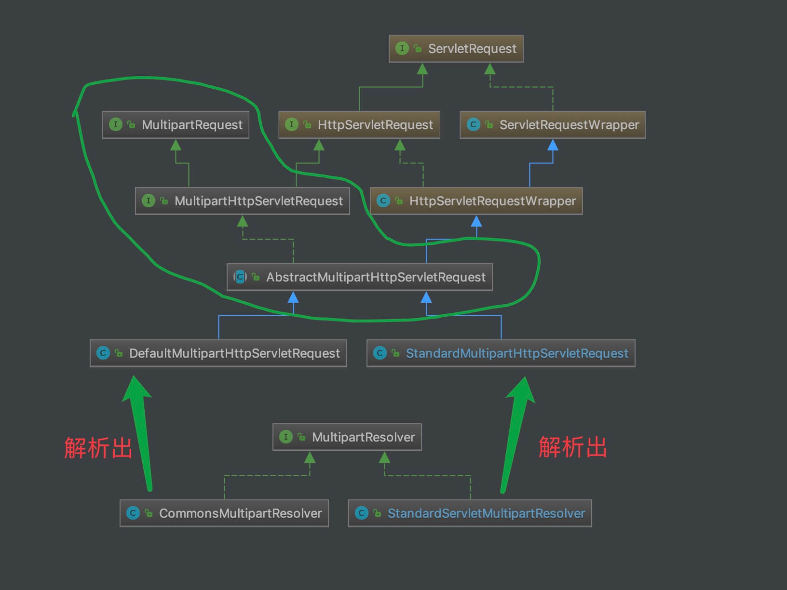

## 1. 概述

本文，我们来分享 MultipartResolver 组件。在 [《精尽 Spring MVC 源码分析 —— 组件一览》](http://svip.iocoder.cn/Spring-MVC/Components-intro) 中，我们对它已经做了介绍：

`org.springframework.web.multipart.MultipartResolver` ，内容类型( `Content-Type` )为 `multipart/*` 的请求的解析器接口。

例如，文件上传请求，MultipartResolver 会将 HttpServletRequest 封装成 MultipartHttpServletRequest ，这样从 MultipartHttpServletRequest 中获得上传的文件。具体的使用示例，参见 [《spring-boot 上传文件 MultiPartFile 获取不到文件问题解决》](https://blog.csdn.net/happy_cheng/article/details/54178392)

关于内容类型( `Content-Type` )为 `multipart/*` ，胖友可以看看 [《HTTP 协议之 multipart/form-data 请求分析》](https://blog.csdn.net/five3/article/details/7181521) 文章。

MultipartResolver 接口，代码如下：

```java
// MultipartResolver.java

public interface MultipartResolver {

    /**
     * 是否为 multipart 请求
     */
    boolean isMultipart(HttpServletRequest request);

    /**
     * 将 HttpServletRequest 请求封装成 MultipartHttpServletRequest 对象
     */
    MultipartHttpServletRequest resolveMultipart(HttpServletRequest request) throws MultipartException;

    /**
     * 清理处理 multipart 产生的资源，例如临时文件
     *
     */
    void cleanupMultipart(MultipartHttpServletRequest request);

}
```

## 2. 类图

MultipartResolver 的体系结构如下：



一共有两块：

上半部分，MultipartRequest 接口及其实现类

下半部分，MultipartResolver 接口以及其实现类

## 3. 初始化

我们以**默认配置的 Spring Boot 场景**下为例，来一起看看 DispatcherServlet 的 `#initMultipartResolver(ApplicationContext context)` 方法，初始化 `multipartResolver` 变量。代码如下：

```java
// DispatcherServlet.java

/** MultipartResolver used by this servlet. */
@Nullable
private MultipartResolver multipartResolver;

private void initMultipartResolver(ApplicationContext context) {
	try {
	    // 获得 MULTIPART_RESOLVER_BEAN_NAME 对应的 MultipartResolver Bean 对象
		this.multipartResolver = context.getBean(MULTIPART_RESOLVER_BEAN_NAME, MultipartResolver.class);
		if (logger.isTraceEnabled()) {
			logger.trace("Detected " + this.multipartResolver);
		} else if (logger.isDebugEnabled()) {
			logger.debug("Detected " + this.multipartResolver.getClass().getSimpleName());
		}
	} catch (NoSuchBeanDefinitionException ex) {
		// Default is no multipart resolver.
		this.multipartResolver = null;
		if (logger.isTraceEnabled()) {
			logger.trace("No MultipartResolver '" + MULTIPART_RESOLVER_BEAN_NAME + "' declared");
		}
	}
}
```

默认情况下，`multipartResolver` 对应的是 StandardServletMultipartResolver 类的 Bean 对象。

## 4. StandardServletMultipartResolver

`org.springframework.web.multipart.support.StandardServletMultipartResolver` ，实现 MultipartResolver 接口，使用 Servlet 3.0 标准的上传 API 的 MultipartResolver 实现类。

### 4.1 构造方法

```java
// StandardServletMultipartResolver.java

/**
 * 是否延迟解析
 */
private boolean resolveLazily = false;
```

`resolveLazily` 属性，是否延迟解析。什么意思呢？就是是否在需要获得对应文件时，在进行文件的解析。

### 4.2 isMultipart

实现 `#isMultipart(HttpServletRequest request)` 方法，代码如下：

```java
// StandardServletMultipartResolver.java

@Override
public boolean isMultipart(HttpServletRequest request) {
	return StringUtils.startsWithIgnoreCase(request.getContentType(), "multipart/");
}
```

### 4.3 resolveMultipart

实现 `#resolveMultipart(HttpServletRequest request)` 方法，创建 StandardMultipartHttpServletRequest 对象。代码如下：

```java
// StandardServletMultipartResolver.java

@Override
public MultipartHttpServletRequest resolveMultipart(HttpServletRequest request) throws MultipartException {
	return new StandardMultipartHttpServletRequest(request, this.resolveLazily);
}
```

如果此处传入的 `resolveLazily = true` ，则不会进行解析。

关于 StandardMultipartHttpServletRequest 类，在 [「4.5 StandardMultipartHttpServletRequest」](http://svip.iocoder.cn/Spring-MVC/MultipartResolver/#) 中，详细解析。

### 4.4 cleanupMultipart

实现 `#cleanupMultipart(MultipartHttpServletRequest request)` 方法，删除临时的 `javax.servlet.http.Part` 们。代码如下：

```java
// StandardServletMultipartResolver.java

@Override
public void cleanupMultipart(MultipartHttpServletRequest request) {
    if (!(request instanceof AbstractMultipartHttpServletRequest) ||
            ((AbstractMultipartHttpServletRequest) request).isResolved()) {
        // To be on the safe side: explicitly delete the parts,
        // but only actual file parts (for Resin compatibility)
        try {
            // 删除临时的 Part 们
            for (Part part : request.getParts()) {
                if (request.getFile(part.getName()) != null) {
                    part.delete();
                }
            }
        } catch (Throwable ex) {
            LogFactory.getLog(getClass()).warn("Failed to perform cleanup of multipart items", ex);
        }
    }
}
```

### 4.5 StandardMultipartHttpServletRequest

`org.springframework.web.multipart.support.StandardMultipartHttpServletRequest` ，继承 AbstractMultipartHttpServletRequest 抽象类，基于 Servlet 3.0 的 Multipart HttpServletRequest 实现类。

#### 4.5.1 构造方法

```java
// StandardMultipartHttpServletRequest.java

/**
 * 普通参数名的集合
 */
@Nullable
private Set<String> multipartParameterNames;

public StandardMultipartHttpServletRequest(HttpServletRequest request) throws MultipartException {
	this(request, false);
}

public StandardMultipartHttpServletRequest(HttpServletRequest request, boolean lazyParsing)
		throws MultipartException {
	super(request);
	// <1> 如果不延迟加载，则解析请求
	if (!lazyParsing) {
		parseRequest(request);
	}
}
```

`multipartParameterNames` 属性，普通参数名的集合。普通参数名，指的是非上传文件的参数名。

`<1>` 处，如果不延迟加载，调用 `#parseRequest(HttpServletRequest request)` 方法，则解析请求。详细解析，见 [「4.5.2 parseRequest」](http://svip.iocoder.cn/Spring-MVC/MultipartResolver/#) 。

#### 4.5.2 parseRequest

`#parseRequest(HttpServletRequest request)` 方法，解析请求。代码如下：

```java
// StandardMultipartHttpServletRequest.java

private void parseRequest(HttpServletRequest request) {
    try {
        Collection<Part> parts = request.getParts();
        this.multipartParameterNames = new LinkedHashSet<>(parts.size());
        MultiValueMap<String, MultipartFile> files = new LinkedMultiValueMap<>(parts.size());

        // <1> 遍历 parts 数组
        for (Part part : parts) {
            // <1.1> 获得 CONTENT_DISPOSITION 头的值
            String headerValue = part.getHeader(HttpHeaders.CONTENT_DISPOSITION);
            // <1.2> 获得 ContentDisposition 对象
            ContentDisposition disposition = ContentDisposition.parse(headerValue);
            // <1.3> 获得文件名
            String filename = disposition.getFilename();
            // <1.4> 情况一，文件名非空，说明是文件参数，则创建 StandardMultipartFile 对象，添加到 files 中
            if (filename != null) {
                if (filename.startsWith("=?") && filename.endsWith("?=")) {
                    filename = MimeDelegate.decode(filename);
                }
                files.add(part.getName(), new StandardMultipartFile(part, filename));
            // <1.5> 情况二，文件名为空，说明是普通参数，则添加 part.name 到 multipartParameterNames 中
            } else {
                this.multipartParameterNames.add(part.getName());
            }
        }
        // <2> 设置到 multipartFiles 属性
        setMultipartFiles(files);
    } catch (Throwable ex) {
        // <3>
        handleParseFailure(ex);
    }
}
```

`<1>` 处，遍历 `parts` 数组，逐个解析参数。

`<1.1>` 处，获得 `CONTENT_DISPOSITION` 头的值。

`<1.2>` 处，调用 `ContentDisposition#parse(String contentDisposition)` 方法，获得 ContentDisposition 对象。这个方法，暂时不细讲，感兴趣的胖友，自己去瞅瞅。

`<1.3>` 处，获得文件名。

`<1.4>` 处，情况一，文件名非空，说明是**文件参数**，则创建 StandardMultipartFile 对象，添加到 `files` 中。其中，StandardMultipartFile 是 StandardMultipartHttpServletRequest 的内部类，点击 [传送门](https://github.com/spring-projects/spring-framework/blob/master/spring-web/src/main/java/org/springframework/web/multipart/support/StandardMultipartHttpServletRequest.java#L206-L271) 链接，胖友瞅瞅。

`<1.5>` 处，情况二，文件名为空，说明是**普通参数**，则添加 `part.name` 到 `multipartParameterNames` 中。

`<2>` 处，调用父类 AbstractMultipartHttpServletRequest 的 `#setMultipartFiles(MultiValueMap<String, MultipartFile> multipartFiles)` 方法，设置 `multipartFiles` 属性。代码如下：

```java
// AbstractMultipartHttpServletRequest.java

@Nullable
private MultiValueMap<String, MultipartFile> multipartFiles;

protected final void setMultipartFiles(MultiValueMap<String, MultipartFile> multipartFiles) {
	this.multipartFiles =
			new LinkedMultiValueMap<>(Collections.unmodifiableMap(multipartFiles));
}
```

`<3>` 处，如果发生异常，调用 `#handleParseFailure(Throwable ex)` 方法，抛出封装的异常。代码如下：

```java
// StandardMultipartHttpServletRequest.java.java

protected void handleParseFailure(Throwable ex) {
	String msg = ex.getMessage();
	if (msg != null && msg.contains("size") && msg.contains("exceed")) {
		throw new MaxUploadSizeExceededException(-1, ex);
	}
	throw new MultipartException("Failed to parse multipart servlet request", ex);
}
```

#### 4.5.3 initializeMultipart

如果我们开启 `lazyParsing` 延迟解析的功能，则可通过 `multipartParameterNames` 属性是否为 `null` 来判断，是否已经初始化。示例代码如下：

```java
// StandardMultipartHttpServletRequest.java.java

if (this.multipartParameterNames == null) {
	initializeMultipart();
}
```

其中，实现 `#initializeMultipart()` 方法，内部调用 `#parseRequest(HttpServletRequest request)` 方法，解析请求。代码如下：

```java
// StandardMultipartHttpServletRequest.java

@Override
protected void initializeMultipart() {
	parseRequest(getRequest());
}
```

#### 4.5.4 getFile

`#getFile(String name)` 方法，是由父类 AbstractMultipartHttpServletRequest 统一实现，代码如下：

```java
// StandardMultipartHttpServletRequest.java

@Override
public MultipartFile getFile(String name) {
	return getMultipartFiles().getFirst(name);
}

protected MultiValueMap<String, MultipartFile> getMultipartFiles() {
	// 如果未初始化，则进行初始化
    if (this.multipartFiles == null) {
		initializeMultipart();
	}
	// 返回
	return this.multipartFiles;
}
```

## 5. CommonsMultipartResolver

`org.springframework.web.multipart.commons.CommonsMultipartResolver` ，实现 MultipartResolver、ServletContextAware 接口，继承 CommonsFileUploadSupport 抽象类，基于 [`commons-fileupload`](http://commons.apache.org/proper/commons-fileupload) 的 Multipart HttpServletRequest 实现类。

