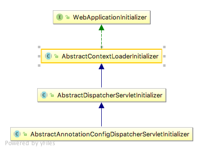

今天我们来放松下心情，不聊分布式，云原生，来聊一聊初学者接触的最多的 java web 基础。几乎所有人都是从 servlet，jsp，filter 开始编写自己的第一个 hello world 工程。那时，还离不开 `web.xml` 的配置，在 xml 文件中编写繁琐的 servlet 和 filter 的配置。随着 spring 的普及，配置逐渐演变成了两种方式 —— java configuration 和 xml 配置共存。现如今，springboot 的普及，java configuration 成了主流，xml 配置似乎已经“灭绝”了。不知道你有没有好奇过，这中间都发生了哪些改变，web.xml 中的配置项又是被什么替代项取代了？

## 1. Servlet 3.0 以前的时代

为了体现出整个演进过程，还是来回顾下 n 年前我们是怎么写 servlet 和 filter 代码的。

项目结构（本文都采用 maven 项目结构）

```
.
├── pom.xml
├── src
    ├── main
    │   ├── java
    │   │   └── moe
    │   │       └── cnkirito
    │   │           ├── filter
    │   │           │   └── HelloWorldFilter.java
    │   │           └── servlet
    │   │               └── HelloWorldServlet.java
    │   └── resources
    │       └── WEB-INF
    │           └── web.xml
    └── test
        └── java
```

```java
public class HelloWorldServlet extends HttpServlet {

    @Override
    protected void doGet(HttpServletRequest req, HttpServletResponse resp) throws ServletException, IOException {
        resp.setContentType("text/plain");
        PrintWriter out = resp.getWriter();
        out.println("hello world");
    }

}
```

```java
public class HelloWorldFilter implements Filter {

    @Override
    public void init(FilterConfig filterConfig) throws ServletException {

    }

    @Override
    public void doFilter(ServletRequest servletRequest, ServletResponse servletResponse, FilterChain filterChain) throws IOException, ServletException {
        System.out.println("触发 hello world 过滤器...");
        filterChain.doFilter(servletRequest,servletResponse);
    }

    @Override
    public void destroy() {

    }
}
```

别忘了在 `web.xml` 中配置 servlet 和 filter 。

```xml
<?xml version="1.0" encoding="UTF-8"?>
<web-app xmlns="http://java.sun.com/xml/ns/javaee"
           xmlns:xsi="http://www.w3.org/2001/XMLSchema-instance"
           xsi:schemaLocation="http://java.sun.com/xml/ns/javaee
        http://java.sun.com/xml/ns/javaee/web-app_4_0.xsd"
           version="4.0">

    <servlet>
        <servlet-name>HelloWorldServlet</servlet-name>
        <servlet-class>moe.cnkirito.servlet.HelloWorldServlet</servlet-class>
    </servlet>

    <servlet-mapping>
        <servlet-name>HelloWorldServlet</servlet-name>
        <url-pattern>/hello</url-pattern>
    </servlet-mapping>

    <filter>
        <filter-name>HelloWorldFilter</filter-name>
        <filter-class>moe.cnkirito.filter.HelloWorldFilter</filter-class>
    </filter>
    <filter-mapping>
        <filter-name>HelloWorldFilter</filter-name>
        <url-pattern>/hello</url-pattern>
    </filter-mapping>

</web-app>
```

这样，一个 java web hello world 就完成了。当然，本文不是 servlet 的入门教程，只是为了对比。

## 2. Servlet 3.0 新特性

Servlet 3.0 作为 Java EE 6 规范体系中一员，随着 Java EE 6 规范一起发布。该版本在前一版本（Servlet 2.5）的基础上提供了若干新特性用于简化 Web 应用的开发和部署。其中一项新特性便是提供了无 xml 配置的特性。

servlet3.0 首先提供了 `@WebServlet` ，`@WebFilter` 等注解，这样便有了抛弃 `web.xml` 的第一个途径，凭借注解声明 servlet 和 filter 来做到这一点。

除了这种方式，servlet3.0 规范还提供了更强大的功能，可以在运行时动态注册 servlet ，filter，listener。以 servlet 为例，过滤器与监听器与之类似。ServletContext 为动态配置 Servlet 增加了如下方法：

- ServletRegistration.Dynamic addServlet(String servletName,Class<? extends Servlet> servletClass)
- ServletRegistration.Dynamic addServlet(String servletName, Servlet servlet)
- ServletRegistration.Dynamic addServlet(String servletName, String className)
- T createServlet(Class clazz)
- ServletRegistration getServletRegistration(String servletName)
- Map<String,? extends ServletRegistration> getServletRegistrations()

其中前三个方法的作用是相同的，只是参数类型不同而已；

通过 `#createServlet(Class clazz)` 方法创建的 Servlet，通常需要做一些自定义的配置，然后使用 `#addServlet(...)` 方法来将其动态注册为一个可以用于服务的 Servlet。

两个 `#getServletRegistration()` 方法主要用于动态为 Servlet 增加映射信息，这等价于在 `web.xml` 中使用 标签为存在的 Servlet 增加映射信息。

以上 ServletContext 新增的方法：

* 要么是在 `javax.servlet.ServletContextListener` 的 `#contextInitialized(ServletContextEvent sce)` 方法中调用。
* 要么是在 `javax.servlet.ServletContainerInitializer` 的 `#onStartup(Set<Class<?>> c, ServletContext ctx)` 方法中调用。

ServletContainerInitializer 也是 Servlet 3.0 新增的一个接口，容器在启动时使用 JAR 服务 API(JAR Service API) 来发现 ServletContainerInitializer 的实现类，并且容器将 `WEB-INF/lib` 目录下 JAR 包中的类都交给该类的 `#onStartup(...)` 方法处理，我们通常需要在该实现类上使用 `@HandlesTypes` 注解来指定希望被处理的类，过滤掉不希望给 `#onStartup(...)` 处理的类。

一个典型的 servlet3.0+ 的 web 项目结构如下：

```
.
├── pom.xml
└── src
    ├── main
    │   ├── java
    │   │   └── moe
    │   │       └── cnkirito
    │   │           ├── CustomServletContainerInitializer.java
    │   │           ├── filter
    │   │           │   └── HelloWorldFilter.java
    │   │           └── servlet
    │   │               └── HelloWorldServlet.java
    │   └── resources
    │       └── META-INF
    │           └── services
    │               └── javax.servlet.ServletContainerInitializer
    └── test
        └── java
```

我并未对 HelloWorldServlet 和 HelloWorldFilter 做任何改动，而是新增了一个 CustomServletContainerInitializer ,它实现了 `javax.servlet.ServletContainerInitializer` 接口，用来在 web 容器启动时加载指定的 servlet 和 filter，代码如下：

```java
public class CustomServletContainerInitializer implements ServletContainerInitializer {

	private final static String JAR_HELLO_URL = "/hello";
	
	@Override
	  public void onStartup(Set<Class<?>> c, ServletContext servletContext) {
	  
		System.out.println("创建 helloWorldServlet...");
		
		ServletRegistration.Dynamic servlet = servletContext.addServlet(
		            HelloWorldServlet.class.getSimpleName(),
		            HelloWorldServlet.class);
		servlet.addMapping(JAR_HELLO_URL);
		
		System.out.println("创建 helloWorldFilter...");
		
		FilterRegistration.Dynamic filter = servletContext.addFilter(
		            HelloWorldFilter.class.getSimpleName(), HelloWorldFilter.class);
		EnumSet<DispatcherType> dispatcherTypes = EnumSet.allOf(DispatcherType.class);
		dispatcherTypes.add(DispatcherType.REQUEST);
		dispatcherTypes.add(DispatcherType.FORWARD);
		filter.addMappingForUrlPatterns(dispatcherTypes, true, JAR_HELLO_URL);
	}
	
}
```

对上述代码进行一些解读。ServletContext 我们称之为 servlet 上下文，它维护了整个 web 容器中注册的 servlet，filter，listener，以 servlet 为例，可以使用 `servletContext.addServlet` 等方法来添加 servlet。而方法入参中 `Set<Class<?>> c` 和 `@HandlesTypes` 注解在 demo 中我并未使用，感兴趣的朋友可以 debug 看看到底获取了哪些 class ，一般正常的流程是使用 `@HandlesTypes` 指定需要处理的 class，而后对 `Set<Class<?>>` 进行判断是否属于该 class，正如前文所言，`#onStartup(...)` 会加载不需要被处理的一些 class。

这么声明一个 ServletContainerInitializer 的实现类，web 容器并不会识别它，所以，需要借助 SPI 机制来指定该初始化类，这一步骤是通过在项目路径下创建 `META-INF/services/javax.servlet.ServletContainerInitializer` 来做到的，它只包含一行内容：

```
moe.cnkirito.CustomServletContainerInitializer
```

使用 ServletContainerInitializer 和 SPI 机制，我们的 web 应用便可以彻底摆脱 `web.xml` 了。

## 3. Spring 是如何支持 Servlet 3.0 的？

回到我们的 spring 全家桶，可能已经忘了具体是什么时候开始不写 web.xml 了，我只知道现在的项目已经再也看不到它了，spring 又是如何支持 servlet3.0 规范的呢？

寻找 spring 中 ServletContainerInitializer 的实现类并不困难，可以迅速定位到 `org.springframework.web.SpringServletContainerInitializer` 该实现类。

```java
@HandlesTypes(WebApplicationInitializer.class)
public class SpringServletContainerInitializer implements ServletContainerInitializer {

    @Override
	public void onStartup(Set<Class<?>> webAppInitializerClasses, ServletContext servletContext)
			throws ServletException {

		List<WebApplicationInitializer> initializers = new LinkedList<WebApplicationInitializer>();

		if (webAppInitializerClasses != null) {
			for (Class<?> waiClass : webAppInitializerClasses) {
				// Be defensive: Some servlet containers provide us with invalid classes,
				// no matter what @HandlesTypes says...
                // <1>
				if (!waiClass.isInterface() && !Modifier.isAbstract(waiClass.getModifiers()) &&
						WebApplicationInitializer.class.isAssignableFrom(waiClass)) {
					try {
						initializers.add((WebApplicationInitializer) waiClass.newInstance());
					}
					catch (Throwable ex) {
						throw new ServletException("Failed to instantiate WebApplicationInitializer class", ex);
					}
				}
			}
		}

		if (initializers.isEmpty()) {
			servletContext.log("No Spring WebApplicationInitializer types detected on classpath");
			return;
		}

		servletContext.log(initializers.size() + " Spring WebApplicationInitializers detected on classpath");
		AnnotationAwareOrderComparator.sort(initializers);
        // <2>
		for (WebApplicationInitializer initializer : initializers) {
			initializer.onStartup(servletContext);
		}
	}
}
```

查看其 java doc，描述如下：

> Servlet 3.0 {@link ServletContainerInitializer} designed to support code-based configuration of the servlet container using Spring’s {@link WebApplicationInitializer} SPI as opposed to (or possibly in combination with) the traditional {@code web.xml}-based approach.

注意我在源码中标注两个序号，这对于我们理解 spring 装配 servlet 的流程来说非常重要。

`<1>` 英文注释是 spring 源码中自带的，它提示我们由于 servlet 厂商实现的差异，onStartup 方法会加载我们本不想处理的 class，所以进行了特判。**另外，也要注意下 `@HandlesTypes(WebApplicationInitializer.class)` 注解**，如果厂商正确的实现 `@HandlesTypes` 的逻辑，传入的 `Set<Class<?>> webAppInitializerClasses` 都是 WebApplicationInitializer 对象。

`<2>` spring 与我们之前的 demo 不同，并没有在 SpringServletContainerInitializer 中直接对 servlet 和 filter 进行注册，而是委托给了一个陌生的类 `org.springframework.web.WebApplicationInitializer` 。WebApplicationInitializer 类便是 spring 用来初始化 web 环境的委托者类，它通常有三个实现类：



你一定不会对 DispatcherServlet 感到陌生，`AbstractDispatcherServletInitializer#registerDispatcherServlet` 便是无 `web.xml` 前提下创建 DispatcherServlet 的关键代码。代码如下：

```java
// AbstractDispatcherServletInitializer.java

@Override
public void onStartup(ServletContext servletContext) throws ServletException {
    // 调用父类启动的逻辑
    super.onStartup(servletContext);
    // 注册 DispacherServlt
    registerDispatcherServlet(servletContext);
}

protected void registerDispatcherServlet(ServletContext servletContext) {
    // 获得 Servlet 名
    String servletName = getServletName();
    Assert.hasLength(servletName, "getServletName() must not return null or empty");

    // <1> 创建 WebApplicationContext 对象
    WebApplicationContext servletAppContext = createServletApplicationContext();
    Assert.notNull(servletAppContext, "createServletApplicationContext() must not return null");

    // <2> 创建 FrameworkServlet 对象
    FrameworkServlet dispatcherServlet = createDispatcherServlet(servletAppContext);
    Assert.notNull(dispatcherServlet, "createDispatcherServlet(WebApplicationContext) must not return null");
    dispatcherServlet.setContextInitializers(getServletApplicationContextInitializers());

	ServletRegistration.Dynamic registration = servletContext.addServlet(servletName, dispatcherServlet);
	if (registration == null) {
		throw new IllegalStateException("Failed to register servlet with name '" + servletName + "'. " +
				"Check if there is another servlet registered under the same name.");
	}

	registration.setLoadOnStartup(1);
	registration.addMapping(getServletMappings());
	registration.setAsyncSupported(isAsyncSupported());

	// <3> 注册过滤器    
	Filter[] filters = getServletFilters();
	if (!ObjectUtils.isEmpty(filters)) {
		for (Filter filter : filters) {
			registerServletFilter(servletContext, filter);
		}
	}

	customizeRegistration(registration);
}
```

`<1>` 处，调用 `#createServletApplicationContext()` 方法，创建 WebApplicationContext 对象。代码如下：

```java
// AbstractAnnotationConfigDispatcherServletInitializer.java

@Override
protected WebApplicationContext createServletApplicationContext() {
	AnnotationConfigWebApplicationContext context = new AnnotationConfigWebApplicationContext();
	Class<?>[] configClasses = getServletConfigClasses();
	if (!ObjectUtils.isEmpty(configClasses)) {
		context.register(configClasses);
	}
	return context;
}
```

该方法由子类 AbstractAnnotationConfigDispatcherServletInitializer 重写，并且创建的 WebApplicationContext 的子类 AnnotationConfigWebApplicationContext 对象。

`<2>` 处，调用 `#createDispatcherServlet(WebApplicationContext servletAppContext)` 方法，创建 FrameworkServlet 对象。代码如下：

```java
// AbstractDispatcherServletInitializer.java

protected FrameworkServlet createDispatcherServlet(WebApplicationContext servletAppContext) {
	return new DispatcherServlet(servletAppContext);
}
```

创建 FrameworkServlet 的子类 DispatcherServlet 对象。

另外，比较有趣的是传入的 `servletAppContext` 方法参数，这就是该 DispatcherServlet 的 **Servlet WebApplicationContext 容器**啊。

然后，我们可以去项目中寻找一下 `org.springframework:spring-web:version` 的依赖，它下面就存在一个 ServletContainerInitializer 的扩展，指向了 SpringServletContainerInitializer，这样只要在 servlet 3.0 环境下部署，spring 便可以自动加载进行初始化：


注意，上述这一切特性从 spring 3 就已经存在了，而如今 spring 5 已经伴随 springboot 2.0 一起发行了。
