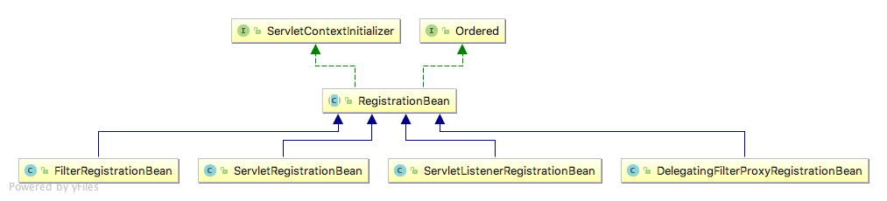
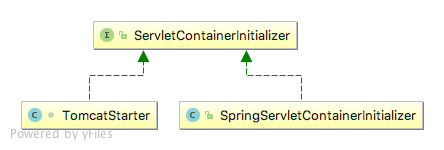
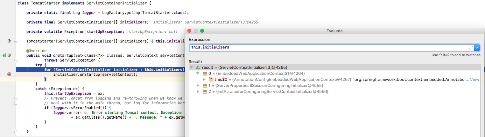
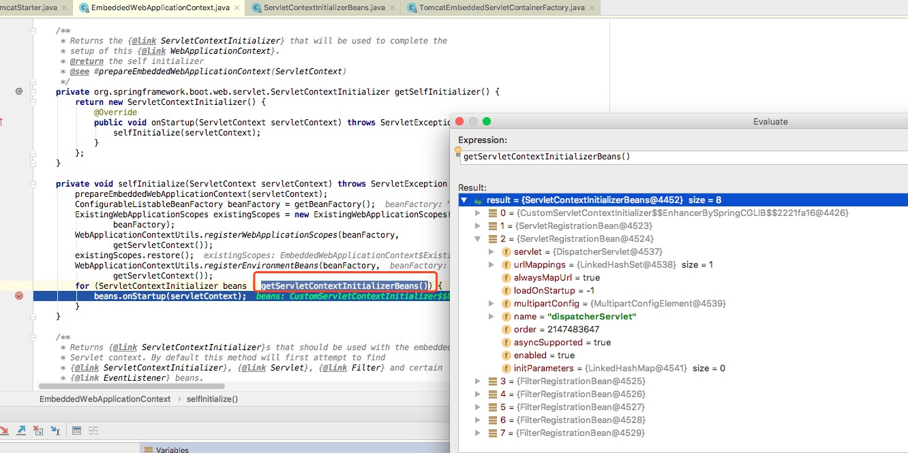

## 1. Spring Boot 如何加载 Servlet？

读到这儿，你已经阅读了全文的 1/2。Spring Boot 对于 servlet 的处理才是重头戏：

* 其一，是因为 Spring Boot 使用范围很广，很少有人用 spring 而不用 Spring Boot 了。
* 其二，是因为它没有完全遵守 Servlet3.0 的规范！

是的，前面所讲述的 servlet 的规范，无论是 `web.xml` 中的配置，还是 servlet3.0 中的 ServletContainerInitializer 和 Spring Boot 的加载流程都没有太大的关联。按照惯例，先卖个关子，先看看如何在 Spring Boot 中注册 servlet 和 filter，再来解释下 Spring Boot 的**独特**之处。

### 1.1 注册方式一：Servlet 3.0 注解 + @ServletComponentScan

Spring Boot 依旧兼容 Servlet 3.0 一系列以 `@Web*` 开头的注解：`@WebServlet`，`@WebFilter`，`@WebListener` 。

```java
@WebServlet("/hello")
public class HelloWorldServlet extends HttpServlet{}
@WebFilter("/hello/*")
public class HelloWorldFilter implements Filter {}
```

不要忘记让启动类去扫描到这些注解

```java
@SpringBootApplication
@ServletComponentScan
public class SpringBootServletApplication {

   public static void main(String[] args) {
      SpringApplication.run(SpringBootServletApplication.class, args);
   }
}
```

我认为这是几种方式中最为简洁的方式，如果真的有特殊需求，需要在 Spring Boot 下注册 servlet，filter，可以采用这样的方式，比较直观。

另外，`@ServletComponentScan` 在 `org.springframework.boot.web.servlet` 包下。

> 大体原理，`@ServletComponentScan` 注解上的 `@Import(ServletComponentScanRegistrar.class)` ，它会将扫描到的 `@WebServlet`、`@WebFilter`、`@WebListener` 的注解对应的类，最终封装成 FilterRegistrationBean、ServletRegistrationBean、ServletListenerRegistrationBean 对象，注册到 Spring 容器中。也就是说，**和注册方式二：RegistrationBean 统一了**。

### 1.2 注册方式二：RegistrationBean

```java
@Bean
public ServletRegistrationBean helloWorldServlet() {
    ServletRegistrationBean helloWorldServlet = new ServletRegistrationBean();
    myServlet.addUrlMappings("/hello");
    myServlet.setServlet(new HelloWorldServlet());
    return helloWorldServlet;
}

@Bean
public FilterRegistrationBean helloWorldFilter() {
    FilterRegistrationBean helloWorldFilter = new FilterRegistrationBean();
    myFilter.addUrlPatterns("/hello/*");
    myFilter.setFilter(new HelloWorldFilter());
    return helloWorldFilter;
}
```

ServletRegistrationBean 和 FilterRegistrationBean 都集成自 RegistrationBean ，RegistrationBean 是 Spring Boot 中广泛应用的一个注册类，负责把 servlet，filter，listener 给容器化，使他们被 Spring 托管，并且完成自身对 Web 容器的注册。这种注册方式也值得推崇。



从图中可以看出 RegistrationBean 的地位，它的几个实现类作用分别是：

前三个，帮助容器注册 filter，servlet，listener 。

最后的 DelegatingFilterProxyRegistrationBean 使用的不多，但熟悉 Spring Security 的朋友不会感到陌生，SpringSecurityFilterChain 就是通过这个代理类来调用的。

另外 RegistrationBean 实现了 ServletContextInitializer 接口，这个接口将会是下面分析的核心接口，大家先混个眼熟，了解下它有一个抽象实现 RegistrationBean 即可。

## 2. SpringBoot 中 Servlet 加载流程的源码分析

暂时只介绍这两种方式，下面解释下之前卖的关子，为什么说 Spring Boot 没有完全遵守 servlet3.0 规范。讨论的前提是 Spring Boot 环境下使用**内嵌**的容器，比如最典型的 Tomcat 。

高能预警，以下内容比较烧脑，觉得看起来吃力的朋友可以跳过本节直接看下一节的总结！

### 2.1 Initializer 被替换为 TomcatStarter

当使用内嵌的 Tomcat 时，你会发现 Spring Boot 完全走了另一套初始化流程，完全没有使用前面提到的 SpringServletContainerInitializer ，实际上一开始我在各种 ServletContainerInitializer 的实现类中打了断点，最终定位到，根本没有运行到 SpringServletContainerInitializer 内部，**而是进入了 `org.springframework.boot.web.embedded.tomcat.TomcatStarter` 这个类中**。



并且，仔细扫了一眼源码的包，并没有发现有 SPI 文件对应到 TomcatStarter。于是我猜想，**内嵌 Tomcat 的加载可能不依赖于 Servlet3.0 规范和 SPI** ！它完全走了一套独立的逻辑。为了验证这一点，我翻阅了 Spring Github 中的 issue，得到了 Spring 作者**肯定**的答复：https://github.com/spring-projects/spring-boot/issues/321

> This was actually an intentional design decision. The search algorithm used by the containers was problematic. It also causes problems when you want to develop an executable WAR as you often want a `javax.servlet.ServletContainerInitializer` for the WAR that is not executed when you run `java -jar`.
>
> See the `org.springframework.boot.context.embedded.ServletContextInitializer` for an option that works with Spring Beans.

Spring Boot 这么做是**有意**而为之。Spring Boot 考虑到了如下的问题，我们在使用 Spring Boot 时，开发阶段一般都是使用内嵌 Tomcat 容器，但部署时却存在两种选择：一种是打成 jar 包，使用 `java -jar` 的方式运行；另一种是打成 war 包，交给外置容器去运行。

**前者就会导致容器搜索算法出现问题，因为这是 jar 包的运行策略，不会按照 Servlet 3.0 的策略去加载 ServletContainerInitializer**！

最后作者还提供了一个替代选项：Servlet**Context**Initializer，注意是 Servlet**Context**Initializer ！它和 Servlet**Container**Initializer 长得特别像，别搞混淆了！

前者 ServletContextInitializer 是 `org.springframework.boot.web.servlet.ServletContextInitializer` 。

后者 ServletContainerInitializer 是 `javax.servlet.ServletContainerInitializer` 。前文还提到 RegistrationBean 实现了 ServletContextInitializer 接口。

### 2.2 TomcatStarter 中的 ServletContextInitializer 是关键

TomcatStarter 中 `org.springframework.boot.context.embedded.ServletContextInitializer[] initializers` 属性，是 Spring Boot 初始化 servlet，filter，listener 的关键。代码如下：

```java
class TomcatStarter implements ServletContainerInitializer {

   private final ServletContextInitializer[] initializers;

   TomcatStarter(ServletContextInitializer[] initializers) {
      this.initializers = initializers;
   }

   @Override
   public void onStartup(Set<Class<?>> classes, ServletContext servletContext) throws ServletException {
         for (ServletContextInitializer initializer : this.initializers) {
            initializer.onStartup(servletContext);
         }
   }
   
}
```

经过删减源码后，可以看出 TomcatStarter 的主要逻辑，它其实就是负责调用一系列 ServletContextInitializer 的 `#onStartup(ServletContext servletContext)` 方法，那么在 debug 中，`ServletContextInitializer[] initializers` 到底包含了哪些类呢？会不会有我们前面介绍的 RegistrationBean 呢？



太天真了，RegistrationBean 并没有出现在 TomcatStarter 的 debug 信息中，`initializers` 只包含了三个类，其中只有第一个类看上去比较核心，注意第一个类不是 EmbeddedWebApplicationContext ！而是这个类中的 `$1` 匿名类，为了搞清楚 Spring Boot 如何加载 filter、servlet、listener ，看来还得研究下 EmbeddedWebApplicationContext 的结构。

> 如果胖友是使用 Spring Boot 2.0 进行调试的，和本文在具体的实现类会有一些差异。当然，内核不变，胖友可以和艿艿一样对照着看。例如，EmbeddedWebApplicationContext 的逻辑，应该是修改到了 ServletWebServerApplicationContext 中。

### 2.3 EmbeddedWebApplicationContext 中的 6 层迭代加载

ApplicationContext 大家应该是比较熟悉的，这是 spring 一个比较核心的类，一般我们可以从中获取到那些注册在容器中的托管 Bean，而这篇文章，主要分析的便是它在内嵌容器中的实现类：

`org.springframework.boot.context.embedded.EmbeddedWebApplicationContext` ，重点分析它加载 filter servlet listener 这部分的代码。**这里是整个代码中迭代层次最深的部分，做好心理准备起航**，来看看 EmbeddedWebApplicationContext 是怎么获取到所有的 servlet、filter、listener 的！以下方法均出自于 EmbeddedWebApplicationContext 。

**第一层：onRefresh()**

`#onRefresh()` 方法，是 ApplicationContext 的生命周期方法，EmbeddedWebApplicationContext 的实现非常简单，只干了一件事：

```java
@Override
protected void onRefresh() {
   super.onRefresh();
   try {
      createEmbeddedServletContainer(); //第二层的入口
   } catch (Throwable ex) {
      throw new ApplicationContextException("Unable to start embedded container",
            ex);
   }
}
```

调用 `#createEmbeddedServletContainer()` 方法，连接到了第二层。

**第二层：createEmbeddedServletContainer()**

看名字 Spring 是想创建一个内嵌的 Servlet 容器，ServletContainer 其实就是 servlet、filter、listener 的总称。

```java
private void createEmbeddedServletContainer() {
   EmbeddedServletContainer localContainer = this.embeddedServletContainer;
   ServletContext localServletContext = getServletContext();
   if (localContainer == null && localServletContext == null) {
      EmbeddedServletContainerFactory containerFactory = getEmbeddedServletContainerFactory();
      this.embeddedServletContainer = containerFactory
            .getEmbeddedServletContainer(getSelfInitializer()); // 第三层的入口
   } else if (localServletContext != null) {
      try {
         getSelfInitializer().onStartup(localServletContext);
      } catch (ServletException ex) {
         throw new ApplicationContextException("Cannot initialize servlet context",
               ex);
      }
   }
   initPropertySources();
}
```

凡是带有 servlet，initializer 字样的方法，都是我们需要留意的。其中 `#getSelfInitializer()` 方法，便涉及到了我们最为关心的初始化流程，所以接着连接到了第三层。

**第三层：getSelfInitializer()**

```java
private org.springframework.boot.web.servlet.ServletContextInitializer getSelfInitializer() {
   return new ServletContextInitializer() {
   
      @Override
      public void onStartup(ServletContext servletContext) throws ServletException {
         selfInitialize(servletContext);
      }
      
   };
}

private void selfInitialize(ServletContext servletContext) throws ServletException {
   prepareEmbeddedWebApplicationContext(servletContext);
   ConfigurableListableBeanFactory beanFactory = getBeanFactory();
   ExistingWebApplicationScopes existingScopes = new ExistingWebApplicationScopes(
         beanFactory);
   WebApplicationContextUtils.registerWebApplicationScopes(beanFactory,
         getServletContext());
   existingScopes.restore();
   WebApplicationContextUtils.registerEnvironmentBeans(beanFactory,
         getServletContext());
   // 第四层的入口
   for (ServletContextInitializer beans : getServletContextInitializerBeans()) {
      beans.onStartup(servletContext);
   }
}
```

还记得前面 TomcatStarter 的 debug 信息中，第一个 ServletContextInitializer 就是出现在 EmbeddedWebApplicationContext 中的一个匿名类，没错了，就是这里的 `#getSelfInitializer()` 方法创建的！

解释下这里的 `#getSelfInitializer()` 和 `#selfInitialize(ServletContext servletContext)` 方法，**为什么要这么设计**？

这是典型的**回调式**方式，当匿名 ServletContextInitializer 类被 TomcatStarter 的 `#onStartup()` 方法调用，设计上是触发了 `#selfInitialize(ServletContext servletContext)` 方法的调用。

所以这下就清晰了，为什么 TomcatStarter 中没有出现 RegistrationBean ，其实是隐式触发了 EmbeddedWebApplicationContext 中的 `#selfInitialize(ServletContext servletContext)` 方法。这样，`#selfInitialize(ServletContext servletContext)` 方法中，调用 `#getServletContextInitializerBeans()` 方法，获得 ServletContextInitializer 数组就成了关键。所以接着连接到了第四层。

**第四层：getServletContextInitializerBeans()**

```java
/**
 * Returns {@link ServletContextInitializer}s that should be used with the embedded
 * Servlet context. By default this method will first attempt to find
 * {@link ServletContextInitializer}, {@link Servlet}, {@link Filter} and certain
 * {@link EventListener} beans.
 * @return the servlet initializer beans
 */
protected Collection<ServletContextInitializer> getServletContextInitializerBeans() {
   return new ServletContextInitializerBeans(getBeanFactory()); //第五层的入口
}
```

没错了，注释都告诉我们，这个 ServletContextInitializerBeans 类，就是用来加载 Servlet 和 Filter 的。

**第五层：ServletContextInitializerBeans 的构造方法**

```java
public ServletContextInitializerBeans(ListableBeanFactory beanFactory) {
   this.initializers = new LinkedMultiValueMap<Class<?>, ServletContextInitializer>();
   addServletContextInitializerBeans(beanFactory); // 第六层的入口
   addAdaptableBeans(beanFactory);
   List<ServletContextInitializer> sortedInitializers = new ArrayList<ServletContextInitializer>();
   for (Map.Entry<?, List<ServletContextInitializer>> entry : this.initializers
         .entrySet()) {
      AnnotationAwareOrderComparator.sort(entry.getValue());
      sortedInitializers.addAll(entry.getValue());
   }
   this.sortedList = Collections.unmodifiableList(sortedInitializers);
}
```

**第六层：addServletContextInitializerBeans(beanFactory)**

```java
// ServletContextInitializerBeans.java

private void addServletContextInitializerBeans(ListableBeanFactory beanFactory) {
   for (Entry<String, ServletContextInitializer> initializerBean : getOrderedBeansOfType(
         beanFactory, ServletContextInitializer.class)) {
      addServletContextInitializerBean(initializerBean.getKey(),
            initializerBean.getValue(), beanFactory);
   }
}
```

调用 `#getOrderedBeansOfType( beanFactory, ServletContextInitializer.class)` 方法，便是去容器中寻找注册过得 ServletContextInitializer ，这时候就可以把之前那些 RegistrationBean 全部加载出来了。并且 RegistrationBean 还实现了 Ordered 接口，在这儿用于排序。

后续的 `#addServletContextInitializerBean(ListableBeanFactory beanFactory)` 方法，胖友可以自己去瞅瞅。代码如下：

```java
// ServletContextInitializerBeans.java

private void addServletContextInitializerBeans(ListableBeanFactory beanFactory) {
	for (Entry<String, ServletContextInitializer> initializerBean : getOrderedBeansOfType(
			beanFactory, ServletContextInitializer.class)) {
		addServletContextInitializerBean(initializerBean.getKey(),
				initializerBean.getValue(), beanFactory);
	}
}

private void addServletContextInitializerBean(String beanName,
		ServletContextInitializer initializer, ListableBeanFactory beanFactory) {
	if (initializer instanceof ServletRegistrationBean) {
		Servlet source = ((ServletRegistrationBean<?>) initializer).getServlet();
		addServletContextInitializerBean(Servlet.class, beanName, initializer,
				beanFactory, source);
	} else if (initializer instanceof FilterRegistrationBean) {
		Filter source = ((FilterRegistrationBean<?>) initializer).getFilter();
		addServletContextInitializerBean(Filter.class, beanName, initializer,
				beanFactory, source);
	} else if (initializer instanceof DelegatingFilterProxyRegistrationBean) {
		String source = ((DelegatingFilterProxyRegistrationBean) initializer)
				.getTargetBeanName();
		addServletContextInitializerBean(Filter.class, beanName, initializer,
				beanFactory, source);
	} else if (initializer instanceof ServletListenerRegistrationBean) {
		EventListener source = ((ServletListenerRegistrationBean<?>) initializer)
				.getListener();
		addServletContextInitializerBean(EventListener.class, beanName, initializer,
				beanFactory, source);
	} else {
		addServletContextInitializerBean(ServletContextInitializer.class, beanName,
				initializer, beanFactory, initializer);
	}
}
```

## 3. EmbeddedWebApplicationContext加载流程总结

如果你对具体的代码流程不感兴趣，可以跳过上述的 6 层分析，直接看本节的结论。总结如下：

EmbeddedWebApplicationContext 的 `#onRefresh()` 方法，触发配置了一个匿名的 ServletContextInitializer 。

这个匿名的 ServletContextInitializer 的 `onStartup(ServletContext servletContext)` 方法，会去容器中搜索到了所有的 RegistrationBean ，并按照顺序加载到 ServletContext 中。

这个匿名的 ServletContextInitializer 最终传递给 TomcatStarter，由 TomcatStarter 的 onStartup 方法去触发 ServletContextInitializer 的 `#onStartup(ServletContext servletContext)` 方法，最终完成装配！



## 4. 第三种注册 Servlet 的方式

研究完了上述 Spring Boot 启动的内部原理，可以发现 ServletContextInitializer 其实是 Spring 中 ServletContainerInitializer 的代理，虽然 Spring Boot 中 Servlet3.0 不起作用了，但它的代理还是会被加载的，于是我们有了第三种方式注册 Servlet。代码如下：

```java
@Configuration
public class CustomServletContextInitializer implements ServletContextInitializer {

    private final static String JAR_HELLO_URL = "/hello";

    @Override
    public void onStartup(ServletContext servletContext) throws ServletException {
        System.out.println("创建 helloWorldServlet...");

        ServletRegistration.Dynamic servlet = servletContext.addServlet(
                HelloWorldServlet.class.getSimpleName(),
                HelloWorldServlet.class);
        servlet.addMapping(JAR_HELLO_URL);

        System.out.println("创建 helloWorldFilter...");

        FilterRegistration.Dynamic filter = servletContext.addFilter(
                HelloWorldFilter.class.getSimpleName(), HelloWorldFilter.class);

        EnumSet<DispatcherType> dispatcherTypes = EnumSet.allOf(DispatcherType.class);
        dispatcherTypes.add(DispatcherType.REQUEST);
        dispatcherTypes.add(DispatcherType.FORWARD);

        filter.addMappingForUrlPatterns(dispatcherTypes, true, JAR_HELLO_URL);
    }
}
```

虽然 ServletContainerInitializer 不能被内嵌容器加载，ServletContextInitializer 却能被 Spring Boot 的 EmbeddedWebApplicationContext 加载到，从而装配其中的 servlet 和 filter。

实际开发中，还是以一，二两种方法来注册为主，这里只是提供一个可能性，来让我们理解 Spring Boot 的加载流程。

## 5. 加载流程拾遗

### 5.1 TomcatStarter 既然不是通过 SPI 机制装配的，那是怎么被 Spring 使用的？

自然是被 `new` 出来的。在 `TomcatEmbeddedServletContainerFactory#configureContext(Context context, ServletContextInitializer[] initializers)` 方法中可以看到，TomcatStarter 是被主动实例化出来的，并且还传入了 ServletContextInitializer 的数组，和上面分析的一样，一共有三个 ServletContextInitializer，包含了 EmbeddedWebApplicationContext 中的匿名实现。

```java
// TomcatEmbeddedServletContainerFactory.java

protected void configureContext(Context context,
      ServletContextInitializer[] initializers) {
   // <1> 
   TomcatStarter starter = new TomcatStarter(initializers);
   // <2>
   if (context instanceof TomcatEmbeddedContext) {
      // Should be true
      ((TomcatEmbeddedContext) context).setStarter(starter);
   }
   context.addServletContainerInitializer(starter, NO_CLASSES);
   // ... 省略无关代码
}
```

`<1>` 处，创建了 TomcatStarter 对象。

【关键】`<2>` 处，通过 `context instanceof TomcatEmbeddedContext` 判断使用的是**内嵌**的 Tomcat ，所以将 TomcatStarter 作为 Initializer 。后续的逻辑，就变成了 [《精尽 Spring MVC 源码分析 —— 容器的初始化（三）之 Servlet 3.0 集成》](http://svip.iocoder.cn/Spring-MVC/context-init-integration-with-Servlet-3.0) ，只是正如本文 [「2.1 Initializer 被替换为 TomcatStarter」](http://svip.iocoder.cn/Spring-MVC/context-init-integration-with-SpringBoot/#) ，将 SpringServletContainerInitializer 替换成了 TomcatStarter 类。

如果对 `<2>` 处的逻辑感兴趣的胖友，可以在 `TomcatServletWebServerFactory#getWebServer(ServletContextInitializer... initializers)` 方法，打个断点，逐步调试下去。当然，TomcatStarter 的 构造方法和 `#onStartup(Set<Class<?>> classes, ServletContext servletContext)` 方法，这两个方法的断点，也是要打上的。这样，你就能把 [《精尽 Spring MVC 源码分析 —— 容器的初始化（三）之 Servlet 3.0 集成》](http://svip.iocoder.cn/Spring-MVC/context-init-integration-with-Servlet-3.0) ，只是正如本文 [「2.1 Initializer 被替换为 TomcatStarter」](http://svip.iocoder.cn/Spring-MVC/context-init-integration-with-Servlet-3.0) 和 [《精尽 Spring MVC 源码分析 —— 容器的初始化（四）之 Spring Boot 集成》](http://svip.iocoder.cn/Spring-MVC/context-init-integration-with-SpringBoot/) 给完整串联起来。

### 5.2 TomcatEmbeddedServletContainerFactory 又是如何被声明的？

```java
// EmbeddedServletContainerAutoConfiguration.java

@AutoConfigureOrder(Ordered.HIGHEST_PRECEDENCE)
@Configuration
@ConditionalOnWebApplication // web 环境下
@Import(BeanPostProcessorsRegistrar.class)
public class EmbeddedServletContainerAutoConfiguration {

   /**
    * Nested configuration if Tomcat is being used.
    */
   @Configuration
   @ConditionalOnClass({ Servlet.class, Tomcat.class }) // 不能再 Servlet + Tomcat 类
   @ConditionalOnMissingBean(value = EmbeddedServletContainerFactory.class, search = SearchStrategy.CURRENT)
   public static class EmbeddedTomcat {

      @Bean
      public TomcatEmbeddedServletContainerFactory tomcatEmbeddedServletContainerFactory() {
         return new TomcatEmbeddedServletContainerFactory(); // TomcatEmbeddedServletContainerFactory 对象
      }

   }
   
   // 省略 EmbeddedJetty
   
   // 省略 EmbeddedUndertow
}
```

只要类路径下存在 Tomcat 类，以及在 Web 环境下，就会触发 Spring Boot 的自动配置。

## 总结

存在 `web.xml` 配置的 java web 项目，servlet3.0 的 java web 项目，Spring Boot 内嵌容器的 java web 项目加载 Servlet，**这三种**，servlet，filter，listener 的流程都是有所差异的。理解清楚这其中的原来，其实并不容易，至少得搞懂 Servlet 3.0 的规范，Spring Boot 内嵌容器的加载流程等等前置逻辑。

**最后感谢下小马哥的点拨，在此之前误以为： TomcatStarter 既然继承了 ServletContainerInitializer，应该也是符合 Servlet3.0 规范的，但实际上并没有被 SPI 加载**。

简化整个流程，如下图所示：


