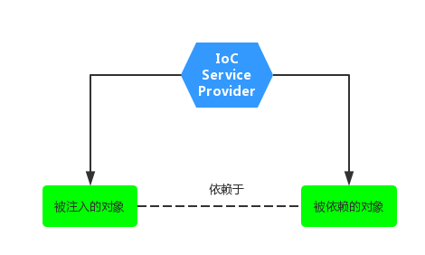

## 1. IoC 理论

IoC 全称为 `Inversion of Control`，翻译为 “控制反转”，它还有一个别名为 DI（`Dependency Injection`）,即依赖注入。

如何理解“控制反转”好呢？理解好它的关键在于我们需要回答如下四个问题：

1. 谁控制谁
2. 控制什么
3. 为何是反转
4. 哪些方面反转了

在回答这四个问题之前，我们先看 IoC 的定义：

> **所谓 IoC ，就是由 Spring IoC 容器来负责对象的生命周期和对象之间的关系**

上面这句话是整个 IoC 理论的核心。如何来理解这句话？我们引用一个例子来走阐述（看完该例子上面四个问题也就不是问题了）。

找女朋友，一般情况下我们是如何来找女朋友的呢？首先我们需要根据自己的需求（漂亮、身材好、性格好）找一个妹子，然后到处打听她的兴趣爱好、微信、电话号码，然后各种投其所好送其所要，最后追到手。如下：

```java
/**
 * 年轻小伙子
 */
public class YoungMan {

    private BeautifulGirl beautifulGirl;

    YoungMan(){

        // 可能你比较牛逼，指腹为婚

        // beautifulGirl = new BeautifulGirl();

    }

    public void setBeautifulGirl(BeautifulGirl beautifulGirl) {

        this.beautifulGirl = beautifulGirl;

    }

    public static void main(String[] args){

        YoungMan you = new YoungMan();

        BeautifulGirl beautifulGirl = new BeautifulGirl("你的各种条件");

        beautifulGirl.setxxx("各种投其所好");

        // 然后你有女票了

        you.setBeautifulGirl(beautifulGirl);

    }

}
```

这就是我们通常做事的方式，如果我们需要某个对象，一般都是采用这种直接创建的方式(`new BeautifulGirl()`)，这个过程复杂而又繁琐，而且我们必须要面对每个环节，而且使用完成之后我们还要复杂销毁它，这种情况下我们的对象与它所依赖的对象耦合在一起。

其实我们需要思考一个问题？我们每次用到自己依赖的对象真的需要自己去创建吗？我们知道，我们依赖对象其实并不是依赖该对象本身，而是依赖它所提供的服务，只要在我们需要它的时候，它能够及时提供服务即可，至于它是我们主动去创建的还是别人送给我们的，其实并不是那么重要。再说了，相比于自己千辛万苦去创建它还要管理善后而言，直接有人送过来是不是显得更加好呢？

这个给我们送东西的“人” 就是 IoC，在上面的例子中，它就相当于一个婚介公司，作为一个婚介公司它管理着很多男男女女的资料，当我们需要一个女朋友的时候，直接跟婚介公司提出我们的需求，婚介公司则会根据我们的需求提供一个妹子给我们，我们只需要负责谈恋爱，生猴子就行了。你看，这样是不是很简单明了。

诚然，作为婚介公司的 IoC 帮我们省略了找女朋友的繁杂过程，将原来的主动寻找变成了现在的被动接受，更加简洁轻便。你想啊，原来你还得鞍马前后，各种巴结，什么东西都需要自己去亲力亲为，现在好了，直接有人把现成的送过来，多么美妙的事情啊。所以，简单点说，IoC 的理念就是**让别人为你服务**，如下图（摘自Spring揭秘）：



在没有引入 IoC 的时候，被注入的对象直接依赖于被依赖的对象，有了 IoC 后，两者及其他们的关系都是通过 Ioc Service Provider 来统一管理维护的。被注入的对象需要什么，直接跟 IoC Service Provider 打声招呼，后者就会把相应的被依赖对象注入到被注入的对象中，从而达到 IoC Service Provider 为被注入对象服务的目的。**所以 IoC 就是这么简单！原来是需要什么东西自己去拿，现在是需要什么东西让别人（IoC Service Provider）送过来**

现在在看上面那四个问题，答案就显得非常明显了:

1. **谁控制谁**：在传统的开发模式下，我们都是采用直接 new 一个对象的方式来创建对象，也就是说你依赖的对象直接由你自己控制，但是有了 IoC 容器后，则直接由 IoC 容器来控制。所以“谁控制谁”，当然是 IoC 容器控制对象
2. **控制什么**：控制对象。
3. **为何是反转**：没有 IoC 的时候我们都是在自己对象中主动去创建被依赖的对象，这是正转。但是有了 IoC 后，所依赖的对象直接由 IoC 容器创建后注入到被注入的对象中，依赖的对象由原来的主动获取变成被动接受，所以是反转。
4. **哪些方面反转了**：所依赖对象的获取被反转了。

### 1.1 注入形式

所以，IoC Service Provider 为被注入对象提供被依赖对象也有如下几种方式：构造方法注入、stter方法注入、接口注入。

**① 构造器注入**

构造器注入，顾名思义就是被注入的对象通过在其构造方法中声明依赖对象的参数列表，让外部知道它需要哪些依赖对象。

```java
YoungMan(BeautifulGirl beautifulGirl) {
    this.beautifulGirl = beautifulGirl;
}
```

构造器注入方式比较直观，对象构造完毕后就可以直接使用，这就好比你出生你家里就给你指定了你媳妇。

**② setter 方法注入**

对于 JavaBean 对象而言，我们一般都是通过 getter 和 setter 方法来访问和设置对象的属性。所以，当前对象只需要为其所依赖的对象提供相对应的 setter 方法，就可以通过该方法将相应的依赖对象设置到被注入对象中。如下：

```java
public class YoungMan {

    private BeautifulGirl beautifulGirl;

    public void setBeautifulGirl(BeautifulGirl beautifulGirl) {
        this.beautifulGirl = beautifulGirl;
    }

}
```

相比于构造器注入，setter 方式注入会显得比较宽松灵活些，它可以在任何时候进行注入（当然是在使用依赖对象之前），这就好比你可以先把自己想要的妹子想好了，然后再跟婚介公司打招呼，你可以要林志玲款式的，赵丽颖款式的，甚至凤姐哪款的，随意性较强。

**③ 接口方式注入**

接口方式注入显得比较霸道，因为它需要被依赖的对象实现不必要的接口，带有侵入性。一般都不推荐这种方式。

## 2. 各个组件

先看下图（摘自:http://singleant.iteye.com/blog/1177358）


该图为 ClassPathXmlApplicationContext 的类继承体系结构，虽然只有一部分，但是它基本上包含了 IoC 体系中大部分的核心类和接口。

下面我们就针对这个图进行简单的拆分和补充说明。

### 2.1 Resource 体系

`org.springframework.core.io.Resource`，对资源的抽象。它的每一个实现类都代表了一种资源的访问策略，如 ClassPathResource、RLResource、FileSystemResource 等。


#### 2.1.2 ResourceLoader 体系

有了资源，就应该有资源加载，Spring 利用 `org.springframework.core.io.ResourceLoader` 来进行统一资源加载，类图如下：


### 2.2 BeanFactory 体系

`org.springframework.beans.factory.BeanFactory`，是一个非常纯粹的 bean 容器，它是 IoC 必备的数据结构，其中 BeanDefinition 是它的基本结构。BeanFactory 内部维护着一个BeanDefinition map ，并可根据 BeanDefinition 的描述进行 bean 的创建和管理。


BeanFactory 有三个直接子类 ListableBeanFactory、HierarchicalBeanFactory 和 AutowireCapableBeanFactory 。

DefaultListableBeanFactory 为最终默认实现，它实现了所有接口。

### 2.3 BeanDefinition 体系

`org.springframework.beans.factory.config.BeanDefinition` ，用来描述 Spring 中的 Bean 对象。


### 2.4 BeanDefinitionReader 体系

`org.springframework.beans.factory.support.BeanDefinitionReader` 的作用是读取 Spring 的配置文件的内容，并将其转换成 Ioc 容器内部的数据结构 ：BeanDefinition 。


### 2.5 ApplicationContext 体系

`org.springframework.context.ApplicationContext` ，这个就是大名鼎鼎的 Spring 容器，它叫做应用上下文，与我们应用息息相关。它继承 BeanFactory ，所以它是 BeanFactory 的扩展升级版，如果BeanFactory 是屌丝的话，那么 ApplicationContext 则是名副其实的高富帅。由于 ApplicationContext 的结构就决定了它与 BeanFactory 的不同，其主要区别有：

1. 继承 `org.springframework.context.MessageSource` 接口，提供国际化的标准访问策略。
2. 继承 `org.springframework.context.ApplicationEventPublisher` 接口，提供强大的**事件**机制。
3. 扩展 ResourceLoader ，可以用来加载多种 Resource ，可以灵活访问不同的资源。
4. 对 Web 应用的支持。

下图来源：https://blog.csdn.net/yujin753/article/details/47043143


### 2.6 小结

上面五个体系可以说是 Spring IoC 中最核心的部分，后面博文也是针对这五个部分进行源码分析。其实 IoC 咋一看还是挺简单的，无非就是将配置文件（暂且认为是 xml 文件）进行解析（分析 xml 谁不会啊），然后放到一个 Map 里面就差不多了，初看有道理，其实要面临的问题还是有很多的，下面就劳烦各位看客跟着 LZ 博客来一步一步揭开 Spring IoC 的神秘面纱。

另外，通过上面五个体系，我们可以看出，IoC 主要由 `spring-beans` 和 `spring-context` 项目，进行实现。
