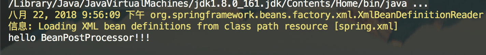
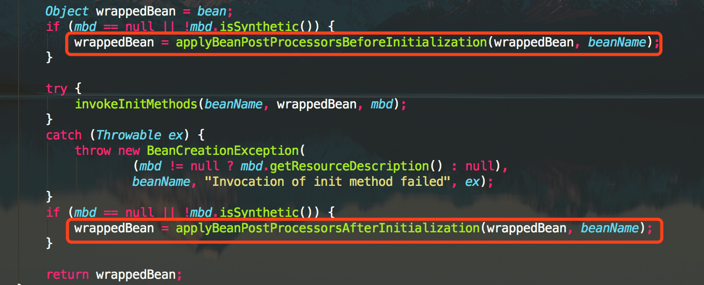
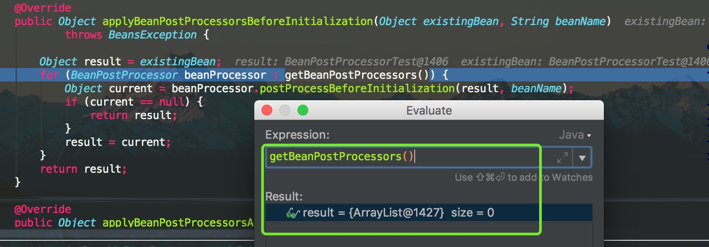
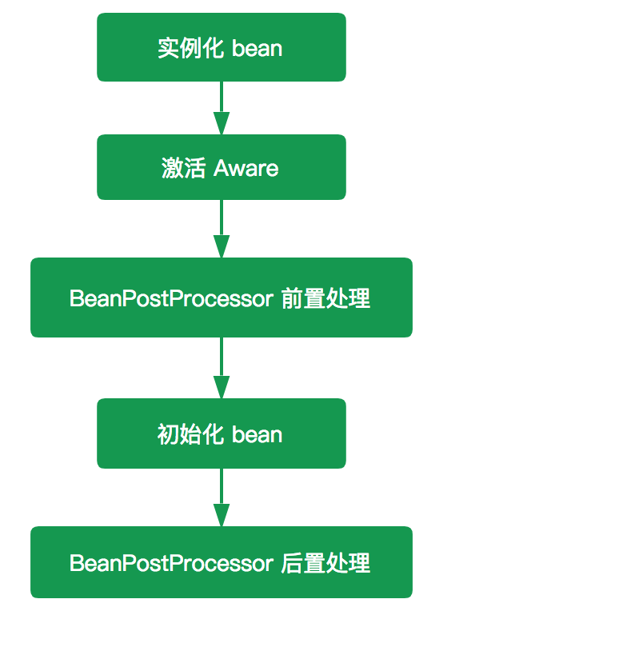

## 1. BeanPostProcessor 接口

Spring 作为优秀的开源框架，它为我们提供了丰富的可扩展点，除了前面提到的 Aware 接口，还包括其他部分，其中一个很重要的就是 BeanPostProcessor。这篇文章主要介绍 BeanPostProcessor 的使用以及其实现原理。我们先看 BeanPostProcessor 的定位：

> BeanPostProcessor 的作用：在 Bean 完成实例化后，如果我们需要对其进行一些配置、增加一些自己的处理逻辑，那么请使用 BeanPostProcessor。

## 2. BeanPostProcessor 示例

首先定义一个类，该类实现 BeanPostProcessor 接口，代码如下：

```java
public class BeanPostProcessorTest implements BeanPostProcessor{

    @Override
    public Object postProcessBeforeInitialization(Object bean, String beanName) throws BeansException {
        System.out.println("Bean [" + beanName + "] 开始初始化");
        // 这里一定要返回 bean，不能返回 null
        return bean;
    }

    @Override
    public Object postProcessAfterInitialization(Object bean, String beanName) throws BeansException {
        System.out.println("Bean [" + beanName + "] 完成初始化");
        return bean;
    }

    public void display(){
        System.out.println("hello BeanPostProcessor!!!");
    }
}
```

测试方法如下：

```java
ClassPathResource resource = new ClassPathResource("spring.xml");
DefaultListableBeanFactory factory = new DefaultListableBeanFactory();
XmlBeanDefinitionReader reader = new XmlBeanDefinitionReader(factory);
reader.loadBeanDefinitions(resource);

BeanPostProcessorTest test = (BeanPostProcessorTest) factory.getBean("beanPostProcessorTest");
test.display();
```

运行结果：



运行结果比较奇怪，为什么没有执行 `#postProcessBeforeInitialization(...)` 和 `#postProcessAfterInitialization(...)` 方法呢？

我们 debug 跟踪下代码，这两个方法在 AbstractAutowireCapableBeanFactory 的 `#initializeBean(final String beanName, final Object bean, RootBeanDefinition mbd)` 方法处调用下，如下：



debug，在 `#postProcessBeforeInitialization(...)`方法中，结果如下：



这段代码是通过迭代 `#getBeanPostProcessors()` 方法返回的结果集来调用 BeanPostProcessor 的 `#postProcessBeforeInitialization(Object bean, String beanName)` 方法，但是在这里我们看到该方法返回的结果集为空，所以肯定不会执行相应的 `#postProcessBeforeInitialization(Object bean, String beanName)` 方法咯。怎么办？答案不言而喻：只需要 `#getBeanPostProcessors()` 方法，返回的结果集中存在至少一个元素即可，该方法定义如下：

```java
// AbstractBeanFactory.java

/** BeanPostProcessors to apply in createBean. */
private final List<BeanPostProcessor> beanPostProcessors = new CopyOnWriteArrayList<>();

public List<BeanPostProcessor> getBeanPostProcessors() {
    return this.beanPostProcessors;
}
```

返回的 `beanPostProcessors` 是一个 `private` 的 List ，也就是说只要该类中存在 `beanPostProcessors.add(BeanPostProcessor beanPostProcessor)` 的调用，我们就找到了入口，在类 AbstractBeanFactory 中找到了如下代码：

```java
// AbstractBeanFactory.java

@Override
public void addBeanPostProcessor(BeanPostProcessor beanPostProcessor) {
	Assert.notNull(beanPostProcessor, "BeanPostProcessor must not be null");
	// Remove from old position, if any
	this.beanPostProcessors.remove(beanPostProcessor);
	// Track whether it is instantiation/destruction aware
	if (beanPostProcessor instanceof InstantiationAwareBeanPostProcessor) {
		this.hasInstantiationAwareBeanPostProcessors = true;
	}
	if (beanPostProcessor instanceof DestructionAwareBeanPostProcessor) {
		this.hasDestructionAwareBeanPostProcessors = true;
	}
	// Add to end of list
	this.beanPostProcessors.add(beanPostProcessor);
}
```

该方法是由 AbstractBeanFactory 的父类 `org.springframework.beans.factory.config.ConfigurableBeanFactory` 接口定义，它的核心意思就是将指定 BeanPostProcessor 注册到该 BeanFactory 创建的 bean 中，同时它是**按照插入的顺序进行注册的**，完全忽略 Ordered 接口所表达任何排序语义（在 BeanPostProcessor 中我们提供一个 Ordered 顺序，这个后面讲解）。

到这里应该就比较熟悉了，其实只需要显示调用 `#addBeanPostProcessor(BeanPostProcessor beanPostProcessor)` 方法就可以了。加入如下代码：

```java
BeanPostProcessorTest beanPostProcessorTest = new BeanPostProcessorTest();
factory.addBeanPostProcessor(beanPostProcessorTest);
```

运行结果：


其实还有一种更加简单的方法，这个我们后面再说，先看 BeanPostProcessor 的原理。

## 3. BeanPostProcessor 基本原理

`org.springframework.beans.factory.config.BeanPostProcessor` 接口，代码如下：

```java
public interface BeanPostProcessor {

	@Nullable
	default Object postProcessBeforeInitialization(Object bean, String beanName) throws BeansException {
		return bean;
	}

	@Nullable
	default Object postProcessAfterInitialization(Object bean, String beanName) throws BeansException {
		return bean;
	}

}
```

BeanPostProcessor 可以理解为是 Spring 的一个工厂钩子（其实 Spring 提供一系列的钩子，如 Aware 、InitializingBean、DisposableBean），它是 Spring 提供的对象实例化阶段强有力的扩展点，允许 Spring 在实例化 bean 阶段对其进行定制化修改，比较常见的使用场景是处理标记接口实现类或者为当前对象提供代理实现（例如 AOP）。

一般普通的 BeanFactory 是不支持自动注册 BeanPostProcessor 的，需要我们手动调用 `#addBeanPostProcessor(BeanPostProcessor beanPostProcessor)` 方法进行注册。注册后的 BeanPostProcessor 适用于所有该 BeanFactory 创建的 bean，但是 **ApplicationContext 可以在其 bean 定义中自动检测所有的 BeanPostProcessor 并自动完成注册，同时将他们应用到随后创建的任何 Bean 中**。

`#postProcessBeforeInitialization(Object bean, String beanName)` 和 `#postProcessAfterInitialization(Object bean, String beanName)` 两个方法，都接收一个 Object 类型的 `bean` ，一个 String 类型的 `beanName` ，其中 `bean` 是已经实例化了的 `instanceBean` ，能拿到这个你是不是可以对它为所欲为了？ 这两个方法是初始化 `bean` 的前后置处理器，他们应用 `#invokeInitMethods(String beanName, final Object bean, RootBeanDefinition mbd)` 方法的前后。如下图：



代码层次上面已经贴出来，这里再贴一次：


两者源码如下：

```java
// AbstractAutowireCapableBeanFactory.java

@Override
public Object applyBeanPostProcessorsBeforeInitialization(Object existingBean, String beanName)
		throws BeansException {
	Object result = existingBean;
	// 遍历 BeanPostProcessor 数组
	for (BeanPostProcessor processor : getBeanPostProcessors()) {
	    // 处理
		Object current = processor.postProcessBeforeInitialization(result, beanName);
        // 返回空，则返回 result
		if (current == null) {
			return result;
		}
		// 修改 result
		result = current;
	}
	return result;
}

@Override
public Object applyBeanPostProcessorsAfterInitialization(Object existingBean, String beanName)
		throws BeansException {
	Object result = existingBean;
	// 遍历 BeanPostProcessor
	for (BeanPostProcessor processor : getBeanPostProcessors()) {
	    // 处理
		Object current = processor.postProcessAfterInitialization(result, beanName);
		// 返回空，则返回 result
		if (current == null) {
			return result;
		}
		// 修改 result
		result = current;
	}
	return result;
}
```

### 3.1 自动检测并注册

`#getBeanPostProcessors()` 方法，返回的是 `beanPostProcessors` 集合，该集合里面存放就是我们自定义的 BeanPostProcessor ，如果该集合中存在元素则调用相应的方法，否则就直接返回 bean 了。这也是为什么使用 BeanFactory 容器是无法输出自定义 BeanPostProcessor 里面的内容，因为在 `BeanFactory#getBean(...)` 方法的过程中根本就没有将我们自定义的 BeanPostProcessor 注入进来，所以要想 BeanFactory 容器 的 BeanPostProcessor 生效我们必须手动调用 `#addBeanPostProcessor(BeanPostProcessor beanPostProcessor)` 方法，将定义的 BeanPostProcessor 注册到相应的 BeanFactory 中。**但是 ApplicationContext 不需要手动，因为 ApplicationContext 会自动检测并完成注册**。

ApplicationContext 实现自动注册的原因，在于我们构造一个 ApplicationContext 实例对象的时候会调用 `#registerBeanPostProcessors(ConfigurableListableBeanFactory beanFactory)` 方法，将检测到的 BeanPostProcessor 注入到 ApplicationContext 容器中，同时应用到该容器创建的 bean 中。代码如下：

```java
// AbstractApplicationContext.java

/**
 * 实例化并调用已经注入的 BeanPostProcessor
 * 必须在应用中 bean 实例化之前调用
 */
protected void registerBeanPostProcessors(ConfigurableListableBeanFactory beanFactory) {
    PostProcessorRegistrationDelegate.registerBeanPostProcessors(beanFactory, this);
}

// PostProcessorRegistrationDelegate.java

public static void registerBeanPostProcessors(
		ConfigurableListableBeanFactory beanFactory, AbstractApplicationContext applicationContext) {

    // 获取所有的 BeanPostProcessor 的 beanName
    // 这些 beanName 都已经全部加载到容器中去，但是没有实例化
	String[] postProcessorNames = beanFactory.getBeanNamesForType(BeanPostProcessor.class, true, false);

	// Register BeanPostProcessorChecker that logs an info message when
	// a bean is created during BeanPostProcessor instantiation, i.e. when
	// a bean is not eligible for getting processed by all BeanPostProcessors.
    // 记录所有的beanProcessor数量
	int beanProcessorTargetCount = beanFactory.getBeanPostProcessorCount() + 1 + postProcessorNames.length;
	// 注册 BeanPostProcessorChecker，它主要是用于在 BeanPostProcessor 实例化期间记录日志
    // 当 Spring 中高配置的后置处理器还没有注册就已经开始了 bean 的实例化过程，这个时候便会打印 BeanPostProcessorChecker 中的内容
	beanFactory.addBeanPostProcessor(new BeanPostProcessorChecker(beanFactory, beanProcessorTargetCount));

	// Separate between BeanPostProcessors that implement PriorityOrdered,
	// Ordered, and the rest.
    // PriorityOrdered 保证顺序
	List<BeanPostProcessor> priorityOrderedPostProcessors = new ArrayList<>();
    // MergedBeanDefinitionPostProcessor
	List<BeanPostProcessor> internalPostProcessors = new ArrayList<>();
    // 使用 Ordered 保证顺序
	List<String> orderedPostProcessorNames = new ArrayList<>();
    // 没有顺序
	List<String> nonOrderedPostProcessorNames = new ArrayList<>();
	for (String ppName : postProcessorNames) {
        // PriorityOrdered
        if (beanFactory.isTypeMatch(ppName, PriorityOrdered.class)) {
            // 调用 getBean 获取 bean 实例对象
			BeanPostProcessor pp = beanFactory.getBean(ppName, BeanPostProcessor.class);
			priorityOrderedPostProcessors.add(pp);
			if (pp instanceof MergedBeanDefinitionPostProcessor) {
				internalPostProcessors.add(pp);
			}
		} else if (beanFactory.isTypeMatch(ppName, Ordered.class)) {
            // 有序 Ordered
			orderedPostProcessorNames.add(ppName);
		} else {
            // 无序
			nonOrderedPostProcessorNames.add(ppName);
		}
	}

	// First, register the BeanPostProcessors that implement PriorityOrdered.
    // 第一步，注册所有实现了 PriorityOrdered 的 BeanPostProcessor
    // 先排序
	sortPostProcessors(priorityOrderedPostProcessors, beanFactory);
    // 后注册
	registerBeanPostProcessors(beanFactory, priorityOrderedPostProcessors);

	// Next, register the BeanPostProcessors that implement Ordered.
    // 第二步，注册所有实现了 Ordered 的 BeanPostProcessor
	List<BeanPostProcessor> orderedPostProcessors = new ArrayList<>();
	for (String ppName : orderedPostProcessorNames) {
		BeanPostProcessor pp = beanFactory.getBean(ppName, BeanPostProcessor.class);
		orderedPostProcessors.add(pp);
		if (pp instanceof MergedBeanDefinitionPostProcessor) {
			internalPostProcessors.add(pp);
		}
	}
    // 先排序
	sortPostProcessors(orderedPostProcessors, beanFactory);
    // 后注册
	registerBeanPostProcessors(beanFactory, orderedPostProcessors);

	// Now, register all regular BeanPostProcessors.
    // 第三步注册所有无序的 BeanPostProcessor
	List<BeanPostProcessor> nonOrderedPostProcessors = new ArrayList<>();
	for (String ppName : nonOrderedPostProcessorNames) {
		BeanPostProcessor pp = beanFactory.getBean(ppName, BeanPostProcessor.class);
		nonOrderedPostProcessors.add(pp);
		if (pp instanceof MergedBeanDefinitionPostProcessor) {
			internalPostProcessors.add(pp);
		}
	}
	// 注册，无需排序
	registerBeanPostProcessors(beanFactory, nonOrderedPostProcessors);

	// Finally, re-register all internal BeanPostProcessors.
    // 最后，注册所有的 MergedBeanDefinitionPostProcessor 类型的 BeanPostProcessor
	sortPostProcessors(internalPostProcessors, beanFactory);
	registerBeanPostProcessors(beanFactory, internalPostProcessors);

	// Re-register post-processor for detecting inner beans as ApplicationListeners,
	// moving it to the end of the processor chain (for picking up proxies etc).
    // 加入ApplicationListenerDetector（探测器）
    // 重新注册 BeanPostProcessor 以检测内部 bean，因为 ApplicationListeners 将其移动到处理器链的末尾
	beanFactory.addBeanPostProcessor(new ApplicationListenerDetector(applicationContext));
}
```

方法首先 `beanFactory` 获取注册到该 BeanFactory 中所有 BeanPostProcessor 类型的 `beanName` 数组，其实就是找所有实现了 BeanPostProcessor 接口的 bean ，然后迭代这些 bean ，将其按照 PriorityOrdered、Ordered、无序的顺序，添加至相应的 List 集合中，最后依次调用 `#sortPostProcessors(List<?> postProcessors, ConfigurableListableBeanFactory beanFactory)` 方法来进行排序处理、 `#registerBeanPostProcessors(ConfigurableListableBeanFactory beanFactory, List<BeanPostProcessor> postProcessors)` 方法来完成注册。

【**排序**】很简单，如果 `beanFactory` 为 DefaultListableBeanFactory ，则返回 BeanFactory 所依赖的比较器，否则反正默认的比较器(OrderComparator)，然后调用 `List#sort(Comparator<? super E> c)` 方法即可。代码如下：

```java
// PostProcessorRegistrationDelegate.java
private static void sortPostProcessors(List<?> postProcessors, ConfigurableListableBeanFactory beanFactory) {
	// 获得 Comparator 对象
    Comparator<Object> comparatorToUse = null;
	if (beanFactory instanceof DefaultListableBeanFactory) { // 依赖的 Comparator 对象
		comparatorToUse = ((DefaultListableBeanFactory) beanFactory).getDependencyComparator();
	}
	if (comparatorToUse == null) { // 默认 Comparator 对象
		comparatorToUse = OrderComparator.INSTANCE;
	}
	// 排序
	postProcessors.sort(comparatorToUse);
}
```

而对于【**注册**】，同样是调用 `AbstractBeanFactory#addBeanPostProcessor(BeanPostProcessor beanPostProcessor)` 方法完成注册。代码如下：

```java
// PostProcessorRegistrationDelegate.java

private static void registerBeanPostProcessors(ConfigurableListableBeanFactory beanFactory, List<BeanPostProcessor> postProcessors) {
    // 遍历 BeanPostProcessor 数组，注册
	for (BeanPostProcessor postProcessor : postProcessors) {
		beanFactory.addBeanPostProcessor(postProcessor);
	}
}
```

## 4. 小结

至此，BeanPostProcessor 已经分析完毕了，这里简单总结下：

BeanPostProcessor 的作用域是容器级别的，它只和所在的容器相关 ，当 BeanPostProcessor 完成注册后，它会应用于所有跟它在同一个容器内的 bean 。

BeanFactory 和 ApplicationContext 对 BeanPostProcessor 的处理不同，ApplicationContext 会自动检测所有实现了 BeanPostProcessor 接口的 bean，并完成注册，但是使用 BeanFactory 容器时则需要手动调用 `AbstractBeanFactory#addBeanPostProcessor(BeanPostProcessor beanPostProcessor)` 方法来完成注册

ApplicationContext 的 BeanPostProcessor 支持 Ordered，而 BeanFactory 的 BeanPostProcessor 是不支持的，原因在于ApplicationContext 会对 BeanPostProcessor 进行 Ordered 检测并完成排序，而 BeanFactory 中的 BeanPostProcessor 只跟注册的顺序有关。
