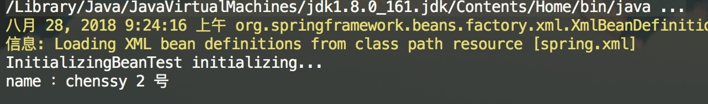
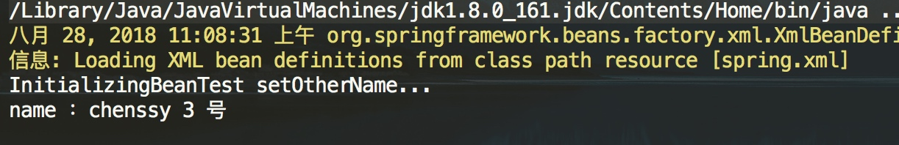
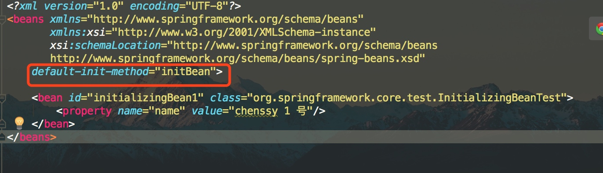

Spring 在 bean 初始化时进行三个检测扩展，也就是说我们可以对 bean 进行三个不同的定制化处理，前面两篇博客 [《【死磕 Spring】—— IoC 之深入分析 Aware 接口》](http://svip.iocoder.cn/Spring/IoC-Aware-interface) 和 [《【死磕 Spring】—— IoC 之深入分析 BeanPostProcessor》](http://svip.iocoder.cn/Spring/IoC-BeanPostProcessor) 已经分析了 Aware 接口族和 BeanPostProcessor 接口，这篇分析 InitializingBean 接口和 `init-method` 方法。

## 1. InitializingBean

Spring 的 `org.springframework.beans.factory.InitializingBean` 接口，为 bean 提供了定义初始化方法的方式，它仅包含了一个方法：`#afterPropertiesSet()` 。代码如下：

```java
public interface InitializingBean {

    /**
     * 该方法在 BeanFactory 设置完了所有属性之后被调用
     * 该方法允许 bean 实例设置了所有 bean 属性时执行初始化工作，如果该过程出现了错误则需要抛出异常
     *
     * Invoked by the containing {@code BeanFactory} after it has set all bean properties
     * and satisfied {@link BeanFactoryAware}, {@code ApplicationContextAware} etc.
     * <p>This method allows the bean instance to perform validation of its overall
     * configuration and final initialization when all bean properties have been set.
     * @throws Exception in the event of misconfiguration (such as failure to set an
     * essential property) or if initialization fails for any other reason
     */
    void afterPropertiesSet() throws Exception;

}
```

Spring 在完成实例化后，设置完所有属性，进行 “Aware 接口” 和 “BeanPostProcessor 前置处理”之后，会接着检测当前 bean 对象是否实现了 InitializingBean 接口。如果是，则会调用其 `#afterPropertiesSet()` 方法，进一步调整 bean 实例对象的状态。

### 1.1 示例

```java
public class InitializingBeanTest implements InitializingBean {

    private String name;

    @Override
    public void afterPropertiesSet() throws Exception {
        System.out.println("InitializingBeanTest initializing...");
        this.name = "chenssy 2 号";
    }

    public String getName() {
        return name;
    }

    public void setName(String name) {
        this.name = name;
    }
}
```

配置项如下：

```java
<bean id="initializingBeanTest" class="org.springframework.core.test.InitializingBeanTest">
    <property name="name" value="chenssy 1 号"/>
</bean>
```

测试代码如下：

```java
InitializingBeanTest test = (InitializingBeanTest) factory.getBean("initializingBeanTest");
System.out.println("name ：" + test.getName());
```

执行结果如下：



在这个示例中，改变了 InitializingBeanTest 示例的 `name` 属性，也就是说 在 `#afterPropertiesSet()` 方法中，我们是可以改变 bean 的属性的，这相当于 Spring 容器又给我们提供了一种可以改变 bean 实例对象的方法。

### 1.2 invokeInitMethods

上面提到 bean 初始化阶段（ `#initializeBean(final String beanName, final Object bean, RootBeanDefinition mbd)` 方法）， Spring 容器会主动检查当前 bean 是否已经实现了 InitializingBean 接口，如果实现了，则会掉用其 `#afterPropertiesSet()` 方法。这个主动检查、调用的动作是由 `#invokeInitMethods(String beanName, final Object bean, @Nullable RootBeanDefinition mbd)` 方法来完成的。代码如下：

```java
// AbstractAutowireCapableBeanFactory.java

protected void invokeInitMethods(String beanName, final Object bean, @Nullable RootBeanDefinition mbd)
        throws Throwable {
    // 首先会检查是否是 InitializingBean ，如果是的话需要调用 afterPropertiesSet()
    boolean isInitializingBean = (bean instanceof InitializingBean);
    if (isInitializingBean && (mbd == null || !mbd.isExternallyManagedInitMethod("afterPropertiesSet"))) {
        if (logger.isTraceEnabled()) {
            logger.trace("Invoking afterPropertiesSet() on bean with name '" + beanName + "'");
        }
        if (System.getSecurityManager() != null) { // 安全模式
            try {
                AccessController.doPrivileged((PrivilegedExceptionAction<Object>) () -> {
                    // 属性初始化的处理
                    ((InitializingBean) bean).afterPropertiesSet();
                    return null;
                }, getAccessControlContext());
            } catch (PrivilegedActionException pae) {
                throw pae.getException();
            }
        } else {
            // 属性初始化的处理
            ((InitializingBean) bean).afterPropertiesSet();
        }
    }

    if (mbd != null && bean.getClass() != NullBean.class) {
        // 判断是否指定了 init-method()，
        // 如果指定了 init-method()，则再调用制定的init-method
        String initMethodName = mbd.getInitMethodName();
        if (StringUtils.hasLength(initMethodName) &&
                !(isInitializingBean && "afterPropertiesSet".equals(initMethodName)) &&
                !mbd.isExternallyManagedInitMethod(initMethodName)) {
            // 激活用户自定义的初始化方法
            // 利用反射机制执行
            invokeCustomInitMethod(beanName, bean, mbd);
        }
    }
}
```

首先，检测当前 bean 是否实现了 InitializingBean 接口，如果实现了则调用其 `#afterPropertiesSet()` 方法。

然后，再检查是否也指定了 `init-method`，如果指定了则通过反射机制调用指定的 `init-method` 方法。

虽然该接口为 Spring 容器的扩展性立下了汗马功劳，但是如果真的让我们的业务对象来实现这个接口就显得不是那么的友好了，Spring 的一个核心理念就是无侵入性，但是如果我们业务类实现这个接口就显得 Spring 容器具有侵入性了。所以 Spring 还提供了另外一种实现的方式：`init-method` 方法

## 2. init-method

在分析分析 `<bean>` 标签解析过程中，我们提到了有关于 `init-method` 属性 ([《【死磕 Spring】—— IoC 之解析 标签：BeanDefinition》](http://svip.iocoder.cn/Spring/IoC-parse-BeanDefinitions-for-BeanDefinition))，该属性用于在 bean 初始化时指定执行方法，可以用来替代实现 InitializingBean 接口。

### 2.1 示例

```java
public class InitializingBeanTest {

    private String name;

    public String getName() {
        return name;
    }

    public void setName(String name) {
        this.name = name;
    }

    public void setOtherName(){
        System.out.println("InitializingBeanTest setOtherName...");
        this.name = "chenssy 3 号";
    }
}
```

配置文件如下：

```java
<bean id="initializingBeanTest" class="org.springframework.core.test.InitializingBeanTest"
        init-method="setOtherName">
    <property name="name" value="chenssy 1 号"/>
</bean>
```

执行结果:



完全可以达到和 InitializingBean 一样的效果，而且在代码中我们没有看到丝毫 Spring 侵入的现象。所以通过 `init-method` 我们可以使用业务对象中定义的任何方法来实现 bean 实例对象的初始化定制化，而不再受制于 InitializingBean的 `#afterPropertiesSet()` 方法。同时我们可以使用 `<beans>` 标签的 `default-init-method` 属性来统一指定初始化方法，这样就省了需要在每个 `<bean>` 标签中都设置 `init-method` 这样的繁琐工作了。比如在 `default-init-method` 规定所有初始化操作全部以 `initBean()` 命名。如下：



## 3. 小结

从 `#invokeInitMethods(...)` 方法中，我们知道 `init-method` 指定的方法会在 `#afterPropertiesSet()` 方法之后执行，如果 `#afterPropertiesSet()` 方法的执行的过程中出现了异常，则 `init-method` 是不会执行的，而且由于 `init-method` 采用的是反射执行的方式，所以 `#afterPropertiesSet()` 方法的执行效率一般会高些，但是并不能排除我们要优先使用 `init-method`，主要是因为它消除了 bean 对 Spring 的依赖，Spring 没有侵入到我们业务代码，这样会更加符合 Spring 的理念。诚然，`init-method` 是基于 xml 配置文件的，就目前而言，我们的工程几乎都摒弃了配置，而采用注释的方式，那么 `@PreDestory` 可能适合你，当然这个注解我们后面分析。

至此，InitializingBean 和 init-method 已经分析完毕了，对于DisposableBean 和 `destroy-method` ，他们和 init 相似，这里就不做阐述了。
