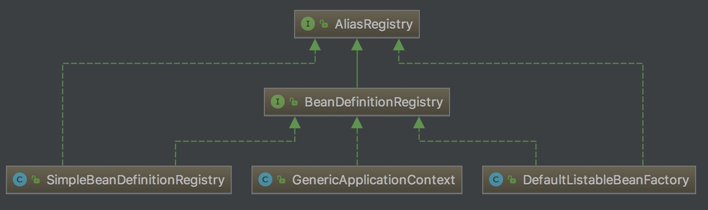

将定义 Bean 的资源文件解析成 BeanDefinition 后需要将其注入容器中，这个过程由 BeanDefinitionRegistry 来完成。

**BeanDefinitionRegistry：向注册表中注册 BeanDefinition 实例，完成注册的过程。**

下图是 BeanDefinitionRegistry 类结构图：



BeanDefinitionRegistry 继承了 AliasRegistry 接口，其核心子类有三个：SimpleBeanDefinitionRegistry、DefaultListableBeanFactory、GenericApplicationContext 。

## 1. AliasRegistry

**用于别名管理的通用型接口，作为 BeanDefinitionRegistry 的顶层接口。** AliasRegistry 定义了一些别名管理的方法。

```java
// AliasRegistry.java

public interface AliasRegistry {

    void registerAlias(String name, String alias);
    void removeAlias(String alias);

    boolean isAlias(String name);
    String[] getAliases(String name);

}
```

## 2. BeanDefinitionRegistry

**BeanDefinition 的注册接口，如 RootBeanDefinition 和 ChildBeanDefinition。它通常由 BeanFactories 实现，在 Spring 中已知的实现者为：DefaultListableBeanFactory 和 GenericApplicationContext。BeanDefinitionRegistry 是 Spring 的 Bean 工厂包中唯一封装 BeanDefinition 注册的接口。**

BeanDefinitionRegistry 接口定义了关于 BeanDefinition 注册、注销、查询等一系列的操作。

```java
// BeanDefinitionRegistry.java

    public interface BeanDefinitionRegistry extends AliasRegistry {

    // 往注册表中注册一个新的 BeanDefinition 实例
    void registerBeanDefinition(String beanName, BeanDefinition beanDefinition) throws BeanDefinitionStoreException;

    // 移除注册表中已注册的 BeanDefinition 实例
    void removeBeanDefinition(String beanName) throws NoSuchBeanDefinitionException;

    // 从注册中取得指定的 BeanDefinition 实例
    BeanDefinition getBeanDefinition(String beanName) throws NoSuchBeanDefinitionException;

    // 判断 BeanDefinition 实例是否在注册表中（是否注册）
    boolean containsBeanDefinition(String beanName);

    // 取得注册表中所有 BeanDefinition 实例的 beanName（标识）
    String[] getBeanDefinitionNames();

    // 返回注册表中 BeanDefinition 实例的数量
    int getBeanDefinitionCount();

    // beanName（标识）是否被占用
    boolean isBeanNameInUse(String beanName);

}
```

## 3. SimpleBeanDefinitionRegistry

**SimpleBeanDefinitionRegistry 是 BeanDefinitionRegistry 一个简单的实现，它还继承 SimpleAliasRegistry（ AliasRegistry 的简单实现），它仅仅只提供注册表功能，无工厂功能**。

SimpleBeanDefinitionRegistry 使用 ConcurrentHashMap 来存储注册的 BeanDefinition。

```java
// SimpleBeanDefinitionRegistry.java

private final Map<String, BeanDefinition> beanDefinitionMap = new ConcurrentHashMap<>(64);
```

他对注册其中的 BeanDefinition 都是基于 `beanDefinitionMap` 这个集合来实现的，如下：

```java
// SimpleBeanDefinitionRegistry.java

@Override
public void registerBeanDefinition(String beanName, BeanDefinition beanDefinition)
   throws BeanDefinitionStoreException {
	Assert.hasText(beanName, "'beanName' must not be empty");
	Assert.notNull(beanDefinition, "BeanDefinition must not be null");
	this.beanDefinitionMap.put(beanName, beanDefinition);
}

@Override
public void removeBeanDefinition(String beanName) throws NoSuchBeanDefinitionException {
	if (this.beanDefinitionMap.remove(beanName) == null) {
		throw new NoSuchBeanDefinitionException(beanName);
	}
}

@Override
public BeanDefinition getBeanDefinition(String beanName) throws NoSuchBeanDefinitionException {
	BeanDefinition bd = this.beanDefinitionMap.get(beanName);
	if (bd == null) {
		throw new NoSuchBeanDefinitionException(beanName);
	}
	return bd;
}
```

## 4. DefaultListableBeanFactory

**DefaultListableBeanFactory，ConfigurableListableBeanFactory（其实就是 BeanFactory ） 和 BeanDefinitionRegistry 接口的默认实现：一个基于 BeanDefinition 元数据的完整 bean 工厂**。所以相对于 SimpleBeanDefinitionRegistry 而言，DefaultListableBeanFactory 则是一个具有注册功能的完整 Bean 工厂。它同样是用 ConcurrentHashMap 数据结构来存储注册的 BeanDefinition 。

```java
// DefaultListableBeanFactory.java

// 注册表，由 BeanDefinition 的标识 （beanName） 与其实例组成
private final Map<String, BeanDefinition> beanDefinitionMap = new ConcurrentHashMap<String, bean>(64);

// 标识（beanName）集合
private final List<String> beanDefinitionNames = new ArrayList<String>(64);
```

### 4.1 registerBeanDefinition

再看看 `#registerBeanDefinition(String beanName, BeanDefinition beanDefinition)` 方法，代码如下：

```java
// DefaultListableBeanFactory.java

public void registerBeanDefinition(String beanName, BeanDefinition beanDefinition)
   throws BeanDefinitionStoreException {

    // ... 省略其他代码

    // 如果未存在
    } else {
        // 检测创建 Bean 阶段是否已经开启，如果开启了则需要对 beanDefinitionMap 进行并发控制
        if (hasBeanCreationStarted()) {
            // beanDefinitionMap 为全局变量，避免并发情况
            // Cannot modify startup-time collection elements anymore (for stable iteration)
            synchronized (this.beanDefinitionMap) {
                // <x> 添加到 BeanDefinition 到 beanDefinitionMap 中。
                this.beanDefinitionMap.put(beanName, beanDefinition);
                // 添加 beanName 到 beanDefinitionNames 中
                List<String> updatedDefinitions = new ArrayList<>(this.beanDefinitionNames.size() + 1);
                updatedDefinitions.addAll(this.beanDefinitionNames);
                updatedDefinitions.add(beanName);
                this.beanDefinitionNames = updatedDefinitions;
                // 从 manualSingletonNames 移除 beanName
                if (this.manualSingletonNames.contains(beanName)) {
                    Set<String> updatedSingletons = new LinkedHashSet<>(this.manualSingletonNames);
                    updatedSingletons.remove(beanName);
                    this.manualSingletonNames = updatedSingletons;
                }
            }
        } else {
            // Still in startup registration phase
            // <x> 添加到 BeanDefinition 到 beanDefinitionMap 中。
            this.beanDefinitionMap.put(beanName, beanDefinition);
            // 添加 beanName 到 beanDefinitionNames 中
            this.beanDefinitionNames.add(beanName);
            // 从 manualSingletonNames 移除 beanName
            this.manualSingletonNames.remove(beanName);
        }

        this.frozenBeanDefinitionNames = null;
    }

    // 重新设置 beanName 对应的缓存
    if (existingDefinition != null || containsSingleton(beanName)) {
        resetBeanDefinition(beanName);
    }

}
```

其实上面一堆代码最重要就只有一句，就是 `<x>` 处：

```java
// DefaultListableBeanFactory.java

this.beanDefinitionMap.put(beanName, beanDefinition);
```

### 4.2 removeBeanDefinition

再看看 `#removeBeanDefinition(String beanName)` 方法，其实也是调用 `beanDefinitionMap.remove(beanName)` 的逻辑。

## 5. GenericApplicationContext

对于类 GenericApplicationContext ，查看源码你会发现他实现注册、注销功能都是委托 DefaultListableBeanFactory 实现的。简化代码如下：

```java
// GenericApplicationContext.java

private final DefaultListableBeanFactory beanFactory;

@Override
public void registerBeanDefinition(String beanName, BeanDefinition beanDefinition)
		throws BeanDefinitionStoreException {

	this.beanFactory.registerBeanDefinition(beanName, beanDefinition);
}

@Override
public void removeBeanDefinition(String beanName) throws NoSuchBeanDefinitionException {
	this.beanFactory.removeBeanDefinition(beanName);
}

// ... 省略其它 N 多方法
```

## 6. 小结

所以 BeanDefinition 注册并不是非常高大上的功能，内部就是用一个 Map 实现 ，并不是多么高大上的骚操作，所以有时候我们会潜意识地认为某些技术很高大上就觉得他很深奥，如果试着去一探究竟你会发现，原来这么简单。虽然 BeanDefinitionRegistry 实现简单，但是它作为 Spring IOC 容器的核心接口，其地位还是很重的.
