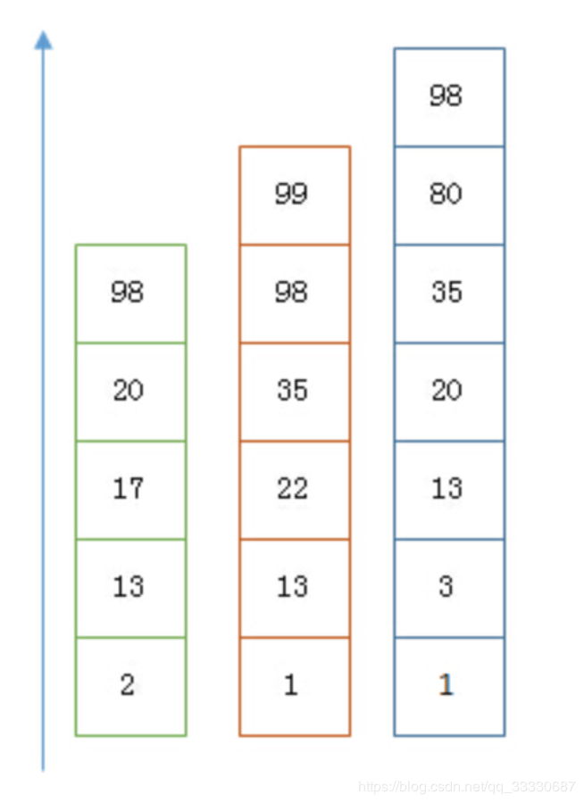
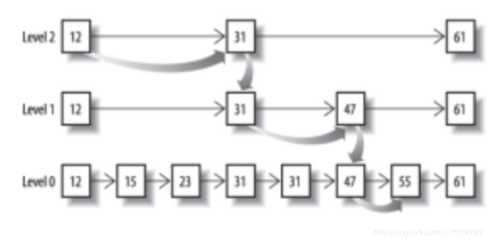
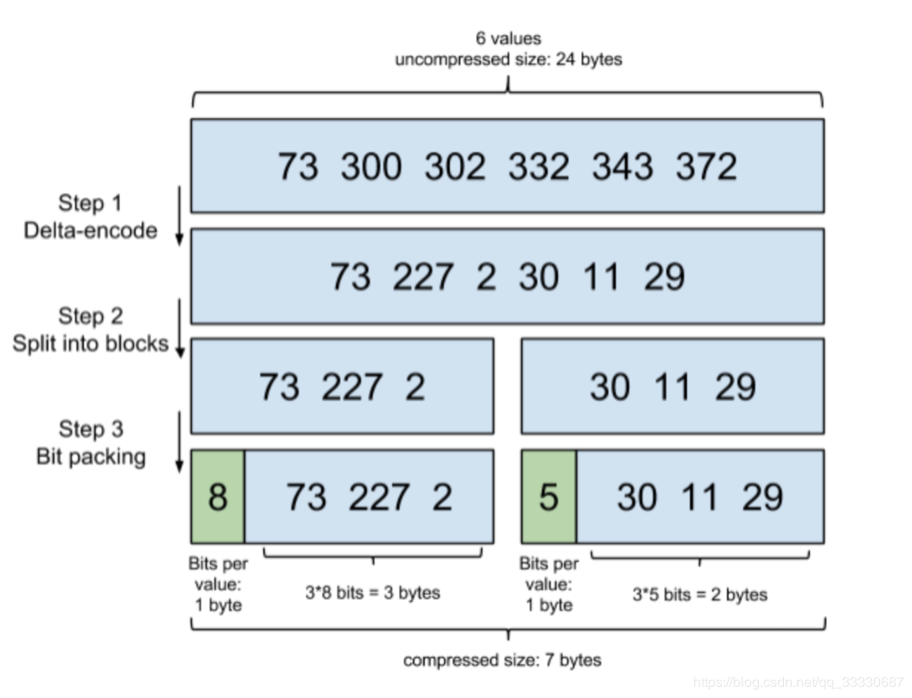
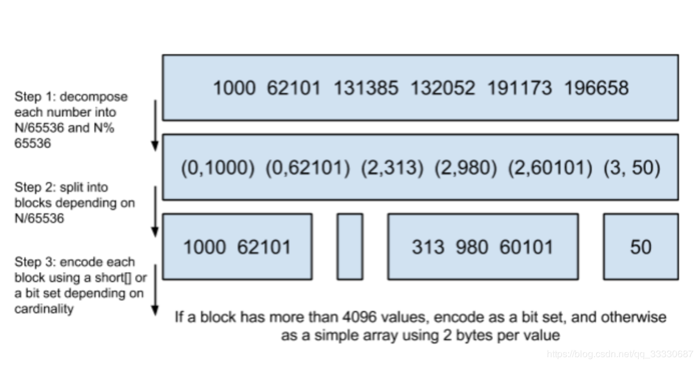
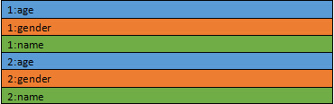
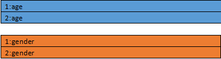
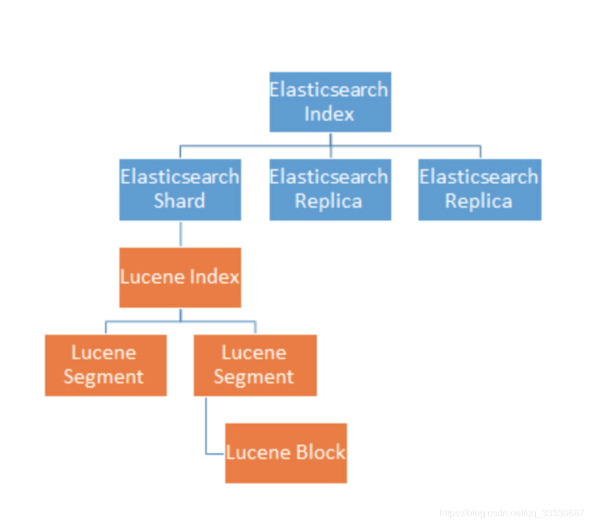

### 数据类型
全文搜索引擎很好的支持非结构化数据的搜索，可以更好地快速搜索大量存在的任何单词非结构化文本。例如Google，百度类的网站搜索，它们都是根据网页中的关键字生成索引，我们在搜索的时候输入关键字，它们会将该关键字即索引匹配到的所有网页返回；还有常见的项目中应用日志的搜索等等。对于这些非结构化的数据文本，关系型数据库搜索不是很好的支持。
### 搜索性能
如果使用MySQL做索引，比如有个player表，这个表有user_name这个字段，我们要查找出user_name以james开头的球员，和含有james的球员。我们一般怎么做？数据量达到千万级别的时候怎么办？
```sql
select * from player where user_name linke 'james%';
```
```sql
select * from player where user_name link '%james%;'
```
可以用二分查找的方式，比全遍历更快地找出目标的 term。这个就是 term dictionary。有了 term dictionary 之后，可以用 logN 次磁盘查找得到目标。但是磁盘的随机读操作仍然是非常昂贵的（一次 random access 大概需要 10ms 的时间）。所以尽量少的读磁盘，有必要把一些数据缓存到内存里。但是整个 term dictionary 本身又太大了，无法完整地放到内存里。于是就有了 term index。

如果所有的 term 都是英文字符的话，可能这个 term index 就真的是 26 个英文字符表构成的了。但是实际的情况是，term 未必都是英文字符，term 可以是任意的 byte 数组。而且 26 个英文字符也未必是每一个字符都有均等的 term，比如 x 字符开头的 term 可能一个都没有，而 s 开头的 term 又特别多。实际的 term index 是一棵 trie 树。

这棵树不会包含所有的 term，它包含的是 term 的一些前缀。通过 term index 可以快速地定位到 term dictionary 的某个 offset，然后从这个位置再往后顺序查找。再加上一些压缩技术（搜索 Lucene Finite State Transducers） term index 的尺寸可以只有所有 term 的尺寸的几十分之一，使得用内存缓存整个 term index 变成可能。

现在我们可以回答“为什么 Elasticsearch/Lucene 检索可以比 mysql 快了。Mysql 只有 term dictionary 这一层，是以 b-tree 排序的方式存储在磁盘上的。检索一个 term 需要若干次的 random access 的磁盘操作。而 Lucene 在 term dictionary 的基础上添加了 term index 来加速检索，term index 以树的形式缓存在内存中。从 term index 查到对应的 term dictionary 的 block 位置之后，再去磁盘上找 term，大大减少了磁盘的 random access 次数。

额外值得一提的两点是：term index 在内存中是以 FST（finite state transducers）的形式保存的，其特点是非常节省内存。Term dictionary 在磁盘上是以分 block 的方式保存的，一个 block 内部利用公共前缀压缩，比如都是 Ab 开头的单词就可以把 Ab 省去。这样 term dictionary 可以比 b-tree 更节约磁盘空间。
### 灵活的搜索
如果我们想要查出名字叫james的球员，但是用户输入了jame，我们想提示他一些关键字

如果我们想查出带有“冠军”关键字的文章，但用户输入了“总冠军”，我们也希望能查出来。

有搜索结果排名

可以根据拼音搜索

可以自动高亮
#### 多条件过滤
mysql除非使用联合索引，将每个查询的字段都建立联合索引，如果是两个字段上有两个不同的索引，那么mysql将会选择一个索引使用，然后将得到的结果写入内存中使用第二个条件过滤后，得到最终的答案。

es，可以进行真正的联合查询，将两个字段上查询出来的结果进行“并”操作或者“与”操作，如果是filter可以使用bitset，如果是非filter使用skip list进行。

### ES的并行能力
### 索引的维护
一般传统数据库，全文搜索都实现的很鸡肋，因为一般也没人用数据库存长文本字段，因为进行全文搜索的时候需要扫描整个表，如果数据量大的话即使对SQL的语法进行优化，也是效果甚微。即使建立了索引，但是维护起来也很麻烦，对于insert和update操作都会重新构建索引。
### 适合全文搜索引擎的场景

* 搜索的数据对象是大量的非结构化的文本数据
* 文本数据达到数十万或数百万级别，甚至更多
* 支持大量基于交互式文本的查询
* 需要非常灵活的全文搜索查询
* 对安全事务，非文本数据操作的需求相对较少

### ES如何做联合查询
查询过滤条件 age=18 的过程就是先从 term index 找到 18 在 term dictionary 的大概位置，然后再从 term dictionary 里精确地找到 18 这个 term，然后得到一个 posting list 或者一个指向 posting list 位置的指针。然后再查询 gender= 女 的过程也是类似的。最后得出 age=18 AND gender= 女 就是把两个 posting list 做一个“与”的合并。

这个理论上的“与”合并的操作可不容易。对于 mysql 来说，如果你给 age 和 gender 两个字段都建立了索引，查询的时候只会选择其中最 selective 的来用，然后另外一个条件是在遍历行的过程中在内存中计算之后过滤掉。那么要如何才能联合使用两个索引呢？有两种办法：

* 使用 skip list 数据结构。同时遍历 gender 和 age 的 posting list，互相 skip；
* 使用 bitset 数据结构，对 gender 和 age 两个 filter 分别求出 bitset，对两个 bitset 做 AN 操作。

如果查询的filter缓存到了内存中，使用bitset形式，否则用skip list形式遍历在磁盘上的posting list
#### Skip List


以上是三个 posting list。我们现在需要把它们用 AND 的关系合并，得出 posting list 的交集。首先选择最短的posting list，然后从小到大遍历。遍历的过程可以跳过一些元素，比如我们遍历到绿色的13的时候，就可以跳过蓝色的3了，因为3比13要小。

最后得出的交集是 [13,98]，所需的时间比完整遍历三个 posting list 要快得多。但是前提是每个 list 需要指出 Advance 这个操作，快速移动指向的位置。什么样的 list 可以这样 Advance 往前做蛙跳？



但是这里我们又要考虑一个问题，如果这个posting太长怎么办？ 

从概念上来说，对于一个很长的posting list，比如：[1,3,13,101,105,108,255,256,257]；我们可以把这个list分成三个block：[1,3,13] [101,105,108] [255,256,257]；然后可以构建出skip list的第二层：[1,101,255]；1,101,255分别指向自己对应的block。这样就可以很快地跨block的移动指向位置了。Lucene自然会对这个block再次进行压缩。

其压缩方式叫做Frame Of Reference编码。



比如一个词对应的文档id列表为[73, 300, 302, 332,343, 372] ，id列表首先要从小到大排好序；第一步增量编码就是从第二个数开始每个数存储与前一个id的差值，即300-73=227，302-300=2。。。，一直到最后一个数；第二步就是将这些差值放到不同的区块，Lucene使用256个区块；第三步位压缩，计算每组3个数中最大的那个数需要占用bit位数，比如30、11、29中最大数30最小需要5个bit位存储，这样11、29也用5个bit位存储，这样才占用15个bit，不到2个字节，压缩效果很好

考虑到频繁出现的term（所谓low cardinality的值），比如gender里的男或者女。如果有1百万个文档，那么性别为男的posting list里就会有50万个int值。用Frame of Reference编码进行压缩可以极大减少磁盘占用。这个优化对于减少索引尺寸有非常重要的意义。当然mysql b-tree里也有一个类似的posting list的东西，是未经过这样压缩的。

因为这个Frame of Reference的编码是有解压缩成本的。利用skip list，除了跳过了遍历的成本，也跳过解压全部这些压缩过的block的过程，从而节省了cpu（相当于只要解压skip list查询到的那些block）
#### BitSet合并
Frame Of Reference压缩算法对于倒排表来说效果很好，但对于需要存储在内存中的Filter缓存等不太合适，两者之间有很多不同之处：倒排表存储在磁盘，针对每个词都需要进行编码，而Filter等内存缓存只会存储那些经常使用的数据，而且针对Filter数据的缓存就是为了加速处理效率，对压缩算法要求更高。

缓存之前执行结果的目的就是为了加速响应，本质上是对一系列doc id进行合理的压缩存储然后解码并进行与、或、亦或等逻辑运算

* 方案一：首先一个简单的方案是使用数组存储，这样每个doc id占用4个字节，如果有100M个文档，大约需要400M的内存，比较占用资源，不是一个很好的方式。
* 方案二：BitMap位图方式，用一个bit位（0或者1）来代表一个doc id的存在与否（JDK也有内置的位图类即BitSet）；与数组方式类似，只不过这里只用1个bit代表一个文档，节约了存储（100M bits = 12.5MB），这是一种很好的方式。BitSet进行and，or操作，十分方便容易，位运算即可

但是BitSet有一个缺陷：对于一个比较稀疏的文档列表就浪费了很多的存储空间，极端情况段内doc id范围0~2^31-1，一个位图就占用（2^31-1）/8/1024/1024=256M的空间，有压缩改进的空间

从Lucene 5 开始采用了一种改进的位图方式，即Roaring BitMaps，它是一个压缩性能比bitmap更好的位图实现



1. 针对每个文档id，得到其对应的元组，即括号中第一个数为除以65535的值，第二个数时对65535取余的值

2. 按照除以65535的结果将元组划分到特定的区块中，示例中有0、2、3三个区块

3. 对于每个区块，如果元素个数大于4096个，采用BitSet编码，否则对于区块中每个元素使用2个字节编码（取余之后最大值65535使用2个字节即可表示，选择数组存储）

为什么使用4096作为一个阈值，经验证超过4096个数后，使用BitMap方式要比使用数组方式要更高效。
### ES如何做聚合排序查询
首先我们拿mysql做例子，如果没有建立索引，我们需要全遍历一份，到内存进行排序，如果有索引，会在索引树上进行进行范围查询（因为索引是排序了的）

那么在es中，如果是做排序，lucene会查询出所有的文档集合的排序字段，然后再次构建出一个排序好的文档集合。es是面向海量数据的，这样一来内存爆掉的可能性是十分大的

我们可以从上面看出，es的倒排索引其实是不利于做排序的。因为存储的是字段→文档id的关系。无法得到需要排序字段的全部值。

为此。es采用Doc Value解决排序，聚合等操作的处理
#### Doc Value
DocValues 是一种按列组织的存储格式，这种存储方式降低了随机读的成本。传统的按行存储是这样的：



1 和 2 代表的是 docid。颜色代表的是不同的字段。



按列存储的话会把一个文件分成多个文件，每个列一个。对于每个文件，都是按照 docid 排序的。这样一来，只要知道 docid，就可以计算出这个 docid 在这个文件里的偏移量。也就是对于每个 docid 需要一次随机读操作。

那么这种排列是如何让随机读更快的呢？秘密在于 Lucene 底层读取文件的方式是基于 memory mapped byte buffer 的，也就是 mmap。这种文件访问的方式是由操作系统去缓存这个文件到内存里。这样在内存足够的情况下，访问文件就相当于访问内存。那么随机读操作也就不再是磁盘操作了，而是对内存的随机读。

那么为什么按行存储不能用 mmap 的方式呢？因为按行存储的方式一个文件里包含了很多列的数据，这个文件尺寸往往很大，超过了操作系统的文件缓存的大小。而按列存储的方式把不同列分成了很多文件，可以只缓存用到的那些列，而不让很少使用的列数据浪费内存。

按列存储之后，一个列的数据和前面的 posting list 就差不多了。很多应用在 posting list 上的压缩技术也可以应用到 DocValues 上。这不但减少了文件尺寸，而且提高数据加载的速度。因为我们知道从磁盘到内存的带宽是很小的，普通磁盘也就每秒 100MB 的读速度。利用压缩，我们可以把数据以压缩的方式读取出来，然后在内存里再进行解压，从而获得比读取原始数据更高的效率。

DocValue将随机读取变成了顺序读取，随机读的时候也是按照 DocId 排序的。所以如果读取的 DocId 是紧密相连的，实际上也相当于把随机读变成了顺序读了。Random_read(100), Random_read(101), Random_read(102) 就相当于 Scan(100~102) 了。



在es中，因为分片的存在，数据被拆分成多份，放在不同机器上。但是给用户体验却只有一个库一样

对于聚合查询，其处理是分两阶段完成的：

* Shard 本地的 Lucene Index 并行计算出局部的聚合结果；
* 收到所有的 Shard 的局部聚合结果，聚合出最终的聚合结果。

这种两阶段聚合的架构使得每个 shard 不用把原数据返回，而只用返回数据量小得多的聚合结果。这样极大的减少了网络带宽的消耗
