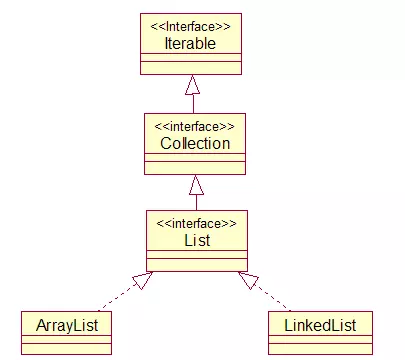
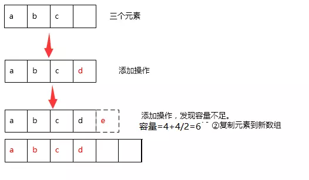
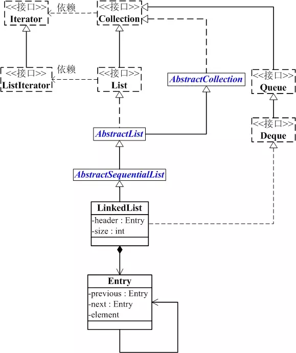
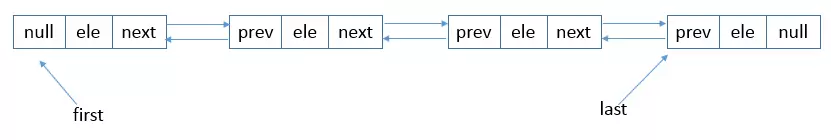

从图中可以看出,ArrayList与LinkedList都是List接口的实现类,因此都实现了List的所有未实现的方法,只是实现的方式有所不同,(从中可以看出面向接口的好处, 对于不同的需求就有不同的实现!),而List接口继承了Collection接口,Collection接口又继承了Iterable接口,因此可以看出List同时拥有了Collection与Iterable接口的特性.
### ArrayList
ArrayList是List接口的可变数组的实现。实现了所有可选列表操作，并允许包括 null 在内的所有元素。除了实现 List 接口外，此类还提供一些方法来操作内部用来存储列表的数组的大小。

每个ArrayList实例都有一个容量，该容量是指用来存储列表元素的数组的大小。它总是至少等于列表的大小。随着向ArrayList中不断添加元素，其容量也自动增长。自动增长会带来数据向新数组的重新拷贝，因此，如果可预知数据量的多少，可在构造ArrayList时指定其容量。在添加大量元素前，应用程序也可以使用ensureCapacity操作来增加ArrayList实例的容量，这可以减少递增式再分配的数量。

注意，此实现不是同步的。如果多个线程同时访问一个ArrayList实例，而其中至少一个线程从结构上修改了列表，那么它必须保持外部同步。这通常是通过同步那些用来封装列表的对象来实现的。但如果没有这样的对象存在，则该列表需要运用{@link Collections#synchronizedList Collections.synchronizedList}来进行“包装”，该方法最好是在创建列表对象时完成，为了避免对列表进行突发的非同步操作。

```java
List list = Collections.synchronizedList(new ArrayList(...));
```

建议在单线程中才使用ArrayList，而在多线程中可以选择Vector或者CopyOnWriteArrayList。
#### 扩容
数组有个明显的特点就是它的容量是固定不变的，一旦数组被创建则容量则无法改变。所以在往数组中添加指定元素前，首先要考虑的就是其容量是否饱和。

若接下来的添加操作会时数组中的元素超过其容量，则必须对其进行扩容操作。受限于数组容量固定不变的特性，扩容的本质其实就是创建一个容量更大的新数组，再将旧数组的元素复制到新数组当中去。

这里以 ArrayList 的 添加操作为例，来看下 ArrayList 内部数组扩容的过程。
```java
public boolean add(E e) {
	// 关键 -> 添加之前，校验容量
	ensureCapacityInternal(size + 1); 
	
	// 修改 size，并在数组末尾添加指定元素
	elementData[size++] = e;
	return true;
}
```
可以发现 ArrayList 在进行添加操作前，会检验内部数组容量并选择性地进行数组扩容。在 ArrayList 中，通过私有方法 ensureCapacityInternal 来进行数组的扩容操作。下面来看具体的实现过程：

扩容操作的第一步会去判断当前 ArrayList 内部数组是否为空，为空则将最小容量 minCapacity 设置为 10。
```java
// 内部数组的默认容量
private static final int DEFAULT_CAPACITY = 10;

// 空的内部数组
private static final Object[] EMPTY_ELEMENTDATA = {};

// 关键 -> minCapacity = seize+1，即表示执行完添加操作后，数组中的元素个数 
private void ensureCapacityInternal(int minCapacity) {
	// 判断内部数组是否为空
	if (elementData == EMPTY_ELEMENTDATA) {
		// 设置数组最小容量（>=10）
		minCapacity = Math.max(DEFAULT_CAPACITY, minCapacity);
	}
	ensureExplicitCapacity(minCapacity);
}
```
接着判断添加操作会不会导致内部数组的容量饱和。
```java
private void ensureExplicitCapacity(int minCapacity) {
	modCount++;
	
	// 判断结果为 true，则表示接下来的添加操作会导致元素数量超出数组容量
	if (minCapacity - elementData.length > 0){
		// 真正的扩容操作
		grow(minCapacity);
	}
}
```
数组容量不足，则进行扩容操作，关键的地方有两个：扩容公式、通过从旧数组复制元素到新数组完成扩容操作。
```java
private static final int MAX_ARRAY_SIZE = Integer.MAX_VALUE - 8;

private void grow(int minCapacity) {
	
	int oldCapacity = elementData.length;
	
	// 关键-> 容量扩充公式
	int newCapacity = oldCapacity + (oldCapacity >> 1);
	
	// 针对新容量的一系列判断
	if (newCapacity - minCapacity < 0){
		newCapacity = minCapacity;
	}
	if (newCapacity - MAX_ARRAY_SIZE > 0){
		newCapacity = hugeCapacity(minCapacity);
	}
		
	// 关键 -> 复制旧数组元素到新数组中去
	elementData = Arrays.copyOf(elementData, newCapacity);
}

private static int hugeCapacity(int minCapacity) {
	if (minCapacity < 0){
		throw new OutOfMemoryError();
	}
			
	return (minCapacity > MAX_ARRAY_SIZE) ? Integer.MAX_VALUE : MAX_ARRAY_SIZE;
}
```
关于 ArrayList 扩容操作，整个过程如下图：



### LinkedList


* LinkedList 是一个继承于AbstractSequentialList的双向链表。它也可以被当作堆栈、队列或双端队列进行操作。
* LinkedList 实现 List 接口，能对它进行队列操作。
* LinkedList 实现 Deque 接口，即能将LinkedList当作双端队列使用。
* LinkedList 实现了Cloneable接口，即覆盖了函数clone()，能克隆。
* LinkedList 实现java.io.Serializable接口，这意味着LinkedList支持序列化，能通过序列化去传输。
* LinkedList 是非同步的。



如上图所示，LinkedList底层使用的双向链表结构，有一个头结点和一个尾结点，双向链表意味着我们可以从头开始正向遍历，或者是从尾开始逆向遍历，并且可以针对头部和尾部进行相应的操作。
### 总结

* ArrayList是实现了基于动态数组的数据结构，LinkedList基于链表的数据结构。
* 对于随机访问get和set，ArrayList觉得优于LinkedList，因为LinkedList要移动指针。
* 对于新增和删除操作add和remove，LinedList比较占优势，因为ArrayList要移动数据。

### 参考文献
https://juejin.im/post/5adec492f265da0b9f3fea08
