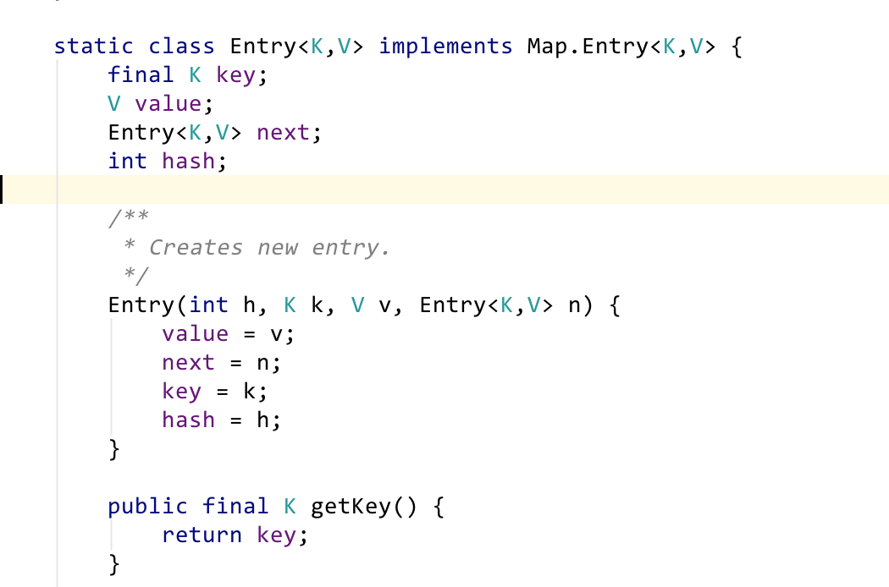
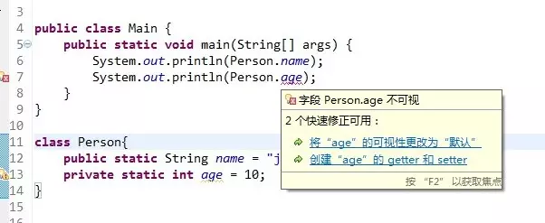

### 一、static代表着什么
在Java中并不存在全局变量的概念，但是我们可以通过static来实现一个“伪全局”的概念，在Java中static表示“全局”或者“静态”的意思，用来修饰成员变量和成员方法，当然也可以修饰代码块。

Java把内存分为栈内存和堆内存，其中栈内存用来存放一些基本类型的变量、数组和对象的引用，堆内存主要存放一些对象。在JVM加载一个类的时候，若该类存在static修饰的成员变量和成员方法，则会为这些成员变量和成员方法在固定的位置开辟一个固定大小的内存区域（只要这个类被加载，Java虚拟机就能根据类名在运行时数据区的方法区内定找到他们），有了这些“固定”的特性，那么JVM就可以非常方便地访问他们。同时如果静态的成员变量和成员方法不出作用域的话，它们的句柄都会保持不变。同时static所蕴含“静态”的概念表示着它是不可恢复的，即在那个地方，你修改了，他是不会变回原样的，你清理了，他就不会回来了。

同时被static修饰的成员变量和成员方法是独立于该类的，它不依赖于某个特定的实例变量，也就是说它被该类的所有实例共享。所有实例的引用都指向同一个地方，任何一个实例对其的修改都会导致其他实例的变化。
### 二、怎么使用static
static可以用于修饰成员变量和成员方法，我们将其称之为静态变量和静态方法，直接通过类名来进行访问。

ClassName.propertyName

ClassName.methodName(……)

static修饰的代码块表示静态代码块，当JVM装载类的时候，就会执行这块代码，其用处非常大。
#### 1、static变量
static修饰的变量我们称之为静态变量，没有用static修饰的变量称之为实例变量，他们两者的区别是：

静态变量是随着类加载时被完成初始化的，它在内存中仅有一个，且JVM也只会为它分配一次内存，同时类所有的实例都共享静态变量，可以直接通过类名来访问它。但是实例变量则不同，它是伴随着实例的，每创建一个实例就会产生一个实例变量，它与该实例同生共死。

把一个变量声明为静态变量通常基于以下三个目的：

* 作为共享变量使用
* 减少对象的创建
* 保留唯一副本

```java
public class TestStatic {
    
    public static int count = 0;
    
    public static void main(String[] args){
        TestStatic test1=new TestStatic();
        System.out.println(test1.count);
        TestStatic test2=new TestStatic();
        test2.count++;
        System.out.println(test1.count+" "+test2.count+" "+TestStatic.count);
    }
}
=======================
0
1 1 1
```
可见，static变量并不是所在类的某个具体对象所有，而是该类的所有对象所共有的，静态变量既能被对象调用，也能直接拿类来调用。
#### 2、static方法
static方法一般称作静态方法，由于静态方法不依赖于任何对象就可以进行访问，因此对于静态方法来说，是没有this的，因为它不依附于任何对象，既然都没有对象，就谈不上this了。并且由于这个特性，在静态方法中不能访问类的非静态成员变量和非静态成员方法，因为非静态成员方法/变量都是必须依赖具体的对象才能够被调用。

但是要注意的是，虽然在静态方法中不能访问非静态成员方法和非静态成员变量，但是在非静态成员方法中是可以访问静态成员方法/变量的。

因为static方法独立于任何实例，因此static方法必须被实现，而不能是抽象的abstract。

总结一下，对于静态方法需要注意以下几点：

（1）它们仅能调用其他的static 方法。

（2）它们只能访问static数据。

（3）它们不能以任何方式引用this 或super。
#### 3、static代码块
static关键字还有一个比较关键的作用就是 用来形成静态代码块以优化程序性能。static块可以置于类中的任何地方，类中可以有多个static块。在类初次被加载的时候，会按照static块的顺序来执行每个static块，并且只会执行一次。

为什么说static块可以用来优化程序性能，是因为它的特性:只会在类加载的时候执行一次。下面看个例子:
```java
class Person{ 
    private Date birthDate; 
      
    public Person(Date birthDate) { 
        this.birthDate = birthDate; 
    } 
      
    boolean isBornBoomer() { 
        Date startDate = Date.valueOf("1946"); 
        Date endDate = Date.valueOf("1964"); 
        return birthDate.compareTo(startDate)>=0 && birthDate.compareTo(endDate) < 0; 
    } 
} 
```
isBornBoomer是用来判断这个人是否是1946-1964年出生的，而每次isBornBoomer被调用的时候，都会生成startDate和birthDate两个对象，造成了空间浪费，如果改成这样效率会更好：
```java
class Person{ 
    private Date birthDate; 
    private static Date startDate,endDate; 
    static{ 
        startDate = Date.valueOf("1946"); 
        endDate = Date.valueOf("1964"); 
    } 
      
    public Person(Date birthDate) { 
        this.birthDate = birthDate; 
    } 
      
    boolean isBornBoomer() { 
        return birthDate.compareTo(startDate)>=0 && birthDate.compareTo(endDate) < 0; 
    } 
} 
```
因此，很多时候会将一些只需要进行一次的初始化操作都放在static代码块中进行。
#### 4. 静态内部类
内部类一般情况下使用不是特别多，如果需要在外部类里面定义一个内部类，通常是基于外部类和内部类有很强关联的前提下才去这么使用。

在说静态内部类的使用场景之前，我们先来看一下静态内部类和非静态内部类的区别：

非静态内部类对象持有外部类对象的引用（编译器会隐式地将外部类对象的引用作为内部类的构造器参数）；而静态内部类对象不会持有外部类对象的引用

由于非静态内部类的实例创建需要有外部类对象的引用，所以非静态内部类对象的创建必须依托于外部类的实例；而静态内部类的实例创建只需依托外部类；

并且由于非静态内部类对象持有了外部类对象的引用，因此非静态内部类可以访问外部类的非静态成员；而静态内部类只能访问外部类的静态成员；

两者的根本性区别其实也决定了用static去修饰内部类的真正意图：

* 内部类需要脱离外部类对象来创建实例
* 避免内部类使用过程中出现内存溢出

第一种是目前静态内部类使用比较多的场景，比如JDK集合中的Entry、builder设计模式。

HashMap Entry：



builder设计模式：
```java
public class Person {
    private String name;
    private int age;
    private Person(Builder builder) {
        this.name = builder.name;
        this.age = builder.age;
    }
    public static class Builder {
        private String name;
        private int age;
        public Builder() {
        }
        public Builder name(String name) {
            this.name = name;
            return this;
        }
        public Builder age(int age) {
            this.age=age;
            return this;
        }
        public Person build() {
            return new Person(this);
        }
    }
    public String getName() {
        return name;
    }
    public void setName(String name) {
        this.name = name;
    }
    public int getAge() {
        return age;
    }
    public void setAge(int age) {
        this.age = age;
    }
}
// 在需要创建Person对象的时候
Person person = new Person.Builder().name("张三").age(17).build();
```
第二种情况一般出现在多线程场景下，非静态内部类可能会引发内存溢出的问题，比如下面的例子：
```java
public class Task {
 
    public void onCreate() {
        // 匿名内部类, 会持有Task实例的引用
        new Thread() {
            public void run() {
                //...耗时操作
            };
        }.start();   
    }
}
```
声明并创建了一个匿名内部类对象，该对象持有外部类Task实例的引用，如果在在run方法中做的是耗时操作，将会导致外部类Task的实例迟迟不能被回收，如果Task对象创建过多，会引发内存溢出。

优化方式：
```java
public class Task {
 
    public void onCreate() {
        SubTask subTask = new SubTask();
        subTask.start();
    }
     
    static class SubTask extends Thread {
        @Override
        public void run() {
            //...耗时操作   
        }
    }
}
```
### 三、static关键字的误区
#### 1、static关键字会改变类中成员的访问权限吗？
与C/C++中的static不同，Java中的static关键字不会影响到变量或者方法的作用域。在Java中能够影响到访问权限的只有private、public、protected（包括包访问权限）这几个关键字。看下面的例子就明白了：



提示错误"Person.age 不可视"，这说明static关键字并不会改变变量和方法的访问权限。
#### 2、能通过this访问静态成员变量吗？
虽然对于静态方法来说没有this，那么在非静态方法中能够通过this访问静态成员变量吗？先看下面的一个例子，这段代码输出的结果是什么？
```java
public class Main {　　 
    static int value = 33;  
  
    public static void main(String[] args) throws Exception{ 
        new Main().printValue(); 
    } 
  
    private void printValue(){ 
        int value = 3; 
        System.out.println(this.value); 
    } 
} 
======================
33
```
这里面主要考查对this和static的理解。this代表什么？this代表当前对象，那么通过new Main()来调用printValue的话，当前对象就是通过new Main()生成的对象。而static变量是被对象所享有的，因此在printValue中的this.value的值毫无疑问是33。在printValue方法内部的value是局部变量，根本不可能与this关联，所以输出结果是33。在这里永远要记住一点：静态成员变量虽然独立于对象，但是不代表不可以通过对象去访问，所有的静态方法和静态变量都可以通过对象访问（只要访问权限足够）。
#### 3、static能作用于局部变量么？
在C/C++中static是可以作用域局部变量的，但是在Java中切记：static是不允许用来修饰局部变量。不要问为什么，这是Java语法的规定。
#### 4、static和final一块用表示什么？
static final用来修饰成员变量和成员方法，可简单理解为“全局常量”！ 

对于变量，表示一旦给值就不可修改，并且通过类名可以访问。 

对于方法，表示不可覆盖，并且可以通过类名直接访问。
### static执行顺序
对象的初始化顺序:首先执行父类静态的内容，父类静态的内容执行完毕后，接着去执行子类的静态的内容，当子类的静态内容执行完毕之后，再去看父类有没有非静态代码块，如果有就执行父类的非静态代码块，父类的非静态代码块执行完毕，接着执行父类的构造方法；父类的构造方法执行完毕之后，它接着去看子类有没有非静态代码块，如果有就执行子类的非静态代码块。子类的非静态代码块执行完毕再去执行子类的构造方法。总之一句话，静态代码块内容先执行，接着执行父类非静态代码块和构造方法，然后执行子类非静态代码块和构造方法。

子类的构造方法，不管这个构造方法带不带参数，默认的它都会先去寻找父类的不带参数的构造方法。如果父类没有不带参数的构造方法，那么子类必须用supper关键子来调用父类带参数的构造方法，否则编译不能通过。
#### 参考文献
https://juejin.im/post/5b348e59f265da595359ef55

https://www.cnblogs.com/dolphin0520/p/10651845.html
