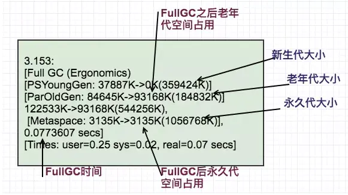
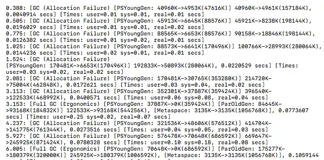

### 何时进行JVM调优

* Heap内存（老年代）持续上涨达到设置的最大内存值；
* Full GC 次数频繁；
* GC 停顿时间过长（超过1秒）；
* 应用出现OutOfMemory 等内存异常；
* 应用中有使用本地缓存且占用大量内存空间；
* 系统吞吐量与响应性能不高或下降。

### JVM调优目标
调优的最终目的都是为了令应用程序使用最小的硬件消耗来承载更大的吞吐。jvm调优主要是针对垃圾收集器的收集性能优化，令运行在虚拟机上的应用能够使用更少的内存以及延迟获取更大的吞吐量。

* 延迟：GC低停顿和GC低频率；
* 低内存占用；
* 高吞吐量;


> 吞吐量：重要指标之一，是指不考虑垃圾收集引起的停顿时间或内存消耗，垃圾收集器能支撑应用达到的最高性能指标。
> 
> 延迟：其度量标准是缩短由于垃圾啊收集引起的停顿时间或者完全消除因垃圾收集所引起的停顿，避免应用运行时发生抖动。
> 
> 内存占用：垃圾收集器流畅运行所需要 的内存数量。

其中，任何一个属性性能的提高，几乎都是以牺牲其他属性性能的损为代价的，不可兼得。具体根据在业务中的重要性确定。
### JVM调优量化目标

* Heap 内存使用率 <= 70%;
* Old generation内存使用率<= 70%;
* avgpause <= 1秒;
* Full gc 次数0 或 avg pause interval >= 24小时 ;

### JVM调优的步骤
一般情况下，JVM调优可通过以下步骤进行：

* 分析GC日志及dump文件，判断是否需要优化，确定瓶颈问题点；
* 确定JVM调优量化目标；
* 确定JVM调优参数（根据历史JVM参数来调整）；
* 依次调优内存、延迟、吞吐量等指标；
* 对比观察调优前后的差异；
* 不断的分析和调整，直到找到合适的JVM参数配置；
* 找到最合适的参数，将这些参数应用到所有服务器，并进行后续跟踪。

以上操作步骤中，某些步骤是需要多次不断迭代完成的。一般是从满足程序的内存使用需求开始的，之后是时间延迟的要求，最后才是吞吐量的要求，要基于这个步骤来不断优化，每一个步骤都是进行下一步的基础，不可逆行之。
### JVM参数
-XX 参数被称为不稳定参数，此类参数的设置很容易引起JVM 性能上的差异，使JVM存在极大的不稳定性。如果此类参数设置合理将大大提高JVM的性能及稳定性。

不稳定参数语法规则包含以下内容。

布尔类型参数值：

* -XX:+：'+'表示启用该选项
* -XX:-：'-'表示关闭该选项

数字类型参数值：

* -XX：=

字符串类型参数值：

* -XX：=

### JVM参数解析及调优
比如以下参数示例：
```shell
-Xmx4g –Xms4g –Xmn1200m –Xss512k -XX:NewRatio=4 -XX:SurvivorRatio=8 -XX:PermSize=100m -XX:MaxPermSize=256m -XX:MaxTenuringThreshold=15
```
上面为Java7及以前版本的示例，在Java8中永久代的参数-XX:PermSize和-XX：MaxPermSize已经失效。这在前面章节中已经讲到。

#### 参数解析：

* -Xmx4g：堆内存最大值为4GB。
* -Xms4g：初始化堆内存大小为4GB。
* -Xmn1200m：设置年轻代大小为1200MB。增大年轻代后，将会减小年老代大小。此值对系统性能影响较大，Sun官方推荐配置为整个堆的3/8。
* -Xss512k：设置每个线程的堆栈大小。JDK5.0以后每个线程堆栈大小为1MB，以前每个线程堆栈大小为256K。应根据应用线程所需内存大小进行调整。在相同物理内存下，减小这个值能生成更多的线程。但是操作系统对一个进程内的线程数还是有限制的，不能无限生成，经验值在3000~5000左右。
* -XX:NewRatio=4：设置年轻代（包括Eden和两个Survivor区）与年老代的比值（除去持久代）。设置为4，则年轻代与年老代所占比值为1：4，年轻代占整个堆栈的1/5
* -XX:SurvivorRatio=8：设置年轻代中Eden区与Survivor区的大小比值。设置为8，则两个Survivor区与一个Eden区的比值为2:8，一个Survivor区占整个年轻代的1/10
* -XX:PermSize=100m：初始化永久代大小为100MB。
* -XX:MaxPermSize=256m：设置持久代大小为256MB。
* -XX:MaxTenuringThreshold=15：设置垃圾最大年龄。如果设置为0的话，则年轻代对象不经过Survivor区，直接进入年老代。对于年老代比较多的应用，可以提高效率。如果将此值设置为一个较大值，则年轻代对象会在Survivor区进行多次复制，这样可以增加对象再年轻代的存活时间，增加在年轻代即被回收的概论。

新生代、老生代、永久代的参数，如果不进行指定，虚拟机会自动选择合适的值，同时也会基于系统的开销自动调整。
#### 可调优参数：

* -Xms：初始化堆内存大小，默认为物理内存的1/64(小于1GB)。
* -Xmx：堆内存最大值。默认(MaxHeapFreeRatio参数可以调整)空余堆内存大于70%时，JVM会减少堆直到-Xms的最小限制。
* -Xmn：新生代大小，包括Eden区与2个Survivor区。
* -XX:SurvivorRatio=1：Eden区与一个Survivor区比值为1:1。
* -XX:MaxDirectMemorySize=1G：直接内存。报java.lang.OutOfMemoryError: Direct buffer memory异常可以上调这个值。
* -XX:+DisableExplicitGC：禁止运行期显式地调用System.gc()来触发fulll GC。
* 注意: Java RMI的定时GC触发机制可通过配置-Dsun.rmi.dgc.server.gcInterval=86400来控制触发的时间。
* -XX:CMSInitiatingOccupancyFraction=60：老年代内存回收阈值，默认值为68。
* -XX:ConcGCThreads=4：CMS垃圾回收器并行线程线，推荐值为CPU核心数。
* -XX:ParallelGCThreads=8：新生代并行收集器的线程数。
* -XX:MaxTenuringThreshold=10：设置垃圾最大年龄。如果设置为0的话，则年轻代对象不经过Survivor区，直接进入年老代。对于年老代比较多的应用，可以提高效率。如果将此值设置为一个较大值，则年轻代对象会在Survivor区进行多次复制，这样可以增加对象再年轻代的存活时间，增加在年轻代即被回收的概论。
* -XX:CMSFullGCsBeforeCompaction=4：指定进行多少次fullGC之后，进行tenured区 内存空间压缩。
* -XX:CMSMaxAbortablePrecleanTime=500：当abortable-preclean预清理阶段执行达到这个时间时就会结束。
* 在设置的时候，如果关注性能开销的话，应尽量把永久代的初始值与最大值设置为同一值，因为永久代的大小调整需要进行FullGC才能实现。

### 内存优化示例
当JVM运行稳定之后，触发了FullGC我们一般会拿到如下信息:



以上gc日志中，在发生fullGC之时，整个应用的堆占用以及GC时间。为了更加精确需多次收集，计算平均值。或者是采用耗时最长的一次FullGC来进行估算。上图中，老年代空间占用在93168kb（约93MB），以此定为老年代空间的活跃数据。则其他堆空间的分配，基于以下规则来进行。

* java heap：参数-Xms和-Xmx，建议扩大至3-4倍FullGC后的老年代空间占用。
* 永久代：-XX:PermSize和-XX:MaxPermSize，建议扩大至1.2-1.5倍FullGc后的永久带空间占用。
* 新生代：-Xmn，建议扩大至1-1.5倍FullGC之后的老年代空间占用。
* 老年代：2-3倍FullGC后的老年代空间占用。

基于以上规则，则对参数定义如下：
```shell
java -Xms373m -Xmx373m -Xmn140m -XX:PermSize=5m -XX:MaxPermSize=5m
```
### 延迟优化示例
对延迟性优化，首先需要了解延迟性需求及可调优的指标有哪些。

* 应用程序可接受的平均停滞时间: 此时间与测量的Minor
* GC持续时间进行比较。可接受的Minor GC频率：Minor
* GC的频率与可容忍的值进行比较。
* 可接受的最大停顿时间:最大停顿时间与最差情况下FullGC的持续时间进行比较。
* 可接受的最大停顿发生的频率：基本就是FullGC的频率。

其中，平均停滞时间和最大停顿时间，对用户体验最为重要。对于上面的指标，相关数据采集包括：MinorGC的持续时间、统计MinorGC的次数、FullGC的最差持续时间、最差情况下，FullGC的频率。



如上图，Minor GC的平均持续时间0.069秒，MinorGC的频率为0.389秒一次。

新生代空间越大，Minor GC的GC时间越长，频率越低。如果想减少其持续时长，就需要减少其空间大小。如果想减小其频率，就需要加大其空间大小。

这里以减少了新生代空间10%的大小，来减小延迟时间。在此过程中，应该保持老年代和持代的大小不变化。调优后的参数如下变化:
```shell
java -Xms359m -Xmx359m -Xmn126m -XX:PermSize=5m -XX:MaxPermSize=5m
```
### 吞吐量调优
吞吐量调优主要是基于应用程序的吞吐量要求而来的，应用程序应该有一个综合的吞吐指标，这个指标基于整个应用的需求和测试而衍生出来的。

评估当前吞吐量和目标差距是否巨大，如果在20%左右，可以修改参数，加大内存，再次从头调试，如果巨大就需要从整个应用层面来考虑，设计以及目标是否一致了，重新评估吞吐目标。

对于垃圾收集器来说，提升吞吐量的性能调优的目标就是尽可能避免或者很少发生FullGC或者Stop-The-World压缩式垃圾收集（CMS），因为这两种方式都会造成应用程序吞吐降低。尽量在MinorGC 阶段回收更多的对象，避免对象提升过快到老年代。
### 调优工具
借助GCViewer日志分析工具，可以非常直观地分析出待调优点。可从以下几方面来分析：

Memory,分析Totalheap、Tenuredheap、Youngheap内存占用率及其他指标，理论上内存占用率越小越好；

Pause，分析Gc pause、Fullgc pause、Total pause三个大项中各指标，理论上GC次数越少越好，GC时长越小越好；
### 参考文献
https://juejin.im/post/5dc8d0ea518825592c566a5d
