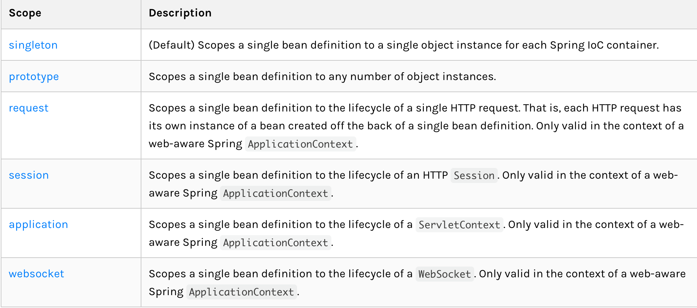
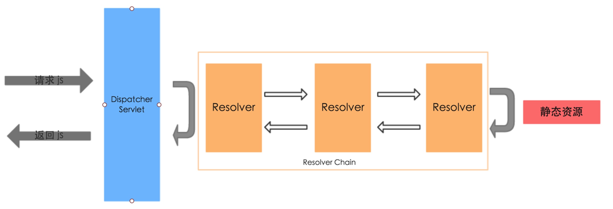
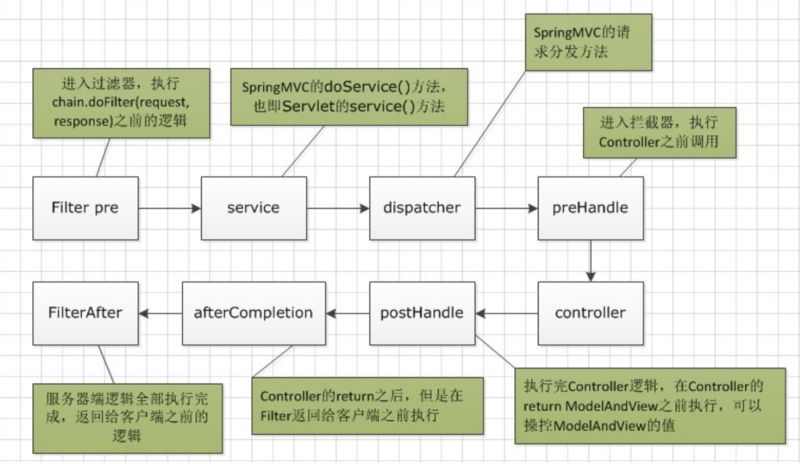

### 1、Bean相关注解
#### 用于依赖注入：
Bean注入：@Autowired、@Resource。都可用于Bean注入，区别：

* @Resource和@Autowired都可以用来装配bean，都可以用于字段或setter方法。
* @Autowired默认按类型装配，默认情况下必须要求依赖对象必须存在，如果要允许null值，可以设置它的required属性为false。
* @Resource默认按名称装配，当找不到与名称匹配的bean时才按照类型进行装配。名称可以通过name属性指定，如果没有指定name属性，当注解写在字段上时，默认取字段名，当注解写在setter方法上时，默认取属性名进行装配。

> 注意：如果name属性一旦指定，就只会按照名称进行装配。

* @Autowire和@Qualifier配合使用效果和@Resource一样：

```java
@Autowired(required = false) @Qualifier("example")
private Example example;

@Resource(name = "example")
private Example example;
```
**@Resource装配顺序**:

1. 如果同时指定name和type，则从容器中查找唯一匹配的bean装配，找不到则抛出异常

2. 如果指定name属性，则从容器中查找名称匹配的bean装配，找不到则抛出异常

3. 如果指定type属性，则从容器中查找类型唯一匹配的bean装配，找不到或者找到多个抛出异常

4. 如果都不指定，则自动按照byName方式装配，如果没有匹配，则回退一个原始类型进行匹配，如果匹配则自动装配


| 注解对比 | @Resource | @Autowire |
| --- | --- | --- |
| 注解来源 | JDK | Spring |
| 装配方式 | 优先按名称 | 优先按类型 |
| 属性 | name、type | required |

配置文件中的参数注入到java变量：@Value

'@Autowired'和'@Inject'注释的行为相同。这两个注释都使用'AutowiredAnnotationBeanPostProcessor'注入依赖项。'@Autowired'和'@Inject'可以互换使用来注入Spring bean。但是，“ @ Resource”注释使用“ CommonAnnotationBeanPostProcessor”来注入依赖项。即使它们使用不同的后处理器类，它们的行为也几乎相同。以下是其执行路径的摘要。

#### 用于Bean定义：（根据被Spring容器发现的方式可分为两类）

**自动扫描**：@Component（@Controller、@Service、@Repository，三者与@Component等效，只不过在语义上更明确）：用在类上，声明此类是个Bean，会被Spring ComponentScan扫描并由Spring容器自动创建实例并注册

**手动配置**：@Configuration+@Bean：前者用在类上、后者用在@Configuration修饰的类内的方法上，效果相当于xml中的beans与bean的关系；实例需要用户在@Bean修饰的方法中手动创建返回，Spring容器通过@Configuration扫描并注册其所修饰的类内的Bean

##### @Component
@Component是所有受Spring 管理组件的通用形式，@Component注解可以放在类的头上，@Component不推荐使用。
##### @Controller
@Controller对应表现层的Bean，也就是Action，例如：
```java
@Controller
@Scope("prototype")
public class UserAction extends BaseAction<User>{
    ……
}
```

使用@Controller注解标识UserAction之后，就表示要把UserAction交给Spring容器管理，在Spring容器中会存在一个名字为"userAction"的action，这个名字是根据UserAction类名来取的。

注意：如果@Controller不指定其value【@Controller】，则默认的bean名字为这个类的类名首字母小写，如果指定value【@Controller(value="UserAction")】或者【@Controller("UserAction")】，则使用value作为bean的名字。

这里的UserAction还使用了@Scope注解，@Scope("prototype")表示将Action的范围声明为原型，可以利用容器的scope="prototype"来保证每一个请求有一个单独的Action来处理，避免struts中Action的线程安全问题。spring 默认scope是单例模式(scope="singleton")，这样只会创建一个Action对象，每次访问都是同一Action对象，数据不安全，struts2 是要求每次次访问都对应不同的Action，scope="prototype" 可以保证当有请求的时候都创建一个Action对象。
##### @Service
@Service对应的是业务层Bean，例如：
```java
@Service("userService")
public class UserServiceImpl implements UserService {
    ………
}
```

@Service("userService")注解是告诉Spring，当Spring要创建UserServiceImpl的的实例时，bean的名字必须叫做"userService"，这样当Action需要使用UserServiceImpl的的实例时,就可以由Spring创建好的"userService"，然后注入给Action：在Action只需要声明一个名字叫“userService”的变量来接收由Spring注入的"userService"即可，具体代码如下：
```java
// 注入userService
@Resource(name = "userService")
private UserService userService;
```
注意：在Action声明的“userService”变量的类型必须是“UserServiceImpl”或者是其父类“UserService”，否则由于类型不一致而无法注入，由于Action中的声明的“userService”变量使用了@Resource注解去标注，并且指明了其name = "userService"，这就等于告诉Spring，说我Action要实例化一个“userService”，你Spring快点帮我实例化好，然后给我，当Spring看到userService变量上的@Resource的注解时，根据其指明的name属性可以知道，Action中需要用到一个UserServiceImpl的实例，此时Spring就会把自己创建好的名字叫做"userService"的UserServiceImpl的实例注入给Action中的“userService”变量，帮助Action完成userService的实例化，这样在Action中就不用通过“UserService userService = new UserServiceImpl();”这种最原始的方式去实例化userService了。如果没有Spring，那么当Action需要使用UserServiceImpl时，必须通过“UserService userService = new UserServiceImpl();”主动去创建实例对象，但使用了Spring之后，Action要使用UserServiceImpl时，就不用主动去创建UserServiceImpl的实例了，创建UserServiceImpl实例已经交给Spring来做了，Spring把创建好的UserServiceImpl实例给Action，Action拿到就可以直接用了。Action由原来的主动创建UserServiceImpl实例后就可以马上使用，变成了被动等待由Spring创建好UserServiceImpl实例之后再注入给Action，Action才能够使用。这说明Action对“UserServiceImpl”类的“控制权”已经被“反转”了，原来主动权在自己手上，自己要使用“UserServiceImpl”类的实例，自己主动去new一个出来马上就可以使用了，但现在自己不能主动去new“UserServiceImpl”类的实例，new“UserServiceImpl”类的实例的权力已经被Spring拿走了，只有Spring才能够new“UserServiceImpl”类的实例，而Action只能等Spring创建好“UserServiceImpl”类的实例后，再“恳求”Spring把创建好的“UserServiceImpl”类的实例给他，这样他才能够使用“UserServiceImpl”，这就是Spring核心思想“控制反转”，也叫“依赖注入”，“依赖注入”也很好理解，Action需要使用UserServiceImpl干活，那么就是对UserServiceImpl产生了依赖，Spring把Acion需要依赖的UserServiceImpl注入(也就是“给”)给Action，这就是所谓的“依赖注入”。对Action而言，Action依赖什么东西，就请求Spring注入给他，对Spring而言，Action需要什么，Spring就主动注入给他。
##### @Repository
@Repository对应数据访问层Bean ，例如
```java
@Repository(value="userDao")
public class UserDaoImpl extends BaseDaoImpl<User> {
    ………
}
```
@Repository(value="userDao")注解是告诉Spring，让Spring创建一个名字叫“userDao”的UserDaoImpl实例。

当Service需要使用Spring创建的名字叫“userDao”的UserDaoImpl实例时，就可以使用@Resource(name = "userDao")注解告诉Spring，Spring把创建好的userDao注入给Service即可。
```java
// 注入userDao，从数据库中根据用户Id取出指定用户时需要用到
@Resource(name = "userDao")
private BaseDao<User> userDao;
```
##### @Scope
标记在类和方法，标记上述Spring Bean的作用域：singleton、prototype、request、session、application、websocket

* singleton：单例，无论getBean多少次得到的都是同一个实例。默认值为此，如@Service、@Repository、@Component等的scope
* prototype：每次getBean都创建一个新的实例。从某方面来说，类似于new操作。
* request：每个http请求创建一个实例，该实例仅在该请求内有效且该请求过程中用同一个实例，不同request创建的实例互不干扰；实例随请求结束而销毁
* session：每当创建一个会话时创建一个实例，实例随着会话的结束而销毁
* application：在一个ServletContext lifecycle内公用一个实例。注：不是ApplicationContext lifecycle，一个ServletContext可能包含多个ApplicationContext
* websocket：在一个WebSocket lifecycle内公用一个实例



Java Singleton与Spring Singleton的区别：Java单例类是每个类加载器，Spring的单例是每个应用程序上下文。
### 2、接收请求请求
（1）使用HttpServletRequest获取，如request.getParameter("name") 
```java
@RequestMapping("/login.do")  
public String login(HttpServletRequest request){  
    String name = request.getParameter("name")  
    String pass = request.getParameter("pass")  
}  
```

（2）@RequestParam("pass")String password，或@Param("pass")String password。表单参数也可以用这种方式获取，Spring会自动将表单参数注入到方法参数，和表单的name属性保持一致。
```java
@RequestMapping("/login.do")  
public String login(HttpServletRequest request,   @RequestParam("name") String name,  @RequestParam("pass") String password) // 表单属性是pass,用变量password接收  
{  
   System.out.println(name);  
   System.out.println(password)  
}  
```

（3）自动注入Bean属性
```xml
<form action="login.do">  
用户名：<input name="name"/>  
密码：<input name="pass"/>  
<input type="submit" value="登陆">  
</form>  
```
```java
//封装的User类  
public class User{  
  private String name;  
  private String pass;  
}  

@RequestMapping("/login.do")  
public String login(User user)  
{  
   System.out.println(user.getName());  
   System.out.println(user.getPass());  
}  
```
### 3、向页面传参
#### 使用HttpServletRequest 和 Session  然后setAttribute()，就和Servlet中一样

#### 使用ModelAndView对象
```java
@RequestMapping("/login.do")  
public ModelAndView  login(String name,String pass){  
    User user = userService.login(name,pwd);  
    Map<String,Object> data = new HashMap<String,Object>();  
    data.put("user",user);  
    return new ModelAndView("success",data);  
}  
```

#### 使用ModelMap对象
```java
@RequestMapping("/login.do")  
public　String login(String name,String pass ,ModelMap model){  
    User user  = userService.login(name,pwd);  
    model.addAttribute("user",user);  
    model.put("name",name);  
    return "success";  
}  
```

#### 使用@ModelAttribute注解

在Controller方法的参数部分或Bean属性方法上使用
```java
@RequestMapping("/login.do")  
public String login(@ModelAttribute("user") User user){  
    //TODO  
   return "success";  
}  
  
@ModelAttribute("name")  
public String getName(){  
    return name;  
}  
```
#### Session存储
可以利用HttpServletReequest的getSession()方法
```java
@RequestMapping("/login.do")  
public String login(String name,String pwd, ModelMap model,HttpServletRequest request){  
     User user = serService.login(name,pwd);  
     HttpSession session = request.getSession();  
     session.setAttribute("user",user);  
     model.addAttribute("user",user);  
     return "success";  
}  
```
### 4、异常捕获处理
@ExceptionHandler：捕获特定异常进行处理，仅对当前Controller有效

@ControllerAdvice：修饰类，捕获全局各个Controller抛出的异常。ControllerAdvice注解只拦截Controller不会拦截Interceptor的异常。

示例：
```java
@Controller
@RequestMapping("/exception")
@ControllerAdvice
public class ExceptionController {
    @ExceptionHandler({ ArithmeticException.class }) // 单用@ExceptionHandler时只对当前controller有效即只捕获当前Controller抛出的异常，结合@ControllerAdvice可对全局有效。
    // @ResponseStatus(value = HttpStatus.NOT_FOUND)
    @ResponseBody
    public String handleArithmeticException(Exception e) {
        e.printStackTrace();
        return "some arighmetric error";
    }

    @RequestMapping(value = "e/{id}", method = { RequestMethod.GET })
    @ResponseBody
    public String testExceptionHandle(@PathVariable(value = "id") Integer id) {
        System.out.println(10 / id);
        return id.toString();
    }
}

@Controller
class TTT {
    @RequestMapping(value = "e/{id}", method = { RequestMethod.GET })
    @ResponseBody
    public String testExceptionHandle(@PathVariable(value = "id") Integer id) {
        System.out.println(10 / id);
        return id.toString();
    }
}
```

该示例中，若没有@ControllerAdvice注解，则分别访问 http://localhost:8081/exception/e/0 、 http://localhost:8081/e/0 前者会被@ExceptionController指定的方法捕获处理、后者则不会被捕获。若加上@ControllerAdvice注解则访问两个路径都会被处理。另外注意，类需要在能被spring扫描到的包下。
### 5、request body传数组
```java
public Integer deleteAdminAnStus(@RequestBody List<String> studentIdList, HttpServletRequest request) {
}   // 前端请求时直接在body传类似如下格式的数据即可：  ["a","b"]
```
### 6、页面重定向
假设当前在 /api/v1，则

response.sendRedirect("/test"); 将导向 /test

response.sendRedirect("test"); 将导向 /api/test
### 7、手动返回错误信息
response.sendError(400, "some error");
### 8、返回数据的统一包装
```java
@ControllerAdvice // 拦截所有Controller的处理结果
public class ControllerResponseWrapper implements ResponseBodyAdvice<Object> {
    private static final Logger logger = LoggerFactory.getLogger(ControllerResponseWrapper.class);

    private final Set<MediaType> jsonMediaType = new HashSet<>(
            Arrays.asList(MediaType.APPLICATION_JSON, MediaType.APPLICATION_JSON_UTF8));

    // 对于哪些请求要执行beforeBodyWrite，返回true执行，返回false不执行
    @Override
    public boolean supports(MethodParameter methodParameter, Class<? extends HttpMessageConverter<?>> converterType) {
        return true;
    }

    @Override
    public Object beforeBodyWrite(Object obj, MethodParameter returnType, MediaType mediaType,
            Class<? extends HttpMessageConverter<?>> converterType, ServerHttpRequest request,
            ServerHttpResponse response) {

        // 不是需要验证的路径，不处理
        // String reqURLPath = request.getURI().getPath();
        // if (!reqURLPath.startsWith(WebSecurityConfig.AUTH_PATH_PREFIX)) {    // 发送500时reqURL被重定向到/error了，所以此法不可行
        // }
        // 类型 不属于 需要处理的包头的时候，不处理
        if (!jsonMediaType.contains(mediaType)) {
        }
        // 当类型 是属于需要处理的时候 并且 obj不是ReturnMsg的时候 进行格式化处理
        else if (obj == null || !(obj instanceof ReturnMsg)) {
            if (isExceptionOccur(obj)) {    // 1.说明请求失败，返回了默认错误处理DefaultHandlerExceptionResolver的结果
                Map<String, Object> res = (Map<String, Object>) obj;
                int status = (int) res.get("status");
                String errorMsg = (String) res.get("error") + ": " + res.get("message");
                String path = (String) res.get("path");

                obj = ReturnMsg.fail(status, errorMsg, path, request.getMethodValue());

            } else {    // 2.说明请求成功
                ReturnMsg newRes = ReturnMsg.success(obj, request.getURI().getPath(), request.getMethodValue());
                if (obj instanceof String) {    // 对于String类型默认会用org.springframework.http.converter.StringHttpMessageConverter处理，所以ReturnMsg类型obj会出错
                    try {
                        obj = new ObjectMapper().writeValueAsString(newRes);
                    } catch (JsonProcessingException e) {
                        // TODO Auto-generated catch block
                        e.printStackTrace();
                    }
                } else {
                    obj = newRes;
                }
            }
        }
        // 返回结果已经是包装格式
        else {
        }

        logger.info("Req from {}: {}", request.getRemoteAddress(), obj);
        return obj;
    }

    /** 根据返回结果判断是否是发ere生异常返回的，正常结果也可能是这个格式，所以检查得严格! */
    private static boolean isExceptionOccur(Object obj) {
        /**
         * 默认的Spring异常处理DefaultHandlerExceptionResolver返回格式为：<br>
         * { <br>
         * "timestamp":"2018-06-19T06:19:57.757+0000",<br>
         * "status":400,<br>
         * "error":"Bad Request",<br>
         * "message":"Failed to convert value of type 'java.lang.String' to required type 'java.lang.Integer'",<br>
         * "path":"/api/v1/student/recent_experiment"<br>
         * }
         */

        // 不是Map则肯定不是异常
        if ((obj == null) || !(obj instanceof Map<?, ?>)) {
            return false;
        }

        // 不符合异常的格式，则不是异常。由于正常返回数据也有可能这几个字段，所以检查要严格点
        @SuppressWarnings("unchecked")
        Map<String, Object> mapObj = (Map<String, Object>) obj;
        if (mapObj.get("path") == null && mapObj.get("timestamp") == null || mapObj.get("status") == null) {
            return false;   // 发生异常时 error 和 message 有可能为null
        }
        // 发生异常时status肯定不是200
        if ((Integer) (mapObj.get("status")) == 200) {
            return false;
        }
        return true;
    }
}
```
通过实现ResponseBodyAdvice接口的beforeBodyWrite方法来完成，在方法里包装Controller返回数据srcRes得到 自定义统一数据格式ApiResMsg的数据finalRes 后返回。（注：只能捕获到Controller类里方法返回的结果）

Controller方法返回的srcRes为String类型时是种特殊情况，需特殊处理：

beforeBodyWrite方法返回的数据将会被converterType所表示的MessageConverter处理后输出给前端，在SpringMVC中定义了9个MessageConverter来处理返回数据。其中：

org.springframework.http.converter.json.MappingJackson2HttpMessageConverter：可以处理任意类型数据：若是基本数据类型则原样输出、对于Map、Java Bean则会转成JSON输出（对于Map输出所有键值对、Java Bean输出所有getXxx方法的xxx即输出的参数名为xxx而不是field名故可以输出Bean里不存在的属性名）

class org.springframework.http.converter.StringHttpMessageConverter：只能处理String类型的数据，若输入非String类型显然会报错。

对于一个Controller中的方法来说，其返回值srcRes会被哪种MessageConverter处理取决于srcRes的类型：

对于@RestController（@Controller+@ResponseBody）下的方法来说，通常（除了String类型）其返回的content-type=application/json，beforeBodyWrite返回值finalRes将被converterType=MappingJackson2HttpMessageConverter处理

然而当srcRes为String类型时是特例，其content-type=text/plain, converterType=StringHttpMessageConverter

可见，srcRes是String时converterType为StringHttpMessageConverter，若直接在beforeBodyWrite里将其包装为ApiResMsg类型的finalRes，则会报错。

解决：此时可以在beforeBodyWrite里进一步将finalRes转为String类型，然而仍存在问题，因为srcRes为null时无法知道srcRes的类型。

终极解法：如示例代码所示，根据converterType确定是否将finalRes转为String类型。
### 9、@Value注入静态域
默认@Value是注入到实例域的，要注入到静态域，可以通过如下方法：
```java
@Service
class GlobalValue {
    public static String hostname; // 也可以是Bean，见下一个示例
    @Value("${sensestudy.redis.host}")
    public void setMyHost(String h) {
        hostname = h;
    }
}

@Component
public class I18nUtil {
    private static MessageSource messageSource;

    @Autowired
    public void setMessageSource(MessageSource msgSource){
        messageSource = msgSource;
    }
    public static String getI18nMsg(String key){return messageSource.getMsg(key);}
}
```
以上面的I18nUtil为例，此定义方式的：

优点：使用者使用时无需通过@Autowired定义变量（如@Autowired I18nUtil i18nUtil），而是可以直接以静态变量或静态方法的方式使用I18nUtil，如I18nUtil.getI18nMsg。

缺点：上述”优点“在如下场景下将成为缺点：若I18nUtil没有被Spring容器扫描注册到，则启动时不会报错，只有在运行时会因找不到messageSource而报NPE错；相反，如果I18nUtil方法不是静态的，则使用者使用时须通过@Autowired I18nUtil i18nUtil 及 i18nUtil.getI18nMsg来使用，此时若I18nUtil未被扫描到则启动时就会报错。显然后者更有利于尽早避免隐藏的错误。
### 10、上传文件并附带额外参数
其实就是借助form表单来实现。

后端代码：
```java
@PostMapping(value = "/api/v1/admin/students")
@PreAuthorize(("hasRole('ROLE_ADMIN')"))
public List<String> addAdminStudents(@RequestParam UserEntity userEntity, @RequestParam("stuFile") List<MultipartFile> files, @RequestParam("isOverride") boolean isOverride, HttpServletRequest request) throws Exception {
        // List<MultipartFile> files = ((MultipartHttpServletRequest) request).getFiles("stuFile");
        String adminId = controllerUtils.getUserIdFromJwt(request);
        List<StudentBeanForAddAccount> stuBeanList = resolveStudentAccountFile(files);
        return studentService.addStudentAccounts(adminId, stuBeanList, isOverride);
    }
```

前端逻辑：构造个form表单放所需参数（包括stuFile、isOverride）提交即可；若有很多个非文件域参数，则后端可以声明个@RequestParam UserEntity userEntity来接收这些非文件域参数。

进阶：有时候额外参数可能是个JSON，怎么办？

可以将JSON转成String然后作为form表单的一个字段；

或者将JSON里的各字段拿出来分别作为form表单的一个字段传输，但若JSON有多层则此法行不通了。

另外须注意：form表单只能用POST方法
### 11、事务@Transational
Java Throwable分为Error和Exception，Exception分为Unchecked Exception（包括RuntimeException类及其子类）和Checked Exception（包括Exception类自身）。

例如下面这段代码，账户余额依旧增加成功，并没有因为后面遇到SQLException（检测异常）而进行事务回滚！！
```java
@Transactional
public void addMoney() throws Exception {
    //先增加余额
    accountMapper.addMoney();
    //然后遇到故障
    throw new SQLException("发生异常了..");
}
```
Spring的AOP即声明式事务管理@Transactional默认是遇到运行异常（RuntimeException）和程序错误（Error）才会回滚，对checked Exception即Exception可try{}捕获的不会回滚。 因此若在API中实现自定义异常则最好继承RuntimeException以在出错时能进行回滚。若想针对Checked Exception进行事务回滚，可在@Transactional 注解里使用 rollbackFor 属性明确指定异常，如： @Transactional(rollbackFor = Exception.class) 
```java
@Transactional(rollbackFor = Exception.class)
public void addMoney() throws Exception {
    //先增加余额
    accountMapper.addMoney();
    //然后遇到故障
    throw new SQLException("发生异常了..");
}
```

@Transactional 可以作用于接口、接口方法、类以及类方法上。当作用于类上时，该类的所有 public 方法将都具有该类型的事务属性，同时，我们也可以在方法级别使用该标注来覆盖类级别的定义。

虽然 @Transactional 注解可以作用于接口、接口方法、类以及类方法上，但是 Spring 建议不要在接口或者接口方法上使用该注解，因为只有在使用基于接口的代理时它才会生效。

@Transactional 注解应该只被应用到 public 方法上，这是由 Spring AOP 的本质决定的。如果你在 protected、private 或者默认可见性的方法上使用 @Transactional 注解，这将被忽略，也不会抛出任何异常。

默认情况下，只有来自外部的方法调用才会被AOP代理捕获，也就是，类内部方法调用本类内部的其他方法并不会引起事务行为，即使被调用方法使用@Transactional注解进行修饰。
### 12、代码中添加静态资源
在 Spring MVC 中，资源的查找、处理使用的是责任链设计模式（Filter Chain）：



其思路为如果当前 resolver 找不到资源，则转交给下一个 resolver 处理。 当前 resolver 找到资源则立即返回给上级 resovler（如果存在），此时上级 resolver 又可以选择对资源进一步处理或再次返回给它的上级（如果存在）。

配置方法为重写 WebMvcConfigurerAdapter 类的 addResourceHandlers：
```java
@Configuration
@EnableWebMvc
public class WebConfig extends WebMvcConfigurerAdapter {
    @Override
public void addResourceHandlers(ResourceHandlerRegistry registry) {
    registry.addResourceHandler("/webjars/**")
                .addResourceLocations("classpath:/META-INF/resources/webjars/");
}
```
这段代码实际上是添加了一个 PathResourceResolver来完成对资源的查找，该 resolver 的作用是将 url 为 /webjars/** 的请求映射到 classpath:/META-INF/resources/webjars/。

比如请求 http://localhost:8080/webjars/jquery/3.1.0/jquery.js 时， Spring MVC 会查找路径为 classpath:/META-INF/resources/webjars/jquery/3.1.0/jquery.js 的资源文件。

使用了 @EnableWebMvc 注解后 WebMvcAutoConfiguration 提供的默认配置会失效，必须提供全部配置。想要使用默认配置，无需使用 @EnaleWebMvc 注解。
### 13、过滤器（Filter）与拦截器（Interceptor）
区别：

* Filter 接口定义在 javax.servlet 包中；HandlerInterceptor接口定义在org.springframework.web.servlet 包中
* Filter在 Servlet 规范中定义，依赖于Servlet容器，被Servlet容器(如Tomcat)调用；Interceptor不依赖于Servlet容器，是Spring框架的一个组件，归Spring IoC容器管理调用。因此可以通过注入等方式来获取其他Bean的实例，使用更方便。
* Filter是基于函数回调的，而Interceptor则是基于动态代理（Java反射）的。
* Filter只能在请求的前后使用，而Interceptor可以详细到每个方法（即handler）
* Filter对几乎所有的请求起作用（init、doFilter、destroy），而Interceptor只能对handler请求起作用（preHandle、postHandle、afterCompletion）
* Interceptor可以访问handler的上下文，值栈里的对象，而Filter不能。 

注：SpringBoot（SpringMVC)里的Handler特指@Controller注解的类里每个处理HTTP请求的public method

执行顺序：过滤前-拦截前-handler执行-拦截后-过滤后



示例：
```java
//这里通过如下两个注解使过滤器生效。也可以不用注解，通过FilterRegistrationBean添加过滤器
@Component
@WebFilter(urlPatterns = "/Blogs", filterName = "blosTest")
class TestFilter implements Filter {
    @Override
    public void init(FilterConfig filterConfig) throws ServletException {
        System.err.println("filter .. init");
    }

    @Override
    public void doFilter(ServletRequest servletRequest, ServletResponse servletResponse, FilterChain filterChain) throws IOException, ServletException {
        HttpServletRequest request = (HttpServletRequest) servletRequest;
        HttpServletResponse response = (HttpServletResponse) servletResponse;

        System.out.println("filter 请求前");
        filterChain.doFilter(request, response);

        System.out.println("filter 请求后");
    }

    @Override
    public void destroy() {
        System.err.println("filter .. destroy");
    }
}
```
```java
import javax.servlet.http.HttpServletRequest;
import javax.servlet.http.HttpServletResponse;

import org.springframework.context.annotation.Configuration;
import org.springframework.web.servlet.HandlerInterceptor;
import org.springframework.web.servlet.ModelAndView;
import org.springframework.web.servlet.config.annotation.InterceptorRegistry;
import org.springframework.web.servlet.config.annotation.WebMvcConfigurer;

@Configuration
public class LoginInterceptorConfigurer implements WebMvcConfigurer {
    @Override
    public void addInterceptors(InterceptorRegistry registry) {
        // 多个拦截器组成一个拦截器链
        // addPathPatterns 用于添加拦截规则
        // excludePathPatterns 用户排除拦截
        registry.addInterceptor(new MyInterceptor1()).addPathPatterns("/**");
        registry.addInterceptor(new MyInterceptor2()).addPathPatterns("/**");
    }
}

class MyInterceptor1 implements HandlerInterceptor {

    @Override
    public boolean preHandle(HttpServletRequest request, HttpServletResponse response, Object handler) throws Exception {
        System.out.println(">>>MyInterceptor1>>>>>>>在请求处理之前进行调用（Controller方法调用之前）");

        return true;    // 只有返回true才会继续向下执行，返回false取消当前请求
    }

    @Override
    public void postHandle(HttpServletRequest request, HttpServletResponse response, Object handler, ModelAndView modelAndView) throws Exception {
        System.out.println(">>>MyInterceptor1>>>>>>>请求处理之后进行调用，但是在视图被渲染之前（Controller方法调用之后）");
    }

    @Override
    public void afterCompletion(HttpServletRequest request, HttpServletResponse response, Object handler, Exception ex)
            throws Exception {
        System.out.println(">>>MyInterceptor1>>>>>>>在整个请求结束之后被调用，也就是在DispatcherServlet 渲染了对应的视图之后执行（主要是用于进行资源清理工作）");
    }

}

class MyInterceptor2 implements HandlerInterceptor {

    @Override
    public boolean preHandle(HttpServletRequest request, HttpServletResponse response, Object handler) throws Exception {
        System.out.println(">>>MyInterceptor2>>>>>>>在请求处理之前进行调用（Controller方法调用之前）");

        return true;    // 只有返回true才会继续向下执行，返回false取消当前请求
    }

    @Override
    public void postHandle(HttpServletRequest request, HttpServletResponse response, Object handler, ModelAndView modelAndView) throws Exception {
        System.out.println(">>>MyInterceptor2>>>>>>>请求处理之后进行调用，但是在视图被渲染之前（Controller方法调用之后）");
    }

    @Override
    public void afterCompletion(HttpServletRequest request, HttpServletResponse response, Object handler, Exception ex) throws Exception {
        System.out.println(">>>MyInterceptor2>>>>>>>在整个请求结束之后被调用，也就是在DispatcherServlet 渲染了对应的视图之后执行（主要是用于进行资源清理工作）");
    }

}


//输出如下

>>>MyInterceptor1>>>>>>>在请求处理之前进行调用（Controller方法调用之前）
>>>MyInterceptor2>>>>>>>在请求处理之前进行调用（Controller方法调用之前）
2018-12-07 17:43:48.043 [http-nio-8080-exec-1] INFO  c.s.s.r.ControllerResponseWrapper - Req from /0:0:0:0:0:0:0:1:34712: {  errorCode:1000, errorMsg:ok, path:/api/v1/admin_super/courses, method:GET, timestamp:2018-12-07 17:43:48 }
>>>MyInterceptor2>>>>>>>请求处理之后进行调用，但是在视图被渲染之前（Controller方法调用之后）
>>>MyInterceptor1>>>>>>>请求处理之后进行调用，但是在视图被渲染之前（Controller方法调用之后）
>>>MyInterceptor2>>>>>>>在整个请求结束之后被调用，也就是在DispatcherServlet 渲染了对应的视图之后执行（主要是用于进行资源清理工作）
>>>MyInterceptor1>>>>>>>在整个请求结束之后被调用，也就是在DispatcherServlet 渲染了对应的视图之后执行（主要是用于进行资源清理工作）
```
#### 过滤器触发两次
将Filter定义成一个Bean并手动注册到SpringSecurity时（ .addFilterBefore(myFilter, UsernamePasswordAuthenticationFilter.class) //这里 myFilter通过 @Autowired MyFilter myFilter; 定义 ），此时如果调用一个handler一次则会触发两次该Filter。

原因：SpringBoot对于任何一个bean都会自动注册，加上我们手动注册的，这样该Filter就被注册了两次。解决：

法1：不让Filter成为一个Bean：若该Filter里面没有依赖需要自动注入的Bean，则可以不将该Filter定义为Bean，这样往SpringSecurity注册的filter 通过new Filter()产生而不是Autowired，从而不会注册两次。

法2：禁止SpringBoot自动注册该Bean，可以在该Filter里加上如下代码：
```java
@Bean
public FilterRegistrationBean registration(MyFilter filter) {   // 本filter将手动注册到SpringSecurity。但SpringBoot会自动注册任何一个bean组件，这样导致注册两次从而每次调用都会触发两次，故通过此来让SpringBoot别自动注册此filter
    FilterRegistrationBean registration = new FilterRegistrationBean(filter);
    registration.setEnabled(false);
    return registration;
}
```
法3：继承OncePerRequestFilter来实现Filter，这样虽然注册了两次，但可以保证只执行一次。implements Filter 和 extends OncePerRequestFilter两种写法的示例分别如下：
```java
@Component
@WebFilter(urlPatterns = "/Blogs", filterName = "blosTest")
class TestFilter1 extends OncePerRequestFilter {

    @Autowired
    CustomerCourseService customerCourseService;

    @Override
    protected void doFilterInternal(HttpServletRequest request, HttpServletResponse response,
            FilterChain filterChain) throws ServletException, IOException {
        // you business
        // customerCourseService.getByCustomerId("");
    }

    @Override
    public void destroy() {
        System.err.println("filter .. destroy");
    }
}

@Component
@WebFilter(urlPatterns = "/Blogs", filterName = "blosTest")
class TestFilter2 implements Filter {

    @Autowired
    CustomerCourseService customerCourseService;

    @Override
    public void init(FilterConfig filterConfig) throws ServletException {

    }

    @Override
    public void doFilter(ServletRequest request, ServletResponse response, FilterChain chain)
            throws IOException, ServletException {
        // you business
        // customerCourseService.getByCustomerId("");

    }

    @Override
    public void destroy() {

    }
}
```
### 14. 自动扫描
#### 默认扫描规则
@SpringBootApplication注解修饰main方法后会自动扫描main方法所在的包及其子包下的所有Bean并注册到Spring容器（因为该注解被@ComponentScan修饰了）。因此通常将main方法放在项目的公共父包下。注：只会自动扫描本项目自身的包，从外部引入的包默认不会被扫描，即使引入的包也是main方法的子包。
#### 指定扫描规则
当项目中引入模块A且模块A的包路径与当前项目不一样时，@SpringBootApplication并不能自动扫描到A中的Bean。此时若A与当前项目有公共父包则将当前项目被@SpringBootApplication修饰的main方法移动到公共父包下即可解决问题；然而最坏的情况是没有公共父包，此时可以通过如下注解指定扫描路径：

**@ComponentScan**：通过@ComponentScan的basePackages等指定A的包路径值（最父级的或最详细的均可），一旦详细指定了路径，则当前项目的包路径也得指定否则会找不到当前项目下的Bean。该注解自动扫描的对象包括被@Component、@Controller、@RestController、@Service、@Repository等修饰的类。但是不会扫描Spring JPA Entity、JPA Repository，可通过如下两个注解分别指定对应扫描路径。

**@EntityScan**：扫描被@Entity修饰的类。

**@EnableJpaRepositories**：扫描被@Repository修饰的类。（使用JPA时为何@ComponentScan扫描不到@Repository？）

注：SpringBoot默认扫描只会扫描本项目自身的包（包括@Component、@Entity、@Repository等修饰的），从外部引入的包即使也是main方法的子包也不会被自动扫描。
### 15. Handler扫描与识别
哪些hanlder会生效：被@Component（@Service、@Controller等）修饰且可实例化的类中定义的handler

SpringBoot/MVC项目启动时会自动扫描@Controller类中被@RequestMapping（及@GetMapping等）修饰的方法（即所谓的handler），维护url与方法的对应关系并注册到Spring容器中，以后收到前端请求时根据对应信息找到请求地址对应的处理method。

相关的代码为HandlerMapping接口及AbstractHandlerMapping、AbstractHandlerMethodMapping等实现类。

例外：抽象类和接口中的则不会被扫描，即使被@Controller、@RequestMapping等修饰，因为抽象类或接口无法创建Bean实例，也就无法由请求路径找到对应的处理方法。

handler定义（@GetMapping等）在父子类间的继承：（这里假设父类中有若干hanlder、假设子类被@Controller修饰）

若父类为抽象类或接口，子类可以正常继承父类的handler声明（不管父类有没有被@Controller修饰）；此时这些handler在子类中都生效了；

若父类非抽象类或接口，则父类不能被@Controller修饰，否则会报ambiguous mapping，即一个路径映射到多个方法。

故：若需要handler继承，则要么父类为抽象类或接口，要么父类不是Controller（不被@Controller修饰）。

另外，若父类被@Controller修饰而子类没有，则显然子类的handler也不会生效，因为子类没被@Controller修饰。说一大堆，总结就是：只要同一个handler没在多个地方生效就ok，否则会出错。

Handler的参数约束（@RequestParameter等）的继承：

handler方法中的@RequestParameter、@RequestBody等约束是否会被子类继承？当handler定义在接口中时会、定义在类中时则不会。对于后者只能在子类中重复声明参数约束，显然这不算好的做法，故最好将handler定义在接口中。
### 16. @EnableXXX的实现
SpringBoot项目中为了让组件生效，可以通过在主类上加@EnablkeXXX注解来达到目的，如@EnableFeignClient，这非常方便。如何实现自定义实现类似功能？可以自定义@EnableXXX注解并在注解上通过@Import加载配置文件即可。示例：
```java
@Target(ElementType.TYPE)
@Retention(RetentionPolicy.RUNTIME)
@Documented
@Import(AuthInterceptor.class)  //或 AuthConfigRegistor.class。在Import的参数指定的类中完成具体的启用逻辑，如加载配置文件。该类为普通类而非Bean
public @interface EnableHeaderAuth {

}

public class AuthConfigRegistor implements ImportBeanDefinitionRegistrar {
    @Override
    public void registerBeanDefinitions(AnnotationMetadata importingClassMetadata, BeanDefinitionRegistry registry) {
        registry.registerBeanDefinition("myAuthConfig", BeanDefinitionBuilder.genericBeanDefinition(AuthInterceptor.class).getRawBeanDefinition());
    }
}
```
### 参考文献
https://www.cnblogs.com/z-sm/p/4621261.html
