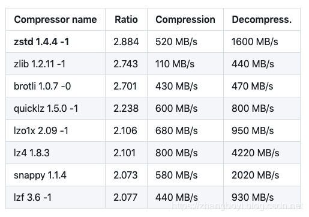

看一个压缩算法的优劣，有两个重要的指标：一个指标是压缩比，原先占 100 份空间的东西经压缩之后变成了占 20 份空间，那么压缩比就是 5，显然压缩比越高越好；另一个指标就是压缩 / 解压缩吞吐量，比如每秒能压缩或解压缩多少 MB 的数据。同样地，吞吐量也是越高越好。

从表中我们可以发现 zstd 算法有着最高的压缩比，而在吞吐量上的表现只能说中规中矩。

反观 LZ4 算法，它在吞吐量方面则是毫无疑问的执牛耳者。

GZIP、Snappy、LZ4 甚至是 zstd 的表现各有千秋。

但对于 Kafka 而言，它们的性能测试结果却出奇得一致，即在吞吐量方面：LZ4 > Snappy > zstd 和 GZIP；

而在压缩比方面，zstd > LZ4 > GZIP > Snappy。 如果网络不好且 CPU 资源够的话,建议使用 zstd 压缩

具体到物理资源，使用 Snappy 算法占用的网络带宽最多，zstd 最少，这是合理的，毕竟 zstd 就是要提供超高的压缩比；

在 CPU 使用率方面，各个算法表现得差不多，只是在压缩时 Snappy 算法使用的 CPU 较多一些，而在解压缩时 GZIP 算法则可能使用更多的 CPU。
### 参考文献
https://blog.csdn.net/zhanglong_4444/article/details/103679803
