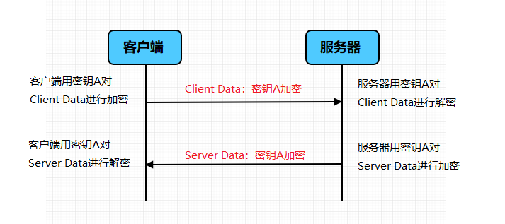
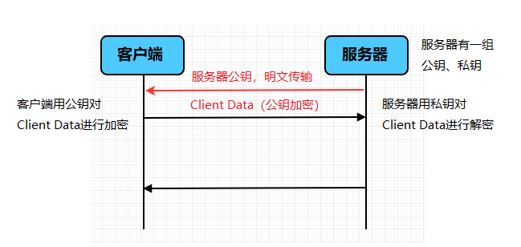
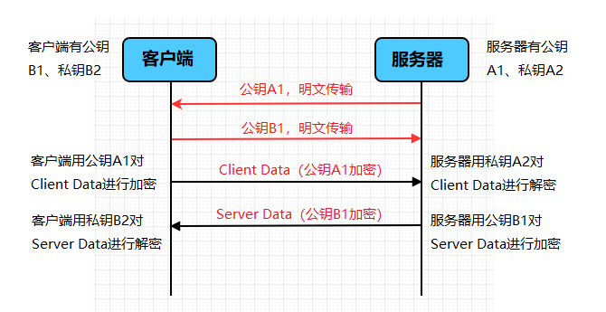
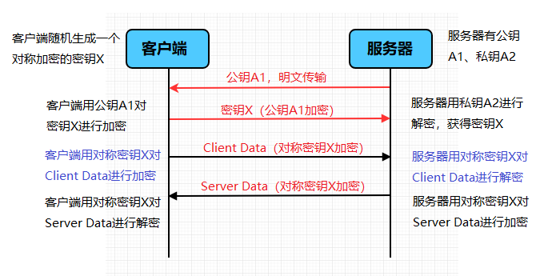
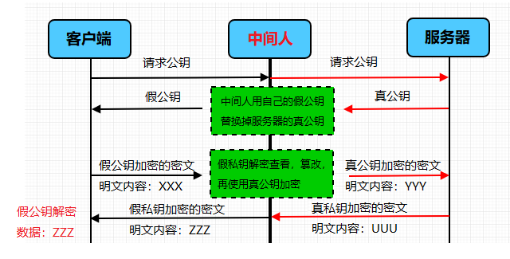
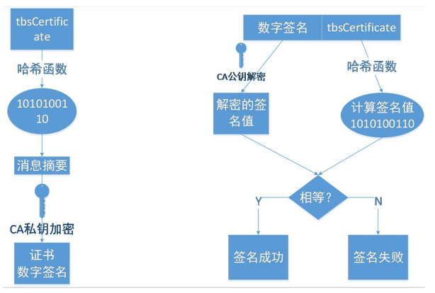
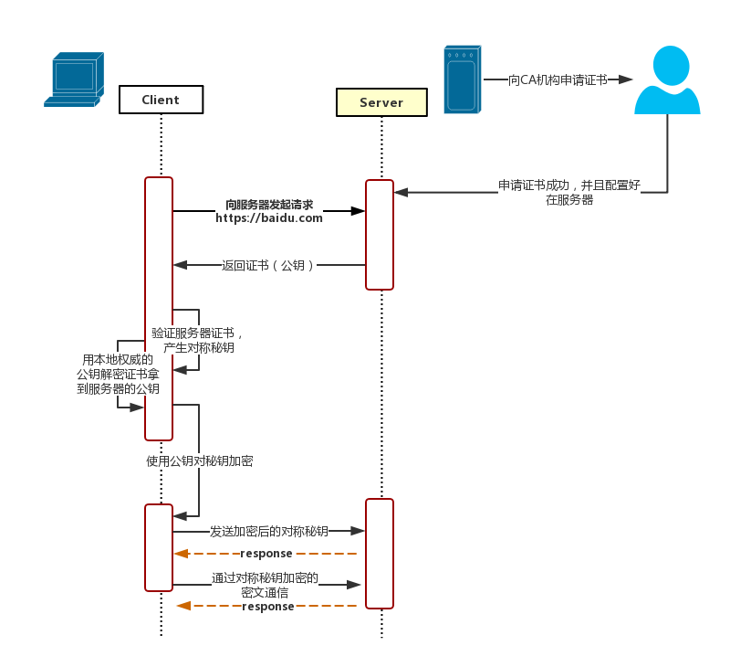

#### 为什么需要加密？
因为http的内容是明文传输的，明文数据会经过中间代理服务器、路由器、wifi热点、通信服务运营商等多个物理节点，如果信息在传输过程中被劫持，传输的内容就完全暴露了，他还可以篡改传输的信息且不被双方察觉，这就是中间人攻击。所以我们才需要对信息进行加密。最简单容易理解的就是对称加密 。
#### 什么是对称加密？
就是有一个密钥，它可以对一段内容加密，加密后只能用它才能解密看到原本的内容，和我们日常生活中用的钥匙作用差不多。

#### 用对称加密可行吗？
如果通信双方都各自持有同一个密钥，且没有别人知道，这两方的通信安全当然是可以被保证的（除非密钥被破解）。

然而最大的问题就是这个密钥怎么让传输的双方知晓，同时不被别人知道。如果由服务器生成一个密钥并传输给浏览器，那这个传输过程中密钥被别人劫持弄到手了怎么办？之后他就能用密钥解开双方传输的任何内容了，所以这么做当然不行。

换种思路？试想一下，如果浏览器内部就预存了网站A的密钥，且可以确保除了浏览器和网站A，不会有任何外人知道该密钥，那理论上用对称加密是可以的，这样浏览器只要预存好世界上所有HTTPS网站的密钥就行啦！这么做显然不现实。

怎么办？所以我们就需要神奇的非对称加密
#### 什么是非对称加密？
有两把密钥，通常一把叫做公钥、一把叫做私钥，用公钥加密的内容必须用私钥才能解开，同样，私钥加密的内容只有公钥能解开。

#### 用非对称加密可行吗？
鉴于非对称加密的机制，我们可能会有这种思路：服务器先把公钥直接明文传输给浏览器，之后浏览器向服务器传数据前都先用这个公钥加密好再传，这条数据的安全似乎可以保障了！因为只有服务器有相应的私钥能解开这条数据。

然而由服务器到浏览器的这条路怎么保障安全？如果服务器用它的的私钥加密数据传给浏览器，那么浏览器用公钥可以解密它，而这个公钥是一开始通过明文传输给浏览器的，这个公钥被谁劫持到的话，他也能用该公钥解密服务器传来的信息了。所以目前似乎只能保证由浏览器向服务器传输数据时的安全性（其实仍有漏洞，下文会说），那利用这点你能想到什么解决方案吗？
#### 改良的非对称加密方案，似乎可以？
我们已经理解通过一组公钥私钥，已经可以保证单个方向传输的安全性，那用两组公钥私钥，是不是就能保证双向传输都安全了？请看下面的过程：

1. 某网站拥有用于非对称加密的公钥A、私钥A’；浏览器拥有用于非对称加密的公钥B、私钥B’。

2. 浏览器像网站服务器请求，服务器把公钥A明文给传输浏览器。

3. 浏览器把公钥B明文传输给服务器。

4. 之后浏览器向服务器传输的所有东西都用公钥A加密，服务器收到后用私钥A’解密。由于只有服务器拥有这个私钥A’可以解密，所以能保证这条数据的安全。

5. 服务器向浏览器传输的所有东西都用公钥B加密，浏览器收到后用私钥B’解密。同上也可以保证这条数据的安全。

的确可以！抛开这里面仍有的漏洞不谈（下文会讲），HTTPS的加密却没使用这种方案，为什么？最主要的原因是非对称加密算法非常耗时，特别是加密解密一些较大数据的时候有些力不从心，而对称加密快很多，看来必须得用对称加密，那我们能不能运用非对称加密的特性解决前面提到的对称加密的问题？
#### 非对称加密+对称加密？
既然非对称加密耗时，非对称加密+对称加密结合可以吗？而且得尽量减少非对称加密的次数。当然是可以的，而且非对称加密、解密各只需用一次即可。请看一下这个过程：

1. 某网站拥有用于非对称加密的公钥A、私钥A’

2. 浏览器向网站服务器请求，服务器把公钥A明文给传输浏览器。

3. 浏览器随机生成一个用于对称加密的密钥X，用公钥A加密后传给服务器。

4. 服务器拿到后用私钥A’解密得到密钥X。

5. 这样双方就都拥有密钥X了，且别人无法知道它。之后双方所有数据都用密钥X加密解密。

完美！HTTPS基本就是采用了这种方案。完美？还是有漏洞的。
#### 中间人攻击
中间人的确无法得到浏览器生成的密钥X，这个密钥本身被公钥A加密了，只有服务器才有私钥A’解开拿到它呀！然而中间人却完全不需要拿到密钥A’就能干坏事了。请看：

1. 某网站拥有用于非对称加密的公钥A、私钥A’。

2. 浏览器向网站服务器请求，服务器把公钥A明文给传输浏览器。

3. 中间人劫持到公钥A，保存下来，把数据包中的公钥A替换成自己伪造的公钥B（它当然也拥有公钥B对应的私钥B’）。

4. 浏览器随机生成一个用于对称加密的密钥X，用公钥B（浏览器不知道公钥被替换了）加密后传给服务器。

5. 中间人劫持后用私钥B’解密得到密钥X，再用公钥A加密后传给服务器。

6. 服务器拿到后用私钥A’解密得到密钥X。

这样在双方都不会发现异常的情况下，中间人得到了密钥X。根本原因是浏览器无法确认自己收到的公钥是不是网站自己的。那么下一步就是解决下面这个问题：
#### 如何证明浏览器收到的公钥一定是该网站的公钥？
现实生活中，如果想证明某身份证号一定是小明的，怎么办？看身份证。这里政府机构起到了“公信”的作用，身份证是由它颁发的，它本身的权威可以对一个人的身份信息作出证明。互联网中能不能搞这么个公信机构呢？给网站颁发一个“身份证”？
#### 数字证书
网站在使用HTTPS前，需要向“CA机构”申请颁发一份数字证书，数字证书里有证书持有者、证书持有者的公钥等信息，服务器把证书传输给浏览器，浏览器从证书里取公钥就行了，证书就如身份证一样，可以证明“该公钥对应该网站”。然而这里又有一个显而易见的问题了，证书本身的传输过程中，如何防止被篡改？即如何证明证书本身的真实性？身份证有一些防伪技术，数字证书怎么防伪呢？解决这个问题我们就基本接近胜利了！
#### 如何防止数字证书被篡改？
我们把证书内容生成一份“签名”，比对证书内容和签名是否一致就能察觉是否被篡改。这种技术就叫数字签名：
#### 数字签名
这部分内容建议看下图并结合后面的文字理解，图中左侧是数字签名的制作过程，右侧是验证过程

#### 数字签名的制作过程：
1. CA（证书颁发机构）拥有非对称加密的私钥和公钥。

2. CA对证书明文信息进行hash。

3. 对hash后的值用私钥加密，得到数字签名。

明文和数字签名共同组成了数字证书，这样一份数字证书就可以颁发给网站了。

那浏览器拿到服务器传来的数字证书后，如何验证它是不是真的？（有没有被篡改、掉包）
#### 浏览器验证过程
1. 拿到证书，得到明文T，数字签名S。

2. 用CA机构的公钥对S解密（由于是浏览器信任的机构，所以浏览器保有它的公钥。详情见下文），得到S’。

3. 用证书里说明的hash算法对明文T进行hash得到T’。

4. 比较S’是否等于T’，等于则表明证书可信。

为什么这样可以证明证书可信呢？我们来仔细想一下。
#### 中间人有可能篡改该证书吗？
假设中间人篡改了证书的原文，由于他没有CA机构的私钥，所以无法得到此时加密后签名，无法相应地篡改签名。浏览器收到该证书后会发现原文和签名解密后的值不一致，则说明证书已被篡改，证书不可信，从而终止向服务器传输信息，防止信息泄露给中间人。

既然不可能篡改，那整个证书被掉包呢？
#### 中间人有可能把证书掉包吗？
假设有另一个网站B也拿到了CA机构认证的证书，它想搞垮网站A，想劫持网站A的信息。于是它成为中间人拦截到了A传给浏览器的证书，然后替换成自己的证书，传给浏览器，之后浏览器就会错误地拿到B的证书里的公钥了，会导致上文提到的漏洞。

其实这并不会发生，因为证书里包含了网站A的信息，包括域名，浏览器把证书里的域名与自己请求的域名比对一下就知道有没有被掉包了。
#### 为什么制作数字签名时需要hash一次？
最显然的是性能问题，前面我们已经说了非对称加密效率较差，证书信息一般较长，比较耗时。而hash后得到的是固定长度的信息（比如用md5算法hash后可以得到固定的128位的值），这样加密解密就会快很多。

还有安全上的原因
#### 怎么证明CA机构的公钥是可信的？
你们可能会发现上文中说到CA机构的公钥，我几乎一笔带过，“浏览器保有它的公钥”，这是个什么保有法？怎么证明这个公钥是否可信？

让我们回想一下数字证书到底是干啥的？没错，为了证明某公钥是可信的，即“该公钥是否对应该网站/机构等”，那这个CA机构的公钥是不是也可以用数字证书来证明？没错，操作系统、浏览器本身会预装一些它们信任的根证书，如果其中有该CA机构的根证书，那就可以拿到它对应的可信公钥了。

实际上证书之间的认证也可以不止一层，可以A信任B，B信任C，以此类推，我们把它叫做信任链或数字证书链，也就是一连串的数字证书，由根证书为起点，透过层层信任，使终端实体证书的持有者可以获得转授的信任，以证明身份。

另外，不知你们是否遇到过网站访问不了、提示要安装证书的情况？这里安装的就是根证书。说明浏览器不认给这个网站颁发证书的机构，那么没有该机构的根证书，你就得手动下载安装（风险自己承担）。安装该机构的根证书后，你就有了它的公钥，就可以用它验证服务器发来的证书是否可信了。
#### HTTPS必须在每次请求中都要先在SSL/TLS层进行握手传输密钥吗？
这也是我当时的困惑之一，显然每次请求都经历一次密钥传输过程非常耗时，那怎么达到只传输一次呢？用session就行。

服务器会为每个浏览器（或客户端软件）维护一个session ID，在TSL握手阶段传给浏览器，浏览器生成好密钥传给服务器后，服务器会把该密钥存到相应的session ID下，之后浏览器每次请求都会携带session ID，服务器会根据session ID找到相应的密钥并进行解密加密操作，这样就不必要每次重新制作、传输密钥了！
#### HTTPS中的Hash算法与加密算法
对称秘钥常用算法：DES、3DES、AES、Blowfish、IDEA、RC5、RC6

非对称加密算法：RSA、Elgamal、背包算法、Rabin、D-H、ECC（椭圆曲线加密算法）

HASH算法一般有：MD5，SHA1，SHA256 
#### 总结

1. client向server发送请求https://baidu.com，然后连接到server的443端口。

2. 服务端必须要有一套数字证书，可以自己制作，也可以向组织申请。区别就是自己颁发的证书需要客户端验证通过，才可以继续访问，而使用受信任的公司申请的证书则不会弹出提示页面，这套证书其实就是一对公钥和私钥。

3. 传送证书。这个证书其实就是公钥，只是包含了很多信息，如证书的颁发机构，过期时间、服务端的公钥，第三方证书认证机构(CA)的签名，服务端的域名信息等内容。

4. 客户端解析证书。这部分工作是由客户端的TLS来完成的，首先会验证公钥是否有效，比如颁发机构，过期时间等等，如果发现异常，则会弹出一个警告框，提示证书存在问题。如果证书没有问题，那么就生成一个随机值（密钥）。然后用证书对该随机值进行加密。

5. 传送加密信息。这部分传送的是用证书加密后的密钥（随机值），目的就是让服务端得到这个密钥（随机值），以后客户端和服务端的通信就可以通过这个随机值来进行加密解密了。

6. 服务端加密信息。服务端用私钥解密，得到了客户端传过来的密钥（随机值），然后把内容通过该值进行对称加密。

7. 传输加密后的信息。这部分信息是服务端用密钥（随机值）对称加密后的信息，可以在客户端被还原。

8. 客户端解密信息。客户端用之前生成的密钥（随机值）解密服务端传过来的信息，于是获取了解密后的内容。

#### 参考文献
https://zhuanlan.zhihu.com/p/43789231

https://www.cnblogs.com/sxiszero/p/11133747.html

https://blog.csdn.net/guizaijianchic/article/details/77961418
