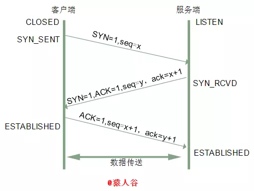
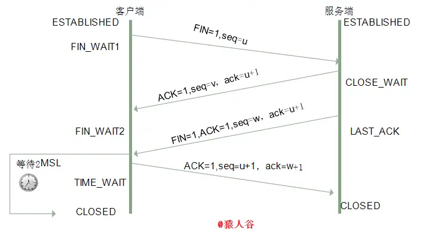
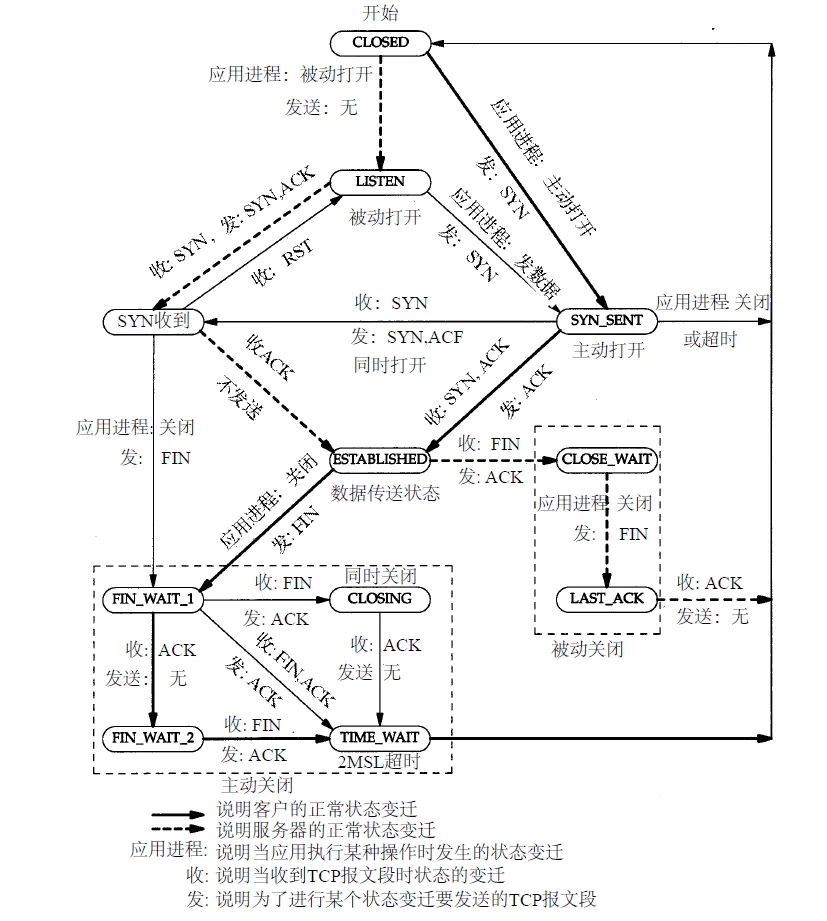

### 三次握手
三次握手（Three-way Handshake）其实就是指建立一个TCP连接时，需要客户端和服务器总共发送3个包。进行三次握手的主要作用就是为了确认双方的接收能力和发送能力是否正常、指定自己的初始化序列号为后面的可靠性传送做准备。实质上其实就是连接服务器指定端口，建立TCP连接，并同步连接双方的序列号和确认号，交换TCP窗口大小信息。

刚开始客户端处于 Closed 的状态，服务端处于 Listen 状态。 进行三次握手：

* 第一次握手：客户端给服务端发一个 SYN 报文，并指明客户端的初始化序列号 ISN(c)。此时客户端处于 SYN_SEND 状态。

首部的同步位SYN=1，初始序号seq=x，SYN=1的报文段不能携带数据，但要消耗掉一个序号。

* 第二次握手：服务器收到客户端的 SYN 报文之后，会以自己的 SYN 报文作为应答，并且也是指定了自己的初始化序列号 ISN(s)。同时会把客户端的 ISN + 1 作为ACK 的值，表示自己已经收到了客户端的 SYN，此时服务器处于 SYN_REVD 的状态。

在确认报文段中SYN=1，ACK=1，确认号ack=x+1，初始序号seq=y。

* 第三次握手：客户端收到 SYN 报文之后，会发送一个 ACK 报文，当然，也是一样把服务器的 ISN + 1 作为 ACK 的值，表示已经收到了服务端的 SYN 报文，此时客户端处于 ESTABLISHED 状态。服务器收到 ACK 报文之后，也处于 ESTABLISHED 状态，此时，双方已建立起了连接。

确认报文段ACK=1，确认号ack=y+1，序号seq=x+1（初始为seq=x，第二个报文段所以要+1），ACK报文段可以携带数据，不携带数据则不消耗序号。

发送第一个SYN的一端将执行主动打开（active open），接收这个SYN并发回下一个SYN的另一端执行被动打开（passive open）。

在socket编程中，客户端执行connect()时，将触发三次握手。


#### 为什么需要三次握手，两次不行吗？
* 需要三次握手才能确认双方的接收与发送能力是否正常。
* 某些网络结点长时间滞留了，延误到连接释放以后的某个时间才到达服务端
* 通信双方确定序列号

#### 什么是半连接队列？
服务器第一次收到客户端的 SYN 之后，就会处于 SYN_RCVD 状态，此时双方还没有完全建立其连接，服务器会把此种状态下请求连接放在一个队列里，我们把这种队列称之为半连接队列。

当然还有一个全连接队列，就是已经完成三次握手，建立起连接的就会放在全连接队列中。如果队列满了就有可能会出现丢包现象。

这里在补充一点关于SYN-ACK 重传次数的问题： 服务器发送完SYN-ACK包，如果未收到客户确认包，服务器进行首次重传，等待一段时间仍未收到客户确认包，进行第二次重传。如果重传次数超过系统规定的最大重传次数，系统将该连接信息从半连接队列中删除。 注意，每次重传等待的时间不一定相同，一般会是指数增长，例如间隔时间为 1s，2s，4s，8s......
#### ISN(Initial Sequence Number)是固定的吗？
当一端为建立连接而发送它的SYN时，它为连接选择一个初始序号。ISN随时间而变化，因此每个连接都将具有不同的ISN。ISN可以看作是一个32比特的计数器，每4ms加1 。这样选择序号的目的在于防止在网络中被延迟的分组在以后又被传送，而导致某个连接的一方对它做错误的解释。

三次握手的其中一个重要功能是客户端和服务端交换 ISN(Initial Sequence Number)，以便让对方知道接下来接收数据的时候如何按序列号组装数据。如果 ISN 是固定的，攻击者很容易猜出后续的确认号，因此 ISN 是动态生成的。
#### 三次握手过程中可以携带数据吗？
其实第三次握手的时候，是可以携带数据的。但是，第一次、第二次握手不可以携带数据

为什么这样呢?大家可以想一个问题，假如第一次握手可以携带数据的话，如果有人要恶意攻击服务器，那他每次都在第一次握手中的 SYN 报文中放入大量的数据。因为攻击者根本就不理服务器的接收、发送能力是否正常，然后疯狂着重复发 SYN 报文的话，这会让服务器花费很多时间、内存空间来接收这些报文。

也就是说，第一次握手不可以放数据，其中一个简单的原因就是会让服务器更加容易受到攻击了。而对于第三次的话，此时客户端已经处于 ESTABLISHED 状态。对于客户端来说，他已经建立起连接了，并且也已经知道服务器的接收、发送能力是正常的了，所以能携带数据也没啥毛病。
#### SYN攻击是什么？
服务器端的资源分配是在二次握手时分配的，而客户端的资源是在完成三次握手时分配的，所以服务器容易受到SYN洪泛攻击。SYN攻击就是Client在短时间内伪造大量不存在的IP地址，并向Server不断地发送SYN包，Server则回复确认包，并等待Client确认，由于源地址不存在，因此Server需要不断重发直至超时，这些伪造的SYN包将长时间占用未连接队列，导致正常的SYN请求因为队列满而被丢弃，从而引起网络拥塞甚至系统瘫痪。SYN 攻击是一种典型的 DoS/DDoS 攻击。

检测 SYN 攻击非常的方便，当你在服务器上看到大量的半连接状态时，特别是源IP地址是随机的，基本上可以断定这是一次SYN攻击。在 Linux/Unix 上可以使用系统自带的 netstats 命令来检测 SYN 攻击。
```shell
netstat -n -p TCP | grep SYN_RECV
```

常见的防御 SYN 攻击的方法有如下几种：

* 缩短超时（SYN Timeout）时间
* 增加最大半连接数
* 过滤网关防护
* SYN cookies技术

### 四次挥手
建立一个连接需要三次握手，而终止一个连接要经过四次挥手（也有将四次挥手叫做四次握手的）。这由TCP的半关闭（half-close）造成的。所谓的半关闭，其实就是TCP提供了连接的一端在结束它的发送后还能接收来自另一端数据的能力。

TCP 的连接的拆除需要发送四个包，因此称为四次挥手(Four-way handshake)，客户端或服务器均可主动发起挥手动作。

刚开始双方都处于 ESTABLISHED 状态，假如是客户端先发起关闭请求。四次挥手的过程如下：

* 第一次挥手：客户端发送一个 FIN 报文，报文中会指定一个序列号。此时客户端处于 FIN_WAIT1 状态。 即发出连接释放报文段（FIN=1，序号seq=u），并停止再发送数据，主动关闭TCP连接，进入FIN_WAIT1（终止等待1）状态，等待服务端的确认。
* 第二次挥手：服务端收到 FIN 之后，会发送 ACK 报文，且把客户端的序列号值 +1 作为 ACK 报文的序列号值，表明已经收到客户端的报文了，此时服务端处于 CLOSE_WAIT 状态。 即服务端收到连接释放报文段后即发出确认报文段（ACK=1，确认号ack=u+1，序号seq=v），服务端进入CLOSE_WAIT（关闭等待）状态，此时的TCP处于半关闭状态，客户端到服务端的连接释放。客户端收到服务端的确认后，进入FIN_WAIT2（终止等待2）状态，等待服务端发出的连接释放报文段。
* 第三次挥手：如果服务端也想断开连接了，和客户端的第一次挥手一样，发给 FIN 报文，且指定一个序列号。此时服务端处于 LAST_ACK 的状态。即服务端没有要向客户端发出的数据，服务端发出连接释放报文段（FIN=1，ACK=1，序号seq=w，确认号ack=u+1），服务端进入LAST_ACK（最后确认）状态，等待客户端的确认。
* 第四次挥手：客户端收到 FIN 之后，一样发送一个 ACK 报文作为应答，且把服务端的序列号值 +1 作为自己 ACK 报文的序列号值，此时客户端处于 TIME_WAIT 状态。需要过一阵子以确保服务端收到自己的 ACK 报文之后才会进入 CLOSED 状态，服务端收到 ACK 报文之后，就处于关闭连接了，处于 CLOSED 状态。 即客户端收到服务端的连接释放报文段后，对此发出确认报文段（ACK=1，seq=u+1，ack=w+1），客户端进入TIME_WAIT（时间等待）状态。此时TCP未释放掉，需要经过时间等待计时器设置的时间2MSL后，客户端才进入CLOSED状态。

收到一个FIN只意味着在这一方向上没有数据流动。客户端执行主动关闭并进入TIME_WAIT是正常的，服务端通常执行被动关闭，不会进入TIME_WAIT状态。

在socket编程中，任何一方执行close()操作即可产生挥手操作。


#### 挥手为什么需要四次？
因为当服务端收到客户端的SYN连接请求报文后，可以直接发送SYN+ACK报文。其中ACK报文是用来应答的，SYN报文是用来同步的。但是关闭连接时，当服务端收到FIN报文时，很可能并不会立即关闭SOCKET，所以只能先回复一个ACK报文，告诉客户端，"你发的FIN报文我收到了"。只有等到我服务端所有的报文都发送完了，我才能发送FIN报文，因此不能一起发送。故需要四次挥手。
#### 2MSL等待状态
TIME_WAIT状态也成为2MSL等待状态。每个具体TCP实现必须选择一个报文段最大生存时间MSL（Maximum Segment Lifetime），它是任何报文段被丢弃前在网络内的最长时间。这个时间是有限的，因为TCP报文段以IP数据报在网络内传输，而IP数据报则有限制其生存时间的TTL字段。

对一个具体实现所给定的MSL值，处理的原则是：当TCP执行一个主动关闭，并发回最后一个ACK，该连接必须在TIME_WAIT状态停留的时间为2倍的MSL。这样可让TCP再次发送最后的ACK以防这个ACK丢失（另一端超时并重发最后的FIN）。

这种2MSL等待的另一个结果是这个TCP连接在2MSL等待期间，定义这个连接的插口（客户的IP地址和端口号，服务器的IP地址和端口号）不能再被使用。这个连接只能在2MSL结束后才能再被使用。
#### 四次挥手释放连接时，等待2MSL的意义?
为了保证客户端发送的最后一个ACK报文段能够到达服务器。因为这个ACK有可能丢失，从而导致处在LAST-ACK状态的服务器收不到对FIN-ACK的确认报文。服务器会超时重传这个FIN-ACK，接着客户端再重传一次确认，重新启动时间等待计时器。最后客户端和服务器都能正常的关闭。假设客户端不等待2MSL，而是在发送完ACK之后直接释放关闭，一但这个ACK丢失的话，服务器就无法正常的进入关闭连接状态。

两个理由：

1. 保证客户端发送的最后一个ACK报文段能够到达服务端。 这个ACK报文段有可能丢失，使得处于LAST-ACK状态的B收不到对已发送的FIN+ACK报文段的确认，服务端超时重传FIN+ACK报文段，而客户端能在2MSL时间内收到这个重传的FIN+ACK报文段，接着客户端重传一次确认，重新启动2MSL计时器，最后客户端和服务端都进入到CLOSED状态，若客户端在TIME-WAIT状态不等待一段时间，而是发送完ACK报文段后立即释放连接，则无法收到服务端重传的FIN+ACK报文段，所以不会再发送一次确认报文段，则服务端无法正常进入到CLOSED状态。

2. 防止“已失效的连接请求报文段”出现在本连接中。 客户端在发送完最后一个ACK报文段后，再经过2MSL，就可以使本连接持续的时间内所产生的所有报文段都从网络中消失，使下一个新的连接中不会出现这种旧的连接请求报文段。

#### time_wait过多
这种情况比较常见，一般会出现在爬虫服务器和web服务器(如果没做内核参数优化的话)上，那么这种问题是怎么产生的呢？

time_wait是主动关闭连接的一方保持的状态，对于爬虫服务器来说它自身就是客户端，在完成一个爬取任务后就会发起主动关闭连接，从而进入time_wait状态，然后保持这个状态2MSL时间之后，彻底关闭回收资源。这里为什么会保持资源2MSL时间呢？这也是TCP/IP设计者规定的。

time_wait问题可以通过调整内核参数和适当的设置web服务器的keep-Alive值来解决。

#### close_wait过多
close_wait状态出现的原因是被动关闭方未关闭socket造成。

快速的解决方法是：

* 关闭正在运行的程序，这个需要视业务情况而定。
* 尽快的修改程序里的bug，然后测试提交到线上服务器。

### 总结
《TCP/IP详解 卷1:协议》有一张TCP状态变迁图，很具有代表性，有助于大家理解三次握手和四次挥手的状态变化。如下图所示，粗的实线箭头表示正常的客户端状态变迁，粗的虚线箭头表示正常的服务器状态变迁。



Linux系统中分给每个用户的文件句柄数是有限的，而TIME_WAIT和CLOSE_WAIT这两种状态如果一直被保持，那么意味着对应数目的通道(此处应理解为socket，一般一个socket会占用服务器端一个端口，服务器端的端口最大数是65535)一直被占用，一旦达到了上限，则新的请求就无法被处理，接着就是大量Too Many Open Files异常
### 参考文献
https://juejin.im/post/5d9c284b518825095879e7a5

https://www.jianshu.com/p/394cafc91d18
